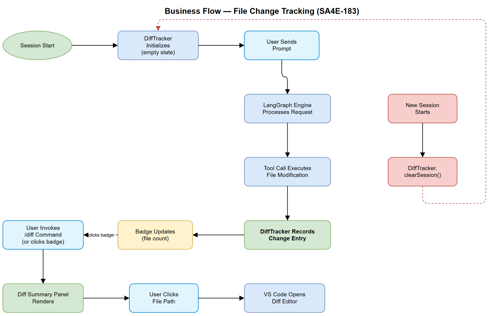
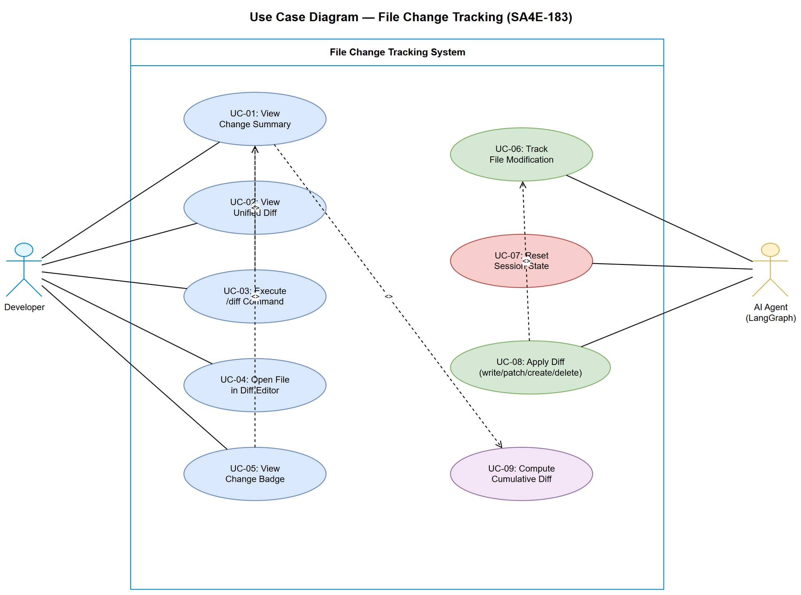

# Business Requirements Document (BRD)

## SDLC-Agents-4-Enterprise — SA4E-183: File Change Tracking — Session-wide diff summary visualization

---

## Document Information

| Field | Value |
|-------|-------|
| Jira Ticket | SA4E-183 |
| Title | File Change Tracking — Session-wide diff summary visualization |
| Author | BA Agent |
| Version | 1.0 |
| Date | 2025-07-27 |
| Status | Draft |

---

## Author Tracking

| Role | Name - Position | Responsibility |
|------|-----------------|----------------|
| Author | BA Agent – Business Analyst | Create document |
| Peer Reviewer | TA Agent – Technical Architect | Review document |

---

## Revision History

| Version | Date | Author | Changes |
|---------|------|--------|---------|
| 1.0 | 2025-07-27 | BA Agent | Initiate document — auto-generated from Jira ticket SA4E-183 |

---

## Sign-Off

| Name | Signature and date |
|------|--------------------|
| | ☐ I agree and confirm all criteria on this BRD as expected requirements |
| | ☐ I agree and confirm all criteria on this BRD as expected requirements |

---

## 1. Introduction

### 1.1 Scope

This feature introduces a **File Change Tracking** system that aggregates all file modifications (writes, patches, creates, deletes) performed by the AI agent during a chat session and provides a **diff summary visualization** accessible via the `/diff` command and a dedicated UI panel. The feature gives users full visibility into what the agent has changed in their workspace during the current session.

### 1.2 Out of Scope

- Cross-session change persistence (changes are reset on new session)
- Git integration (staging, committing tracked changes)
- Undo/revert functionality from the diff panel (users use VS Code native undo)
- Tracking changes made by the user outside of agent tool calls
- Conflict resolution with external editors

### 1.3 Preliminary Requirement

- `OpenCodeToolHandler.applyDiff()` already tracks individual diff applications (SA4E-85)
- Session lifecycle managed by `SessionManager` (thread-based sessions via Backend KB)
- Webview infrastructure (Svelte 4 + Vite) exists for chat panel components
- Slash command system (KSA-254) supports registering new `/` commands

---

## 2. Business Requirements

### 2.1 High Level Process Map

The File Change Tracking feature operates as a passive observer during the agent's tool execution. Every time the agent modifies a file (via `applyDiff`, file write, file create, or file delete), the `DiffTracker` service records the operation with metadata. Users can inspect the aggregated changes at any time via the `/diff` command or a badge indicator in the chat header.

### 2.2 List of User Stories / Use Cases

| # | Story / Use Case / Epic | Priority | Source Ticket |
|---|-------------------------|----------|---------------|
| 1 | As a developer, I want to see a summary of all files the agent has modified so that I can review changes before committing | MUST HAVE | SA4E-183 |
| 2 | As a developer, I want to view unified diffs per file so that I understand exactly what changed | MUST HAVE | SA4E-183 |
| 3 | As a developer, I want a `/diff` command to quickly open the change summary | MUST HAVE | SA4E-183 |
| 4 | As a developer, I want clickable file paths that open the diff in VS Code editor so that I can navigate to changes | MUST HAVE | SA4E-183 |
| 5 | As a developer, I want a badge/indicator showing pending changes count so that I'm always aware of modifications | MUST HAVE | SA4E-183 |
| 6 | As a developer, I want the tracker to reset on new session so that each session starts with a clean slate | MUST HAVE | SA4E-183 |
| 7 | As a developer, I want changes grouped by operation type (added/modified/deleted) so that I can quickly scan the impact | SHOULD HAVE | SA4E-183 |

---

### 2.3 Details of User Stories

---

#### Business Flow

**Step 1:** User starts a new chat session (or session is resumed via hydration). DiffTracker initializes with empty state.

**Step 2:** User sends a prompt requesting code changes (e.g., "add validation to the login form").

**Step 3:** LangGraph engine processes the prompt and invokes tool calls (write_file, apply_diff, create_file, delete_file).

**Step 4:** `OpenCodeToolHandler` (or equivalent tool handler) executes the file modification. On success, it emits a change event to `DiffTracker`.

**Step 5:** `DiffTracker` records the change entry: file path, operation type, line counts (added/removed), timestamp, and diff content.

**Step 6:** The webview badge indicator updates to show the current pending changes count.

**Step 7:** User invokes `/diff` command (or clicks the badge).

**Step 8:** Diff viewer panel renders: summary table (files added/modified/deleted + line counts) followed by expandable unified diff per file.

**Step 9:** User clicks a file path in the diff viewer → VS Code opens the native diff editor for that file.

**Step 10:** When a new session starts, `DiffTracker.clearSession()` resets all tracked changes.

> **Note:** The tracker records changes regardless of whether the diff was applied successfully or rejected. Only successfully applied changes appear in the summary.

---

#### STORY 1: Session-wide Change Summary

> As a developer, I want to see a summary of all files the agent has modified so that I can review changes before committing.

**Requirement Details:**

1. The system SHALL track all successful file modifications performed by agent tool calls during the current session
2. The summary SHALL display: total files changed, files added (new), files modified, files deleted
3. For each file, the summary SHALL show: file path (workspace-relative), operation type, lines added count, lines removed count
4. The summary SHALL be accessible via the `/diff` slash command
5. The summary SHALL update in real-time as new changes occur during the session

**Data Fields:**

| Field | Type | Required | Description | Example |
|-------|------|----------|-------------|---------|
| filePath | string | Yes | Workspace-relative file path | `src/services/AuthService.ts` |
| operation | enum | Yes | Type of file operation | `added` / `modified` / `deleted` |
| linesAdded | number | Yes | Count of lines added | `42` |
| linesRemoved | number | Yes | Count of lines removed | `15` |
| timestamp | number | Yes | Date.now() when change was recorded | `1722076800000` |
| diffContent | string | Yes | Unified diff patch content | `@@ -10,3 +10,5 @@...` |

**Acceptance Criteria:**

1. Given a session with 3 file modifications, when user runs `/diff`, then the summary shows all 3 files with correct operation types and line counts
2. Given no changes in the session, when user runs `/diff`, then the panel shows "No changes in this session" message
3. Given a file modified multiple times, the summary shows the cumulative diff (latest state vs original)
4. Given a new session starts, all previously tracked changes are cleared

---

#### STORY 2: Unified Diff Viewer per File

> As a developer, I want to view unified diffs per file so that I understand exactly what changed.

**Requirement Details:**

1. Each file in the summary SHALL be expandable to reveal its unified diff content
2. The diff SHALL use standard unified diff format (context lines + additions in green + removals in red)
3. The diff SHALL show the cumulative change from original file state (at session start) to current state
4. Syntax highlighting SHALL be applied based on file extension
5. Large diffs (>500 lines) SHALL be collapsed by default with a "Show full diff" expansion control

**Acceptance Criteria:**

1. Given a modified file, when user expands it in the diff viewer, then the unified diff renders with proper color coding (green for additions, red for removals)
2. Given a newly created file, the diff shows all content as additions (green)
3. Given a deleted file, the diff shows all content as removals (red)
4. Given a file with >500 diff lines, it is collapsed by default with line count shown

---

#### STORY 3: `/diff` Slash Command

> As a developer, I want a `/diff` command to quickly open the change summary.

**Requirement Details:**

1. The `/diff` command SHALL be registered in the slash command system (KSA-254)
2. Invoking `/diff` SHALL render the diff summary panel inline in the chat area (expandable section)
3. The command SHALL work regardless of streaming state (can be invoked while agent is responding)
4. The command SHALL appear in the slash command autocomplete menu with description "Show session file changes"

**Acceptance Criteria:**

1. Given user types `/diff`, the slash command autocomplete shows the option with correct description
2. Given user executes `/diff`, the diff summary panel renders within 200ms
3. Given `/diff` is executed during active streaming, it still renders without interrupting the stream

**UI Specifications:**

| No. | Name | Type | Required | Description | Note |
|-----|------|------|----------|-------------|------|
| 1 | /diff command | Slash Command | Yes | Opens diff summary panel | Registered in SLASH_COMMANDS array |
| 2 | Summary section | Expandable panel | Yes | Shows file list with stats | Collapsible, open by default |
| 3 | File row | List item | Yes | Shows path + operation badge + line counts | Clickable |
| 4 | Diff content | Code block | Yes | Unified diff per file | Expandable, syntax highlighted |

---

#### STORY 4: Clickable File Paths

> As a developer, I want clickable file paths that open the diff in VS Code editor so that I can navigate to changes.

**Requirement Details:**

1. Each file path in the diff summary SHALL be clickable
2. Clicking a file path SHALL open the VS Code diff editor showing the change (original vs current)
3. The diff editor SHALL use VS Code's native `vscode.diff` command for familiar UX
4. If the file was deleted, clicking SHALL show a notification that the file no longer exists
5. If the file was newly created, clicking SHALL open the file directly (no diff, as there's no original)

**Acceptance Criteria:**

1. Given a modified file in the summary, when user clicks its path, then VS Code opens the diff editor with original (left) vs current (right)
2. Given a newly created file, clicking opens the file in normal editor
3. Given a deleted file, clicking shows an information notification "File has been deleted"

---

#### STORY 5: Badge/Indicator for Pending Changes

> As a developer, I want a badge/indicator showing pending changes count so that I'm always aware of modifications.

**Requirement Details:**

1. A badge SHALL appear in the chat header area showing the count of changed files
2. The badge SHALL update in real-time as changes are tracked
3. The badge SHALL be hidden when count is 0 (no changes in session)
4. Clicking the badge SHALL open the diff summary panel (same as `/diff`)
5. The badge SHALL use a file-edit icon with a numeric counter

**Acceptance Criteria:**

1. Given 0 changes, the badge is not visible
2. Given 5 file changes, the badge shows "5" with the file icon
3. Given a new change is tracked, the badge count increments immediately (within 100ms)
4. Given user clicks the badge, the diff summary panel opens

**UI Specifications:**

| No. | Name | Type | Required | Description | Note |
|-----|------|------|----------|-------------|------|
| 1 | Change badge | Badge + Icon | Yes | Shows file count in chat header | Hidden when count = 0 |
| 2 | Badge icon | codicon | Yes | Uses `files` or `diff` codicon | VS Code icon set |
| 3 | Badge count | Number | Yes | Numeric file count | Updates reactively |

---

#### STORY 6: Session Scope Reset

> As a developer, I want the tracker to reset on new session so that each session starts with a clean slate.

**Requirement Details:**

1. When a new session starts (new thread created via SessionManager), the DiffTracker SHALL clear all tracked changes
2. The badge SHALL reset to 0 (hidden)
3. The diff summary panel SHALL show empty state if opened after reset
4. Session resumption (hydration of existing thread) SHALL NOT reset the tracker — only brand new sessions reset

**Acceptance Criteria:**

1. Given an active session with 10 tracked changes, when a new session starts, then DiffTracker has 0 entries
2. Given session hydration (resume), the tracker preserves any changes from the current session state
3. Given VS Code window reload within same session, tracked changes are preserved if session is hydrated

---

#### STORY 7: Changes Grouped by Operation Type

> As a developer, I want changes grouped by operation type so that I can quickly scan the impact.

**Requirement Details:**

1. The diff summary SHALL group files into sections: Added, Modified, Deleted
2. Each section SHALL show the file count for that operation type
3. Sections with 0 files SHALL be hidden
4. Within each section, files SHALL be sorted alphabetically by path

**Acceptance Criteria:**

1. Given 2 added, 3 modified, 1 deleted file, the summary shows 3 sections with correct counts
2. Given only modified files, only the "Modified" section appears
3. Files within each section are in alphabetical order

---

## 3. Dependencies

| Dependency | Type | Related Ticket | Description |
|------------|------|----------------|-------------|
| OpenCodeToolHandler | System | SA4E-85 | Existing diff application mechanism — hook point for tracking |
| SessionManager | System | SA4E-85 | Session lifecycle management — reset trigger |
| Slash Command System | System | KSA-254 | Registration of `/diff` command |
| Webview Infrastructure | System | SA4E-85 | Svelte 4 + Vite webview for UI components |
| LangGraph Engine | System | SA4E-85 | Tool execution pipeline — source of file change events |
| VS Code Diff Editor | External | N/A | Native VS Code API for opening diff views |

---

## 4. Stakeholders

| Role | Name / Team | Responsibility | Source |
|------|-------------|----------------|--------|
| Developer (End User) | Development Team | Primary user of diff tracking feature | End user |
| Product Owner | PO | Approve requirements and UAT | Jira reporter |
| Tech Lead | SA Agent | Architecture and design decisions | Technical review |

---

## 5. Risks and Assumptions

### 5.1 Risks

| Risk | Impact | Likelihood | Mitigation |
|------|--------|------------|------------|
| Large sessions with many changes may consume significant memory | Medium | Low | Implement size limit (max 100 tracked files) with oldest eviction |
| Multiple rapid file changes may cause UI flicker on badge updates | Low | Medium | Debounce badge updates (100ms) |
| Cumulative diff computation may be slow for large files | Medium | Low | Lazy compute diff only when panel is opened, cache result |
| Session hydration may not restore diff state (stateless Backend KB threads) | Medium | Medium | Store minimal diff metadata in session state or accept reset on reload |

### 5.2 Assumptions

- The `OpenCodeToolHandler.applyDiff()` method is the single entry point for all file modifications made by the agent
- File create and delete operations also flow through identifiable tool handler methods
- The webview and extension host communicate via the existing PostMessage bridge
- VS Code's `vscode.diff` command is available and stable across supported VS Code versions
- Sessions rarely exceed 50 file changes in a single session

---

## 6. Non-Functional Requirements

| Category | Requirement | Details |
|----------|-------------|---------|
| Performance | Badge update latency | Badge SHALL update within 100ms of a tracked change |
| Performance | `/diff` panel render time | Panel SHALL render within 200ms for up to 50 files |
| Performance | Memory usage | DiffTracker SHALL not exceed 10MB memory for tracked changes |
| Scalability | Max tracked files | Support up to 100 files per session; beyond 100, oldest entries are evicted |
| Usability | Accessibility | Diff panel SHALL be keyboard navigable (Tab, Enter, Escape) |
| Usability | Screen reader | Badge and panel SHALL have appropriate ARIA labels |
| Reliability | No data loss | Tracked changes SHALL persist within the session (no silent drops) |

---

## 7. Related Tickets

| Ticket Key | Summary | Status | Type | Relationship |
|------------|---------|--------|------|--------------|
| SA4E-183 | File Change Tracking — Session-wide diff summary visualization | To Do | Story | Main ticket |
| SA4E-85 | Agentic Chat — Core Implementation | Done | Epic | Depends on (OpenCodeToolHandler, SessionManager, Webview) |
| KSA-254 | Slash Command Menu | Done | Story | Depends on (command registration system) |

---

## 8. Appendix

### Use Case Diagram

### Glossary

| Term | Definition |
|------|------------|
| DiffTracker | Service that aggregates all file modifications made by the agent during a session. Responsible for recording, grouping, and providing change data to the UI. Avoid: ChangeLogger, FileWatcher, ModificationTracker |
| Change Entry | A single record representing one file modification operation (create, modify, or delete) with associated metadata (path, line counts, diff content). Avoid: DiffRecord, FileEvent, Modification |
| Diff Summary | The aggregated view of all change entries in a session, grouped by operation type with total statistics. Rendered by the `/diff` command. Avoid: Change Report, Modification List |
| Session Scope | The lifecycle boundary within which changes are tracked — starts when a new chat session begins and resets when a new session is created. Avoid: Window Scope, Global Scope |
| Unified Diff | Standard patch format showing context lines, additions (+), and removals (-) for a file change. Used in the expandable per-file detail view. Avoid: Patch, Delta, Change Content |
| Change Badge | The numeric indicator in the chat header showing the count of files modified in the current session. Hidden when count is 0. Avoid: Notification, Counter, Status Icon |

### Diagram Index

| # | Diagram | Image | Source (editable) |
|---|---------|-------|-------------------|
| 1 | Business Flow | [business-flow.png](diagrams/business-flow.png) | [business-flow.drawio](diagrams/business-flow.drawio) |
| 2 | Use Case | [use-case.png](diagrams/use-case.png) | [use-case.drawio](diagrams/use-case.drawio) |

### Reference Documents

| Document | Link / Location |
|----------|-----------------|
| OpenCodeToolHandler source | extension/src/chat/tools/OpenCodeToolHandler.ts |
| DiffTypes interface | extension/src/chat/tools/diffTypes.ts |
| SessionManager source | extension/src/chat/engine/SessionManager.ts |
| Slash Menu Items | extension/src/webview/slash-menu/SlashMenuItems.ts |
| ChatPanel component | extension/src/webview/components/ChatPanel.svelte |
