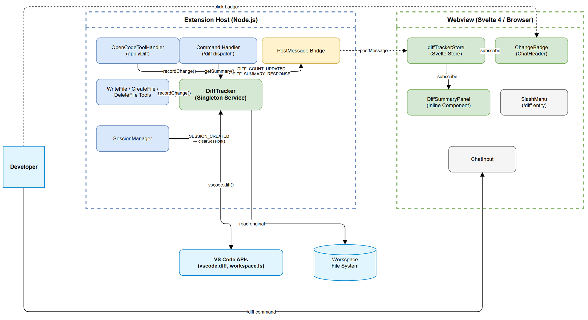

# Functional Specification Document (FSD)

## SDLC-Agents-4-Enterprise — SA4E-183: File Change Tracking — Session-wide diff summary visualization

---

## Document Information

| Field | Value |
|-------|-------|
| Jira Ticket | SA4E-183 |
| Title | File Change Tracking — Session-wide diff summary visualization |
| Author | BA Agent |
| Version | 1.1 |
| Date | 2025-07-27 |
| Status | Draft |
| Related BRD | BRD-v1-SA4E-183.docx |

---

## Revision History

| Version | Date | Author | Changes |
|---------|------|--------|---------|
| 1.0 | 2025-07-27 | BA Agent | Initiate document — auto-generated from BRD and Jira tickets |
| 1.1 | 2025-07-27 | TA Agent | Technical enrichment: API contracts, integration specs, pseudocode, NFR targets, open issues |

---

## 1. Introduction

### 1.1 Purpose

This FSD specifies the functional behavior of the **File Change Tracking** system — a session-scoped service that aggregates all file modifications performed by the AI agent and exposes them through a `/diff` slash command, an inline diff summary panel, and a header badge indicator.

### 1.2 Scope

The feature is contained within the VS Code extension layer (`extension/src/`). It introduces:
- A new `DiffTracker` service in the extension host
- A new Svelte store (`diffTrackerStore`) in the webview
- A `/diff` slash command registration
- A `ChangeBadge` component in `ChatHeader`
- PostMessage bridge extensions for change tracking communication

### 1.3 Definitions & Acronyms

| Term | Definition |
|------|------------|
| DiffTracker | Service that aggregates all file modifications made by the agent during a session. Responsible for recording, grouping, and providing change data to the UI. Avoid: ChangeLogger, FileWatcher, ModificationTracker |
| Change Entry | A single record representing one file modification operation (create, modify, or delete) with associated metadata (path, line counts, diff content). Avoid: DiffRecord, FileEvent, Modification |
| Diff Summary | The aggregated view of all change entries in a session, grouped by operation type with total statistics. Rendered by the `/diff` command. Avoid: Change Report, Modification List |
| Session Scope | The lifecycle boundary within which changes are tracked — starts when a new chat session begins and resets when a new session is created. Avoid: Window Scope, Global Scope |
| Unified Diff | Standard patch format showing context lines, additions (+), and removals (-) for a file change. Used in the expandable per-file detail view. Avoid: Patch, Delta, Change Content |
| Change Badge | The numeric indicator in the chat header showing the count of files modified in the current session. Hidden when count is 0. Avoid: Notification, Counter, Status Icon |
| PostMessage Bridge | The VS Code webview ↔ Extension Host communication channel using `postMessage` / `onDidReceiveMessage` |

### 1.4 References

| Document | Location |
|----------|----------|
| BRD | BRD-v1-SA4E-183.docx |
| OpenCodeToolHandler | extension/src/chat/tools/OpenCodeToolHandler.ts |
| SessionManager | extension/src/chat/engine/SessionManager.ts |
| SlashMenuItems | extension/src/webview/slash-menu/SlashMenuItems.ts |
| ChatHeader | extension/src/webview/components/ChatHeader.svelte |
| PostMessage helpers | extension/src/webview/postMessage.ts |
| WebviewMessage types | extension/src/chat/types/messages.ts |

---

## 2. System Overview

### 2.1 System Context Diagram



The DiffTracker service sits within the Extension Host process. It observes file modification events emitted by tool handlers (`OpenCodeToolHandler`, `WriteFileTool`, `CreateFileTool`, `DeleteFileTool`) and maintains an in-memory registry of change entries scoped to the current session. The webview communicates with DiffTracker via the PostMessage bridge to request summaries and receive reactive badge updates.

### 2.2 System Architecture

**Extension Host (Node.js process):**
- `DiffTracker` service — singleton, session-scoped, in-memory state
- Tool handler hooks — emit `ChangeEntry` events after successful file operations
- Command handler — responds to `COMMAND_DISPATCH { command: 'diff' }` messages

**Webview (Svelte 4 / Browser context):**
- `diffTrackerStore` — Svelte writable store holding current diff summary
- `ChangeBadge` component — reactive badge in ChatHeader
- `DiffSummaryPanel` component — inline expandable diff viewer
- PostMessage senders/listeners for `DIFF_*` message types

---

## 3. Functional Requirements

### 3.1 Feature: DiffTracker Service (Change Recording)

**Source:** BRD Story 1, Story 6

#### 3.1.1 Description

The DiffTracker is a singleton service in the Extension Host that records every successful file modification performed by agent tool calls. It maintains an ordered list of `ChangeEntry` records keyed by file path, collapsing multiple edits to the same file into a single cumulative entry.

#### 3.1.2 Use Case: Record File Change

**Use Case ID:** UC-01
**Actor:** Tool Handler (system actor)
**Preconditions:** A session is active (SessionManager has resolved a thread_id)
**Postconditions:** The change entry is stored in DiffTracker; badge count is updated in webview

**Main Flow:**

| Step | Actor | System | Description |
|------|-------|--------|-------------|
| 1 | Tool Handler | | Completes a file write/create/delete operation successfully |
| 2 | Tool Handler | | Calls `DiffTracker.recordChange(entry)` with file path, operation, and diff content |
| 3 | | DiffTracker | Validates entry (non-empty path, valid operation) |
| 4 | | DiffTracker | If file already tracked: merges diff content (cumulative) and updates line counts |
| 5 | | DiffTracker | If file not tracked: creates new ChangeEntry in registry |
| 6 | | DiffTracker | Checks max tracked files (100). If exceeded: evicts oldest entry |
| 7 | | DiffTracker | Sends `DIFF_COUNT_UPDATED` message to webview with new file count |

**Alternative Flows:**

| ID | Condition | Steps |
|----|-----------|-------|
| AF-01 | File was previously deleted, now re-created | Remove old "deleted" entry, create new "added" entry |
| AF-02 | File was added then deleted in same session | Remove both entries (net zero change) |
| AF-03 | Max tracked files (100) reached | Evict oldest entry by timestamp, log warning |

**Exception Flows:**

| ID | Condition | Steps |
|----|-----------|-------|
| EF-01 | DiffTracker not initialized (no session) | Log warning, discard change entry silently |
| EF-02 | Invalid file path (empty string) | Log error, discard entry |

#### 3.1.3 Business Rules

| Rule ID | Rule | Source |
|---------|------|--------|
| BR-01 | Only successfully applied changes are recorded (failed diffs are excluded) | BRD Story 1 |
| BR-02 | Multiple edits to the same file produce a single cumulative entry | BRD Story 1, AC 3 |
| BR-03 | Maximum 100 files tracked per session; oldest evicted when exceeded | BRD NFR |
| BR-04 | DiffTracker resets to empty on new session creation (new thread_id) | BRD Story 6, AC 1 |
| BR-05 | Session hydration (resume) does NOT reset DiffTracker state | BRD Story 6, AC 2 |
| BR-06 | Badge updates debounced at 100ms to prevent UI flicker | BRD Risks |
| BR-07 | Diff content for cumulative entries represents original → current state | BRD Story 2 |
| BR-08 | File operations from rejected/failed tool calls are NOT recorded | BRD Note |
| BR-09 | DiffTracker memory usage SHALL NOT exceed 10MB | BRD NFR |
| BR-10 | Operation types are: `added`, `modified`, `deleted` | BRD Story 7 |

#### 3.1.4 Data Specifications

**Input Data (ChangeEntry submitted by tool handler):**

| Field | Type | Required | Validation | Description |
|-------|------|----------|------------|-------------|
| filePath | string | Yes | Non-empty, valid workspace-relative path | Target file path |
| operation | `'added' \| 'modified' \| 'deleted'` | Yes | Must be one of the 3 values | Type of file operation |
| linesAdded | number | Yes | >= 0 | Count of lines added |
| linesRemoved | number | Yes | >= 0 | Count of lines removed |
| diffContent | string | Yes | Non-empty for added/modified | Unified diff patch content |
| timestamp | number | Yes | Valid epoch ms | Date.now() when change occurred |

**Output Data (DiffSummary exposed to webview):**

| Field | Type | Description |
|-------|------|-------------|
| totalFiles | number | Total count of tracked files |
| totalAdded | number | Count of newly created files |
| totalModified | number | Count of modified existing files |
| totalDeleted | number | Count of deleted files |
| totalLinesAdded | number | Sum of all linesAdded |
| totalLinesRemoved | number | Sum of all linesRemoved |
| entries | ChangeEntry[] | Full list of tracked entries |

---

### 3.2 Feature: `/diff` Slash Command

**Source:** BRD Story 3

#### 3.2.1 Description

A new slash command `/diff` registered in the `SLASH_COMMANDS` array that triggers rendering of the diff summary panel inline in the chat area.

#### 3.2.2 Use Case: View Diff Summary

**Use Case ID:** UC-02
**Actor:** Developer (end user)
**Preconditions:** Chat panel is visible; session is active
**Postconditions:** Diff summary panel is rendered inline in chat area

**Main Flow:**

| Step | Actor | System | Description |
|------|-------|--------|-------------|
| 1 | Developer | | Types `/diff` in the chat input |
| 2 | | Slash Menu | Shows autocomplete with "diff" option (label: "diff", description: "Show session file changes") |
| 3 | Developer | | Selects the `/diff` command (Enter or click) |
| 4 | | ChatInput | Emits `command` event with `{ command: 'diff' }` |
| 5 | | ChatPanel | Calls `dispatchCommand('diff')` via postMessage |
| 6 | | Extension Host | Receives `COMMAND_DISPATCH { command: 'diff' }` |
| 7 | | DiffTracker | Computes current DiffSummary |
| 8 | | Extension Host | Sends `DIFF_SUMMARY_RESPONSE` message to webview with full DiffSummary payload |
| 9 | | Webview | `diffTrackerStore` updates with received summary |
| 10 | | DiffSummaryPanel | Renders inline panel with file list grouped by operation type |

**Alternative Flows:**

| ID | Condition | Steps |
|----|-----------|-------|
| AF-01 | No changes in session | Panel renders with empty state message: "No changes in this session" |
| AF-02 | `/diff` invoked during active streaming | Panel still renders; does not interrupt stream |
| AF-03 | Panel already open | Refreshes content with latest data |

**Exception Flows:**

| ID | Condition | Steps |
|----|-----------|-------|
| EF-01 | DiffTracker service unavailable | Show error inline: "Change tracking unavailable" |

#### 3.2.3 Business Rules

| Rule ID | Rule | Source |
|---------|------|--------|
| BR-11 | `/diff` command appears in slash menu autocomplete | BRD Story 3, AC 1 |
| BR-12 | Panel renders within 200ms | BRD Story 3, AC 2 |
| BR-13 | `/diff` works during active streaming without interruption | BRD Story 3, AC 3 |
| BR-14 | Command ID follows pattern: `command-diff` | SlashMenuItems pattern |

---

### 3.3 Feature: Per-File Unified Diff Viewer

**Source:** BRD Story 2

#### 3.3.1 Description

Each file in the diff summary panel is expandable to reveal its cumulative unified diff with syntax-highlighted color coding.

#### 3.3.2 Use Case: Expand File Diff

**Use Case ID:** UC-03
**Actor:** Developer
**Preconditions:** Diff summary panel is visible with at least one file entry
**Postconditions:** Unified diff content is visible for the selected file

**Main Flow:**

| Step | Actor | System | Description |
|------|-------|--------|-------------|
| 1 | Developer | | Clicks expand chevron (or file row) in summary panel |
| 2 | | DiffSummaryPanel | Toggles expansion state for that file entry |
| 3 | | DiffSummaryPanel | Renders unified diff content with color coding |
| 4 | | DiffSummaryPanel | Applies syntax highlighting based on file extension |

**Alternative Flows:**

| ID | Condition | Steps |
|----|-----------|-------|
| AF-01 | Diff exceeds 500 lines | Shows collapsed state with message: "{N} lines changed — click to expand" |
| AF-02 | File was newly created | All lines shown as additions (green) |
| AF-03 | File was deleted | All lines shown as removals (red) |
| AF-04 | File already expanded | Click collapses back to summary row |

**Exception Flows:**

| ID | Condition | Steps |
|----|-----------|-------|
| EF-01 | Diff content is empty (edge case) | Show message: "No diff content available" |

#### 3.3.3 Business Rules

| Rule ID | Rule | Source |
|---------|------|--------|
| BR-15 | Diff uses standard unified format (context + additions + removals) | BRD Story 2, Req 2 |
| BR-16 | Additions rendered in green (#4ec9b0), removals in red (#f44) | BRD Story 2, AC 1 |
| BR-17 | Large diffs (>500 lines) collapsed by default | BRD Story 2, Req 5 |
| BR-18 | Syntax highlighting applied based on file extension | BRD Story 2, Req 4 |

---

### 3.4 Feature: Clickable File Paths (Open in VS Code Diff Editor)

**Source:** BRD Story 4

#### 3.4.1 Description

File paths in the diff summary are clickable links that open the VS Code native diff editor showing original vs current content.

#### 3.4.2 Use Case: Navigate to File Diff

**Use Case ID:** UC-04
**Actor:** Developer
**Preconditions:** Diff summary panel is visible with file entries
**Postconditions:** VS Code diff editor opens showing the file change

**Main Flow:**

| Step | Actor | System | Description |
|------|-------|--------|-------------|
| 1 | Developer | | Clicks file path link in diff summary |
| 2 | | Webview | Sends `DIFF_OPEN_FILE` message with filePath and operation |
| 3 | | Extension Host | Receives message, determines action based on operation type |
| 4 | | Extension Host | For "modified": opens `vscode.commands.executeCommand('vscode.diff', originalUri, currentUri, title)` |
| 5 | | VS Code | Renders native diff editor (side-by-side or inline) |

**Alternative Flows:**

| ID | Condition | Steps |
|----|-----------|-------|
| AF-01 | File was newly created (no original) | Opens file in normal editor (no diff view) |
| AF-02 | File was deleted | Shows info notification: "File has been deleted: {path}" |
| AF-03 | Original content not available | Opens current file in normal editor with warning |

**Exception Flows:**

| ID | Condition | Steps |
|----|-----------|-------|
| EF-01 | File path no longer exists on disk (unexpected) | Shows error notification: "File not found: {path}" |

#### 3.4.3 Business Rules

| Rule ID | Rule | Source |
|---------|------|--------|
| BR-19 | Modified files open VS Code diff editor (original vs current) | BRD Story 4, AC 1 |
| BR-20 | Newly created files open in normal editor | BRD Story 4, AC 2 |
| BR-21 | Deleted files show informational notification | BRD Story 4, AC 3 |
| BR-22 | DiffTracker must store original file content for modified files | Derived from BR-19 |

---

### 3.5 Feature: Change Badge (Header Indicator)

**Source:** BRD Story 5

#### 3.5.1 Description

A numeric badge in the ChatHeader showing the count of files changed in the current session. Acts as a shortcut to open the diff summary panel.

#### 3.5.2 Use Case: View and Click Badge

**Use Case ID:** UC-05
**Actor:** Developer
**Preconditions:** Chat panel is visible
**Postconditions:** Badge reflects current change count; click opens diff panel

**Main Flow:**

| Step | Actor | System | Description |
|------|-------|--------|-------------|
| 1 | | DiffTracker | File change is recorded (UC-01 completes) |
| 2 | | Extension Host | Sends `DIFF_COUNT_UPDATED { count: N }` to webview |
| 3 | | diffTrackerStore | Updates `fileCount` value (debounced 100ms) |
| 4 | | ChangeBadge | Re-renders with new count (reactive Svelte binding) |
| 5 | Developer | | Clicks the badge |
| 6 | | ChangeBadge | Dispatches same action as `/diff` command (requestDiffSummary) |
| 7 | | DiffSummaryPanel | Renders inline diff summary (UC-02 flow) |

**Alternative Flows:**

| ID | Condition | Steps |
|----|-----------|-------|
| AF-01 | Count is 0 | Badge is hidden (CSS `display: none`) |
| AF-02 | Count decreases (file un-tracked via eviction) | Badge updates to new lower count |

#### 3.5.3 Business Rules

| Rule ID | Rule | Source |
|---------|------|--------|
| BR-23 | Badge hidden when file count is 0 | BRD Story 5, AC 1 |
| BR-24 | Badge updates within 100ms of change (debounced) | BRD Story 5, AC 3 |
| BR-25 | Clicking badge opens diff summary (same as `/diff`) | BRD Story 5, AC 4 |
| BR-26 | Badge uses `codicon-diff` icon with numeric counter | BRD Story 5, UI spec |

---

### 3.6 Feature: Session Scope Reset

**Source:** BRD Story 6

#### 3.6.1 Description

The DiffTracker state resets when a new session is created (new thread via SessionManager). Session resumption (hydration) preserves existing tracked state.

#### 3.6.2 Use Case: Reset on New Session

**Use Case ID:** UC-06
**Actor:** SessionManager (system actor)
**Preconditions:** DiffTracker has existing tracked changes
**Postconditions:** DiffTracker state is empty; badge shows 0 (hidden)

**Main Flow:**

| Step | Actor | System | Description |
|------|-------|--------|-------------|
| 1 | SessionManager | | Creates a new thread (new session) via `KnowledgeClient.createThread()` |
| 2 | SessionManager | | Emits session lifecycle event: `SESSION_CREATED` |
| 3 | | DiffTracker | Receives event, calls `clearSession()` |
| 4 | | DiffTracker | Clears all entries, resets counters |
| 5 | | DiffTracker | Sends `DIFF_COUNT_UPDATED { count: 0 }` to webview |
| 6 | | ChangeBadge | Hides badge (count = 0) |

**Alternative Flows:**

| ID | Condition | Steps |
|----|-----------|-------|
| AF-01 | Session hydration (resume existing thread) | DiffTracker is NOT reset — preserves current state |
| AF-02 | VS Code window reload within same session | If session is hydrated (same thread_id), DiffTracker starts fresh (in-memory state lost) — this is acceptable per BRD assumption |

#### 3.6.3 Business Rules

| Rule ID | Rule | Source |
|---------|------|--------|
| BR-04 | (ref) DiffTracker resets on new session creation only | BRD Story 6, AC 1 |
| BR-05 | (ref) Session hydration does NOT reset tracker | BRD Story 6, AC 2 |
| BR-27 | DiffTracker registers as SessionManager lifecycle listener | Derived |
| BR-28 | Window reload loses in-memory state (acceptable — no persistence) | BRD Risks, Assumptions |

---

### 3.7 Feature: Grouping by Operation Type

**Source:** BRD Story 7

#### 3.7.1 Description

The diff summary view organizes files into three sections: Added, Modified, Deleted — each with a file count header.

#### 3.7.2 Use Case: View Grouped Summary

**Use Case ID:** UC-07
**Actor:** Developer
**Preconditions:** Diff summary panel is open with at least one entry
**Postconditions:** Files are displayed in grouped sections

**Main Flow:**

| Step | Actor | System | Description |
|------|-------|--------|-------------|
| 1 | | DiffSummaryPanel | Receives DiffSummary data from store |
| 2 | | DiffSummaryPanel | Groups entries by `operation` field |
| 3 | | DiffSummaryPanel | Renders sections in order: Added → Modified → Deleted |
| 4 | | DiffSummaryPanel | Each section shows header with count: "Added (2)", "Modified (5)", etc. |
| 5 | | DiffSummaryPanel | Within each section, files sorted alphabetically by path |

**Alternative Flows:**

| ID | Condition | Steps |
|----|-----------|-------|
| AF-01 | A section has 0 files | That section is hidden entirely |

#### 3.7.3 Business Rules

| Rule ID | Rule | Source |
|---------|------|--------|
| BR-29 | Display order: Added → Modified → Deleted | BRD Story 7 |
| BR-30 | Empty sections are hidden | BRD Story 7, AC 2 |
| BR-31 | Files sorted alphabetically within each section | BRD Story 7, AC 3 |

---

## 4. Data Model

> **Note:** This section defines the logical data model. Physical implementation details are in the TDD.

### 4.1 Entity Relationship Diagram

The data model is simple and in-memory (no persistence). The core entities are:

```
DiffTracker (singleton)
  ├── sessionId: string (from SessionManager)
  ├── entries: Map<filePath, ChangeEntry>
  └── originalContents: Map<filePath, string>  (for VS Code diff editor)

ChangeEntry
  ├── filePath: string
  ├── operation: OperationType
  ├── linesAdded: number
  ├── linesRemoved: number
  ├── diffContent: string
  ├── timestamp: number
  └── originalContent?: string
```

### 4.2 Logical Entities

#### Entity: ChangeEntry

| Attribute | Type | Required | Business Rule | Description |
|-----------|------|----------|---------------|-------------|
| filePath | string | Yes | BR-01 | Workspace-relative file path |
| operation | OperationType | Yes | BR-10 | One of: added, modified, deleted |
| linesAdded | number | Yes | BR-01 | Lines added count (cumulative) |
| linesRemoved | number | Yes | BR-01 | Lines removed count (cumulative) |
| diffContent | string | Yes | BR-07 | Unified diff (original → current) |
| timestamp | number | Yes | BR-03 | Epoch ms of last change to this file |
| originalContent | string | No | BR-22 | Snapshot of file content before first modification |

#### Entity: DiffSummary

| Attribute | Type | Required | Business Rule | Description |
|-----------|------|----------|---------------|-------------|
| totalFiles | number | Yes | - | Count of entries |
| totalAdded | number | Yes | BR-10 | Files with operation = added |
| totalModified | number | Yes | BR-10 | Files with operation = modified |
| totalDeleted | number | Yes | BR-10 | Files with operation = deleted |
| totalLinesAdded | number | Yes | - | Sum of all linesAdded |
| totalLinesRemoved | number | Yes | - | Sum of all linesRemoved |
| entries | ChangeEntry[] | Yes | BR-29 | Sorted, grouped entries |

#### Entity: OperationType (Enum)

| Value | Description |
|-------|-------------|
| `added` | File was newly created in this session |
| `modified` | Existing file was edited |
| `deleted` | File was deleted in this session |

**Relationships:**

| From Entity | To Entity | Cardinality | Description |
|-------------|-----------|-------------|-------------|
| DiffTracker | ChangeEntry | 1:N (max 100) | Tracker holds 0..100 entries keyed by filePath |
| DiffSummary | ChangeEntry | 1:N | Summary references all current entries |

---

## 5. Integration Specifications

> **Note:** Technical connection details (timeout, retry, etc.) are specified in the TDD.

### 5.1 External System: VS Code Diff Editor API

| Attribute | Value |
|-----------|-------|
| Purpose | Open native side-by-side diff view for modified files |
| Direction | Outbound (Extension Host → VS Code) |
| Data Format | VS Code command API: `vscode.diff(leftUri, rightUri, title)` |
| Frequency | On-demand (user clicks file path) |

**Data Exchange:**

| Our Data | External Data | Direction | Business Rule |
|----------|--------------|-----------|---------------|
| originalContent (as virtual document) | Left pane (original) | Send | BR-22 — must store original |
| Current file on disk | Right pane (current) | Read from FS | - |

### 5.2 Internal System: OpenCodeToolHandler

| Attribute | Value |
|-----------|-------|
| Purpose | Hook point for tracking successfully applied diffs |
| Direction | Inbound (Tool Handler → DiffTracker) |
| Data Format | TypeScript method call: `DiffTracker.recordChange(entry)` |
| Frequency | Real-time (on every successful file operation) |

**Data Exchange:**

| Our Data | External Data | Direction | Business Rule |
|----------|--------------|-----------|---------------|
| ChangeEntry | ApplyResult (success=true) | Receive trigger | BR-01, BR-08 |

### 5.3 Internal System: SessionManager

| Attribute | Value |
|-----------|-------|
| Purpose | Lifecycle events for session reset |
| Direction | Inbound (SessionManager → DiffTracker) |
| Data Format | Event listener / callback |
| Frequency | On new session creation |

**Data Exchange:**

| Our Data | External Data | Direction | Business Rule |
|----------|--------------|-----------|---------------|
| clearSession() call | SESSION_CREATED event | Receive | BR-04, BR-27 |

### 5.4 Internal System: PostMessage Bridge (Webview ↔ Extension Host)

| Attribute | Value |
|-----------|-------|
| Purpose | Communicate diff state between Extension Host and webview |
| Direction | Bidirectional |
| Data Format | JSON messages via VS Code postMessage API |
| Frequency | Real-time (on changes, on user commands) |

**Message Types:**

| Message | Direction | Payload | Trigger |
|---------|-----------|---------|---------|
| `DIFF_COUNT_UPDATED` | Host → Webview | `{ count: number }` | After each recordChange/clear |
| `DIFF_SUMMARY_RESPONSE` | Host → Webview | `{ summary: DiffSummary }` | After `/diff` command |
| `DIFF_OPEN_FILE` | Webview → Host | `{ filePath: string, operation: OperationType }` | User clicks file path |
| `COMMAND_DISPATCH { command: 'diff' }` | Webview → Host | (existing pattern) | User executes `/diff` |

---

## 6. Processing Logic

### 6.1 Record Change (Cumulative Merge)

**Trigger:** Tool handler completes a successful file operation
**Input:** New ChangeEntry from tool handler
**Output:** Updated DiffTracker state + badge count message

**Processing Steps:**

| Step | Description | Error Handling |
|------|-------------|----------------|
| 1 | Validate entry: filePath non-empty, operation valid | Discard entry, log error |
| 2 | Check if filePath already exists in entries Map | - |
| 3 | If NOT exists: capture original file content (read from disk for `modified`), store new entry | If file read fails (deleted mid-operation): skip original capture |
| 4 | If EXISTS and operation transitions (e.g., added→deleted): apply net-zero rule (AF-02) | - |
| 5 | If EXISTS and same operation: merge diffs — recompute cumulative diff (original → current), sum line counts | - |
| 6 | Check entry count against max (100). Evict oldest if exceeded | Log warning |
| 7 | Compute new total file count | - |
| 8 | Send `DIFF_COUNT_UPDATED` to webview (debounced 100ms) | If webview unavailable: no-op |

### 6.2 Compute Diff Summary

**Trigger:** `/diff` command dispatched or badge clicked
**Input:** Current entries Map
**Output:** DiffSummary object sent to webview

**Processing Steps:**

| Step | Description | Error Handling |
|------|-------------|----------------|
| 1 | Convert entries Map to sorted array | - |
| 2 | Group by operation type (added, modified, deleted) | - |
| 3 | Sort each group alphabetically by filePath | - |
| 4 | Compute totals (totalFiles, totalAdded, totalModified, totalDeleted, totalLinesAdded, totalLinesRemoved) | - |
| 5 | Assemble DiffSummary object | - |
| 6 | Send `DIFF_SUMMARY_RESPONSE` to webview | If webview unavailable: log warning |

### 6.3 Open File in Diff Editor

**Trigger:** User clicks file path in diff panel (webview sends `DIFF_OPEN_FILE`)
**Input:** filePath, operation
**Output:** VS Code editor opens

**Processing Steps:**

| Step | Description | Error Handling |
|------|-------------|----------------|
| 1 | Receive `DIFF_OPEN_FILE` message in Extension Host | - |
| 2 | Resolve filePath to workspace URI | If workspace not found: show error notification |
| 3 | If operation = `modified`: retrieve originalContent from DiffTracker | If not available: fallback to opening current file |
| 4 | If operation = `modified`: create virtual document from originalContent, call `vscode.diff(originalUri, currentUri, title)` | If command fails: show error notification |
| 5 | If operation = `added`: call `vscode.window.showTextDocument(currentUri)` | If file not found: show error notification |
| 6 | If operation = `deleted`: show info notification "File has been deleted: {path}" | - |

---

## 7. Security Requirements

> **Note:** Technical security implementation details are in the TDD.

### 7.1 Authentication & Authorization

Not applicable — this feature operates entirely within the local VS Code extension context with no remote authentication. All data stays in-process memory.

### 7.2 Data Sensitivity Classification

| Data Type | Classification | Business Requirement |
|-----------|---------------|---------------------|
| File paths | Internal | May contain project structure info — stays in local memory |
| Diff content | Internal | May contain source code — stays in local memory, no remote transmission |
| Original file content | Internal | Same as above — no persistence, no transmission |

### 7.3 Audit Trail

Not applicable — session-scoped in-memory feature with no persistence or external communication.

---

## 8. Non-Functional Requirements

> **Note:** Technical implementation (caching, debouncing, memory management) is in the TDD.

| Category | Business Requirement | Acceptance Criteria |
|----------|---------------------|---------------------|
| Performance | Badge updates are near-instant | Badge updates within 100ms of tracked change |
| Performance | `/diff` panel is responsive | Panel renders within 200ms for up to 50 files |
| Performance | No noticeable extension slowdown | DiffTracker overhead < 5ms per recordChange call |
| Memory | Bounded memory usage | DiffTracker SHALL NOT exceed 10MB for tracked changes |
| Scalability | Handles busy sessions | Support up to 100 files per session |
| Usability | Keyboard accessible | Panel navigable via Tab, Enter, Escape |
| Usability | Screen reader support | Badge and panel have ARIA labels |
| Reliability | No silent data loss | All successful changes tracked (no drops) |
| Compatibility | VS Code version support | Compatible with VS Code ≥ 1.80 (current baseline) |

---

## 9. Error Handling (User-Facing)

### 9.1 Error Scenarios

| Scenario | Severity | User Message | Expected Behavior |
|----------|----------|-------------|-------------------|
| DiffTracker service unavailable at startup | Warning | None (silent graceful degradation) | Badge hidden, `/diff` shows "Change tracking unavailable" |
| Max tracked files exceeded | Info | None (transparent eviction) | Oldest entry evicted; badge count may decrease |
| Original file content unavailable for diff editor | Warning | "Original content not available — showing current file" | Opens file in normal editor |
| File clicked but no longer exists on disk | Info | "File not found: {path}" | VS Code info notification |
| Deleted file path clicked | Info | "File has been deleted: {path}" | VS Code info notification |
| VS Code diff command fails | Warning | "Unable to open diff view" | VS Code error notification |

### 9.2 Notification Requirements

| Event | Who is Notified | Channel | Timing |
|-------|----------------|---------|--------|
| Max tracked files reached | Developer | None (silent) | Immediate (transparent) |
| File open failure | Developer | VS Code notification | Immediate |
| Deleted file click | Developer | VS Code info notification | Immediate |

---

## 10. Testing Considerations

### 10.1 Test Scenarios

| ID | Scenario | Input | Expected Output | Priority |
|----|----------|-------|-----------------|----------|
| TC-01 | Record single file modification | applyDiff success on `src/a.ts` | Entry added, badge count = 1 | High |
| TC-02 | Record multiple files | 3 different files modified | Badge count = 3, summary shows 3 entries | High |
| TC-03 | Cumulative diff for same file | File modified 3 times | Single entry with cumulative diff | High |
| TC-04 | `/diff` with no changes | Empty session | Panel shows "No changes in this session" | High |
| TC-05 | `/diff` with mixed operations | 2 added, 3 modified, 1 deleted | 3 sections with correct counts | High |
| TC-06 | Click modified file path | Click on modified entry | VS Code diff editor opens | High |
| TC-07 | Click newly created file path | Click on added entry | File opens in normal editor | Medium |
| TC-08 | Click deleted file path | Click on deleted entry | Info notification shown | Medium |
| TC-09 | Session reset | New session created | DiffTracker empty, badge hidden | High |
| TC-10 | Session hydration | Resume existing thread | DiffTracker state preserved | High |
| TC-11 | Max files eviction | Record 101 file changes | Oldest evicted, count = 100 | Medium |
| TC-12 | Badge debouncing | Rapid 5 changes in 50ms | Badge updates once (debounced) | Medium |
| TC-13 | Large diff collapse | File with 600-line diff | Diff collapsed by default | Low |
| TC-14 | `/diff` during streaming | Agent actively streaming | Panel renders without interruption | Medium |
| TC-15 | Added then deleted same file | Create file, then delete it | Both entries removed (net zero) | Medium |

---

## 11. Appendix

### UI Specifications

#### Diff Summary Panel (inline in chat)

| No. | Element | Type | Required | Behavior | Validation |
|-----|---------|------|----------|----------|------------|
| 1 | Panel container | Expandable section | Yes | Renders below chat messages, collapsible | - |
| 2 | Summary header | Text | Yes | "Session Changes — {N} files ({+A} added, ~{M} modified, -{D} deleted)" | - |
| 3 | Section header (Added) | Group header | Conditional | "Added ({count})" with green dot indicator | Hidden if count = 0 |
| 4 | Section header (Modified) | Group header | Conditional | "Modified ({count})" with blue dot indicator | Hidden if count = 0 |
| 5 | Section header (Deleted) | Group header | Conditional | "Deleted ({count})" with red dot indicator | Hidden if count = 0 |
| 6 | File row | Interactive list item | Yes | File icon + path + `+{N} -{N}` line counts + expand chevron | Clickable path, expandable |
| 7 | Expand chevron | Button | Yes | Toggles diff content visibility | Rotates 90° when expanded |
| 8 | Diff content area | Code block | Yes | Unified diff with color coding | Monospace font, scrollable |
| 9 | Large diff collapse message | Text + button | Conditional | "{N} lines changed — Show full diff" | Only when >500 diff lines |
| 10 | Empty state | Text | Conditional | "No changes in this session" | Only when 0 entries |

#### Change Badge (in ChatHeader)

| No. | Element | Type | Required | Behavior | Validation |
|-----|---------|------|----------|----------|------------|
| 1 | Badge container | Button | Yes | Clickable, opens diff panel | Hidden when count = 0 |
| 2 | Icon | codicon-diff | Yes | File diff icon | VS Code codicon set |
| 3 | Counter | Number span | Yes | Shows file count | Updated reactively |
| 4 | ARIA label | Attribute | Yes | "{N} files changed in this session" | Screen reader accessible |

### Diagrams

### Diagram Index

| # | Diagram | Image | Source (editable) |
|---|---------|-------|-------------------|
| 1 | System Context | [system-context.png](diagrams/system-context.png) | [system-context.drawio](diagrams/system-context.drawio) |
| 2 | Sequence: Track Change | [sequence-track-change.png](diagrams/sequence-track-change.png) | [sequence-track-change.drawio](diagrams/sequence-track-change.drawio) |
| 3 | Sequence: View Diff | [sequence-view-diff.png](diagrams/sequence-view-diff.png) | [sequence-view-diff.drawio](diagrams/sequence-view-diff.drawio) |
| 4 | State: DiffTracker Lifecycle | [state-diff-tracker.png](diagrams/state-diff-tracker.png) | [state-diff-tracker.drawio](diagrams/state-diff-tracker.drawio) |

### Change Log from BRD

- No deviations from BRD. All 7 user stories are covered.
- Clarification: BR-22 (store original content) is derived from Story 4 requirement to open VS Code diff editor — BRD implied this but did not explicitly state it as a data field.
- Clarification: Net-zero rule (added then deleted = remove both) is derived from logical consistency.

---

## 12. Technical Appendix — TA Enrichment

### 12.1 API Contracts — PostMessage Protocol Extensions

The following message types extend the existing discriminated union in `extension/src/chat/types/messages.ts`.

#### 12.1.1 New Extension Host → Webview Messages

```typescript
// Add to ExtensionMessageType union:
| 'DIFF_COUNT_UPDATED'
| 'DIFF_SUMMARY_RESPONSE'

// Add to ExtensionMessage discriminated union:
| { type: 'DIFF_COUNT_UPDATED'; count: number }
| { type: 'DIFF_SUMMARY_RESPONSE'; summary: DiffSummaryPayload }
```

**`DIFF_COUNT_UPDATED` Payload Schema:**

| Field | Type | Required | Description |
|-------|------|----------|-------------|
| type | `'DIFF_COUNT_UPDATED'` | Yes | Discriminant |
| count | `number` | Yes | Total tracked file count (0..100) |

**`DIFF_SUMMARY_RESPONSE` Payload Schema:**

| Field | Type | Required | Description |
|-------|------|----------|-------------|
| type | `'DIFF_SUMMARY_RESPONSE'` | Yes | Discriminant |
| summary | `DiffSummaryPayload` | Yes | Full summary object |

```typescript
/** Payload shape for DIFF_SUMMARY_RESPONSE message */
export interface DiffSummaryPayload {
  totalFiles: number;
  totalAdded: number;
  totalModified: number;
  totalDeleted: number;
  totalLinesAdded: number;
  totalLinesRemoved: number;
  entries: ChangeEntryPayload[];
}

export interface ChangeEntryPayload {
  filePath: string;
  operation: 'added' | 'modified' | 'deleted';
  linesAdded: number;
  linesRemoved: number;
  diffContent: string;
  timestamp: number;
}
```

#### 12.1.2 New Webview → Extension Host Messages

```typescript
// Add to WebviewMessageType union:
| 'DIFF_OPEN_FILE'

// Add to WebviewMessage discriminated union:
| { type: 'DIFF_OPEN_FILE'; filePath: string; operation: 'added' | 'modified' | 'deleted' }
```

**`DIFF_OPEN_FILE` Payload Schema:**

| Field | Type | Required | Description |
|-------|------|----------|-------------|
| type | `'DIFF_OPEN_FILE'` | Yes | Discriminant |
| filePath | `string` | Yes | Workspace-relative path to open |
| operation | `'added' \| 'modified' \| 'deleted'` | Yes | Determines open action (diff vs normal vs notification) |

#### 12.1.3 Reuse of Existing `COMMAND_DISPATCH`

The `/diff` command reuses the existing `COMMAND_DISPATCH` message type:
```typescript
{ type: 'COMMAND_DISPATCH', command: 'diff' }
```

This is handled in `ChatEngineAdapter.handleCommandDispatch()` — a new branch for `command === 'diff'` routes to DiffTracker.

---

### 12.2 API Contracts — DiffTracker Public Interface

```typescript
/** extension/src/chat/diff/IDiffTracker.ts */

import type { IPostMessageBridge } from '../bridge/IPostMessageBridge';

/** Operation type enum for tracked file changes */
export type OperationType = 'added' | 'modified' | 'deleted';

/** A single tracked change entry */
export interface ChangeEntry {
  filePath: string;
  operation: OperationType;
  linesAdded: number;
  linesRemoved: number;
  diffContent: string;
  timestamp: number;
  originalContent?: string;
}

/** Aggregated diff summary (computed on demand) */
export interface DiffSummary {
  totalFiles: number;
  totalAdded: number;
  totalModified: number;
  totalDeleted: number;
  totalLinesAdded: number;
  totalLinesRemoved: number;
  entries: ChangeEntry[];
}

/** Input shape provided by tool handlers when recording a change */
export interface RecordChangeInput {
  filePath: string;
  operation: OperationType;
  linesAdded: number;
  linesRemoved: number;
  diffContent: string;
  originalContent?: string;
}

/**
 * DiffTracker contract — session-scoped change aggregation service.
 * Singleton per extension activation. Injected into tool execution pipeline.
 */
export interface IDiffTracker {
  /** Record a successful file change. Debounces badge update (100ms). */
  recordChange(input: RecordChangeInput): void;

  /** Compute current aggregated summary on demand. */
  getSummary(): DiffSummary;

  /** Get current tracked file count. */
  getFileCount(): number;

  /** Clear all tracked state (session reset). */
  clearSession(): void;

  /** Dispose resources (debounce timer). */
  dispose(): void;
}
```

---

### 12.3 API Contracts — Slash Command Registration

New entry in `SLASH_COMMANDS` array (file: `extension/src/webview/slash-menu/SlashMenuItems.ts`):

```typescript
{
  id: 'command-diff',
  icon: '\u{1F4C4}',  // 📄 document icon
  label: 'diff',
  description: 'Show session file changes',
  itemType: 'command',
}
```

Follows the existing pattern established by `command-compact`.

---

### 12.4 Integration Requirements — Files to Modify

#### 12.4.1 Extension Host — New Files

| File | Purpose |
|------|---------|
| `extension/src/chat/diff/IDiffTracker.ts` | Interface + types (ChangeEntry, DiffSummary, RecordChangeInput) |
| `extension/src/chat/diff/DiffTracker.ts` | Concrete implementation — singleton, in-memory Map, debounced badge |
| `extension/src/chat/diff/index.ts` | Barrel export |

#### 12.4.2 Extension Host — Existing Files to Modify

| File | Modification | Hook Point |
|------|-------------|------------|
| `extension/src/chat/types/messages.ts` | Add `DIFF_COUNT_UPDATED`, `DIFF_SUMMARY_RESPONSE` to `ExtensionMessage`; add `DIFF_OPEN_FILE` to `WebviewMessage` | Union type declarations |
| `extension/src/chat/engine/ChatEngineAdapter.ts` | Add `IDiffTracker` to `ChatEngineAdapterDeps`; register handler for `DIFF_OPEN_FILE`; extend `handleCommandDispatch` for `command === 'diff'` | `ChatEngineAdapterDeps` interface, `registerMessageHandlers()`, `handleCommandDispatch()` |
| `extension/src/chat/engine/ISessionManager.ts` | No change needed — DiffTracker listens for session creation externally (see 12.5.3) |  |
| `extension/src/langgraph/subgraphs/chat-graph-nodes.ts` | After `diagnosticsFeed.markTouchedFromTool(...)`, add `diffTracker.recordChange(...)` call | `executeSingleTool()` function, after line ~353 |
| `extension/src/extension.ts` | Instantiate `DiffTracker`, pass into `ChatEngineAdapterDeps`, subscribe to session creation | `activate()` function, near line 378 |
| `extension/src/webview/postMessage.ts` | Add `requestDiffSummary()` and `openDiffFile()` helper functions | End of file |
| `extension/src/webview/slash-menu/SlashMenuItems.ts` | Add `command-diff` to `SLASH_COMMANDS` array | After existing `command-compact` entry |

#### 12.4.3 Webview — New Files

| File | Purpose |
|------|---------|
| `extension/src/webview/stores/diffTrackerStore.ts` | Svelte writable store: `{ fileCount, summary }` + update/reset actions |
| `extension/src/webview/components/ChangeBadge.svelte` | Badge component in ChatHeader — reactive count, click handler |
| `extension/src/webview/components/DiffSummaryPanel.svelte` | Inline expandable panel — grouped file list + per-file unified diff |

#### 12.4.4 Webview — Existing Files to Modify

| File | Modification | Hook Point |
|------|-------------|------------|
| `extension/src/webview/components/ChatHeader.svelte` | Import and render `ChangeBadge` component in `.header-right` div | Between `<ContextBadge />` and streaming badge |
| `extension/src/webview/components/ChatPanel.svelte` | Render `DiffSummaryPanel` when store indicates panel open; handle `DIFF_COUNT_UPDATED` and `DIFF_SUMMARY_RESPONSE` messages | `window.addEventListener('message', ...)` handler |

---

### 12.5 Integration Hook Points — Detailed

#### 12.5.1 Tool Execution Hook (Recording Changes)

**Location:** `extension/src/langgraph/subgraphs/chat-graph-nodes.ts`, function `executeSingleTool()`

**Current code (lines ~349-354):**
```typescript
if (diagnosticsFeed) {
  diagnosticsFeed.markTouchedFromTool(call.name, call.arguments || {});
}
return { toolCallId: call.id, name: call.name, content: result };
```

**Integration point:** After `diagnosticsFeed.markTouchedFromTool`, call `diffTracker.recordChange()` for write tool names.

**Write tool allowlist** (reuse from `DiagnosticsFeedService`):
```typescript
const DIFF_TRACKED_TOOLS = new Set([
  'write_file', 'fs_write', 'str_replace', 'fs_append', 'delete_file', 'stream_write_file'
]);
```

**Mapping tool call to ChangeEntry:**

| Tool Name | Operation | `diffContent` source | `originalContent` |
|-----------|-----------|---------------------|-------------------|
| `write_file` | File existed? `modified` : `added` | Compute unified diff (old content → new `args.content`) | Read before write |
| `fs_write` | Same as `write_file` | Same | Same |
| `str_replace` | `modified` | The `oldStr → newStr` replacement as diff | Read before replace |
| `fs_append` | `modified` | Appended text as additions-only diff | Read before append |
| `delete_file` | `deleted` | Full file content as removals-only diff | Full file content |
| `stream_write_file` | File existed? `modified` : `added` | Final content diff | Read before first chunk |

**Key design decision:** `diffTracker` receives the change AFTER successful tool execution (same position as `diagnosticsFeed`). The tool result string is used to confirm success — if result starts with `"Error:"`, skip recording (BR-01, BR-08).

#### 12.5.2 COMMAND_DISPATCH Hook (Diff Command)

**Location:** `extension/src/chat/engine/ChatEngineAdapter.ts`, method `handleCommandDispatch()`

**Current behavior:** Delegates to `vscode.commands.executeCommand(msg.command, msg.args)`

**New behavior:** Intercept `command === 'diff'` before falling through to VS Code:
```typescript
private async handleCommandDispatch(payload: unknown): Promise<void> {
  const msg = payload as Extract<WebviewMessage, { type: 'COMMAND_DISPATCH' }>;
  if (msg.command === 'diff') {
    const summary = this.deps.diffTracker.getSummary();
    this.deps.bridge.postToWebview({ type: 'DIFF_SUMMARY_RESPONSE', summary });
    return;
  }
  await vscode.commands.executeCommand(msg.command, msg.args);
}
```

#### 12.5.3 Session Reset Hook

**Location:** `extension/src/extension.ts`, `activate()` function

**Pattern:** The existing `SessionManager` does not expose lifecycle events. DiffTracker resets when a new thread is created. The simplest approach:

1. Wrap `SessionManager.ensureSession()` — if the returned `thread_id` differs from the last known thread_id, fire reset.
2. Or: Introduce a thin `SessionLifecycleEmitter` (EventEmitter) that `SessionManager` fires on `createThread()`.

**Recommended approach (option 2 — cleaner DIP):**
```typescript
// extension/src/chat/engine/SessionLifecycleEmitter.ts
import { EventEmitter } from 'events';

export type SessionEvent = 'session:created' | 'session:hydrated';

export class SessionLifecycleEmitter extends EventEmitter {
  emitSessionCreated(threadId: string): void {
    this.emit('session:created', threadId);
  }
  emitSessionHydrated(threadId: string): void {
    this.emit('session:hydrated', threadId);
  }
}
```

`SessionManager` emits `session:created` in `resolveSession()` when `createIfMissing=true` and a new thread is created. DiffTracker subscribes in `activate()`:

```typescript
sessionLifecycle.on('session:created', () => diffTracker.clearSession());
```

BR-05 compliance: `session:hydrated` does NOT trigger clearSession.

#### 12.5.4 DIFF_OPEN_FILE Handler

**Location:** `extension/src/chat/engine/ChatEngineAdapter.ts`

**New handler registration in `registerMessageHandlers()`:**
```typescript
router.registerHandler('DIFF_OPEN_FILE', (msg) => this.handleDiffOpenFile(msg));
```

**Implementation leverages VS Code diff API:**
```typescript
private async handleDiffOpenFile(payload: unknown): Promise<void> {
  const msg = payload as { type: 'DIFF_OPEN_FILE'; filePath: string; operation: string };
  const wsFolder = vscode.workspace.workspaceFolders?.[0];
  if (!wsFolder) return;

  const fileUri = vscode.Uri.joinPath(wsFolder.uri, msg.filePath);

  if (msg.operation === 'deleted') {
    vscode.window.showInformationMessage(`File has been deleted: ${msg.filePath}`);
    return;
  }
  if (msg.operation === 'added') {
    await vscode.window.showTextDocument(fileUri);
    return;
  }
  // operation === 'modified': open diff view
  const original = this.deps.diffTracker.getOriginalContent(msg.filePath);
  if (!original) {
    await vscode.window.showTextDocument(fileUri);
    return;
  }
  // Create virtual document URI for original content
  const originalUri = vscode.Uri.parse(`diff-original:${msg.filePath}`);
  await vscode.commands.executeCommand('vscode.diff', originalUri, fileUri,
    `${msg.filePath} (Original ↔ Current)`);
}
```

**Note:** Requires a `TextDocumentContentProvider` registered for the `diff-original` scheme to serve `originalContent` from DiffTracker.

---

### 12.6 Pseudocode — Complex Business Logic

#### 12.6.1 Cumulative Diff Computation (BR-02, BR-07)

```
FUNCTION recordChange(input: RecordChangeInput):
  // Step 1: Validate input (BR-01)
  IF input.filePath is empty OR input.operation not in ['added','modified','deleted']:
    LOG error "Invalid change entry"
    RETURN

  existing = entries.get(input.filePath)

  // Step 2: Net-zero detection (AF-02)
  IF existing AND isNetZero(existing.operation, input.operation):
    entries.delete(input.filePath)
    originalContents.delete(input.filePath)
    scheduleBadgeUpdate()
    RETURN

  // Step 3: Operation transition (AF-01 — deleted then re-created)
  IF existing AND existing.operation == 'deleted' AND input.operation == 'added':
    entries.delete(input.filePath)
    // Fall through to create new 'added' entry below

  // Step 4: Cumulative merge (BR-02)
  IF entries.has(input.filePath):
    existingEntry = entries.get(input.filePath)
    // Replace diffContent with cumulative (original → current)
    existingEntry.diffContent = input.diffContent
    existingEntry.linesAdded = input.linesAdded
    existingEntry.linesRemoved = input.linesRemoved
    existingEntry.timestamp = Date.now()
    // Note: operation stays the same (first observed type)
  ELSE:
    // Step 5: New entry
    IF input.originalContent AND input.operation == 'modified':
      originalContents.set(input.filePath, input.originalContent)
    newEntry = { ...input, timestamp: Date.now() }
    entries.set(input.filePath, newEntry)

  // Step 6: Eviction check (BR-03)
  IF entries.size > MAX_FILES (100):
    oldestKey = findOldestEntry(entries)
    entries.delete(oldestKey)
    originalContents.delete(oldestKey)
    LOG warning "Max tracked files exceeded, evicted: {oldestKey}"

  // Step 7: Badge update (debounced 100ms) (BR-06)
  scheduleBadgeUpdate()
```

#### 12.6.2 Net-Zero Detection (AF-02)

```
FUNCTION isNetZero(existingOp: OperationType, newOp: OperationType): boolean
  // File was added in this session, then deleted → net zero
  IF existingOp == 'added' AND newOp == 'deleted':
    RETURN true
  // All other transitions are NOT net-zero
  RETURN false

// Note: 'modified' then 'deleted' is NOT net-zero (file existed before session)
// Note: 'deleted' then 'added' is handled separately in AF-01 (becomes new 'added')
```

#### 12.6.3 Session Reset Flow (BR-04, BR-05, BR-27)

```
// Extension activation setup:
sessionLifecycle.on('session:created', (threadId) => {
  diffTracker.clearSession()
})

// SessionManager.resolveSession() emits event:
FUNCTION resolveSession(createIfMissing):
  threads = await client.listThreads()
  active = threads.filter(active).sortByUpdatedDesc()[0]

  IF active:
    session = { thread_id: active.thread_id, ... }
    sessionLifecycle.emitSessionHydrated(active.thread_id)  // BR-05: no reset
    RETURN session

  IF createIfMissing:
    created = await client.createThread()
    session = { thread_id: created.thread_id, ... }
    sessionLifecycle.emitSessionCreated(created.thread_id)  // BR-04: triggers reset
    RETURN session

  RETURN null

// DiffTracker.clearSession():
FUNCTION clearSession():
  entries.clear()
  originalContents.clear()
  cancelDebouncedBadge()
  sendDiffCountToWebview(0)  // Badge hides (count=0, BR-23)
```

#### 12.6.4 Badge Debounce Logic (BR-06)

```
PRIVATE debounceTimer: NodeJS.Timeout | null = null

FUNCTION scheduleBadgeUpdate():
  IF debounceTimer:
    clearTimeout(debounceTimer)
  debounceTimer = setTimeout(() => {
    bridge.postToWebview({ type: 'DIFF_COUNT_UPDATED', count: entries.size })
    debounceTimer = null
  }, 100)  // 100ms debounce per BR-06
```

#### 12.6.5 Tool Result → ChangeEntry Mapping

```
// In executeSingleTool(), after successful execution:

FUNCTION buildChangeEntry(toolName, args, result, wsRoot): RecordChangeInput | null
  IF result starts with "Error:" OR result starts with "Denied":
    RETURN null  // BR-01, BR-08: only successful operations

  filePath = extractFilePath(toolName, args)
  IF filePath is empty:
    RETURN null

  relPath = toWorkspaceRelative(filePath, wsRoot)

  SWITCH toolName:
    CASE 'write_file', 'fs_write', 'stream_write_file':
      // originalContent was captured BEFORE tool execution
      operation = originalContent ? 'modified' : 'added'
      diffContent = computeUnifiedDiff(originalContent || '', args.content)
      linesAdded = countAdditions(diffContent)
      linesRemoved = countRemovals(diffContent)
      RETURN { filePath: relPath, operation, linesAdded, linesRemoved, diffContent, originalContent }

    CASE 'str_replace':
      operation = 'modified'
      diffContent = computeReplacementDiff(args.oldStr, args.newStr, relPath)
      RETURN { filePath: relPath, operation, linesAdded, linesRemoved, diffContent, originalContent }

    CASE 'fs_append':
      operation = 'modified'
      diffContent = computeAppendDiff(args.text)
      RETURN { filePath: relPath, operation, linesAdded: countLines(args.text), linesRemoved: 0, diffContent, originalContent }

    CASE 'delete_file':
      operation = 'deleted'
      // originalContent was captured BEFORE deletion
      diffContent = computeDeletionDiff(originalContent)
      RETURN { filePath: relPath, operation, linesAdded: 0, linesRemoved: countLines(originalContent), diffContent, originalContent }
```

---

### 12.7 Additional Use Case Flows (TA Review)

#### UC-01 Alternative Flow Additions

| ID | Condition | Steps |
|----|-----------|-------|
| AF-04 | `str_replace` with `replace_all=true` modifies file multiple lines | Single cumulative entry created; diff shows all replaced regions |
| AF-05 | `stream_write_file` writes in chunks (multiple calls, same file) | Each chunk triggers recordChange; cumulative merge produces final diff |
| AF-06 | Tool execution denied by ToolApprovalGate | No change recorded (BR-08 — rejected tool calls excluded) |

#### UC-04 Alternative Flow Additions

| ID | Condition | Steps |
|----|-----------|-------|
| AF-04 | Workspace has multiple root folders | Resolve against the folder containing the file path |
| AF-05 | File path is absolute (not workspace-relative) | Convert to workspace-relative before display; use absolute for URI resolution |

---

### 12.8 Non-Functional Requirements — Quantified Targets

| Category | Metric | Target | Measurement Method |
|----------|--------|--------|-------------------|
| Performance | `recordChange()` latency | < 5ms (p99) | Instrumentation in dev builds |
| Performance | Badge PostMessage roundtrip | < 100ms (debounce window) | Timestamp diff |
| Performance | `getSummary()` computation | < 50ms for 100 entries | Performance.now() measurement |
| Performance | Panel render (50 files) | < 200ms (FCP) | Chrome DevTools in webview |
| Memory | Entries Map at capacity (100 files) | < 5MB | `process.memoryUsage()` delta |
| Memory | Large diff content (single file 10k lines) | Capped at ~2MB per entry | Truncate diffContent if > 2MB |
| Startup | DiffTracker init overhead | < 1ms | No I/O, pure object construction |
| Scalability | Concurrent rapid tool calls (10 in 50ms) | All recorded, badge updates once | Integration test with burst |

---

### 12.9 Open Issues & Technical Decisions

| ID | Issue | Options | Recommendation | Status |
|----|-------|---------|----------------|--------|
| OI-01 | Original content capture timing — `executeSingleTool` must read file BEFORE tool executes | (A) Pre-read in `executeSingleTool` for write tools; (B) Tool handlers return before/after content | **A** — less invasive, follows `diagnosticsFeed` pattern | Pending SA |
| OI-02 | Virtual document provider for `diff-original:` scheme | (A) Register `TextDocumentContentProvider` globally; (B) Use temp files; (C) Use `git show HEAD:path` as original | **A** — cleanest VS Code API usage, no disk I/O | Pending SA |
| OI-03 | DiffTracker injection into `executeSingleTool` | (A) Pass as additional param (like `diagnosticsFeed`); (B) Use a shared service registry; (C) Event-based (DiffTracker subscribes to tool events) | **A** — matches existing pattern, minimal architecture change | Pending SA |
| OI-04 | `stream_write_file` multi-chunk tracking | (A) Track per-chunk (noisy); (B) Track only final result (wait for stream complete) | **B** — produces meaningful cumulative diff only at end | Pending SA |
| OI-05 | Memory cap enforcement for diffContent | (A) Hard truncate at 2MB per entry; (B) Store only summary stats beyond threshold; (C) No cap (rely on BR-03 100-file limit) | **A** — truncate with message "[diff truncated — too large]" | Pending SA |
| OI-06 | Session lifecycle event mechanism | (A) Introduce `SessionLifecycleEmitter` EventEmitter; (B) Monkey-patch SessionManager; (C) Poll thread_id changes | **A** — clean SRP, testable, follows Observer pattern | Pending SA |
| OI-07 | Diff computation library | (A) Use `diff` npm package; (B) Implement simple unified diff; (C) Use VS Code's built-in diff API | **A** — proven library, minimal bundle size (~10KB) | Pending SA |

---

### 12.10 Security Review (TA)

| # | Concern | Risk | Mitigation |
|---|---------|------|-----------|
| 1 | Diff content may contain secrets (API keys, passwords) | Low — data stays in-process memory, never persisted or transmitted | No mitigation needed beyond existing in-memory scope |
| 2 | PostMessage injection from untrusted webview content | Very Low — VS Code sandboxed webview, messages validated by type discriminant | Existing message protocol validation sufficient |
| 3 | Large diff content could be used for memory DoS | Low — bounded by BR-03 (100 files) + BR-09 (10MB cap) | Enforce per-entry diffContent truncation (OI-05) |
| 4 | `diff-original:` URI scheme could expose arbitrary file content | Low — provider only returns content from DiffTracker's own `originalContents` Map | Validate filePath exists in Map before serving |
| 5 | File path traversal in `DIFF_OPEN_FILE` | Low — VS Code `Uri.joinPath` resolves within workspace | Validate path is within workspace folder before opening |
