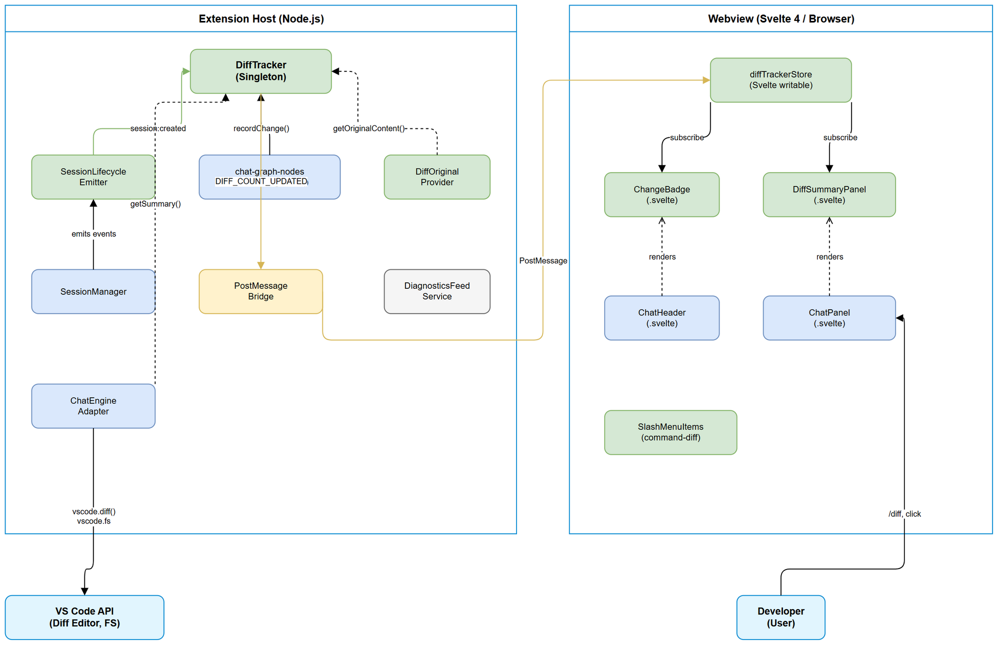
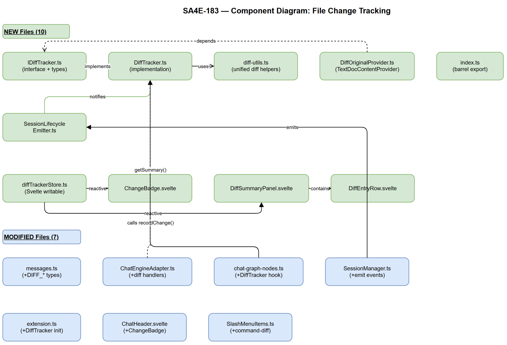
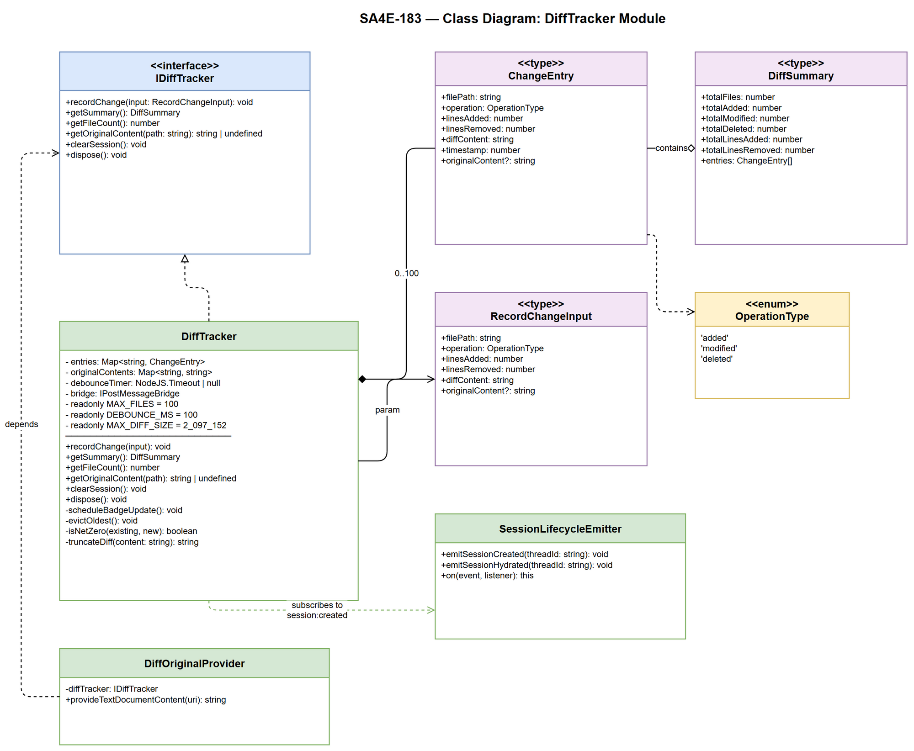

# Technical Design Document (TDD)

## SDLC-Agents-4-Enterprise — SA4E-183: File Change Tracking — Session-wide diff summary visualization

---

## Document Information

| Field | Value |
|-------|-------|
| Jira Ticket | SA4E-183 |
| Title | File Change Tracking — Session-wide diff summary visualization |
| Author | SA Agent |
| Version | 1.0 |
| Date | 2025-07-27 |
| Status | Draft |
| Related BRD | BRD-v1-SA4E-183.docx |
| Related FSD | FSD-v1-SA4E-183.docx |

---

## Author Tracking

| Role | Name - Position | Responsibility |
|------|-----------------|----------------|
| Author | SA Agent – Solution Architect | Create document |
| Peer Reviewer | BA Agent – Business Analyst | Review document |

---

## Revision History

| Version | Date | Author | Changes |
|---------|------|--------|---------|
| 1.0 | 2025-07-27 | SA Agent | Initiate document — auto-generated from BRD and FSD |

---

## Sign-Off

| Name | Signature and date |
|------|--------------------|
| | ☐ I agree and confirm the technical design in this TDD |
| | ☐ I agree and confirm the technical design in this TDD |

---

## 1. Introduction

> **Scope Boundary:** This TDD specifies HOW to implement the requirements defined in the FSD. It does NOT repeat functional requirements, business rules, use cases, or UI specifications — refer to the FSD for those. This document focuses on: technology choices, architecture decisions, implementation patterns, and deployment concerns.

### 1.1 Purpose

This TDD provides the technical design for the File Change Tracking feature (SA4E-183). The feature introduces a session-scoped `DiffTracker` service that aggregates file modifications performed by the AI agent's tool calls, exposing them via a `/diff` slash command, a change badge indicator, and clickable file paths that open VS Code's native diff editor.

### 1.2 Scope

Technical scope covers:
- **Extension Host**: New `DiffTracker` service module (`extension/src/chat/diff/`)
- **Extension Host**: Integration hooks in `chat-graph-nodes.ts`, `ChatEngineAdapter`, and `extension.ts`
- **Extension Host**: `SessionLifecycleEmitter` for clean session reset
- **Extension Host**: `TextDocumentContentProvider` for `diff-original:` URI scheme
- **Webview**: New Svelte store (`diffTrackerStore`), `ChangeBadge` component, `DiffSummaryPanel` component
- **Webview**: PostMessage bridge extensions for `DIFF_*` message types
- **Shared**: Message type extensions in `messages.ts`

### 1.3 Technology Stack

| Layer | Technology | Version |
|-------|-----------|---------|
| Language | TypeScript | 5.x |
| Extension Host Framework | VS Code Extension API | ≥1.80 |
| Webview UI | Svelte 4 | 4.x |
| Build Tool | esbuild + Vite | Latest |
| Diff Library | `diff` (npm) | ^5.x |
| Test Framework | Vitest | Latest |

### 1.4 Design Principles

- **SOLID** — Single Responsibility for DiffTracker, ISP for IDiffTracker interface, DIP for all dependencies
- **Observer Pattern** — SessionLifecycleEmitter decouples session events from consumers
- **Strategy Pattern** — Tool-to-ChangeEntry mapping via `DIFF_TRACKED_TOOLS` allowlist
- **Template Method** — Existing `BasePage` pattern extended to DiffSummaryPanel rendering
- **Debounce Pattern** — Badge updates throttled to prevent UI flicker

### 1.5 Constraints

- In-memory only — no persistence, no disk I/O for state (acceptable per BRD assumptions)
- Maximum 100 files tracked per session (BR-03)
- Memory budget ≤ 10MB total for DiffTracker state (BR-09)
- Per-entry diffContent capped at 2MB (OI-05 resolution)
- VS Code Extension API sandboxing — webview communication via postMessage only
- Must not impact extension startup time (< 1ms DiffTracker init overhead)

### 1.6 References

| Document | Location |
|----------|----------|
| BRD | BRD-v1-SA4E-183.docx |
| FSD | FSD-v1-SA4E-183.docx |
| OpenCodeToolHandler | extension/src/chat/tools/OpenCodeToolHandler.ts |
| ChatEngineAdapter | extension/src/chat/engine/ChatEngineAdapter.ts |
| SessionManager | extension/src/chat/engine/SessionManager.ts |
| chat-graph-nodes | extension/src/langgraph/subgraphs/chat-graph-nodes.ts |
| messages.ts | extension/src/chat/types/messages.ts |

---

## 2. System Architecture

### 2.1 Architecture Overview

The File Change Tracking feature operates within the VS Code extension plugin architecture. It spans two execution contexts — the Extension Host (Node.js) and the Webview (browser/Svelte) — communicating via the PostMessage bridge.

**Key architectural decisions:**
1. DiffTracker is a **singleton service** in the Extension Host, injected into the tool execution pipeline
2. Change data flows **one-way** from Extension Host → Webview (badge count push, summary on-demand)
3. Session lifecycle uses the **Observer pattern** via `SessionLifecycleEmitter`
4. Original file content is captured **before** tool execution (pre-read strategy, OI-01 resolved)
5. VS Code diff editor integration uses a registered `TextDocumentContentProvider` for the `diff-original:` scheme (OI-02 resolved)



### 2.2 Component Diagram

The feature introduces 10 new files and modifies 6 existing files:



| Component | Responsibility | Technology |
|-----------|---------------|------------|
| `IDiffTracker` | Interface contract for DiffTracker service | TypeScript interface |
| `DiffTracker` | Concrete implementation — in-memory Map, debounced badge, eviction | TypeScript class |
| `SessionLifecycleEmitter` | EventEmitter for session:created / session:hydrated events | Node.js EventEmitter |
| `DiffOriginalProvider` | TextDocumentContentProvider serving original file content | VS Code API |
| `diffTrackerStore` | Svelte writable store for webview reactive state | Svelte store |
| `ChangeBadge` | Badge component in ChatHeader showing file count | Svelte component |
| `DiffSummaryPanel` | Expandable inline panel with grouped file list + diffs | Svelte component |
| `DiffEntryRow` | Single file row with expand/collapse + clickable path | Svelte component |

### 2.3 Communication Patterns

| From | To | Protocol | Pattern | Description |
|------|----|----------|---------|-------------|
| Tool execution (chat-graph-nodes) | DiffTracker | Method call | Sync | `recordChange(input)` after successful tool |
| DiffTracker | Webview | PostMessage | Async push | `DIFF_COUNT_UPDATED` (debounced 100ms) |
| Webview (command) | DiffTracker | PostMessage | Request/Response | `COMMAND_DISPATCH{diff}` → `DIFF_SUMMARY_RESPONSE` |
| Webview (click) | Extension Host | PostMessage | Fire-and-forget | `DIFF_OPEN_FILE` → opens editor |
| SessionLifecycleEmitter | DiffTracker | Event | Observer | `session:created` → `clearSession()` |

---

## 3. API Design

> **Note:** This feature has no REST/HTTP APIs. The "API" is the TypeScript interface contract and PostMessage protocol.

### 3.1 DiffTracker Public Interface

```typescript
/** extension/src/chat/diff/IDiffTracker.ts */

export type OperationType = 'added' | 'modified' | 'deleted';

export interface ChangeEntry {
  filePath: string;
  operation: OperationType;
  linesAdded: number;
  linesRemoved: number;
  diffContent: string;
  timestamp: number;
  originalContent?: string;
}

export interface DiffSummary {
  totalFiles: number;
  totalAdded: number;
  totalModified: number;
  totalDeleted: number;
  totalLinesAdded: number;
  totalLinesRemoved: number;
  entries: ChangeEntry[];
}

export interface RecordChangeInput {
  filePath: string;
  operation: OperationType;
  linesAdded: number;
  linesRemoved: number;
  diffContent: string;
  originalContent?: string;
}

export interface IDiffTracker {
  /** Record a successful file change. Debounces badge update (100ms). */
  recordChange(input: RecordChangeInput): void;
  /** Compute current aggregated summary on demand. */
  getSummary(): DiffSummary;
  /** Get current tracked file count. */
  getFileCount(): number;
  /** Get original content for a tracked file (for VS Code diff editor). */
  getOriginalContent(filePath: string): string | undefined;
  /** Clear all tracked state (session reset). */
  clearSession(): void;
  /** Dispose resources (debounce timer). */
  dispose(): void;
}
```

### 3.2 PostMessage Protocol Extensions

#### New Extension Host → Webview Messages

```typescript
// Additions to ExtensionMessageType union:
| 'DIFF_COUNT_UPDATED'
| 'DIFF_SUMMARY_RESPONSE'

// Additions to ExtensionMessage union:
| { type: 'DIFF_COUNT_UPDATED'; count: number }
| { type: 'DIFF_SUMMARY_RESPONSE'; summary: DiffSummaryPayload }
```

#### New Webview → Extension Host Messages

```typescript
// Addition to WebviewMessageType union:
| 'DIFF_OPEN_FILE'

// Addition to WebviewMessage union:
| { type: 'DIFF_OPEN_FILE'; filePath: string; operation: 'added' | 'modified' | 'deleted' }
```

#### Payload Types (shared)

```typescript
export interface DiffSummaryPayload {
  totalFiles: number;
  totalAdded: number;
  totalModified: number;
  totalDeleted: number;
  totalLinesAdded: number;
  totalLinesRemoved: number;
  entries: ChangeEntryPayload[];
}

export interface ChangeEntryPayload {
  filePath: string;
  operation: 'added' | 'modified' | 'deleted';
  linesAdded: number;
  linesRemoved: number;
  diffContent: string;
  timestamp: number;
}
```

### 3.3 Slash Command Registration

```typescript
// New entry in SLASH_COMMANDS (SlashMenuItems.ts):
{
  id: 'command-diff',
  icon: '\u{1F4C4}',
  label: 'diff',
  description: 'Show session file changes',
  itemType: 'command',
}
```

### 3.4 SessionLifecycleEmitter Interface

```typescript
/** extension/src/chat/engine/SessionLifecycleEmitter.ts */
import { EventEmitter } from 'events';

export type SessionEvent = 'session:created' | 'session:hydrated';

export interface ISessionLifecycleEmitter {
  on(event: 'session:created', listener: (threadId: string) => void): this;
  on(event: 'session:hydrated', listener: (threadId: string) => void): this;
  emitSessionCreated(threadId: string): void;
  emitSessionHydrated(threadId: string): void;
}
```

---

## 4. Database Design

Not applicable — this feature is entirely in-memory with no persistence layer.

The in-memory data structure is:
```typescript
// DiffTracker internal state
private entries: Map<string, ChangeEntry>;        // key = filePath, max 100 entries
private originalContents: Map<string, string>;     // key = filePath, original file snapshots
```

No migration scripts required.

---

## 5. Class / Module Design

### 5.1 Package Structure

```
extension/src/
├── chat/
│   ├── diff/                          # NEW — DiffTracker module
│   │   ├── IDiffTracker.ts            # Interface + types (ChangeEntry, DiffSummary, etc.)
│   │   ├── DiffTracker.ts             # Concrete implementation (≤200 lines)
│   │   ├── DiffOriginalProvider.ts    # TextDocumentContentProvider for diff-original: scheme
│   │   ├── diff-utils.ts             # Unified diff computation helpers
│   │   └── index.ts                   # Barrel export
│   ├── engine/
│   │   ├── SessionLifecycleEmitter.ts # NEW — Event emitter for session lifecycle
│   │   ├── ChatEngineAdapter.ts       # MODIFIED — add diff command + DIFF_OPEN_FILE handler
│   │   ├── SessionManager.ts          # MODIFIED — emit session lifecycle events
│   │   └── ISessionManager.ts         # NO CHANGE
│   ├── types/
│   │   └── messages.ts                # MODIFIED — add DIFF_* message types
│   └── tools/
│       └── OpenCodeToolHandler.ts     # NO CHANGE (tool itself unchanged)
├── langgraph/
│   └── subgraphs/
│       └── chat-graph-nodes.ts        # MODIFIED — add DiffTracker recording hook
├── webview/
│   ├── stores/
│   │   └── diffTrackerStore.ts        # NEW — Svelte writable store
│   ├── components/
│   │   ├── ChangeBadge.svelte         # NEW — Badge in ChatHeader
│   │   ├── DiffSummaryPanel.svelte    # NEW — Expandable diff panel
│   │   ├── DiffEntryRow.svelte        # NEW — Single file row component
│   │   └── ChatHeader.svelte          # MODIFIED — add ChangeBadge import
│   ├── slash-menu/
│   │   └── SlashMenuItems.ts          # MODIFIED — add command-diff
│   └── postMessage.ts                 # MODIFIED — add diff helpers
└── extension.ts                        # MODIFIED — instantiate DiffTracker, wire lifecycle
```

### 5.2 Key Interfaces

```typescript
/** IDiffTracker — core contract (see §3.1 for full definition) */
export interface IDiffTracker {
  recordChange(input: RecordChangeInput): void;
  getSummary(): DiffSummary;
  getFileCount(): number;
  getOriginalContent(filePath: string): string | undefined;
  clearSession(): void;
  dispose(): void;
}

/** ISessionLifecycleEmitter — Observer for session events */
export interface ISessionLifecycleEmitter {
  on(event: 'session:created', listener: (threadId: string) => void): this;
  on(event: 'session:hydrated', listener: (threadId: string) => void): this;
  emitSessionCreated(threadId: string): void;
  emitSessionHydrated(threadId: string): void;
}

/** Extended ChatEngineAdapterDeps — adds diffTracker */
export interface ChatEngineAdapterDeps {
  // ... existing deps
  diffTracker: IDiffTracker;
}
```

### 5.3 Class Diagram



### 5.4 Design Patterns

| Pattern | Where Used | Rationale |
|---------|-----------|-----------|
| Singleton | DiffTracker (one per extension activation) | Session-scoped state must be centralized |
| Observer | SessionLifecycleEmitter → DiffTracker | Decouples session management from change tracking (SRP) |
| Strategy | Tool-to-ChangeEntry mapping via allowlist | Different tools require different diff computation logic |
| Debounce | Badge PostMessage update | Prevents UI flicker on rapid file changes (BR-06) |
| Content Provider | DiffOriginalProvider | VS Code standard pattern for virtual document schemes |
| Dependency Injection | DiffTracker into executeSingleTool, ChatEngineAdapter | Testability, follows existing diagnosticsFeed pattern |

### 5.5 Error Handling

| Scenario | Handler | Behavior |
|----------|---------|----------|
| Invalid RecordChangeInput (empty path) | DiffTracker.recordChange | Log error, discard entry silently (EF-02) |
| DiffTracker not initialized | recordChange call guard | Log warning, discard (EF-01) |
| Max files exceeded (>100) | DiffTracker.recordChange | Evict oldest, log warning (AF-03) |
| File read failure for originalContent | Pre-read in executeSingleTool | Skip original capture, proceed (still track change) |
| `vscode.diff` command failure | handleDiffOpenFile | Show error notification to user |
| File not found on click | handleDiffOpenFile | Show info notification: "File not found: {path}" |
| Webview unavailable for PostMessage | DiffTracker badge send | No-op (graceful degradation) |

---

## 6. Integration Design

### 6.1 Integration: Tool Execution Hook (chat-graph-nodes.ts)

| Attribute | Value |
|-----------|-------|
| Location | `extension/src/langgraph/subgraphs/chat-graph-nodes.ts` |
| Function | `executeSingleTool()` |
| Hook Point | After `diagnosticsFeed.markTouchedFromTool(...)`, before `return` |
| Injection | `diffTracker?: IDiffTracker` as additional parameter |
| Pattern | Follows existing `diagnosticsFeed` optional param pattern |

**Sequence:**

```
executeSingleTool called with DiffTracker param
  ├── Pre-read: if tool in DIFF_TRACKED_TOOLS, read file content BEFORE execution
  ├── Execute tool (existing logic)
  ├── Check result: if starts with "Error:" or "Denied" → skip recording
  ├── Build ChangeEntry via buildChangeEntry(toolName, args, result, originalContent)
  └── Call diffTracker.recordChange(entry)
```

**Tool Allowlist:**
```typescript
const DIFF_TRACKED_TOOLS = new Set([
  'write_file', 'fs_write', 'str_replace',
  'fs_append', 'delete_file', 'stream_write_file'
]);
```

**Pre-read Strategy (OI-01 Resolved → Option A):**
- Before tool execution, if `call.name ∈ DIFF_TRACKED_TOOLS` and not a create-only tool:
  - Read the target file's content via `vscode.workspace.fs.readFile(uri)`
  - Store as `preContent: string | undefined`
- After successful execution:
  - Pass `preContent` as `originalContent` in `RecordChangeInput`
- If file doesn't exist before write → `originalContent = undefined` → operation = `'added'`

### 6.2 Integration: COMMAND_DISPATCH Hook (ChatEngineAdapter.ts)

| Attribute | Value |
|-----------|-------|
| Location | `extension/src/chat/engine/ChatEngineAdapter.ts` |
| Method | `handleCommandDispatch()` |
| Change | Add early-return branch for `command === 'diff'` |

**Modified logic:**
```typescript
private async handleCommandDispatch(payload: unknown): Promise<void> {
  const msg = payload as Extract<WebviewMessage, { type: 'COMMAND_DISPATCH' }>;
  if (msg.command === 'diff') {
    const summary = this.deps.diffTracker.getSummary();
    this.deps.bridge.postToWebview({
      type: 'DIFF_SUMMARY_RESPONSE',
      summary: this.toSummaryPayload(summary),
    });
    return;
  }
  await vscode.commands.executeCommand(msg.command, msg.args);
}
```

### 6.3 Integration: DIFF_OPEN_FILE Handler (ChatEngineAdapter.ts)

| Attribute | Value |
|-----------|-------|
| Location | `extension/src/chat/engine/ChatEngineAdapter.ts` |
| Registration | `router.registerHandler('DIFF_OPEN_FILE', ...)` in `registerMessageHandlers()` |

**Logic:**
- `operation === 'deleted'` → `vscode.window.showInformationMessage("File has been deleted: {path}")`
- `operation === 'added'` → `vscode.window.showTextDocument(fileUri)`
- `operation === 'modified'` → create `diff-original:{filePath}` URI, call `vscode.commands.executeCommand('vscode.diff', originalUri, currentUri, title)`

### 6.4 Integration: Session Lifecycle (SessionManager → DiffTracker)

| Attribute | Value |
|-----------|-------|
| Mechanism | `SessionLifecycleEmitter` (new EventEmitter class) |
| Emitter Location | `SessionManager.resolveSession()` |
| Consumer | `DiffTracker` subscribes in `activate()` |

**SessionManager modification:**
- Inject `SessionLifecycleEmitter` into constructor
- In `resolveSession()`: when `createIfMissing=true` and a new thread is created → `emitter.emitSessionCreated(thread_id)`
- When existing active thread found → `emitter.emitSessionHydrated(thread_id)`

**DiffTracker subscription in activate():**
```typescript
sessionLifecycle.on('session:created', () => diffTracker.clearSession());
// session:hydrated → no reset (BR-05)
```

### 6.5 Integration: DiffOriginalProvider (TextDocumentContentProvider)

| Attribute | Value |
|-----------|-------|
| URI Scheme | `diff-original` |
| Registration | `vscode.workspace.registerTextDocumentContentProvider('diff-original', provider)` in `activate()` |
| Content Source | `DiffTracker.getOriginalContent(filePath)` |

```typescript
export class DiffOriginalProvider implements vscode.TextDocumentContentProvider {
  constructor(private readonly diffTracker: IDiffTracker) {}

  provideTextDocumentContent(uri: vscode.Uri): string {
    const filePath = uri.path;
    return this.diffTracker.getOriginalContent(filePath) ?? '';
  }
}
```

**Security:** The provider only returns content from DiffTracker's own `originalContents` Map — no arbitrary file system access.

### 6.6 Integration: stream_write_file Handling (OI-04 Resolved → Option B)

`stream_write_file` writes in multiple chunks. The tracking strategy:
1. On first chunk for a new file: capture pre-read content as `originalContent`
2. On final/complete signal: compute cumulative diff (original → final content)
3. Call `diffTracker.recordChange()` only once at completion

This is handled by detecting `stream_write_file` tool name and deferring the record until the tool's result string indicates completion (non-error result).

---

## 7. Security Design

### 7.1 Authentication

Not applicable — feature operates entirely within local VS Code extension process. No remote calls, no authentication.

### 7.2 Data Protection

| Data Type | At Rest | In Transit | In Logs | Risk |
|-----------|---------|------------|---------|------|
| File paths | In-memory only | PostMessage (local IPC) | Not logged | Low |
| Diff content | In-memory only | PostMessage (local IPC) | Not logged | Low — may contain source code |
| Original content | In-memory only | Not transmitted | Not logged | Low — may contain secrets |

**Key mitigations:**
- No data persisted to disk (session-scoped, memory-only)
- No data transmitted to external services or network
- PostMessage communication is sandboxed within VS Code webview
- Memory cleared on session reset and extension deactivation

### 7.3 Input Validation

| Input | Source | Validation | Sanitization |
|-------|--------|-----------|--------------|
| `filePath` in RecordChangeInput | Tool execution result | Non-empty string check | N/A (trusted internal source) |
| `operation` in RecordChangeInput | Computed from tool type | Must be `'added' \| 'modified' \| 'deleted'` | N/A |
| `DIFF_OPEN_FILE.filePath` | Webview postMessage | Validate within workspace folder bounds | `Uri.joinPath` resolution |
| `diffContent` size | Diff computation | Truncate at 2MB per entry | Append "[diff truncated]" message |

### 7.4 Security Boundaries

| Boundary | Enforcement |
|----------|-------------|
| `diff-original:` URI scheme | Provider only serves from DiffTracker's Map — no FS access |
| File path in DIFF_OPEN_FILE | Resolved via `Uri.joinPath(wsFolder.uri, ...)` — stays within workspace |
| PostMessage type validation | Discriminated union ensures only known message types are handled |

---

## 8. Performance & Scalability

### 8.1 Performance Targets

| Operation | Target | Measurement |
|-----------|--------|-------------|
| `recordChange()` latency | < 5ms (p99) | Performance.now() in dev builds |
| Badge PostMessage roundtrip | ≤ 100ms (debounce window) | Design guarantee (100ms debounce) |
| `getSummary()` computation | < 50ms for 100 entries | Performance.now() measurement |
| DiffSummaryPanel render (50 files) | < 200ms FCP | Chrome DevTools in webview |
| DiffTracker init | < 1ms | No I/O, pure object construction |
| Extension startup impact | 0ms | DiffTracker construction is lazy (no I/O) |

### 8.2 Memory Management

| Resource | Budget | Enforcement |
|----------|--------|-------------|
| entries Map | Max 100 entries | Evict oldest on overflow (BR-03) |
| Per-entry diffContent | Max 2MB | Truncate with "[diff truncated — too large]" (OI-05) |
| originalContents Map | Max 100 entries | Keyed same as entries, evicted together |
| Total DiffTracker memory | ≤ 10MB | Bounded by 100 entries × ~100KB avg |

### 8.3 Debounce Strategy

```typescript
// Badge update debounced at 100ms (BR-06)
private debounceTimer: NodeJS.Timeout | null = null;

private scheduleBadgeUpdate(): void {
  if (this.debounceTimer) clearTimeout(this.debounceTimer);
  this.debounceTimer = setTimeout(() => {
    this.bridge.postToWebview({
      type: 'DIFF_COUNT_UPDATED',
      count: this.entries.size
    });
    this.debounceTimer = null;
  }, 100);
}
```

### 8.4 Large Diff Handling

- Diffs > 500 lines: collapsed by default in UI with "Show full diff" button (BR-17)
- Diffs > 2MB: truncated at storage level, append "[diff truncated — too large]"
- 10+ rapid file changes in 50ms: all recorded, badge updates once (debounce)

---

## 9. Monitoring & Observability

### 9.1 Logging

| Log Event | Level | Fields | Destination |
|-----------|-------|--------|-------------|
| Change recorded | DEBUG | filePath, operation, linesAdded, linesRemoved | Extension output channel |
| Max files eviction | WARN | evictedPath, currentCount | Extension output channel |
| Session reset | INFO | threadId | Extension output channel |
| Invalid entry discarded | ERROR | filePath, reason | Extension output channel |
| Original content capture failed | WARN | filePath, error | Extension output channel |
| DiffContent truncated | WARN | filePath, originalSize | Extension output channel |

### 9.2 Metrics (Dev-time only)

| Metric | Type | Description |
|--------|------|-------------|
| recordChange latency | Histogram | p50/p95/p99 of recordChange duration |
| entries count | Gauge | Current tracked file count |
| badge debounce fires | Counter | How many times badge update actually sends |

---

## 10. Deployment Considerations

### 10.1 Feature Flag

| Flag | Default | Description |
|------|---------|-------------|
| `sa4e183.diffTracker.enabled` | `true` | Enable/disable DiffTracker feature at runtime |

When disabled: DiffTracker methods become no-ops, badge is hidden, `/diff` command shows "Feature disabled".

### 10.2 Dependencies

| Dependency | Version | Size | Purpose |
|-----------|---------|------|---------|
| `diff` (npm) | ^5.2.0 | ~12KB gzipped | Unified diff computation (OI-07 resolved → Option A) |

**Rationale for `diff` library:** Proven, minimal dependency tree, handles edge cases (binary files, large files, encoding). Bundle size impact is negligible for an extension.

### 10.3 Rollback Strategy

Feature is self-contained in-memory module. Rollback = revert the git branch. No data migration, no persistence, no external state to clean up.

### 10.4 VS Code Compatibility

- Minimum: VS Code ≥ 1.80 (matches existing extension baseline)
- Uses `vscode.workspace.registerTextDocumentContentProvider` (stable API since 1.0)
- Uses `vscode.commands.executeCommand('vscode.diff', ...)` (stable API since 1.0)
- No proposed APIs used

---

## 11. Open Issues Resolution

All 7 Open Issues from FSD Section 12.9 are resolved:

| OI | Issue | Resolution | Rationale |
|----|-------|-----------|-----------|
| OI-01 | Original content capture timing | **Option A: Pre-read in `executeSingleTool`** | Least invasive; follows existing `diagnosticsFeed` pattern; file read before tool execution guarantees consistent original |
| OI-02 | Virtual document provider for `diff-original:` | **Option A: Register `TextDocumentContentProvider`** | Cleanest VS Code API usage; no disk I/O for temp files; provider only serves from DiffTracker's Map (secure) |
| OI-03 | DiffTracker injection into `executeSingleTool` | **Option A: Pass as additional param** | Matches existing `diagnosticsFeed` optional parameter pattern; minimal architecture change |
| OI-04 | `stream_write_file` multi-chunk tracking | **Option B: Track only final result** | Produces meaningful cumulative diff; avoids noisy intermediate entries; detect completion via non-error result string |
| OI-05 | Memory cap for diffContent | **Option A: Hard truncate at 2MB** | Append "[diff truncated — too large]" message; protects memory budget; 2MB is generous for any reasonable diff |
| OI-06 | Session lifecycle event mechanism | **Option A: SessionLifecycleEmitter** | Clean SRP; testable EventEmitter; follows Observer pattern; decouples SessionManager from consumers |
| OI-07 | Diff computation library | **Option A: Use `diff` npm package** | Proven library (~12KB); handles edge cases; `createTwoFilesPatch()` produces standard unified format |

---

## 12. Implementation Checklist

Ordered tasks for DEV agent. Dependencies indicated by `→` (must complete before).

### Phase 1: Core Types & Interface (Day 1)

| # | Task | File | Est. Lines |
|---|------|------|-----------|
| 1.1 | Create `IDiffTracker.ts` — interface + all types | `extension/src/chat/diff/IDiffTracker.ts` | ~60 |
| 1.2 | Create `index.ts` — barrel export | `extension/src/chat/diff/index.ts` | ~5 |
| 1.3 | Create `diff-utils.ts` — `computeUnifiedDiff()`, `countLines()`, `truncateDiff()` helpers | `extension/src/chat/diff/diff-utils.ts` | ~80 |
| 1.4 | Modify `messages.ts` — add `DIFF_COUNT_UPDATED`, `DIFF_SUMMARY_RESPONSE`, `DIFF_OPEN_FILE` | `extension/src/chat/types/messages.ts` | ~20 additions |

### Phase 2: Extension Host Service (Day 1-2) → depends on Phase 1

| # | Task | File | Est. Lines |
|---|------|------|-----------|
| 2.1 | Create `DiffTracker.ts` — concrete implementation (recordChange, getSummary, clearSession, debounce) | `extension/src/chat/diff/DiffTracker.ts` | ~150 |
| 2.2 | Create `SessionLifecycleEmitter.ts` | `extension/src/chat/engine/SessionLifecycleEmitter.ts` | ~30 |
| 2.3 | Create `DiffOriginalProvider.ts` — TextDocumentContentProvider | `extension/src/chat/diff/DiffOriginalProvider.ts` | ~30 |
| 2.4 | Modify `SessionManager.ts` — inject emitter, emit events in `resolveSession()` | `extension/src/chat/engine/SessionManager.ts` | ~15 additions |

### Phase 3: Integration Hooks (Day 2) → depends on Phase 2

| # | Task | File | Est. Lines |
|---|------|------|-----------|
| 3.1 | Modify `chat-graph-nodes.ts` — add `diffTracker` param, pre-read, record after tool | `extension/src/langgraph/subgraphs/chat-graph-nodes.ts` | ~40 additions |
| 3.2 | Modify `ChatEngineAdapter.ts` — add `IDiffTracker` to deps, handle `diff` command, register `DIFF_OPEN_FILE` handler | `extension/src/chat/engine/ChatEngineAdapter.ts` | ~50 additions |
| 3.3 | Modify `extension.ts` — instantiate DiffTracker, register provider, wire lifecycle, pass to deps | `extension/src/extension.ts` | ~25 additions |

### Phase 4: Webview (Day 2-3) → depends on Phase 1

| # | Task | File | Est. Lines |
|---|------|------|-----------|
| 4.1 | Create `diffTrackerStore.ts` — writable store with fileCount + summary + actions | `extension/src/webview/stores/diffTrackerStore.ts` | ~50 |
| 4.2 | Create `ChangeBadge.svelte` — reactive badge component | `extension/src/webview/components/ChangeBadge.svelte` | ~60 |
| 4.3 | Create `DiffEntryRow.svelte` — single file row with expand/collapse | `extension/src/webview/components/DiffEntryRow.svelte` | ~80 |
| 4.4 | Create `DiffSummaryPanel.svelte` — grouped expandable panel | `extension/src/webview/components/DiffSummaryPanel.svelte` | ~120 |
| 4.5 | Modify `ChatHeader.svelte` — import/render ChangeBadge | `extension/src/webview/components/ChatHeader.svelte` | ~5 additions |
| 4.6 | Modify `ChatPanel.svelte` — handle `DIFF_COUNT_UPDATED` and `DIFF_SUMMARY_RESPONSE` messages | `extension/src/webview/components/ChatPanel.svelte` | ~20 additions |
| 4.7 | Modify `SlashMenuItems.ts` — add `command-diff` entry | `extension/src/webview/slash-menu/SlashMenuItems.ts` | ~7 additions |
| 4.8 | Modify `postMessage.ts` — add `requestDiffSummary()` and `openDiffFile()` helpers | `extension/src/webview/postMessage.ts` | ~15 additions |

### Phase 5: Testing (Day 3-4) → depends on Phase 3, 4

| # | Task | File | Est. Lines |
|---|------|------|-----------|
| 5.1 | Unit tests: DiffTracker (record, merge, evict, clear, debounce) | `extension/src/chat/diff/__tests__/DiffTracker.test.ts` | ~200 |
| 5.2 | Unit tests: diff-utils (computeUnifiedDiff, truncation) | `extension/src/chat/diff/__tests__/diff-utils.test.ts` | ~100 |
| 5.3 | Unit tests: SessionLifecycleEmitter | `extension/src/chat/engine/__tests__/SessionLifecycleEmitter.test.ts` | ~50 |
| 5.4 | Integration test: recordChange from executeSingleTool mock | `extension/src/langgraph/__tests__/diff-tracker-integration.test.ts` | ~100 |
| 5.5 | Unit tests: ChatEngineAdapter diff command handling | `extension/src/chat/engine/__tests__/ChatEngineAdapter.diff.test.ts` | ~80 |

**Total estimated new code:** ~830 lines across 10 new files + ~180 lines modifications in 7 existing files.

---

## Appendix

### Glossary

| Term | Definition |
|------|------------|
| DiffTracker | Session-scoped singleton service that records, aggregates, and exposes file change data |
| ChangeEntry | Single file modification record with path, operation type, line counts, and diff content |
| DiffSummary | Aggregated view of all entries with totals and grouped entries array |
| PostMessage Bridge | VS Code webview ↔ Extension Host communication via `postMessage` API |
| SessionLifecycleEmitter | EventEmitter that broadcasts session:created and session:hydrated events |
| DiffOriginalProvider | TextDocumentContentProvider serving original file content for VS Code diff editor |

### Diagram Index

| # | Diagram | Image | Source (editable) |
|---|---------|-------|-------------------|
| 1 | Architecture Overview | [architecture.png](diagrams/architecture.png) | [architecture.drawio](diagrams/architecture.drawio) |
| 2 | Component Diagram | [component.png](diagrams/component.png) | [component.drawio](diagrams/component.drawio) |
| 3 | Class Diagram — DiffTracker | [class-diff-tracker.png](diagrams/class-diff-tracker.png) | [class-diff-tracker.drawio](diagrams/class-diff-tracker.drawio) |
