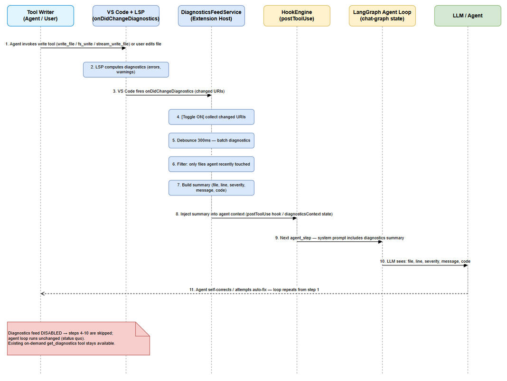
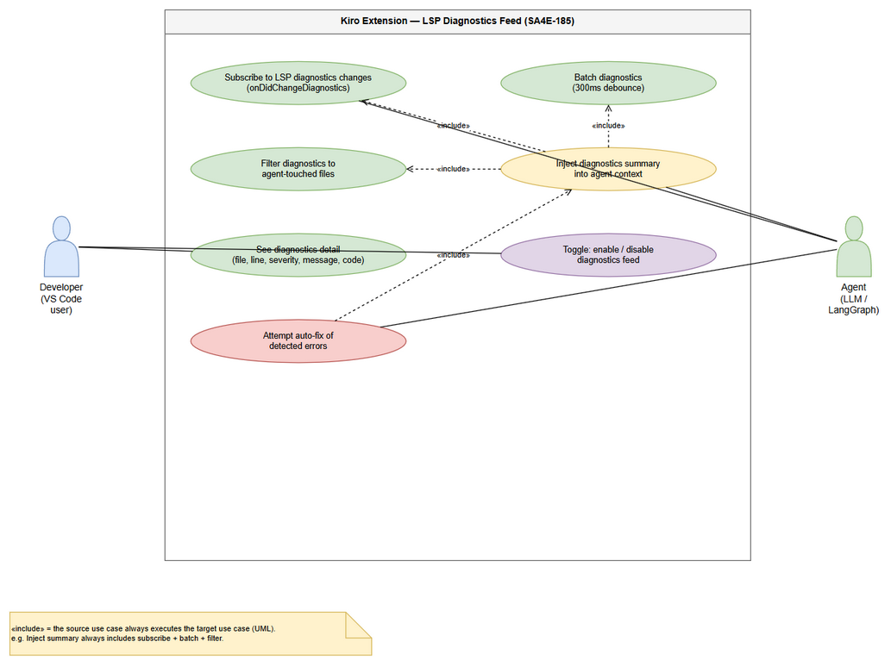

# Business Requirements Document (BRD)

## SDLC-Agents-4-Enterprise — SA4E-185: LSP Diagnostics Feed — Realtime errors into agent loop

---

## Document Information

| Field | Value |
|-------|-------|
| Jira Ticket | SA4E-185 |
| Title | LSP Diagnostics Feed — Realtime errors into agent loop |
| Author | BA Agent |
| Version | 1.0 |
| Date | 2026-08-19 |
| Status | Draft |

---

## Author Tracking

| Role | Name - Position | Responsibility |
|------|-----------------|----------------|
| Author | BA Agent – Business Analyst | Create document |
| Peer Reviewer | SA Agent – Solution Architect | Review document |

---

## Revision History

| Version | Date | Author | Changes |
|---------|------|--------|---------|
| 1.0 | 2026-08-19 | BA Agent | Initiate document — auto-generated from Jira ticket SA4E-185 and verified against codebase (extension/src) |

---

## Sign-Off

| Name | Signature and date |
|------|--------------------|
| | ☐ I agree and confirm all criteria on this BRD as expected requirements |
| | ☐ I agree and confirm all criteria on this BRD as expected requirements |

---

## 1. Introduction

### 1.1 Scope

This change request closes **gap F4** of the Chat Module epic (SA4E-181, status **Done**): feed **realtime language server (LSP) diagnostics** (errors, warnings) into the interactive agent loop so the agent can **self-correct** while working in the workspace.

The feature adds a push-based **Diagnostics Feed** to the Kiro VS Code extension. The extension subscribes to VS Code diagnostics change events (`vscode.languages.onDidChangeDiagnostics`), debounces and batches them (**300 ms**), filters them down to **files the agent recently touched**, and injects a compact diagnostic summary — containing **file, line, severity, message, code** — into the agent's context **on the next turn**. The user can **toggle** the feed on/off, and the agent can **attempt a fix** when relevant errors are detected.

**Technical anchor points (verified against codebase, 2026-08-19):**

1. The agent loop lives in `extension/src/langgraph/subgraphs/chat-graph.ts` (ReAct loop: `fetch_tools → agent_step → execute_tools / verify_response → synthesize`, `MAX_AGENT_ITERATIONS = 12`). Context is merged into the system prompt via `buildFinalSystemPrompt(state)` using the `state.kbContext` channel (`extension/src/langgraph/core/state.ts`, `PipelineAnnotation`, KSA-210).
2. A hook mechanism already exists — `HookEngine` (`extension/src/langgraph/hooks/hook-engine.ts`) fires `preToolUse`, `postToolUse`, `promptSubmit`, `agentStop`. On write-tool events it fires `fileCreated`/`fileEdited` hooks (`fireFileHooks` for `fs_write`, `stream_write_file`, etc.) and returns `injectedPrompts` back into the loop. This satisfies the ticket's "Feed via hook mechanism (postToolUse when write tool fires)" option.
3. A dedicated recursive service can alternatively satisfy the ticket's "DiagnosticsFeedService injecting into `state.contextItems`" option. **Note:** a `contextItems` channel does **not** exist yet in `PipelineAnnotation` — the closest existing channel is `kbContext`. The exact injection channel (new `diagnosticsContext` channel vs. reuse of `kbContext`) is a design decision left for SA/DEV in FSD phase; the BRD only requires that the summary be visible to the agent on the next turn.
4. Several related, non-identical diagnostics capabilities already exist and must NOT be confused with this ticket:
   - `extension/src/diagnostics-provider.ts` (KSA-178): on file **save**, queries `code_search` for issues, renders them as VS Code diagnostics + CodeAction quick-fixes. This is **pull/search-based, save-triggered**, not realtime LSP.
   - `get_diagnostics` VS Code tool (`extension/src/langgraph/vscode/vscode-tools.ts`): **pull-based** on-demand tool the agent can call. It remains available; the new feed does not replace it.

### 1.2 Out of Scope

- Modifying or removing the existing KSA-178 `diagnostics-provider.ts` (code_search-based diagnostics + CodeActions).
- Removing or altering the existing pull-based `get_diagnostics` agent tool.
- Implementing generic LSP quick-fix CodeActions (provided natively by VS Code/LSP for LSP diagnostics).
- Persisting diagnostic summaries across sessions (feed state is in-memory, per-session; cleared on extension restart).
- Ingesting non-LSP diagnostics sources beyond what `onDidChangeDiagnostics` delivers (e.g., task output, test runners, linters not registered as diagnostics providers).
- Changing SDLC pipeline agents (docs-graph, sdlc-graph, hotfix-graph) — this ticket targets the **interactive chat agent loop** in `langgraph/subgraphs/chat-graph.ts`.
- Building new dedicated UI surfaces (panel/Problems-tree customizations) — the feed uses existing chat context channels only.

### 1.3 Preliminary Requirement

- **Epic SA4E-181** — Chat Module — OpenCode Parity + Agentic Config System — **Done** (parent epic of SA4E-185).
- **LangGraph chat subgraph** (`extension/src/langgraph/subgraphs/chat-graph.ts`) with `buildFinalSystemPrompt(state)` merging `state.kbContext` — **exists**.
- **HookEngine** (`extension/src/langgraph/hooks/hook-engine.ts`) with `postToolUse` + `fireFileHooks` for write tools — **exists** (KSA-280).
- **VS Code API** `vscode.languages.onDidChangeDiagnostics` — available in the VS Code API surface (LSP push channel).
- **VS Code settings pattern** (`kiroSdlc.*` keys declared in `extension/package.json` `contributes.configuration`) — exists; the feed toggle follows this pattern.
- **Related BRD** `documents/SA4E-186/BRD.md` (Agent Runtime Routing, same epic) — exists, used as structural reference.

---

## 2. Business Requirements

### 2.1 High Level Process Map

The Diagnostics Feed follows a reactive, push-based pipeline. It is triggered whenever the user edits a file or the agent writes a file with a write tool; the workspace language server then produces diagnostics, VS Code emits `onDidChangeDiagnostics`, and — if the feed is enabled — the extension batches, filters, summarizes and injects the results into the agent context for the next turn. The agent uses the injected diagnostics to self-correct (and optionally auto-fix). When the feed is disabled, the agent loop runs exactly as today.


*[Edit in draw.io](diagrams/business-flow.drawio)*


*[Edit in draw.io](diagrams/use-case.drawio)*

**End-to-end business flow:**

**Step 1:** The agent invokes a write tool (`write_file`, `fs_write`, `stream_write_file`, …) or the user edits a file in the workspace.

**Step 2:** The workspace language server computes diagnostics (errors, warnings) for the changed file in the background.

**Step 3:** VS Code fires the `onDidChangeDiagnostics` event with the changed URIs.

**Step 4:** The DiagnosticsFeedService receives the event. If the feed toggle is **off**, processing stops (status quo). If **on**, the changed URIs are collected.

**Step 5:** Diagnostics are **debounced — 300 ms** quiet window — so bursts from typing/large writes are batched into a single batch.

**Step 6:** The batch is **filtered**: only entries belonging to files the agent recently touched are kept (see BR-4 / BR-5).

**Step 7:** A compact **summary** is built — each entry exposes `file`, `line`, `severity`, `message`, `code` (see BR-6).

**Step 8:** The summary is **injected** into agent context (via the `postToolUse` hook mechanism and/or a dedicated diagnostics state channel, per SA/DEV choice) (see BR-7).

**Step 9:** On the **next agent turn** (`agent_step`/`synthesize`), the system prompt includes the diagnostics summary.

**Step 10:** The LLM sees the diagnostics (file, line, severity, message, code) and can **self-correct**.

**Step 11:** The agent rewrites the file / attempts an auto-fix; the loop repeats from Step 1 until diagnostics are clean — bounded by the existing agent iteration limit (12).

> **Note:** If the diagnostics feed is **disabled** (BR-8), Steps 4–10 are skipped and the agent loop runs unchanged. The pull-based `get_diagnostics` tool remains available at all times as a fallback.

### 2.2 List of User Stories / Use Cases

| # | Story / Use Case | Priority | Source Ticket |
|---|------------------|----------|---------------|
| 1 | As a developer, I want the extension to subscribe to realtime LSP diagnostics events (`vscode.languages.onDidChangeDiagnostics`) and batch them with a 300 ms debounce, so that diagnostics reach the agent loop without flooding the context. | MUST HAVE | SA4E-185 (AC-1, AC-5) |
| 2 | As a developer, I want only diagnostics from files the agent recently touched to be injected as a summary into the agent context on the next turn (file, line, severity, message, code), so that the agent can see and react to errors it caused. | MUST HAVE | SA4E-185 (AC-2, AC-3, AC-4) |
| 3 | As a user, I want to enable or disable the diagnostics feed at any time, so that I control whether the agent receives diagnostics context. | MUST HAVE | SA4E-185 (AC-6) |
| 4 | As a developer, I want the agent to attempt a fix when relevant errors are detected, so that the agent can self-correct without manual intervention. | SHOULD HAVE | SA4E-185 (AC-7) |

---

### 2.3 Details of User Stories

---

#### Business Flow

**Step 1:** User edits a file or agent writes a file in the workspace.

**Step 2:** Workspace LSP computes diagnostics (errors, warnings).

**Step 3:** VS Code fires `onDidChangeDiagnostics` (changed URIs).

**Step 4:** DiagnosticsFeedService checks the user toggle. If off → stop (agent loop unchanged). If on → collect changed URIs.

**Step 5:** Debounce 300 ms (quiet window) → batch diagnostics.

**Step 6:** Filter batch to files the agent recently touched (relevance filter).

**Step 7:** Build compact summary — one line per entry: `file:line severity code message`.

**Step 8:** Inject summary into agent context (postToolUse hook output and/or dedicated state channel).

**Step 9:** Next agent turn — system prompt includes the diagnostics summary.

**Step 10:** LLM sees file, line, severity, message, code → agent self-corrects.

**Step 11:** Agent rewrites file / attempts auto-fix; loop repeats until diagnostics clean — bounded by the existing iteration limit (12).

> **Note:** the entire pipeline (Steps 4–10) is inert while the toggle is off; the pull-based `get_diagnostics` tool remains available.

---

#### STORY 1: Subscribe and Batch LSP Diagnostics

> As a developer, I want the extension to subscribe to realtime LSP diagnostics events (`vscode.languages.onDidChangeDiagnostics`) and batch them with a 300 ms debounce, so that diagnostics reach the agent loop without flooding the context.

**Requirement Details:**

1. The DiagnosticsFeedService subscribes to `vscode.languages.onDidChangeDiagnostics` once at extension activation (subscription is managed per toggle state, see BR-1).
2. Incoming change events are debounced with a **300 ms** quiet window: a batch is flushed only when no new event arrives within 300 ms of the last one (BR-2).
3. Only URIs matching scheme `file` and located inside the active workspace are processed (BR-3).
4. Each diagnostic entry preserves the native LSP fields required by the acceptance criteria: `file`, `line`, `severity`, `message`, `code` (BR-6).
5. Diagnostics obtained via `vscode.languages.getDiagnostics(uri)` at flush time — matches the event's changed URIs, so the batch reflects the current LSP state.
6. The subscription is wired to the existing hook pipeline: when a write tool fires, `HookEngine.firePostToolUse` already classifies the tool (`classifyTool` → `write` category) and can trigger file hooks; the feed reuses this checkpoint to (a) refresh the touched-files set and (b) receive the flushed batch as injected prompt content.

**Data Fields:**

| Field | Type | Required | Description | Example |
|-------|------|----------|-------------|---------|
| file | string (relative path) | Yes | Workspace-relative path of the file with the diagnostic | `src/service.ts` |
| line | number (1-based) | Yes | Line where the diagnostic occurs | `42` |
| severity | enum: `error` \| `warning` \| `info` \| `hint` | Yes | Mapped from `vscode.DiagnosticSeverity` | `error` |
| message | string | Yes | Human-readable diagnostic message | `Property 'x' does not exist on type 'Y'` |
| code | string | No | LSP diagnostic code (e.g., TS/ESLint code) | `TS2339` |
| source | string | No | Diagnostic source (provider name) | `typescript` |
| debounceMs | number | Yes (fixed) | Debounce window — **300 ms** | `300` |

**Business Rules:**

| ID | Rule |
|----|------|
| BR-1 | The service subscribes to `vscode.languages.onDidChangeDiagnostics` at activation; the listener is registered while the feed is enabled and stays passive while disabled. |
| BR-2 | Events are batched with a 300 ms debounce: a batch is flushed after 300 ms of quiet; each flush covers all changed URIs accumulated in the window. |
| BR-3 | Only `file://` URIs inside the active workspace are eligible for processing. |

**Acceptance Criteria:**

1. Given the extension is active and a workspace is open, when a file with active LSP providers changes, then the service receives the `onDidChangeDiagnostics` event (subscribe criterion).
2. Given a burst of rapid edits (e.g., 10 events within 300 ms), when the quiet window elapses, then exactly **one** batch containing all changed URIs is processed.
3. Given repeated events, no batch is processed until 300 ms of quiet elapses (debounce criterion).
4. Given a diagnostic for an out-of-workspace or non-`file` URI, when the event fires, then the entry is excluded from the batch.

**Validation Rules:**

- `line` must be a positive integer; values are clamped to the file's line count at summary build time.
- `severity` is mapped: `Error → error`, `Warning → warning`, `Information → info`, `Hint → hint`.
- Duplicate entries within one batch (same file, line, code) are deduplicated.

**Error Handling:**

- No LSP provider registered for the file: event may not fire; `getDiagnostics(uri)` returns empty → no batch produced (non-fatal).
- Event storm beyond capacity: debounce window keeps resetting; on flush the summary is capped (see Story 2 Validation Rules) to protect the context budget.
- Listener disposal error at deactivation: logged via the extension `debug-logger`, non-fatal.

---

#### STORY 2: Filter and Inject Diagnostics into Agent Context

> As a developer, I want only diagnostics from files the agent recently touched to be injected as a summary into the agent context on the next turn (file, line, severity, message, code), so that the agent can see and react to errors it caused.

**Requirement Details:**

1. A **touched-files set** is maintained per chat session: every file written/modified by an agent write tool (via `postToolUse`/`fireFileHooks` checkpoint) is added; files currently open in the editor may also be added (BR-5).
2. The flushed batch is **filtered** to entries whose `file` belongs to the touched-files set (BR-4); all other diagnostics are dropped.
3. The surviving entries are formatted into a compact summary string — one entry per line: `file:line severity code message` (BR-6).
4. The summary is injected into the agent context and is visible on the **next** agent turn — exactly once per turn (BR-7). Injection happens via the hook mechanism (`postToolUse` → `injectedPrompts`) and/or a dedicated diagnostics state channel (SA/DEV decision; candidate: new `diagnosticsContext` channel appended in `buildFinalSystemPrompt`, next to `kbContext`).
5. The summary carries a header line identifying it as the diagnostics feed (and honoring the toggle).
6. After the next turn consumes the summary, it is cleared from state so it is not repeated on subsequent turns.

**Data Fields — Injected Summary Format:**

| Field | Source | Format |
|-------|--------|--------|
| Feed header | static + setting | `[Diagnostics feed] (toggle: kiroSdlc.enableDiagnosticsFeed = <on/off>)` |
| Entry | per diagnostic | `<file>:<line> <severity> <code> <message>` |
| Truncation marker | generated | `... (N more diagnostics suppressed)` |

Example:
```
[Diagnostics feed]
src/app.ts:12 error TS2339 Property 'ctx' does not exist on type 'App'
src/app.ts:15 warning TS6133 'tmp' is declared but its value is never read
... (3 more diagnostics suppressed)
```

**Business Rules:**

| ID | Rule |
|----|------|
| BR-4 | Only diagnostics belonging to **agent-touched files** are injected into the agent context. |
| BR-5 | The touched-files set is populated from agent write-tool calls (postToolUse/file hooks) and optionally open editors; it is session-scoped and cleared at session start. |
| BR-6 | Each injected entry exposes `file`, `line`, `severity`, `message`, `code` in a single compact line. |
| BR-7 | The summary is injected before the next agent turn and consumed exactly once per turn (cleared after injection). |

**Acceptance Criteria:**

1. Given a batch containing diagnostics for file A (agent wrote it) and file B (agent never touched it), when the batch is injected, then only file A entries appear in the summary.
2. Given the agent calls a write tool on file X, when a subsequent diagnostic event fires for X, then X is considered touched and its diagnostics are injectable.
3. Given a flushed batch, when the summary is built, then each entry contains file, line, severity, message and code (agent can see all five).
4. Given a summary injected into state, when the next agent turn starts, then the system prompt contains the summary; when that turn ends, the summary is removed from state and does not appear on the following turn.
5. Given 100 diagnostics in a batch, when the summary is built, then it is truncated to the configured cap with a truncation marker (no flooding).

**Validation Rules:**

- Cap per batch: top **N** diagnostics per file (default 20) and **M** total (default 50); remainder summarized with a suppression marker.
- Scoping: only entries with `file` inside the active workspace pass (BR-3).
- `severity` default filter: `error` + `warning` are always shown; `info`/`hint` are excluded by default (configurable).
- Summary length is bounded (target ≤ ~2000 tokens) to respect the provider context window.

**Error Handling:**

- Filter produces zero entries: no summary is injected; nothing breaks in the loop.
- Injection races an already-started LLM turn: the batch is dropped (no retry); the next event re-triggers the pipeline.
- A touched file is deleted before flush: diagnostics for it are filtered by `getDiagnostics`/URI resolution and skipped gracefully.

---

#### STORY 3: User Toggle for Diagnostics Feed

> As a user, I want to enable or disable the diagnostics feed at any time, so that I control whether the agent receives diagnostics context.

**Requirement Details:**

1. A new VS Code setting **`kiroSdlc.enableDiagnosticsFeed`** (boolean, **default: true**) is declared in `extension/package.json` → `contributes.configuration`, following the existing `kiroSdlc.*` pattern (BR-8).
2. The setting change applies **immediately** — no extension reload required (watched via the existing config-watcher mechanism) (BR-9).
3. While disabled: the subscription may remain registered but processing is inert — no batching, filtering, or injection; any pending debounce batch is discarded (BR-10).
4. An optional UI toggle in the Chat Panel header can mirror the setting for discoverability (nice-to-have; the setting is the source of truth).

**Data Fields:**

| Field | Type | Required | Description | Example |
|-------|------|----------|-------------|---------|
| kiroSdlc.enableDiagnosticsFeed | boolean | Yes (default `true`) | Master switch for the diagnostics feed | `true` / `false` |

**Business Rules:**

| ID | Rule |
|----|------|
| BR-8 | The feed is governed by the VS Code setting `kiroSdlc.enableDiagnosticsFeed` (default enabled). |
| BR-9 | Setting changes take effect immediately (config watcher), without reloading the extension window. |
| BR-10 | When disabled, no batching/filtering/injection occurs and any pending batch is discarded; the agent loop runs unchanged. |

**Acceptance Criteria:**

1. Given the setting is `false`, when diagnostics change events fire, then no summary is injected and no batching occurs.
2. Given the setting is toggled from `false` to `true` mid-session, when the next event fires, then the feed resumes immediately with no reload.
3. Given the setting is toggled `true` → `false` while a debounce batch is pending, then the pending batch is discarded (never injected).
4. Given the default configuration, the feed is enabled out of the box (no setup required).

**UI Specifications (if applicable):**

| No. | Name | Type | Required | Description | Note |
|-----|------|------|----------|-------------|------|
| 1 | Diagnostics Feed toggle | Setting (boolean) | Yes | `kiroSdlc.enableDiagnosticsFeed` in VS Code Settings UI | Default `true` |
| 2 | Chat Panel feed indicator (optional) | Button/Toggle | No | Mirrors the setting for quick switching | Source of truth = setting |

**Validation Rules:**

- Setting accepts only boolean values (VS Code schema enforces).
- Reading the setting on every event is cheap (cache + invalidation on `onDidChangeConfiguration`).

**Error Handling:**

- Setting read fails in a non-VS Code context (tests/headless): treated as **disabled** (safe default, no injection).
- Rapid toggling during an active batch: last state wins at flush time; a disabled state discards the batch (BR-10).

---

#### STORY 4: Auto-Fix Integration

> As a developer, I want the agent to attempt a fix when relevant errors are detected, so that the agent can self-correct without manual intervention.

**Requirement Details:**

1. When the injected summary contains at least one `error`-severity entry for a touched file, the system prompt (for that turn) instructs the agent it may **attempt a fix** of those errors (BR-11).
2. Fixes are performed with the agent's existing write tools (`write_file`, `fs_write`, `stream_write_file`, …) — no new fix tool is introduced.
3. Auto-fix is **advisory**: the LLM decides whether and what to change; existing permission/approval gates (ToolApprovalGate) still apply per tool call (BR-13).
4. Fix attempts are bounded by the existing loop guard `MAX_AGENT_ITERATIONS` (12) — a failed fix does not spawn new user turns or unbounded retries (BR-12).
5. After a fix, the pipeline naturally re-triggers (write tool → LSP → `onDidChangeDiagnostics`) so the agent can verify whether diagnostics are resolved.

**Business Rules:**

| ID | Rule |
|----|------|
| BR-11 | If the injected summary contains ≥ 1 `error` entry for an agent-touched file, the agent is instructed (system prompt) to attempt a fix on its next turn. |
| BR-12 | Fix attempts stay within the existing agent-iteration guard (MAX_AGENT_ITERATIONS = 12); no new unbounded loop is introduced. |
| BR-13 | Auto-fix is advisory — the agent retains decision control; existing tool approval/permission gates are not bypassed. |

**Acceptance Criteria:**

1. Given a summary with an `error` entry for a touched file, when the agent's next turn begins, then the system prompt includes the auto-fix instruction for that file's errors.
2. Given the agent attempts a fix and rewrites the file, when LSP re-evaluates, then new diagnostics (if any) feed back through the same pipeline (no manual step).
3. Given repeated auto-fix cycles, when the iteration counter reaches 12, then the loop stops via the existing `routeAfterToolExec` guard (no infinite cycle).
4. Given a tool permission gate for a write tool is denied, then the fix attempt is blocked per existing approval rules (auto-fix does not bypass security).

**Error Handling:**

- Fix attempt throws (LLM/tool error): existing non-recoverable error handling in the loop applies; the agent returns the error to the user rather than looping.
- No errors in summary → auto-fix instruction is **not** added (avoid agent churn on warnings only).
- Auto-fix disabled by the user toggle → Story 3 rules govern (no feed, no auto-fix trigger).

------

## 3. Dependencies

| Dependency | Type | Related Ticket | Description |
|------------|------|----------------|-------------|
| Epic SA4E-181 — Chat Module | Epic | SA4E-181 | Parent epic (Done) — provides chat panel, LangGraph loop, hook engine |
| LangGraph chat subgraph (`chat-graph.ts`) | System | Existing (KSA-210) | Agent loop; `buildFinalSystemPrompt` merges context (target for injection) |
| `PipelineAnnotation` state (`state.ts`, `kbContext`) | System | Existing (KSA-210) | Existing context channel; candidate for diagnostics channel (no `contextItems` today — SA/DEV decision) |
| HookEngine (`hook-engine.ts`) | System | Existing (KSA-280) | `postToolUse` + file hooks — feed's primary integration checkpoint |
| `get_diagnostics` tool (`vscode-tools.ts`) | System | Existing | Pull-based fallback; unchanged by this ticket |
| `diagnostics-provider.ts` (KSA-178) | System | KSA-178 | Distinct save-triggered code_search diagnostics; must not be confused/merged |
| VS Code LSP API `onDidChangeDiagnostics` | External (VS Code) | N/A | Push channel for realtime diagnostics |
| VS Code settings (`kiroSdlc.*` configuration) | System | Existing | Base for the feed toggle (BR-8) |
| Related ticket — Agent Runtime Routing | Story | SA4E-186 | Same epic; per-agent prompt switching composes with feed injection |
| Related BRD for reference | Document | documents/SA4E-186/BRD.md | Structural reference for this BRD |

---

## 4. Stakeholders

| Role | Name / Team | Responsibility | Source |
|------|-------------|----------------|--------|
| Reporter / Product Owner | Duc Nguyen Minh | Defines requirements and acceptance criteria | SA4E-185 reporter |
| Developer | Extension Team (DEV Agent) | Implement DiagnosticsFeedService, hook wiring, toggle setting | SA4E-185 assignee (unassigned — to be assigned via SM) |
| Solution Architect | SA Agent | Validate injection channel and hook integration design | Design review |
| QA | QA Agent | Test acceptance criteria (debounce, filter, toggle, auto-fix) | Test planning phase |
| End User | Developer using Kiro extension | Benefits from agent self-correction while coding | Implicit |

---

## 5. Risks and Assumptions

### 5.1 Risks

| Risk | Impact | Likelihood | Mitigation |
|------|--------|------------|------------|
| Context flooding from high-frequency diagnostics | Medium | Medium | 300 ms debounce + caps (per-file 20, total 50) + truncation marker (BR-2, Validation Rules) |
| Filter misses files (touched set incomplete) → wrong/skipped diagnostics | Medium | Medium | Touched-set updated at every write-tool checkpoint; open editors optionally included; `get_diagnostics` fallback remains |
| Performance overhead of per-event processing in the extension host | Low | Medium | Debounce to idle-window flush; read-only `getDiagnostics` (no I/O); scoped URI filter |
| Stale diagnostics (batch reflects snapshot at flush time) | Low | Medium | Flush reads current `vscode.languages.getDiagnostics(uri)`; single-batch time-to-live |
| `contextItems` channel does not exist in current state → design drift | High | Low | BRD explicitly flags decision to SA/DEV (new `diagnosticsContext` vs. reuse `kbContext`) before implementation |
| Auto-fix changes user files without explicit confirmation | Medium | Low | Advisory-only instruction (BR-13); existing ToolApprovalGate/permissions not bypassed |

### 5.2 Assumptions

- The feed setting `kiroSdlc.enableDiagnosticsFeed` defaults to **enabled** (true). To be confirmed with SM/stakeholder during sign-off.
- Debounce value **300 ms** is the initial fixed value; configurability is deferred to FSD as a nice-to-have.
- "Files the agent recently touched" = files written/modified by agent write tools in the current chat session (plus optionally open editors); session-scoped, no TTL in v1.
- Injection via the hook mechanism (`postToolUse → injectedPrompts`) is feasible; a dedicated state channel may complement it — final mechanism to be confirmed by SA in FSD.
- No new UI surfaces are required; the toggle uses standard VS Code settings UI.
- The agent loop iteration guard (12) is sufficient to bound auto-fix cycles.

---

## 6. Non-Functional Requirements

| Category | Requirement | Details |
|----------|-------------|---------|
| Performance | Reactive context feed without flooding | 300 ms debounce; batch flush reads diagnostics once; summary caps (20/file, 50 total) keep injection ≤ ~2000 tokens |
| Performance | Low-injection latency | Summary visible on the **next** agent turn (no manual step); target ≤ 500 ms overhead from stable event to state update |
| Scalability | Handles large workspaces / event storms | Batch-at-once model; truncation marker; no per-event LLM round-trip |
| Availability | Graceful degradation | Disabled toggle, no workspace, no LSP providers → loop unchanged; `get_diagnostics` tool always available |
| Security | Local-only processing | Diagnostics read locally via VS Code API; no new network calls / egress; no new permissions |
| Configurability | User control | `kiroSdlc.enableDiagnosticsFeed` (VS Code setting) + optional chat-panel indicator; follows existing `kiroSdlc.*` pattern |
| Observability | Debuggability | Hook-fired events already stream as `chat:toolCall` events; feed batches/logging via `debug-logger` |

> Non-functional targets above are derived from the ticket's technical notes and codebase constraints; exact numbers to be confirmed by SA in the FSD phase.

---

## 7. Related Tickets

| Ticket Key | Summary | Status | Type | Relationship |
|------------|---------|--------|------|--------------|
| SA4E-185 | LSP Diagnostics Feed — Realtime errors into agent loop | In Progress | Story | Main ticket |
| SA4E-181 | Chat Module — OpenCode Parity + Agentic Config System | Done | Epic | Parent epic |
| SA4E-186 | Agent Runtime Routing — frontmatter tools/model, per-agent prompt switching | Done | Story | Related (same epic; composes with feed injection) |
| KSA-178 | (Code-search diagnostics provider + CodeActions) | Done | Story | Related (distinct mechanism — keep separate) |

---

## 8. Appendix

### 8.1 Acceptance Criteria Traceability (Jira → Stories)

| Jira AC | Acceptance criterion | Covered by |
|---------|----------------------|------------|
| AC-1 | Subscribe to `onDidChangeDiagnostics` | Story 1 (BR-1, AC-1) |
| AC-2 | Filter relevant diagnostics (agent-touched files only) | Story 2 (BR-4, AC-1) |
| AC-3 | Inject diagnostic summary into agent context on next turn | Story 2 (BR-7, AC-4) |
| AC-4 | Agent can see: file, line, severity, message, code | Story 2 (BR-6, AC-3) |
| AC-5 | Debounce: batch diagnostics (300 ms) | Story 1 (BR-2, AC-2/3) |
| AC-6 | Toggle: user can enable/disable feed | Story 3 (BR-8/9/10) |
| AC-7 | Integration with auto-fix | Story 4 (BR-11/12/13) |

### 8.2 Technical Notes (from ticket)

- VS Code API: `vscode.languages.onDidChangeDiagnostics`
- Feed via hook mechanism (`postToolUse` when write tool fires) — HookEngine supports this today
- Or dedicated DiagnosticsFeedService injecting into `state.contextItems` — **no `contextItems` channel exists yet**; closest is `state.kbContext` (state.ts) — SA must decide in FSD
- Priority: **Medium** (improves agent autonomy significantly)

### Glossary

| Term | Definition |
|------|------------|
| LSP | Language Server Protocol — VS Code uses it to surface diagnostics from language servers |
| Diagnostics | Problems reported by the language server: errors, warnings, info, hints |
| onDidChangeDiagnostics | VS Code event fired when language server diagnostics change |
| Debounce | Delay processing until a quiet window (300 ms) elapses, batching bursts |
| Touched files | Files the agent wrote/modified in the current session (Story 2, BR-5) |
| HookEngine | Existing extension module firing pre/post tool-use hooks (KSA-280) |
| kbContext / contextItems | State channels used to inject context into the agent system prompt |

### Reference Documents

| Document | Link / Location |
|----------|-----------------|
| Jira ticket SA4E-185 | https://jiraassist.atlassian.net/browse/SA4E-185 |
| Epic SA4E-181 | https://jiraassist.atlassian.net/browse/SA4E-181 |
| BRD SA4E-186 (reference) | documents/SA4E-186/BRD.md |
| BRD template | documents/templates/BRD-TEMPLATE.md |
| Agent loop source | extension/src/langgraph/subgraphs/chat-graph.ts |
| State definition | extension/src/langgraph/core/state.ts |
| Hook engine source | extension/src/langgraph/hooks/hook-engine.ts |
| KSA-178 diagnostics provider | extension/src/diagnostics-provider.ts |