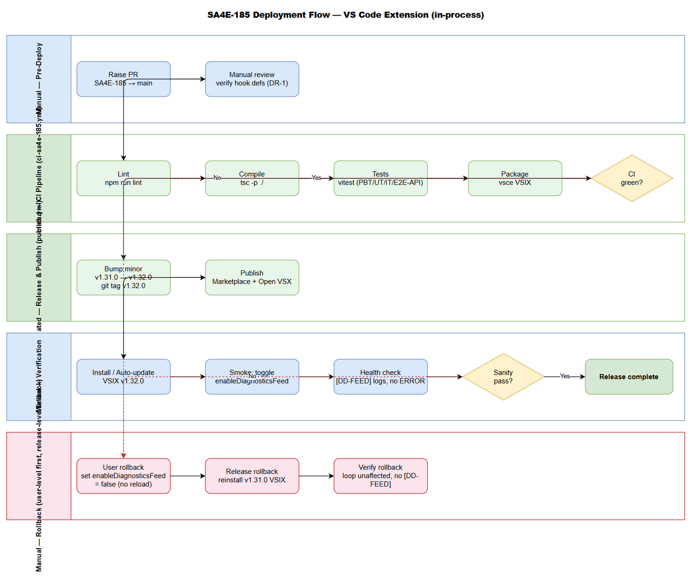
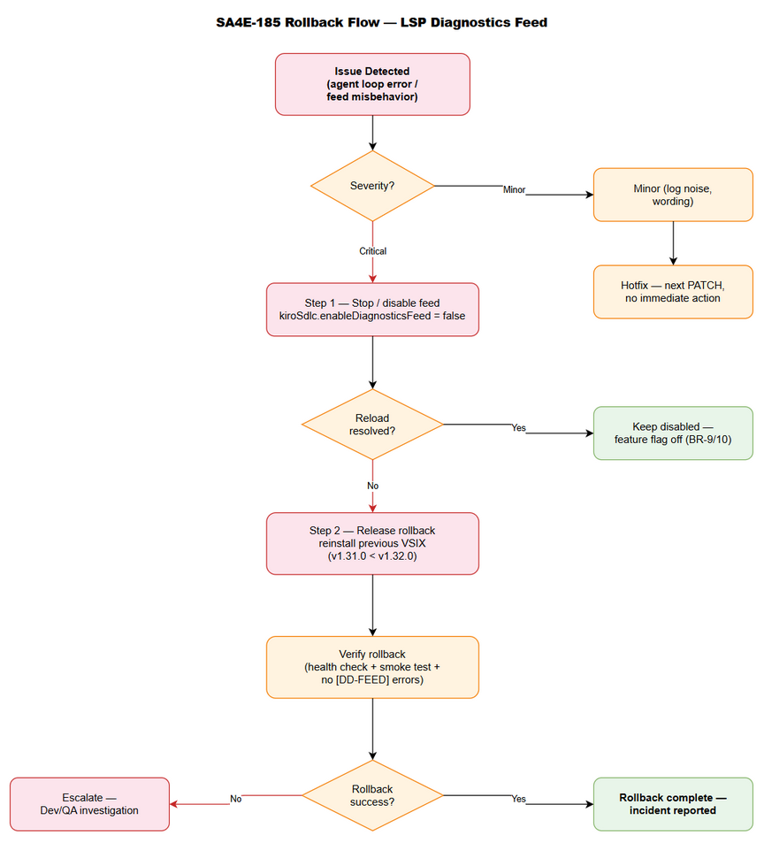

# Deployment Guide (DPG)

## SDLC-Agents-4-Enterprise — SA4E-185: LSP Diagnostics Feed — Realtime errors into agent loop

---

## Document Information

| Field | Value |
|-------|-------|
| Jira Ticket | SA4E-185 |
| Title | LSP Diagnostics Feed — Realtime errors into agent loop |
| Author | DevOps Agent |
| Version | 1.0 |
| Date | 2026-08-20 |
| Status | Draft |
| Related TDD | TDD-v1-SA4E-185.docx |
| Related STP | STP-v1-SA4E-185.docx |

---

## Revision History

| Version | Date | Author | Changes |
|---------|------|--------|---------|
| 1.0 | 2026-08-20 | DevOps Agent | Initiate document — auto-generated from TDD §10 (Deployment Considerations), §11 (E2E Test Architecture), and STP (test strategy) |

---

## Sign-Off

| Name | Role | Signature and date |
|------|------|--------------------|
| | Dev Lead | ☐ Approved for deployment |
| | QA Lead | ☐ Testing completed |
| | Ops Lead | ☐ Infrastructure ready |

---

## 1. Overview

### 1.1 Feature Summary

SA4E-185 ships a **push-based LSP Diagnostics Feed** inside the Kiro VS Code extension. A new `DiagnosticsFeedService` subscribes to `vscode.languages.onDidChangeDiagnostics`, debounces batches against a **300 ms** quiet window, filters diagnostics down to **agent-touched files**, and injects a bounded summary (≤ ~8000 chars) into the LangGraph chat loop via a new `diagnosticsContext` channel on the next agent turn (consume-once). When the summary contains ≥ 1 error entry, an **advisory auto-fix** directive is added to the system prompt, bounded by `MAX_AGENT_ITERATIONS = 12`. The user master switch is the `kiroSdlc.enableDiagnosticsFeed` setting (default `true`).

The feature also resolves two pre-existing open issues:
- **OI-1**: `write_file` added to `TOOL_CATEGORIES` (file hooks now fire for `write_file`).
- **OI-2**: feed content flows exclusively through the `diagnosticsContext` channel (never via `injectedPrompts`).

**Deployment model: the feature is 100% extension-internal (in-process).** There is NO new service, NO new backend, NO database change, and NO network topology change. Deployment == shipping a new extension VSIX (version bump + package + publish).

### 1.2 Deployment Scope

| Item | Type | Description |
|------|------|-------------|
| Kiro VS Code extension | Modified | Extension-bundle-only changes: `state.ts` (new `diagnosticsContext` channel), `chat-graph.ts` / `chat-graph-nodes.ts` (graph wiring + auto-fix advisory), `hook-tool-matcher.ts` (OI-1 `write_file`), `langgraph-engine.ts` / `graph-builder.ts` / `router-graph.ts` (optional feed plumbing), `extension.ts` (feed lifecycle), new `diagnostics/` module |
| Extension manifest | Modified | `package.json` — new setting `kiroSdlc.enableDiagnosticsFeed` in `contributes.configuration` (TDD §12.2 task 13); version bump |
| Database | NONE | No schema, no migration (TDD §4.1 explicit) |
| Infrastructure | NONE | No new services/containers/ports |
| CI/CD | Modified | New `.github/workflows/ci-sa4e-185.yml` (ticket CI: lint + compile + vitest + vsce package + gate); release flows through existing `publish.yml` on tag `v1.32.0` |

### 1.3 Target Environments

This is a shipped-marketplace extension — "environments" map to distribution/dogfooding stages, not servers:

| Environment | Distribution Medium | Deploy Order | Approval Required |
|-------------|--------------------|--------------|-------------------|
| DEV | Local VSIX install (CI artifact / `npm run package:prod`) | 1st | No |
| SIT | CI `vsix-sa4e-185` artifact installed into Extension Development Host | 2nd | No |
| UAT | Pre-release / workspace-level install for QA sign-off (STP §2.4 exit criteria) | 3rd | QA Sign-off |
| PROD | VS Code Marketplace + Open VSX (via `publish.yml` on tag `v1.32.0`) | 4th | PM + Business Sign-off |

---

## 2. Prerequisites

### 2.1 Infrastructure

| Requirement | Status | Notes |
|-------------|--------|-------|
| GitHub Actions runners (ubuntu-latest) | Ready | Existing repo CI infra |
| `VSCE_PAT` secret (VS Code Marketplace publisher token) | Existing | Required by `publish.yml` for PROD publish |
| `OVSX_TOKEN` secret (Open VSX) | Existing | Required by `publish.yml` for Kiro IDE publish |
| No servers / containers / network required | Ready | Extension-internal feature — no infra |

### 2.2 Software Dependencies

| Dependency | Version | Status |
|-----------|---------|--------|
| Node.js (CI + packaging) | 22 (CI `NODE_VERSION`); 20 LTS supported locally (STP §4.2) | Installed |
| VS Code engine | `^1.85.0` (`extension/package.json` engines) | Supported |
| TypeScript | ^5.4.0 | Installed |
| Vitest | ^4.1.8 | Installed |
| `@vscode/vsce` | ^2.24.0 | Installed (packaging) |
| Runtime libs for the feature | NONE new | TDD §1.3 — all existing VS Code APIs + in-repo modules |

### 2.3 Access Requirements

| Access | Type | Who Needs It |
|--------|------|-------------|
| GitHub repo write + tag push | Maintainer | DevOps / SM |
| Marketplace publisher PAT (`VSCE_PAT`) | Secret | `publish.yml` (automated) |
| Open VSX token (`OVSX_TOKEN`) | Secret | `publish.yml` (automated) |
| Local vsce / draw.io (manual dogfooding) | Local tooling | Dev / QA / DevOps |

### 2.4 Backup Requirements

- [x] N/A database backup — **no database exists in scope** (TDD §4.1)
- [x] N/A application (server) backup — no server artifact
- [ ] Previous VSIX artifact archived (v1.31.0 `.vsix` or Marketplace-installed version noted) for release-level rollback
- [ ] Current `extension/package.json` version recorded: **1.31.0** (bump source)

---

## 3. Pre-Deployment Checklist

| # | Item | Responsible | Status |
|---|------|-------------|--------|
| 1 | DEV implements TDD §12 (incl. DR-1 OI-1, DR-2 OI-2, security C-1..C-3) | Developer | ☐ |
| 2 | Code merged to `main` (branch `SA4E-185` → `main`) | Developer | ☐ |
| 3 | `ci-sa4e-185.yml` CI green: lint + compile + vitest + vsce package + gate | CI (automated) | ☐ |
| 4 | All automated tests pass: PBT (8) + UT (29) + IT (16) + E2E-API (12) = 65 in CI; E2E-UI (6) in Extension Host | QA | ☐ |
| 5 | Branch coverage on `DiagnosticsFeedService` ≥ 90% (STP §2.5) | QA | ☐ |
| 6 | Hook definitions verified after DR-1 (`write_file` file hooks fire) in staging | Dev + QA | ☐ (TDD §10.3 warning) |
| 7 | Security conditions C-1/C-2/C-3 closure evidence approved | Security Agent | ☐ |
| 8 | Version bumped: `1.31.0` → `1.32.0` (minor — new feature, repo convention) | DevOps | ☐ |
| 9 | Feature flag default confirmed: `kiroSdlc.enableDiagnosticsFeed: true` — no global kill needed at ship | Developer | ☐ |
| 10 | Rollback plan reviewed (TDD §10.3 + this doc §8) | Team | ☐ |
| 11 | Deployment window for PROD (Marketplace publish) confirmed | PM | ☐ |

---

## 4. Database Migration

### 4.1 Migration Scripts

**NONE — explicitly out of scope.**

TDD §4.1: *"No Database Changes (Explicit)"*. The diagnostics feed is in-memory per session, gated by the VS Code setting and code-level `diagnosticsFeed` param. There is no table, no column, no seed data.

| Order | Script | Description | Estimated Time |
|-------|--------|-------------|----------------|
| — | — | No database migration scripts | 0 min |

### 4.2 Execution Steps

```bash
# Not applicable — this release introduces no database changes.
echo "No DB migration for SA4E-185 (TDD §4.1)."
```

### 4.3 Verification Queries

N/A.

### 4.4 Rollback Scripts

N/A — nothing to roll back at the data layer.

---

## 5. Application Deployment

### 5.1 Deployment Flow



### 5.2 Deployment Steps

The deliverable is a **VSIX** built and verified in CI, then distributed. Full sequence:

| Step | Action | Command | Verification |
|------|--------|---------|-------------|
| 1 | Merge `SA4E-185` → `main`; ensure `ci-sa4e-185.yml` gate green | `gh pr merge SA4E-185` (or git merge) | GitHub Actions: all 5 jobs (lint/compile/test/package/gate) ✅ |
| 2 | Bump extension version (minor) in `extension/package.json` | `npm version 1.32.0 --no-git-tag-version` (in `extension/`) | `jq .version extension/package.json` → `1.32.0` |
| 3 | Commit bump; create annotated tag | `git tag -a v1.32.0 -m "SA4E-185: LSP Diagnostics Feed"` + push | `git ls-remote --tags origin v1.32.0` |
| 4 | Tag push triggers **`publish.yml`** (extension job) | tag `v*` event → `npm ci` + `copy-resources` + `gen-checksums` + `esbuild-production` + `vsce package --no-dependencies` | Workflow run green; `extension/*.vsix` uploaded to GitHub Release |
| 5 | Marketplace + Open VSX publish (auto) | `npx vsce publish --packagePath *.vsix` / `npx ovsx publish *.vsix` | Marketplace listing shows v1.32.0; `continue-on-error` tolerates transient API failures |
| 6 | Dogfood/QA install (DEV/SIT/UAT) | `code --install-extension <vsix>` or install from extension:vsix | Extension activates; `kiroSdlc.enableDiagnosticsFeed` visible in Settings |

> **DEV/SIT deployment shortcut (during QA before PROD):** install the CI artifact directly:
> ```bash
> # From ci-sa4e-185.yml "Package Verify (vsce)" job
> gh run download <run-id> -n vsix-sa4e-185 -D artifacts
> code --install-extension artifacts/kiro-sdlc-1.32.0.vsix
> ```

### 5.3 Docker Deployment

**Not applicable** — extension-internal feature; no container deliverable.

---

## 6. Configuration Changes

### 6.1 New Environment Variables

| Variable | Description | DEV | SIT | UAT | PROD |
|----------|-------------|-----|-----|-----|------|
| — | No environment variables — VS Code extension has no env-matrix (TDD §10.1) | — | — | — | — |

### 6.2 Application Properties Changes

VS Code settings (schema added to `extension/package.json` → `contributes.configuration` after `kiroSdlc.enableMcpServer`, TDD §12.2 task 13):

| Property | Old Value | New Value | File |
|----------|-----------|-----------|------|
| `kiroSdlc.enableDiagnosticsFeed` | N/A (new) | `true` (default) — master switch BR-8 | `extension/package.json` |

Behavior contract (TDD §10.2): `false` → `inject_diagnostics` node runs but always returns `{}` — zero channel churn, agent loop behaves exactly as pre-feature. Deleting the key restores default `true`.

### 6.3 Feature Flags

| Flag | DEV | SIT | UAT | PROD |
|------|-----|-----|-----|------|
| `kiroSdlc.enableDiagnosticsFeed` | `true` | `true` | `true` | `true` — the setting *is* the flag; progressive rollout via Settings UI / `settings.json` (`false` = rollback switch) |

Second, code-level off-switch: `diagnosticsFeed` param `undefined` → node no-ops (tests / old call sites) — independent and safe (E-8). No config required.

---

## 7. Post-Deployment Verification

### 7.1 Health Checks

| Check | Endpoint/Command | Expected Result | Timeout |
|-------|-----------------|-----------------|---------|
| Extension activates with new bundle | VS Code Output → Kiro channel | No activation errors; feature field present | 30s |
| Setting registered | `Preferences: Open User Settings` → search `kiroSdlc.enableDiagnosticsFeed` | Toggle visible; default checked (`true`) | 10s |
| Feed service starts | Output filter `[DD-FEED]` after starting a chat session | `[DD-FEED]` subscription/listener log (TC-01) | 15s |
| Graph unaffected when idle | Start chat, no diagnostics events | No `diagnosticsContext` writes; loop output identical to baseline (TC-10) | N/A |

### 7.2 Smoke Tests

| # | Scenario | Steps | Expected Result |
|---|----------|-------|-----------------|
| 1 | Feed reaches agent on next turn | (1) Open TS file, (2) introduce a type error, (3) ask agent to use `write_file` on it, (4) observe next turn prompt | Next turn prompt contains `[Diagnostics feed]` block; summary lines format `file:line severity code message` (UC-01/02, TC-07/08) |
| 2 | Consume-once | After injection, send another message without new writes | Second turn does **not** re-inject the same summary (BR-7, TC-08) |
| 3 | Auto-fix advisory | Summary contains ≥1 `error` severity line | System prompt includes advisory directive; warnings-only → no directive (UC-04, TC-14) |
| 4 | Toggle off | Set `kiroSdlc.enableDiagnosticsFeed: false` in settings, then provoke diagnostics | No injection, no `[DD-FEED]` channel writes; loop identical to baseline (UC-03, TC-10/11/12) — **no reload required** |
| 5 | Regression | Run existing KSA-178 `diagnostics-provider` + `get_diagnostics` tool | Unchanged behavior (TC-18) |
| 6 | OI-1 regression | Unit: `classifyTool("write_file")` | `"write"` (TC-06 / OI-1) |

### 7.3 Log Verification

| Log Entry | Level | Expected | Location |
|-----------|-------|----------|----------|
| `[DD-FEED]` service start / listener attached | DEBUG/INFO | After chat session starts with feed enabled | VS Code Output → Kiro |
| `[DD-FEED]` flush/summary build | DEBUG | Per debounced batch (300 ms quiet) | VS Code Output → Kiro |
| `[DD-FEED]` error paths (E-1..E-15) | ERROR/WARN | **Zero** ERROR in healthy operation | VS Code Output → Kiro |
| `inject_diagnostics` channel write | DEBUG | Once per consumed turn | VS Code Output → Kiro |

### 7.4 Monitoring Dashboard

- [x] No server dashboards apply (extension-internal)
- [x] GitHub Actions: `ci-sa4e-185.yml` gate + `publish.yml` publish run both green
- [ ] VS Code Marketplace/Open VSX listing confirms v1.32.0
- [ ] Post-release dogfood session: 0 ERROR `[DD-FEED]` entries; no unbounded loop (iteration bound 12)

---

## 8. Rollback Plan

### 8.1 Rollback Flow



### 8.2 Rollback Decision Criteria

| Condition | Action |
|-----------|--------|
| Loop corruption / context leak across tabs (Critical, STP §8.1) | **Immediate rollback** |
| Prompt-injection fence breached (C-1 fail) or approval gate unwired (C-2 fail) | **Immediate rollback** + Security investigation |
| Unbounded iteration / performance degradation > 50% | **Immediate rollback** |
| Feed never injects; toggle ineffective (Major) | User-level rollback first; release rollback if not resolved |
| Minor: log noise, cap-marker wording, summary formatting | Hotfix — no rollback |

### 8.3 Rollback Steps

**Two layers — always try user-level first (TDD §10.3):**

| Step | Action | Command | Verification |
|------|--------|---------|-------------|
| 1 | **User-level rollback:** disable feed setting (no reload, no redeploy) | `"kiroSdlc.enableDiagnosticsFeed": false` in `settings.json` (user or workspace) — or Settings UI toggle | `[DD-FEED]` stops; loop output identical to pre-feature baseline (BR-9/10) |
| 2 | If user-level insufficient → **release rollback:** reinstall previous VSIX | `code --install-extension kiro-sdlc-1.31.0.vsix --force` (Marketplace "Install Another Version…" or archived VSIX) | Extension version shows 1.31.0 |
| 3 | Verify rollback | Re-run smoke tests §7.2 | All pass on 1.31.0; no `[DD-FEED]`; hooks back to pre-DR-1 classification |
| 4 | If rollback target itself broken | Full revert: revert `SA4E-185` merge (git revert) — new PATCH release | CI green on revert commit |

**No database rollback exists** — nothing at the data layer (TDD §10.3: rollback is trivially clean).

### 8.4 Rollback Time Estimate

| Action | Estimated Time |
|--------|---------------|
| User-level rollback (setting false) | < 1 min (instant, no reload) |
| Release rollback (install previous VSIX) | 5–10 min |
| Verification (smoke §7.2) | 15–30 min |
| **Total** | **≤ 40 min** |

---

## 9. Environment-Specific Notes

### 9.1 DEV

- Install CI artifact VSIX directly (`gh run download ... -n vsix-sa4e-185`).
- Feature default ON — fine for dogfooding; disable via setting if unwanted noise.
- Optionally wire the Extension Development Host (`F5` launch) for fast iteration on E2E-UI (`feed-extension-host.e2e.test.ts`, requires `@vscode/test-electron` harness — see Known CI Gaps §10.1).

### 9.2 SIT

- Use the `vsix-sa4e-185` CI artifact (not marketplace) to keep version pinned to the ticket.
- Run the full automated suite locally per STP §4 environment (Vitest + Extension Dev Host) before UAT.

### 9.3 UAT

- QA sign-off required (STP exit criteria: 0 Critical, ≤ 1 Major).
- Workspace-level install recommended: `"kiroSdlc.enableDiagnosticsFeed": true` scoped to the UAT workspace only; keep personal scope untouched for isolate testing.
- Verify security closures C-1/C-2/C-3 with Security Agent evidence.

### 9.4 PROD

- **Deployment Window:** Marketplace publish post-QA sign-off; not time-critical (no server outage exposure). Default: standard release day.
- **Approval Required From:** PM + Business sign-off; Release Manager coordinates tag push.
- **Communication Plan:** Release Notes (RLN) shared to stakeholders; changelog entry updated; extension auto-update delivers to users.
- **On-Call Contact:** DevOps on-call; escalation to DEV for `[DD-FEED]` incident triage.

---

## 10. Appendix

### 10.1 Known CI Gaps (documented, non-blocking)

| # | Gap | Impact | Owner |
|---|-----|--------|-------|
| 1 | E2E-UI (6 cases incl. `feed-extension-host.e2e.test.ts`) not executed in GitHub Actions — requires `@vscode/test-electron` in Extension Development Host, which is **not** a current devDependency | E2E-UI runs in the QA Extension-Host phase (STP §5) instead of CI; 65/71 automated cases run in CI (`npm test` excludes `*.e2e.test.ts`) | DEV to add harness in a follow-up; QA executes E2E-UI |
| 2 | `@vitest/coverage-v8` is an optional peer only — branch-coverage ≥ 90% on `DiagnosticsFeedService` (STP §2.5) is verified locally / via QA, not enforced as a CI hard-fail | Coverage enforcement remains a QA gate | QA / DevOps follow-up |
| 3 | ML feature flag progressive rollout (C-6 product decision on default-on) | Toggle parameterized; decision recorded in SIT-76 | PM/Security |

### Contacts

| Role | Name | Contact |
|------|------|---------|
| DevOps Lead | DevOps Agent | (pipeline owner) |
| Dev Lead | DEV Agent | (implementation) |
| QA Lead | QA Agent | (test sign-off) |
| Security | Security Agent | (C-1/C-2/C-3 closure) |

### Related Tickets

| Ticket | Summary | Relationship |
|--------|---------|-------------|
| SA4E-185 | LSP Diagnostics Feed — Realtime errors into agent loop | Main ticket |
| SA4E-186 | Dynamic slash menu agents from `.kiro/agents/*.md` | Adjacent extension feature (main branch at v1.31.0 baseline) |

### Release Version Proposal

| Field | Value |
|-------|-------|
| Current version | 1.31.0 (extension + git tag `v1.31.0`) |
| Proposed version | **v1.32.0** (MINOR bump — new feature per repo convention) |
| Branch to merge | `SA4E-185` → `main` |
| Release trigger | Tag `v1.32.0` → `publish.yml` (extension job) |