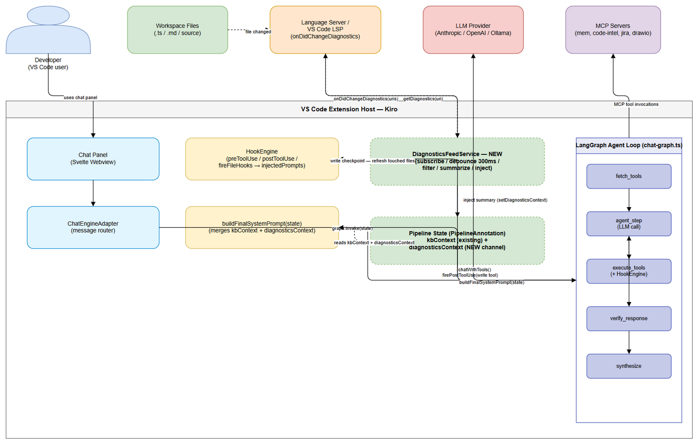
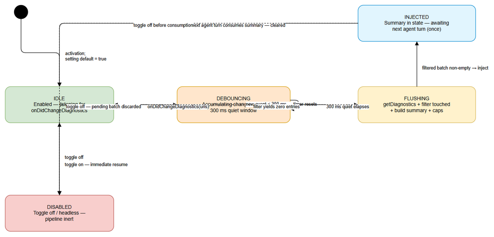
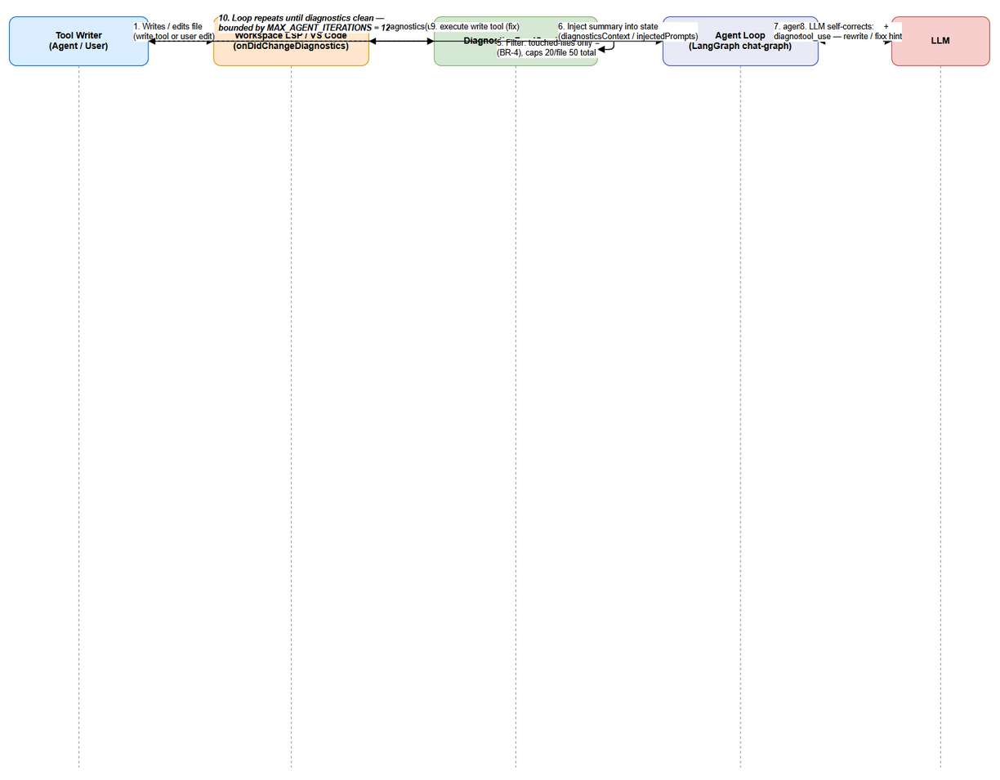

# Functional Specification Document (FSD)

## SDLC-Agents-4-Enterprise — SA4E-185: LSP Diagnostics Feed — Realtime errors into agent loop

---

## Document Information

| Field | Value |
|-------|-------|
| Jira Ticket | SA4E-185 |
| Title | LSP Diagnostics Feed — Realtime errors into agent loop |
| Author | BA Agent |
| Version | 1.0 |
| Date | 2026-08-20 |
| Status | Draft |
| Related BRD | documents/SA4E-185/BRD.md |

---

## Revision History

| Version | Date | Author | Changes |
|---------|------|--------|---------|
| 1.0 | 2026-08-20 | BA Agent | Initiate document — auto-generated from BRD SA4E-185, verified against codebase (`extension/src/langgraph/subgraphs/chat-graph.ts`, `extension/src/langgraph/core/state.ts`, `extension/src/langgraph/hooks/hook-engine.ts`) |

---

## 1. Introduction

### 1.1 Purpose

This FSD specifies the functional behavior of the **LSP Diagnostics Feed** feature (ticket SA4E-185, gap F4 of Chat Module epic SA4E-181). It defines how realtime language server (LSP) diagnostics are pushed into the interactive agent loop of the Kiro VS Code extension so the agent can **self-correct** errors it caused while working in the workspace.

The FSD transforms the four BRD user stories into concrete use cases with main/alternative/exception flows, data specifications, business rules (BR-1 → BR-13 retained from the BRD), integration specifications, processing logic, and a testing baseline. It also resolves the BRD design decision on the **injection channel** (new `diagnosticsContext` channel vs. reuse of `kbContext`).

### 1.2 Scope

In scope (derived from BRD §1.1):

1. **Push-based Diagnostics Feed** — subscription to `vscode.languages.onDidChangeDiagnostics`, 300 ms debounced batching.
2. **Relevance filtering** — only diagnostics for **agent-touched files** are injected.
3. **Compact summary injection** — `file, line, severity, message, code` per entry, visible on the **next agent turn**, consumed exactly once.
4. **User toggle** — VS Code setting `kiroSdlc.enableDiagnosticsFeed` (boolean, default `true`).
5. **Auto-fix integration** — advisory system-prompt instruction when ≥ 1 `error` entry is injected for a touched file, bounded by `MAX_AGENT_ITERATIONS = 12`.

Out of scope (unchanged from BRD §1.2):

- No modification of the KSA-178 `diagnostics-provider.ts` (save-triggered, code_search-based) or the pull-based `get_diagnostics` tool in `extension/src/langgraph/vscode/vscode-tools.ts`. Both remain untouched and available.
- No generic LSP quick-fix CodeActions implementation (native VS Code/LSP capability).
- No persistence of feed state across sessions (in-memory, per-session).
- No non-LSP diagnostic sources beyond `onDidChangeDiagnostics`.
- No changes to SDLC pipeline agents (docs-graph, sdlc-graph, hotfix-graph) — targets only the interactive chat loop in `chat-graph.ts`.
- No new dedicated UI surfaces.

### 1.3 Definitions & Acronyms

| Term | Definition |
|------|------------|
| LSP | Language Server Protocol — VS Code uses it to surface diagnostics from language servers |
| Diagnostics | Problems reported by language servers: errors, warnings, info, hints |
| onDidChangeDiagnostics | VS Code event fired when language server diagnostics change |
| DiagnosticsFeedService | NEW extension component implementing the push-based feed |
| Debounce | Delay processing until a 300 ms quiet window elapses, batching bursts |
| Touched files | Files written/modified by agent write tools in the current chat session (BR-5) |
| HookEngine | Existing extension module firing pre/post tool-use hooks (KSA-280) |
| injectedPrompts | `string[]` produced by hooks (`postToolUse`, file hooks) and merged back into the agent loop |
| kbContext | Existing `PipelineAnnotation` channel — RAG/semantic context merged by `buildFinalSystemPrompt` (KSA-210) |
| diagnosticsContext | NEW proposed `PipelineAnnotation` channel for feed summaries (design decision, §3.6) |
| MAX_AGENT_ITERATIONS | Loop guard constant = 12 in `chat-graph.ts` |

### 1.4 References

| Document | Location |
|----------|----------|
| BRD SA4E-185 | documents/SA4E-185/BRD.md |
| FSD SA4E-186 (same epic, reference) | documents/SA4E-186/FSD.md |
| BRD SA4E-186 (reference) | documents/SA4E-186/BRD.md |
| Agent loop / chat subgraph | extension/src/langgraph/subgraphs/chat-graph.ts |
| Pipeline state definition | extension/src/langgraph/core/state.ts |
| Hook engine | extension/src/langgraph/hooks/hook-engine.ts |
| VS Code tools (get_diagnostics) | extension/src/langgraph/vscode/vscode-tools.ts |
| KSA-178 diagnostics provider (distinct) | extension/src/diagnostics-provider.ts |
| Extension settings contribution | extension/package.json → `contributes.configuration` |

---

## 2. System Overview

### 2.1 System Context Diagram


*[Edit in draw.io](diagrams/system-context.drawio)*

The system operates inside the **VS Code Extension Host** process. External actors:

- **Developer** interacts with the Svelte Chat Panel (webview); messages route through `ChatEngineAdapter` into the LangGraph chat subgraph.
- **Workspace Files** are read/written by both the user and the agent's write tools.
- **Language Server / VS Code LSP** produces diagnostics and pushes them via the `onDidChangeDiagnostics` event (the feed's input channel); the service pulls the current snapshot with `vscode.languages.getDiagnostics(uri)` at flush time.
- **LLM Provider** executes the agent's model calls (`chatWithTools`), with the diagnostics summary merged into the system prompt.
- **MCP Servers** provide additional tool definitions and execution.

New component: **DiagnosticsFeedService** (dashed border) subscribes to the LSP event, debounces/batches, filters by the touched-files set, builds the summary, and injects it into **Pipeline State** (via the new `diagnosticsContext` channel and/or `injectedPrompts` from `HookEngine.firePostToolUse`). `buildFinalSystemPrompt(state)` then merges the summary into the prompt on the next `agent_step`.

### 2.2 System Architecture

**Key components:**

| Component | Role | Status |
|-----------|------|--------|
| VS Code LSP (`vscode.languages.onDidChangeDiagnostics`) | Push channel for realtime diagnostics | External (VS Code API) |
| DiagnosticsFeedService | Subscribe → debounce (300 ms) → filter → summarize → inject | **NEW** |
| HookEngine | `postToolUse` + `fireFileHooks` for write tools; returns `injectedPrompts` | Existing (KSA-280) |
| PipelineAnnotation state (`state.ts`) | Holds `kbContext` (existing) + `diagnosticsContext` (NEW channel, §3.6) | Existing / extended |
| chat-graph.ts ReAct loop | `fetch_tools → agent_step → execute_tools / verify_response → synthesize`; `MAX_AGENT_ITERATIONS = 12` | Existing (KSA-210) |
| buildFinalSystemPrompt | Merges `kbContext` + feeding `diagnosticsContext` + steering + agent body into system prompt | Existing (modified) |
| Touched-files set | Session-scoped `Set<string>` of workspace-relative file paths populated at write-tool checkpoints | **NEW** (module-local to feed) |
| `get_diagnostics` VS Code tool | Pull-based fallback; unchanged | Existing |
| `diagnostics-provider.ts` (KSA-178) | Save-triggered code_search diagnostics + CodeActions; **kept separate** | Existing |

**Verified codebase facts (2026-08-20):**

1. `state.ts` line 65 — `kbContext: Annotation<string>` exists; **no `contextItems` channel exists**. Decision required (see §3.6).
2. `hook-engine.ts` — `firePostToolUse(toolName, args, toolResult, ...)` classifies the tool, executes matching `postToolUse` hooks, and for `category === "write"` calls `fireFileHooks(filePath, ...)` → returns `injectedPrompts: string[]`. This is the feed's primary integration checkpoint.
3. `chat-graph.ts` — `buildFinalSystemPrompt(state)` (line 221) appends `state.kbContext` when present; `routeAfterToolExec` guards `state.agentIterations >= MAX_AGENT_ITERATIONS`. Injection must compose with both.

---

## 3. Functional Requirements

### 3.1 Feature: Diagnostics Feed Subscription & Batching

**Source:** BRD Story 1 (SA4E-185 AC-1, AC-5)

#### 3.1.1 Description

The `DiagnosticsFeedService` subscribes to `vscode.languages.onDidChangeDiagnostics` and debounces incoming change events with a **300 ms** quiet window. When the window elapses without a new event, the accumulated changed URIs are flushed as one batch. Only `file://` URIs inside the active workspace are eligible. Each batch reads the current diagnostics snapshot via `vscode.languages.getDiagnostics(uri)` so the summary reflects the LSP state at flush time.

The subscription is wired to the existing hook pipeline: when a write tool fires, `HookEngine.firePostToolUse` classifies the tool (`classifyTool` → `write` category) and triggers file hooks; the feed reuses this checkpoint to (a) refresh the touched-files set and (b) receive the flushed batch as injected prompt content.

#### 3.1.2 Use Case

**Use Case ID:** UC-01
**Actor:** System (DiagnosticsFeedService + VS Code LSP)
**Preconditions:** Extension is active; a workspace is open; feed toggle `kiroSdlc.enableDiagnosticsFeed` = `true`; at least one LSP provider registered for the edited file type.
**Postconditions:** A single diagnostics batch (all changes within the debounce window) is produced and handed to the filtering stage. No batch is produced while the feed is disabled.

**Main Flow:**

| Step | Actor | System | Description |
|------|-------|--------|-------------|
| 1 | | VS Code fires event | `onDidChangeDiagnostics(uris)` emitted for changed URIs |
| 2 | | DiagnosticsFeedService | Receives event; checks toggle — enabled → collect URIs |
| 3 | | DiagnosticsFeedService | Filters URIs: keep only `file://` scheme inside active workspace (BR-3) |
| 4 | | DiagnosticsFeedService | Resets/continues 300 ms debounce timer with collected URIs (BR-2) |
| 5 | | DiagnosticsFeedService | After 300 ms quiet: flushes one batch containing all accumulated URIs |
| 6 | | DiagnosticsFeedService | Reads current diagnostics per URI via `getDiagnostics(uri)` |
| 7 | | DiagnosticsFeedService | Batch handed to filtering/summarization (§3.2) |

**Alternative Flows:**

| ID | Condition | Steps |
|----|-----------|-------|
| AF-01 | Rapid burst (e.g., 10 events in < 300 ms) | Steps 1–3 repeat; timer keeps resetting; a **single** batch of all URIs is flushed when quiet elapses (AC-2) |
| AF-02 | Setting disabled at event time | Event is ignored; no URIs collected, no timer started; loop unchanged (BR-9, BR-10) |
| AF-03 | URI outside workspace or non-`file` scheme | Entry excluded at Step 3 (BR-3; AC-4) |

**Exception Flows:**

| ID | Condition | Steps |
|----|-----------|-------|
| EF-01 | No LSP provider for the file | Event may not fire; `getDiagnostics(uri)` returns `[]` → empty batch, non-fatal, no injection |
| EF-02 | Event storm beyond capacity | Debounce keeps resetting; flush produces a large batch → summary capped in §3.2 (Validation Rules) to protect context budget |
| EF-03 | Listener disposal error at deactivation | Logged via `debug-logger`, non-fatal; subscription detached |

#### 3.1.3 Business Rules

| Rule ID | Rule | Source |
|---------|------|--------|
| BR-1 | The service subscribes to `vscode.languages.onDidChangeDiagnostics` at activation; the listener is registered while the feed is enabled and stays passive while disabled. | BRD Story 1 |
| BR-2 | Events are batched with a 300 ms debounce: a batch is flushed after 300 ms of quiet; each flush covers all changed URIs accumulated in the window. | BRD Story 1 |
| BR-3 | Only `file://` URIs inside the active workspace are eligible for processing. | BRD Story 1 |

#### 3.1.4 Data Specifications

**Input Data (LSP event):**

| Field | Type | Required | Validation | Description |
|-------|------|----------|------------|-------------|
| event.uris | `URI[]` | Y | Scheme must be `file` (BR-3); path must resolve under workspace root | Changed documents |
| toggle.enableDiagnosticsFeed | boolean | Y | Boolean only (VS Code schema) | Feed master switch (BR-8) |

**Intermediate Data (batch — one entry per diagnostic):**

| Field | Type | Required | Validation | Description |
|-------|------|----------|------------|-------------|
| file | string (workspace-relative) | Y | Must be within workspace (BR-3) | File with diagnostic |
| line | number (1-based) | Y | Positive integer; clamped to file line count at summary build | Diagnostic line |
| severity | enum: `error` \| `warning` \| `info` \| `hint` | Y | Mapped from `vscode.DiagnosticSeverity` (Error→error, Warning→warning, Information→info, Hint→hint) | Severity level |
| message | string | Y | Non-empty | Human-readable diagnostic message |
| code | string | N | Non-empty when present | LSP diagnostic code (e.g., TS2339) |
| source | string | N | Non-empty when present | Provider name (e.g., `typescript`) |
| debounceMs | number | Y (fixed) | Constant 300 | Debounce window |

**Output Data (batch to §3.2):**

| Field | Type | Description |
|-------|------|-------------|
| batch[] | DiagnosticsBatchEntry[] | Deduplicated entries — duplicate (file, line, code) removed within one batch |

#### 3.1.5 API Contract (Functional View)

> **Note:** Functional contract only — the feed uses internal VS Code API and extension-internal hooks, not an external HTTP endpoint. Technical details are governed by the TDD.

**Interface 1 — VS Code LSP event:** `vscode.languages.onDidChangeDiagnostics` (subscription)
**Interface 2 — VS Code query:** `vscode.languages.getDiagnostics(uri): Diagnostic[]` (pull at flush)

| Parameter | Type | Required | Business Rule | Description |
|-----------|------|----------|---------------|-------------|
| uri | Uri | Y | BR-3 | Document to read diagnostics for |
| Diagnostic.severity | enum | Y | BR-6 (mapping) | Severity order: Error > Warning > Information > Hint |
| Diagnostic.range | Range | Y | BR-6 | Supplies `line` (1-based) |

**Functional Error Scenarios:**

| Scenario | User Message | Trigger Condition |
|----------|-------------|-------------------|
| Empty diagnostics for URI | No message (silent) | `getDiagnostics` returns `[]` (EF-01) |
| Feed disabled | No message (silent) | Toggle off (BR-10) |
| Out-of-workspace URI | No message (silent) | BR-3 filter exclusion |

---

### 3.2 Feature: Filtering, Summary & Injection into Agent Context

**Source:** BRD Story 2 (SA4E-185 AC-2, AC-3, AC-4)

#### 3.2.1 Description

The flushed batch is filtered to files the agent **recently touched** (write-tool history + optional open editors). Surviving entries become a compact summary — one line per entry `file:line severity code message` — preceded by a feed header honoring the toggle, bounded by per-file/total caps with a suppression marker when truncated. The summary is injected so it is visible on the **next** agent turn and consumed exactly once per turn (cleared after injection).

Injection mechanism (BR-7): primarily via the hook pipeline (`postToolUse` → `injectedPrompts`) which already replays into the loop, complemented by a new dedicated state channel `diagnosticsContext` that `buildFinalSystemPrompt` merges next to `kbContext`. (Design decision detailed in §3.6.)

#### 3.2.2 Use Case

**Use Case ID:** UC-02
**Actor:** System (DiagnosticsFeedService, Agent Loop)
**Preconditions:** UC-01 produced a flushed batch; touched-files set populated (write tool fired previously); toggle enabled.
**Postconditions:** A bounded summary containing only touched-file diagnostics is imported into state and consumed exactly once by the next agent turn.

**Main Flow:**

| Step | Actor | System | Description |
|------|-------|--------|-------------|
| 1 | | DiagnosticsFeedService | Filter batch: keep entries whose `file` ∈ touched-files set (BR-4); drop others |
| 2 | | DiagnosticsFeedService | Apply severity default filter: `error` + `warning` shown; `info`/`hint` excluded by default |
| 3 | | DiagnosticsFeedService | Deduplicate (file, line, code); clamp `line` to file length |
| 4 | | DiagnosticsFeedService | Apply caps: top 20 per file, top 50 total; append suppression marker for overflow |
| 5 | | DiagnosticsFeedService | Format summary: header line + one line per entry (BR-6) |
| 6 | | DiagnosticsFeedService | If filtered batch empty → skip injection (loop unchanged) |
| 7 | | DiagnosticsFeedService | Inject summary into agent context (`diagnosticsContext` +/or `injectedPrompts`) (BR-7) |
| 8 | | Agent Loop | On next `agent_step`/`synthesize`, `buildFinalSystemPrompt` includes the summary |
| 9 | | Agent Loop | Turn consumes summary; state cleared so it does not repeat next turn (BR-7) |

**Alternative Flows:**

| ID | Condition | Steps |
|----|-----------|-------|
| AF-01 | Zero entries after filtering | Step 6 — no summary injected; loop proceeds unchanged |
| AF-02 | Summary exceeds cap | Step 4 — truncate with marker `... (N more diagnostics suppressed)` |
| AF-03 | Touched file deleted before flush | Entry filtered by `getDiagnostics`/URI resolution; skipped gracefully |
| AF-04 | Both injection paths used | Hook `injectedPrompts` AND channel both carry the summary; channel is authoritative for consume-once semantics (see §3.6) |

**Exception Flows:**

| ID | Condition | Steps |
|----|-----------|-------|
| EF-01 | Injection races an already-started LLM turn | Batch dropped (no retry); next event re-triggers the pipeline |
| EF-02 | Cap logic overflow | Entries beyond M=50 summarized with suppression marker; never exceeds ~2000 tokens |

#### 3.2.3 Business Rules

| Rule ID | Rule | Source |
|---------|------|--------|
| BR-4 | Only diagnostics belonging to **agent-touched files** are injected into the agent context. | BRD Story 2 |
| BR-5 | The touched-files set is populated from agent write-tool calls (postToolUse/file hooks) and optionally open editors; it is session-scoped and cleared at session start. | BRD Story 2 |
| BR-6 | Each injected entry exposes `file`, `line`, `severity`, `message`, `code` in a single compact line. | BRD Story 2 |
| BR-7 | The summary is injected before the next agent turn and consumed exactly once per turn (cleared after injection). | BRD Story 2 |

#### 3.2.4 Data Specifications

**Injected Summary Format:**

| Field | Source | Format |
|-------|--------|--------|
| Feed header | static + setting | `[Diagnostics feed] (toggle: kiroSdlc.enableDiagnosticsFeed = <on/off>)` |
| Entry | per diagnostic | `<file>:<line> <severity> <code> <message>` |
| Truncation marker | generated | `... (N more diagnostics suppressed)` |

Example:
```
[Diagnostics feed]
src/app.ts:12 error TS2339 Property 'ctx' does not exist on type 'App'
src/app.ts:15 warning TS6133 'tmp' is declared but its value is never read
... (3 more diagnostics suppressed)
```

**Validation Rules (from BRD Story 2):**

| Rule | Value |
|------|-------|
| Per-file cap | N = 20 (default) |
| Total cap | M = 50 (default) |
| Severity default filter | `error` + `warning` always shown; `info`/`hint` excluded (configurable) |
| Summary token budget | ≤ ~2000 tokens |
| `line` validation | Positive integer; clamped to file's line count |

#### 3.2.5 API Contract (Functional View)

**Interface 3 — Channel write (injection):** `setDiagnosticsContext(summary: string)` writes to the `diagnosticsContext` channel (NEW — §3.6)
**Interface 4 — Channel read (consume):** `buildFinalSystemPrompt(state)` reads `state.diagnosticsContext` and appends it; the node that consumes it clears the channel.

| Field | Type | Business Rule | Description |
|-------|------|---------------|-------------|
| diagnosticsContext | string (empty when idle) | BR-7 | Summary payload; empty string = no feed content this turn |

**Business Error Scenarios:**

| Scenario | User Message | Trigger Condition |
|----------|-------------|-------------------|
| Zero filtered diagnostics | No message (silent) | AF-01 |
| Injection race | No retry (silent) | EF-01; next event re-triggers |
| Summary truncated | No user message; marker in prompt | EF-02 |

---

### 3.3 Feature: User Toggle for Diagnostics Feed

**Source:** BRD Story 3 (SA4E-185 AC-6)

#### 3.3.1 Description

A new VS Code setting **`kiroSdlc.enableDiagnosticsFeed`** (boolean, **default: true**) is declared in `extension/package.json` → `contributes.configuration`, following the existing `kiroSdlc.*` pattern (verified pattern in current config). Changes apply **immediately** via the existing config-watcher (`onDidChangeConfiguration`) — no extension window reload. While disabled, no batching, filtering, or injection occurs and any pending debounce batch is discarded. An optional Chat Panel header mirror indicator is a nice-to-have; the setting remains the source of truth.

#### 3.3.2 Use Case

**Use Case ID:** UC-03
**Actor:** User
**Preconditions:** Extension active; user has access to VS Code Settings UI.
**Postconditions:** Setting change is applied immediately; feed behavior (on/off) matches the current value; pending batch discarded when turned off.

**Main Flow:**

| Step | Actor | System | Description |
|------|-------|--------|-------------|
| 1 | User opens VS Code Settings | | Navigates to `kiroSdlc.enableDiagnosticsFeed` |
| 2 | User toggles value to `true`/`false` | | Setting written to configuration |
| 3 | | Config watcher | `onDidChangeConfiguration` fires; cache invalidated |
| 4 | | DiagnosticsFeedService | Reads new value; applies immediately (BR-9) |
| 5 | | DiagnosticsFeedService | If `false`: discards pending batch, pipeline inert (BR-10); if `true`: resumes on next event |

**Alternative Flows:**

| ID | Condition | Steps |
|----|-----------|-------|
| AF-01 | Enabled out of the box | Default `true` — no setup required (AC-4) |
| AF-02 | Toggle `false`→`true` mid-session | Next event processed immediately; no reload (AC-2) |
| AF-03 | Optional Chat Panel indicator | Mirrors setting for discoverability; setting remains source of truth |

**Exception Flows:**

| ID | Condition | Steps |
|----|-----------|-------|
| EF-01 | Setting read in non-VS Code context (tests/headless) | Treated as **disabled** — safe default, no injection |
| EF-02 | Rapid toggling during an active batch | Last state wins at flush time; disabled state discards the batch (BR-10) |

#### 3.3.3 Business Rules

| Rule ID | Rule | Source |
|---------|------|--------|
| BR-8 | The feed is governed by the VS Code setting `kiroSdlc.enableDiagnosticsFeed` (default enabled). | BRD Story 3 |
| BR-9 | Setting changes take effect immediately (config watcher), without reloading the extension window. | BRD Story 3 |
| BR-10 | When disabled, no batching/filtering/injection occurs and any pending batch is discarded; the agent loop runs unchanged. | BRD Story 3 |

#### 3.3.4 Data Specifications

**Input Data (setting):**

| Field | Type | Required | Validation | Description |
|-------|------|----------|------------|-------------|
| kiroSdlc.enableDiagnosticsFeed | boolean | Y (default `true`) | Boolean only (VS Code schema) | Master switch for the feed |

**Output Data (behavior):**

| Condition | System Behavior |
|-----------|-----------------|
| `true` | UC-01 + UC-02 active; subscription live (BR-1) |
| `false` | Pipeline inert; pending batch discarded (BR-10); loop unchanged |

#### 3.3.5 UI Specifications

**Screen: VS Code Settings — Feature Toggle (and optional Chat Panel indicator)**

| No. | Element | Type | Required | Behavior | Validation |
|-----|---------|------|----------|----------|------------|
| 1 | Diagnostics Feed toggle | Setting (boolean) | Y | `kiroSdlc.enableDiagnosticsFeed` in VS Code Settings UI; default `true` | Boolean only |
| 2 | Chat Panel feed indicator (optional) | Button/Toggle | N | Mirrors the setting for quick switching | Source of truth = setting |

#### 3.3.6 API Contract (Functional View)

**Interface 5 — Configuration read/write:**

| Parameter | Type | Required | Business Rule | Description |
|-----------|------|----------|---------------|-------------|
| kiroSdlc.enableDiagnosticsFeed | boolean | Y | BR-8, BR-9 | Master switch; cache + invalidate on `onDidChangeConfiguration` |

**Business Error Scenarios:**

| Scenario | User Message | Trigger Condition |
|----------|-------------|-------------------|
| Headless/non-VS Code read | No user message | EF-01 → treated as disabled |
| Rapid toggle race | No user message | EF-02 → last state wins |

---

### 3.4 Feature: Auto-Fix Integration

**Source:** BRD Story 4 (SA4E-185 AC-7)

#### 3.4.1 Description

When the injected summary contains at least one `error`-severity entry for a touched file, the system prompt for that turn instructs the agent that it **may attempt a fix** of those errors (advisory only — BR-13). Fixes use existing write tools (`write_file`, `fs_write`, `stream_write_file`, …); no new fix tool is introduced. Fix attempts are bounded by the existing `MAX_AGENT_ITERATIONS = 12` guard and the existing `ToolApprovalGate`/permission rules. After a fix write, the pipeline naturally re-triggers (write tool → LSP → `onDidChangeDiagnostics`) so the agent can verify the diagnostics are resolved.

#### 3.4.2 Use Case

**Use Case ID:** UC-04
**Actor:** Agent (LLM) via Agent Loop
**Preconditions:** UC-02 injected a summary containing ≥ 1 `error` entry for a touched file; toggle enabled; loop has iteration budget remaining.
**Postconditions:** The agent attempts a fix using write tools (or decides not to — advisory); write trigger re-enters the feed pipeline; loop terminates via `routeAfterToolExec` at iteration 12 at the latest.

**Main Flow:**

| Step | Actor | System | Description |
|------|-------|--------|-------------|
| 1 | | buildFinalSystemPrompt | Detects ≥ 1 `error` entry in `diagnosticsContext` summary for a touched file |
| 2 | | Agent Loop | Adds advisory auto-fix instruction to the system prompt for that turn (BR-11) |
| 3 | | agent_step | LLM receives summary + auto-fix hint; may request write-tool calls |
| 4 | | execute_tools | Tool call goes through existing `ToolApprovalGate`/permissions (BR-13) |
| 5 | | execute_tools | Write tools executed; `firePostToolUse` refreshes touched-files set |
| 6 | | LSP / VS Code | File changes → `onDidChangeDiagnostics` → feed re-triggers (UC-01) |
| 7 | | Agent Loop | `routeAfterToolExec` checks `agentIterations >= 12` → stop or next iteration (BR-12) |

**Alternative Flows:**

| ID | Condition | Steps |
|----|-----------|-------|
| AF-01 | Summary contains **no** `error` entries (warnings/info only) | Auto-fix instruction **not** added (avoid churn on warnings) |
| AF-02 | LLM decides not to fix | No fix tool calls; loop proceeds normally — advisory only (BR-13) |
| AF-03 | Diagnostics resolved after a fix | Re-feed yields zero `error` entries → no further auto-fix instruction; loop continues or completes |

**Exception Flows:**

| ID | Condition | Steps |
|----|-----------|-------|
| EF-01 | Fix attempt throws (LLM/tool error) | Existing non-recoverable error handling in the loop applies; error returned to user rather than looping |
| EF-02 | Iteration limit reached | `routeAfterToolExec` routes to `synthesize` at `agentIterations >= 12`; no infinite cycle (AC-3) |
| EF-03 | Tool permission denied | Fix blocked per existing approval rules (auto-fix does not bypass security — AC-4) |
| EF-04 | Toggle disabled mid-fix | BR-10 governs — feed inert; no further auto-fix triggers |

#### 3.4.3 Business Rules

| Rule ID | Rule | Source |
|---------|------|--------|
| BR-11 | If the injected summary contains ≥ 1 `error` entry for an agent-touched file, the agent is instructed (system prompt) to attempt a fix on its next turn. | BRD Story 4 |
| BR-12 | Fix attempts stay within the existing agent-iteration guard (MAX_AGENT_ITERATIONS = 12); no new unbounded loop is introduced. | BRD Story 4 |
| BR-13 | Auto-fix is advisory — the agent retains decision control; existing tool approval/permission gates are not bypassed. | BRD Story 4 |

#### 3.4.4 Data Specifications

**Input (to prompt builder):**

| Field | Type | Required | Validation | Description |
|-------|------|----------|------------|-------------|
| diagnosticsContext | string | Y (when non-empty) | Contains ≥ 1 `error` line for touched file | Summary payload from UC-02 |
| agentIterations | number | Y | Reducer default 0; incremented per loop | Iteration guard input (BR-12) |

**Output (system prompt directive):**

| Field | Type | Description |
|-------|------|-------------|
| Auto-fix advisory instruction | string | `"You may attempt to fix the errors below using your write tools. This is advisory — decide what to change. Existing approval gates still apply."` |

#### 3.4.5 API Contract (Functional View)

**Interface 6 — Loop guard:** `routeAfterToolExec(state)` returns `synthesize` when `state.agentIterations >= MAX_AGENT_ITERATIONS` (existing, unchanged — reused by auto-fix bound).

| Parameter | Type | Business Rule | Description |
|-----------|------|---------------|-------------|
| agentIterations | number | BR-12 | Current loop iteration count |
| MAX_AGENT_ITERATIONS | const 12 | BR-12 | Upper bound |

**Business Error Scenarios:**

| Scenario | User Message | Trigger Condition |
|----------|-------------|-------------------|
| Auto-fix tool call denied | Existing permission UI | EF-03 (ToolApprovalGate) |
| LLM/tool failure during fix | Error surfaced through existing loop | EF-01 |
| Iteration budget exhausted | Loop ends normally (synthesize) | EF-02 / BR-12 |

---

### 3.5 Feature: Injection Channel — Design Decision (SA/DEV review item)

**Source:** BRD §2.1 Step 8, §5.1 Risk "contextItems", BRD §8.2 Technical Notes

#### 3.5.1 Decision Summary

**Recommendation: CREATE a new `diagnosticsContext` channel** in `PipelineAnnotation` (alongside `kbContext`) rather than reusing `kbContext`, and treat the hook `injectedPrompts` path as the complementary short-circuit for immediate post-write feedback.

Rationale (functional level; architecture validated by SA in TDD phase):

| Criterion | Reuse `kbContext` | NEW `diagnosticsContext` |
|-----------|-------------------|--------------------------|
| BR-7 consume-once semantics | `kbContext` reducer is `(_e, u) => u` (last-write-wins); no built-in clear-after-turn | Dedicated channel can implement read-once/clear in `buildFinalSystemPrompt` or the consuming node |
| Separation of concerns | RAG/semantic context mixed with transient error feedback — pollutes context and complicates tracing/QA | Clean separation; QA can assert feed content independently |
| Toggle/caps | Caps must be retrofitted into shared builder logic | Caps applied in feed service before channel write; channel carries final bounded payload |
| Backward compatibility | Changing `kbContext` semantics risks KSA-210 behavior | Zero risk to existing RAG path |
| Cost | None (no new channel) | One channel + builder append (small, localized) |

**Final recommendation:** `diagnosticsContext: Annotation<string>` (reducer `(_e, u) => u`, default `""`), appended in `buildFinalSystemPrompt` **after** `kbContext`, cleared by the consuming node (`agent_step`/`synthesize` builder path) once read — guaranteeing expand once per turn. The `postToolUse → injectedPrompts` path remains the primary **immediate** feedback channel after write tools and is NOT duplicated with the channel when both carry the same batch (deduplication rule in AF-04).

> **Note to SA/DEV:** this is a BA-level recommendation; final channel wiring must be confirmed in the TDD. The BRD requirement (summary visible on next turn) is satisfied by either mechanism.

---

### 3.6 BRD → FSD Traceability Matrix

| BRD User Story | BRD AC | FSD Use Case | FSD Section | Business Rules |
|----------------|--------|--------------|-------------|----------------|
| Story 1 — Subscribe and Batch LSP Diagnostics | AC-1, AC-5 | UC-01 | §3.1 | BR-1, BR-2, BR-3 |
| Story 2 — Filter and Inject Diagnostics | AC-2, AC-3, AC-4 | UC-02 | §3.2 | BR-4, BR-5, BR-6, BR-7 |
| Story 3 — User Toggle | AC-6 | UC-03 | §3.3 | BR-8, BR-9, BR-10 |
| Story 4 — Auto-Fix Integration | AC-7 | UC-04 | §3.4 | BR-11, BR-12, BR-13 |
| BRD injection-channel decision | — | §3.5 | §3.5 | BR-7 (consume-once) |

All 13 BRD business rules (BR-1 → BR-13) are retained with identical IDs and semantics. No rule was merged or renumbered.

---

## 4. Data Model

> **Note:** Logical data model only. Physical implementation (channel wiring, storage) is specified in the TDD §4.

### 4.1 Entity Relationship Diagram

No persistence is required — feed state is **in-memory, per-session** (BRD §1.2). The ER diagram is therefore limited to logical/logical-session entities. *(No .drawio produced — see appendix note.)*

### 4.2 Logical Entities

#### Entity: DiagnosticsFeedServiceState

Runtime state of the feed (module-local; not persisted; cleared on extension restart).

| Attribute | Type | Required | Business Rule | Description |
|-----------|------|----------|---------------|-------------|
| enabled | boolean | Y | BR-8 | Mirrors `kiroSdlc.enableDiagnosticsFeed` (default true) |
| pendingUris | Uri[] | N | BR-2 | URIs accumulated during the debounce window |
| debounceTimer | Timer \| null | N | BR-2 | 300 ms timer; reset per event |
| touchedFiles | Set\<string\> | N | BR-5 | Workspace-relative paths written by agent tools this session; cleared at session start |
| lastSummary | string | N | BR-7 | Injected summary awaiting consumption; cleared after next turn |

**Relationships:**

| From Entity | To Entity | Cardinality | Description |
|-------------|-----------|-------------|-------------|
| DiagnosticsFeedServiceState | PipelineState.diagnosticsContext | 1:1 (write) | Feed state pushes summary into the new channel (BR-7) |
| DiagnosticsFeedServiceState | HookEngine (postToolUse) | 1:N (events) | Write-tool checkpoints populate `touchedFiles` (BR-5) |
| PipelineState.diagnosticsContext | PipelineState.kbContext | 1:1 (co-merge) | Builder appends diagnostics context after kbContext (§3.5) |

#### Entity: PipelineState — channel additions

| Attribute | Type | Required | Business Rule | Description |
|-----------|------|----------|---------------|-------------|
| kbContext (existing) | string | N | KSA-210 | RAG/semantic context merged first |
| diagnosticsContext (NEW) | string | N (default `""`) | BR-7 | Feed summary, bounded, consumed once per turn |
| agentIterations (existing) | number | Y | BR-12 | Loop guard counter (max 12) |

---

## 5. Integration Specifications

> **Note:** Business-level integration view. Technical details (timeouts, retries, event ordering) are specified in the TDD §6.

### 5.1 External System: VS Code LSP / Language Servers

| Attribute | Value |
|-----------|-------|
| Purpose | Provide realtime diagnostics for workspace files (push channel) |
| Direction | Inbound (push event) + Outbound (query snapshot) |
| Data Format | VS Code `Diagnostic[]` per URI; event carries `Uri[]` |
| Frequency | Real-time (per file change) |

**Data Exchange:**

| Our Data | External Data | Direction | Business Rule |
|----------|--------------|-----------|---------------|
| Subscription → `onDidChangeDiagnostics` | changed `Uri[]` | Receive | BR-1 (subscribe at activation, passive/active per toggle) |
| `getDiagnostics(uri)` | `Diagnostic[]` | Receive | BR-2 (flush reads current snapshot), BR-3 (workspace scope) |
| Diagnostic.severity/code/message | mapped to batch entry | Receive | BR-6 (severity mapping, dedupe) |

### 5.2 Integration: HookEngine (extension-internal)

| Attribute | Value |
|-----------|-------|
| Purpose | Reuse write-tool checkpoint to refresh touched-files set and deliver immediate injected prompts |
| Direction | Bidirectional (HookEngine fires; feed records) |
| Data Format | `PostToolUseHookResult.injectedPrompts: string[]` |
| Frequency | Per write-tool execution |

**Data Exchange:**

| Our Data | External Data | Direction | Business Rule |
|----------|--------------|-----------|---------------|
| write tool name + args | `filePath` (extracted) | Receive | BR-5 — file added to touched set |
| file hooks result | `injectedPrompts` | Receive | BR-7 — immediate post-write feedback path |

### 5.3 Integration: LangGraph Agent Loop (chat-graph.ts)

| Attribute | Value |
|-----------|-------|
| Purpose | Consume the injected summary on the next turn and honor auto-fix directive |
| Direction | Inbound (state read) |
| Data Format | `diagnosticsContext` channel string; system prompt text |
| Frequency | Per `agent_step` / `synthesize` |

**Data Exchange:**

| Our Data | External Data | Direction | Business Rule |
|----------|--------------|-----------|---------------|
| `state.diagnosticsContext` | system prompt section | Send | BR-7 (inject once, clear after turn) |
| ≥ 1 error entry detection | auto-fix advisory instruction | Send | BR-11 |
| `state.agentIterations` | `routeAfterToolExec` decision | Send | BR-12 |

---

## 6. Processing Logic

### 6.1 Diagnostics Feed Pipeline

**Trigger:** `onDidChangeDiagnostics` event (toggle enabled)
**Schedule:** Real-time; no fixed schedule
**Input:** Changed `Uri[]`
**Output:** Injected bounded summary in `diagnosticsContext` (+ complementary `injectedPrompts`)

**Processing Steps:**

| Step | Description | Error Handling |
|------|-------------|----------------|
| 1 | Check toggle; if disabled → ignore, exit | Silent (BR-10) |
| 2 | Filter URIs to `file://` within workspace | Non-matching excluded (BR-3) |
| 3 | Accumulate URIs; reset 300 ms debounce timer | Timer reset per event (BR-2) |
| 4 | On quiet: flush batch; read `getDiagnostics(uri)` per URI | Empty results → empty batch (non-fatal) |
| 5 | Filter to touched files; apply severity default filter | Zero filtered → no injection (AF-01) |
| 6 | Dedupe (file, line, code); clamp line | Clamp to file line count |
| 7 | Apply caps 20/file, 50 total; append marker | Marker added (EF-02) |
| 8 | Build summary string (header + entries) | Bounded ≤ ~2000 tokens |
| 9 | Write to `diagnosticsContext`; refresh touched set via write-Tool checkpoint | Injection race → drop batch (EF-01) |
| 10 | Next `agent_step` merges summary; consuming node clears channel | Read-once (BR-7) |

### 6.2 Touched-Files Set Maintenance

**Trigger:** `HookEngine.firePostToolUse` for `category === "write"` (file hooks)
**Input:** tool name + args (→ `filePath`)
**Output:** Updated session `touchedFiles` set

**Processing Steps:**

| Step | Description | Error Handling |
|------|-------------|----------------|
| 1 | `classifyTool(toolName)` returns `write` | Non-write tools skip (no change) |
| 2 | `extractFilePath(toolName, args)` → workspace-relative path | Extraction failure → skip (non-fatal) |
| 3 | Add path to touched-files set (dedupe) | Set semantics — idempotent |
| 4 | Clear set at session start / restart | Session lifecycle |

### 6.3 Injection Consumer (read-once)

**Trigger:** `buildFinalSystemPrompt(state)` at each `agent_step`/`synthesize`
**Input:** `state.diagnosticsContext` (+ `state.kbContext`)
**Output:** System prompt with merged sections; channel cleared

**Processing Steps:**

| Step | Description | Error Handling |
|------|-------------|----------------|
| 1 | Assemble base + steering + agent body (existing) | Fallback modes unchanged (SA4E-186) |
| 2 | Append `kbContext` if present (KSA-210) | — |
| 3 | Append `diagnosticsContext` if non-empty; else skip | Empty = no feed → loop unchanged |
| 4 | If auto-fix condition met (≥1 error), append advisory directive | BR-11 |
| 5 | Return prompt; consuming node clears `diagnosticsContext` | Read-once per turn (BR-7) |

### 6.4 State Diagram — Feed Lifecycle


*[Edit in draw.io](diagrams/state-diagnostics.drawio)*

**States:**

| State | Description | Transitions |
|-------|-------------|-------------|
| DISABLED | Toggle off / headless — pipeline inert | → IDLE on toggle on |
| IDLE | Enabled, listening for `onDidChangeDiagnostics` | → DEBOUNCING on event; → DISABLED on toggle off |
| DEBOUNCING | Accumulating URIs; 300 ms window | self on event < 300 ms; → FLUSHING on quiet; → DISABLED on toggle off (batch discarded) |
| FLUSHING | Read diagnostics + filter touched + build summary + caps | → INJECTED (non-empty); → IDLE (empty); |
| INJECTED | Summary in state awaiting next turn | → IDLE on consume (cleared); → DISABLED on toggle off before consumption |

### 6.5 Sequence Diagram — End-to-End Feed


*[Edit in draw.io](diagrams/sequence-diagnostics-feed.drawio)*

The sequence diagram (participants: Tool Writer, Workspace LSP/VS Code, DiagnosticsFeedService, Agent Loop, LLM) illustrates the full pipeline: write/edit → LSP event → debounce → flush/query → filter → summarize → inject → next-turn prompt → LLM self-correct (rewrite/fix) → re-trigger, bounded by `MAX_AGENT_ITERATIONS = 12`.

---

## 7. Security Requirements

> **Note:** Business-level security requirements. Technical implementation in TDD §7.

### 7.1 Authentication & Authorization

| Role | Permissions | Screens/Features |
|------|-------------|-------------------|
| End user (developer) | Read/Write via settings UI | Toggle `kiroSdlc.enableDiagnosticsFeed`; optional chat-panel indicator |
| Agent (LLM) | Tool calls via existing ToolApprovalGate | Write tools for auto-fix — no bypass (BR-13) |
| Extension host | Local VS Code API access | `onDidChangeDiagnostics` subscription, `getDiagnostics` read |

### 7.2 Data Sensitivity Classification

| Data Type | Classification | Business Requirement |
|-----------|---------------|---------------------|
| Diagnostics content (source file messages) | Internal | Local-only processing; no new network egress (BRD §6 NFR Security) |
| Touched-files set | Internal | Session-scoped, in-memory; cleared at session end |
| Source code file paths | Internal | Workspace-scoped; never transmitted |

### 7.3 Audit Trail

| Event | Logged Fields | Retention | Business Reason |
|-------|--------------|-----------|-----------------|
| Feed batch flushed | URIs, entry count, caps hit | Session log (debug-logger) | Debuggability; hook events stream as `chat:toolCall` |
| Toggle change | setting value, timestamp | Session log | User control traceability |
| Injection | summary length, truncated count | Session log | Context budget verification |

---

## 8. Non-Functional Requirements

> **Note:** Business-level NFR targets from BRD §6. Technical implementation in TDD §8–§9.

| Category | Business Requirement | Acceptance Criteria |
|----------|---------------------|---------------------|
| Performance | Reactive context feed without flooding | 300 ms debounce; batch reads diagnostics once; caps 20/file + 50 total; summary ≤ ~2000 tokens |
| Performance | Low injection latency | Summary visible on the **next** agent turn; target ≤ 500 ms overhead from stable event to state update |
| Scalability | Handles large workspaces / event storms | Batch-at-once model; truncation marker; no per-event LLM round-trip |
| Availability | Graceful degradation | Disabled toggle, no workspace, no LSP providers → loop unchanged; `get_diagnostics` tool always available |
| Security | Local-only processing | Diagnostics read locally via VS Code API; no new network calls/egress/permissions |
| Configurability | User control | `kiroSdlc.enableDiagnosticsFeed` (VS Code setting) + optional chat-panel indicator; follows `kiroSdlc.*` pattern |
| Observability | Debuggability | Feed batches/logging via `debug-logger`; hook events stream as `chat:toolCall` |
| Compatibility | No regression on existing diagnostics paths | `diagnostics-provider.ts` (KSA-178) and `get_diagnostics` tool remain unchanged |

---

## 9. Error Handling (User-Facing)

> **Note:** User-facing error scenarios. Technical logging specifications in TDD §9.

### 9.1 Error Scenarios

| Scenario | Severity | User Message | Expected Behavior |
|----------|----------|-------------|-------------------|
| Feed disabled | Info | None (silent) | Agent loop unchanged (BR-10) |
| No LSP provider for file | Info | None | No batch produced; non-fatal (UC-01 EF-01) |
| Event storm / summary truncated | Info | None (marker in prompt context) | Suppression marker `... (N suppressed)` |
| Injection races a started turn | Warning (log only) | None | Batch dropped; next event re-triggers (UC-02 EF-01) |
| Auto-fix tool call denied | Warning | Existing permission UI | Fix blocked per approval gate (UC-04 EF-03) |
| LLM/tool failure during fix | Error | Existing loop error surfacing | Error returned to user; no new loop (UC-04 EF-01) |
| Toggle race during active batch | Info | None | Last state wins at flush (UC-03 EF-02) |

### 9.2 Notification Requirements

| Event | Who is Notified | Channel | Timing |
|-------|----------------|---------|--------|
| Feed injection (batch) | Agent (LLM) | System prompt (`diagnosticsContext`) | Next turn |
| Optional feed indicator state change | User | Chat Panel header (optional) | Immediate |
| Feed pipeline errors | Developer (via logs) | `debug-logger` / output channel | On event |

---

## 10. Testing Considerations

### 10.1 Test Scenarios

| ID | Scenario | Input | Expected Output | Priority |
|----|----------|-------|-----------------|----------|
| TC-01 | Subscription — event received | File with active LSP provider edited | Service receives `onDidChangeDiagnostics` (AC-1) | High |
| TC-02 | Debounce — burst batching | 10 events in < 300 ms | Exactly 1 batch with all changed URIs (AC-2) | High |
| TC-03 | Debounce — no early flush | Repeated events within window | No batch before 300 ms quiet (AC-3) | High |
| TC-04 | Workspace scope filter | Diagnostic for out-of-workspace/non-`file` URI | Entry excluded (AC-4) | High |
| TC-05 | Touched-file filter | Files A (touched) + B (untouched) in batch | Only A entries injected (AC-1/Story2) | High |
| TC-06 | Touched-file population on write tool | Agent calls write tool on file X; event fires for X | X is touched → injectable (AC-2/Story2) | High |
| TC-07 | Summary fields | Flushed batch | Each entry: file, line, severity, message, code (AC-3/Story2) | High |
| TC-08 | Consume-once | Summary injected; turn starts then ends | Prompt contains summary on turn 1; absent on turn 2 (AC-4/Story2) | High |
| TC-09 | Cap/truncation | Batch of 100 diagnostics | Truncated to cap with suppression marker (AC-5/Story2) | High |
| TC-10 | Toggle off | Setting `false`; events fire | No batching/injection (AC-1/Story3) | High |
| TC-11 | Toggle resume mid-session | `false`→`true` | Feed resumes immediately, no reload (AC-2/Story3) | High |
| TC-12 | Toggle discards pending batch | `true`→`false` during debounce | Pending batch never injected (AC-3/Story3) | High |
| TC-13 | Default enabled | Fresh install | Feed enabled out of the box (AC-4/Story3) | High |
| TC-14 | Auto-fix directive | Summary with ≥1 error for touched file | System prompt includes auto-fix instruction (AC-1/Story4) | High |
| TC-15 | Auto-fix re-feed loop | Agent rewrites; LSP re-evaluates | New diagnostics feed back automatically (AC-2/Story4) | High |
| TC-16 | Iteration bound | Repeated fix cycles | Loop stops via `routeAfterToolExec` at 12 (AC-3/Story4) | High |
| TC-17 | Permission gate on fix | Write tool denied | Fix blocked — no bypass (AC-4/Story4) | High |
| TC-18 | No regression — KSA-178 & get_diagnostics | Save file; call tool | Existing code_search diagnostics + pull tool unchanged | Medium |
| TC-19 | Headless setting read | Non-VS Code env | Treated as disabled — no injection (EF-01/Story3) | Medium |

---

## 11. Appendix

### 11.1 Diagrams

| Diagram | File |
|---------|------|
| System Context | [system-context.png](diagrams/system-context.png) / [system-context.drawio](diagrams/system-context.drawio) |
| Sequence — Diagnostics Feed | [sequence-diagnostics-feed.png](diagrams/sequence-diagnostics-feed.png) / [sequence-diagnostics-feed.drawio](diagrams/sequence-diagnostics-feed.drawio) |
| State — Diagnostics Feed Lifecycle | [state-diagnostics.png](diagrams/state-diagnostics.png) / [state-diagnostics.drawio](diagrams/state-diagnostics.drawio) |

> The BRD already contains `business-flow.drawio` and `use-case.drawio` (see documents/SA4E-185/BRD.md §2.1). Per BRD §1.2, no new persistable entities exist, so no dedicated ER diagram is required (feed state is in-memory/session-scoped; logical entities are covered in §4.2).

### 11.2 Change Log from BRD

| Item | BRD Requirement | FSD Clarification |
|------|-----------------|-------------------|
| Injection channel | "new `diagnosticsContext` vs. reuse `kbContext` (SA/DEV decision)" | FSD recommends a **new `diagnosticsContext` channel** (reducer last-write-wins, default `""`, consumed once per turn) with `injectedPrompts` from HookEngine as the complementary immediate path; rationale in §3.5 |
| Caps configuration | "top N per file (default 20), M total (default 50)" | Retained identically (N=20, M=50) in §3.2 Validation Rules |
| Summary budget | "target ≤ ~2000 tokens" | Retained as a hard bound in §3.2/§8 |
| Debounce value | "300 ms initial fixed value; configurability deferred as nice-to-have" | Fixed 300 ms in v1 (BR-2); no new setting added |
| Auto-fix directive | BR-11 advisory instruction | Concrete prompt directive wording proposed in §3.4.4 (final wording by SA/DEV) |
| Release of feed state | In-memory, per-session, cleared on restart | Confirmed — no persistence; entities in §4.2 are logical/session-level |
| Diagram note | — | No ER diagram produced (no persisted entities); state/sequence diagrams cover lifecycle & data flow |

---

*End of FSD — SA4E-185 v1.0.*

---

## 10. Technical Enrichment (TA)

> **TA layer (appended 2026-08-20 by Senior Technical Architect).** This section is the technical enrichment of BA FSD v1.0 (§1–§11 above, untouched). Section numbers follow SM instruction; the BA's own "## 10. Testing Considerations" remains intact and is referenced as "FSD §10.Testing" below. Every code statement was verified against the repository on 2026-08-20 (files listed in §10.0). A developer can implement from this section alone. [Implements: SA4E-185 Stories 1–4 / BR-1 → BR-13]

<!-- TA enrichment -->

### 10.0 Codebase Verification Summary (BA draft vs. real code)

| # | BA FSD / BRD claim | Verified? | Evidence (file:line) |
|---|--------------------|-----------|----------------------|
| V1 | `kbContext: Annotation<string>` exists, reducer `(_e,u)=>u`, default `""` | ✅ TRUE | `extension/src/langgraph/core/state.ts:65` |
| V2 | No `contextItems` channel exists in `PipelineAnnotation` | ✅ TRUE | `state.ts:23-66` (full channel list; 37 keys, none named contextItems) |
| V3 | `HookEngine.firePostToolUse` returns `injectedPrompts` and fires file hooks for `category === "write"` | ✅ TRUE | `extension/src/langgraph/hooks/hook-engine.ts:82-102` |
| V4 | FSD §2.2: injectedPrompts are "merged back into the loop" | ⚠️ **PARTIALLY FALSE** | `chat-graph-nodes.ts:334` **discards** the `firePostToolUse` return value. Prompts are computed but never replayed into the prompt today. This ticket must wire the result (or the channel path must be authoritative — see §10.3) |
| V5 | "Write tools classify as `write` category" (BR-5 population) | ⚠️ **GAP** | `hook-tool-matcher.ts:8-16` `TOOL_CATEGORIES` contains `fs_write, str_replace, fs_append, delete_file, stream_write_file` — **`write_file` (vscode-tools) is NOT mapped**; it classifies as `"other"` → `fireFileHooks` never fires for it. Feed's touched-set must handle `write_file` explicitly (see §10.3, Open Issue OI-2) |
| V6 | `buildFinalSystemPrompt` appends `kbContext` when present | ✅ TRUE | `chat-graph.ts:244-247` |
| V7 | `routeAfterToolExec` guards at `agentIterations >= MAX_AGENT_ITERATIONS` (12) | ✅ TRUE | `chat-graph.ts:33` (const), `chat-graph.ts:167-172` |
| V8 | "Existing config-watcher" for VS Code settings (FSD §3.3) | ⚠️ **MISLEADING** | `config-watcher.ts` watches `.kiro/settings/mcp.json` ONLY. The real VS Code settings pattern is `vscode.workspace.onDidChangeConfiguration` + `affectsConfiguration` — used in `extension.ts:307-313` and `chat-panel-provider.ts:127`. The feed must follow THAT pattern (see §10.4) |
| V9 | `kiroSdlc.*` contributes.configuration pattern exists | ✅ TRUE | `extension/package.json:179-355`; template `kiroSdlc.enableMcpServer` at `:217-221` |
| V10 | KSA-178 provider is save-triggered / code_search-based | ✅ TRUE | `extension/src/diagnostics-provider.ts:37-50` (`onDidSaveTextDocument`) — kept separate, no changes |
| V11 | `get_diagnostics` tool remains pull-based, unchanged | ✅ TRUE | `extension/src/langgraph/vscode/vscode-tools.ts:126-142` |
| V12 | `buildChatSubgraph` receives `hookEngine` from a single production call site | ✅ TRUE | `extension/src/langgraph/router/router-graph.ts:80` (`hookEngine` 5th arg); also `langgraph-engine.ts:60` owns `new HookEngine(wsRoot)`. Adding a feed param touches 1 prod call site + tests |
| V13 | Summary ≤ ~2000 tokens | ⚠️ **NOT ENFORCED** | No token budget exists in feed scope today. Must be implemented in `buildSummary` (char budget ≈ 8000 chars ≈ ~2000 tokens; see §10.1) |
| V14 | Two graph variants in `buildChatSubgraph` (RAG vs standard) | ✅ TRUE | `chat-graph.ts:269-288` (with `hallucination_grader`) and `:291-305` (standard). **Any new node/edge must be added to BOTH** |
| V15 | Test framework | ✅ TRUE | Vitest `^4.1.8` (`extension/package.json:387,413`); colocated `__tests__/` (e.g., `extension/src/langgraph/__tests__/chat-graph-agent-step.test.ts`) |

> **Note on code-intelligence coverage:** `.analysis/code-intelligence/project-structure.md` documents the backend only; extension facts above were verified directly from source. The 15 verification points V1–V15 supersede any BA-level "verified against codebase" claims.

---

### 10.1 Class/Service Design — `DiagnosticsFeedService`

**Proposed files (new, following project layout conventions):**

| File | Contents |
|------|----------|
| `extension/src/langgraph/diagnostics/diagnostics-feed-types.ts` | `DiagnosticsBatchEntry`, `DiagnosticsFeedConfig`, `FeedSummary` types (mirrors small-file convention, e.g., `hook-tool-matcher.ts`) |
| `extension/src/langgraph/diagnostics/diagnostics-feed-service.ts` | The service class (subscription → debounce → filter → summarize → buffer) |
| `extension/src/langgraph/diagnostics/inject-diagnostics-node.ts` | `createInjectDiagnosticsNode(feed)` — LangGraph node (see §10.3) |
| `extension/src/langgraph/diagnostics/__tests__/*.test.ts` | Unit + integration tests (see §10.6) |

**Runtime state fields (module-local, in-memory, per-session — BRD §1.2):**

| Field | Type | Init | Business rule | Description |
|-------|------|------|---------------|-------------|
| `enabled` | `boolean` | `true` (from setting) | BR-8, BR-9 | Mirror of `kiroSdlc.enableDiagnosticsFeed`; changed live via `setEnabled` |
| `subscription` | `vscode.Disposable \| null` | `null` | BR-1 | `languages.onDidChangeDiagnostics(...)` handler; registered while enabled |
| `pendingUris` | `vscode.Uri[]` | `[]` | BR-2, BR-3 | URIs accumulated during the debounce window |
| `debounceTimer` | `NodeJS.Timeout \| null` | `null` | BR-2 | 300 ms timer; reset per event; cleared on disable/dispose |
| `touchedFiles` | `Set<string>` | `new Set()` | BR-4, BR-5 | Workspace-relative paths of agent-written files; cleared at session start |
| `pendingSummary` | `string \| null` | `null` | BR-7 | Latest built summary awaiting injection; **read-once** via `takePendingSummary()` |
| `epoch` | `number` | `0` | BR-10 | Generation counter; incremented on `setEnabled(false)` / `clearSession`. Stale async flush callbacks check their captured epoch and abort (race guard, §10.5) |
| `config` | `DiagnosticsFeedConfig` | defaults | §3.2 Validation Rules | `debounceMs=300`, `perFileCap=20`, `totalCap=50`, `severityFilter=['error','warning']`, `tokenBudgetChars≈8000` |
| `workspaceRoot` | `string` | injected | BR-3 | For `asRelativePath` / workspace containment checks |
| `disposables` | `vscode.Disposable[]` | `[]` | — | Extension-context lifetime; pushed to `context.subscriptions` |

**Dependencies (constructor-injected for testability):**

| Dependency | Source | Used for |
|------------|--------|----------|
| `vscode.languages` (API) | VS Code | `onDidChangeDiagnostics` subscription + `getDiagnostics(uri)` pull |
| `vscode.workspace` (API) | VS Code | Workspace containment + `asRelativePath` |
| `vscode.workspace.getConfiguration("kiroSdlc")` | VS Code config | Read/validate `enableDiagnosticsFeed` (BR-9) |
| `classifyTool` / `extractFilePath` | `extension/src/langgraph/hooks/hook-tool-matcher.ts` | Reuse write-category classification + path extraction for BR-5 (with `write_file` gap — see §10.0 V5, OI-2) |
| `debugLog` / `debugError` | `extension/src/debug-logger.ts` | All feed logging (see §10.5) |
| LangGraph state writer | via `createInjectDiagnosticsNode(feed)` (DIP) | The service NEVER writes graph state directly — the graph node pulls (`takePendingSummary`) → eliminates feed↔graph races at the source (see §10.5 RC-3) |

**Public API (methods):**

| Method | Signature | Behavior | BR |
|--------|-----------|----------|----|
| `start()` | `(): vscode.Disposable` | Subscribe once to `onDidChangeDiagnostics`; return subscription for `context.subscriptions` | BR-1 |
| `stop()` / `dispose()` | `(): void` | Dispose subscription + timer; clear URIs/buffer (extension deactivate or session end) | BR-1, BR-10 |
| `onDidChangeDiagnostics` (callback) | `(uris: readonly vscode.Uri[]): void` | Toggle check → workspace/file filter → accumulate → (re)start 300 ms timer | BR-2, BR-3 |
| `flush()` | `(): void` | On quiet: read `getDiagnostics(uri)` per pending URI → `filter()` → `buildSummary()` → store in `pendingSummary` | BR-2, BR-6 |
| `filter(entries)` | `(entries): DiagnosticsBatchEntry[]` | Keep touched files (BR-4), severity default filter, dedupe `(file,line,code)`, clamp `line` | BR-4, BR-6 |
| `buildSummary(entries)` | `(entries): string` | Header + `file:line severity code message` lines + caps 20/50 + suppression marker + ≤8000 chars guard | BR-6, Validation Rules |
| `takePendingSummary()` | `(): string \| null` | Return `pendingSummary` and set it to `null` (**read-once at source**); called by the graph node | BR-7 |
| `markTouchedFromTool(toolName, args)` | `(string, Record<string,unknown>): void` | Add workspace-relative path to `touchedFiles` (dedupe). Wired next to `firePostToolUse` in `executeSingleTool` (§10.3) | BR-5 |
| `setEnabled(value)` | `(boolean): void` | Live toggle; on `false`: `epoch++`, cancel timer, clear URIs + `pendingSummary` (BR-10); on `true`: resume on next event | BR-8, BR-9, BR-10 |
| `clearSession()` | `(): void` | Reset `touchedFiles`, `pendingUris`, `pendingSummary`, `epoch++` (new chat session) | BR-5 |

**TypeScript skeleton (implementation guidance — language: TypeScript, per code-intel):**

```ts
// diagnostics-feed-service.ts — new file
import * as vscode from "vscode";
import { classifyTool, extractFilePath } from "../hooks/hook-tool-matcher";
import { debugLog, debugError } from "../../debug-logger";
import type { DiagnosticsBatchEntry, DiagnosticsFeedConfig } from "./diagnostics-feed-types";

const DEFAULT_CONFIG: DiagnosticsFeedConfig = {
  debounceMs: 300,            // BR-2  (fixed in v1; configurability deferred)
  perFileCap: 20,             // §3.2  N
  totalCap: 50,               // §3.2  M
  severityFilter: ["error", "warning"],   // §3.2 default filter
  tokenBudgetChars: 8000,     // ≈ ~2000 tokens  (§3.2 / V13)
};

export class DiagnosticsFeedService implements vscode.Disposable {
  private enabled = true;                  // BR-8 — sync'd from kiroSdlc.enableDiagnosticsFeed
  private subscription: vscode.Disposable | null = null;
  private pendingUris: vscode.Uri[] = [];  // BR-2
  private debounceTimer: NodeJS.Timeout | null = null; // BR-2
  private touchedFiles = new Set<string>();// BR-4/5 — session-scoped
  private pendingSummary: string | null = null;        // BR-7 — read-once
  private epoch = 0;                       // race guard (§10.5 RC-1/RC-5)
  private readonly config = DEFAULT_CONFIG;

  constructor(
    private readonly workspaceRoot: string,
    private readonly getConfig: () => vscode.WorkspaceConfiguration = () =>
      vscode.workspace.getConfiguration("kiroSdlc")
  ) {
    this.enabled = this.getConfig().get<boolean>("enableDiagnosticsFeed", true); // EF-01
    this.start();
  }
  // ... start, stop, onDidChangeDiagnostics, flush, filter, buildSummary,
  //     takePendingSummary, markTouchedFromTool, setEnabled, clearSession, dispose
}
```**Key-method pseudocode (complex logic → >3 steps; implementer contract):**

```ts
private onDiagnosticsChanged(uris: readonly vscode.Uri[]): void {
  if (!this.enabled) return;                                  // BR-10: inert
  const wsFolders = vscode.workspace.workspaceFolders ?? [];
  if (wsFolders.length === 0) return;                         // no workspace → skip
  const eligible = uris.filter(u => u.scheme === "file"
    && wsFolders.some(f => isInside(f.uri, u)));              // BR-3
  if (eligible.length === 0) return;
  this.pendingUris.push(...eligible);
  if (this.debounceTimer) clearTimeout(this.debounceTimer);   // BR-2 reset
  const myEpoch = this.epoch;
  this.debounceTimer = setTimeout(() => this.flush(myEpoch), this.config.debounceMs);
}

private flush(myEpoch: number): void {
  if (myEpoch !== this.epoch) return;                         // stale after disable (RC-1)
  if (!this.enabled) { this.clearUris(); return; }            // last-state-wins (BR-10, EF-02)
  const uris = this.pendingUris;
  this.pendingUris = [];
  const raw: DiagnosticsBatchEntry[] = [];
  for (const uri of uris) {
    try {
      for (const d of vscode.languages.getDiagnostics(uri))   // read snapshot at flush (BR-2)
        raw.push({ file: vscode.workspace.asRelativePath(uri), line: d.range.start.line + 1,
                   severity: mapSeverity(d.severity), message: d.message, code: String(d.code ?? ""),
                   source: d.source ?? "" });
    } catch (e) { debugError("[DD-FEED] getDiagnostics failed", e as Error); /* skip URI (W-2) */ }
  }
  const kept = this.filter(raw);
  if (kept.length === 0) return;                              // AF-01: nothing injected
  this.pendingSummary = this.buildSummary(kept);              // BR-7: buffered for next turn
  debugLog(`[DD-FEED] flush uris=${uris.length} entries=${raw.length} kept=${kept.length} truncated=${raw.length - kept.length}`);
}

private filter(entries: DiagnosticsBatchEntry[]): DiagnosticsBatchEntry[] {
  return entries
    .filter(e => this.touchedFiles.has(e.file))               // BR-4 touched only
    .filter(e => this.config.severityFilter.includes(e.severity)) // §3.2 default filter
    .filter((e, i, arr) => arr.findIndex(x => x.file === e.file && x.line === e.line && x.code === e.code) === i) // dedupe
    .map(e => ({ ...e, line: Math.min(e.line, lineCountSafe(e.file)) })); // clamp line (Validation)
}

private buildSummary(kept: DiagnosticsBatchEntry[]): string {
  const perFile = new Map<string, number>();
  const capped: string[] = [];
  let dropped = 0;
  for (const e of kept) {                                     // caps N=20/file, M=50 total (§3.2)
    const n = perFile.get(e.file) ?? 0;
    if (n >= this.config.perFileCap || capped.length >= this.config.totalCap) { dropped++; continue; }
    perFile.set(e.file, n + 1);
    capped.push(`${e.file}:${e.line} ${e.severity} ${e.code || ""} ${e.message}`.trimEnd());
  }
  const header = `[Diagnostics feed] (toggle: kiroSdlc.enableDiagnosticsFeed = ${this.enabled ? "on" : "off"})`;
  const body = capped.join("\n") + (dropped > 0 ? `\n... (${dropped} more diagnostics suppressed)` : "");
  return (header + "\n" + body).slice(0, this.config.tokenBudgetChars); // ≤~2000 tokens (V13)
}

takePendingSummary(): string | null {                          // BR-7 read-once at source
  const s = this.pendingSummary;
  this.pendingSummary = null;
  return s;
}

setEnabled(value: boolean): void {                             // BR-8/9/10 live toggle
  this.enabled = value;
  if (!value) { this.epoch++; this.clearUris(); this.pendingSummary = null; } // discard pending
  debugLog(`[DD-FEED] enabled=${value} (epoch=${this.epoch})`);
}
```

**Lifecycle wiring (extension activation):** instantiate `new DiagnosticsFeedService(wsRoot)` in `extension.ts` `activate()`; push to `context.subscriptions`; pass the instance into `buildChatSubgraph(..., diagnosticsFeed)` (§10.3). `clearSession()` is invoked when a new chat session starts (same owner as the chat engine's session lifecycle, `langgraph-engine.ts`). `setEnabled` is driven by `onDidChangeConfiguration` (§10.4).

---

### 10.2 State Channel — `diagnosticsContext`

**Declaration (insert in `extension/src/langgraph/core/state.ts`, immediately after `kbContext` at line 65).** The Annotation mirrors the exact `kbContext` pattern (V1) — last-write-wins reducer, `""` default — so it is fully backward compatible and automatically part of `PipelineState` (`typeof PipelineAnnotation.State`, `state.ts:68`):

```ts
// state.ts — NEW channel (after line 65: kbContext)
// SA4E-185: realtime LSP diagnostics feed summary; consumed once per turn (BR-7)
diagnosticsContext: Annotation<string>({ reducer: (_existing, update) => update, default: () => "" }),
```

**Semantics (read-once / clear-after-turn):**

1. **Write** — only the graph node `inject_diagnostics` writes non-`""` values, by pulling `feed.takePendingSummary()` (`§10.3`). No other component writes the channel. This single-writer rule is what makes consume-once provable.
2. **Read** — `buildFinalSystemPrompt(state)` (`chat-graph.ts:221`) appends `state.diagnosticsContext` after `kbContext` and conditionally adds the auto-fix advisory (§10.3, directive).
3. **Clear** — the `agent_step` node (which built the prompt from the channel) returns `diagnosticsContext: ""` in its payload. The reducer `(_e, u) => u` replaces the value for every downstream node; retry paths (`verify_response → agent_step`) therefore never re-prompt the same summary.

**Consuming-node code sample (modification to `createAgentStepNode` in `chat-graph-nodes.ts:114-153`)** — add `diagnosticsContext: ""` to **every** return payload of the node (the no-LLM guard at `:120-124`, `agentStepWithTools` success `:184` and tool-call `:188` and error `:196-202`, `agentStepStreaming` success `:218` and error `:224-229`):

```ts
// chat-graph-nodes.ts — clear after prompt build (BR-7 consume-once)
const sysPrompt = getSystemPrompt(state);                 // reads state.diagnosticsContext (may be "")
// ... existing LLM call with sysPrompt ...
return { /* existing fields */, diagnosticsContext: "" }; // ← clear for all downstream nodes
```

**Why this is safe for every loop path:**

| Path | Channel behaviour |
|------|-------------------|
| `fetch_tools → inject_diagnostics → agent_step` | `inject_diagnostics` writes buffer (or `{}` if empty); `agent_step` consumes + clears |
| `execute_tools → routeAfterToolExec → inject_diagnostics` | Each loop iteration re-enters `inject_diagnostics` → a batch flushed *during* `execute_tools` of turn N is injected on turn N+1 (BR-7 "next turn") |
| `verify_response(INCOMPLETE) → agent_step` (retry) | Channel already `""` → no repeat; buffer not drained → batch still pending for the next `inject_diagnostics` (acceptable: retry is same-turn, no new LSP data yet) |
| `agent_step(text) → verify_response → __end__` | Channel cleared before end; next invocation starts from fresh initial state (`default: () => ""`) |

> **Design rule:** the service's `pendingSummary` buffer is the **source of truth** for "is there new feed content?"; the state channel is only a per-invocation transport. Read-once is enforced at the source (`takePendingSummary`), clear-after-turn at the consumer — double protection (see §10.5 RC-2/RC-3).

---

### 10.3 LangGraph Integration (`chat-graph.ts`)

**Node placement.** A new node `inject_diagnostics` is inserted **between `fetch_tools` and `agent_step`**, and — critically for per-iteration freshness — the **tool-execution loop re-enters `inject_diagnostics`** instead of going straight back to `agent_step`:

```
__start__ → fetch_tools → inject_diagnostics → agent_step ──(routeAgentStep)──→ execute_tools
                                                   ▲                              │
                                                   └──────────────────────────────┘
                                     (routeAfterToolExec: continue → inject_diagnostics ; done/failed → synthesize)
verify_response ──(routeAfterVerify)──→ execute_tools | agent_step (retry, unchanged) | __end__
```

**Wiring changes (apply to BOTH graph variants — `chat-graph.ts:272-285` and `:292-303`, V14):**

```ts
// chat-graph.ts — new factory import
import { createInjectDiagnosticsNode } from "../diagnostics/inject-diagnostics-node";
// buildChatSubgraph signature (add optional param — backward compatible):
//   hookEngine?: HookEngine, approvalGate?: ToolApprovalGate,
//   agentConfigResolver?: AgentConfigResolver,
//   diagnosticsFeed?: DiagnosticsFeedService   // ← NEW (optional; undefined → node no-ops)
const injectDiag = createInjectDiagnosticsNode(diagnosticsFeed ?? null);

graph
  .addNode("inject_diagnostics", injectDiag)
  .addEdge("fetch_tools", "inject_diagnostics")          // first turn (and per loop, see below)
  .addEdge("inject_diagnostics", "agent_step")
  // replace edge target in routeAfterToolExec map:
  .addConditionalEdges("execute_tools", routeAfterToolExec,
      { inject_diagnostics: "inject_diagnostics", synthesize: "synthesize" });
```

`routeAfterToolExec` (`chat-graph.ts:167-172`) returns `"inject_diagnostics"` instead of `"agent_step"` for the continue branch; the `pipelineStatus === "failed"` and `agentIterations >= MAX_AGENT_ITERATIONS` branches keep returning `"synthesize"` (BR-12 untouched). Node:

```ts
// inject-diagnostics-node.ts — NEW file
import { PipelineState } from "../core/state";
import type { DiagnosticsFeedService } from "./diagnostics-feed-service";

export function createInjectDiagnosticsNode(feed: DiagnosticsFeedService | null) {
  return async (_state: PipelineState) => {
    if (!feed) return {};                       // not wired (tests / old call sites) → no-op
    const summary = feed.takePendingSummary();  // read-once at source (BR-7)
    return summary ? { diagnosticsContext: summary } : {};
    // return {} keeps the channel untouched when nothing pending → no channel churn
  };
}
```

**Injection condition (when `diagnosticsContext` gets a value):** feed enabled (BR-8) **AND** ≥1 entry survived `filter()` for a **touched file** (BR-4) **AND** the summary respects the budget (≤~2000 tokens, V13). All three are evaluated inside the feed (UC-01 → UC-02); the node merely transports the outcome, so the graph carries **no conditional edges** — the condition lives in data, not topology.

**`buildFinalSystemPrompt` change (`chat-graph.ts:244-247`)** — insert after the existing `kbContext` block:

```ts
if (state.diagnosticsContext) {
  prompt += `\n\n${state.diagnosticsContext}`;                       // header is inside summary (BR-6)
  if (/\berror\b/.test(state.diagnosticsContext)) {                  // BR-11: ≥1 error entry
    prompt += `\n\nYou may attempt to fix the errors above using your write tools. This is advisory — decide what to change. Existing approval gates still apply.`;
  }
}
```

**Call-site updates:** `router-graph.ts:80` passes the feed (5th-position-agnostic — add after `agentConfigResolver`); existing tests calling `buildChatSubgraph(...)` with fewer args keep working (optional param). 

**Touched-files wiring (`BR-5`) — modify `executeSingleTool` in `chat-graph-nodes.ts:332-339`** where `firePostToolUse` already runs:

```ts
if (hookEngine) {
  try {
    const hookResult = await hookEngine.firePostToolUse(call.name, call.arguments || {}, result, sh, streamId);
    // SA4E-185 V4 fix: hookResult.injectedPrompts was previously DISCARDED.
    // Channel is authoritative — fold non-feed prompt feedback here if reused (see dedupe rule).
  } catch (hookErr) { debugError("[chat-graph-nodes] postToolUse hook error", hookErr as Error); }
}
if (diagnosticsFeed) {
  diagnosticsFeed.markTouchedFromTool(call.name, call.arguments || {});   // BR-5 (handles write_file — OI-2)
}
```

> **Dedupe rule (FSD §3.2 AF-04):** the **channel is authoritative** for feed summaries. If the `postToolUse → injectedPrompts` path is ever wired (V4), it must NOT also emit the feed summary for the same batch — only non-feed hook outputs (e.g., `askAgent` hooks) may flow there. This avoids double-injection (RC-2).

---

### 10.4 Setting Registration — `kiroSdlc.enableDiagnosticsFeed`

**`extension/package.json` → `contributes.configuration.properties`** — add immediately **after `kiroSdlc.enableMcpServer` (`:217-221`)**, modeled byte-for-byte on that boolean pattern (V9):

```json
"kiroSdlc.enableDiagnosticsFeed": {
  "type": "boolean",
  "default": true,
  "description": "Enable the realtime LSP diagnostics feed into the agent loop (batched, agent-touched files only)"
}
```

**Read (BR-8, EF-01 headless-safe):**

```ts
// READ — call once at service construction, cache; invalidate on change
const settings = vscode.workspace.getConfiguration("kiroSdlc");
const enabled = settings.get<boolean>("enableDiagnosticsFeed", true);
// In tests/headless where vscode is stubbed: get() returns undefined / throws → treat as DISABLED (BR-10 safe default)
```

**Watch (BR-9 — immediate apply, no reload).** Follow the existing `extension.ts:307` pattern (`onDidChangeConfiguration` + `affectsConfiguration`) — **NOT** the `ConfigWatcher` class (V8, it only watches `.kiro/settings/mcp.json`):

```ts
// extension.ts — next to the existing mcpServerPort watcher (:307-313)
context.subscriptions.push(vscode.workspace.onDidChangeConfiguration((event) => {
  if (!event.affectsConfiguration("kiroSdlc.enableDiagnosticsFeed")) { return; }
  const enabled = vscode.workspace.getConfiguration("kiroSdlc")
    .get<boolean>("enableDiagnosticsFeed", true);
  diagnosticsFeedService.setEnabled(enabled);   // live toggle (§10.1; BR-9/BR-10)
}));
```

**Behaviour contract for the setting (maps to FSD §3.3 UC-03):**

| Value | System behaviour |
|-------|------------------|
| `true` (default) | UC-01 + UC-02 active; listener collected; batches flow (BR-1) |
| `false` | `setEnabled(false)`: `epoch++`, debounce timer cancelled, `pendingUris` + `pendingSummary` discarded, channel not written (BR-10). Loop runs exactly as today |
| `false → true` mid-session | Next event processed immediately; no reload (AF-02) |
| Rapid toggle during batch | `epoch++` invalidates the in-flight flush callback → last state wins at flush (EF-02, RC-1/RC-5) |
| Non-VS Code / headless read | Treated as disabled — no injection (EF-01) |

Pointer from the optional Chat Panel indicator (nice-to-have, FSD §3.3.5): it only mirrors `getConfiguration(...).get(...)` — the setting remains the source of truth.

---

### 10.5 Error Matrix + Logging

**Logging primitives (existing, `extension/src/debug-logger.ts`):** `debugLog(msg)` → output channel "SDLC Agents Debug" (INFO/DEBUG), `debugError(msg, err?)` → prefixed `ERROR:`. Convention across the codebase also uses `console.warn`/`console.debug` and `outputChannel.appendLine("[WARN] …")` (`extension.ts:336`). Feed mapping below uses these existing primitives — **no new logger** (V-consistent with Observability NFR).

**Error matrix (event → error → level → handling):**

| ID | Event | Error / condition | Level | Handling (exact) |
|----|-------|-------------------|-------|------------------|
| E-1 | `onDidChangeDiagnostics` handler | Handler throws (unexpected) | `ERROR` via `debugError("[DD-FEED] handler", err)` | Non-fatal; subscription stays; do NOT crash the extension host (BR-1) |
| E-2 | `flush()` → `getDiagnostics(uri)` | URI disposed / LSP race → throw | `WARN` via `debugLog("[DD-FEED] [WARN] getDiagnostics failed: <uri> — <msg>")` | Skip that URI, continue batch (Lecture: EF-01 non-fatal) |
| E-3 | `getDiagnostics(uri)` | Returns `[]` (no LSP provider / clean file) | `DEBUG` — skip (no log spam) | Empty batch; no injection (UC-01 EF-01) |
| E-4 | `flush()` running after toggle off | Stale callback (epoch mismatch) | `DEBUG` — `debugLog("[DD-FEED] stale flush dropped (epoch)")` | Abort silently; batch already discarded (BR-10, RC-1) |
| E-5 | `filter()` | Zero entries survive (no touched files / severity filter drop-all) | `DEBUG` — `debugLog("[DD-FEED] filtered to 0 entries")` | No injection; loop unchanged (AF-01) |
| E-6 | `buildSummary()` | Cap overflow / truncation | `INFO` — `debugLog("[DD-FEED] summary capped: kept=<n> suppressed=<m>")` (already in flush log) | Marker `... (N more diagnostics suppressed)`; budget ≤8000 chars (EF-02, V13) |
| E-7 | `takePendingSummary()` | Called with nothing pending | `DEBUG` — none needed | Returns `null`, node returns `{}` |
| E-8 | `inject_diagnostics` node | `feed` undefined (not wired) | `DEBUG` — none | No-op; graph unchanged (backward compat) |
| E-9 | Injection into state / next turn | Feed flush races an already-started LLM turn | `WARN` — `debugLog("[DD-FEED] [WARN] batch pending until next turn")` | Batch retained in `pendingSummary`; injected on the **next** turn — never dropped by design (§10.3 paths; supersedes UC-02 EF-01 drop semantics) |
| E-10 | `markTouchedFromTool` | `extractFilePath` returns null / unknown tool | `DEBUG` — skip | Non-write tools skipped; write path covered (§10.3) |
| E-11 | `firePostToolUse` (existing) | Hook throws | `ERROR` — existing `debugError("[chat-graph-nodes] postToolUse hook error", err)` (`chat-graph-nodes.ts:337`) | Non-fatal; hook failure does not block write tool result |
| E-12 | `setEnabled` | Setting read throws (non-VS Code) | `WARN` — `debugLog("[DD-FEED] [WARN] settings read failed — treated as disabled")` | `enabled=false` safe default (EF-01) |
| E-13 | `dispose()` | Subscription disposal error at deactivate | `WARN` via `debugError` | Non-fatal; subscriptions detached (UC-01 EF-03) |
| E-14 | Auto-fix directive (BR-11) | Regex false-positive on message containing word "error" | `DEBUG` — none | Acceptable v1 trade-off (line-level severity word); entry format is `severity` token — use `/\berror\b/` before `warning` in the line (see §10.3) |
| E-15 | LLM/tool failure during an auto-fix | Non-recoverable loop error | Existing loop handling (`chat-graph-nodes.ts:189-203`, `pipelineStatus="failed"`) | Error to user; no unbounded loop (UC-04 EF-01, BR-12) |

**Structured log format (adopt for all feed events; matches existing `[module]` prefix convention):**

```
[DD-FEED] <event> key=value [key=value …]
# Examples:
[DD-FEED] onDidChange uris=3 eligible=2 pending=2
[DD-FEED] flush uris=2 entries=14 kept=4 truncated=10
[DD-FEED] take pending=1                                        # node consumed → channel set
[DD-FEED] enabled=false epoch=3                                 # toggle off (BR-10)
```

All feed events also remain visible in the stream via the existing `StreamHandler` `chat:toolCall` events (Observability NFR) when they occur inside tool execution — no new event types required.

---

**Race conditions (explicit analysis — all converge on the `epoch` guard + single-writer rule):**

| RC | Race | Window | Mitigation (implementer contract) |
|----|------|--------|-----------------------------------|
| RC-1 | **Debounce timer vs. flush** — event arrives while a flush callback is scheduled; or toggle-off during window | 300 ms window | `epoch` guard: flush callback captures `myEpoch` at schedule time; `setEnabled(false)` / `clearSession()` increment `epoch` → stale flush aborts (E-4). Timer always `clearTimeout`-reset on new event (BR-2) |
| RC-2 | **Clear-after-turn vs. hook re-inject** — `diagnosticsContext` cleared by `agent_step`, but an `injectedPrompts` duplicate from `postToolUse` re-adds the same summary next turn | Turn boundary | **Single-writer rule**: only `inject_diagnostics` writes the channel; the `postToolUse` path is not used for feed summaries (dedupe rule §10.3). Clear is applied in the same payload as the prompt build → no window for re-injection |
| RC-3 | **Flush racing an in-flight LLM turn** — feed flush completes while `agent_step` is already building the prompt (old FSD EF-01 "drop batch") | ~seconds (LLM latency) | The service never writes graph state directly; the node pulls at the *start* of the next pass. A batch flushed mid-turn is simply injected next turn — no drop, no lock (E-9). Eliminated at source |
| RC-4 | **Multiple flushes within one turn / burst** — 2+ quiet windows before the next `inject_diagnostics` | Turn duration | `pendingSummary` holds the **latest** summary only; an older buffer is superseded at the next `flush` (last-write-wins at buffer level) — exactly one summary per turn reaches the LLM |
| RC-5 | **Rapid toggle during active batch** — `true→false→true` while URIs accumulated | Debounce window | Last state wins: `false` increments `epoch` + clears URIs; a subsequent `true` starts a fresh window. No partial batch survives (BR-10, UC-03 EF-02) |
| RC-6 | **Session end vs. pending buffer** — extension deactivate / new session with `pendingSummary` set | Activity boundary | `dispose()`/`clearSession()` clear timer + URIs + buffer (`epoch++`). Channel value is irrelevant across invocations (fresh `default: () => ""`) |

### 10.6 Module-Level Test Strategy

**Framework/Layout (project conventions, V15):** Vitest; colocated `__tests__/` folders; existing graph tests (`extension/src/langgraph/__tests__/chat-graph-agent-step.test.ts`, `chat-graph-loop.test.ts`, `chat-panel-e2e.test.ts`) demonstrate `buildChatSubgraph` usage with mocked providers and dummy `wsRoot`. New files:

| Test file | Scope |
|-----------|-------|
| `extension/src/langgraph/diagnostics/__tests__/diagnostics-feed-service.test.ts` | FeedService unit (mock `vscode.languages`) |
| `extension/src/langgraph/diagnostics/__tests__/diagnostics-feed-config.test.ts` | Config: setting read, toggle, caps |
| `extension/src/langgraph/diagnostics/__tests__/inject-diagnostics-node.test.ts` | Node: pull/read-once/no-op |
| `extension/src/langgraph/__tests__/diagnostics-state-channel.test.ts` | State channel reducer + consume-once |
| `extension/src/langgraph/__tests__/chat-graph-diagnostics.integration.test.ts` | Full subgraph with feed (TC-08/14/15/16) |

**FeedService unit tests (mock `vscode.languages` — stub `onDidChangeDiagnostics` as a tiny `Emitter`, `getDiagnostics(uri)` as configurable map; `vi.useFakeTimers()` for the 300 ms debounce):**

| Test | Input | Assert | FSD TC |
|------|-------|--------|--------|
| Subscription registered on `start()`, disposed on `stop()` | — | listener attached/detached | TC-01 |
| Debounce merges burst to ONE batch | 10 events < 300 ms | `getDiagnostics` called exactly once with 10 URIs | TC-02 |
| No flush before quiet | 1 event, 299 ms | `getDiagnostics` not called; at 300 ms → called | TC-03 |
| Workspace/file-scheme filter | out-of-workspace + `untitled:` URIs | excluded | TC-04 |
| Touched-file filter | A touched, B untouched in batch | only A in summary | TC-05 |
| `markTouchedFromTool` population | `write_file`, `fs_write`, `stream_write_file`, `str_replace` | all added (covers OI-2 gap: write_file must be handled even though `classifyTool` says "other") | TC-06 |
| Summary fields | mixed batch | every line `file:line severity code message` | TC-07 |
| Dedupe + line clamp | dup (file,line,code); line 9999 | 1 entry; line clamped to file length | §3.2 Validation |
| Caps N/M | 100 diagnostics | 20/file + 50 total + marker `... (N more...)` | TC-09 |
| Budget guard | pathological messages | output ≤ 8000 chars | V13 |
| Toggle off / resume / discard | `setEnabled(false)` mid-window | no flush; `takePendingSummary()` → null | TC-10/11/12 |
| Default enabled | config `true` | service starts enabled | TC-13 |
| `takePendingSummary` read-once | 2 calls | 1st returns summary, 2nd null (buffer cleared) | TC-08 (unit level) |
| Headless / stubbed vscode | `getConfiguration` undefined | treated disabled; no throw | TC-19 |

**HookEngine integration tests:**

| Test | Approach | Assert |
|------|----------|--------|
| Write classification + file hooks still fire | Real `HookEngine` with temp workspace hooks dir; `executeSingleTool`-level harness | `firePostToolUse` returns `injectedPrompts` for `fs_write`/`stream_write_file`; file-hook events emitted; **write_file classification gap reproduced** (proof for OI-2) |
| Feed is populated from tool path | Call `executeSingleTool`-equivalent with `diagnosticsFeed`; then flush | `filter()` keeps the written file (BR-5) |
| `injectedPrompts` no longer silently discarded (V4) | Spy on `firePostToolUse` return value handling | Either captured or intentionally channel-only per dedupe rule |

**State-channel + graph integration tests (`buildChatSubgraph` with mocked `LlmProvider` returning fixed tool/text responses, dummy `wsRoot`, `mcpBridge=undefined` — same pattern as `chat-graph-agent-step.test.ts`):**

| Test | Scenario | Assert |
|------|----------|--------|
| Consume-once end-to-end | Feed buffer set → invoke graph (text response) | Prompt of turn 1 contains `[Diagnostics feed]` + entries; turn 2 prompt does not (TC-08) |
| Loop re-entry freshness | Buffer flushed during `execute_tools` (write path) | Next `agent_step` prompt contains the summary (BR-7 "next turn") |
| Auto-fix directive | Summary with ≥1 `error` line | System prompt includes advisory instruction; warnings-only → no directive (UC-04 AF-01) |
| Iteration bound | 13 write/fix cycles | Graph exits at `synthesize` when `agentIterations >= 12` (TC-16) |
| No-op when disabled | `setEnabled(false)`; events fire | Channel never set; loop output identical to baseline (TC-10) |
| No regression — KSA-178 & `get_diagnostics` | Run untouched `diagnostics-provider` tests + `vscode-tools` behavior probes | Unchanged (TC-18) |

**Performance test targets (quantified):**

| Metric | Target | Method |
|--------|--------|--------|
| Debounce latency | flush fires at 300 ms ± 10 ms after last event | fake-timer assertions |
| `filter`+`buildSummary` cost | ≤ 5 ms per 100-diagnostic batch (p95) | `performance.now()` loop ×1000 in Vitest |
| Injection overhead | ≤ 500 ms from stable event to `pendingSummary` set (NFR) | integration timing test |
| Context budget | summary ≤ 8000 chars (~2000 tokens) at all times | property test with pathological inputs |
| No per-event LLM round-trip | 10 events → 1 flush → 0 LLM calls from feed itself | spy on `chatWithTools` |

### 10.7 Open Issues (owners / target dates)

| ID | Issue | Owner | Target | Notes |
|----|-------|-------|--------|-------|
| OI-1 | `write_file` missing from `TOOL_CATEGORIES` (`hook-tool-matcher.ts:8-16`) — blocks BR-5 for the primary write tool | DEV (with SA confirm) | Before DEV start | Fix = add `write_file: "write"` (additive, fixes hook classification generally) OR handle in `markTouchedFromTool` explicitly; see V5 |
| OI-2 | `firePostToolUse` result discarded (`chat-graph-nodes.ts:334`) — BA §2.2 "merged into loop" claim is false today | DEV | Before DEV start | Implement channel-authoritative design (§10.3) so hook path is optional; decision recorded |
| OI-3 | `injectedPrompts` for `chat:toolCall` UX visibility of feed batches | UI/DEV | During DEV | Optional `StreamHandler.emitDirect({type:"chat:toolCall", …})` per flush; no new event types |
| OI-4 | 2000-token budget enforcement (V13) | DEV | During DEV | 8000-char guard in `buildSummary`; revisit if providers expose per-token estimation |
| OI-5 | `epoch` guard + single-writer invariants need DEV tests (RC-1…RC-6) | QA | QA phase | QA to map RC rows into STC; see §10.6 |

---

*End of FSD — SA4E-185 v1.1 (BA v1.0 + TA enrichment §10).*