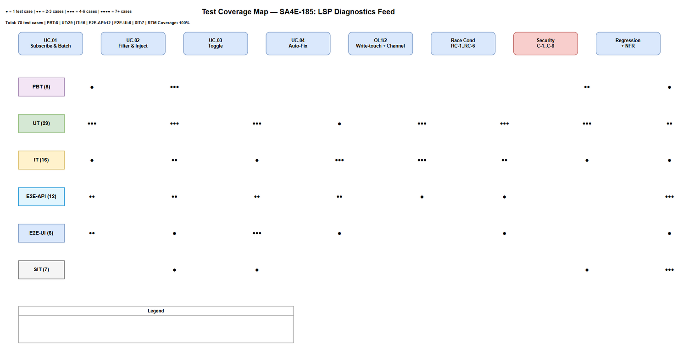
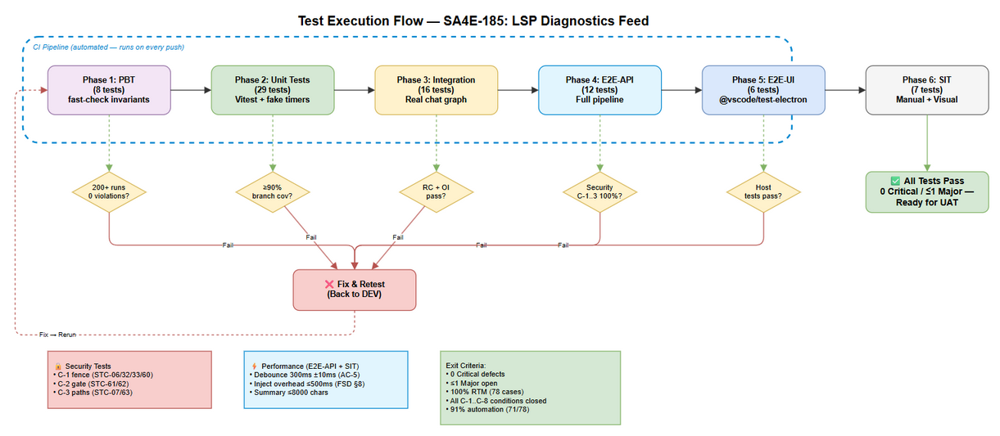

# Software Test Plan (STP)

## SDLC-Agents-4-Enterprise — SA4E-185: LSP Diagnostics Feed — Realtime errors into agent loop

---

## Document Information

| Field | Value |
|-------|-------|
| Jira Ticket | SA4E-185 |
| Title | LSP Diagnostics Feed — Realtime errors into agent loop |
| Author | QA Agent |
| Version | 1.0 |
| Date | 2026-08-20 |
| Status | Draft |
| Related BRD | BRD-v1-SA4E-185.docx |
| Related FSD | FSD-v1-SA4E-185.docx |
| Related TDD | TDD-v1-SA4E-185.docx |
| Related Security Review | SECURITY-DESIGN-REVIEW-SA4E-185.docx |

---

## Author Tracking

| Role | Name - Position | Responsibility |
|------|-----------------|----------------|
| Author | QA Agent – QA Engineer | Create document |
| Peer Reviewer | DEV Agent – Developer | Review document for technical feasibility |

---

## Revision History

| Version | Date | Author | Changes |
|---------|------|--------|---------|
| 1.0 | 2026-08-20 | QA Agent | Initiate document — auto-generated from BRD, FSD (incl. TA §10), TDD, and SECURITY-DESIGN-REVIEW; 78 test cases across 6 levels |

---

## Sign-Off

| Name | Signature and date |
|------|--------------------|
| | ☐ I agree and confirm the test plan in this STP |
| | ☐ I agree and confirm the test plan in this STP |

---

## 1. Introduction

### 1.1 Purpose

This test plan defines the testing strategy, scope, resources, and schedule for SA4E-185 (**LSP Diagnostics Feed**). The feature adds a push-based `DiagnosticsFeedService` to the Kiro VS Code extension that subscribes to `vscode.languages.onDidChangeDiagnostics`, debounces batches with a **300 ms** quiet window, filters diagnostics down to **agent-touched files**, builds a bounded summary (≤ ~8000 chars / ~2000 tokens), and injects it into the LangGraph chat loop via a new `diagnosticsContext` channel on the **next agent turn** (consume-once). When the summary contains ≥ 1 error entry, an **advisory auto-fix** directive is added to the system prompt, bounded by `MAX_AGENT_ITERATIONS = 12`.

Testing must verify: subscription & batching (UC-01, BR-1..3), filtering/summary/injection (UC-02, BR-4..7), user toggle (UC-03, BR-8..10), auto-fix integration (UC-04, BR-11..13), race-condition safety (RC-1..6), the two open-issue resolutions (OI-1 `write_file` classification, OI-2 channel-authoritative injection), and the security review conditions **C-1** (prompt-injection fence), **C-2** (approval-gate enforcement), **C-3** (path containment) plus non-blocking C-4..C-8.

### 1.2 Test Objectives

- Verify all 4 use cases (UC-01..UC-04) from FSD including alternative (AF) and exception (EF) flows.
- Validate all 13 business rules (BR-1..BR-13) are enforced.
- Confirm all 7 BRD acceptance criteria (AC-1..AC-7) are satisfied by automated tests.
- Verify race-condition mitigations RC-1..RC-6 (epoch guard, single-writer channel, read-once buffer).
- Confirm OI-1 regression (`classifyTool("write_file") === "write"` + allowlist fallback) and OI-2 (channel-authoritative injection; feed never flows via `injectedPrompts`).
- Prove security conditions C-1, C-2, C-3 are closed with adversarial tests (prompt-injection fence, approval-gate enforcement, path containment).
- Confirm non-functional targets: 300 ms ± 10 ms debounce, inject overhead ≤ 500 ms, summary ≤ 8000 chars, no per-event LLM round-trip.
- Verify no regression on KSA-178 `diagnostics-provider.ts` and the pull-based `get_diagnostics` tool.

### 1.3 References

| Document | Location |
|----------|----------|
| BRD | documents/SA4E-185/BRD.md (BRD-v1-SA4E-185.docx) |
| FSD (incl. TA §10) | documents/SA4E-185/FSD.md (FSD-v1-SA4E-185.docx) |
| TDD | documents/SA4E-185/TDD.md (TDD-v1-SA4E-185.docx) |
| Security Design Review | documents/SA4E-185/SECURITY-DESIGN-REVIEW.md |
| STP Template | documents/templates/STP-TEMPLATE.md |
| Reference STP/STC (same pattern) | documents/SA4E-182/STP.md, documents/SA4E-182/STC.md |

---

## 2. Test Strategy

### 2.1 Test Levels (6 Levels — Kiro spec workflow)

The feature is a **VS Code extension** with no HTTP endpoints. Test levels are mapped to that reality: **E2E-API** = agent-tool / graph-integration API level (full chat subgraph invoked with a wired feed, mocked LLM at the network layer); **E2E-UI** = VS Code Extension Host level (VS Code Extension Development Host + settings UI + real editor diagnostics).

| Level | ID | Scope | Automation | Tools |
|-------|-----|-------|------------|-------|
| Property-Based Testing | PBT | Invariant verification on `buildSummary`, `filter`, `sanitizeMessage`, `toWorkspaceRelative` (budget, caps, dedupe, containment) | Automated | Vitest + fast-check |
| Unit Testing | UT | `DiagnosticsFeedService` methods, `inject_diagnostics` node, channel reducer, setting/toggle logic | Automated | Vitest + vi.mock + `vi.useFakeTimers()` |
| Integration Testing | IT | HookEngine ↔ feed, `executeSingleTool` → `markTouchedFromTool`, state channel read-once, graph topology (both variants) | Automated | Vitest + real `buildChatSubgraph` + mocked LlmProvider |
| E2E-API Testing | E2E-API | Full pipeline end-to-end at the agent-tool/graph API level: write → LSP event → debounce → filter → inject → next-turn prompt → auto-fix → bound | Automated | Vitest + Hono-style in-process graph invoke (TDD §11.4) |
| E2E-UI Testing | E2E-UI | VS Code Extension Host level: setting registration/UI, toggle reactivity, real editor diagnostics reaching agent context | Automated | Playwright / `@vscode/test-electron` (Extension Development Host) |
| System Integration Testing | SIT | Manual exploratory: visual formatting, latency perception, workspace-trust decision, cross-platform, memory stability | Manual | Browser + Extension Host, screenshots |

### 2.2 Test Types

| Type | Description | Applicable |
|------|-------------|------------|
| Functional Testing | Verify UC-01..UC-04 main/alt/exception flows per FSD | Yes |
| Business Rule Testing | Validate BR-1..BR-13 enforcement | Yes |
| Security Testing | Prompt-injection fence (C-1), approval gate (C-2), path containment (C-3), secret shielding (C-5), buffer caps (C-4) | Yes |
| Race-Condition Testing | RC-1..RC-6 (epoch guard, single-writer, read-once, last-write-wins) | Yes |
| Performance Testing | Debounce 300 ms ± 10 ms, inject overhead ≤ 500 ms, `filter`+`buildSummary` ≤ 5 ms/100 entries, summary ≤ 8000 chars | Yes |
| Regression Testing | KSA-178 provider, `get_diagnostics` tool, hook suite after DR-1 (C-8) | Yes |
| Configuration Testing | `kiroSdlc.enableDiagnosticsFeed` schema, headless default disabled, live toggle | Yes |
| Compatibility Testing | Windows/macOS extension host | Yes (SIT) |
| Usability/UX Testing | Summary format readability, optional panel indicator | Yes (SIT) |

### 2.3 Test Approach

**Risk-based prioritization:** Security conditions C-1/C-2/C-3 and data-integrity (consume-once BR-7, epoch RC-1) are highest priority; functional happy paths next; then edge/negative.

**Automation first:** PBT, UT, IT, E2E-API and E2E-UI are fully automated in CI (Vitest + fast-check + Playwright). SIT is limited to manual/visual workloads that cannot be automated deterministically (format readability, latency perception, trust-state UX, cross-platform look-and-feel) — **71/78 (91%) automated**.

**Test file layout** (matches TDD §11 / TA §10.6 — colocated `__tests__/`):

| New test file | Level(s) |
|---------------|----------|
| `extension/src/langgraph/diagnostics/__tests__/diagnostics-feed-service.test.ts` | PBT, UT |
| `extension/src/langgraph/diagnostics/__tests__/diagnostics-feed-config.test.ts` | UT |
| `extension/src/langgraph/diagnostics/__tests__/inject-diagnostics-node.test.ts` | UT |
| `extension/src/langgraph/__tests__/diagnostics-state-channel.test.ts` | UT, IT |
| `extension/src/langgraph/__tests__/chat-graph-diagnostics.integration.test.ts` | IT, E2E-API |
| `extension/src/langgraph/__tests__/feed-extension-host.e2e.test.ts` | E2E-UI |

### 2.4 Entry Criteria

| Level | Entry Criteria |
|-------|---------------|
| PBT | Types (`DiagnosticsBatchEntry`, `DiagnosticsFeedConfig`, `FeedSummary`) and pure functions (`buildSummary`, `filter`, `sanitizeMessage`, `toWorkspaceRelative`) implemented |
| UT | `DiagnosticsFeedService` class + `inject_diagnostics` node + `diagnosticsContext` channel implemented; code compiles |
| IT | All UT pass ≥ 95%; `executeSingleTool` wired with `markTouchedFromTool`; `HookEngine` classification fixed (DR-1) |
| E2E-API | Graph integration tests pass; `buildChatSubgraph` accepts optional `diagnosticsFeed` (backward compatible) |
| E2E-UI | Extension packaged for Extension Development Host; setting schema registered; feed wired at `activate()` |
| SIT | All automated levels green (0 Critical, ≤ 1 Major open); VSIX packaged on Windows + macOS |

### 2.5 Exit Criteria

| Level | Exit Criteria |
|-------|---------------|
| PBT | All PBT properties pass with ≥ 200 test runs each; 0 invariant violations |
| UT | 100% UT pass; ≥ 90% branch coverage on `DiagnosticsFeedService` (incl. epoch, read-once, caps, budget) |
| IT | All IT scenarios pass; consume-once and loop-re-entry verified on both graph variants |
| E2E-API | Full pipeline + auto-fix bound + toggle + security conditions verified end-to-end |
| E2E-UI | Setting/toggle/diagnostics-reach verified in Extension Host; no reload required for toggle |
| SIT | 0 Critical, ≤ 1 Major defects; visual/UX and workspace-trust decision approved |

### 2.6 E2E Automation Coverage (SIT minimization)

| Scenario Type | Classified As | Rationale |
|--------------|---------------|-----------|
| Subscription/debounce/filter/summarize | PBT + UT | Deterministic, fake timers |
| HookEngine ↔ feed wiring | IT | In-process components |
| Consume-once, loop re-entry, auto-fix, bound | IT + E2E-API | Graph-level, deterministic with mocked LLM |
| Toggle on/off/discard | UT + E2E-API + E2E-UI | Setting → service → graph |
| Prompt-injection fence (C-1) | PBT + UT + E2E-API | Assert rendered prompt delimiters |
| Approval-gate enforcement (C-2) | E2E-API | API-level check sufficient; requires wired gate |
| Path containment (C-3) | PBT + E2E-API | Pure function + end-to-end traversal |
| Summary format readability | SIT (manual) | Needs human eyes (layout) |
| Latency perception / trust UX / cross-platform | SIT (manual) | Visual/timing judgment |

### 2.7 Test Cases Summary

| Level | Count | Automated | Manual |
|-------|-------|-----------|--------|
| PBT | 8 | 8 | 0 |
| UT | 29 | 29 | 0 |
| IT | 16 | 16 | 0 |
| E2E-API | 12 | 12 | 0 |
| E2E-UI | 6 | 6 | 0 |
| SIT | 7 | 0 | 7 |
| **Total** | **78** | **71 (91%)** | **7 (9%)** |

### 2.8 Security Conditions → Test Cases (MANDATORY)

The Security Design Review approved the design **with conditions**. Every condition is mapped to at least one automated test case:

| Cond | Finding | Condition | Test Cases |
|------|---------|-----------|------------|
| **C-1** | F-01 (Major) | Fence + sanitize diagnostics block in system prompt; tighten auto-fix trigger to severity token; adversarial tests | **STC-06, STC-32, STC-33, STC-60** |
| **C-2** | F-02 (Major) | Wire `ToolApprovalGate` at production call site; add `fs_write`/`str_replace`/`fs_append` to `DANGEROUS_TOOL_PATTERNS` | **STC-61, STC-62** |
| **C-3** | F-03 (Major) | Ship + unit-test total workspace-containment helper with traversal/Windows/UNC cases | **STC-07, STC-63** |
| C-4 | F-05 | Buffer caps on `pendingUris`/`touchedFiles` | STC-35 |
| C-5 | F-04 | Secret-pattern shielding in `buildSummary` | STC-36 |
| C-6 | F-06 | Product-security decision on default-on + workspace-trust gating | SIT-76 (manual review) |
| C-7 | F-07 | Per-tab scoping of `touchedFiles` | STC-37 |
| C-8 | F-08 | Run full hook suite after DR-1; confirm no command hooks auto-fire on `write_file` | STC-53, STC-38 |

---

## 3. Test Scope

### 3.1 Features In Scope

| # | Feature / Story | Priority | FSD Reference | Test Levels |
|---|-----------------|----------|---------------|-------------|
| 1 | Subscribe & batch LSP diagnostics (debounce 300 ms) | High | UC-01, BR-1..3, AC-1/AC-5, TC-01..04 | PBT, UT, IT, E2E-API, E2E-UI |
| 2 | Filter (touched files) & inject bounded summary | High | UC-02, BR-4..7, AC-2/AC-3/AC-4, TC-05..09 | PBT, UT, IT, E2E-API |
| 3 | Auto-fix advisory + iteration bound (12) | High | UC-04, BR-11..13, AC-7, TC-14..17 | IT, E2E-API, E2E-UI |
| 4 | User toggle `kiroSdlc.enableDiagnosticsFeed` | High | UC-03, BR-8..10, AC-6, TC-10..13, TC-19 | UT, E2E-API, E2E-UI |
| 5 | Touch-set population incl. `write_file` (OI-1) | High | BR-5, DR-1, TC-06 | UT, IT |
| 6 | Channel-authoritative injection (OI-2, dedupe rule) | High | BR-7, DR-2, RC-2 | UT, IT |
| 7 | Race conditions RC-1..RC-6 | High | TDD §10.5 / §4.4 | UT, IT, E2E-API |
| 8 | Security: C-1 prompt-injection fence | High | SECURITY-REVIEW F-01 | PBT, UT, E2E-API |
| 9 | Security: C-2 approval-gate enforcement | High | SECURITY-REVIEW F-02; BR-13; TC-17 | E2E-API |
| 10 | Security: C-3 path containment | High | SECURITY-REVIEW F-03 | PBT, E2E-API |
| 11 | Security: C-4..C-8 (buffers, secrets, trust, tabs, hooks) | Medium | SECURITY-REVIEW F-04..F-08 | UT, IT, SIT |
| 12 | No regression: KSA-178 + `get_diagnostics` | Medium | TC-18 | IT (regression), SIT |
| 13 | Non-functional: budget ≤ 8000 chars, ≤ 500 ms overhead, no per-event LLM | Medium | FSD §8, TDD §8.3 | PBT, UT, E2E-API, SIT |



### 3.2 Features Out of Scope

| # | Feature | Reason |
|---|---------|--------|
| 1 | KSA-178 `diagnostics-provider.ts` (save-triggered code_search diagnostics + CodeActions) | Existing, distinct mechanism — untouched (TC-18 regression watch only) |
| 2 | Pull-based `get_diagnostics` tool | Existing fallback — unchanged |
| 3 | Generic LSP quick-fix CodeActions | Native VS Code/LSP capability |
| 4 | Persistence of feed state across sessions | In-memory per-session by design (BRD §1.2) |
| 5 | Non-LSP diagnostic sources (task output, test runners) | Out of scope per BRD §1.2 |
| 6 | SDLC pipeline graphs (docs/sdlc/hotfix) | Interactive chat loop only |
| 7 | New dedicated UI surfaces / Chat Panel indicator (v1) | Deferred nice-to-have (FSD §3.3.5); SIT-74 explores it only if implemented |
| 8 | LLM model quality of auto-fix decisions | External; we test contract (directive present/absent, tool gates, bounds) not model judgment |

---

## 4. Test Environment

### 4.1 Environment Requirements

| Environment | Setup | Purpose |
|-------------|-------|---------|
| PBT/UT | Vitest in-memory, `vscode.languages` mocked as tiny `Emitter`, `vi.useFakeTimers()` | Algorithmic + service-level tests |
| IT | Real `buildChatSubgraph` with mocked `LlmProvider` + dummy `wsRoot` + `mcpBridge=undefined` | Component interaction + graph topology |
| E2E-API | Full graph invoke with wired feed; network-layer mocked LLM | End-to-end pipeline |
| E2E-UI | VS Code Extension Development Host + Playwright (`@vscode/test-electron`) | Settings UI + real editor diagnostics |
| SIT | Packaged VSIX on Windows 11 + macOS 13+ | Manual exploratory + UX |

### 4.2 Platform Requirements

| Platform | Version | Required |
|----------|---------|----------|
| VS Code | 1.85+ | Yes |
| Node.js | 20 LTS | Yes |
| Windows | 10/11 | Yes |
| macOS | 13+ | Yes |
| Vitest | ^4.1.8 (extension/package.json) | Yes |

### 4.3 Test Data Requirements

| Data Type | Description | Source | Preparation |
|-----------|-------------|--------|-------------|
| Workspace fixtures | Temp workspace with TS/ESLint files producing known diagnostics | Generated per test | `pre-seeded-data.csv` |
| Diagnostics batches | Entries `(file,line,severity,message,code,source)` incl. dupes, clamps, storms | Fixture CSV | `diagnostics-batch-testdata.csv` |
| Write-tool args | `toolName` + `args` incl. `write_file` (OI-1), non-write, traversal paths | Fixture CSV | `write-tool-args-testdata.csv`, `path-containment-testdata.csv` |
| Toggle values | `true/false` + event sequences + headless config throw | Fixture CSV | `toggle-testdata.csv` |
| Hostile messages | Prompt-injection payloads, control chars, directive tokens | Fixture CSV | `prompt-injection-testdata.csv` |
| Auto-fix scenarios | Summary content (error/warning/mixed), iteration counts | Fixture CSV | `auto-fix-testdata.csv` |

### 4.4 External Dependencies

| System | Dependency | Mock/Stub Available |
|--------|-----------|---------------------|
| VS Code LSP (`onDidChangeDiagnostics`, `getDiagnostics`) | Push events + snapshot pull | Yes — tiny `Emitter` + configurable map |
| LLM Provider (`chatWithTools`) | Model calls in graph | Yes — mocked `LlmProvider` at network layer |
| HookEngine + hook-tool-matcher | Write classification + file hooks | Real instance + temp workspace hooks dir |
| ToolApprovalGate | Permission gate for auto-fix write tools | Requires real wiring (C-2) — E2E-API-008 exercises it |
| `debug-logger.ts` | `[DD-FEED]` structured logs | Yes — spied |

---

## 5. Test Schedule

| Phase | Start Date | End Date | Duration | Milestone |
|-------|-----------|----------|----------|-----------|
| Test Planning | 2026-08-20 | 2026-08-20 | 1 day | STP + STC approved |
| Test Data Preparation | 2026-08-21 | 2026-08-21 | 1 day | Fixture CSVs ready in `testdata/` |
| PBT + UT Development | 2026-08-22 | 2026-08-24 | 3 days | PBT (8) + UT (29) green, coverage ≥ 90% |
| IT Development | 2026-08-25 | 2026-08-26 | 2 days | IT (16) pass, both graph variants |
| E2E-API Execution | 2026-08-27 | 2026-08-28 | 2 days | E2E-API (12) incl. C-1/C-2/C-3 |
| E2E-UI Execution | 2026-08-29 | 2026-08-30 | 2 days | E2E-UI (6) in Extension Host |
| SIT Execution | 2026-08-31 | 2026-08-31 | 1 day | SIT (7) manual sign-off |
| Defect Fix & Retest | 2026-09-01 | 2026-09-02 | 2 days | 0 Critical, ≤ 1 Major |

---

## 6. Resources & Responsibilities

| Role | Name | Responsibility |
|------|------|---------------|
| Test Lead | QA Agent | Test planning, coordination, reporting |
| QA Engineer | QA Agent | Test case design, execution, defect reporting |
| Developer | DEV Agent | Implementation per TDD §12, unit tests, bug fixing |
| SA | SA Agent | Architecture clarification for IT/E2E scenarios |
| Security | Security Agent | Verify C-1/C-2/C-3 closure evidence |
| DevOps | DevOps Agent | CI pipeline for automated test levels |

---

## 7. Risk & Mitigation

| # | Risk | Impact | Likelihood | Mitigation |
|---|------|--------|------------|------------|
| 1 | C-1 fencing not implemented by DEV before QA → prompt-injection tests fail | High | Medium | E2E-API-007/STC-60 raised as blocking; escalate to Security Agent |
| 2 | C-2 approval gate still unwired at production call site (`router-graph.ts:80`) | High | Medium | E2E-API-008/009 verify production wiring; defect → DEV (Major) |
| 3 | C-3 `toWorkspaceRelative` implemented naively (prefix check) → traversal bypass | High | Low | PBT-07 + E2E-API-010 adversarial cases; Windows/UNC cases in CSV |
| 4 | Flaky fake-timer assertions around 300 ms debounce | Medium | Medium | `vi.useFakeTimers()` with exact advance; tolerance ± 10 ms |
| 5 | E2E-UI (Extension Host) instability in Playwright | Medium | High | Retry logic, stable selectors, wait strategies |
| 6 | Race tests for RC-1..RC-6 hard to reproduce deterministically | Medium | Medium | Controllable timers + injected epoch transitions |
| 7 | Requirement change on default-on (C-6 product decision) | Medium | Low | Keep toggle tests parameterizable; decision documented in SIT-76 |

---

## 8. Defect Management

### 8.1 Severity Levels

| Severity | Definition | Example |
|----------|-----------|---------|
| Critical | Security breach (injection succeeds past fence), loop corruption, context leak across tabs | C-1 fails; diagnostics summary leaks to wrong tab |
| Major | Feature not working or security control missing | Toggle doesn't disable; approval gate unwired (C-2); touched filter wrong |
| Minor | Works with workaround; degraded UX | Cap marker wording; log noise |
| Trivial | Cosmetic/formatting | Summary alignment in chat |

### 8.2 Priority Levels

| Priority | Definition | SLA (Fix Time) |
|----------|-----------|----------------|
| P1 | Security or data-integrity issue (C-1..C-3 failures) | 4 hours |
| P2 | Core feature broken (feed never injects, loop unbounded) | 1 business day |
| P3 | Enhancement/minor | 3 business days |
| P4 | Cosmetic | Next release |

### 8.3 Defect Lifecycle

```
New → Open → In Progress → Fixed → Ready for Retest → Verified → Closed
                                                     → Reopened → In Progress
```

---

## 9. Test Metrics & Reporting

### 9.1 Metrics

| Metric | Formula | Target |
|--------|---------|--------|
| Test Execution Rate | Executed / Total × 100% | 100% |
| Pass Rate | Passed / Executed × 100% | ≥ 95% |
| Defect Density | Defects / Test Cases | ≤ 0.05 |
| Critical Defect Count | Count of Critical severity | 0 |
| Security Test Pass Rate | Sec tests passed / Total sec tests × 100% | 100% (C-1..C-3) |
| Code Coverage (DiagnosticsFeedService) | Branch coverage | ≥ 90% |
| Automation Ratio | Automated / Total | ≥ 90% (target 91%) |

### 9.2 Reporting Schedule

| Report | Frequency | Audience |
|--------|-----------|----------|
| Daily Test Status | Daily during execution | Project team |
| Defect Summary | Daily | Dev team |
| Security Conditions Closure Report | End of E2E-API phase | Security + Arch team |
| Test Completion Report | End of SIT | All stakeholders |

---

## 10. Test Execution Flow



**Pipeline:** PBT → UT → IT → E2E-API → E2E-UI → SIT. Each level gates the next; RC/epsec-branch defect feedback loops return to DEV (fix → re-run affected level).

---

## 11. Appendix

### Glossary

| Term | Definition |
|------|------------|
| PBT | Property-Based Testing — random inputs verify invariants (fast-check) |
| UT | Unit Testing — isolated class/function tests with mocked `vscode` APIs |
| IT | Integration Testing — real component interactions, partial mocking |
| E2E-API | End-to-End at agent-tool/graph API level — full subgraph with wired feed, mocked LLM |
| E2E-UI | End-to-End UI — VS Code Extension Host level (settings UI + real diagnostics) |
| SIT | System Integration Testing — full packaged extension, visual/UX review |
| diagnosticsContext | New `PipelineAnnotation` channel (single-writer: `inject_diagnostics`) |
| epoch | Generation counter discarding stale flush callbacks (RC-1/RC-5) |
| consume-once | BR-7 semantics — summary injected once per turn, cleared after |

### Assumptions

- DEV implements TDD §12 including DR-1 (OI-1), DR-2 (OI-2) and security conditions C-1..C-3 before QA sign-off.
- The feed setting defaults to `true` per BRD (C-6 decision documented; tests parameterized).
- Auto-fix quality is not tested (external model) — only the advisory contract, tool gates, and bounds.
- LangGraph version pinned per existing package.json; graph invoked in-process with mocked LLM.

### Diagram Index

| # | Diagram | Image | Source (editable) |
|---|---------|-------|-------------------|
| 1 | Test Coverage | [test-coverage.png](diagrams/test-coverage.png) | [test-coverage.drawio](diagrams/test-coverage.drawio) |
| 2 | Test Execution Flow | [test-execution-flow.png](diagrams/test-execution-flow.png) | [test-execution-flow.drawio](diagrams/test-execution-flow.drawio) |