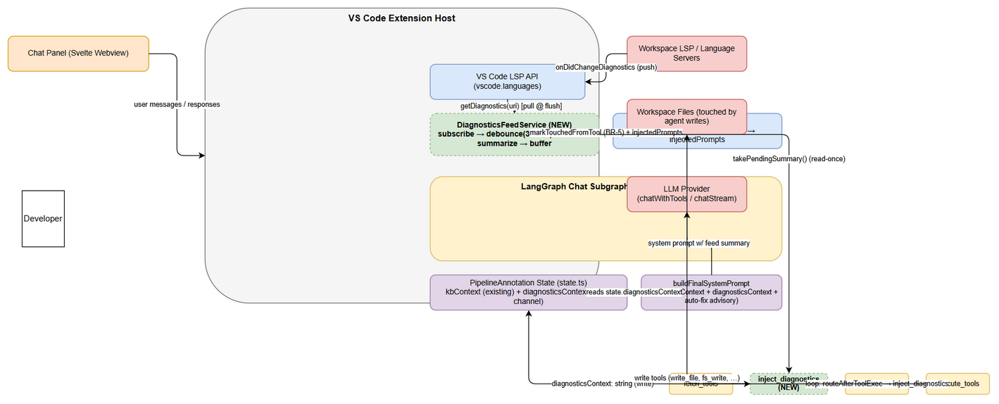
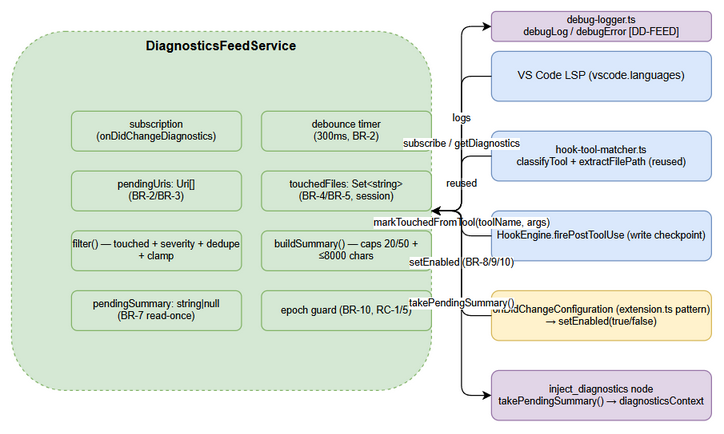
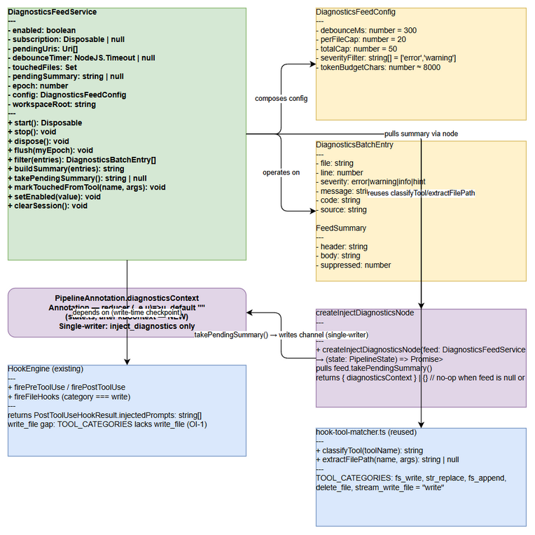

# Technical Design Document (TDD)

## SDLC-Agents-4-Enterprise — SA4E-185: LSP Diagnostics Feed — Realtime errors into agent loop

---

## Document Information

| Field | Value |
|-------|-------|
| Jira Ticket | SA4E-185 |
| Title | LSP Diagnostics Feed — Realtime errors into agent loop |
| Author | SA Agent |
| Version | 1.0 |
| Date | 2026-08-20 |
| Status | Draft |
| Related BRD | documents/SA4E-185/BRD.md (BRD-v1-SA4E-185.docx) |
| Related FSD | documents/SA4E-185/FSD.md (FSD-v1-SA4E-185.docx, incl. TA Enrichment §10) |

---

## Author Tracking

| Role | Name - Position | Responsibility |
|------|-----------------|----------------|
| Author | SA Agent – Solution Architect | Create document |
| Peer Reviewer | BA Agent – Business Analyst | Review for BRD/FSD alignment |

---

## Revision History

| Version | Date | Author | Changes |
|---------|------|--------|---------|
| 1.0 | 2026-08-20 | SA Agent | Initiate document — verified against `extension/src` (chat-graph.ts, state.ts, hook-engine.ts, hook-tool-matcher.ts, chat-graph-nodes.ts, config-watcher.ts, extension.ts, package.json, diagnostics-provider.ts, router-graph.ts, graph-builder.ts, langgraph-engine.ts, debug-logger.ts) |

---

## Sign-Off

| Name | Signature and date |
|------|--------------------|
| | ☐ I agree and confirm the technical design in this TDD |
| | ☐ I agree and confirm the technical design in this TDD |

---

## 1. Introduction

> **Scope Boundary:** This TDD specifies HOW to implement the requirements defined in the FSD (SA4E-185 v1.1, incl. TA Enrichment §10). It does NOT repeat functional requirements, business rules, use cases, or UI specifications — refer to the FSD for those. This document focuses on: technology choices, architecture decisions, implementation patterns, and deployment concerns.

### 1.1 Purpose

This TDD defines the technical architecture for the **LSP Diagnostics Feed** in the Kiro VS Code extension: a push-based pipeline that streams realtime language-server diagnostics (`vscode.languages.onDidChangeDiagnostics`) for **agent-touched files** into the interactive LangGraph agent loop, enabling agent **self-correction** (advisory auto-fix) while working in the workspace. It validates and resolves the TA open issues **OI-1** (`write_file` missing from `TOOL_CATEGORIES`) and **OI-2** (`injectedPrompts` discarded at `chat-graph-nodes.ts:334`), and confirms the injection-channel decision (new `diagnosticsContext` channel).

The design implements FSD use cases UC-01 → UC-04 and business rules BR-1 → BR-13.

### 1.2 Scope

**In scope (technical):**

- **NEW** `DiagnosticsFeedService` — LSP event subscription, 300 ms debounce batching, workspace/file-scheme scoping, touched-files filtering, severity filter, dedupe, caps (20/file, 50 total), bounded summary build (≤ ~8000 chars), read-once `pendingSummary` buffer, `epoch` race guard.
- **NEW** `inject_diagnostics` LangGraph node (single-writer of the new `diagnosticsContext` channel) + `state.ts` channel declaration.
- **MODIFY** `chat-graph.ts` (both graph variants: node/edge wiring, `routeAfterToolExec` re-entry, `buildFinalSystemPrompt` merge + auto-fix advisory), `chat-graph-nodes.ts` (`agent_step` clear-after-turn; `executeSingleTool` → `markTouchedFromTool`), `hook-tool-matcher.ts` (OI-1 fix), `extension/package.json` (setting), `extension.ts` (activation + live toggle watcher), `langgraph-engine.ts` / `graph-builder.ts` / `router-graph.ts` (feed instance plumbing).
- **NEW** settings key `kiroSdlc.enableDiagnosticsFeed` (boolean, default `true`) — VS Code Settings UI.
- Unit + integration tests (Vitest) per FSD §10.6.

**Out of scope (unchanged):**

- `extension/src/diagnostics-provider.ts` (KSA-178) — save-triggered code_search diagnostics + CodeActions, **kept separate, no changes** (verified: `diagnostics-provider.ts:37-50`).
- `get_diagnostics` pull tool (`vscode-tools.ts:126-142`) — unchanged, remains available.
- No persistence (feed state is in-memory, session-scoped — BRD §1.2).
- No SDLC pipeline graphs (docs/sdlc/hotfix) — interactive chat subgraph only.
- No new network egress; all processing local to the Extension Host.
- No new UI surfaces (optional Chat Panel indicator deferred as nice-to-have).

### 1.3 Technology Stack

| Layer | Technology | Version | Evidence |
|-------|-----------|---------|----------|
| Language | TypeScript | 5.x | `extension/package.json` |
| Extension Host | VS Code Extension API | ^1.85.0 | `package.json:14` |
| State Machine | LangGraph (`@langchain/langgraph`) | 0.0.x | `chat-graph.ts:12` |
| Graph Runtime | LSP push events | VS Code API | `vscode.languages.onDidChangeDiagnostics` |
| Config | VS Code `contributes.configuration` | `kiroSdlc.*` | `package.json:217-221` pattern |
| Logging | `debug-logger.ts` (`debugLog`/`debugError`) | existing | `extension/src/debug-logger.ts` |
| Testing | Vitest | ^4.1.8 | `package.json:387,413` |

> **No new runtime libraries.** All dependencies are existing VS Code APIs and in-repo modules (`hook-tool-matcher`, `debug-logger`). No new NPM package.

### 1.4 Design Principles

- **Channel-authoritative + single-writer** — the new `diagnosticsContext` channel is the ONLY transport for feed summaries; the `inject_diagnostics` node is the only writer. `postToolUse → injectedPrompts` never carries feed content (dedupe rule, FSD §3.2 AF-04) → consume-once is provable.
- **Read-once at the source** — `takePendingSummary()` returns-and-clears the buffer; the graph node merely transports the outcome. The service never writes graph state directly (eliminates feed↔graph races at the source).
- **Condition in data, not topology** — no conditional edges for "has diagnostics"; the graph topology is fixed; emptiness (no injectable summary) is expressed as `{}` (no channel churn).
- **Backward compatibility** — `diagnosticsFeed` is an optional parameter at every call-site layer; when `undefined`, the node no-ops and the loop runs exactly as today. Old test call sites keep working.
- **Match existing patterns** — optional-param closure injection (SA4E-186), `onDidChangeConfiguration` + `affectsConfiguration` for settings (extension.ts:307), `[MODULE] key=value` debug logging, colocated Vitest `__tests__/`.
- **Fail-safe defaults** — settings read in non-VS Code/headless context is treated as **disabled** (EF-01); every failure path is non-fatal to the loop.

### 1.5 Constraints

- Extension Host is single-threaded — all feed processing must be synchronous or non-blocking async; debounce uses `setTimeout` (no worker).
- LangGraph StateGraph is compiled once — nodes/edges cannot change at runtime; the feed node re-enters per iteration via the `routeAfterToolExec` conditional edge mapping (static topology).
- Both chat-graph variants (RAG-graded and standard, `chat-graph.ts:269-305`) MUST receive identical changes (V14).
- `MAX_AGENT_ITERATIONS = 12` (`chat-graph.ts:33`) bounds auto-fix cycles — no new loop guard (BR-12).
- The `ConfigWatcher` class (`config-watcher.ts`) watches ONLY `.kiro/settings/mcp.json` — the feed setting must use `onDidChangeConfiguration` (extension.ts:307-313 pattern), NOT `ConfigWatcher` (V8).
- `write_file` currently classifies as `"other"` (`hook-tool-matcher.ts:8-16`) — the BR-5 touched-set path must not depend solely on `TOOL_CATEGORIES` (OI-1).
- `firePostToolUse` return value is currently discarded (`chat-graph-nodes.ts:334`) — feed must not depend on `injectedPrompts` (OI-2).

### 1.6 References

| Document | Location |
|----------|----------|
| BRD SA4E-185 | documents/SA4E-185/BRD.md |
| FSD SA4E-185 (BA + TA §10) | documents/SA4E-185/FSD.md |
| TDD SA4E-186 (same epic, reference) | documents/SA4E-186/TDD.md |
| Agent loop / chat subgraph | extension/src/langgraph/subgraphs/chat-graph.ts |
| Node implementations | extension/src/langgraph/subgraphs/chat-graph-nodes.ts |
| Pipeline state definition | extension/src/langgraph/core/state.ts |
| Hook engine + matcher | extension/src/langgraph/hooks/hook-engine.ts, hook-tool-matcher.ts |
| Router / graph builder / engine | extension/src/langgraph/router/router-graph.ts, subgraphs/graph-builder.ts, engine/langgraph-engine.ts |
| Extension activation + settings | extension/src/extension.ts, extension/package.json |
| KSA-178 provider (distinct) | extension/src/diagnostics-provider.ts |
| Debug logger | extension/src/debug-logger.ts |---

## 2. System Architecture

### 2.1 Architecture Overview

The feature runs entirely inside the **VS Code Extension Host** process. No new services, containers, or external systems are introduced. The architecture adds one service (**DiagnosticsFeedService**) and one LangGraph node (**`inject_diagnostics`**) into the existing interactive chat pipeline, and one new state channel (**`diagnosticsContext`**) to `PipelineAnnotation`.


*[Edit in draw.io](diagrams/architecture.drawio)*

**Key data flow (implements FSD §2.1, §6.1; UC-01 → UC-04):**

1. **Push**: workspace language servers publish changes → VS Code fires `vscode.languages.onDidChangeDiagnostics(uris)`.
2. **Batch**: `DiagnosticsFeedService` checks the toggle (BR-8); filters URIs to `file://` inside the workspace (BR-3); accumulates them; resets a **300 ms** debounce timer (BR-2).
3. **Flush**: on 300 ms quiet, the service reads the current snapshot via `vscode.languages.getDiagnostics(uri)` per pending URI, then `filter()` (touched files BR-4 + severity default + dedupe + line clamp) and `buildSummary()` (caps 20/50 + ≤8000-char budget), storing the result in `pendingSummary` (BR-6, BR-7).
4. **Inject**: on the next graph pass, the `inject_diagnostics` node (re-entered at every loop iteration after `execute_tools`) pulls `takePendingSummary()` (read-once at source) and writes the only non-empty value into the `diagnosticsContext` channel.
5. **Consume**: `buildFinalSystemPrompt(state)` appends the channel after `kbContext` and, when the summary contains ≥1 `error` entry, adds the advisory auto-fix directive (BR-11). `agent_step` clears the channel to `""` in its payload (BR-7 consume-once).
6. **Self-correct**: the LLM may issue write tool calls (`write_file`, `fs_write`, …); `executeSingleTool` (a) refreshes the touched-files set via `markTouchedFromTool` (BR-5), (b) fires existing `HookEngine` hooks, and the changed file re-triggers step 1. The loop is bounded by `MAX_AGENT_ITERATIONS = 12` via `routeAfterToolExec` (BR-12).

### 2.2 Component Diagram


*[Edit in draw.io](diagrams/component.drawio)*

| Component | Responsibility | Technology / Source | Status |
|-----------|---------------|---------------------|--------|
| VS Code LSP API (`vscode.languages`) | Push event channel + diagnostic snapshot pull | VS Code API (`onDidChangeDiagnostics`, `getDiagnostics`) | External |
| DiagnosticsFeedService | subscribe → debounce(300 ms) → scope → filter → summarize → buffer (BR-1…BR-10) | NEW — `extension/src/langgraph/diagnostics/diagnostics-feed-service.ts` | **NEW** |
| hook-tool-matcher | `classifyTool()` + `extractFilePath()` reused for BR-5 (with OI-1 fix) | `extension/src/langgraph/hooks/hook-tool-matcher.ts` | Existing (1-line change) |
| HookEngine | `firePostToolUse` / `fireFileHooks` write checkpoint; `injectedPrompts` NOT used for feed (dedupe rule) | `extension/src/langgraph/hooks/hook-engine.ts` | Existing (unchanged logic) |
| LangGraph Chat Subgraph | agent loop; `inject_diagnostics` node inserted between `fetch_tools`→`agent_step` and re-entered per iteration | `extension/src/langgraph/subgraphs/chat-graph.ts` | Existing (modified) |
| PipelineAnnotation state | holds `kbContext` (existing) + `diagnosticsContext` (**NEW** channel) | `extension/src/langgraph/core/state.ts` | Existing (extended) |
| buildFinalSystemPrompt | merges `kbContext` + `diagnosticsContext` + auto-fix advisory (BR-11) | `chat-graph.ts:221-248` | Existing (modified) |
| `agent_step` node | consumes channel; returns `diagnosticsContext: ""` on all paths (BR-7) | `extension/src/langgraph/subgraphs/chat-graph-nodes.ts` | Existing (modified) |
| `executeSingleTool` | write checkpoint → `markTouchedFromTool` (BR-5) + existing hooks | `chat-graph-nodes.ts:287-345` | Existing (modified) |
| debug-logger | `[DD-FEED]` structured logs, `debugError` | `extension/src/debug-logger.ts` | Existing |
| KSA-178 `diagnostics-provider.ts` | save-triggered code_search diagnostics + CodeActions (**kept separate**) | `extension/src/diagnostics-provider.ts` | Existing (untouched) |
| `get_diagnostics` tool | pull-based fallback (unchanged) | `extension/src/langgraph/vscode/vscode-tools.ts` | Existing (untouched) |

### 2.3 Deployment Architecture

The feature ships inside the existing extension bundle — there is **no separate deployment topology**.

| Artifact | Deployment Target | Change |
|----------|-------------------|--------|
| Extension bundle (`.vsix` via `vsce package`) | VS Code Marketplace / local install | New code + new setting only |
| Webview bundle (Svelte) | Embedded in extension assets | **None** (no UI change in v1) |
| LangGraph graph | In-memory, per Extension Host session | New node/edges compiled at build time |
| Feed state (`touchedFiles`, `pendingSummary`, …) | In-memory, session-scoped | Cleared at extension deactivate / new chat session |

> **No database, no server, no container changes.** `extension/package.json` `contributes.configuration` is the only packaging-level change (a settings schema addition).

### 2.4 Communication Patterns

| From | To | Protocol | Pattern | Description |
|------|----|----------|---------|-------------|
| Workspace LSP / Language Server | DiagnosticsFeedService | VS Code event (`onDidChangeDiagnostics`) | **Async push** (event) | Changed-URI notifications (UC-01) |
| DiagnosticsFeedService | VS Code LSP API | VS Code API (`getDiagnostics(uri)`) | **Sync pull** (at flush) | Snapshot read at debounce quiet (BR-2) |
| DiagnosticsFeedService | `inject_diagnostics` node | In-process call (`takePendingSummary()`) | **Sync pull, read-once** | Buffer drained at source (BR-7) |
| `inject_diagnostics` node | PipelineAnnotation | Channel write (`diagnosticsContext`) | **Sync state write** | Single-writer rule (§10.2 FSD) |
| Graph → LLM Provider | buildFinalSystemPrompt → `chatWithTools`/`chatStream` | In-process + HTTPS | **Async request-response** | Summary merged in system prompt |
| `executeSingleTool` | DiagnosticsFeedService | In-process call (`markTouchedFromTool`) | **Sync** | Touched-set refresh (BR-5) |
| VS Code Settings | DiagnosticsFeedService | `onDidChangeConfiguration` (event) | **Async push** | Live toggle (BR-9) |---

## 3. API / Interface Design

> **Prerequisite:** Functional contracts (parameters, business errors, data flows) are defined in FSD §3.1–§3.4 (§3.x.6). This feature introduces **no HTTP/REST endpoints** — it is extension-internal. This section specifies the technical interfaces: TypeScript signatures, the state-channel contract, the VS Code settings JSON schema, and the LangGraph topology change that transports the feed.

### 3.1 Interface Overview

| # | Interface | Kind | Consumed By | Implements |
|---|-----------|------|-------------|------------|
| 1 | `DiagnosticsFeedService` (class) | In-process class API | graph node, `extension.ts`, engine | UC-01, UC-02, UC-03 |
| 2 | `createInjectDiagnosticsNode(feed)` | Factory function → graph node | `chat-graph.ts` (both variants) | UC-02 (BR-7) |
| 3 | `diagnosticsContext` channel | `PipelineAnnotation` channel | `buildFinalSystemPrompt`, `agent_step` | UC-02 (BR-7), UC-04 (BR-11) |
| 4 | `kiroSdlc.enableDiagnosticsFeed` | VS Code configuration (JSON schema) | settings UI + feed service | UC-03 (BR-8/9/10) |
| 5 | LSP event + query | VS Code API | feed service | UC-01 (BR-1/2/3) |
| 6 | Graph topology (`routeAfterToolExec` map) | LangGraph wiring | chat subgraph | UC-02 (BR-7), UC-04 (BR-12) |
| 7 | VS Code tool `write_file` classification | `TOOL_CATEGORIES` entry | hook engine + `markTouchedFromTool` | BR-5 (**OI-1 fix**) |

### 3.2 Interface 1 — `DiagnosticsFeedService`

**Implements:** UC-01, UC-02, UC-03 — BR-1 … BR-10. **File (NEW):** `extension/src/langgraph/diagnostics/diagnostics-feed-service.ts`

**Constructor:** `new DiagnosticsFeedService(workspaceRoot: string, getConfig?: () => vscode.WorkspaceConfiguration)`

The `getConfig` function is injectable for tests/headless; default = `() => vscode.workspace.getConfiguration("kiroSdlc")`. On construction the service reads the toggle (`enableDiagnosticsFeed`, default `true` — headless-safe: read failure → **disabled**, FSD UC-03 EF-01) and calls `start()`.

**Public methods (schema):**

```typescript
export class DiagnosticsFeedService implements vscode.Disposable {
  start(): vscode.Disposable;                      // BR-1   subscribe onDidChangeDiagnostics; register while enabled
  stop(): void;                                    // BR-1/10 unsubscribe + clear timer/buffer
  dispose(): void;                                 // UC-01 EF-03  detach subscription, clear state
  onDiagnosticsChanged(uris: readonly vscode.Uri[]): void;   // BR-2/3 handler (registered via onDidChangeDiagnostics)
  flush(myEpoch: number): void;                    // BR-2/6 quiet-window flush: getDiagnostics → filter → buildSummary
  filter(entries: DiagnosticsBatchEntry[]): DiagnosticsBatchEntry[];  // BR-4/6 touched + severity + dedupe + clamp
  buildSummary(kept: DiagnosticsBatchEntry[]): string;        // BR-6 caps 20/50 + budget ≤ 8000 chars (§3.7)
  takePendingSummary(): string | null;             // BR-7 read-once at source (returns & clears buffer)
  markTouchedFromTool(toolName: string, args: Record<string, unknown>): void;  // BR-5 (handles write_file — OI-1)
  setEnabled(value: boolean): void;                // BR-8/9/10 live toggle; epoch++ + discard on false
  clearSession(): void;                            // BR-5 session start: reset touchedFiles/pending/epoch
  get isEnabled(): boolean;                        // BR-8 (observability / optional UI mirror)
}
```

**Method behavior contract:**

| Method | Precondition | Behavior | Error handling (E-x of FSD §10.5) |
|--------|--------------|----------|-----------------------------------|
| `start()` | workspace open | pushes subscription to `disposables`; returns the `Disposable` | E-1 (handler throw → `debugError`, non-fatal) |
| `onDiagnosticsChanged` | `enabled === true` | workspace/file filter (BR-3) → accumulate `pendingUris` → reset 300 ms timer with captured `myEpoch` | E-2/E-3 (per-URI `getDiagnostics` failures skipped) |
| `flush(myEpoch)` | 300 ms quiet | abort if `myEpoch !== epoch` (E-4); read snapshot; `filter()`; if empty → return (E-5); else `pendingSummary = buildSummary(...)` (BR-7) | E-6 (cap log), E-9 (batch persists for next turn) |
| `markTouchedFromTool(name, args)` | — | normalize `extractFilePath(name, args)` to workspace-relative; `touchedFiles.add(rel)`. **Write-tool allowlist fallback** (see OI-1 resolution) | E-10 (extraction failure/unknown tool → skip) |
| `setEnabled(v)` | — | `enabled = v`; if `false`: `epoch++`, clear timer + URIs + `pendingSummary` (BR-10) | E-12 (settings read fail → disabled) |
| `takePendingSummary()` | — | return `pendingSummary`; set to `null` (read-once) | E-7 (null when empty) |
| `clearSession()` | — | `touchedFiles.clear()`, `pendingUris = []`, `pendingSummary = null`, `epoch++` | — |

### 3.3 Interface 2 — `createInjectDiagnosticsNode`

**Implements:** UC-02 (BR-7). **File (NEW):** `extension/src/langgraph/diagnostics/inject-diagnostics-node.ts`

```typescript
import { PipelineState } from "../core/state";
import type { DiagnosticsFeedService } from "./diagnostics-feed-service";

// Returns a LangGraph node. When feed is null/undefined (not wired, tests, old call sites)
// the node no-ops — graph behaves exactly as today (backward compatibility).
export function createInjectDiagnosticsNode(feed: DiagnosticsFeedService | null):
  (state: PipelineState) => Promise<Partial<PipelineState>> {
  return async (_state) => {
    if (!feed) return {};                    // E-8: not wired → no-op
    const summary = feed.takePendingSummary(); // read-once at source (BR-7)
    return summary ? { diagnosticsContext: summary } : {}; // {} → no channel churn
  };
}
```

**Response payload contract (JS/JSON shape, valid `Partial<PipelineState>`):**

```json
{ "diagnosticsContext": "[Diagnostics feed] (toggle: kiroSdlc.enableDiagnosticsFeed = on)\nsrc/app.ts:12 error TS2339 Property 'ctx' does not exist on type 'App'\n... (3 more diagnostics suppressed)" }
```

or `{}` (empty) when nothing pending. The node performs **no filtering logic** — all conditions (toggle, touched, budget) are evaluated inside the service; the graph carries no conditional branch for "has diagnostics" (condition in data, not topology).

### 3.4 Interface 3 — `diagnosticsContext` channel contract

**Implements:** UC-02 (BR-7), UC-04 (BR-11). **File (MODIFY):** `extension/src/langgraph/core/state.ts` — insert immediately **after line 65** (`kbContext`):

```typescript
// SA4E-185: realtime LSP diagnostics feed summary; consumed once per turn (BR-7)
diagnosticsContext: Annotation<string>({ reducer: (_existing, update) => update, default: () => "" }),
```

**Contract (validated against FSD §10.2):**

| Aspect | Rule |
|--------|------|
| Type | `Annotation<string>`, reducer last-write-wins `(_e, u) => u`, default `""` |
| Writer | **Single-writer**: only `inject_diagnostics` node writes non-`""` values |
| Reader | `buildFinalSystemPrompt(state)` appends after `kbContext`; conditional auto-fix advisory (§4.5) |
| Clear | `agent_step` returns `diagnosticsContext: ""` in **every** return payload (success/tool-call/error/no-LLM paths — `chat-graph-nodes.ts:120-124, 184, 188, 196-202, 218, 224-229`) |
| Cross-invocation | fresh `default: () => ""` per graph `invoke` — stale summaries never leak across chat turns |

### 3.5 Interface 4 — VS Code settings schema

**Implements:** UC-03 (BR-8/9/10). **File (MODIFY):** `extension/package.json` → `contributes.configuration.properties`, immediately after `kiroSdlc.enableMcpServer` (currently `:217-221`), modeled byte-for-byte on that boolean pattern:

```json
{
  "kiroSdlc.enableDiagnosticsFeed": {
    "type": "boolean",
    "default": true,
    "description": "Enable the realtime LSP diagnostics feed into the agent loop (batched, agent-touched files only)"
  }
}
```

**Read (BR-8, headless-safe EF-01):**

```typescript
const settings = vscode.workspace.getConfiguration("kiroSdlc");
const enabled = settings.get<boolean>("enableDiagnosticsFeed", true); // throw/undefined → treated as disabled
```

**Watch (BR-9 — immediate, no reload). Follow the EXISTING `extension.ts:307` pattern (`onDidChangeConfiguration` + `affectsConfiguration`) — NOT `ConfigWatcher` (it only watches `.kiro/settings/mcp.json`, V8):**

```typescript
// extension.ts — next to the existing mcpServerPort watcher (:307-313)
context.subscriptions.push(vscode.workspace.onDidChangeConfiguration((event) => {
  if (!event.affectsConfiguration("kiroSdlc.enableDiagnosticsFeed")) { return; }
  const enabled = vscode.workspace.getConfiguration("kiroSdlc")
    .get<boolean>("enableDiagnosticsFeed", true);
  diagnosticsFeedService.setEnabled(enabled);   // live toggle (BR-8/9/10)
}));
```

### 3.6 Interface 5 — LSP event + query (VS Code API)

**Implements:** UC-01 (BR-1/2/3).

| API | Direction | Usage | Business rule |
|-----|-----------|-------|---------------|
| `vscode.languages.onDidChangeDiagnostics(listener)` | push | subscription created in `start()`, kept while enabled | BR-1 |
| `vscode.languages.getDiagnostics(uri): Diagnostic[]` | pull | called per pending URI at `flush()` time | BR-2 (snapshot), BR-3 (scope) |
| `vscode.workspace.asRelativePath(uri)` | helper | workspace-relative `file` field | BR-3, BR-6 |
| `vscode.workspace.workspaceFolders` | helper | workspace containment check | BR-3 |

Severity mapping (required by BR-6): `DiagnosticSeverity.Error → "error"`, `Warning → "warning"`, `Information → "info"`, `Hint → "hint"`.

### 3.7 Injected Summary Format (payload schema)

Built by `buildSummary()` (BR-6, FSD §3.2.4). One string, ≤ ~8000 chars (≈2000 tokens, V13).

```
[Diagnostics feed] (toggle: kiroSdlc.enableDiagnosticsFeed = <on/off>)
<file>:<line> <severity> <code> <message>      ← one entry per kept diagnostic (BR-6)
... (N more diagnostics suppressed)             ← when caps N=20/file or M=50 total hit
```

**Caps/limits (FSD §3.2 Validation Rules):** per-file cap N=20; total cap M=50; severity default filter `["error","warning"]`; budget guard `tokenBudgetChars ≈ 8000` applied via `.slice(0, tokenBudgetChars)`; entries deduplicated on `(file, line, code)`; `line` clamped to the file's line count.

### 3.8 Interface 6 — LangGraph topology change

**Implements:** UC-02 (BR-7), UC-04 (BR-12). **File (MODIFY):** `extension/src/langgraph/subgraphs/chat-graph.ts` — **BOTH variants** (`:269-288` RAG-graded and `:291-305` standard, V14).

```
__start__ → fetch_tools → inject_diagnostics → agent_step ──(routeAgentStep)──→ execute_tools
                                                   ▲                              │
                                                   └──────────────────────────────┘
                                     (routeAfterToolExec: continue → "inject_diagnostics" ; failed/>=12 → "synthesize")
verify_response ──(routeAfterVerify)──→ execute_tools | agent_step (retry) | __end__
```

Changes:

1. `buildChatSubgraph(...)` gains an 8th optional parameter `diagnosticsFeed?: DiagnosticsFeedService`.
2. `const injectDiag = createInjectDiagnosticsNode(diagnosticsFeed ?? null);`
3. `.addNode("inject_diagnostics", injectDiag)` + `.addEdge("fetch_tools", "inject_diagnostics")` + `.addEdge("inject_diagnostics", "agent_step")` in both variants.
4. `.addConditionalEdges("execute_tools", routeAfterToolExec, { inject_diagnostics: "inject_diagnostics", synthesize: "synthesize" })` — **replaces** `agent_step: "agent_step"` entry in the continue branch (verified at `chat-graph.ts:282` and `:302`).
5. `routeAfterToolExec` (`chat-graph.ts:167-172`) continue branch returns `"inject_diagnostics"`; `pipelineStatus === "failed"` and `agentIterations >= MAX_AGENT_ITERATIONS` branches keep returning `"synthesize"` (BR-12 untouched).

**Every-iteration freshness (BR-7 "next turn"):** a batch flushed *during* `execute_tools` of turn N is pulled by `inject_diagnostics` at the top of turn N+1. `verify_response(INCOMPLETE) → agent_step` retry paths are safe because `agent_step` already cleared the channel (no repeat), and the buffer still holds any pending batch for the next `inject_diagnostics` pass.

### 3.9 Interface 7 — `write_file` classification (OI-1 fix)

See §4.4. This is a 1-line additive change in `extension/src/langgraph/hooks/hook-tool-matcher.ts` (TOOL_CATEGORIES) **plus** a write-tool allowlist fallback inside `markTouchedFromTool` (defense-in-depth so BR-5 never depends on a single classification path).---

## 4. Database Design

> **Prerequisite:** FSD §4 defines logical/session entities only (no persistence). **This feature introduces NO database.**

### 4.1 Statement — No Database Changes (Explicit)

- **There is no backend, no database, and no DDL in this feature.** The entire pipeline lives inside the VS Code Extension Host process (extension-only).
- Feed state is **in-memory, session-scoped** (BRD §1.2, FSD §4.1): `touchedFiles`, `pendingUris`, `pendingSummary`, `epoch` are module-local service fields, cleared at session start / extension deactivate.
- The only "persistent" artifact is the VS Code **settings** key `kiroSdlc.enableDiagnosticsFeed` (stored by VS Code's own configuration store — managed by VS Code, not by this feature).
- **`documents/SA4E-185/FSD.md` is correct**: no ER diagram was produced for good reason — there are no persisted entities.

> ⚠️ **Database sections of the TDD template are N/A.** The logical view below documents the in-memory runtime state so DEV can implement it exactly (schema as TypeScript types; "DDL" equivalent is the class-field initialization).

### 4.2 Logical In-Memory Schema (TypeScript types)

**File (NEW):** `extension/src/langgraph/diagnostics/diagnostics-feed-types.ts`

```typescript
/** One diagnostic that reached the flush stage (FSD §3.1.4 intermediate data). */
export interface DiagnosticsBatchEntry {
  file: string;                       // workspace-relative path (BR-3/BR-6)
  line: number;                       // 1-based; clamped to file line count
  severity: "error" | "warning" | "info" | "hint";  // mapped from DiagnosticSeverity (BR-6)
  message: string;                    // non-empty diagnostic message
  code: string;                       // empty string when absent (e.g. TS2339)
  source: string;                     // provider name (e.g. "typescript"); optional
}

export interface DiagnosticsFeedConfig {
  debounceMs: number;                 // 300 (BR-2, fixed in v1)
  perFileCap: number;                 // 20  (§3.2 Validation Rules, N)
  totalCap: number;                   // 50  (§3.2 Validation Rules, M)
  severityFilter: ("error" | "warning" | "info" | "hint")[];  // default ["error","warning"]
  tokenBudgetChars: number;           // ≈8000 (≈2000 tokens, V13)
}

export interface FeedSummary {
  header: string;                     // "[Diagnostics feed] (toggle: ...)"
  body: string;                       // one line per entry (BR-6)
  suppressed: number;                 // count dropped by caps
}
```

### 4.3 Runtime State Fields (module-local — the "tables" of this feature)

| Field | Type | Init | Business rule | Lifecycle |
|-------|------|------|---------------|-----------|
| `enabled` | `boolean` | from setting (default `true`) | BR-8/9/10 | live via `setEnabled` |
| `subscription` | `Disposable \| null` | `null` | BR-1 | registered on `start()`, disposed on `stop()` |
| `pendingUris` | `Uri[]` | `[]` | BR-2/3 | accumulate per event; cleared at flush/disable |
| `debounceTimer` | `NodeJS.Timeout \| null` | `null` | BR-2 | reset per event; cancelled on disable/dispose |
| `touchedFiles` | `Set<string>` | `new Set()` | BR-4/5 | session-scoped; cleared at session start (`clearSession`) |
| `pendingSummary` | `string \| null` | `null` | BR-7 | read-once via `takePendingSummary()` |
| `epoch` | `number` | `0` | BR-10 | ++ on `setEnabled(false)`/`clearSession()`; stale flush aborts (RC-1/RC-5) |
| `config` | `DiagnosticsFeedConfig` | defaults above | §3.2 | immutable in v1 |
| `workspaceRoot` | `string` | injected | BR-3 | containment / asRelativePath |
| `disposables` | `Disposable[]` | `[]` | — | pushed to `context.subscriptions` |

### 4.4 Runtime State Diagram (feed lifecycle)


*[Edit in draw.io](diagrams/state-diagnostics.drawio)*

States: `DISABLED` → `IDLE` → `DEBOUNCING` → `FLUSHING` → `INJECTED` → `IDLE` (consume-once), as specified in FSD §6.4. This TDD adds two technical rules to the FSD lifecycle:

- **`epoch` guard**: transitions `DEBOUNCING`/`FLUSHING` → `DISABLED` must `epoch++` so any in-flight `setTimeout(flush, 300)` callback aborts (RC-1, E-4).
- **`INJECTED → IDLE`** is performed by the graph node consuming the channel, not by the service — the service keeps `pendingSummary = null` after `takePendingSummary()` (read-once at source, RC-2/RC-3).

### 4.5 Data Volume Estimates

| Item | Estimate | Rationale |
|------|----------|-----------|
| Listener events / flush | 1..N URIs (burst ≤ dozens) | user typing / agent multi-file writes (UC-01 AF-01) |
| Diagnostics per URI | 0..100s | large-file compile errors |
| Summary payload | ≤ ~8000 chars (≈2000 tokens) | `tokenBudgetChars` hard cap (V13) |
| `touchedFiles` size | files written in current session (bounded by workspace) | session-scoped, no TTL in v1 (BRD §5.2 Assumption) |
| Memory footprint | negligible (strings + sets) | no persistence, no growth across sessions |

### 4.6 Query Patterns (N/A — replaced by in-memory operations)

| Operation | In-memory equivalent | Cost |
|-----------|----------------------|------|
| "Which pending URIs changed?" | `pendingUris` array push | O(1) per event |
| "Is this file agent-touched?" | `touchedFiles.has(relPath)` | O(1) |
| "Diagnostics for URI?" | `vscode.languages.getDiagnostics(uri)` (host-owned) | O(1) per URI call |
| Dedupe within batch | linear scan on `(file,line,code)` | O(n) per batch |
| Cap enforcement | counters per file + total | O(n) |---

## 5. Class / Module Design

### 5.1 Package Structure

```
extension/src/
├── langgraph/
│   ├── diagnostics/                         # **NEW** package (mirrors small-file convention)
│   │   ├── diagnostics-feed-types.ts        # DiagnosticsBatchEntry, DiagnosticsFeedConfig, FeedSummary
│   │   ├── diagnostics-feed-service.ts      # DiagnosticsFeedService (class)
│   │   ├── inject-diagnostics-node.ts       # createInjectDiagnosticsNode(feed)
│   │   └── __tests__/
│   │       ├── diagnostics-feed-service.test.ts
│   │       ├── diagnostics-feed-config.test.ts
│   │       └── inject-diagnostics-node.test.ts
│   ├── core/state.ts                        # MODIFY — add diagnosticsContext channel (after kbContext, l.65)
│   ├── subgraphs/chat-graph.ts              # MODIFY — node/edges (BOTH variants), prompt merge, routeAfterToolExec
│   ├── subgraphs/chat-graph-nodes.ts        # MODIFY — agent_step clear-after-turn; executeSingleTool → markTouchedFromTool
│   ├── hooks/hook-tool-matcher.ts           # MODIFY — TOOL_CATEGORIES += write_file: "write" (OI-1)
│   ├── router/router-graph.ts               # MODIFY — pass diagnosticsFeed to buildChatSubgraph (l.80)
│   ├── subgraphs/graph-builder.ts           # MODIFY — optional diagnosticsFeed param (l.37)
│   ├── engine/langgraph-engine.ts           # MODIFY — own DiagnosticsFeedService; clearSession() on new session
│   └── __tests__/                           # MODIFY/ADD
│       ├── diagnostics-state-channel.test.ts        # NEW
│       └── chat-graph-diagnostics.integration.test.ts # NEW
├── extension.ts                             # MODIFY — activate(): instantiate feed, watch setting, pass to engine
└── debug-logger.ts                          # (unchanged) debugLog / debugError
```

### 5.2 Key Interfaces

The class structure below implements FSD §10.1 Table 1 (class/service design) exactly.


*[Edit in draw.io](diagrams/class-diagnostics.drawio)*

**Full class API** is specified in §3.2 (`DiagnosticsFeedService`) and §3.3 (`createInjectDiagnosticsNode`). Type definitions in §4.2. The design deliberately reuses:

- `classifyTool` / `extractFilePath` from `hook-tool-matcher.ts` (already exported) — no new path-extraction logic.
- `debugLog` / `debugError` from `debug-logger.ts` — no new logger.
- VS Code `Disposable` pattern for the subscription, pushed to `context.subscriptions` like every other extension resource.

### 5.3 Design Patterns

| Pattern | Where Used | Rationale |
|---------|-----------|-----------|
| **Single-writer** (Data-ownership) | `inject_diagnostics` node ↔ `diagnosticsContext` channel | Makes consume-once provable; eliminates clear/re-inject races (RC-2) |
| **Read-once at source** | `takePendingSummary()` in service | Service never writes graph state → feed↔graph races eliminated at source (RC-3) |
| **Observer** | `onDidChangeDiagnostics` subscription; `onDidChangeConfiguration` watcher | Push-based reactive pipeline (BR-1, BR-9) |
| **Debounce/Timer** | 300 ms `setTimeout` + `clearTimeout` reset | Batching bursts into one flush (BR-2) |
| **Generation/epoch guard** (Stale-callback) | `epoch` counter captured in flush callback | Aborts stale flushes after disable/session changes (RC-1/RC-5) |
| **Closure injection** (existing convention) | `diagnosticsFeed?: DiagnosticsFeedService` param threaded through `buildPipelineGraph → buildRouterGraph → buildChatSubgraph` | Matches SA4E-186 pattern; optional → backward compatible; node no-ops when absent |
| **Strategy (in-data)** | No conditional edges; emptiness expressed as `{}` | Topology immutable after compile; condition lives in data (V12/V14) |
| **Dependency Inversion** | `getConfig()` injected into service constructor | Testable in headless (Vitest mock of `vscode.workspace.getConfiguration`) |
| **Flyweight/Set** | `touchedFiles: Set<string>` | O(1) membership; idempotent adds (BR-5) |

### 5.4 Decision Records — Open Issues Resolution (MANDATORY: OI-1, OI-2)

#### DR-1 (OI-1): `write_file` missing from `TOOL_CATEGORIES`

**Problem (verified in code):** `hook-tool-matcher.ts:8-16` maps `fs_write, str_replace, fs_append, delete_file, stream_write_file → "write"`. The primary VS Code write tool `write_file` (`vscode-tool-definitions.ts:24`) is NOT mapped → `classifyTool("write_file") === "other"` → `HookEngine.firePostToolUse` never calls `fireFileHooks`, and any `fileCreated`/`fileEdited` hooks never fire for it. This would break BR-5 (touched-set population for the primary write tool) if the feed relied only on hook classification.

**Decision: two-layer fix (additive + defense-in-depth):**

**Layer A — classification fix (additive, fixes hook system generally):**

```typescript
// hook-tool-matcher.ts — TOOL_CATEGORIES (1 line added)
const TOOL_CATEGORIES: Record<string, string> = {
  readFile: "read", read_file: "read", read_code: "read", read_files: "read",
  grep_search: "read", file_search: "read", list_directory: "read",
  get_diagnostics: "read", get_process_output: "read",
  fs_write: "write", str_replace: "write", fs_append: "write",
  delete_file: "write", stream_write_file: "write",
  write_file: "write",            // ← SA4E-185 OI-1: primary VS Code write tool
  execute_pwsh: "shell", control_pwsh_process: "shell",
  web_search: "web", fetch_url: "web",
};
```

**Layer B — allowlist fallback inside the feed (BR-5 never depends on a single path):**

```typescript
// diagnostics-feed-service.ts — markTouchedFromTool guard
// Defensive: keep BR-5 working even if TOOL_CATEGORIES drifts again.
// Mirrors hook-engine.ts file-hook event semantics (fs_write/stream_write_file → created; others → edited)
private static readonly WRITE_TOOL_NAMES = new Set([
  "write_file", "fs_write", "str_replace", "fs_append", "delete_file", "stream_write_file",
]);

markTouchedFromTool(toolName: string, args: Record<string, unknown>): void {
  const isWrite = WRITE_TOOL_NAMES.has(toolName) || classifyTool(toolName) === "write";
  if (!isWrite) return;                                   // E-10: non-write tool → skip
  const filePath = extractFilePath(toolName, args);       // handles args.path (write_file), file_path, targetFile
  if (!filePath) return;
  const rel = this.toWorkspaceRelative(filePath);         // workspace containment (BR-3)
  if (rel) this.touchedFiles.add(rel);                    // Set semantics → idempotent (BR-5)
}
```

**Impact:** `write_file` now classifies as `write` → `fireFileHooks` fires for it (existing `fileCreated`/`fileEdited` hooks get correct behavior too); the feed's touched-set is correct even if classification regresses. **Safe, additive, backward compatible.**

#### DR-2 (OI-2): `firePostToolUse` result discarded at `chat-graph-nodes.ts:334`

**Problem (verified in code):** `executeSingleTool` (chat-graph-nodes.ts:332-339) does `await hookEngine.firePostToolUse(...)` and **ignores** the returned `PostToolUseHookResult.injectedPrompts`. The BA FSD §2.2 claim "injectedPrompts merged back into the loop" is therefore **false today** (V4).

**Decision: adopt the channel-authoritative design (FSD §10.3 / §3.5).** The feed summary flows **exclusively** through `takePendingSummary() → diagnosticsContext`. The `postToolUse → injectedPrompts` path is **not** wired for feed content (dedupe rule — RC-2). Code change is a documented comment + the `markTouchedFromTool` call:

```typescript
// chat-graph-nodes.ts — executeSingleTool (after firePostToolUse at :334)
if (hookEngine) {
  try {
    const hookResult = await hookEngine.firePostToolUse(call.name, call.arguments || {}, result, sh, streamId);
    // SA4E-185 OI-2: hookResult.injectedPrompts is intentionally NOT replayed into the loop.
    // Diagnostics feed is channel-authoritative (diagnosticsContext, single-writer node) to
    // guarantee consume-once (BR-7). If askAgent/other hooks later require prompt injection,
    // fold ONLY non-feed outputs here — feed summaries must never duplicate (dedupe rule, RC-2).
  } catch (hookErr) { debugError(`[chat-graph-nodes] postToolUse hook error for '${call.name}'`, hookErr as Error); }
}
if (diagnosticsFeed) {
  diagnosticsFeed.markTouchedFromTool(call.name, call.arguments || {});   // BR-5 (handles write_file — DR-1)
}
```

`executeSingleTool` receives `diagnosticsFeed` via `createExecuteToolsNode(mcpBridge, sh, hookEngine, wsRoot, approvalGate, getAgentConfig, diagnosticsFeed?)` (new optional 7th param, matching the existing SA4E-186 pattern).

**Impact:** the feed never double-injects (RC-2); consume-once is enforced by (a) single-writer node, (b) read-once `takePendingSummary`, (c) `agent_step` clearing the channel. No regression to the pre-existing (discard) behavior — the semantic is now intentional and documented.

### 5.5 Error Handling

All feed errors are logged via existing `debug-logger.ts` primitives (`debugLog`, `debugError`) with the `[DD-FEED]` prefix (FSD §10.5 E-1…E-15). No exception propagates into the agent loop — every path is non-fatal (BR-1, EF-01):

| E-ID (FSD §10.5) | Condition | Level | Handling |
|------------------|-----------|-------|----------|
| E-1 | `onDidChangeDiagnostics` handler throws | ERROR | `debugError("[DD-FEED] handler", err)`; subscription stays |
| E-2 | `getDiagnostics(uri)` throws (URI disposed / LSP race) | WARN | skip that URI, continue batch |
| E-3 | `getDiagnostics` returns `[]` | DEBUG | empty batch, no injection |
| E-4 | stale flush (epoch mismatch) after toggle-off | DEBUG | abort silently; batch already discarded (BR-10) |
| E-5 | `filter()` yields 0 entries | DEBUG | no injection; loop unchanged |
| E-6 | cap overflow | INFO | suppression marker `... (N more diagnostics suppressed)`; ≤8000 chars |
| E-7 | `takePendingSummary()` empty | DEBUG | returns `null`; node returns `{}` |
| E-8 | feed not wired (`undefined`) | DEBUG | node no-op; graph unchanged |
| E-9 | injection races a started turn | WARN | batch retained; injected next turn (supersedes "drop" semantics) |
| E-10 | `markTouchedFromTool` extraction fails / non-write tool | DEBUG | skip |
| E-11 | `firePostToolUse` throws (existing) | ERROR | non-fatal; write result returned |
| E-12 | settings read throws (headless) | WARN | treated as disabled (safe default) |
| E-13 | dispose subscription error | WARN | non-fatal; detached |
| E-14 | auto-fix regex `/\berror\b/` false positive on messages | DEBUG | acceptable v1 (severity token precedes message) |
| E-15 | LLM/tool failure during auto-fix | ERROR | existing `pipelineStatus="failed"` loop handling (BR-12) |---

## 6. Integration Design

> **Prerequisite:** Business-level integration view is in FSD §5. This section specifies the technical implementation: protocols, timeouts, event-ordering guarantees, and the sequence diagram.

### 6.1 Integration: VS Code LSP / Language Servers (external)

| Attribute | Value |
|-----------|-------|
| Protocol | VS Code API event + method call (in-process) |
| Endpoint | `vscode.languages.onDidChangeDiagnostics` (push) / `vscode.languages.getDiagnostics(uri)` (pull) |
| Authentication | none (host-internal) |
| Timeout | none (synchronous host calls) |
| Retry Policy | none — event-driven; missed batches are re-triggered by the next event (BR-2) |
| Circuit Breaker | none — single listener; per-URI failure skips only that URI (E-2) |
| Event ordering | flush reads a fresh snapshot per URI at quiet time → always reflects latest LSP state (BR-2) |

**Data mapping (Diagnostic → DiagnosticsBatchEntry):**

| Source (vscode.Diagnostic) | Target (batch entry) | Transformation |
|----------------------------|----------------------|----------------|
| `range.start.line` | `line` | +1 (1-based); clamped to line count at summary build |
| `severity` | `severity` | `Error→error, Warning→warning, Information→info, Hint→hint` (BR-6) |
| `message` | `message` | verbatim |
| `code` | `code` | `String(d.code ?? "")` |
| `source` | `source` | `d.source ?? ""` |
| URI → `workspace.asRelativePath(uri)` | `file` | workspace-relative (BR-3/BR-6) |

### 6.2 Integration: HookEngine (extension-internal, bidirectional)

| Attribute | Value |
|-----------|-------|
| Protocol | in-process class calls (`chat-graph-nodes.ts` ⇄ `hook-engine.ts`) |
| Data format | `PostToolUseHookResult.injectedPrompts: string[]`; write-tool event checkpoint |
| Frequency | per write-tool execution (`executeSingleTool`) |

**Data exchange:**

| Direction | Data | Mechanism | Business rule |
|-----------|------|-----------|---------------|
| receive | tool name + args | `firePostToolUse(call.name, call.arguments, …)` | write checkpoint; the feed's `markTouchedFromTool` runs beside it (BR-5) |
| receive | `injectedPrompts` | returned result | **intentionally not replayed** for feed (DR-2/dedupe rule, RC-2); may carry future non-feed `askAgent` outputs |
| receive | file hooks (`fileCreated`/`fileEdited`) | `fireFileHooks` content | fired only when `category === "write"` — **`write_file` now included after DR-1** |

### 6.3 Integration: LangGraph Agent Loop (`chat-graph.ts` → `chat-graph-nodes.ts`)

| Attribute | Value |
|-----------|-------|
| Protocol | LangGraph StateGraph channels + node factory parameters |
| Direction | node ⇄ state (bi); buildChatSubgraph closure |
| Data format | `diagnosticsContext: string`; node payloads |

**Wiring summary (all layers, verified against actual signatures):**

| Layer | Signature change | Detail |
|-------|------------------|--------|
| `buildChatSubgraph` (chat-graph.ts:174) | `… agentConfigResolver?, diagnosticsFeed?: DiagnosticsFeedService` (8th optional param) | add node/edges in both variants; `injectDiag = createInjectDiagnosticsNode(diagnosticsFeed ?? null)` |
| `createAgentStepNode` (chat-graph-nodes.ts:114) | unchanged signature; **return-payload change** | every return adds `diagnosticsContext: ""` (BR-7 clear) |
| `createExecuteToolsNode` (chat-graph-nodes.ts:233) | `… getAgentConfig?, diagnosticsFeed?: DiagnosticsFeedService` (7th optional) | forwards feed to `executeSingleTool` |
| `executeSingleTool` (chat-graph-nodes.ts:287) | `… approvalGate?, diagnosticsFeed?: DiagnosticsFeedService` | `markTouchedFromTool` after `firePostToolUse` (DR-2 code) |
| `buildChatSubgraph` prompt builder (chat-graph.ts:221) | modify `buildFinalSystemPrompt` | append `diagnosticsContext` after `kbContext` + auto-fix advisory (below) |
| `routeAfterToolExec` (chat-graph.ts:167) | change continue branch | return `"inject_diagnostics"` instead of `"agent_step"` |
| `buildRouterGraph` (router-graph.ts:12) | `… agentConfigResolver?, diagnosticsFeed?: DiagnosticsFeedService` (7th optional) | forward to `buildChatSubgraph` (l.80) |
| `buildPipelineGraph` (graph-builder.ts:29) | `… agentConfigResolver?, diagnosticsFeed?: DiagnosticsFeedService` (7th optional) | forward to `buildRouterGraph` (l.37) |
| `LangGraphEngine` (langgraph-engine.ts) | constructor + field | `readonly diagnosticsFeed: DiagnosticsFeedService`; passed to `buildPipelineGraph`; calls `clearSession()` on new chat session |

**`buildFinalSystemPrompt` change (chat-graph.ts, after the existing `kbContext` block at `:244-247`):**

```typescript
if (state.diagnosticsContext) {
  prompt += `\n\n${state.diagnosticsContext}`;                    // feed header is inside summary (BR-6)
  if (/\berror\b/.test(state.diagnosticsContext)) {               // BR-11: ≥1 error entry for a touched file
    prompt += `\n\nYou may attempt to fix the errors above using your write tools. This is advisory — decide what to change. Existing approval gates still apply.`;
  }
}
```

**Re-entrancy guarantee (BR-7 "next turn"):** `execute_tools` increments `agentIterations` (chat-graph-nodes.ts:283) and routes back through `inject_diagnostics`; a batch flushed mid-execution of turn N is pulled at the start of turn N+1. The `pipelineStatus === "failed"` and `agentIterations >= 12` branches still terminate at `synthesize` (BR-12).

**End-to-end sequence (UML — participants: Tool Writer / LSP / DiagnosticsFeedService / Graph / LLM):**


*[Edit in draw.io](diagrams/sequence-diagnostics-feed.drawio)*

### 6.4 Integration: VS Code Settings (lifecycle)

| Attribute | Value |
|-----------|-------|
| Protocol | `vscode.workspace.onDidChangeConfiguration` + `affectsConfiguration("kiroSdlc.enableDiagnosticsFeed")` |
| Pattern source | `extension/src/extension.ts:307-313` (existing mcpServerPort watcher) — **NOT** `ConfigWatcher` (V8) |
| Apply timing | immediate (no reload) — BR-9 |
| Lifecycle wiring | `activate()`: instantiate `DiagnosticsFeedService(wsRoot)`; push to `context.subscriptions`; register config watcher; pass instance into engine before graph build |

**Toggle behavior contract (maps to FSD §3.3 UC-03):**

| Value | System behavior |
|-------|-----------------|
| `true` (default) | UC-01+UC-02 active; batches flow; listener collected |
| `false` | `setEnabled(false)`: `epoch++`, timer cancelled, `pendingUris`+`pendingSummary` discarded (BR-10); loop unchanged |
| `false → true` mid-session | next event processed immediately (AF-02) |
| Rapid toggle | `epoch++` invalidates in-flight flush → last state wins (UC-03 EF-02) |
| Headless/non-VS Code read | treated as disabled — no injection (UC-03 EF-01) |

### 6.5 Integration: KSA-178 & `get_diagnostics` (no-regression guarantee)

| System | Guarantee | Evidence |
|--------|-----------|----------|
| `diagnostics-provider.ts` (KSA-178) | zero source changes; save-triggered code_search diagnostics + CodeActions keep working | no import, no call-site change |
| `get_diagnostics` tool | zero source changes; pull-based fallback remains available | `vscode-tools.ts:16` untouched |
| Separation rationale | KSA-178 = pull/save-triggered; feed = push/realtime; different sources (`code_search` vs LSP) — must NOT be merged (BRD §1.1 anchor 4, TC-18) | — |---

## 7. Security Design

> **Prerequisite:** Business security requirements (roles, classification, audit) are in FSD §7. This section specifies technical implementation. **Threat model is minimal:** no new network, no external I/O, no new permissions — verified no net-new egress (BRD §6 NFR Security).

### 7.1 Trust Boundary & Authentication

- **No authentication** needed: the feed reads diagnostics via VS Code's own host-internal API (`vscode.languages`). There is no HTTP endpoint, no token, no new credential.
- **Trust boundary:** the feed trusts the Extension Host's LSP channel only. User-controlled input (diagnostic messages) is treated as **data**, never as instructions — it is embedded in a system-prompt summary but the agent's tool-permission gates remain authoritative (BR-13).

### 7.2 Authorization

| Role | Permissions | Enforcement |
|------|-------------|-------------|
| End user (developer) | toggle `kiroSdlc.enableDiagnosticsFeed` via Settings UI | VS Code configuration schema (boolean only) |
| Agent (LLM) | may attempt fixes via existing write tools | existing `ToolApprovalGate` (`requiresApproval` + `requestApproval`, chat-graph-nodes.ts:302-315) — **not bypassed** (BR-13); auto-fix advisory only |
| Extension Host | subscribe `onDidChangeDiagnostics`, call `getDiagnostics` | VS Code API surface; read-only diagnostic data |
| Hook authors / `askAgent` hooks | produce `injectedPrompts` | dedupe rule: feed summaries NEVER flow through `injectedPrompts` (RC-2) |

### 7.3 Data Protection

| Data Type | At Rest | In Transit | In Logs |
|-----------|---------|------------|---------|
| LSP diagnostics (source-file messages) | in-memory only (no persistence) | N/A (host-internal) | truncated header + counts only; never full messages of large batches |
| Touched-files set | in-memory `Set<string>` | N/A | file paths only at DEBUG level |
| Source code file paths | in-memory / already in workspace | N/A | workspace-relative only |
| LLM API keys / tokens | VS Code SecretStorage (unchanged) | TLS to provider (unchanged) | never logged |

No encryption-at-rest is applicable: the feature persists nothing (BRD §1.2). The extension's credential handling (VS Code SecretStorage) and network posture are unchanged by this feature.

### 7.4 Input Validation

| Field | Validation | Sanitization |
|-------|-----------|--------------|
| `event.uris[]` | scheme === `"file"`; inside active workspace (BR-3) | excluded otherwise |
| `line` | positive integer | clamped to file's line count at summary build |
| `severity` | enum mapping from `DiagnosticSeverity` (BR-6) | invalid/unknown → excluded |
| `message` | non-empty string | length-bounded by `tokenBudgetChars` (≤8000 chars per batch) |
| `code` | optional string | `String(d.code ?? "")` |
| `kiroSdlc.enableDiagnosticsFeed` | boolean only (VS Code schema) | read failure → disabled (EF-01) |
| `touchedFiles` membership | workspace-relative path containment | paths outside workspace skipped (BR-3) |
| Prompt-injection surface | diagnostic message text in system prompt | treated as data; tool gates still apply; summary prefix marks it as feed output (BR-6 header) |

### 7.5 Audit Trail (technical)

| Event | Logged Fields (debug-logger) | Retention |
|-------|------------------------------|-----------|
| Batch flushed | `uris=N entries=M kept=K truncated=K-M` | session log "SDLC Agents Debug" |
| Toggle change | `enabled=<bool> epoch=<n>` | session log |
| Injection consumed | `take pending=1` (channel set) | session log |
| Auto-fix directive added | summary contains ≥1 error line (part of prompt build) | session log (prompt preview) |
| getDiagnostics failure | `[WARN] getDiagnostics failed: <uri>` | session log |
| Structured format | `[DD-FEED] <event> key=value [key=value …]` | session log (existing convention) |

---

## 8. Performance & Scalability

> **Prerequisite:** Business NFR targets are in FSD §8. This section specifies how the technical design achieves them.

### 8.1 Caching Strategy

| Cache | What | TTL | Eviction | Technology |
|-------|------|-----|----------|------------|
| `enabled` setting | mirrored toggle value | until `onDidChangeConfiguration` | event-invalidated | in-memory field |
| `touchedFiles` | session touched paths | session | `clearSession()` / `dispose()` | in-memory `Set<string>` |
| `pendingSummary` | latest built summary | until next flush/turn | superseded by newer flush; cleared by `takePendingSummary`/`setEnabled(false)` | in-memory string |
| `pendingUris` | accumulated URIs | 300 ms window | flush clears | in-memory array |

**No cache of diagnostics** — `getDiagnostics(uri)` is always read fresh at flush time (BR-2 snapshot semantics). No distributed cache (single-process extension host).

### 8.2 Connection / Resource Pooling

| Resource | Notes |
|----------|-------|
| VS Code subscription | exactly ONE `onDidChangeDiagnostics` listener per service instance; created on `start()`, disposed on `stop()`/`dispose()` |
| Timers | at most one debounce `setTimeout` outstanding; always `clearTimeout` before re-arming (BR-2) |
| LLM calls | the feed itself performs **zero** LLM calls — no per-event round-trip (No per-event LLM round-trip invariant, FSD §10.6) |

### 8.3 Performance Targets (measured in Vitest, FSD §10.6)

| Operation | Target | Measurement |
|-----------|--------|-------------|
| Debounce latency | flush fires at 300 ms ± 10 ms after last event | `vi.useFakeTimers()` assertions |
| `filter` + `buildSummary` | ≤ 5 ms per 100-diagnostic batch (p95) | `performance.now()` loop ×1000 |
| Stable event → `pendingSummary` set | ≤ 500 ms overhead (NFR) | integration timing test |
| Context budget | summary ≤ 8000 chars (~2000 tokens) at all times | property test with pathological inputs |
| LLM involvement | 10 events → 1 flush → 0 LLM calls from the feed | spy on `chatWithTools` |
| Memory growth | no growth across sessions (session-scoped state) | service lifecycle assertion |

### 8.4 Scalability & Storm Handling

- **Bursts:** 300 ms debounce coalesces N events → exactly 1 flush (UC-01 AF-01).
- **Storm beyond capacity:** caps (20/file, 50 total) + truncation marker bound every batch (EF-02).
- **Large workspaces:** scoping to workspace + touched-files set keeps the interesting set tiny even in huge repos.
- **No per-event LLM round-trip:** single flush → single state write → single prompt merge — the agent sees at most one summary per turn (RC-4).

---

## 9. Monitoring & Observability

> All feed observability reuses the existing `debug-logger.ts` infrastructure (`SDLC Agents Debug` output channel) and the existing `StreamHandler` `chat:toolCall` events — **no new loggers, metrics systems, or event types** (FSD §10.5, NFR Observability).

### 9.1 Logging

| Log Event | Level | Fields | When |
|-----------|-------|--------|------|
| `[DD-FEED] onDidChange` | DEBUG | `uris=n eligible=m pending=k` | event received |
| `[DD-FEED] flush` | DEBUG | `uris=n entries=m kept=k truncated=t` | quiet-window flush |
| `[DD-FEED] take` | DEBUG | `pending=1` | node consumed buffer |
| `[DD-FEED] enabled` | DEBUG | `enabled=<bool> epoch=<n>` | `setEnabled()` |
| `[DD-FEED] [WARN] getDiagnostics failed` | WARN | `<uri> — <msg>` | per-URI failure (E-2) |
| `[DD-FEED] [WARN] settings read failed` | WARN | — | headless read (E-12) |
| `[chat-graph-nodes] postToolUse hook error` | ERROR | tool name, error | existing (E-11, unchanged) |
| Hook `chat:toolCall` events | INFO (stream) | toolName, args, status | existing StreamHandler stream; feed work during tool exec visible |

### 9.2 Metrics

| Metric | Type | Description | Alert Threshold |
|--------|------|-------------|-----------------|
| no. of flushes / session | Counter (log-derived) | batch count | informational only |
| entries kept vs dropped | Counter (log-derived) | caps effectiveness | dropped ratio > 0.9 → review caps |
| injection latency (event → state) | Gauge (integration test) | NFR ≤ 500 ms | > 500 ms |
| summary size | Gauge | ≤ 8000 chars invariant | > 8000 chars = defect |

No external metrics pipeline (OpenTelemetry/Prometheus) is introduced — consistent with the extension-only scope. QA validates via log assertions in Vitest integration tests.

### 9.3 Health Checks

N/A for an in-process extension service (no HTTP health endpoint). Runtime health proxies:

| Check | How | Expected |
|-------|-----|----------|
| Feed enabled + listener attached | service introspection / `getHookCount`-style debug log on `start()` | subscription registered |
| Loop unaffected when feed idle | graph integration test asserting identical output with feed disabled | no channel writes |
| Toggle applies live | config-change unit test | `setEnabled` reflected without reload |---

## 10. Deployment Considerations

### 10.1 Environment Configuration

No environment matrix exists for an extension-internal feature. The only configuration surface is the VS Code setting (workspace or user scope):

| Property | Default | Scope | Behavior |
|----------|---------|-------|----------|
| `kiroSdlc.enableDiagnosticsFeed` | `true` | user / workspace (VS Code standard resolution) | master switch (BR-8) |
| debounce (300 ms), caps (20/50), budget (8000) | constants in `DEFAULT_CONFIG` | code (v1, fixed) | configurability deferred (BRD §5.2) |

The existing extension build pipeline (`npm run esbuild / esbuild-production`, then `vsce package`) is unchanged — no new build steps, no new bundles.

### 10.2 Feature Flags

| Flag | Default | Description |
|------|---------|-------------|
| `kiroSdlc.enableDiagnosticsFeed` | `true` | The feed setting doubles as the feature flag: off → the `inject_diagnostics` node still runs but always returns `{}` (no channel churn, zero behavior change). Ideal for progressive rollout through VS Code Settings UI / settings.json. |
| code-level `diagnosticsFeed` param | `undefined` (off) | When the engine is constructed without a feed (older call sites/tests), the node no-ops — a second, code-level off-switch (E-8) |

> Both off-switches are independent and safe: setting off ≠ param undefined. The agent loop runs exactly as today when either is inactive (BR-10).

### 10.3 Rollback Strategy

- **Instant user-level rollback:** set `kiroSdlc.enableDiagnosticsFeed: false` in settings (deleting the key restores the default `true`, so an explicit `false` is the off-switch) — no reload, no redeploy (BR-9/BR-10).
- **Release rollback:** revert the extension version to the pre-SA4E-185 build. The new channel/node are inert without the service; `write_file: "write"` addition in `TOOL_CATEGORIES` is additive and harmless to roll back.
- **No database migrations, no server changes** — rollback is trivially clean.

> ⚠️ NOTE TO SM/DEV: the `TOOL_CATEGORIES` `write_file` mapping (DR-1 Layer A) is the ONLY change that alters pre-existing hook behavior (file hooks will now fire for `write_file`). This is intended and beneficial, but verify existing hook definitions (`hook-loader`) remain correct in staging before release.

### 10.4 Backward Compatibility

| Scenario | Behavior |
|----------|----------|
| Feed param `undefined` (tests / old call sites) | node no-ops; graph identical (E-8) |
| Setting key absent | default `true` (out of the box, AC-4/Story 3) |
| Headless / non-VS Code | treated as disabled (EF-01) |
| No workspace / no LSP provider | no events or empty snapshot → no injection (UC-01 EF-01) |
| KSA-178 + `get_diagnostics` | untouched (TC-18) |
| Both chat-graph variants (RAG/standard) | identical wiring applied (V14) |---

## 11. E2E Test Architecture

> **Knowledge transfer SA → DEV.** This section documents the verified test structure of `extension/` and specifies exactly which tests to implement for SA4E-185 so DEV can implement E2E coverage without re-analyzing the module. It complements FSD §10.Testing (TC-01…TC-19) and TA §10.6.

### 11.1 Framework & Language

- **Framework**: Vitest `^4.1.8` (`extension/package.json:387,413`) — unit + integration + E2E-API.
- **Language**: **TypeScript** (matches the project's main language; shares types with production code).
- **Test commands**: `npm test` (`vitest run --exclude '**/*.e2e.test.ts'`), `npm run test:e2e` (targeted E2E files).
- **Layout**: colocated `__tests__/` folders next to source (e.g., `extension/src/langgraph/__tests__/chat-graph-agent-step.test.ts`, `chat-graph-loop.test.ts`).
- **E2E-UI**: Playwright E2E exists for the Chat Panel (`__tests__/chat-panel-e2e.test.ts`) — the feed adds **no new UI**, so no new Playwright file is required (optional nice-to-have feeds indicator is deferred).

### 11.2 Test Structure

| Tier | Location | Purpose |
|------|----------|---------|
| Unit | `extension/src/langgraph/diagnostics/__tests__/*.test.ts` | Feed service / config / node in isolation (mock `vscode.languages`) |
| Unit | `extension/src/langgraph/__tests__/diagnostics-state-channel.test.ts` | channel reducer + consume-once semantics |
| Integration | `extension/src/langgraph/__tests__/chat-graph-diagnostics.integration.test.ts` | full `buildChatSubgraph` with a wired feed (TC-08/14/15/16) |
| E2E-API | reuse existing `chat-panel-e2e.test.ts` pattern | end-to-end chat invoke with feed (optional; integration tier covers graph-level) |
| E2E-UI | **none new** | no UI surface in v1 (Chat Panel indicator is nice-to-have) |

### 11.3 Reusable Components (existing patterns to reuse)

| Component | File (verified) | Reuse |
|-----------|-----------------|-------|
| `buildChatSubgraph` with mocked `LlmProvider` + dummy `wsRoot` + `mcpBridge=undefined` | `langgraph/__tests__/chat-graph-agent-step.test.ts` | integration tests invoke graph directly; assert LLM-visible prompts via spy |
| Tiny `Emitter` stub for `onDidChangeDiagnostics`; `getDiagnostics(uri)` as configurable map | mock convention from `langgraph/__tests__/` (e.g., `mcp-bridge.test.ts`) | feed-service unit tests |
| `vi.useFakeTimers()` for debounce | standard Vitest | 300 ms assertions (TC-02/03) |
| `debugLog`/`debugError` | `src/debug-logger.ts` (spied) | assert `[DD-FEED]` log events |
| `HookEngine` real instance with temp workspace hooks dir | `langgraph/__tests__/hook-loader.test.ts` conventions | write-classification + file-hook integration |
| `classifyTool`/`extractFilePath` | `hooks/hook-tool-matcher.ts` (direct) | unit tests for `markTouchedFromTool` incl. `write_file` (OI-1) |

### 11.4 E2E-API Test Design — `chat-graph-diagnostics.integration.test.ts`

- **File**: `extension/src/langgraph/__tests__/chat-graph-diagnostics.integration.test.ts`
- **Auth setup**: none required — graph is invoked directly with mocked `LlmProvider` returning fixed text/tool responses (same as `chat-graph-agent-step.test.ts`).
- **Data cleanup**: each test creates a fresh `DiagnosticsFeedService` with a temp `workspaceRoot` and `clearSession()`/`dispose()` in `afterEach`; `touchedFiles`/`pendingSummary` are per-instance (no shared state).

| Test | Scenario | Assert | FSD TC |
|------|----------|--------|--------|
| Consume-once end-to-end | buffer set → invoke graph (text) | prompt turn 1 contains `[Diagnostics feed]`; turn 2 does not | TC-08 |
| Loop re-entry freshness | buffer flushed during `execute_tools` (write path) | next `agent_step` prompt contains the summary | BR-7 |
| Auto-fix directive | summary with ≥1 `error` line | system prompt includes advisory instruction; warnings-only → none | TC-14 / UC-04 AF-01 |
| Iteration bound | 13 write/fix cycles | graph exits at `synthesize` when `agentIterations >= 12` | TC-16 / BR-12 |
| No-op when disabled | `setEnabled(false)`; events fire | channel never set; loop output identical to baseline | TC-10 / BR-10 |
| No regression | run untouched KSA-178 provider tests + `get_diagnostics` probes | unchanged | TC-18 |

### 11.5 E2E-UI Test Design

**None required in v1.** If the optional Chat Panel feed indicator (FSD §3.3.5 nice-to-have) is later implemented, it reuses the existing `chat-panel-e2e.test.ts` Playwright harness and only asserts that the toggle click reflects `getConfiguration("kiroSdlc").get("enableDiagnosticsFeed")` — the setting remains the source of truth.

### 11.6 Service Unit Test Matrix (per FSD TA §10.6 — implementer contract)

| Test | Input | Assert |
|------|-------|--------|
| Subscription registered/disposed | `start()` then `stop()` | listener attached/detached (TC-01) |
| Debounce merges burst | 10 events < 300 ms | `getDiagnostics` called exactly once with 10 URIs (TC-02) |
| No flush before quiet | 1 event, 299 ms | no call; at 300 ms → call (TC-03) |
| Workspace/file-scheme filter | out-of-workspace + `untitled:` URIs | excluded (TC-04) |
| Touched-file filter | A touched, B untouched | only A in summary (TC-05) |
| `markTouchedFromTool` population | `write_file`, `fs_write`, `stream_write_file`, `str_replace` | all added (covers OI-1: classify says "other" → allowlist still adds) (TC-06) |
| Summary fields | mixed batch | every line `file:line severity code message` (TC-07) |
| Dedupe + line clamp | dup `(file,line,code)`; line 9999 | 1 entry; clamped (Validation) |
| Caps N/M | 100 diagnostics | 20/file + 50 total + marker (TC-09) |
| Budget guard | pathological messages | output ≤ 8000 chars (V13) |
| Toggle off/resume/discard | `setEnabled(false)` mid-window | no flush; `takePendingSummary()` → null (TC-10/11/12) |
| Default enabled | config `true` | starts enabled (TC-13) |
| Read-once | 2 calls to `takePendingSummary` | 1st returns, 2nd null (TC-08 unit level) |
| Headless read | `getConfiguration` undefined | treated disabled; no throw (TC-19) |
| `write_file` classification | `classifyTool("write_file")` after DR-1 | `"write"` (OI-1 regression) |---

## 12. Implementation Checklist

> DEV implementer contract — ordered by dependency. All changes verified against actual source lines on 2026-08-20.

### 12.1 New Files (4 source + 5 test)

| # | Task | File | Priority |
|---|------|------|----------|
| 1 | Type definitions (`DiagnosticsBatchEntry`, `DiagnosticsFeedConfig`, `FeedSummary`) | `extension/src/langgraph/diagnostics/diagnostics-feed-types.ts` | P0 |
| 2 | `DiagnosticsFeedService` class (§3.2, §4.3, DR-1 Layer B) | `extension/src/langgraph/diagnostics/diagnostics-feed-service.ts` | P0 |
| 3 | Graph node factory (§3.3) | `extension/src/langgraph/diagnostics/inject-diagnostics-node.ts` | P0 |
| 4 | Service unit tests (matrix §11.6) | `extension/src/langgraph/diagnostics/__tests__/diagnostics-feed-service.test.ts` | P0 |
| 5 | Config/toggle/caps unit tests | `extension/src/langgraph/diagnostics/__tests__/diagnostics-feed-config.test.ts` | P1 |
| 6 | Node no-op/read-once tests | `extension/src/langgraph/diagnostics/__tests__/inject-diagnostics-node.test.ts` | P1 |
| 7 | Channel reducer + consume-once tests | `extension/src/langgraph/__tests__/diagnostics-state-channel.test.ts` | P1 |
| 8 | Graph integration tests (§11.4) | `extension/src/langgraph/__tests__/chat-graph-diagnostics.integration.test.ts` | P1 |

### 12.2 Modified Files (8)

| # | Task | File (verified line) | Priority |
|---|------|-----------------------|----------|
| 9 | Add `diagnosticsContext` channel after `kbContext` | `extension/src/langgraph/core/state.ts:65` | P0 |
| 10 | **OI-1 fix** — add `write_file: "write"` to `TOOL_CATEGORIES` | `extension/src/langgraph/hooks/hook-tool-matcher.ts:8-16` | P0 |
| 11 | Graph wiring: `inject_diagnostics` node/edges in BOTH variants; `routeAfterToolExec` → `"inject_diagnostics"`; `buildFinalSystemPrompt` append + auto-fix advisory; `diagnosticsFeed` 8th param | `extension/src/langgraph/subgraphs/chat-graph.ts:167-172, 221-248, 269-305` | P0 |
| 12 | `agent_step` returns `diagnosticsContext: ""` on ALL payload paths; `createExecuteToolsNode` + `executeSingleTool` accept `diagnosticsFeed` and call `markTouchedFromTool` (DR-2) | `extension/src/langgraph/subgraphs/chat-graph-nodes.ts:114-153, 233-285, 332-339` | P0 |
| 13 | `kiroSdlc.enableDiagnosticsFeed` setting schema after `enableMcpServer` | `extension/package.json:217-221` | P0 |
| 14 | `activate()`: instantiate feed, register `onDidChangeConfiguration` watcher, push to `context.subscriptions` | `extension/src/extension.ts:307-313` (pattern) | P0 |
| 15 | Engine: hold `readonly diagnosticsFeed`, pass to `buildPipelineGraph`, call `clearSession()` on new session | `extension/src/langgraph/engine/langgraph-engine.ts:60-66` | P1 |
| 16 | Plumb optional `diagnosticsFeed` through `buildPipelineGraph` + `buildRouterGraph` → `buildChatSubgraph` | `extension/src/langgraph/subgraphs/graph-builder.ts:37`, `extension/src/langgraph/router/router-graph.ts:80` | P1 |

### 12.3 Traceability (FSD → TDD)

| FSD requirement | TDD section | Key design element |
|-----------------|-------------|--------------------|
| UC-01 (BR-1/2/3) | §3.2, §3.6, §6.1 | subscription + 300 ms debounce + URI scoping |
| UC-02 (BR-4/5/6/7) | §3.2-3.4, §4.2-4.3, §5.4 | touched filter, read-once buffer, channel write/clear |
| UC-03 (BR-8/9/10) | §3.5, §6.4, §10.2 | settings schema + live watch + discard on disable |
| UC-04 (BR-11/12/13) | §3.8, §6.3, §7.2 | auto-fix advisory + iteration bound + approval gates |
| TA §10.1 service design | §3.2, §4.3, §5.2 | file list, fields, methods, skeleton |
| TA §10.2 channel | §3.4, §5.4 | declaration + single-writer + clear-after-turn |
| TA §10.3 graph wiring | §3.8, §6.3 | node placement + routeAfterToolExec + call sites |
| TA §10.4 setting | §3.5, §6.4 | registration + read + watch (NOT ConfigWatcher) |
| TA §10.5 error matrix | §5.5, §6.1 | E-1…E-15 + `[DD-FEED]` format |
| TA §10.6 tests | §11 | full test matrix |
| OI-1 | §5.4 DR-1 | TOOL_CATEGORIES + allowlist fallback |
| OI-2 | §5.4 DR-2 | channel-authoritative; documented discard |
| BRD §1.1 anchor (no contextItems) | §1.4, §3.4 | new `diagnosticsContext` channel (validates FSD §3.5) |
| BRD §1.2 out-of-scope | §1.2, §6.5 | KSA-178 + get_diagnostics untouched; no persistence |---

## 13. Appendix

### 13.1 Glossary

| Term | Definition |
|------|------------|
| LSP | Language Server Protocol — used by VS Code to surface diagnostics from language servers |
| onDidChangeDiagnostics | VS Code event fired when language-server diagnostics change |
| DiagnosticsFeedService | NEW extension service implementing the push-based feed (FSD §10.1) |
| diagnosticsContext | NEW `PipelineAnnotation` channel carrying the bounded feed summary (single-writer: `inject_diagnostics`) |
| injectedPrompts | `string[]` from hooks — intentionally NOT used for feed content (DR-2, dedupe rule) |
| Touched files | files written by agent write tools in the current chat session (BR-5) |
| epoch guard | generation counter discarding stale async flush callbacks (RC-1/RC-5) |
| MAX_AGENT_ITERATIONS | 12 — loop guard constant (`chat-graph.ts:33`) |
| TOOL_CATEGORIES | `hook-tool-matcher.ts` classification map; now includes `write_file: "write"` (OI-1) |

### 13.2 Open Issues / Resolutions

| ID | Issue | Status | Decision / Owner |
|----|-------|--------|------------------|
| OI-1 | `write_file` missing from `TOOL_CATEGORIES` | **RESOLVED (this TDD, DR-1)** | Two-layer fix: add `write_file: "write"` + `markTouchedFromTool` allowlist fallback. Owner: DEV, before code start |
| OI-2 | `firePostToolUse` result discarded (`chat-graph-nodes.ts:334`) | **RESOLVED (this TDD, DR-2)** | Channel-authoritative design; discard is now intentional + documented; `markTouchedFromTool` wired beside it. Owner: DEV |
| OI-3 | `chat:toolCall` UX visibility per flush (optional) | **Deferred (DEV, during DEV)** | Optional `StreamHandler.emitDirect(...)` per flush; no new event types |
| OI-4 | 2000-token budget enforcement | **Resolved in design** | 8000-char guard in `buildSummary` (V13); revisit if per-token estimation is exposed |
| OI-5 | epoch/single-writer invariants → STC mapping | **QA phase** | QA maps RC-1…RC-6 rows to STC (FSD §10.6) |
| OI-6 | FSD §2.2 "injectedPrompts merged into loop" claim false | **RESOLVED** | Verified V4; documented in §5.4 DR-2 and §13.3 DISC-2 |
| Open | Optional Chat Panel feed indicator UI | **Deferred** | nice-to-have (FSD §3.3.5); setting remains source of truth |

### 13.3 FSD Discrepancy Summary (FSD vs actual codebase — SA verification)

> **Per requirements, no separate DISCREPANCY.md file is created; the report is embedded here and in the delivery report.** Findings were verified directly against `extension/src` on 2026-08-20 (supersede any BA-level claims; see FSD TA §10.0 V1–V15).

| # | Severity | FSD claim | Actual codebase (verified) | Impact & resolution |
|---|----------|-----------|----------------------------|----------------------|
| DISC-1 | **High** | Write tools classify as `write` for BR-5 population (FSD §3.1.1) | `write_file` is NOT in `TOOL_CATEGORIES` (`hook-tool-matcher.ts:8-16`) → classifies `"other"`; `fireFileHooks` never fires (V5/OI-1) | Touched-set misses the primary write tool → feed empty for `write_file` writes. Resolved by DR-1 (§5.4). BA FSD wording acceptable but technically misleading — TA already flagged as V5 |
| DISC-2 | **High** | FSD §2.2 "injectedPrompts merged back into the loop" | `chat-graph-nodes.ts:334` discards the `firePostToolUse` return value entirely (V4/OI-2) | If the feed had relied on the hook path it would never deliver. Resolved by channel-authoritative design DR-2 (§5.4) |
| DISC-3 | **Low** | FSD §3.3 "existing config-watcher" for settings | `config-watcher.ts` watches ONLY `.kiro/settings/mcp.json`; real VS Code settings use `onDidChangeConfiguration` (extension.ts:307-313) (V8) | Using `ConfigWatcher` would never react to the feed setting. TDD mandates `onDidChangeConfiguration` + `affectsConfiguration` (§3.5, §6.4). BA doc wording updated post-hoc by TA |
| DISC-4 | **Low** | FSD §4.1 "no ER diagram produced" | Consistent — no persisted entities (BRD §1.2) | No action. TDD §4 confirms no DB/DDL |
| DISC-5 | **Info** | `contextItems` injection (BRD §8.2) | No `contextItems` channel exists (`state.ts:23-66`) (V2) | FSD §3.5 already recommended new `diagnosticsContext` — TDD validates and locks it (§1.4, §3.4) |

**Severity tally:** Critical 0 · High 2 · Low 2 · Info 1. **No Critical discrepancies** — the feature is implementable as designed following DR-1/DR-2/DR-3.

### 13.4 Diagram Index

| # | Diagram | Image | Source (editable) | Section |
|---|---------|-------|-------------------|---------|
| 1 | Architecture Overview |  | [architecture.drawio](diagrams/architecture.drawio) | §2.1 |
| 2 | Component Diagram |  | [component.drawio](diagrams/component.drawio) | §2.2 |
| 3 | Class Diagram — Diagnostics Feed |  | [class-diagnostics.drawio](diagrams/class-diagnostics.drawio) | §5.2 |
| 4 | Sequence — Diagnostics Feed *(from FSD)* |  | [sequence-diagnostics-feed.drawio](diagrams/sequence-diagnostics-feed.drawio) | §6.3 |
| 5 | State — Feed Lifecycle *(from FSD)* |  | [state-diagnostics.drawio](diagrams/state-diagnostics.drawio) | §4.4 |

> All 5 PNGs exist. Diagrams 1–3 are new in this TDD; 4–5 were produced by BA/TA (FSD). Every `.drawio` follows the project draw.io-only convention (no Mermaid) and the validated XML format (expanded edge geometry, no `<mxfile>` wrapper).

### 13.5 References (verified code lines)

| Reference | Location |
|-----------|----------|
| MAX_AGENT_ITERATIONS = 12 | `extension/src/langgraph/subgraphs/chat-graph.ts:33` |
| routeAfterToolExec | `chat-graph.ts:167-172` |
| buildFinalSystemPrompt kbContext merge | `chat-graph.ts:244-247` |
| RAG + standard graph variants | `chat-graph.ts:269-288, 291-305` |
| kbContext channel | `extension/src/langgraph/core/state.ts:65` |
| TOOL_CATEGORIES (write_file gap) | `extension/src/langgraph/hooks/hook-tool-matcher.ts:8-16` |
| firePostToolUse + fireFileHooks | `extension/src/langgraph/hooks/hook-engine.ts:82-102` |
| firePostToolUse result discarded | `extension/src/langgraph/subgraphs/chat-graph-nodes.ts:332-339` |
| execute_tools agentIterations++ | `chat-graph-nodes.ts:283` |
| KSA-178 save-triggered provider | `extension/src/diagnostics-provider.ts:37-50` |
| ConfigWatcher mcp.json only | `extension/src/config-watcher.ts:49-66` |
| onDidChangeConfiguration pattern | `extension/src/extension.ts:307-313` |
| enableMcpServer setting template | `extension/package.json:217-221` |
| buildChatSubgraph prod call site | `extension/src/langgraph/router/router-graph.ts:80` |
| HookEngine ownership | `extension/src/langgraph/engine/langgraph-engine.ts:60` |
| buildRouterGraph call | `extension/src/langgraph/subgraphs/graph-builder.ts:37` |
| write_file / get_diagnostics tools | `extension/src/langgraph/vscode/vscode-tools.ts:15-16` |
| debugLog / debugError | `extension/src/debug-logger.ts` |

---

*End of TDD — SA4E-185 v1.0. Validated against extension source on 2026-08-20.*