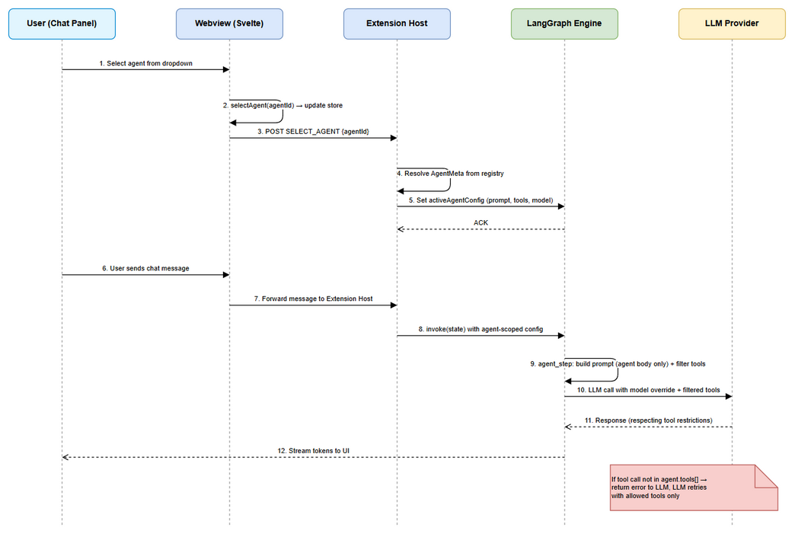
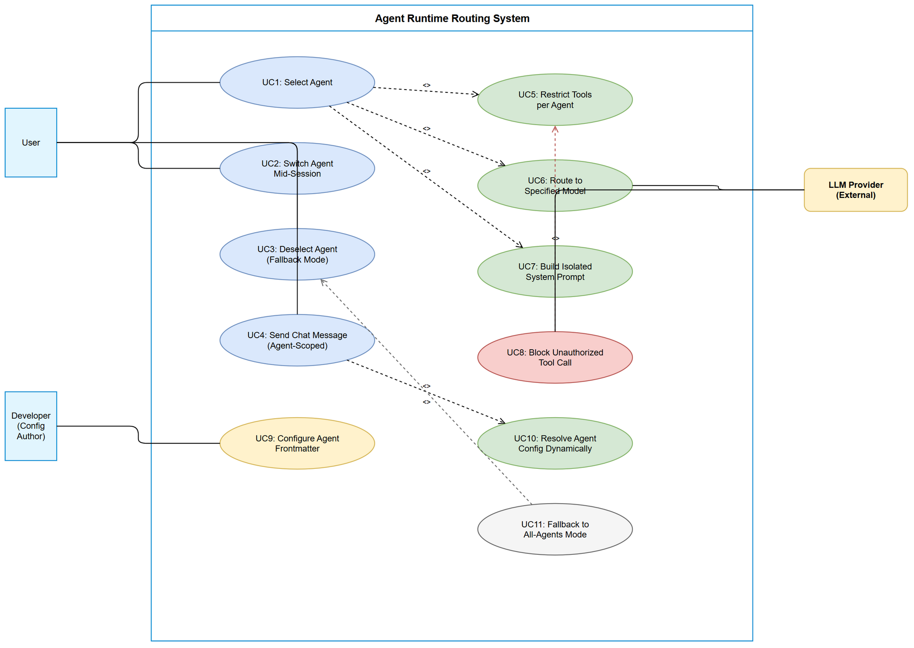

# Business Requirements Document (BRD)

## SDLC-Agents-4-Enterprise — SA4E-186: Agent Runtime Routing — Frontmatter (tools, model), per-agent prompt switching

---

## Document Information

| Field | Value |
|-------|-------|
| Jira Ticket | SA4E-186 |
| Title | Agent Runtime Routing — Frontmatter (tools, model), per-agent prompt switching |
| Author | BA Agent |
| Version | 1.0 |
| Date | 2025-01-27 |
| Status | Draft |

---

## Author Tracking

| Role | Name - Position | Responsibility |
|------|-----------------|----------------|
| Author | BA Agent – Business Analyst | Create document |
| Peer Reviewer | TA Agent – Technical Architect | Review document |

---

## Revision History

| Version | Date | Author | Changes |
|---------|------|--------|---------|
| 1.0 | 2025-01-27 | BA Agent | Initiate document — auto-generated from Jira ticket SA4E-186 |

---

## Sign-Off

| Name | Signature and date |
|------|--------------------|
| | ☐ I agree and confirm all criteria on this BRD as expected requirements |
| | ☐ I agree and confirm all criteria on this BRD as expected requirements |

---

## 1. Introduction

### 1.1 Scope

This change request transforms the agent frontmatter fields (`tools`, `model`, `phase`, `outputDoc`) from passive UI metadata into active runtime controls that govern LLM behavior. Currently, selecting an agent in the UI only updates visual state in the Svelte webview — the LLM system prompt and tool availability remain unchanged (all agents concatenated). This ticket implements three core capabilities:

1. **Tool Restriction** — Frontmatter `tools` field restricts which MCP tools an agent can invoke at runtime.
2. **Model Routing** — Frontmatter `model` field routes LLM calls to a specific model/provider.
3. **Prompt Isolation** — Selecting an agent rebuilds the system prompt with ONLY that agent's body, replacing the current all-agents-concatenated approach.

### 1.2 Out of Scope

- Agent creation/deletion workflow (already implemented in SA4E-85)
- Frontmatter schema validation UI (may be a separate ticket)
- Multi-agent orchestration within a single chat turn (pipeline/SDLC graph handles this separately)
- Changes to the SDLC pipeline agent routing (docs-graph, sdlc-graph) — this ticket targets interactive chat only
- Persistent agent selection across VS Code sessions (session-scoped only)

### 1.3 Preliminary Requirement

- SA4E-85 (KiroAgentRegistry, agent discovery, frontmatter parsing) — COMPLETED
- LlmProvider interface supporting `model` override via `LlmOptions.model` — ALREADY EXISTS
- Webview agent store with `selectAgent()` — ALREADY EXISTS
- MCP Bridge and ToolRegistry for tool discovery — ALREADY EXISTS

---

## 2. Business Requirements

### 2.1 High Level Process Map

The system follows a reactive pattern: when a user selects an agent in the chat panel UI, a message propagates from Webview → Extension Host → LangGraph engine, triggering a rebuild of the system prompt and reconfiguration of tool/model routing for subsequent LLM calls.



### 2.2 List of User Stories / Use Cases

| # | Story / Use Case | Priority | Source Ticket |
|---|------------------|----------|---------------|
| 1 | As a developer, I want the `tools` field in agent frontmatter to restrict which tools the agent can call, so that agents have focused capabilities. | MUST HAVE | SA4E-186 (R1) |
| 2 | As a developer, I want the `model` field in agent frontmatter to route LLM calls to a specific model, so that I can assign powerful models to complex agents and cheaper models to simple ones. | MUST HAVE | SA4E-186 (R1) |
| 3 | As a user, I want selecting an agent in the UI to switch the system prompt to ONLY that agent's instructions, so that the LLM receives focused context instead of all agents concatenated. | MUST HAVE | SA4E-186 (R2) |
| 4 | As a developer, I want `KiroAgentRegistry.selectAgent()` to trigger an actual LLM behavior change (prompt + tools + model), so that agent selection is not just cosmetic. | MUST HAVE | SA4E-186 (R3) |
| 5 | As a user, I want to switch agents mid-session and have the system prompt rebuilt immediately, so that I can leverage different agents within the same conversation. | MUST HAVE | SA4E-186 (R3) |
| 6 | As a user, I want a fallback to the current behavior (all agents concatenated) when no specific agent is selected, so that the default experience remains intact. | MUST HAVE | SA4E-186 |



---

### 2.3 Details of User Stories

---

#### Business Flow

**Step 1:** User opens Chat Panel and sees available agents in the agent selector dropdown.

**Step 2:** User selects a specific agent (e.g., "code-reviewer") from the dropdown.

**Step 3:** Webview dispatches `SELECT_AGENT` message with `agentId` to Extension Host.

**Step 4:** Extension Host receives message, resolves agent metadata from KiroAgentRegistry.

**Step 5:** Extension Host signals LangGraph engine to rebuild system prompt using ONLY the selected agent's body (markdown content after frontmatter).

**Step 6:** Extension Host configures tool filter based on agent's `tools[]` field — only listed tools are callable.

**Step 7:** Extension Host sets model override from agent's `model` field — subsequent LLM calls route to specified model.

**Step 8:** User sends a chat message. LangGraph uses the isolated agent prompt, filtered tools, and routed model.

**Step 9:** If user selects a different agent mid-session, Steps 3-7 repeat — system prompt, tools, and model are rebuilt for subsequent messages (conversation history preserved).

> **Note:** If no agent is selected (null state), the system falls back to current behavior: all agent instructions concatenated into system prompt, all tools available, default model used.

---

#### STORY 1: Tool Restriction via Frontmatter

> As a developer, I want the `tools` field in agent frontmatter to restrict which tools the agent can call, so that agents have focused capabilities.

**Requirement Details:**

1. The `tools` field in agent frontmatter is a YAML array of tool name patterns (strings).
2. When an agent with a `tools` field is active, ONLY tools matching the listed names are available to the LLM.
3. Tool filtering applies at the `execute_tools` node — tool calls not in the allowed list are blocked with an error message returned to the LLM.
4. Tool names support exact match (e.g., `mem_search`) and prefix match with wildcard (e.g., `code_*` matches `code_search`, `code_symbols`, etc.).
5. If `tools` field is empty array `[]`, NO tools are available (text-only mode).
6. If `tools` field is absent (undefined), ALL available tools are passed through (no restriction).

**Data Fields:**

| Field | Type | Required | Description | Example |
|-------|------|----------|-------------|---------|
| tools | string[] | No | List of allowed tool names/patterns | `['mem_search', 'code_*', 'grep_search']` |

**Acceptance Criteria:**

1. Given an agent with `tools: ['mem_search', 'code_search']`, when the LLM requests a tool call to `grep_search`, then the call is blocked and an error message is returned to the LLM.
2. Given an agent with `tools: ['code_*']`, when the LLM requests `code_search`, then the call is executed successfully.
3. Given an agent with `tools: []`, when the LLM requests any tool call, then all calls are blocked.
4. Given an agent with no `tools` field, all tools remain available.
5. Blocked tool calls return a clear message: `"Tool '{name}' is not available for agent '{agentId}'. Allowed tools: [...]"`.

**Validation Rules:**

- Tool names must be non-empty strings
- Wildcard `*` only supported as suffix (prefix match): `code_*` is valid, `*_search` is NOT valid
- Duplicate entries are ignored (deduplicated at parse time)

**Error Handling:**

- Invalid tool pattern in frontmatter: Log warning, treat as exact-match string
- Tool call blocked: Return structured error to LLM (not crash), LLM can retry with allowed tool

---

#### STORY 2: Model Routing via Frontmatter

> As a developer, I want the `model` field in agent frontmatter to route LLM calls to a specific model, so that I can assign powerful models to complex agents and cheaper models to simple ones.

**Requirement Details:**

1. The `model` field in agent frontmatter specifies the LLM model identifier to use.
2. When an agent with a `model` field is active, all LLM calls pass this model via `LlmOptions.model`.
3. The model string is passed verbatim to the provider — no validation at the extension layer (provider handles invalid model errors).
4. If `model` field is absent, the system uses the user's configured default model (from VS Code settings `kiroSdlc.llmModel`).
5. Model routing applies to both `chat()` and `chatWithTools()` calls.

**Data Fields:**

| Field | Type | Required | Description | Example |
|-------|------|----------|-------------|---------|
| model | string | No | LLM model identifier | `claude-sonnet-4-20250514`, `gpt-4o`, `llama3:70b` |

**Acceptance Criteria:**

1. Given an agent with `model: claude-sonnet-4-20250514`, when a chat message is sent, then the LLM call uses `claude-sonnet-4-20250514` regardless of the global setting.
2. Given an agent with no `model` field, the system uses the user's configured default model.
3. Given a model that the provider doesn't support, the provider returns its standard error (no crash at extension layer).
4. Model switch occurs immediately when agent is selected (not on next message).

**Error Handling:**

- Provider rejects model: Error surfaces to user via stream error event (existing error handling)
- Model field empty string: Treated as absent (use default)

---

#### STORY 3: Per-Agent Prompt Isolation

> As a user, I want selecting an agent in the UI to switch the system prompt to ONLY that agent's instructions, so that the LLM receives focused context instead of all agents concatenated.

**Requirement Details:**

1. When an agent is selected, `buildChatSubgraph` (or its prompt-building logic) uses ONLY the selected agent's markdown body as agent instructions — NOT all agents concatenated.
2. The agent's markdown body = file content AFTER frontmatter (everything below the closing `---`).
3. Steering files (`.code-intel/steering/*.md` with `inclusion: always`) are STILL included regardless of agent selection.
4. The system prompt structure becomes: `AGENT_SYSTEM_PROMPT` + steering rules + selected agent body.
5. Conversation history (messages) is preserved when switching agents — only the system prompt changes.
6. The prompt rebuild happens synchronously before the next LLM call (no race conditions).

**Acceptance Criteria:**

1. Given agent "code-reviewer" is selected, the system prompt contains ONLY the code-reviewer's instructions (not ba-agent, sm-agent, etc.).
2. Given no agent is selected (fallback mode), the system prompt contains all agents concatenated (current behavior preserved).
3. Given agent switch mid-session, the next LLM call uses the new agent's prompt while previous messages remain in context.
4. Steering files with `inclusion: always` are present in the system prompt regardless of agent selection.
5. System prompt token count decreases when a single agent is selected vs. all-agents mode.

**Validation Rules:**

- Agent body must be non-empty after frontmatter stripping (empty body → log warning, use empty string)
- Agent file must exist on disk at call time (deleted file → fallback to all-agents mode)

---

#### STORY 4: KiroAgentRegistry.selectAgent() Triggers Runtime Change

> As a developer, I want `KiroAgentRegistry.selectAgent()` to trigger an actual LLM behavior change, so that agent selection is not just cosmetic.

**Requirement Details:**

1. Currently `selectAgent()` only updates Svelte store state. It must also emit a message/event to the Extension Host.
2. The Extension Host must propagate the agent selection to the LangGraph engine's configuration.
3. The chat-graph must read the active agent configuration at each `agent_step` node invocation (not just at graph build time).
4. Agent configuration (prompt, tools, model) must be resolvable per-turn, not baked into the graph at construction.

**Acceptance Criteria:**

1. Calling `selectAgent("code-reviewer")` in the webview results in subsequent LLM calls using code-reviewer's prompt, tools, and model.
2. The Extension Host receives and processes the agent selection within 100ms.
3. No graph rebuild is needed — agent configuration is resolved dynamically at each agent step.
4. Multiple rapid agent switches (user clicks quickly) result in the final selection being used (last-write-wins, debounced).

---

#### STORY 5: Mid-Session Agent Switch

> As a user, I want to switch agents mid-session and have the system prompt rebuilt immediately, so that I can leverage different agents within the same conversation.

**Requirement Details:**

1. Agent switch does NOT clear conversation history — previous messages remain for context continuity.
2. Agent switch IS reflected in the next LLM call's system prompt, tool availability, and model.
3. If a tool call is in progress when agent switches, the in-flight call completes with the OLD agent's permissions (no mid-call revocation).
4. The UI must provide visual feedback that the agent has switched (already handled by agentStore reactive state).

**Acceptance Criteria:**

1. Given 5 messages exchanged with "ba-agent", when user switches to "dev-agent", the 6th message uses dev-agent's prompt but sees the prior 5 messages as context.
2. Given an in-flight tool call when agent switches, the call completes without interruption.
3. Given rapid switches (A → B → C within 500ms), only agent C's configuration is used for the next call.

---

#### STORY 6: Fallback to Default Behavior

> As a user, I want a fallback to the current behavior (all agents concatenated) when no specific agent is selected.

**Requirement Details:**

1. When `selectedAgentId` is null (no agent selected), the system uses the existing `loadAgentInstructions()` logic (concatenate all `.md` files from agents directory, budget 6000 chars).
2. When `selectedAgentId` is null, no tool restriction is applied — all discovered tools are available.
3. When `selectedAgentId` is null, the default model from VS Code settings is used.
4. This is the startup state and the state after "deselecting" an agent.

**Acceptance Criteria:**

1. On fresh session start (no agent selected), behavior is identical to current implementation.
2. User can "deselect" an agent to return to all-agents mode.
3. No regression in existing chat functionality when this feature is deployed.

---

## 3. Dependencies

| Dependency | Type | Related Ticket | Description |
|------------|------|----------------|-------------|
| KiroAgentRegistry | System | SA4E-85 | Agent discovery and frontmatter parsing (COMPLETED) |
| LlmProvider interface | System | KSA-210 | Unified LLM interface with `model` override support in LlmOptions |
| Webview Agent Store | System | SA4E-85 | Svelte store with selectAgent() and agent state management |
| MCP Bridge + ToolRegistry | System | Existing | Tool discovery and execution infrastructure |
| chat-graph.ts | System | Existing | LangGraph chat subgraph — primary modification target |
| agentParser.ts | System | SA4E-85 | Frontmatter parser — needs `model` field addition |

---

## 4. Stakeholders

| Role | Name / Team | Responsibility | Source |
|------|-------------|----------------|--------|
| Developer | Extension Team | Implement runtime routing | Ticket assignee |
| Architect | SA Agent | Validate architecture alignment | Design review |
| QA | QA Agent | Verify acceptance criteria | Test execution |

---

## 5. Risks and Assumptions

### 5.1 Risks

| Risk | Impact | Likelihood | Mitigation |
|------|--------|------------|------------|
| Agent prompt too large for smaller models | High | Medium | model field allows routing to large-context models; add token budget warning in agent discovery |
| Tool restriction blocks essential tools (e.g., user forgot to list required tool) | Medium | Medium | Clear error message returned to LLM with allowed list; LLM can inform user |
| Model routing to unavailable model (API key missing for that provider) | Medium | Low | Provider returns standard auth error; UI shows error via existing stream error handling |
| Race condition: agent switch while tool execution in progress | Medium | Low | Design: in-flight calls complete with old config; new config applies only to next turn |
| Breaking change in system prompt structure affects existing users | High | Low | Fallback mode (no agent selected) preserves exact current behavior |

### 5.2 Assumptions

- The LlmProvider implementations (Anthropic, OpenAI, Ollama) all support the `model` field in `LlmOptions` for per-call model override.
- Agent frontmatter YAML is the single source of truth for tool/model configuration (no UI editor for these fields in this ticket).
- The 6000-char budget for concatenated agents is sufficient for fallback mode (no change needed).
- Users understand that switching agents mid-session changes LLM behavior but preserves history.
- Tool names in frontmatter match the `name` field from MCP tool discovery exactly (case-sensitive).

---

## 6. Non-Functional Requirements

| Category | Requirement | Details |
|----------|-------------|---------|
| Performance | Agent switch latency < 100ms | Prompt rebuild and config change must not add perceptible delay |
| Performance | No impact on LLM call latency | Tool filtering is O(n) where n = tool count (typically < 50) |
| Performance | Startup impact: 0ms additional | Fallback mode uses existing code path |
| Reliability | Graceful degradation on missing agent file | Falls back to all-agents mode with warning log |
| Security | Tool restriction is enforceable | Blocked tools cannot be bypassed via prompt injection |
| Compatibility | Backward compatible | Existing agent files without `model`/`tools` work exactly as before |
| Maintainability | Single source of truth | Agent config in `.md` frontmatter — no duplicate config elsewhere |

---

## 7. Related Tickets

| Ticket Key | Summary | Status | Type | Relationship |
|------------|---------|--------|------|--------------|
| SA4E-186 | Agent Runtime Routing — Frontmatter (tools, model), per-agent prompt switching | In Progress | Story | Main ticket |
| SA4E-85 | KiroAgentRegistry — Agent discovery and hot-reload | Done | Story | Dependency (provides registry, parser, store) |
| KSA-210 | LLM Provider Abstraction | Done | Story | Dependency (provides LlmOptions.model) |

---

## 8. Appendix

### Frontmatter Schema (Extended)

```yaml
---
id: code-reviewer
name: Code Reviewer
description: Reviews code for quality and best practices
tools:
  - code_search
  - code_symbols
  - grep_search
  - read_file
model: claude-sonnet-4-20250514
phase: review
outputDoc: CODE-REVIEW.md
mcpServers:
  - code-intelligence
autoApprove:
  - read_file
---
```

### Tool Matching Algorithm

```
function isToolAllowed(toolName: string, allowedPatterns: string[]): boolean {
  if (allowedPatterns === undefined) return true;  // no restriction
  if (allowedPatterns.length === 0) return false;  // explicit empty = no tools
  return allowedPatterns.some(pattern => {
    if (pattern.endsWith('*')) {
      return toolName.startsWith(pattern.slice(0, -1));
    }
    return toolName === pattern;
  });
}
```

### System Prompt Assembly (Per-Agent Mode)

```
[AGENT_SYSTEM_PROMPT base]
[Steering rules (inclusion: always)]
[Selected agent body (markdown after ---)]
```

### System Prompt Assembly (Fallback Mode — No Agent Selected)

```
[AGENT_SYSTEM_PROMPT base]
[Steering rules (inclusion: always)]
[All agents concatenated (budget: 6000 chars)]
```

### Glossary

| Term | Definition |
|------|------------|
| Agent Frontmatter | YAML metadata block at the top of an agent `.md` file, enclosed by `---` delimiters |
| Tool Restriction | Runtime enforcement that only allows an agent to invoke tools listed in its `tools` field |
| Model Routing | Directing LLM API calls to a specific model identified by the agent's `model` field |
| Prompt Isolation | Building the system prompt with only the selected agent's body instead of all agents concatenated |
| Fallback Mode | Default behavior when no agent is selected — all agents concatenated, all tools available, default model |

### Diagram Index

| # | Diagram | Image | Source (editable) |
|---|---------|-------|-------------------|
| 1 | Business Flow | [business-flow.png](diagrams/business-flow.png) | [business-flow.drawio](diagrams/business-flow.drawio) |
| 2 | Use Case | [use-case.png](diagrams/use-case.png) | [use-case.drawio](diagrams/use-case.drawio) |

### Reference Documents

| Document | Link / Location |
|----------|-----------------|
| AgentMeta interface | extension/src/chat/types/messages.ts |
| AgentConfig interface | extension/src/langgraph/agents/registry.ts |
| LlmProvider interface | extension/src/langgraph/core/llm-provider.ts |
| chat-graph.ts | extension/src/langgraph/subgraphs/chat-graph.ts |
| agentParser.ts | extension/src/chat/registry/agentParser.ts |
| agentStore.ts | extension/src/webview/stores/agentStore.ts |
