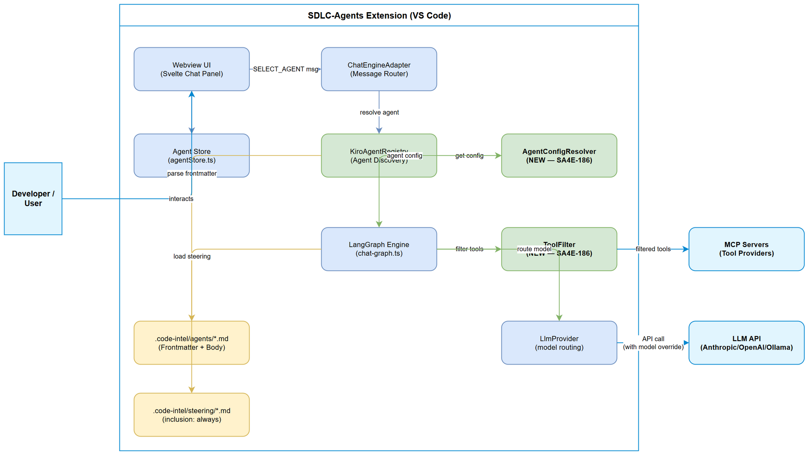
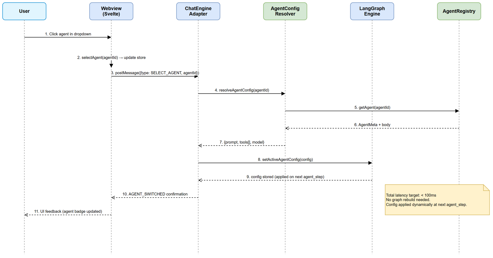
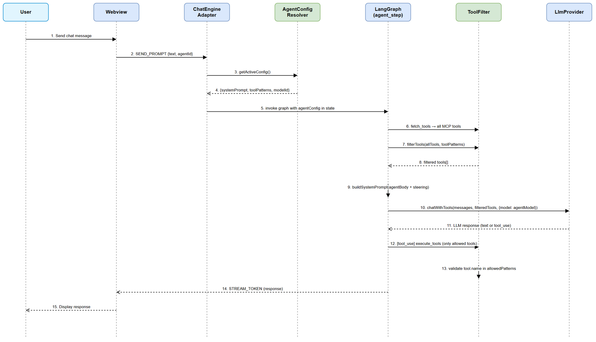
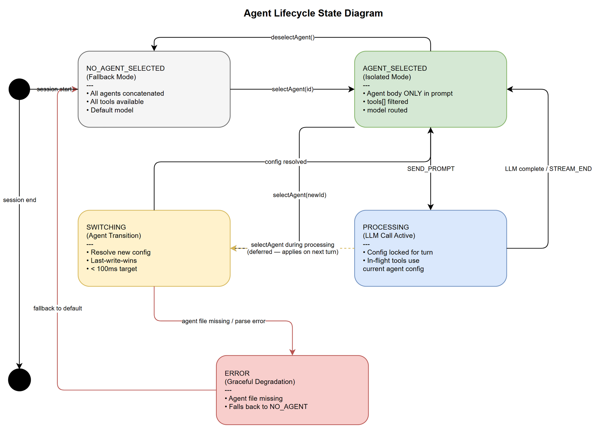

# Functional Specification Document (FSD)

## SDLC-Agents-4-Enterprise — SA4E-186: Agent Runtime Routing — Frontmatter (tools, model), per-agent prompt switching

---

## Document Information

| Field | Value |
|-------|-------|
| Jira Ticket | SA4E-186 |
| Title | Agent Runtime Routing — Frontmatter (tools, model), per-agent prompt switching |
| Author | BA Agent |
| Version | 1.0 |
| Date | 2025-01-27 |
| Status | Draft |
| Related BRD | documents/SA4E-186/BRD.md |

---

## Revision History

| Version | Date | Author | Changes |
|---------|------|--------|---------|
| 1.0 | 2025-01-27 | BA Agent | Initiate document — auto-generated from BRD SA4E-186 |

---

## 1. Introduction

### 1.1 Purpose

This FSD specifies the functional behavior of the Agent Runtime Routing feature. It transforms agent frontmatter fields (`tools`, `model`) from passive UI metadata into active runtime controls, and implements per-agent prompt isolation when an agent is selected in the chat panel.

### 1.2 Scope

- Tool restriction enforcement at `execute_tools` node based on agent's `tools[]` frontmatter
- Model routing via `LlmOptions.model` override based on agent's `model` frontmatter
- Per-agent system prompt isolation (single agent body replaces concatenated agents)
- Dynamic agent configuration resolution at each `agent_step` invocation (no graph rebuild)
- Webview → Extension Host agent selection message protocol
- Fallback to current behavior when no agent is selected

### 1.3 Definitions & Acronyms

| Term | Definition |
|------|------------|
| Agent Frontmatter | YAML metadata block at the top of an agent `.md` file, enclosed by `---` |
| Tool Restriction | Runtime enforcement allowing only tools matching agent's `tools[]` patterns |
| Model Routing | Directing LLM API calls to a model specified by agent's `model` field |
| Prompt Isolation | System prompt built with only the selected agent's body (not all concatenated) |
| Fallback Mode | Default state — no agent selected, all agents concatenated, all tools available |
| AgentConfigResolver | New component that resolves runtime config (prompt, tools, model) from agent metadata |
| ToolFilter | New component that filters tool list based on allowed patterns |

### 1.4 References

| Document | Location |
|----------|----------|
| BRD | documents/SA4E-186/BRD.md |
| AgentMeta interface | extension/src/chat/types/messages.ts |
| LlmProvider interface | extension/src/langgraph/core/llm-provider.ts |
| chat-graph.ts | extension/src/langgraph/subgraphs/chat-graph.ts |
| agentStore.ts | extension/src/webview/stores/agentStore.ts |
| ChatEngineAdapter | extension/src/chat/engine/ChatEngineAdapter.ts |

---

## 2. System Overview

### 2.1 System Context Diagram



The system operates within the VS Code Extension Host process. The developer interacts with the Webview (Svelte Chat Panel), which communicates via `postMessage` to the Extension Host. The new **AgentConfigResolver** component bridges between `KiroAgentRegistry` (agent discovery) and the LangGraph engine, providing per-turn agent configuration. The **ToolFilter** applies tool restrictions before passing tools to the LLM. The LlmProvider routes to the appropriate model API.

### 2.2 System Architecture

**Key Components:**

| Component | Role | Status |
|-----------|------|--------|
| Webview Agent Store | Manages selected agent state (UI) | Existing (SA4E-85) |
| ChatEngineAdapter | Routes webview messages to LangGraph engine | Existing — needs SELECT_AGENT handler |
| KiroAgentRegistry | Discovers and parses agent `.md` files | Existing (SA4E-85) |
| AgentConfigResolver | Resolves runtime config (prompt, tools, model) from selected agent | **NEW** |
| ToolFilter | Filters tool list based on allowed patterns | **NEW** |
| chat-graph.ts / buildChatSubgraph | Builds LangGraph chat graph | Existing — modify `buildFinalSystemPrompt` |
| chat-graph-nodes.ts / createAgentStepNode | Executes agent LLM call | Existing — modify to read dynamic config |
| LlmProvider | Sends LLM requests with model override | Existing — already supports `LlmOptions.model` |

---

## 3. Functional Requirements

### 3.1 Feature: Agent Selection Message Protocol

**Source:** BRD Story 4, Story 5

#### 3.1.1 Description

When a user selects an agent in the Webview dropdown, a `SELECT_AGENT` message is dispatched to the Extension Host. The ChatEngineAdapter handles this message by resolving the agent's runtime configuration and storing it for use by subsequent LangGraph invocations.

#### 3.1.2 Use Case

**Use Case ID:** UC-01
**Actor:** Developer
**Preconditions:** Chat panel is open, agents are loaded and displayed in dropdown
**Postconditions:** Agent config is stored and active for next LLM call

**Main Flow:**

| Step | Actor | System | Description |
|------|-------|--------|-------------|
| 1 | Clicks agent in dropdown | | User selects target agent |
| 2 | | Webview updates agentStore | `selectAgent(agentId)` updates reactive state |
| 3 | | Webview sends SELECT_AGENT | `postMessage({type: 'SELECT_AGENT', agentId})` |
| 4 | | ChatEngineAdapter receives | Dispatched via MessageRouter |
| 5 | | AgentConfigResolver resolves | Reads agent file, extracts body + frontmatter |
| 6 | | Config stored in engine | Active config set for next `agent_step` |
| 7 | | Confirmation sent to Webview | `AGENT_SWITCHED` message with agentId |

**Alternative Flows:**

| ID | Condition | Steps |
|----|-----------|-------|
| AF-01 | Agent deselected (null) | Config cleared → fallback mode (all agents concatenated) |
| AF-02 | Rapid switches (A→B→C < 500ms) | Debounce: only final selection (C) resolves |

**Exception Flows:**

| ID | Condition | Steps |
|----|-----------|-------|
| EF-01 | Agent file not found on disk | Log warning → fallback to all-agents mode → notify webview |
| EF-02 | Agent body empty after frontmatter | Log warning → use empty string as prompt → proceed |

#### 3.1.3 Business Rules

| Rule ID | Rule | Source |
|---------|------|--------|
| BR-01 | SELECT_AGENT must resolve within 100ms | BRD §6 NFR |
| BR-02 | Last-write-wins for rapid selections | BRD Story 5 |
| BR-03 | Agent switch does NOT clear conversation history | BRD Story 5 |
| BR-04 | In-flight tool calls complete with old agent's config | BRD Story 5 |

#### 3.1.4 Data Specifications

**Input Data (SELECT_AGENT message):**

| Field | Type | Required | Validation | Description |
|-------|------|----------|------------|-------------|
| type | `'SELECT_AGENT'` | Y | Literal | Message discriminant |
| agentId | string \| null | Y | Non-empty or null | Target agent ID, null = deselect |

**Output Data (AGENT_SWITCHED message):**

| Field | Type | Description |
|-------|------|-------------|
| type | `'AGENT_SWITCHED'` | Confirmation message type |
| agentId | string \| null | Active agent ID (null = fallback) |
| agentName | string | Display name for UI feedback |

#### 3.1.5 Sequence Diagram — Agent Selection



---

### 3.2 Feature: Tool Restriction via Frontmatter

**Source:** BRD Story 1

#### 3.2.1 Description

The `tools` field in agent frontmatter defines a whitelist of tool name patterns. When an agent is active, only tools matching these patterns are passed to the LLM. Tool restriction is enforced at two points:
1. **Filter point** — Before passing tools to `chatWithTools()` in `agent_step` node
2. **Enforcement point** — At `execute_tools` node, validate each tool call against allowed list

#### 3.2.2 Use Case

**Use Case ID:** UC-02
**Actor:** LLM (via agent_step)
**Preconditions:** Agent with `tools` field is active, tools fetched from MCP
**Postconditions:** LLM only sees/invokes allowed tools

**Main Flow:**

| Step | Actor | System | Description |
|------|-------|--------|-------------|
| 1 | | fetch_tools node | All MCP tools discovered |
| 2 | | ToolFilter.filter() | Apply agent's `tools[]` patterns against full list |
| 3 | | agent_step | LLM receives only filtered tools in schema |
| 4 | LLM requests tool call | | LLM may request a tool |
| 5 | | execute_tools | Validate tool name against allowed patterns |
| 6 | | Tool executed | If allowed, execute normally |

**Alternative Flows:**

| ID | Condition | Steps |
|----|-----------|-------|
| AF-01 | `tools` field undefined | No filtering — all tools passed through |
| AF-02 | `tools` field is `[]` (empty) | No tools passed to LLM (text-only mode) |

**Exception Flows:**

| ID | Condition | Steps |
|----|-----------|-------|
| EF-01 | LLM requests tool not in allowed list | Return error message to LLM: "Tool '{name}' is not available for agent '{agentId}'. Allowed: [...]" |
| EF-02 | Invalid pattern in frontmatter (e.g., `*_search`) | Log warning, treat as exact-match string |

#### 3.2.3 Business Rules

| Rule ID | Rule | Source |
|---------|------|--------|
| BR-05 | Exact match: `toolName === pattern` | BRD Story 1 |
| BR-06 | Prefix wildcard: `pattern.endsWith('*')` → `toolName.startsWith(pattern.slice(0,-1))` | BRD Story 1 |
| BR-07 | Only suffix wildcard supported (`code_*` valid, `*_search` invalid) | BRD Story 1 |
| BR-08 | `tools: undefined` → all tools available (no restriction) | BRD Story 1 |
| BR-09 | `tools: []` → no tools available (text-only) | BRD Story 1 |
| BR-10 | Duplicate patterns deduplicated at parse time | BRD Story 1 |
| BR-11 | Tool names case-sensitive | BRD §5.2 Assumptions |

#### 3.2.4 Data Specifications

**Input: Tool Patterns (from frontmatter)**

| Field | Type | Required | Validation | Description |
|-------|------|----------|------------|-------------|
| tools | string[] \| undefined | No | Each element non-empty, wildcard only as suffix | Allowed tool name patterns |

**Processing: Tool Matching Algorithm**

```
isToolAllowed(toolName: string, patterns: string[] | undefined): boolean
  - patterns === undefined → return true (no restriction)
  - patterns.length === 0 → return false (text-only)
  - For each pattern:
    - If pattern ends with '*': return toolName.startsWith(pattern.slice(0, -1))
    - Else: return toolName === pattern
```

**Output: Filtered Tools**

| Field | Type | Description |
|-------|------|-------------|
| filteredTools | McpToolDefinition[] | Subset of all tools matching allowed patterns |

**Error Output (blocked tool call):**

| Field | Type | Description |
|-------|------|-------------|
| toolCallId | string | Original tool call ID |
| content | string | Error message: `"Tool '{name}' is not available for agent '{agentId}'. Allowed tools: [...]"` |

---

### 3.3 Feature: Model Routing via Frontmatter

**Source:** BRD Story 2

#### 3.3.1 Description

The `model` field in agent frontmatter specifies the LLM model identifier. When an agent with a `model` field is active, all LLM calls pass this model via `LlmOptions.model`, overriding the user's default setting.

#### 3.3.2 Use Case

**Use Case ID:** UC-03
**Actor:** System (LangGraph engine)
**Preconditions:** Agent with `model` field is active
**Postconditions:** LLM API call uses the specified model

**Main Flow:**

| Step | Actor | System | Description |
|------|-------|--------|-------------|
| 1 | | AgentConfigResolver | Extracts `model` from active agent frontmatter |
| 2 | | agent_step node | Reads `model` from active config |
| 3 | | LlmProvider.chatWithTools() | Called with `{ model: agentModel }` in options |
| 4 | | Provider implementation | Uses `options.model` to override default model |

**Alternative Flows:**

| ID | Condition | Steps |
|----|-----------|-------|
| AF-01 | `model` field absent or empty string | Use default model from VS Code settings |
| AF-02 | No agent selected (fallback) | Use default model |

**Exception Flows:**

| ID | Condition | Steps |
|----|-----------|-------|
| EF-01 | Provider doesn't support specified model | Provider returns standard error → surfaced via STREAM_ERROR |
| EF-02 | API key missing for target provider | Provider auth error → existing error handling |

#### 3.3.3 Business Rules

| Rule ID | Rule | Source |
|---------|------|--------|
| BR-12 | Model string passed verbatim to provider (no validation at extension layer) | BRD Story 2 |
| BR-13 | Empty string model treated as absent (use default) | BRD Story 2 |
| BR-14 | Model routing applies to both `chat()` and `chatWithTools()` | BRD Story 2 |
| BR-15 | Model switch occurs immediately when agent selected | BRD Story 2 |

#### 3.3.4 Data Specifications

**Input:**

| Field | Type | Required | Validation | Description |
|-------|------|----------|------------|-------------|
| model | string \| undefined | No | If present, non-empty | LLM model identifier |

**Output (passed to LlmProvider):**

| Field | Type | Description |
|-------|------|-------------|
| LlmOptions.model | string \| undefined | Model override (undefined = use default) |

---

### 3.4 Feature: Per-Agent Prompt Isolation

**Source:** BRD Story 3

#### 3.4.1 Description

When an agent is selected, the system prompt is rebuilt using ONLY the selected agent's markdown body (content after frontmatter `---`), replacing the current `loadAgentInstructions()` behavior that concatenates all agent files.

#### 3.4.2 Use Case

**Use Case ID:** UC-04
**Actor:** System (buildFinalSystemPrompt)
**Preconditions:** Agent is selected, agent file readable
**Postconditions:** System prompt contains only selected agent's body + steering rules

**Main Flow:**

| Step | Actor | System | Description |
|------|-------|--------|-------------|
| 1 | | buildFinalSystemPrompt() called | At each agent_step invocation |
| 2 | | Check activeAgentConfig | Is an agent selected? |
| 3 | | Assemble: BASE + steering + agent body | Single agent body (not concatenated) |
| 4 | | Append kbContext if available | From RAG retrieval |
| 5 | | Return assembled prompt | Ready for LLM |

**Alternative Flows:**

| ID | Condition | Steps |
|----|-----------|-------|
| AF-01 | No agent selected (null) | Use `loadAgentInstructions()` — concatenate all agents (budget: 6000 chars) |

**Exception Flows:**

| ID | Condition | Steps |
|----|-----------|-------|
| EF-01 | Agent file deleted after selection | Log warning → fallback to all-agents mode |
| EF-02 | Agent body empty | Use empty string — steering rules still present |

#### 3.4.3 Business Rules

| Rule ID | Rule | Source |
|---------|------|--------|
| BR-16 | Agent body = file content after closing `---` (frontmatter stripped) | BRD Story 3 |
| BR-17 | Steering files (inclusion: always) included regardless of agent selection | BRD Story 3 |
| BR-18 | Prompt structure: `AGENT_SYSTEM_PROMPT` + steering + selected agent body | BRD Story 3 |
| BR-19 | Conversation history preserved on agent switch (only system prompt changes) | BRD Story 3 |
| BR-20 | Prompt rebuild synchronous before next LLM call | BRD Story 3 |

#### 3.4.4 System Prompt Assembly

**Per-Agent Mode (agent selected):**

```
[AGENT_SYSTEM_PROMPT base]            ← Fixed system instructions
[Steering rules (inclusion: always)]  ← Loaded at graph build time
[Selected agent body]                 ← Dynamic per active agent
[--- KB context if available ---]     ← From RAG retrieval
```

**Fallback Mode (no agent selected):**

```
[AGENT_SYSTEM_PROMPT base]
[Steering rules (inclusion: always)]
[All agents concatenated (budget: 6000 chars)]  ← Current behavior
[--- KB context if available ---]
```

---

### 3.5 Feature: Dynamic Agent Configuration in LangGraph

**Source:** BRD Story 4

#### 3.5.1 Description

The chat-graph must resolve agent configuration (prompt, tools, model) dynamically at each `agent_step` node invocation — NOT baked into the graph at construction time. This enables mid-session agent switching without graph rebuild.

#### 3.5.2 Use Case

**Use Case ID:** UC-05
**Actor:** System (LangGraph nodes)
**Preconditions:** Graph compiled and running, agent config stored externally
**Postconditions:** Each agent_step uses current agent config

**Main Flow:**

| Step | Actor | System | Description |
|------|-------|--------|-------------|
| 1 | | Engine receives SEND_PROMPT | Chat message arrives |
| 2 | | graph.invoke() | State includes `agentConfigId` reference |
| 3 | | fetch_tools node | Fetches all available tools |
| 4 | | agent_step node | Reads `activeAgentConfig` from resolver |
| 5 | | Apply tool filter | Filter tools by agent's patterns |
| 6 | | Build system prompt | Use agent body or fallback |
| 7 | | Call LLM with model override | Pass filtered tools + model option |

#### 3.5.3 Business Rules

| Rule ID | Rule | Source |
|---------|------|--------|
| BR-21 | No graph rebuild needed on agent switch | BRD Story 4 |
| BR-22 | Config resolved per-turn at agent_step invocation | BRD Story 4 |
| BR-23 | Extension Host processes selection within 100ms | BRD Story 4 |
| BR-24 | Multiple rapid switches → last-write-wins | BRD Story 4 |

#### 3.5.4 Sequence Diagram — Chat with Active Agent



---

### 3.6 Feature: Fallback to Default Behavior

**Source:** BRD Story 6

#### 3.6.1 Description

When no agent is selected (`selectedAgentId === null`), the system maintains exact current behavior: all agent instructions concatenated (budget 6000 chars), all tools available, default model used.

#### 3.6.2 Business Rules

| Rule ID | Rule | Source |
|---------|------|--------|
| BR-25 | `selectedAgentId === null` → `loadAgentInstructions()` used | BRD Story 6 |
| BR-26 | `selectedAgentId === null` → no tool restriction | BRD Story 6 |
| BR-27 | `selectedAgentId === null` → default model from settings | BRD Story 6 |
| BR-28 | Startup state = no agent selected | BRD Story 6 |
| BR-29 | User can deselect agent to return to fallback | BRD Story 6 |

---

## 4. Data Model

### 4.1 Logical Entities

#### Entity: ActiveAgentConfig

Runtime configuration resolved from selected agent. Stored in-memory (not persisted).

| Attribute | Type | Required | Business Rule | Description |
|-----------|------|----------|---------------|-------------|
| agentId | string | Y | — | Selected agent identifier |
| agentName | string | Y | — | Display name for UI |
| systemPromptBody | string | Y | BR-16 | Agent markdown body (after frontmatter) |
| toolPatterns | string[] \| undefined | N | BR-08, BR-09 | Tool name patterns for filtering |
| model | string \| undefined | N | BR-12, BR-13 | LLM model override |
| resolvedAt | number | Y | BR-23 | Timestamp of resolution (for debounce) |

#### Entity: AgentMeta (Extended)

Existing interface — needs `model` field addition.

| Attribute | Type | Required | Business Rule | Description |
|-----------|------|----------|---------------|-------------|
| id | string | Y | — | Unique agent identifier |
| name | string | Y | — | Display name |
| description | string | Y | — | Agent description |
| tools | string[] | N | BR-08 | Tool whitelist patterns |
| model | string | N | BR-12 | LLM model identifier (NEW) |
| mcpServers | string[] | N | — | Required MCP servers |
| autoApprove | string[] | N | — | Tools that skip approval |
| filePath | string | Y | — | Absolute path to agent .md file |

**Relationships:**

| From Entity | To Entity | Cardinality | Description |
|-------------|-----------|-------------|-------------|
| ActiveAgentConfig | AgentMeta | 1:1 | Config derived from selected agent metadata |
| AgentMeta | Agent .md File | 1:1 | Metadata parsed from frontmatter |

---

## 5. Integration Specifications

### 5.1 External System: LLM API Providers

| Attribute | Value |
|-----------|-------|
| Purpose | Execute language model inference with model routing |
| Direction | Outbound |
| Data Format | JSON (provider-specific) |
| Frequency | Real-time (per chat message) |

**Data Exchange:**

| Our Data | External Data | Direction | Business Rule |
|----------|--------------|-----------|---------------|
| LlmOptions.model | model parameter | Send | BR-12: Passed verbatim |
| messages[] | prompt + history | Send | BR-18: Isolated prompt |
| tools[] | tool schemas | Send | BR-08: Filtered list |
| response | text/tool_use | Receive | — |

### 5.2 External System: MCP Servers

| Attribute | Value |
|-----------|-------|
| Purpose | Provide tool definitions and execute tool calls |
| Direction | Bidirectional |
| Data Format | JSON-RPC (MCP protocol) |
| Frequency | Real-time (per graph invocation) |

**Data Exchange:**

| Our Data | External Data | Direction | Business Rule |
|----------|--------------|-----------|---------------|
| tools/list request | McpToolDefinition[] | Receive | All tools discovered |
| filtered tool calls | tool execution | Send | BR-05: Only allowed tools |
| blocked tool name | error message | — (internal) | EF-01 in §3.2 |

---

## 6. Processing Logic

### 6.1 Agent Selection Processing

**Trigger:** `SELECT_AGENT` message received from Webview
**Input:** `{ agentId: string | null }`
**Output:** `ActiveAgentConfig` stored, `AGENT_SWITCHED` sent to Webview

**Processing Steps:**

| Step | Description | Error Handling |
|------|-------------|----------------|
| 1 | Debounce: if another SELECT_AGENT arrives within 50ms, cancel this one | N/A (debounce) |
| 2 | If agentId is null → clear active config, set fallback mode | — |
| 3 | Lookup agent in KiroAgentRegistry by ID | If not found → EF-01 |
| 4 | Read agent .md file from disk | If file missing → EF-01 |
| 5 | Strip frontmatter, extract body | If empty → log warning |
| 6 | Build ActiveAgentConfig: { agentId, systemPromptBody, toolPatterns, model } | — |
| 7 | Store config in AgentConfigResolver (overwrites previous) | — |
| 8 | Send AGENT_SWITCHED confirmation to Webview | — |

### 6.2 Tool Filtering Processing

**Trigger:** `agent_step` node begins execution
**Input:** All discovered tools + agent's `toolPatterns`
**Output:** Filtered tool list

**Processing Steps:**

| Step | Description | Error Handling |
|------|-------------|----------------|
| 1 | Read `toolPatterns` from active agent config | If undefined → return all tools |
| 2 | If patterns is empty array → return empty array | — |
| 3 | For each tool: check `isToolAllowed(tool.name, patterns)` | — |
| 4 | Return filtered array | — |

### 6.3 Tool Call Enforcement

**Trigger:** `execute_tools` node processes a tool call from LLM
**Input:** Tool call (name, arguments) + active agent's `toolPatterns`
**Output:** Execute tool OR return error message

**Processing Steps:**

| Step | Description | Error Handling |
|------|-------------|----------------|
| 1 | Read tool call name from LLM response | — |
| 2 | Check `isToolAllowed(call.name, activePatterns)` | — |
| 3 | If allowed → proceed with normal execution | — |
| 4 | If blocked → return error content to LLM scratchpad | Error: "Tool '{name}' not available for agent '{agentId}'" |

### 6.4 System Prompt Assembly

**Trigger:** `buildFinalSystemPrompt(state)` called at each `agent_step`
**Input:** PipelineState (kbContext) + active agent config
**Output:** Complete system prompt string

**Processing Steps:**

| Step | Description | Error Handling |
|------|-------------|----------------|
| 1 | Start with AGENT_SYSTEM_PROMPT base | — |
| 2 | Inject steering rules (loaded at graph build time) | — |
| 3 | Check if active agent config exists | — |
| 4a | If agent active: append agent body under "# Agent Instructions" | — |
| 4b | If no agent: call loadAgentInstructions() (all concatenated, 6000 char budget) | — |
| 5 | If state.kbContext exists: append KB context | — |
| 6 | Return assembled prompt | — |

---

## 7. Security Requirements

### 7.1 Tool Restriction Enforcement

| Requirement | Details |
|-------------|---------|
| Enforcement is server-side | Tool filtering at Extension Host, NOT just LLM schema filtering |
| Double-check at execute_tools | Even if LLM hallucinates a blocked tool call, execution is denied |
| Prompt injection resistant | Tool restriction cannot be bypassed via system prompt manipulation |
| No escalation path | Agent cannot dynamically add tools not in its frontmatter |

### 7.2 Data Sensitivity

| Data Type | Classification | Business Requirement |
|-----------|---------------|---------------------|
| Agent frontmatter (tools, model) | Internal | Config data — no secrets, stored in git |
| LLM API keys | Confidential | Managed by VS Code settings / secrets API (unchanged) |
| Chat messages | Internal | Session-scoped, existing handling unchanged |

---

## 8. Non-Functional Requirements

| Category | Business Requirement | Acceptance Criteria |
|----------|---------------------|---------------------|
| Performance | Agent switch imperceptible to user | SELECT_AGENT → AGENT_SWITCHED < 100ms |
| Performance | No additional LLM call latency | Tool filtering O(n), n < 50, < 1ms |
| Performance | Startup time unchanged | Fallback mode uses existing code path |
| Reliability | Graceful degradation | Missing agent file → fallback mode (no crash) |
| Compatibility | Backward compatible | Existing agents without `model`/`tools` work unchanged |
| Maintainability | Single source of truth | Agent config lives ONLY in `.md` frontmatter |

---

## 9. Error Handling (User-Facing)

### 9.1 Error Scenarios

| Scenario | Severity | User Message | Expected Behavior |
|----------|----------|-------------|-------------------|
| Agent file deleted while selected | Warning | "Agent '{name}' no longer available. Switched to default mode." | Auto-fallback to all-agents |
| Model not supported by provider | Error | Provider error message (e.g., "Model not found") | Surfaced via STREAM_ERROR |
| All tools blocked (tools: []) | Info | LLM responds text-only (no error shown to user) | Normal text conversation |
| Tool call blocked by restriction | Info (internal) | Not shown to user — LLM retries with allowed tool | Error returned to LLM in scratchpad |

### 9.2 Notification Requirements

| Event | Who is Notified | Channel | Timing |
|-------|----------------|---------|--------|
| Agent switched successfully | User | In-app (agent badge update) | Immediate |
| Agent unavailable (fallback) | User | In-app (toast warning) | Immediate |
| Model error | User | In-app (stream error) | On LLM response |

---

## 10. Testing Considerations

### 10.1 Test Scenarios

| ID | Scenario | Input | Expected Output | Priority |
|----|----------|-------|-----------------|----------|
| TC-01 | Tool filtering — exact match | tools: ['mem_search'], call: mem_search | Tool executed | High |
| TC-02 | Tool filtering — prefix wildcard | tools: ['code_*'], call: code_search | Tool executed | High |
| TC-03 | Tool blocking — not in list | tools: ['mem_search'], call: grep_search | Error returned to LLM | High |
| TC-04 | Tool filtering — empty array | tools: [], call: any_tool | All blocked | High |
| TC-05 | Tool filtering — undefined | tools: undefined, call: any_tool | All tools available | High |
| TC-06 | Model routing — specified | model: 'claude-sonnet-4-20250514', send message | LLM called with model override | High |
| TC-07 | Model routing — absent | model: undefined | Default model used | High |
| TC-08 | Model routing — empty string | model: '' | Default model used (treated as absent) | Medium |
| TC-09 | Prompt isolation — agent selected | select 'code-reviewer' | Prompt contains only code-reviewer body | High |
| TC-10 | Prompt isolation — no agent | selectedAgentId: null | Prompt contains all agents concatenated | High |
| TC-11 | Prompt isolation — steering preserved | select any agent | Steering rules present in prompt | High |
| TC-12 | Mid-session switch | Switch A→B after 3 messages | Message 4 uses B's config, history preserved | High |
| TC-13 | Rapid switch debounce | Switch A→B→C within 500ms | Only C's config active | Medium |
| TC-14 | Agent file missing | Select agent, delete file, send message | Graceful fallback | Medium |
| TC-15 | Agent switch latency | Select agent, measure time | < 100ms | Medium |

---

## 11. State Diagram — Agent Lifecycle



**States:**

| State | Description |
|-------|-------------|
| NO_AGENT_SELECTED | Fallback mode — all agents concatenated, all tools, default model |
| AGENT_SELECTED | Isolated mode — single agent body, filtered tools, routed model |
| PROCESSING | LLM call in progress — config locked for this turn |
| SWITCHING | Transitional — resolving new agent config (< 100ms) |
| ERROR | Agent file missing or parse error — auto-fallback |

---

## 12. Appendix

### Diagram Index

| # | Diagram | Image | Source (editable) |
|---|---------|-------|-------------------|
| 1 | System Context | [system-context.png](diagrams/system-context.png) | [system-context.drawio](diagrams/system-context.drawio) |
| 2 | Sequence — Agent Selection | [sequence-agent-selection.png](diagrams/sequence-agent-selection.png) | [sequence-agent-selection.drawio](diagrams/sequence-agent-selection.drawio) |
| 3 | Sequence — Chat with Agent | [sequence-chat-with-agent.png](diagrams/sequence-chat-with-agent.png) | [sequence-chat-with-agent.drawio](diagrams/sequence-chat-with-agent.drawio) |
| 4 | State — Agent Lifecycle | [state-agent-lifecycle.png](diagrams/state-agent-lifecycle.png) | [state-agent-lifecycle.drawio](diagrams/state-agent-lifecycle.drawio) |

### Message Protocol Changes

**New WebviewMessageType additions:**

```typescript
// Webview → Extension Host
| 'SELECT_AGENT'  // { type: 'SELECT_AGENT', agentId: string | null }

// Extension Host → Webview
| 'AGENT_SWITCHED'  // { type: 'AGENT_SWITCHED', agentId: string | null, agentName: string }
```

### AgentMeta Interface Extension

```typescript
export interface AgentMeta {
  id: string;
  name: string;
  description: string;
  tools: string[];       // existing
  model?: string;        // NEW — LLM model identifier
  mcpServers: string[];
  autoApprove: string[];
  filePath: string;
}
```

### ActiveAgentConfig Interface (NEW)

```typescript
export interface ActiveAgentConfig {
  agentId: string;
  agentName: string;
  systemPromptBody: string;
  toolPatterns: string[] | undefined;
  model: string | undefined;
  resolvedAt: number;
}
```

### Change Log from BRD

| Item | BRD Requirement | FSD Clarification |
|------|-----------------|-------------------|
| Debounce | "Multiple rapid switches → last-write-wins" | Specified 50ms debounce window |
| Agent store auto-select | Not in BRD | Existing behavior: agentStore auto-selects first agent — FSD specifies this triggers runtime config |
| Tool enforcement dual-point | BRD says "at execute_tools" | FSD adds pre-filtering at agent_step (LLM only sees allowed tools) + enforcement at execute_tools (safety net) |
| AGENT_SWITCHED message | Not explicitly in BRD | Added for UI confirmation feedback |
