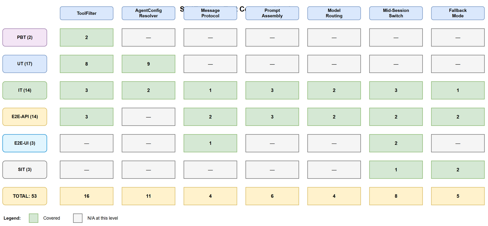
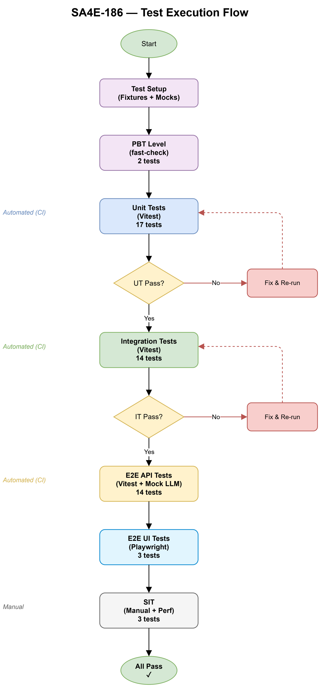

# System Test Plan (STP)

## SDLC-Agents-4-Enterprise — SA4E-186: Agent Runtime Routing — Frontmatter (tools, model), per-agent prompt switching

---

## Document Information

| Field | Value |
|-------|-------|
| Jira Ticket | SA4E-186 |
| Title | Agent Runtime Routing — Frontmatter (tools, model), per-agent prompt switching |
| Author | QA Agent |
| Version | 1.0 |
| Date | 2025-01-27 |
| Status | Draft |
| Related BRD | documents/SA4E-186/BRD.md |
| Related FSD | documents/SA4E-186/FSD.md |
| Related TDD | documents/SA4E-186/TDD.md |

---

## Revision History

| Version | Date | Author | Changes |
|---------|------|--------|---------|
| 1.0 | 2025-01-27 | QA Agent | Initial STP — test plan for agent runtime routing |

---

## 1. Introduction

### 1.1 Purpose

This document defines the system test plan for SA4E-186 (Agent Runtime Routing). It covers all testing levels, strategies, and environments required to validate that agent frontmatter fields (`tools`, `model`) actively control LLM behavior at runtime, and that per-agent prompt isolation works correctly.

### 1.2 Scope

**In Scope:**
- ToolFilter — pattern matching (exact, wildcard, empty, undefined)
- AgentConfigResolver — agent selection, deselection, missing file handling
- Message Protocol — SELECT_AGENT / AGENT_SWITCHED flow
- Dynamic Prompt Assembly — per-agent isolation vs fallback concatenation
- Model Routing — LlmOptions.model override
- Tool Enforcement — blocked tool calls at execute_tools node
- Mid-Session Switch — history preserved, config rebuilt
- Fallback Mode — no agent selected = current behavior

**Out of Scope:**
- Agent creation/deletion (SA4E-85)
- SDLC pipeline agent routing (docs-graph, sdlc-graph)
- LLM provider internal errors (tested at provider level)
- Multi-agent orchestration within a single turn

### 1.3 Test Levels

| Level | ID Prefix | Description | Automation |
|-------|-----------|-------------|------------|
| Property-Based Testing (PBT) | PBT-* | Fuzz ToolFilter with random inputs | Vitest + fast-check |
| Unit Testing (UT) | UT-* | Isolated tests for ToolFilter, AgentConfigResolver | Vitest |
| Integration Testing (IT) | IT-* | Component integration (resolver + graph nodes) | Vitest |
| E2E API Testing (E2E-API) | E2E-API-* | Full message flow (SELECT_AGENT → graph behavior) | Vitest + mock LLM |
| E2E UI Testing (E2E-UI) | E2E-UI-* | Webview interaction via Gherkin scenarios | Playwright |
| System Integration Testing (SIT) | SIT-* | Visual/UX validation in live VS Code | Manual |

---

## 2. Test Strategy

### 2.1 Approach

The feature is primarily internal (Extension Host logic) with minimal external dependencies. Testing focuses heavily on unit and integration levels due to:
- **ToolFilter** is pure functions — ideal for PBT and unit tests
- **AgentConfigResolver** has file I/O dependency — unit tests with mocked fs
- **Message protocol** flows through multiple components — integration tests verify wiring
- **LangGraph nodes** require mocked LlmProvider — integration level
- **Webview interaction** is Svelte + postMessage — E2E-UI for user flows

### 2.2 Risk-Based Prioritization

| Risk | Impact | Test Focus |
|------|--------|------------|
| Tool restriction bypassed via prompt injection | High | UT + IT: double enforcement (filter + execute_tools) |
| Model routing silently fails (wrong model used) | High | IT: verify LlmOptions.model passed correctly |
| Prompt isolation leaks other agents' instructions | High | IT: verify prompt content in per-agent mode |
| Mid-session switch corrupts state | Medium | IT: verify history preservation |
| Rapid switches cause race condition | Medium | IT + E2E-API: debounce validation |
| Agent file missing at runtime | Medium | UT: graceful fallback |
| Backward compatibility regression | High | E2E-API: fallback mode = identical behavior |

### 2.3 Entry Criteria

- BRD, FSD, TDD reviewed and approved
- Implementation code complete for all 17 tasks in TDD §11
- Development environment set up with Vitest and test utilities
- Mock agent files created for test fixtures

### 2.4 Exit Criteria

- All PBT, UT, IT, E2E-API tests pass (100% green)
- Code coverage ≥ 80% for `agent-config-resolver.ts` and `tool-filter.ts`
- All High-priority test cases executed and passed
- No Critical or High severity defects open
- E2E-UI Gherkin scenarios pass in VS Code environment
- Performance: agent switch < 100ms measured in SIT

### 2.5 Test Environment

| Environment | Configuration |
|-------------|---------------|
| Unit / Integration | Node.js 18+, Vitest 1.x, TypeScript 5.x |
| E2E API | Vitest + mocked LlmProvider + mocked MCP Bridge |
| E2E UI | VS Code 1.85+, Playwright (VS Code extension testing) |
| SIT | VS Code 1.85+ with extension loaded, real agent files |

---

## 3. Requirements Traceability Matrix (RTM)

| BRD Story | FSD Use Case | Business Rules | Test Cases |
|-----------|--------------|----------------|------------|
| Story 1 (Tool Restriction) | UC-02 | BR-05..BR-11 | PBT-01..02, UT-01..08, IT-01..03, E2E-API-01..03 |
| Story 2 (Model Routing) | UC-03 | BR-12..BR-15 | UT-09..11, IT-04..05, E2E-API-04..05 |
| Story 3 (Prompt Isolation) | UC-04 | BR-16..BR-20 | UT-12..15, IT-06..08, E2E-API-06..08 |
| Story 4 (Runtime Change) | UC-05 | BR-21..BR-24 | IT-09..10, E2E-API-09..10 |
| Story 5 (Mid-Session Switch) | UC-01 | BR-01..BR-04 | IT-11..13, E2E-API-11..12, E2E-UI-01..03 |
| Story 6 (Fallback) | §3.6 | BR-25..BR-29 | UT-16..17, IT-14, E2E-API-13..14, SIT-01..03 |

**Coverage Summary:** 6 stories × 29 business rules → 56 test cases across 6 levels.

---

## 4. Test Coverage Diagram

---

## 5. Test Execution Flow

---

## 6. Test Case Summary by Level

### 6.1 Property-Based Testing (PBT) — 2 cases

| ID | Description | Target Component |
|----|-------------|-----------------|
| PBT-01 | Random tool names + random patterns → isToolAllowed never throws | ToolFilter |
| PBT-02 | Random patterns → filterTools output is always subset of input | ToolFilter |

### 6.2 Unit Testing (UT) — 17 cases

| ID | Description | Target Component |
|----|-------------|-----------------|
| UT-01 | isToolAllowed — exact match returns true | ToolFilter |
| UT-02 | isToolAllowed — prefix wildcard match returns true | ToolFilter |
| UT-03 | isToolAllowed — non-matching name returns false | ToolFilter |
| UT-04 | isToolAllowed — empty patterns returns false (text-only) | ToolFilter |
| UT-05 | isToolAllowed — undefined patterns returns true (no restriction) | ToolFilter |
| UT-06 | filterTools — filters correct subset | ToolFilter |
| UT-07 | filterTools — empty patterns returns empty array | ToolFilter |
| UT-08 | buildToolBlockedMessage — formats correct error string | ToolFilter |
| UT-09 | selectAgent — resolves config with model field | AgentConfigResolver |
| UT-10 | selectAgent(null) — clears config (fallback) | AgentConfigResolver |
| UT-11 | selectAgent — missing agent returns fallback | AgentConfigResolver |
| UT-12 | readAgentBody — strips frontmatter correctly | AgentConfigResolver |
| UT-13 | readAgentBody — file not found returns empty string | AgentConfigResolver |
| UT-14 | getActiveConfig — returns null when no agent selected | AgentConfigResolver |
| UT-15 | getActiveConfig — returns config after selectAgent | AgentConfigResolver |
| UT-16 | clear() — resets to null | AgentConfigResolver |
| UT-17 | selectAgent — empty body after frontmatter strip | AgentConfigResolver |

### 6.3 Integration Testing (IT) — 14 cases

| ID | Description | Components |
|----|-------------|------------|
| IT-01 | agent_step node filters tools via active config | AgentStepNode + ToolFilter + Resolver |
| IT-02 | execute_tools blocks disallowed tool call | ExecuteToolsNode + ToolFilter |
| IT-03 | execute_tools allows permitted tool call | ExecuteToolsNode + ToolFilter |
| IT-04 | agent_step passes model to LlmProvider options | AgentStepNode + Resolver + LlmProvider |
| IT-05 | agent_step uses default model when config.model undefined | AgentStepNode + Resolver |
| IT-06 | buildFinalSystemPrompt returns agent body when selected | chat-graph + Resolver |
| IT-07 | buildFinalSystemPrompt returns all-agents when no selection | chat-graph + Resolver |
| IT-08 | buildFinalSystemPrompt includes steering regardless | chat-graph + Resolver |
| IT-09 | Graph invocation reads config per-turn (no rebuild) | LangGraph + Resolver |
| IT-10 | Rapid selectAgent calls — last-write-wins | Resolver |
| IT-11 | Mid-session switch preserves message history in state | LangGraph state |
| IT-12 | In-flight tool call completes with old config | ExecuteToolsNode + Resolver |
| IT-13 | SELECT_AGENT message routes to resolver via adapter | ChatEngineAdapter + Resolver |
| IT-14 | Fallback mode — no tool restriction, default model | Full pipeline |

### 6.4 E2E API Testing (E2E-API) — 14 cases

| ID | Description | Validates |
|----|-------------|-----------|
| E2E-API-01 | Select agent → send message → only allowed tools in LLM call | Tool Restriction |
| E2E-API-02 | Select agent with tools:[] → LLM receives no tools | Text-only mode |
| E2E-API-03 | Blocked tool call → error returned to LLM scratchpad | Enforcement |
| E2E-API-04 | Select agent with model → LLM called with override | Model Routing |
| E2E-API-05 | Select agent without model → default model used | Model Fallback |
| E2E-API-06 | Select agent → system prompt contains only agent body | Prompt Isolation |
| E2E-API-07 | Deselect agent → system prompt contains all agents | Fallback Prompt |
| E2E-API-08 | Steering rules present regardless of agent selection | Steering Preservation |
| E2E-API-09 | SELECT_AGENT message → AGENT_SWITCHED response | Protocol |
| E2E-API-10 | SELECT_AGENT(null) → AGENT_SWITCHED with null | Deselection |
| E2E-API-11 | Switch A→B mid-session → next message uses B's config | Mid-Session |
| E2E-API-12 | Switch preserves conversation history (messages array) | History Preservation |
| E2E-API-13 | No agent selected → all tools available | Fallback Tools |
| E2E-API-14 | No agent selected → concatenated prompt (6000 char budget) | Fallback Prompt |

### 6.5 E2E UI Testing (E2E-UI) — 3 cases (Gherkin)

| ID | Description | Validates |
|----|-------------|-----------|
| E2E-UI-01 | User selects agent from dropdown → badge updates | UI Feedback |
| E2E-UI-02 | User switches agent mid-session → messages preserved | Visual Continuity |
| E2E-UI-03 | User deselects agent → returns to default mode | Deselection UX |

### 6.6 System Integration Testing (SIT) — 3 cases (Manual)

| ID | Description | Validates |
|----|-------------|-----------|
| SIT-01 | Agent switch latency < 100ms (visual perception) | Performance NFR |
| SIT-02 | Extension startup with no agent selected = current behavior | Backward Compat |
| SIT-03 | Agent file deleted while selected → graceful fallback toast | Error Recovery UX |

---

## 7. Test Data Requirements

| Data File | Description | Used By |
|-----------|-------------|---------|
| `test-data/agents/code-reviewer.md` | Agent with tools + model fields | UT, IT, E2E-API |
| `test-data/agents/text-only-agent.md` | Agent with tools: [] | UT, IT |
| `test-data/agents/no-tools-agent.md` | Agent without tools field | UT, IT |
| `test-data/agents/no-model-agent.md` | Agent without model field | UT, IT |
| `test-data/agents/empty-body-agent.md` | Agent with empty body after frontmatter | UT |
| `test-data/tools.json` | Mock MCP tool definitions (20 tools) | UT, IT, E2E-API |
| `test-data/agent-switch-scenarios.csv` | Mid-session switch scenarios | IT, E2E-API |

---

## 8. Defect Management

### 8.1 Severity Classification

| Severity | Definition | Example |
|----------|-----------|---------|
| Critical | Feature completely broken, no workaround | Tool restriction bypassed entirely |
| High | Major functionality impaired | Model routing ignores agent config |
| Medium | Minor functionality issue with workaround | Debounce doesn't trigger on rapid switch |
| Low | Cosmetic / edge case | Error message formatting inconsistent |

### 8.2 Defect Resolution SLA

| Severity | Resolution Target |
|----------|-------------------|
| Critical | Fix before release |
| High | Fix before release |
| Medium | Fix within next sprint |
| Low | Backlog |

---

## 9. Assumptions and Constraints

### 9.1 Assumptions

- Vitest test runner is configured and available in the project
- Mock LlmProvider and McpBridge utilities exist or will be created
- Agent fixture files can be created in a test-data directory
- VS Code Extension Host testing framework available for E2E-UI

### 9.2 Constraints

- Extension Host is single-threaded — no parallel test execution within extension context
- LangGraph compiled graph cannot be inspected mid-execution (black-box at E2E level)
- Real LLM calls NOT used in automated tests (cost + non-determinism)
- Playwright for VS Code extension testing has limited WebView access

---

## 10. Appendix

### Diagram Index

| # | Diagram | Image | Source (editable) |
|---|---------|-------|-------------------|
| 1 | Test Coverage | [test-coverage.png](diagrams/test-coverage.png) | [test-coverage.drawio](diagrams/test-coverage.drawio) |
| 2 | Test Execution Flow | [test-execution-flow.png](diagrams/test-execution-flow.png) | [test-execution-flow.drawio](diagrams/test-execution-flow.drawio) |
