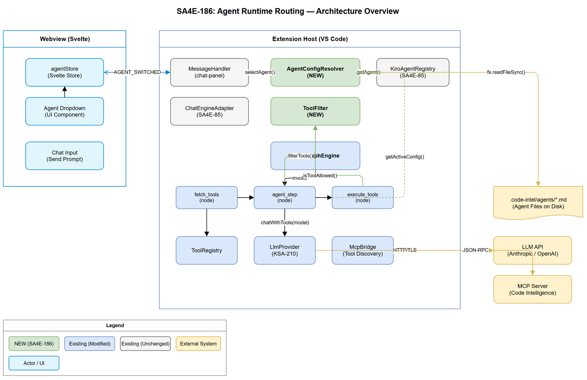
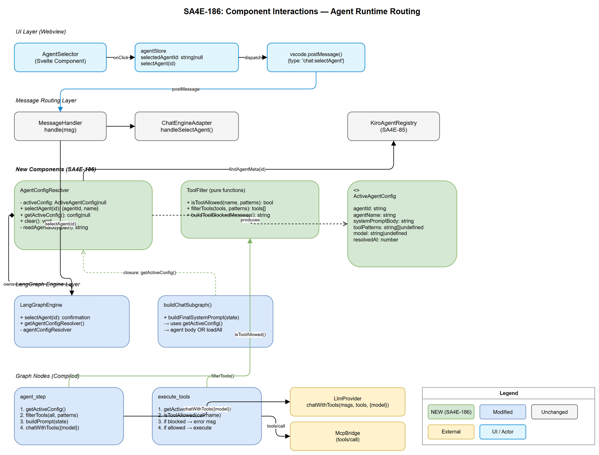

# Technical Design Document (TDD)

## SDLC-Agents-4-Enterprise — SA4E-186: Agent Runtime Routing — Frontmatter (tools, model), per-agent prompt switching

---

## Document Information

| Field | Value |
|-------|-------|
| Jira Ticket | SA4E-186 |
| Title | Agent Runtime Routing — Frontmatter (tools, model), per-agent prompt switching |
| Author | SA Agent |
| Version | 1.0 |
| Date | 2025-01-27 |
| Status | Draft |
| Related BRD | documents/SA4E-186/BRD.md |
| Related FSD | documents/SA4E-186/FSD.md |

---

## Author Tracking

| Role | Name - Position | Responsibility |
|------|-----------------|----------------|
| Author | SA Agent – Solution Architect | Create document |
| Peer Reviewer | BA Agent – Business Analyst | Review for BRD/FSD alignment |

---

## Revision History

| Version | Date | Author | Changes |
|---------|------|--------|---------|
| 1.0 | 2025-01-27 | SA Agent | Initial TDD — architecture design for agent runtime routing |

---

## Sign-Off

| Name | Signature and date |
|------|--------------------|
| | ☐ I agree and confirm the technical design in this TDD |
| | ☐ I agree and confirm the technical design in this TDD |

---

## 1. Introduction

> **Scope Boundary:** This TDD specifies HOW to implement the requirements defined in the FSD. It does NOT repeat functional requirements, business rules, use cases, or UI specifications — refer to the FSD for those. This document focuses on: technology choices, architecture decisions, implementation patterns, and deployment concerns.

### 1.1 Purpose

This TDD defines the technical architecture for transforming agent frontmatter fields (`tools`, `model`) into active runtime controls within the VS Code extension's LangGraph chat engine. It specifies how to implement per-agent prompt isolation, tool filtering/enforcement, and model routing without requiring graph rebuild on agent switch.

### 1.2 Scope

- **AgentConfigResolver** — New service resolving runtime config from agent metadata
- **ToolFilter** — New utility filtering/enforcing tool access based on patterns
- **Message protocol extension** — SELECT_AGENT / AGENT_SWITCHED messages
- **Dynamic prompt assembly** — Modifying `buildFinalSystemPrompt` for per-agent isolation
- **Model routing** — Passing agent model to `LlmOptions` at `agent_step`
- **Tool enforcement** — Validating tool calls at `execute_tools` node

### 1.3 Technology Stack

| Layer | Technology | Version |
|-------|-----------|---------|
| Language | TypeScript | 5.x |
| Extension Host | VS Code Extension API | 1.85+ |
| State Machine | LangGraph (StateGraph) | 0.0.x |
| UI Framework | Svelte 4 | 4.x |
| Build Tool | esbuild / Vite | latest |
| Testing | Vitest | 1.x |

### 1.4 Design Principles

- **Open/Closed Principle** — Extend existing node factories via closure injection; do NOT modify graph topology
- **Single Responsibility** — AgentConfigResolver owns config resolution; ToolFilter owns pattern matching; neither knows about the other
- **Dependency Inversion** — Nodes receive `getActiveAgentConfig()` as an injected function; no direct import of resolver
- **Zero-Rebuild** — Agent configuration is resolved per-turn at `agent_step` invocation via closure; graph topology is immutable after compile

### 1.5 Constraints

- LangGraph StateGraph is compiled once; nodes cannot be added/removed at runtime
- Extension Host is single-threaded — all operations must be synchronous or non-blocking async
- Agent frontmatter is the single source of truth (no DB, no separate config store)
- Must maintain backward compatibility with agents lacking `tools`/`model` fields
- The existing `chat-panel-provider.ts` message routing co-exists with `ChatEngineAdapter`; both paths must handle SELECT_AGENT

### 1.6 References

| Document | Location |
|----------|----------|
| BRD | documents/SA4E-186/BRD.md |
| FSD | documents/SA4E-186/FSD.md |
| chat-graph.ts | extension/src/langgraph/subgraphs/chat-graph.ts |
| chat-graph-nodes.ts | extension/src/langgraph/subgraphs/chat-graph-nodes.ts |
| registry.ts | extension/src/langgraph/agents/registry.ts |
| llm-provider.ts | extension/src/langgraph/core/llm-provider.ts |
| tool-registry.ts | extension/src/langgraph/vscode/tool-registry.ts |
| message-protocol.ts | extension/src/chat-panel/message-protocol.ts |
| agentStore.ts | extension/src/webview/stores/agentStore.ts |
| ChatEngineAdapter.ts | extension/src/chat/engine/ChatEngineAdapter.ts |

---

## 2. System Architecture

### 2.1 Architecture Overview

The architecture introduces two new components (**AgentConfigResolver** and **ToolFilter**) into the existing LangGraph chat engine pipeline. These components operate within the Extension Host process, bridging the gap between agent discovery (KiroAgentRegistry) and the compiled LangGraph graph.

The key insight is that the compiled graph topology remains unchanged. Instead, the `buildFinalSystemPrompt` closure and the `createAgentStepNode` / `createExecuteToolsNode` factories receive a `getActiveAgentConfig()` function that resolves the current agent configuration dynamically at each node invocation.



**Data flow:**

1. Webview dispatches `SELECT_AGENT` → Extension Host
2. Extension Host resolves config via **AgentConfigResolver** (reads agent file, extracts body/tools/model)
3. Config stored in-memory (singleton per engine instance)
4. On next chat message, `agent_step` reads config → filters tools via **ToolFilter**, assembles prompt, passes model to LlmProvider
5. `execute_tools` validates each tool call against active patterns (enforcement safety net)

### 2.2 Component Diagram



| Component | Responsibility | Technology |
|-----------|---------------|------------|
| AgentConfigResolver | Resolve + store ActiveAgentConfig from agent file | TypeScript class, in-memory state |
| ToolFilter | Pattern-match tool names against allowed list | Pure function (stateless) |
| agentStore (Svelte) | Track selected agent in webview | Svelte writable store |
| message-protocol | Define SELECT_AGENT / AGENT_SWITCHED types | TypeScript union types |
| chat-graph.ts | Build graph with dynamic prompt/tool closures | LangGraph StateGraph |
| chat-graph-nodes.ts | Agent step + execute tools with config injection | Node factory functions |
| ChatEngineAdapter | Route SELECT_AGENT from MessageRouter to resolver | Adapter pattern |
| ChatPanelProvider | Route SELECT_AGENT from chat-panel webview to resolver | VS Code WebviewView |

### 2.3 Deployment Architecture

This feature operates entirely within the VS Code Extension Host process. No new services, containers, or external systems are introduced.

| Artifact | Deployment Target |
|----------|-------------------|
| Extension bundle (.vsix) | VS Code marketplace / local install |
| Webview bundle (Svelte) | Embedded in extension assets |

### 2.4 Communication Patterns

| From | To | Protocol | Pattern | Description |
|------|----|----------|---------|-------------|
| Webview (Svelte) | Extension Host | postMessage | Async one-way | SELECT_AGENT dispatch |
| Extension Host | Webview | postMessage | Async one-way | AGENT_SWITCHED confirmation |
| Extension Host | LLM API | HTTP/HTTPS | Async request-response | chatWithTools with model override |
| Extension Host | MCP Server | JSON-RPC | Async request-response | tools/list discovery |

---

## 3. Message Protocol Design

> No REST APIs are introduced. Communication uses VS Code's `postMessage` protocol.

### 3.1 Protocol Extension

Two new message types are added to the existing `ChatWebviewToExtMessage` and `ChatExtToWebviewMessage` unions.

#### SELECT_AGENT (Webview → Extension Host)

```typescript
// Added to ChatWebviewToExtMessage union in message-protocol.ts
| { type: "chat:selectAgent"; agentId: string | null }
```

| Field | Type | Required | Description |
|-------|------|----------|-------------|
| type | `"chat:selectAgent"` | Y | Message discriminant |
| agentId | `string \| null` | Y | Agent ID to activate, null = deselect (fallback) |

#### AGENT_SWITCHED (Extension Host → Webview)

```typescript
// Added to ChatExtToWebviewMessage union in message-protocol.ts
| { type: "chat:agentSwitched"; agentId: string | null; agentName: string }
```

| Field | Type | Description |
|-------|------|-------------|
| type | `"chat:agentSwitched"` | Confirmation message |
| agentId | `string \| null` | Active agent ID (null = fallback mode) |
| agentName | `string` | Display name for UI feedback |

### 3.2 ChatEngineAdapter — SELECT_AGENT Handler

A new handler registered in the `ChatEngineAdapter.registerMessageHandlers()`:

```typescript
router.registerHandler('SELECT_AGENT', (msg) => this.handleSelectAgent(msg));
```

### 3.3 ChatPanelProvider — SELECT_AGENT Handler

The existing `message-handler.ts` switch statement handles the new case:

```typescript
case "chat:selectAgent":
  this.getEngine().selectAgent(msg.agentId);
  break;
```

### 3.4 Dual-Path Routing

Both the `ChatEngineAdapter` (SA4E-85 architecture) and `ChatPanelProvider` (legacy path) converge on the same `AgentConfigResolver` instance held by `LangGraphEngine`. This ensures consistent behavior regardless of which message routing path is active.

---

## 4. Class / Module Design

### 4.1 Package Structure

```
extension/src/langgraph/
├── agents/
│   ├── registry.ts                 # Existing AgentRegistry (SDLC pipeline)
│   ├── agent-config-resolver.ts    # NEW — ActiveAgentConfig resolution
│   └── tool-filter.ts              # NEW — Tool pattern matching
├── subgraphs/
│   ├── chat-graph.ts               # MODIFY — inject config resolver into closures
│   └── chat-graph-nodes.ts         # MODIFY — read config at agent_step, enforce at execute_tools
├── core/
│   └── llm-provider.ts             # UNCHANGED — already has LlmOptions.model
├── vscode/
│   └── tool-registry.ts            # UNCHANGED — provides McpToolDefinition[]
└── engine/
    └── langgraph-engine.ts         # MODIFY — expose selectAgent(), hold resolver instance
```

### 4.2 Key Interfaces

#### ActiveAgentConfig

```typescript
// extension/src/langgraph/agents/agent-config-resolver.ts

export interface ActiveAgentConfig {
  agentId: string;
  agentName: string;
  systemPromptBody: string;       // Agent markdown body (after frontmatter stripped)
  toolPatterns: string[] | undefined;  // undefined = no restriction
  model: string | undefined;      // undefined = use default
  resolvedAt: number;             // Date.now() timestamp
}
```

#### AgentConfigResolver

```typescript
// extension/src/langgraph/agents/agent-config-resolver.ts

export class AgentConfigResolver {
  private activeConfig: ActiveAgentConfig | null = null;

  constructor(
    private readonly workspaceRoot: string,
    private readonly agentRegistry: KiroAgentRegistry  // SA4E-85 registry
  ) {}

  /**
   * Resolve agent config from file.
   * Reads agent .md, strips frontmatter, extracts body + metadata.
   * Stores result as activeConfig. Returns confirmation payload.
   */
  selectAgent(agentId: string | null): { agentId: string | null; agentName: string };

  /**
   * Get current active config. Returns null when in fallback mode.
   */
  getActiveConfig(): ActiveAgentConfig | null;

  /**
   * Clear active config (return to fallback mode).
   */
  clear(): void;
}
```

#### ToolFilter

```typescript
// extension/src/langgraph/agents/tool-filter.ts

import type { McpToolDefinition } from "../vscode/tool-registry";

/**
 * Filter tools based on agent's allowed patterns.
 * Pure functions — no state, no side effects.
 */

/**
 * Check if a single tool name is allowed by the patterns.
 * - patterns === undefined → true (no restriction)
 * - patterns.length === 0 → false (text-only mode)
 * - Exact match: toolName === pattern
 * - Prefix wildcard: pattern ends with '*', toolName.startsWith(prefix)
 */
export function isToolAllowed(toolName: string, patterns: string[] | undefined): boolean;

/**
 * Filter a list of tool definitions by allowed patterns.
 * Returns subset of tools where isToolAllowed(tool.name, patterns) === true.
 */
export function filterTools(tools: McpToolDefinition[], patterns: string[] | undefined): McpToolDefinition[];

/**
 * Build an error message for a blocked tool call.
 */
export function buildToolBlockedMessage(toolName: string, agentId: string, patterns: string[]): string;
```

#### AgentMeta Extension

```typescript
// extension/src/chat/types/messages.ts — add model field

export interface AgentMeta {
  id: string;
  name: string;
  description: string;
  tools: string[];
  model?: string;           // NEW — LLM model identifier
  mcpServers: string[];
  autoApprove: string[];
  filePath: string;
}
```

### 4.3 Design Patterns

| Pattern | Where Used | Rationale |
|---------|-----------|-----------|
| Closure Injection | `buildChatSubgraph` → node factories | Nodes receive `getActiveAgentConfig()` via closure; no graph rebuild needed on agent switch |
| Strategy | `buildFinalSystemPrompt` | Branches between per-agent mode and fallback mode based on active config |
| Singleton (per-engine) | `AgentConfigResolver` instance in `LangGraphEngine` | One resolver per engine ensures consistent state across all nodes |
| Pure Function | `ToolFilter.isToolAllowed` / `filterTools` | Stateless, easily testable, no coupling to resolver |
| Observer | Webview agentStore subscription | UI reactively updates on AGENT_SWITCHED confirmation |
| Debounce | SELECT_AGENT handling | 50ms debounce window prevents rapid switch thrashing |

### 4.4 Error Handling

| Error Condition | Component | Action | User Impact |
|-----------------|-----------|--------|-------------|
| Agent file not found on disk | AgentConfigResolver.selectAgent() | Log warning, clear config, return fallback | Toast warning: "Agent unavailable" |
| Agent body empty after frontmatter strip | AgentConfigResolver.selectAgent() | Log warning, store config with empty body | No visible impact (steering rules still present) |
| Tool call blocked by filter | execute_tools node | Return error message to LLM scratchpad | None — LLM retries with allowed tool |
| LLM rejects model identifier | LlmProvider | Standard STREAM_ERROR event | Error message in chat |
| Invalid tool pattern in frontmatter | AgentConfigResolver | Treat as exact-match string, log warning | No visible impact |

---

## 5. Detailed Component Design

### 5.1 AgentConfigResolver — Implementation

```typescript
export class AgentConfigResolver {
  private activeConfig: ActiveAgentConfig | null = null;

  constructor(
    private readonly workspaceRoot: string,
    private readonly findAgentMeta: (agentId: string) => AgentMeta | undefined
  ) {}

  selectAgent(agentId: string | null): { agentId: string | null; agentName: string } {
    if (agentId === null) {
      this.activeConfig = null;
      return { agentId: null, agentName: "All Agents (Default)" };
    }

    const meta = this.findAgentMeta(agentId);
    if (!meta) {
      console.warn(`[AgentConfigResolver] Agent '${agentId}' not found in registry`);
      this.activeConfig = null;
      return { agentId: null, agentName: "All Agents (Default)" };
    }

    // Read agent file and extract body
    const body = this.readAgentBody(meta.filePath);

    this.activeConfig = {
      agentId: meta.id,
      agentName: meta.name,
      systemPromptBody: body,
      toolPatterns: meta.tools.length > 0 ? meta.tools : undefined,
      model: meta.model || undefined,
      resolvedAt: Date.now(),
    };

    return { agentId: meta.id, agentName: meta.name };
  }

  getActiveConfig(): ActiveAgentConfig | null {
    return this.activeConfig;
  }

  clear(): void {
    this.activeConfig = null;
  }

  private readAgentBody(filePath: string): string {
    try {
      const content = fs.readFileSync(filePath, "utf-8");
      // Strip frontmatter (everything between first --- and closing ---)
      return content.replace(/^---[\s\S]*?---\r?\n?/, "").trim();
    } catch (err) {
      console.warn(`[AgentConfigResolver] Cannot read agent file: ${(err as Error).message}`);
      return "";
    }
  }
}
```

**Key Design Decisions:**

1. **`findAgentMeta` injected as function** — Avoids coupling to a specific registry class. Both `KiroAgentRegistry` (SA4E-85 chat registry) and `AgentRegistry` (SDLC pipeline) can provide this.
2. **Synchronous file read** — Agent files are small (<10KB), local disk, and switching must complete in <100ms. Async overhead unnecessary.
3. **`tools: []` vs `tools: undefined`** — The `AgentMeta.tools` field is always an array (empty = text-only). We normalize to `undefined` for "unrestricted" only when the original frontmatter omits the field entirely. The parser (SA4E-85 agentParser) already handles this distinction.

### 5.2 ToolFilter — Implementation

```typescript
export function isToolAllowed(toolName: string, patterns: string[] | undefined): boolean {
  // No restriction — all tools allowed
  if (patterns === undefined) return true;
  // Explicit empty — text-only mode
  if (patterns.length === 0) return false;

  return patterns.some(pattern => {
    if (pattern.endsWith("*")) {
      return toolName.startsWith(pattern.slice(0, -1));
    }
    return toolName === pattern;
  });
}

export function filterTools(
  tools: McpToolDefinition[],
  patterns: string[] | undefined
): McpToolDefinition[] {
  if (patterns === undefined) return tools;
  if (patterns.length === 0) return [];
  return tools.filter(t => isToolAllowed(t.name, patterns));
}

export function buildToolBlockedMessage(
  toolName: string,
  agentId: string,
  patterns: string[]
): string {
  const allowed = patterns.length > 5
    ? patterns.slice(0, 5).join(", ") + ` ... (${patterns.length} total)`
    : patterns.join(", ");
  return `Tool '${toolName}' is not available for agent '${agentId}'. Allowed tools: [${allowed}]`;
}
```

### 5.3 Modified buildChatSubgraph — Dynamic Prompt Assembly

The `buildChatSubgraph` factory is modified to accept an `AgentConfigResolver` and use it in closures:

```typescript
export async function buildChatSubgraph(
  streamHandler: StreamHandler,
  llmProvider?: LlmProvider,
  mcpBridge?: McpBridge,
  workspaceRoot?: string,
  hookEngine?: HookEngine,
  approvalGate?: ToolApprovalGate,
  agentConfigResolver?: AgentConfigResolver  // NEW parameter
) {
  // ... existing setup (steering injection, tool registry) ...

  // SA4E-186: Dynamic system prompt assembly
  function buildFinalSystemPrompt(state: PipelineState): string {
    let prompt = enrichedBasePrompt; // AGENT_SYSTEM_PROMPT + steering rules

    const activeConfig = agentConfigResolver?.getActiveConfig();
    if (activeConfig) {
      // Per-agent mode: use ONLY selected agent's body
      if (activeConfig.systemPromptBody) {
        prompt += `\n\n# Agent Instructions\n\n${activeConfig.systemPromptBody}`;
      }
    } else {
      // Fallback mode: concatenate all agents (existing behavior)
      const agentInstructions = loadAgentInstructions(wsRoot);
      if (agentInstructions) {
        prompt += `\n\n# Agent Instructions\n${agentInstructions}`;
      }
    }

    // Append KB context if available
    if (state.kbContext) {
      prompt += `\n\n---\n${state.kbContext}\n---`;
    }
    return prompt;
  }

  // ... graph construction unchanged ...
}
```

### 5.4 Modified createAgentStepNode — Tool Filtering + Model Routing

```typescript
export function createAgentStepNode(
  llmProvider: LlmProvider | undefined,
  streamHandler: StreamHandler,
  getSystemPrompt: (state: PipelineState) => string,
  getAgentConfig?: () => ActiveAgentConfig | null  // NEW parameter
) {
  return async (state: PipelineState) => {
    // ... existing null-check for llmProvider ...

    const sysPrompt = getSystemPrompt(state);
    const activeConfig = getAgentConfig?.() ?? null;

    // Parse all tools from state
    let tools: McpToolDefinition[] = [];
    try { tools = JSON.parse(state.parallelResults?.toolsJson || "[]"); }
    catch { tools = []; }

    // SA4E-186: Apply tool filtering based on active agent
    if (activeConfig?.toolPatterns !== undefined) {
      tools = filterTools(tools, activeConfig.toolPatterns);
    }

    // SA4E-186: Model routing — override LlmOptions.model
    const llmOptions: LlmOptions = { maxTokens: 8192 };
    if (activeConfig?.model) {
      llmOptions.model = activeConfig.model;
    }

    if (llmProvider.chatWithTools && tools.length > 0) {
      return await agentStepWithTools(state, llmProvider, streamHandler, streamId, tools, sysPrompt, llmOptions);
    }
    return await agentStepStreaming(state, llmProvider, streamHandler, streamId, sysPrompt, tools, llmOptions);
  };
}
```

### 5.5 Modified createExecuteToolsNode — Enforcement

```typescript
export function createExecuteToolsNode(
  mcpBridge: McpBridge | undefined,
  sh: StreamHandler,
  hookEngine: HookEngine | undefined,
  wsRoot: string,
  approvalGate?: ToolApprovalGate,
  getAgentConfig?: () => ActiveAgentConfig | null  // NEW parameter
) {
  return async (state: PipelineState) => {
    const calls = state.toolCalls || [];
    const results: Array<{ toolCallId: string; name: string; content: string }> = [];
    const activeConfig = getAgentConfig?.() ?? null;

    for (const call of calls) {
      // SA4E-186: Enforcement — block tool calls not in allowed list
      if (activeConfig?.toolPatterns !== undefined) {
        if (!isToolAllowed(call.name, activeConfig.toolPatterns)) {
          results.push({
            toolCallId: call.id,
            name: call.name,
            content: buildToolBlockedMessage(call.name, activeConfig.agentId, activeConfig.toolPatterns),
          });
          continue;
        }
      }
      // ... existing executeSingleTool logic ...
      const r = await executeSingleTool(call, mcpBridge, sh, streamId, hookEngine, wsRoot, approvalGate);
      results.push(r);
    }
    // ... existing scratchpad accumulation ...
  };
}
```

### 5.6 LangGraphEngine — selectAgent() Entry Point

```typescript
// extension/src/langgraph/engine/langgraph-engine.ts — additions

export class LangGraphEngine {
  private agentConfigResolver: AgentConfigResolver;

  constructor(/* existing params */) {
    // ... existing initialization ...
    this.agentConfigResolver = new AgentConfigResolver(
      this.workspaceRoot,
      (agentId) => this.kiroAgentRegistry?.getAgent(agentId)
    );
  }

  /**
   * SA4E-186: Handle agent selection from webview.
   * Resolves config and stores for next graph invocation.
   * Returns confirmation payload for AGENT_SWITCHED message.
   */
  selectAgent(agentId: string | null): { agentId: string | null; agentName: string } {
    return this.agentConfigResolver.selectAgent(agentId);
  }

  getAgentConfigResolver(): AgentConfigResolver {
    return this.agentConfigResolver;
  }
}
```

### 5.7 Webview — agentStore Extension

```typescript
// extension/src/webview/stores/agentStore.ts — add postMessage dispatch

export function selectAgent(agentId: string | null): void {
  agentState.update((s) => ({ ...s, selectedAgentId: agentId }));
  // SA4E-186: Dispatch to Extension Host
  vscode.postMessage({ type: "chat:selectAgent", agentId });
}
```

---

## 6. Sequence Diagrams

### 6.1 Agent Selection Flow

```
Webview          ChatPanelProvider    LangGraphEngine    AgentConfigResolver    KiroAgentRegistry
  |                    |                    |                    |                    |
  |--selectAgent(id)-->|                    |                    |                    |
  |  [postMessage]     |                    |                    |                    |
  |                    |--selectAgent(id)-->|                    |                    |
  |                    |                    |--selectAgent(id)-->|                    |
  |                    |                    |                    |--getAgent(id)----->|
  |                    |                    |                    |<---AgentMeta-------|
  |                    |                    |                    |--readFile(path)--->|
  |                    |                    |                    |  [fs.readFileSync] |
  |                    |                    |<--{agentId,name}---|                    |
  |                    |<--{agentId,name}---|                    |                    |
  |<-AGENT_SWITCHED----|                    |                    |                    |
  |  [postMessage]     |                    |                    |                    |
```

### 6.2 Chat with Active Agent Flow

```
User      Webview    Engine     fetch_tools   agent_step    AgentConfigResolver   ToolFilter   LlmProvider
  |          |          |           |              |               |                  |             |
  |--msg---->|          |           |              |               |                  |             |
  |          |--SEND--->|           |              |               |                  |             |
  |          |          |--invoke-->|              |               |                  |             |
  |          |          |           |--getTools--->|               |                  |             |
  |          |          |           |<--allTools---|               |                  |             |
  |          |          |           |              |               |                  |             |
  |          |          |-----------|--agent_step->|               |                  |             |
  |          |          |           |              |--getConfig()->|                  |             |
  |          |          |           |              |<--config------|                  |             |
  |          |          |           |              |--filterTools(tools,patterns)---->|             |
  |          |          |           |              |<--filteredTools-------------------|             |
  |          |          |           |              |--buildPrompt(state)              |             |
  |          |          |           |              |--chatWithTools(msgs,filtered,{model})--------->|
  |          |          |           |              |<--response-----------------------------------------|
```

---

## 7. Security Design

### 7.1 Tool Restriction Enforcement

| Concern | Mitigation |
|---------|------------|
| LLM hallucinating blocked tool call | Double enforcement: filter at agent_step (LLM never sees tool) + validate at execute_tools (safety net) |
| Prompt injection to bypass restriction | Tool filter is code-level enforcement, not prompt-level; LLM cannot modify TypeScript runtime |
| Agent escalation (adding tools via prompt) | Tool patterns read from frontmatter file on disk; LLM has no write access to agent files |
| Race condition: config stale during execution | In-flight calls complete with config read at invocation start; no mid-call revocation |

### 7.2 Data Protection

| Data Type | At Rest | In Transit | In Logs |
|-----------|---------|------------|---------|
| Agent frontmatter (tools, model) | Plain text in git | N/A (local) | Safe to log |
| LLM API keys | VS Code SecretStorage (encrypted) | TLS 1.2+ | Never logged |
| Tool call arguments | In-memory only | TLS to MCP server | Truncated in debug |
| System prompt content | In-memory only | TLS to LLM API | First 150 chars in debug |

### 7.3 Input Validation

| Field | Validation | Sanitization |
|-------|-----------|--------------|
| agentId (SELECT_AGENT) | Non-empty string or null | Lookup in registry (reject unknown IDs) |
| tools[] patterns | Non-empty strings, wildcard only as suffix | Invalid patterns treated as exact-match |
| model string | Passed verbatim (no validation) | Provider handles invalid models |

---

## 8. Performance & Scalability

### 8.1 Performance Targets

| Operation | Target | Measurement |
|-----------|--------|-------------|
| SELECT_AGENT → AGENT_SWITCHED | < 100ms | Agent file read + config resolve |
| Tool filtering (50 tools × 10 patterns) | < 1ms | O(n*m) string comparison |
| Prompt assembly | < 5ms | String concatenation |
| Agent file read (fs.readFileSync) | < 10ms | Local SSD, file < 10KB |

### 8.2 Memory Impact

| Component | Memory | Lifecycle |
|-----------|--------|-----------|
| ActiveAgentConfig | ~2KB | Per-engine instance, replaced on switch |
| Agent file content (cached in config) | ~5KB | Replaced on next selectAgent() call |
| ToolFilter functions | 0 (stateless) | Stack allocation only |

### 8.3 Optimization Decisions

- **No caching of filtered tools** — Tool list changes per `fetch_tools` invocation (MCP reconnect can add/remove tools); filter is cheap enough to reapply
- **Synchronous file read** — Agent files are tiny and local; async would add complexity for negligible benefit
- **No debounce at resolver level** — Debounce belongs in UI layer (webview) or message handler; resolver is always instant

---

## 9. Monitoring & Observability

### 9.1 Logging

| Log Event | Level | Fields | When |
|-----------|-------|--------|------|
| Agent selected | DEBUG | `agentId`, `agentName`, `toolPatterns.length`, `model` | selectAgent() completes |
| Agent deselected (fallback) | DEBUG | — | selectAgent(null) |
| Agent file not found | WARN | `agentId`, `filePath` | File read fails |
| Tool blocked (enforcement) | DEBUG | `toolName`, `agentId`, `patterns` | execute_tools rejects call |
| Model override applied | DEBUG | `model`, `agentId` | agent_step passes model to LLM |

### 9.2 Debug Diagnostics

Existing `debugLog()` infrastructure (extension/src/debug-logger.ts) is used. No new metrics or alerting needed — this is a client-side extension.

---

## 10. Deployment Considerations

### 10.1 Feature Flags

| Flag | Default | Description |
|------|---------|-------------|
| N/A | — | No feature flag needed; fallback mode (no agent selected) IS the off-state |

### 10.2 Rollback Strategy

- Revert the extension version to pre-SA4E-186 build
- Agent frontmatter `tools` and `model` fields are inert without runtime routing code — no cleanup needed
- No database migrations, no server changes

### 10.3 Backward Compatibility

| Scenario | Behavior |
|----------|----------|
| Agent file without `tools` field | `toolPatterns = undefined` → no tool restriction |
| Agent file without `model` field | `model = undefined` → default model from settings |
| No agent selected (startup state) | Exact current behavior preserved |
| KiroAgentRegistry not initialized | `findAgentMeta` returns undefined → fallback mode |

---

## 11. Implementation Checklist

| # | Task | File(s) | Priority |
|---|------|---------|----------|
| 1 | Create `AgentConfigResolver` class | `agents/agent-config-resolver.ts` | P0 |
| 2 | Create `ToolFilter` module (pure functions) | `agents/tool-filter.ts` | P0 |
| 3 | Add `model?: string` to `AgentMeta` interface | `chat/types/messages.ts` | P0 |
| 4 | Add `chat:selectAgent` to `ChatWebviewToExtMessage` | `chat-panel/message-protocol.ts` | P0 |
| 5 | Add `chat:agentSwitched` to `ChatExtToWebviewMessage` | `chat-panel/message-protocol.ts` | P0 |
| 6 | Handle SELECT_AGENT in `message-handler.ts` | `chat-panel/message-handler.ts` | P0 |
| 7 | Handle SELECT_AGENT in `ChatEngineAdapter` | `chat/engine/ChatEngineAdapter.ts` | P0 |
| 8 | Expose `selectAgent()` on `LangGraphEngine` | `langgraph/engine/langgraph-engine.ts` | P0 |
| 9 | Modify `buildChatSubgraph` — accept resolver, dynamic prompt | `langgraph/subgraphs/chat-graph.ts` | P0 |
| 10 | Modify `createAgentStepNode` — tool filter + model routing | `langgraph/subgraphs/chat-graph-nodes.ts` | P0 |
| 11 | Modify `createExecuteToolsNode` — tool enforcement | `langgraph/subgraphs/chat-graph-nodes.ts` | P0 |
| 12 | Update `agentStore.selectAgent()` — dispatch postMessage | `webview/stores/agentStore.ts` | P1 |
| 13 | Update `agentParser` — parse `model` field from frontmatter | `chat/registry/agentParser.ts` | P1 |
| 14 | Pass `LlmOptions.model` in `agentStepWithTools` | `langgraph/subgraphs/chat-graph-nodes.ts` | P1 |
| 15 | Unit tests — ToolFilter (exact, wildcard, empty, undefined) | `tests/tool-filter.test.ts` | P0 |
| 16 | Unit tests — AgentConfigResolver (select, deselect, missing) | `tests/agent-config-resolver.test.ts` | P0 |
| 17 | Integration test — agent switch end-to-end | `tests/agent-routing.integration.test.ts` | P1 |

---

## 12. Appendix

### Glossary

| Term | Definition |
|------|------------|
| ActiveAgentConfig | In-memory runtime configuration resolved from agent frontmatter |
| Closure Injection | Pattern where graph nodes receive config via closed-over function references |
| Fallback Mode | Default state: no agent selected, all agents concatenated, all tools available |
| Tool Pattern | String with optional suffix wildcard (`*`) for prefix matching |
| Enforcement | Secondary validation at execute_tools preventing bypassed tool calls |

### Open Questions

| # | Question | Status | Answer |
|---|----------|--------|--------|
| 1 | Should `KiroAgentRegistry` and `AgentRegistry` (pipeline) be unified? | Deferred | They serve different purposes (chat vs SDLC pipeline); keep separate for now |
| 2 | Should agent body be re-read from disk on every `agent_step`? | Resolved | No — read once on `selectAgent()`, re-read on next selection. Hot-reload is a future enhancement. |
| 3 | Should SELECT_AGENT be debounced at extension host level? | Resolved | No — debounce at webview level (50ms). Resolver is idempotent and instant. |

### Diagram Index

| # | Diagram | Image | Source (editable) |
|---|---------|-------|-------------------|
| 1 | Architecture Overview | [architecture.png](diagrams/architecture.png) | [architecture.drawio](diagrams/architecture.drawio) |
| 2 | Component Diagram | [component.png](diagrams/component.png) | [component.drawio](diagrams/component.drawio) |
