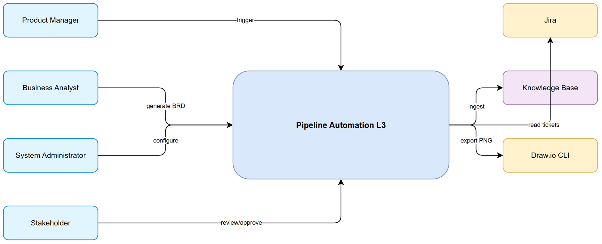
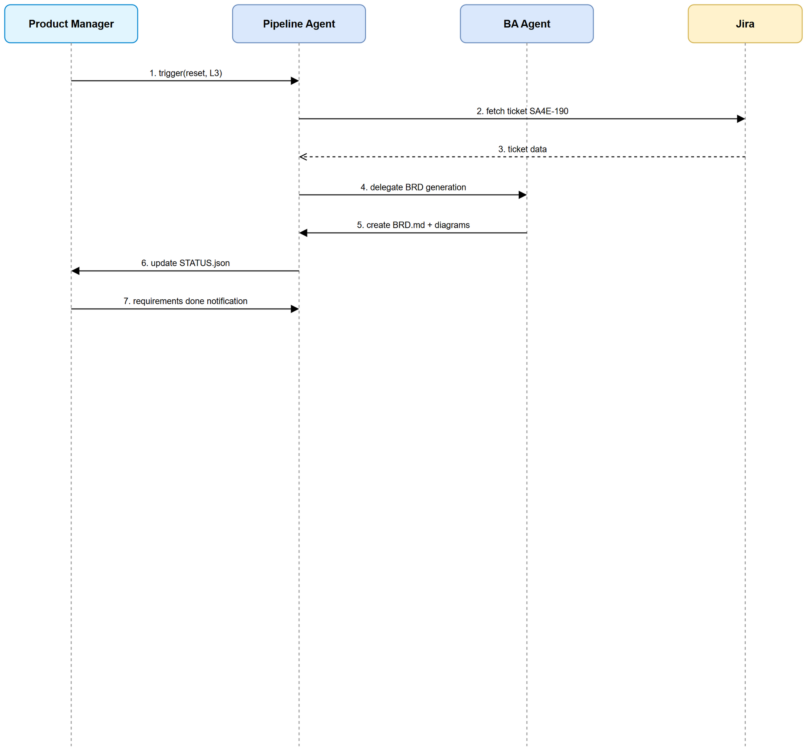

# Functional Specification Document (FSD)

## SDLC Agents 4 Enterprise — SA4E-190: Autonomy L3 Pipeline Automation for SDLC Agents 4 Enterprise

---

## Document Information

| Field | Value |
|-------|-------|
| Jira Ticket | SA4E-190 |
| Title | Autonomy L3 Pipeline Automation for SDLC Agents 4 Enterprise |
| Author | BA Agent + TA Agent |
| Version | 1.0 |
| Date | 2026-08-23 |
| Status | Draft |
| Related BRD | documents/SA4E-190/BRD.md |

---

## Revision History

| Version | Date | Author | Changes |
|---------|------|--------|---------|
| 1.0 | 2026-08-23 | BA Agent + TA Agent | Initiate FSD from BRD SA4E-190 |

---

## 1. Introduction

### 1.1 Purpose

This FSD specifies the functional behavior of Autonomy L3 Pipeline Automation for SDLC Agents 4 Enterprise, covering requirements phase automation: ticket ingestion, BRD generation, diagram creation, status tracking, and human-in-the-loop approval gates.

### 1.2 Scope

In scope:
- Pipeline reset to requirements phase with autonomyLevel L3
- BRD generation from Jira tickets following template
- Draw.io diagram generation and PNG export
- STATUS.json update with completedAt timestamp
- Knowledge base ingestion

Out of scope: specification, design, implementation, testing, deployment phases.

### 1.3 Definitions & Acronyms

| Term | Definition |
|------|------------|
| Autonomy L3 | Human-in-the-loop automation with approval gates |
| BRD | Business Requirements Document |
| FSD | Functional Specification Document |
| SDLC | Software Development Life Cycle |

### 1.4 References

| Document | Location |
|----------|----------|
| BRD | documents/SA4E-190/BRD.md |
| BRD Template | documents/templates/BRD-TEMPLATE.md |
| FSD Template | documents/templates/FSD-TEMPLATE.md |

---

## 2. System Overview

### 2.1 System Context Diagram


*[Edit in draw.io](diagrams/system-context.drawio)*

System interacts with Product Manager, Business Analyst, System Administrator, Stakeholder as actors. External systems: Jira for ticket data, Knowledge Base for cross-agent access, Draw.io CLI for diagram export.

### 2.2 System Architecture

High-level components:
- Pipeline Controller: manages phase and autonomy level
- BA Agent: generates BRD and diagrams
- Status Manager: updates STATUS.json
- Knowledge Base Ingestor: stores artifacts for retrieval
- Draw.io Exporter: converts .drawio to PNG

---

## 3. Functional Requirements

### 3.1 Feature: Trigger Pipeline Automation with Autonomy L3

**Source:** BRD Story 1

#### 3.1.1 Description

Pipeline must support reset to requirements phase with autonomyLevel L3 and enforce human approval gates before phase transition.

#### 3.1.2 Use Case

**Use Case ID:** UC-01
**Actor:** Product Manager
**Preconditions:** Ticket SA4E-190 exists, pipeline accessible
**Postconditions:** STATUS.json reflects phase=requirements, autonomyLevel=L3

**Main Flow:**

| Step | Actor | System | Description |
|------|-------|--------|-------------|
| 1 | Product Manager | | Requests pipeline reset to requirements with L3 |
| 2 | | Pipeline Controller | Validates ticket and autonomy level |
| 3 | | Status Manager | Updates STATUS.json currentPhase and autonomyLevel |
| 4 | | Pipeline Controller | Confirms reset complete |

**Alternative Flows:**

| ID | Condition | Steps |
|----|-----------|-------|
| AF-1 | Invalid autonomy level | Step 2 rejects, logs error, returns validation message |

**Exception Flows:**

| ID | Condition | Steps |
|----|-----------|-------|
| EF-1 | Missing ticket | Step 2 aborts, notifies operator |

#### 3.1.3 Business Rules

| Rule ID | Rule | Source |
|---------|------|--------|
| BR-01 | autonomyLevel must be L1, L2, or L3 | BRD 2.3 STORY 1 |
| BR-02 | currentPhase must be valid SDLC phase | BRD 2.3 STORY 1 |
| BR-03 | completedAt must be ISO 8601 format | BRD 2.3 STORY 1 |
| BR-04 | L3 mode requires human approval before phase transition | BRD 2.3 STORY 1 |

#### 3.1.4 Data Specifications

**Input Data:**

| Field | Type | Required | Validation | Description |
|-------|------|----------|------------|-------------|
| ticket | string | Y | Pattern [A-Z]+-\d+ | Jira ticket key |
| autonomyLevel | string | Y | Enum L1/L2/L3 | Autonomy level |
| currentPhase | string | Y | Enum | SDLC phase |

**Output Data:**

| Field | Type | Description |
|-------|------|-------------|
| ticket | string | Echo |
| autonomyLevel | string | Confirmed |
| currentPhase | string | Set |
| completedAt | datetime | Completion timestamp |

#### 3.1.5 API Contract (Functional View)

**Endpoint:** `POST /pipeline/reset`
**Purpose:** Reset pipeline to specific phase and autonomy level

**Input Parameters:**

| Parameter | Type | Required | Business Rule | Description |
|-----------|------|----------|---------------|-------------|
| ticket | string | Y | BR-01 | Jira key |
| autonomyLevel | string | Y | BR-01 | L3 |
| phase | string | Y | BR-02 | requirements |

**Output Data:**

| Field | Type | Description |
|-------|------|-------------|
| status | string | success/error |
| ticket | string | |
| phase | string | |
| autonomyLevel | string | |

**Business Error Scenarios:**

| Scenario | User Message | Trigger Condition |
|----------|-------------|-------------------|
| Invalid autonomy level | Autonomy level must be L1/L2/L3 | BR-01 violation |
| Missing ticket | Ticket key required | EF-1 |

**Zod Schema:**

```typescript
import { z } from 'zod';

const ResetPipelineSchema = z.object({
  ticket: z.string().regex(/^[A-Z]+-\d+$/),
  autonomyLevel: z.enum(['L1','L2','L3']),
  phase: z.enum(['requirements','specification','design','implementation','testing','deployment'])
});

const ResetPipelineResponseSchema = z.object({
  status: z.enum(['success','error']),
  ticket: z.string(),
  phase: z.string(),
  autonomyLevel: z.string(),
  completedAt: z.string().datetime().optional()
});
```

#### 3.1.6 Pseudocode for complex logic

```
function resetPipeline(ticket, autonomyLevel, phase):
  if not regexMatch(ticket, /^[A-Z]+-\d+$/):
    throw Error('Invalid ticket')
  if autonomyLevel not in ['L1','L2','L3']:
    throw Error('Invalid autonomy level')
  if phase not in VALID_PHASES:
    throw Error('Invalid phase')
  status = load STATUS.json
  status.ticket = ticket
  status.autonomyLevel = autonomyLevel
  status.currentPhase = phase
  status.lastUpdated = nowISO()
  save STATUS.json
  return {status:'success', ...}
```

### 3.2 Feature: Generate BRD from Tickets

**Source:** BRD Story 2

#### 3.2.1 Description

BA Agent generates BRD.md following template with purpose, scope, user stories, business rules, NFRs.

#### 3.2.2 Use Case

**Use Case ID:** UC-02
**Actor:** Business Analyst
**Preconditions:** Pipeline in requirements phase, BRD template available
**Postconditions:** BRD.md created at documents/SA4E-190/BRD.md

**Main Flow:**

| Step | Actor | System | Description |
|------|-------|--------|-------------|
| 1 | Business Analyst | | Initiates BRD generation |
| 2 | | BA Agent | Reads BRD template |
| 3 | | BA Agent | Fetches ticket data and linked tickets |
| 4 | | BA Agent | Synthesizes sections |
| 5 | | BA Agent | Writes BRD.md |
| 6 | | BA Agent | Ingests BRD to Knowledge Base |

**Alternative Flows:**

| ID | Condition | Steps |
|----|-----------|-------|
| AF-1 | Template missing | Use default template, log warning |

**Exception Flows:**

| ID | Condition | Steps |
|----|-----------|-------|
| EF-1 | Write failure | Log error, notify operator |

#### 3.2.3 Business Rules

| Rule ID | Rule | Source |
|---------|------|--------|
| BR-05 | BRD must follow documents/templates/BRD-TEMPLATE.md | BRD 2.3 STORY 2 |
| BR-06 | BRD must contain ≥3 user stories | BRD 2.3 STORY 2 |
| BR-07 | No placeholder `{...}` left in final BRD | BRD 2.3 STORY 2 |

#### 3.2.4 Data Specifications

**Input Data:**

| Field | Type | Required | Validation | Description |
|-------|------|----------|------------|-------------|
| ticketKey | string | Y | | SA4E-190 |
| templatePath | string | Y | file exists | |

**Output Data:**

| Field | Type | Description |
|-------|------|-------------|
| filePath | string | documents/SA4E-190/BRD.md |
| sections | array | Document sections |

#### 3.2.5 API Contract

**Endpoint:** `POST /brd/generate`
**Purpose:** Generate BRD from ticket

**Input Parameters:**

| Parameter | Type | Required | Business Rule | Description |
|-----------|------|----------|---------------|-------------|
| ticketKey | string | Y | | |

**Output Data:**

| Field | Type | Description |
|-------|------|-------------|
| path | string | |
| status | string | |

**Zod Schema:**

```typescript
const GenerateBRDRequest = z.object({
  ticketKey: z.string().regex(/^[A-Z]+-\d+$/)
});

const GenerateBRDResponse = z.object({
  path: z.string(),
  status: z.enum(['success','error'])
});
```

### 3.3 Feature: Configure Autonomy Level and Pipeline Parameters

**Source:** BRD Story 3

#### 3.3.1 Description

System Administrator configures autonomy level stored in STATUS.json and enforced during phase transitions.

#### 3.3.2 Use Case

**Use Case ID:** UC-03
**Actor:** System Administrator
**Preconditions:** Access to STATUS.json
**Postconditions:** autonomyLevel updated

**Main Flow:**

| Step | Actor | System | Description |
|------|-------|--------|-------------|
| 1 | System Administrator | | Sets autonomyLevel |
| 2 | | Status Manager | Validates value |
| 3 | | Status Manager | Persists to STATUS.json |

#### 3.3.3 Business Rules

| Rule ID | Rule | Source |
|---------|------|--------|
| BR-08 | autonomyLevel values limited to L1/L2/L3 | BRD 2.3 STORY 3 |
| BR-09 | L3 enforces human review before phase transition | BRD 2.3 STORY 3 |

### 3.4 Feature: Review Generated Artifacts

**Source:** BRD Story 4

#### 3.4.1 Description

Stakeholder reviews BRD and diagrams, approves requirements.

#### 3.4.2 Use Case

**Use Case ID:** UC-04
**Actor:** Stakeholder
**Preconditions:** BRD and diagrams generated
**Postconditions:** Requirements approved or rejected

**Main Flow:**

| Step | Actor | System | Description |
|------|-------|--------|-------------|
| 1 | Stakeholder | | Reviews BRD.md |
| 2 | Stakeholder | | Views PNG diagrams |
| 3 | Stakeholder | | Approves requirements |
| 4 | | Status Manager | Updates requirements status to done with completedAt |

**Alternative Flows:**

| ID | Condition | Steps |
|----|-----------|-------|
| AF-1 | Rejection | Stakeholder requests changes, BA Agent revises |

#### 3.4.3 Business Rules

| Rule ID | Rule | Source |
|---------|------|--------|
| BR-10 | Diagrams must exist as .drawio and .png | BRD 2.3 STORY 4 |
| BR-11 | STATUS.json requirements status updated to done after approval | BRD 2.3 STORY 4 |

---

## 4. Data Model

### 4.1 Entity Relationship Diagram

Logical entities:
- PipelineStatus: ticket, autonomyLevel, currentPhase, completedAt, lastUpdated
- BRDDocument: ticketKey, path, version, createdAt
- DiagramArtifact: ticketKey, name, drawioPath, pngPath

Relationships: PipelineStatus 1:N BRDDocument, PipelineStatus 1:N DiagramArtifact

### 4.2 Logical Entities

#### Entity: PipelineStatus

| Attribute | Type | Required | Business Rule | Description |
|-----------|------|----------|---------------|-------------|
| ticket | string | Y | BR-01 | Jira key |
| autonomyLevel | string | Y | BR-08 | L1/L2/L3 |
| currentPhase | string | Y | BR-02 | SDLC phase |
| completedAt | datetime | N | BR-03 | ISO 8601 |
| lastUpdated | datetime | Y | | |

---

## 5. Integration Specifications

### 5.1 External System: Jira

| Attribute | Value |
|-----------|-------|
| Purpose | Read ticket metadata |
| Direction | Inbound |
| Data Format | JSON |
| Frequency | On-demand |

**Data Exchange:**

| Our Data | External Data | Direction | Business Rule |
|----------|--------------|-----------|---------------|
| ticketKey | key | Send | |
| summary | summary | Receive | |
| description | description | Receive | |

### 5.2 External System: Knowledge Base

| Attribute | Value |
|-----------|-------|
| Purpose | Cross-agent artifact access |
| Direction | Outbound |
| Data Format | Markdown |
| Frequency | On generation |

### 5.3 External System: Draw.io CLI

| Attribute | Value |
|-----------|-------|
| Purpose | Export diagrams to PNG |
| Direction | Outbound |
| Data Format | XML -> PNG |
| Frequency | On generation |

---

## 6. Processing Logic

### 6.1 BRD Generation Process

**Trigger:** Pipeline reset to requirements
**Schedule:** On-demand
**Input:** Ticket key, template path
**Output:** BRD.md, diagrams

**Processing Steps:**

| Step | Description | Error Handling |
|------|-------------|----------------|
| 1 | Load template | Fallback to default |
| 2 | Fetch ticket data | Abort if missing |
| 3 | Synthesize sections | Log warnings |
| 4 | Write BRD.md | Retry once |
| 5 | Generate diagrams | Manual export fallback |
| 6 | Update STATUS.json | Validate schema |

**Activity Diagram:**



---

## 7. Security Requirements

### 7.1 Authentication & Authorization

| Role | Permissions | Screens/Features |
|------|-------------|-------------------|
| Product Manager | Read/Trigger | Pipeline reset |
| Business Analyst | Read/Write | BRD generation |
| System Administrator | Admin | Autonomy config |
| Stakeholder | Read/Approve | Review |

### 7.2 Data Sensitivity Classification

| Data Type | Classification | Business Requirement |
|-----------|---------------|---------------------|
| Jira ticket data | Internal | Access control |
| STATUS.json | Internal | Integrity |

### 7.3 Audit Trail

| Event | Logged Fields | Retention | Business Reason |
|-------|--------------|-----------|-----------------|
| Pipeline reset | ticket, autonomyLevel, user | 1 year | Compliance |
| BRD generation | ticket, path, timestamp | 1 year | Traceability |

---

## 8. Non-Functional Requirements

| Category | Business Requirement | Acceptance Criteria |
|----------|---------------------|---------------------|
| Performance | Document generation | BRD generation < 60 seconds |
| Availability | Pipeline uptime | 99% for requirements phase |
| Scalability | Multi-project | Support concurrent tickets |

---

## 9. Error Handling

### 9.1 Error Scenarios

| Scenario | Severity | User Message | Expected Behavior |
|----------|----------|-------------|-------------------|
| Invalid autonomy level | Critical | Autonomy level must be L1/L2/L3 | Reject request |
| Missing ticket | Critical | Ticket not found | Abort generation |
| Template missing | Warning | Using default template | Log warning |

### 9.2 Notification Requirements

| Event | Who is Notified | Channel | Timing |
|-------|----------------|---------|--------|
| BRD generation complete | Business Analyst | In-app | Immediate |
| Requirements approved | Product Manager | Email | Immediate |

---

## 10. Testing Considerations

### 10.1 Test Scenarios

| ID | Scenario | Input | Expected Output | Priority |
|----|----------|-------|-----------------|----------|
| TC-01 | Reset pipeline L3 | ticket SA4E-190, L3, requirements | STATUS.json updated | High |
| TC-02 | Generate BRD | valid ticket | BRD.md exists | High |
| TC-03 | Invalid autonomy | L4 | Error returned | Medium |
| TC-04 | Diagram export | .drawio exists | .png exists | High |

---

## 11. Appendix

### Diagrams

| Diagram | File |
|---------|------|
| System Context | [system-context.png](diagrams/system-context.png) |
| Sequence Trigger | [sequence-trigger.png](diagrams/sequence-trigger.png) |
| State Pipeline | [state-pipeline.png](diagrams/state-pipeline.png) |

### Change Log from BRD

FSD adds technical details: API contracts with Zod schemas, pseudocode for resetPipeline, integration specs for Jira/KB/Draw.io, processing logic steps.

---

*End of FSD*
