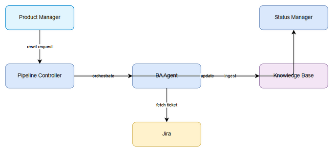
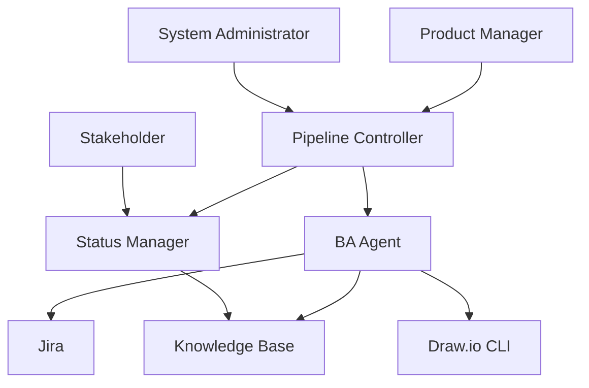
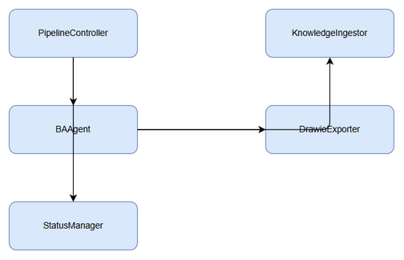
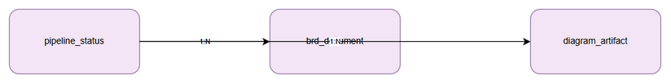

# Technical Design Document (TDD)

## SA4E-190 — Autonomy L3 Pipeline Automation for SDLC Agents 4 Enterprise

---

## Document Information

| Field | Value |
|-------|-------|
| Jira Ticket | SA4E-190 |
| Title | Autonomy L3 Pipeline Automation for SDLC Agents 4 Enterprise |
| Author | SA Agent |
| Version | 1.0 |
| Date | 2026-08-23 |
| Status | Draft |
| Related BRD | documents/SA4E-190/BRD.md |
| Related FSD | documents/SA4E-190/FSD.md |

---

## Author Tracking

| Role | Name - Position | Responsibility |
|------|-----------------|----------------|
| Author | SA Agent – Solution Architect | Create document |
| Peer Reviewer | TBD – TBD | Review document |

---

## Revision History

| Version | Date | Author | Changes |
|---------|------|--------|---------|
| 1.0 | 2026-08-23 | SA Agent | Initiate document — auto-generated from BRD and FSD |

---

## Sign-Off

| Name | Signature and date |
|------|--------------------|
| | ☐ I agree and confirm the technical design in this TDD |
| | ☐ I agree and confirm the technical design in this TDD |

---

## 1. Introduction

> **Scope Boundary:** This TDD specifies HOW to implement the requirements defined in the FSD. It does NOT repeat functional requirements, business rules, use cases, or UI specifications — refer to the FSD for those. This document focuses on: technology choices, architecture decisions, implementation patterns, and deployment concerns.

### 1.1 Purpose

Design the technical implementation of Autonomy L3 Pipeline Automation for SDLC Agents 4 Enterprise, covering requirements phase automation: pipeline reset with autonomy level, BRD generation, diagram creation/export, STATUS.json tracking, and human-in-the-loop approval gates.

### 1.2 Scope

Technical scope covers:
- Pipeline Controller service for phase/autonomy management
- BA Agent service for BRD synthesis and draw.io generation
- Status Manager for STATUS.json persistence
- Knowledge Base ingestion for cross-agent access
- Draw.io CLI integration for PNG export
- File-based persistence for PipelineStatus, BRDDocument, DiagramArtifact

Out of scope: specification, design, implementation, testing, deployment phases beyond requirements automation.

### 1.3 Technology Stack

| Layer | Technology | Version |
|-------|-----------|---------|
| Language | TypeScript | 5.x |
| Framework | Hono | 4.x |
| Database | SQLite (better-sqlite3) | 12.x |
| Build Tool | npm | 10.x |
| Container | Docker | 24.x |
| CI/CD | GitHub Actions | - |

### 1.4 Design Principles

- SOLID principles for modular services
- Single Responsibility for PipelineController, BAAgent, StatusManager
- DRY - reusable template engine for BRD generation
- Human-in-the-loop enforcement for L3 autonomy

### 1.5 Constraints

- Draw.io CLI must be available at C:\Program Files\draw.io\draw.io.exe
- STATUS.json schema must remain compatible with existing pipeline
- Knowledge Base ingestion via mem_ingest API
- File paths fixed under documents/SA4E-190/

### 1.6 References

| Document | Location |
|----------|----------|
| BRD | documents/SA4E-190/BRD.md |
| FSD | documents/SA4E-190/FSD.md |

---

## 2. System Architecture

### 2.1 Architecture Overview

High-level architecture with Pipeline Controller orchestrating BA Agent, Status Manager, Knowledge Ingestor, and Draw.io Exporter.



*[Edit in draw.io](diagrams/architecture.drawio)*



### 2.2 Component Diagram



*[Edit in draw.io](diagrams/component.drawio)*

| Component | Responsibility | Technology |
|-----------|---------------|------------|
| PipelineController | Reset pipeline, enforce autonomy gates | TypeScript/Hono |
| BAAgent | Generate BRD.md, synthesize sections | TypeScript |
| StatusManager | Read/write STATUS.json | Node FS |
| KnowledgeIngestor | Ingest BRD/diagrams to KB | mem_ingest |
| DrawioExporter | Export .drawio to PNG | draw.io CLI |

### 2.3 Deployment Architecture

Pipeline runs as Node.js service within workspace. Draw.io CLI invoked locally. STATUS.json and documents persisted on filesystem.


*[Edit in draw.io](diagrams/deployment.png)*

### 2.4 Communication Patterns

| From | To | Protocol | Pattern | Description |
|------|----|----------|---------|-------------|
| PipelineController | StatusManager | In-process | Sync | Update STATUS.json |
| BAAgent | Jira | REST | Sync | Fetch ticket metadata |
| BAAgent | Knowledge Base | HTTP | Async | Ingest artifacts |
| DrawioExporter | Draw.io CLI | Process | Sync | Export PNG |

---

## 3. API Design

> Prerequisite: Functional API contracts defined in FSD §3.x.6.

### 3.1 API Overview

| # | Endpoint | Method | Description | Source |
|---|----------|--------|-------------|--------|
| 1 | /pipeline/reset | POST | Reset pipeline phase & autonomy | UC-01 |
| 2 | /brd/generate | POST | Generate BRD from ticket | UC-02 |

### 3.2 API: Reset Pipeline

**Implements:** UC-01, BR-01..BR-04

| Attribute | Value |
|-----------|-------|
| Method | POST |
| Path | /pipeline/reset |
| Auth | None / internal |
| Rate Limit | 60/minute |

**Request Body:**
```json
{
  "ticket": "SA4E-190",
  "autonomyLevel": "L3",
  "phase": "requirements"
}
```

**Response 200 OK:**
```json
{
  "status": "success",
  "ticket": "SA4E-190",
  "phase": "requirements",
  "autonomyLevel": "L3",
  "completedAt": "2026-08-23T12:00:00Z"
}
```

**Error Responses:**

| Status | Code | Message |
|--------|------|---------|
| 400 | INVALID_AUTONOMY | Autonomy level must be L1/L2/L3 |
| 400 | INVALID_TICKET | Ticket key required |

### 3.3 API: Generate BRD

**Implements:** UC-02, BR-05..BR-07

| Attribute | Value |
|-----------|-------|
| Method | POST |
| Path | /brd/generate |
| Auth | None / internal |

**Request Body:**
```json
{
  "ticketKey": "SA4E-190"
}
```

**Response 200 OK:**
```json
{
  "path": "documents/SA4E-190/BRD.md",
  "status": "success"
}
```

---

## 4. Database Design

> Prerequisite: Logical model in FSD §4.

### 4.1 Schema Overview



*[Edit in draw.io](diagrams/db-schema.drawio)*

### 4.2 DDL Scripts

#### Table: pipeline_status

```sql
CREATE TABLE pipeline_status (
    ticket TEXT PRIMARY KEY,
    autonomy_level TEXT NOT NULL CHECK(autonomy_level IN ('L1','L2','L3')),
    current_phase TEXT NOT NULL,
    completed_at TEXT,
    last_updated TEXT NOT NULL
);
```

#### Table: brd_document

```sql
CREATE TABLE brd_document (
    id INTEGER PRIMARY KEY AUTOINCREMENT,
    ticket_key TEXT NOT NULL,
    path TEXT NOT NULL,
    version TEXT NOT NULL,
    created_at TEXT NOT NULL,
    FOREIGN KEY(ticket_key) REFERENCES pipeline_status(ticket)
);
```

#### Table: diagram_artifact

```sql
CREATE TABLE diagram_artifact (
    id INTEGER PRIMARY KEY AUTOINCREMENT,
    ticket_key TEXT NOT NULL,
    name TEXT NOT NULL,
    drawio_path TEXT NOT NULL,
    png_path TEXT NOT NULL,
    FOREIGN KEY(ticket_key) REFERENCES pipeline_status(ticket)
);
```

#### Indexes

```sql
CREATE INDEX idx_brd_ticket ON brd_document(ticket_key);
CREATE INDEX idx_diagram_ticket ON diagram_artifact(ticket_key);
```

### 4.3 Migration Plan

| Order | Script | Description |
|-------|--------|-------------|
| 1 | V1__create_pipeline_status.sql | Create pipeline_status table |
| 2 | V1__create_brd_document.sql | Create brd_document table |
| 3 | V1__create_diagram_artifact.sql | Create diagram_artifact table |

### 4.4 Query Patterns

| Operation | Query Pattern | Expected Performance |
|-----------|--------------|---------------------|
| Reset pipeline | UPDATE pipeline_status SET ... WHERE ticket = ? | < 10 ms |
| List BRDs | SELECT * FROM brd_document WHERE ticket_key = ? | < 20 ms |

---

## 5. Class / Module Design

### 5.1 Package Structure

```
sa4e-190/
├── controller/
│   └── PipelineController.ts
├── service/
│   ├── BAAgentService.ts
│   ├── StatusManager.ts
│   └── DrawioExporter.ts
├── repository/
│   └── PipelineRepository.ts
├── model/
│   ├── PipelineStatus.ts
│   ├── BRDDocument.ts
│   └── DiagramArtifact.ts
├── dto/
│   ├── ResetPipelineRequest.ts
│   └── GenerateBRDRequest.ts
└── config/
    └── AppConfig.ts
```

### 5.2 Key Interfaces

```typescript
export interface IPipelineController {
  resetPipeline(ticket: string, autonomyLevel: 'L1'|'L2'|'L3', phase: string): Promise<ResetResult>;
}

export interface IBAAgent {
  generateBRD(ticketKey: string, templatePath: string): Promise<string>;
}
```

### 5.3 Design Patterns

| Pattern | Where Used | Rationale |
|---------|-----------|-----------|
| Repository | Data access | Abstract SQLite operations |
| Strategy | Template rendering | Pluggable BRD templates |

### 5.4 Error Handling

| Exception | HTTP Status | When Thrown |
|-----------|-------------|-------------|
| InvalidAutonomyError | 400 | Autonomy not L1/L2/L3 |
| TicketNotFoundError | 404 | Jira ticket missing |

---

## 6. Integration Design

### 6.1 External System: Jira

| Attribute | Value |
|-----------|-------|
| Protocol | REST |
| Endpoint | Jira API |
| Authentication | API Token |
| Timeout | 10s |
| Retry Policy | 3 retries with exponential backoff |

### 6.2 External System: Knowledge Base

Outbound ingestion via mem_ingest tool.


*[Edit in draw.io](diagrams/api-sequence-reset.drawio)*

---

## 7. Security Design

### 7.1 Authentication

Internal service calls; Jira access via API token stored in environment variables.

### 7.2 Authorization

| Role | Endpoints | Permissions |
|------|-----------|-------------|
| Product Manager | /pipeline/reset | READ/WRITE |
| Business Analyst | /brd/generate | READ/WRITE |

### 7.3 Data Protection

STATUS.json and BRD files stored as internal classification. No PII.

### 7.4 Input Validation

Ticket key regex `^[A-Z]+-\d+$`, autonomyLevel enum.

---

## 8. Performance & Scalability

### 8.1 Caching Strategy

No caching required for requirements phase; STATUS.json read on demand.

### 8.2 Connection Pooling

SQLite connection serialized; better-sqlite3 uses file lock.

### 8.3 Performance Targets

| Operation | Target |
|-----------|--------|
| BRD generation | < 60 seconds |
| Pipeline reset | < 2 seconds |

---

## 9. Monitoring & Observability

### 9.1 Logging

| Log Event | Level | Fields |
|-----------|-------|--------|
| Pipeline reset | INFO | ticket, autonomyLevel, phase |
| BRD generation complete | INFO | ticket, path |

### 9.2 Metrics

| Metric | Type | Alert Threshold |
|--------|------|-----------------|
| BRD generation duration | Histogram | p95 > 60s |

### 9.3 Health Checks

Check STATUS.json readability and Draw.io CLI availability.

---

## 10. Deployment Considerations

### 10.1 Environment Configuration

| Property | DEV | PROD |
|----------|-----|------|
| JIRA_URL | dev.jira | prod.jira |
| DRAWIO_PATH | C:\Program Files\draw.io\draw.io.exe | same |

### 10.2 Feature Flags

None for initial release.

### 10.3 Rollback Strategy

Revert STATUS.json to previous version from git history.

---

## 11. Appendix

### Diagram Index

| # | Diagram | Image | Source |
|---|---------|-------|--------|
| 1 | Architecture | diagrams/architecture.png | diagrams/architecture.drawio |
| 2 | Component | diagrams/component.png | diagrams/component.drawio |
| 3 | Class | diagrams/class.drawio | diagrams/class.drawio |

---

## ⛔ MANDATORY: Diagram Requirements

All diagrams referenced exist as .drawio + .png.

