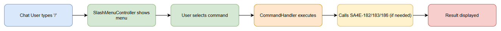
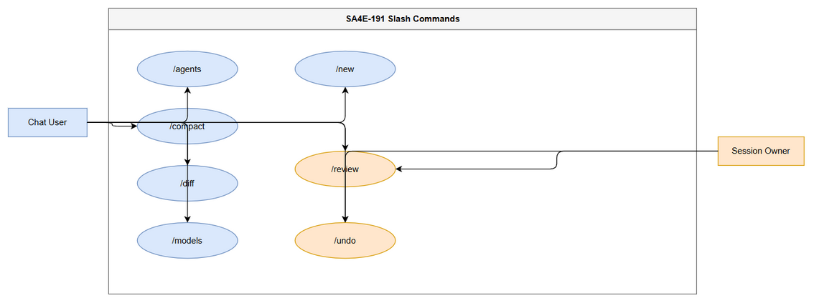
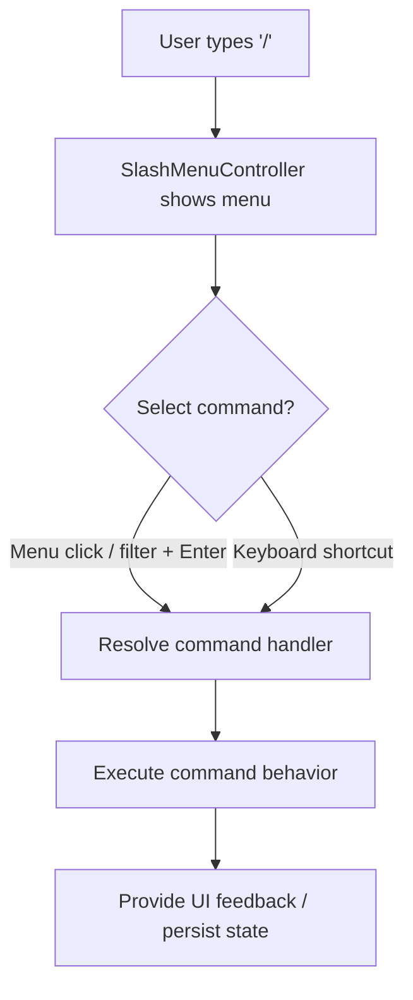

# Business Requirements Document (BRD)

## AI Chat Assistant (SA4E) — SA4E-191: Slash Commands (Tier 1)

---

## Document Information

| Field | Value |
|-------|-------|
| Jira Ticket | SA4E-191 |
| Title | Slash Commands (Tier 1) — /agents, /compact, /diff, /models, /new, /review, /undo |
| Author | BA Agent |
| Version | 1.0 |
| Date | 2026-08-23 |
| Status | Draft |
| Document Type | Business Requirements Document (BRD) |

---

## 1. Introduction

### 1.1 Background

The AI Chat Assistant (SA4E) enables users to interact with multiple specialized agents and large language models within a single conversational session. To improve productivity and discoverability of core workflow actions, the product must provide a standardized, keyboard- and menu-driven command interface. This document specifies the **Tier 1** set of seven (7) slash commands that form the foundational command surface for the core chat workflow.

### 1.2 Scope

The scope of SA4E-191 is to deliver the following seven (7) **must-have** slash commands, fully registered and functional within the chat session's slash command menu (`SlashMenuController`):

1. `/agents` — switch the active agent.
2. `/compact` — compact the current session context.
3. `/diff` — open a session file-change diff viewer.
4. `/models` — switch the active LLM model via a model selector dropdown; persist the choice.
5. `/new` — start a new session; reset chat and clear context.
6. `/review` — trigger an automated code review via a dedicated review agent using the current branch diff.
7. `/undo` — undo the last exchange; remove the last user + agent message pair and optionally revert associated file changes.

Each command must appear in the slash menu with an icon, a human-readable description, and a keyboard shortcut hint. The individual command handlers must perform the behavior described in Section 2.3.

### 1.5 Business Flow and Use Case Overview

### 1.3 Out of Scope

The following are explicitly **out of scope** for SA4E-191:

- Tier-2 and beyond slash commands (e.g., `/help`, `/export`, `/theme`, plugin-defined commands).
- Implementation of the underlying engines that Tier-1 commands depend upon:
  - The session compaction engine (owned by **SA4E-182**).
  - The file-change tracking / diff engine (owned by **SA4E-183**).
  - The agent runtime routing layer (owned by **SA4E-186**).
- Authentication and session-management infrastructure (assumed pre-existing).
- Localization / internationalization of command labels and descriptions.

### 1.4 Preliminary Requirements

- A `SlashMenuController` component must already exist (or be delivered as part of the host shell) and be capable of registering command descriptors (id, label, icon, description, shortcut hint, handler reference).
- A valid, authenticated session context must be available so commands can resolve the active agent, active model, and session history.
- The chat UI must support an intercept of the leading `/` character to trigger the slash menu.

---

## 2. Business Requirements

### 2.1 High-Level Process

The end-to-end flow for invoking any Tier-1 slash command is as follows:

1. The user focuses the chat input box and types the `/` character.
2. The `SlashMenuController` detects the trigger and renders the slash command menu, listing all registered commands with icons, descriptions, and shortcut hints.
3. The user either continues typing to filter, selects a command from the menu, or presses the command's keyboard shortcut.
4. The selected command's handler executes the command-specific behavior (see Section 2.3).
5. The system provides feedback (UI change, confirmation dialog, or agent response) and, where applicable, persists state (e.g., selected model).

### 2.2 User Stories — Tier 1 Command List

| ID | Command | User Story | Priority | Source |
|----|---------|------------|----------|--------|
| US-01 | `/agents` | As a chat user, I want to switch the active agent from the slash menu so that I can route my request to the most appropriate specialist. | MUST HAVE | SA4E-191 |
| US-02 | `/compact` | As a chat user, I want to compact my session so that I can reduce context size while preserving conversation intent. | MUST HAVE | SA4E-191 |
| US-03 | `/diff` | As a chat user, I want to view a diff of session file changes so that I can review what was modified during the conversation. | MUST HAVE | SA4E-191 |
| US-04 | `/models` | As a chat user, I want to switch the LLM model via a picker and have my choice persisted so that future sessions use my preferred model. | MUST HAVE | SA4E-191 |
| US-05 | `/new` | As a chat user, I want to start a new session so that I can reset the chat and clear accumulated context. | MUST HAVE | SA4E-191 |
| US-06 | `/review` | As a chat user, I want to run a code review on my current branch diff so that I can catch issues before merging. | MUST HAVE | SA4E-191 |
| US-07 | `/undo` | As a chat user, I want to undo the last exchange so that I can recover from an unwanted prompt/response or revert accidental file changes. | MUST HAVE | SA4E-191 |

### 2.3 Detailed User Stories

#### US-01 — `/agents` (Switch Active Agent)

**Requirement Details**
- The command opens an agent selector that lists all available agents from the runtime routing layer.
- Selecting an agent sets it as the active agent for subsequent turns in the current session.
- The command depends on the Agent Runtime Routing capability delivered by SA4E-186.

**Data Fields**

| Field | Type | Description |
|-------|------|-------------|
| selectedAgentId | String | Identifier of the agent chosen by the user. |
| availableAgents | List<String> | List of agent IDs provided by the runtime routing layer. |

**Acceptance Criteria**
- `/agents` is registered in `SlashMenuController` with an icon, description, and shortcut hint.
- Invoking the command opens the agent selector UI.
- Choosing an agent updates the active agent and is reflected in subsequent interactions.

**UI Specifications**

| Element | Value |
|---------|-------|
| Icon | `users` (or equivalent agent icon) |
| Description | "Switch the active agent for this session" |
| Keyboard Shortcut Hint | `Ctrl/Cmd + Shift + A` |

**Validation Rules**
- The selector must not allow selection of an agent that is not present in `availableAgents`.
- If routing is unavailable, the command is disabled with a tooltip.

**Error Handling**
- If SA4E-186 routing is unavailable, show an inline error: "Agent switching is temporarily unavailable."

---

#### US-02 — `/compact` (Compact Session)

**Requirement Details**
- The command triggers the `CompactionService` to summarize and compress the current session context.
- Compaction preserves the conversational intent while reducing token usage.
- The command depends on the Compact Session capability delivered by SA4E-182.

**Data Fields**

| Field | Type | Description |
|-------|------|-------------|
| sessionId | String | Identifier of the session to compact. |
| compactionStrategy | String | Strategy used (default: semantic summary). |

**Acceptance Criteria**
- `/compact` is registered in `SlashMenuController` with an icon, description, and shortcut hint.
- Invoking the command triggers `CompactionService` for the active session.
- After compaction, the session continues with reduced context and an indicator confirming compaction.

**UI Specifications**

| Element | Value |
|---------|-------|
| Icon | `compress` (or equivalent) |
| Description | "Compact the current session to reduce context size" |
| Keyboard Shortcut Hint | `Ctrl/Cmd + Shift + C` |

**Validation Rules**
- Compaction must not run if the session is empty.
- A confirmation is shown if the session exceeds a token threshold (configurable).

**Error Handling**
- If SA4E-182 compaction fails, show: "Session compaction failed. Please try again."

---

#### US-03 — `/diff` (Session Diff Viewer)

**Requirement Details**
- The command opens a diff viewer showing file changes tracked during the session.
- The viewer displays additions, modifications, and deletions per file.
- The command depends on File Change Tracking delivered by SA4E-183.

**Data Fields**

| Field | Type | Description |
|-------|------|-------------|
| sessionId | String | Session whose changes are displayed. |
| changedFiles | List<FileDiff> | Files changed with before/after content. |

**Acceptance Criteria**
- `/diff` is registered in `SlashMenuController` with an icon, description, and shortcut hint.
- Invoking the command opens the diff viewer populated from session change tracking.
- The viewer supports collapsing/expanding individual file diffs.

**UI Specifications**

| Element | Value |
|---------|-------|
| Icon | `git-compare` (or equivalent) |
| Description | "View file changes made during this session" |
| Keyboard Shortcut Hint | `Ctrl/Cmd + Shift + D` |

**Validation Rules**
- If no file changes exist, the viewer shows an empty state message.

**Error Handling**
- If SA4E-183 tracking data is missing, show: "No change tracking data available for this session."

---

#### US-04 — `/models` (Switch LLM Model)

**Requirement Details**
- The command opens a model picker dropdown listing available LLM models.
- Selecting a model sets it as the active model and **persists the choice** across sessions.
- The persisted choice is loaded on subsequent session starts.

**Data Fields**

| Field | Type | Description |
|-------|------|-------------|
| selectedModelId | String | Identifier of the chosen model. |
| persistedModelId | String | Model ID stored in user preferences. |

**Acceptance Criteria**
- `/models` is registered in `SlashMenuController` with an icon, description, and shortcut hint.
- Invoking the command opens the model selector dropdown.
- Selecting a model updates the active model and persists it to user preferences.
- On a new session (`/new` or app restart), the persisted model is the default.

**UI Specifications**

| Element | Value |
|---------|-------|
| Icon | `cpu` (or equivalent model icon) |
| Description | "Switch the active language model (choice is saved)" |
| Keyboard Shortcut Hint | `Ctrl/Cmd + Shift + M` |

**Validation Rules**
- Only models marked available in the model registry may be selected.
- The persisted value must be validated against the current model registry on load.

**Error Handling**
- If persistence fails, warn: "Model preference could not be saved, but is active for this session."

---

#### US-05 — `/new` (New Session)

**Requirement Details**
- The command starts a fresh session: it resets the chat (clears visible messages) and clears the accumulated context.
- A confirmation step prevents accidental loss of the current conversation.

**Data Fields**

| Field | Type | Description |
|-------|------|-------------|
| confirmReset | Boolean | User confirmation flag. |

**Acceptance Criteria**
- `/new` is registered in `SlashMenuController` with an icon, description, and shortcut hint.
- Invoking the command shows a confirmation dialog ("Start a new session? Current chat will be cleared.").
- After confirmation, the chat is reset and context cleared; a new empty session begins.

**UI Specifications**

| Element | Value |
|---------|-------|
| Icon | `file-plus` (or equivalent) |
| Description | "Start a new session and clear current context" |
| Keyboard Shortcut Hint | `Ctrl/Cmd + Shift + N` |

**Validation Rules**
- Confirmation is mandatory; the command cannot reset without explicit user confirmation.

**Error Handling**
- If reset fails mid-operation, restore the previous session state and alert the user.

---

#### US-06 — `/review` (Code Review via Agent)

**Requirement Details**
- The command invokes a dedicated review agent using the current branch diff.
- The review agent analyzes the diff and returns findings (issues, suggestions) in the chat.
- This command is **owner-only** (restricted to the session owner).

**Data Fields**

| Field | Type | Description |
|-------|------|-------------|
| branchName | String | Current VCS branch name. |
| branchDiff | String | Diff of the current branch vs. base. |

**Acceptance Criteria**
- `/review` is registered in `SlashMenuController` with an icon, description, and shortcut hint.
- Invoking the command captures the current branch diff and dispatches it to the review agent.
- The review agent streams its findings into the conversation.

**UI Specifications**

| Element | Value |
|---------|-------|
| Icon | `check-double` (or equivalent review icon) |
| Description | "Run a code review on the current branch diff" |
| Keyboard Shortcut Hint | `Ctrl/Cmd + Shift + R` |

**Validation Rules**
- Command is disabled if no branch diff is available (e.g., no VCS context).
- Access restricted to the session owner.

**Error Handling**
- If the diff cannot be retrieved, show: "Unable to obtain branch diff for review."
- If the review agent is unavailable, show: "Review agent is currently unavailable."

---

#### US-07 — `/undo` (Undo Last Exchange)

**Requirement Details**
- The command removes the last user + agent message pair from the conversation.
- Optionally, it reverts file changes that were produced by that exchange.
- This command is **owner-only** (restricted to the session owner).

**Data Fields**

| Field | Type | Description |
|-------|------|-------------|
| lastExchangeId | String | Identifier of the last exchange to remove. |
| revertFileChanges | Boolean | Whether to revert file changes from that exchange. |

**Acceptance Criteria**
- `/undo` is registered in `SlashMenuController` with an icon, description, and shortcut hint.
- Invoking the command removes the last user + agent pair from the visible conversation.
- If the exchange produced file changes, the user is prompted whether to revert them; on confirmation, changes are reverted.
- The command is a no-op (with a message) if there is no prior exchange.

**UI Specifications**

| Element | Value |
|---------|-------|
| Icon | `undo` (or equivalent) |
| Description | "Undo the last exchange (optionally revert file changes)" |
| Keyboard Shortcut Hint | `Ctrl/Cmd + Shift + U` |

**Validation Rules**
- Cannot undo beyond the start of the session.
- File revert requires explicit user confirmation to avoid data loss.

**Error Handling**
- If file revert fails, warn: "Exchange removed, but some file changes could not be reverted."
- If no exchange exists, show: "Nothing to undo."

---

## 3. Dependencies

| Ticket | Title | Type | Relationship | Impact on SA4E-191 |
|--------|-------|------|--------------|--------------------|
| SA4E-182 | Compact Session | System | Blocks | `/compact` consumes the `CompactionService` delivered by this ticket. Without it, compaction cannot execute. |
| SA4E-183 | File Change Tracking | System | Blocks | `/diff` consumes change-tracking data; `/undo` optionally reverts tracked file changes. Without it, diff and file-revert are unavailable. |
| SA4E-186 | Agent Runtime Routing | System | Blocks | `/agents` consumes the runtime routing layer to list and switch agents. Without it, agent switching cannot function. |

---

## 4. Stakeholders

| Role | Name | Responsibility |
|------|------|----------------|
| Product Owner | Duc Nguyen Minh (reporter) | Defines requirements, prioritizes Tier-1 commands, accepts deliverables. |
| End Users | Chat participants | Use the slash commands in daily workflows. |
| Engineering | Host shell / chat UI team | Implements `SlashMenuController` and command handlers. |
| Dependent Teams | Owners of SA4E-182 / 183 / 186 | Deliver the underlying engines consumed by the commands. |

---

## 5. Risks and Assumptions

### 5.1 Risks

| ID | Risk | Likelihood | Impact | Mitigation |
|----|------|-----------|--------|------------|
| R-01 | Compaction quality may degrade conversation coherence. | Medium | High | Define a confirmation threshold for large sessions; allow manual review of compacted summary. |
| R-02 | `/undo` file-revert could cause unintended data loss if user misconfirms. | Medium | High | Require explicit confirmation; show a preview of files to be reverted before execution. |
| R-03 | Dependency delays in SA4E-182/183/186 block delivery of affected commands. | Medium | High | Track dependent tickets; deliver independent commands (`/models`, `/new`) first if feasible. |
| R-04 | Keyboard shortcut collisions with OS or browser defaults. | Low | Medium | Validate shortcuts against the host environment; provide remappable hints. |

### 5.2 Assumptions

- A1: The dependent tickets (SA4E-182, SA4E-183, SA4E-186) will be delivered and expose the required service interfaces.
- A2: An authenticated session context is always available when commands are invoked.
- A3: The `SlashMenuController` supports registration of command descriptors with icon, description, and shortcut hint.
- A4: User preferences (for `/models` persistence) are stored in an existing preferences store.

---

## 6. Non-Functional Requirements

| ID | Category | Requirement |
|----|----------|-------------|
| NFR-01 | Performance | The slash menu must open within **100 ms** of the `/` trigger. |
| NFR-02 | Performance | Each command handler must begin execution within **300 ms** of selection. |
| NFR-03 | Security | All commands require an authenticated session; `/review` and `/undo` are restricted to the session owner. |
| NFR-04 | Scalability | The command surface must support many concurrent sessions without degradation. |
| NFR-05 | Availability | The slash command feature must maintain **99.9%** availability consistent with the host application. |
| NFR-06 | Usability | Every command must expose a consistent icon, description, and shortcut hint in the menu. |

---

## 7. Related Tickets

| Ticket | Relationship | Notes |
|--------|--------------|-------|
| SA4E-191 | Main | Slash Commands (Tier 1) — this document. |
| SA4E-182 | Related / Blocks | Compact Session engine consumed by `/compact`. |
| SA4E-183 | Related / Blocks | File Change Tracking consumed by `/diff` and `/undo`. |
| SA4E-186 | Related / Blocks | Agent Runtime Routing consumed by `/agents`. |

---

## 8. Appendix

### 8.1 Glossary

| Term | Definition |
|------|------------|
| Slash Command | A chat input command prefixed with `/` that triggers a specific action or handler. |
| SlashMenuController | The UI controller responsible for registering, displaying, and dispatching slash commands. |
| Session | A single conversational context between a user and the AI Chat Assistant, including messages and accumulated state. |
| Active Agent | The agent currently selected to process the user's requests in a session. |
| CompactionService | The service (SA4E-182) that summarizes and compresses session context. |

### 8.2 Reference Documents

- Functional Specification Document (FSD) for SA4E-191 — to be produced by the SA/BA pipeline (link: `documents/SA4E-191/FSD.md`).
- Jira tickets: SA4E-191, SA4E-182, SA4E-183, SA4E-186.

### 8.3 Diagrams

| # | Diagram | Image | Source (editable) |
| 1 | Business Flow | [business-flow.png](diagrams/business-flow.png) | [business-flow.drawio](diagrams/business-flow.drawio) |
| 2 | Use Case | [use-case.png](diagrams/use-case.png) | [use-case.drawio](diagrams/use-case.drawio) |

---

*End of BRD — Version 1.0 (Draft).*
