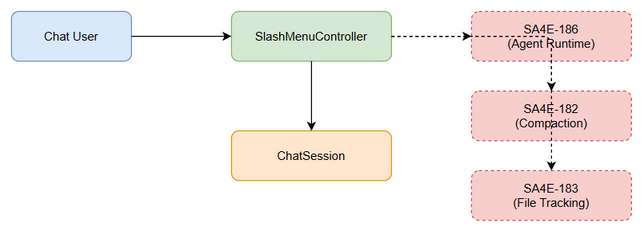

# Functional Specification Document (FSD)

## AI Chat Assistant (SA4E) — SA4E-191: Slash Commands (Tier 1)

---

## Document Information

| Field | Value |
|-------|-------|
| Jira Ticket | SA4E-191 |
| Title | Slash Commands (Tier 1) — /agents, /compact, /diff, /models, /new, /review, /undo |
| Author | BA Agent |
| Version | 1.0 |
| Date | 2026-08-23 |
| Status | Draft |
| Related BRD | documents/SA4E-191/BRD.md |

---

## Revision History

| Version | Date | Author | Changes |
|---------|------|--------|---------|
| 1.0 | 2026-08-23 | BA Agent | Initial draft — derived from BRD SA4E-191 and ticket context. |

---

## 1. Introduction

### 1.1 Purpose

This Functional Specification Document (FSD) specifies the functional behavior of the **Tier 1** set of seven (7) slash commands delivered by ticket **SA4E-191** within the AI Chat Assistant (SA4E). For each command it defines the use case (pre/post-conditions, main flow, alternative and exception flows), business rules, data specifications (input/output), UI specifications, and a functional API contract (trigger, parameters, output data, business error scenarios). It also specifies the logical data model, integration contracts with the three blocking dependencies (SA4E-182, SA4E-183, SA4E-186), processing logic, security, non-functional requirements, and test considerations.

The seven commands are: `/agents`, `/compact`, `/diff`, `/models`, `/new`, `/review`, and `/undo`.

### 1.2 Scope

This FSD covers the functional behavior of the slash command surface registered in the `SlashMenuController` and the command handlers that execute the seven Tier-1 commands. It is derived from the BRD (`documents/SA4E-191/BRD.md`) Section 1.2 scope statement.

In scope:
- Registration of exactly seven command descriptors in `SlashMenuController`.
- Behavior of each command's handler, including UI panels (agent selector, model picker, diff viewer) and confirmation dialogs.
- State changes to the `ChatSession` (active agent, active model, reset) and optional file reverts.
- Functional integration contracts with SA4E-182, SA4E-183, SA4E-186.

Out of scope (per BRD §1.3): Tier-2+ commands, implementation of the underlying engines (compaction, file-change tracking, agent routing), authentication/session infrastructure, and localization.

### 1.3 Definitions & Acronyms

| Term | Definition |
|------|------------|
| SlashMenuController | The UI controller that registers, renders, and dispatches slash commands on the `/` trigger. |
| ChatSession | A single conversational context holding active agent, active model, context reference, and history reference. |
| CommandHandler | The functional unit bound to a command descriptor that executes the command's behavior. |
| DiffEntry | A record of a single file change (path, before/after hash, status) tracked per session. |
| ModelChoice | A selectable LLM model descriptor (label, provider, default flag) persisted per user/session. |
| TDD | Technical Design Document (downstream of this FSD). |

### 1.4 References

| Document | Location |
|----------|----------|
| BRD | documents/SA4E-191/BRD.md |
| Jira SA4E-191 | Slash Commands (Tier 1) ticket |
| Jira SA4E-182 | Compact Session (compaction engine) |
| Jira SA4E-183 | File Change Tracking (diff engine) |
| Jira SA4E-186 | Agent Runtime Routing |

---

## 2. System Overview

### 2.1 System Context Diagram



The `SlashMenuController` is the single entry point for all Tier-1 commands. When the user types `/` in the chat input, the controller intercepts the keystroke and renders the command menu. Each menu entry maps to a registered `CommandHandler`. The chat session (held by the host shell) provides the active agent, active model, and conversation history that handlers consume.

Three external systems are invoked on demand by the relevant handlers:
- **SA4E-186 (Agent Runtime Routing)** — provides the agent list to `/agents`.
- **SA4E-182 (Compaction Service)** — performs context summarization for `/compact`.
- **SA4E-183 (File Change Tracking)** — supplies `DiffEntry` records to `/diff` and accepts revert requests from `/undo`.

### 2.2 System Architecture

The slash command feature is a thin orchestration layer composed of:
1. **SlashMenuController** — renders menu, resolves shortcut hints, dispatches to handlers.
2. **CommandHandlers** (7) — one per command; each performs localized state mutations and/or calls a dependency.
3. **ChatSession** — shared state object (activeAgentId, activeModelId, contextRef, historyRef).
4. **Dependency adapters** — call-out wrappers to SA4E-182/183/186 with functional contracts (Section 5).

No local persistence is introduced beyond the existing user preferences store (for `/models`) and the session store (for `/new` reset and `/undo` exchange tracking). The compaction and diff engines remain owned by their respective tickets.

---

## 3. Functional Requirements

### 3.1 Feature: /agents (Switch Active Agent)

**Source:** BRD US-01

#### 3.1.1 Description

`/agents` opens an agent selector listing all agents available from the SA4E-186 runtime routing layer. Selecting an agent sets it as the active agent for subsequent turns in the current session. This command cannot function if SA4E-186 is unavailable.

#### 3.1.2 Use Case

**Use Case ID:** UC-1
**Actor:** Chat User (session owner)
**Preconditions:** An authenticated session exists; the slash menu has been triggered; SA4E-186 routing is reachable.
**Postconditions:** The `ChatSession.activeAgentId` is updated to the selected agent; subsequent requests route to that agent.

**Main Flow:**

| Step | Actor | System | Description |
|------|-------|--------|-------------|
| 1 | Types `/agents` or presses `Ctrl/Cmd+Shift+A` | | User invokes the command. |
| 2 | | SlashMenuController | Resolves handler and requests agent list from SA4E-186. |
| 3 | | CommandHandler | Renders the agent selector populated with `availableAgents`. |
| 4 | Selects an agent from the list | | User picks a valid agent. |
| 5 | | CommandHandler | Sets `ChatSession.activeAgentId = selectedAgentId`. |
| 6 | | | Confirmation toast: "Active agent switched to {agent}." |

**Alternative Flows:**

| ID | Condition | Steps |
|----|-----------|-------|
| AF-1 | User cancels the selector (Esc / click outside) | No change to active agent; menu closes silently. |
| AF-2 | User continues typing to filter the agent list | Selector filters entries by substring match before selection. |

**Exception Flows:**

| ID | Condition | Steps |
|----|-----------|-------|
| EF-1 | SA4E-186 routing unavailable | Handler disables the command; inline error: "Agent switching is temporarily unavailable." |
| EF-2 | Selected agent not in `availableAgents` | Selection rejected; validation message shown; re-prompt. |

#### 3.1.3 Business Rules

| Rule ID | Rule | Source |
|---------|------|--------|
| BR-1 | Each command is registered exactly once in SlashMenuController. | BRD §1.4 / ticket |
| BR-2 | Shortcut hints are unique across all commands. | BRD §1.4 / ticket |
| BR-7 | `/agents` switch routes to a runtime provided by SA4E-186. | BRD US-01 |

#### 3.1.4 Data Specifications

**Input Data:**

| Field | Type | Required | Validation | Description |
|-------|------|----------|------------|-------------|
| selectedAgentId | String | Y | Must exist in `availableAgents` | Identifier of chosen agent. |
| availableAgents | List<String> | Y | Non-empty when routing healthy | Agent IDs from SA4E-186. |

**Output Data:**

| Field | Type | Description |
|-------|------|-------------|
| activeAgentId | String | Updated active agent on the session. |
| confirmationMessage | String | User-facing confirmation text. |

#### 3.1.5 UI Specifications

| No. | Element | Type | Required | Behavior | Validation |
|-----|---------|------|----------|----------|------------|
| 1 | Menu entry `/agents` | MenuItem | Y | Triggers selector on click/shortcut. | Disabled if SA4E-186 down. |
| 2 | Agent selector panel | Panel | Y | Lists agents with icon + name. | Only entries from `availableAgents`. |
| 3 | Filter input | Text | N | Filters the agent list. | Substring match. |
| 4 | Confirmation toast | Toast | Y | Shows switch result. | — |

#### 3.1.6 API Contract (Functional View)

**Trigger:** `/agents` command invocation (menu or `Ctrl/Cmd+Shift+A`).
**Input Parameters:**

| Parameter | Type | Required | Business Rule | Description |
|-----------|------|----------|---------------|-------------|
| selectedAgentId | String | Y | BR-7 | Agent chosen by user. |

**Output Data:**

| Field | Type | Description |
|-------|------|-------------|
| activeAgentId | String | Newly active agent. |

**Business Error Scenarios:**

| Scenario | User Message | Trigger Condition |
|----------|-------------|-------------------|
| Routing unavailable | "Agent switching is temporarily unavailable." | SA4E-186 not reachable (EF-1). |
| Invalid selection | "Selected agent is not available." | selectedAgentId not in list (EF-2). |

#### 3.1.7 Technical API Contract (`/agents`)

<!-- TA enrichment -->

**Trigger / Command Dispatch**
- **Registration key (command id):** `"agents"` — registered in `SlashMenuController` via `registry.register({ id: "agents", label: "/agents", shortcut: "Ctrl/Cmd+Shift+A", handlerKey: "agents", requiresOwner: false })`.
- **Invocation sources:** (a) typing `/agents` + Enter; (b) selecting the menu entry; (c) keyboard shortcut `Ctrl/Cmd+Shift+A`.
- **Dispatch (`SlashMenuController`):**
  ```
  onCommand(token, rawInput, session):
      descriptor = registry.resolve(token)            // by command id
      if descriptor == null: return unknownCommand()
      if descriptor.requiresOwner and session.userId != session.ownerId:
          return disabled("Permission denied.")
      handler = handlerFactory.create(descriptor.handlerKey)
      ctx = buildContext(session, parseArgs(rawInput))
      if rateLimiter.allow(session.sessionId, descriptor.id) == false:
          return error(429, "Too many requests, please wait.")
      return withTimeout(handler.execute(ctx), 5000)   // 5s
  ```

**Request schema** (payload delivered to `AgentsCommandHandler.execute`):
```json
{
  "commandId": "agents",
  "sessionId": "sess_8f2a1c",
  "userId": "usr_12",
  "ownerId": "usr_12",
  "chatSession": {
    "id": "sess_8f2a1c",
    "activeAgentId": "agent_default",
    "activeModelId": "model_gpt4o",
    "contextRef": "ctx_99",
    "historyRef": "hist_99"
  },
  "args": {},
  "source": "menu"
}
```

**Response schema** (returned to UI layer):
```json
{
  "status": "ok",
  "commandId": "agents",
  "result": {
    "activeAgentId": "agent_coder",
    "availableAgents": ["agent_default", "agent_coder", "agent_reviewer"],
    "confirmationMessage": "Active agent switched to agent_coder."
  },
  "uiAction": { "type": "toast", "message": "Active agent switched to agent_coder." }
}
```
Error variant:
```json
{
  "status": "error",
  "commandId": "agents",
  "error": {
    "code": "AGENT_ROUTING_UNAVAILABLE",
    "userMessage": "Agent switching is temporarily unavailable.",
    "retryable": true
  }
}
```

**Auth:** Requires an authenticated session. `requiresOwner = false` — any authenticated user may switch the active agent of their own session.

**Rate limit / Timeout:**
- Rate limit: **20 requests/minute per `sessionId`** (token-bucket). Surplus → inline `"Too many requests, please wait."`.
- Timeout: **5 s** (covers the SA4E-186 `listAgents()` call per §5.4.1). On timeout → EF-1 behavior (keep current agent, show error).

---

### 3.2 Feature: /compact (Compact Session)

**Source:** BRD US-02

#### 3.2.1 Description

`/compact` triggers the SA4E-182 CompactionService to summarize and compress the current session context while preserving conversational intent. A confirmation is requested when the session exceeds a configurable token threshold.

#### 3.2.2 Use Case

**Use Case ID:** UC-2
**Actor:** Chat User (session owner)
**Preconditions:** Authenticated session; session has at least one message; SA4E-182 reachable.
**Postconditions:** `ChatSession.contextRef` points to a compacted summary; an indicator confirms compaction.

**Main Flow:**

| Step | Actor | System | Description |
|------|-------|--------|-------------|
| 1 | Invokes `/compact` (`Ctrl/Cmd+Shift+C`) | | User requests compaction. |
| 2 | | CommandHandler | Checks session token count. |
| 3 | | | If above threshold, shows confirmation dialog. |
| 4 | Confirms compaction | | User accepts. |
| 5 | | CommandHandler | Calls SA4E-182 CompactionService with `sessionId`. |
| 6 | | | Session context replaced by summary; indicator shown. |

**Alternative Flows:**

| ID | Condition | Steps |
|----|-----------|-------|
| AF-1 | Session below threshold | Skip confirmation; compact directly. |
| AF-2 | User cancels confirmation | No compaction; menu closes. |

**Exception Flows:**

| ID | Condition | Steps |
|----|-----------|-------|
| EF-1 | SA4E-182 compaction fails | Show: "Session compaction failed. Please try again." |
| EF-2 | Empty session | Command reports "Nothing to compact." and exits. |

#### 3.2.3 Business Rules

| Rule ID | Rule | Source |
|---------|------|--------|
| BR-1 | Each command registered exactly once. | BRD §1.4 |
| BR-2 | Shortcut hints unique. | BRD §1.4 |

#### 3.2.4 Data Specifications

**Input Data:**

| Field | Type | Required | Validation | Description |
|-------|------|----------|------------|-------------|
| sessionId | String | Y | Valid active session | Session to compact. |
| compactionStrategy | String | N | Default = semantic summary | Strategy selection. |

**Output Data:**

| Field | Type | Description |
|-------|------|-------------|
| compactedSummaryRef | String | Reference to compacted context. |
| status | Enum | success/failed. |

#### 3.2.5 UI Specifications

| No. | Element | Type | Required | Behavior | Validation |
|-----|---------|------|----------|----------|------------|
| 1 | Menu entry `/compact` | MenuItem | Y | Triggers compaction. | Disabled if SA4E-182 down. |
| 2 | Confirmation dialog | Dialog | N | Shown above threshold. | Requires explicit confirm. |
| 3 | Compaction indicator | Badge | Y | Shows "Compacted" state. | — |

#### 3.2.6 API Contract (Functional View)

**Trigger:** `/compact` invocation.
**Input Parameters:**

| Parameter | Type | Required | Business Rule | Description |
|-----------|------|----------|---------------|-------------|
| sessionId | String | Y | BR-1 | Session identifier. |

**Output Data:**

| Field | Type | Description |
|-------|------|-------------|
| compactedSummaryRef | String | New context reference. |

**Business Error Scenarios:**

| Scenario | User Message | Trigger Condition |
|----------|-------------|-------------------|
| Compaction failed | "Session compaction failed. Please try again." | SA4E-182 error (EF-1). |
| Empty session | "Nothing to compact." | No messages (EF-2). |

#### 3.2.7 Technical API Contract (`/compact`)

<!-- TA enrichment -->

**Trigger / Command Dispatch**
- **Registration key:** `"compact"` — `registry.register({ id: "compact", label: "/compact", shortcut: "Ctrl/Cmd+Shift+C", handlerKey: "compact", requiresOwner: false })`.
- **Invocation sources:** typed `/compact`, menu entry, or `Ctrl/Cmd+Shift+C`.
- **Dispatch:** same `onCommand` path as §3.1.7; `handlerKey = "compact"`; timeout 10 s (see §5.4.2).

**Request schema:**
```json
{
  "commandId": "compact",
  "sessionId": "sess_8f2a1c",
  "userId": "usr_12",
  "ownerId": "usr_12",
  "chatSession": {
    "id": "sess_8f2a1c",
    "activeAgentId": "agent_coder",
    "activeModelId": "model_gpt4o",
    "contextRef": "ctx_99",
    "historyRef": "hist_99"
  },
  "args": { "compactionStrategy": "semantic" },
  "source": "shortcut"
}
```

**Response schema:**
```json
{
  "status": "ok",
  "commandId": "compact",
  "result": {
    "compactedSummaryRef": "ctx_sum_77",
    "status": "success"
  },
  "uiAction": { "type": "badge", "label": "Compacted" }
}
```
Error variant:
```json
{
  "status": "error",
  "commandId": "compact",
  "error": { "code": "COMPACTION_FAILED", "userMessage": "Session compaction failed. Please try again.", "retryable": true }
}
```

**Auth:** Authenticated session required; `requiresOwner = false`.

**Rate limit / Timeout:**
- Rate limit: **20 req/min per `sessionId`**.
- Timeout: **10 s** (SA4E-182 call; no retry — see §5.4.2). On timeout/error → EF-1.

**Pseudocode — `CompactCommandHandler.execute`:**
```
function executeCompact(ctx):
    if isEmpty(ctx.chatSession.historyRef):
        return error("Nothing to compact.")            // EF-2
    tokenCount = estimateTokens(ctx.chatSession.contextRef)
    if tokenCount > COMPACTION_THRESHOLD:
        confirmed = promptConfirm("Compact session? Large context detected.")
        if not confirmed: return noop()                // AF-2
    summary = SA4E182.compact(ctx.chatSession.contextRef,
                              ctx.chatSession.historyRef)   // 10s, no retry
    if summary.failed:
        return error("Session compaction failed. Please try again.")  // EF-1
    ctx.chatSession.contextRef = summary.compactedSummaryRef
    emitAudit("compact", ctx)
    return ok({ compactedSummaryRef: summary.compactedSummaryRef,
                uiAction: { type: "badge", label: "Compacted" } })
```

---

### 3.3 Feature: /diff (Session Diff Viewer)

**Source:** BRD US-03

#### 3.3.1 Description

`/diff` opens a diff viewer that displays file changes tracked during the current session via SA4E-183. Per-file additions, modifications, and deletions are shown; entries may be collapsed/expanded. If no changes exist, an empty-state message is displayed.

#### 3.3.2 Use Case

**Use Case ID:** UC-3
**Actor:** Chat User (session owner)
**Preconditions:** Authenticated session; SA4E-183 tracking available.
**Postconditions:** Diff viewer displayed with `DiffEntry` records for the session.

**Main Flow:**

| Step | Actor | System | Description |
|------|-------|--------|-------------|
| 1 | Invokes `/diff` (`Ctrl/Cmd+Shift+D`) | | User requests diff. |
| 2 | | CommandHandler | Requests `DiffEntry` list for `sessionId` from SA4E-183. |
| 3 | | | Renders diff viewer grouped by file. |
| 4 | Expands/collapses a file entry | | User inspects changes. |

**Alternative Flows:**

| ID | Condition | Steps |
|----|-----------|-------|
| AF-1 | No file changes | Viewer shows empty-state message "No file changes in this session." |

**Exception Flows:**

| ID | Condition | Steps |
|----|-----------|-------|
| EF-1 | SA4E-183 data missing/unavailable | Show: "No change tracking data available for this session." |

#### 3.3.3 Business Rules

| Rule ID | Rule | Source |
|---------|------|--------|
| BR-1 | Each command registered exactly once. | BRD §1.4 |
| BR-2 | Shortcut hints unique. | BRD §1.4 |

#### 3.3.4 Data Specifications

**Input Data:**

| Field | Type | Required | Validation | Description |
|-------|------|----------|------------|-------------|
| sessionId | String | Y | Valid session | Session whose changes are shown. |

**Output Data:**

| Field | Type | Description |
|-------|------|-------------|
| changedFiles | List<DiffEntry> | File diffs with before/after. |

#### 3.3.5 UI Specifications

| No. | Element | Type | Required | Behavior | Validation |
|-----|---------|------|----------|----------|------------|
| 1 | Menu entry `/diff` | MenuItem | Y | Opens diff viewer. | Disabled if SA4E-183 down. |
| 2 | Diff viewer panel | Panel | Y | Lists files + status. | Empty state if none. |
| 3 | File entry (collapsible) | Accordion | Y | Expand/collapse content. | — |

#### 3.3.6 API Contract (Functional View)

**Trigger:** `/diff` invocation.
**Input Parameters:**

| Parameter | Type | Required | Business Rule | Description |
|-----------|------|----------|---------------|-------------|
| sessionId | String | Y | BR-1 | Session identifier. |

**Output Data:**

| Field | Type | Description |
|-------|------|-------------|
| changedFiles | List<DiffEntry> | Diff records. |

**Business Error Scenarios:**

| Scenario | User Message | Trigger Condition |
|----------|-------------|-------------------|
| Tracking unavailable | "No change tracking data available for this session." | SA4E-183 missing (EF-1). |
| No changes | "No file changes in this session." | Empty list (AF-1). |

#### 3.3.7 Technical API Contract (`/diff`)

<!-- TA enrichment -->

**Trigger / Command Dispatch**
- **Registration key:** `"diff"` — `registry.register({ id: "diff", label: "/diff", shortcut: "Ctrl/Cmd+Shift+D", handlerKey: "diff", requiresOwner: false })`.
- **Dispatch:** `onCommand` path; `handlerKey = "diff"`; timeout 3 s (SA4E-183 query, §5.4.3).

**Request schema:**
```json
{
  "commandId": "diff",
  "sessionId": "sess_8f2a1c",
  "userId": "usr_12",
  "ownerId": "usr_12",
  "chatSession": { "id": "sess_8f2a1c", "historyRef": "hist_99", "contextRef": "ctx_99", "activeAgentId": "agent_coder", "activeModelId": "model_gpt4o" },
  "args": {},
  "source": "menu"
}
```

**Response schema:**
```json
{
  "status": "ok",
  "commandId": "diff",
  "result": {
    "changedFiles": [
      { "id": "d1", "sessionId": "sess_8f2a1c", "filePath": "src/app.ts", "beforeHash": "a1", "afterHash": "b2", "status": "modified" }
    ]
  },
  "uiAction": { "type": "panel", "panel": "diffViewer" }
}
```
Error / empty variants:
```json
{ "status": "error", "commandId": "diff", "error": { "code": "TRACKING_UNAVAILABLE", "userMessage": "No change tracking data available for this session." } }
{ "status": "ok", "commandId": "diff", "result": { "changedFiles": [], "uiAction": { "type": "panel", "panel": "diffViewer", "emptyState": "No file changes in this session." } } }
```

**Auth:** Authenticated session required; `requiresOwner = false`.

**Rate limit / Timeout:**
- Rate limit: **20 req/min per `sessionId`**.
- Timeout: **3 s** (SA4E-183 `query`, §5.4.3). On failure → EF-1 empty-state error.

---

### 3.4 Feature: /models (Switch LLM Model)

**Source:** BRD US-04

#### 3.4.1 Description

`/models` opens a model picker listing available LLM models. Selecting a model sets it as the active model and **persists the choice** to user preferences so future sessions default to it. On load, the persisted value is validated against the current model registry.

#### 3.4.2 Use Case

**Use Case ID:** UC-4
**Actor:** Chat User (session owner)
**Preconditions:** Authenticated session; model registry populated.
**Postconditions:** `ChatSession.activeModelId` updated and `persistedModelId` stored in user preferences.

**Main Flow:**

| Step | Actor | System | Description |
|------|-------|--------|-------------|
| 1 | Invokes `/models` (`Ctrl/Cmd+Shift+M`) | | User opens picker. |
| 2 | | CommandHandler | Renders model picker from registry. |
| 3 | Selects a model | | User picks a model. |
| 4 | | CommandHandler | Sets active model and persists choice. |
| 5 | | | Confirmation: "Model set to {model} (saved)." |

**Alternative Flows:**

| ID | Condition | Steps |
|----|-----------|-------|
| AF-1 | User cancels picker | No change; closes. |

**Exception Flows:**

| ID | Condition | Steps |
|----|-----------|-------|
| EF-1 | Persistence failure | Warn: "Model preference could not be saved, but is active for this session." |
| EF-2 | Persisted model invalid on load | Fall back to default model; notify user. |

#### 3.4.3 Business Rules

| Rule ID | Rule | Source |
|---------|------|--------|
| BR-1 | Each command registered exactly once. | BRD §1.4 |
| BR-2 | Shortcut hints unique. | BRD §1.4 |
| BR-6 | `/models` choice persisted per session/user. | BRD US-04 |

#### 3.4.4 Data Specifications

**Input Data:**

| Field | Type | Required | Validation | Description |
|-------|------|----------|------------|-------------|
| selectedModelId | String | Y | Must be in model registry | Chosen model. |

**Output Data:**

| Field | Type | Description |
|-------|------|-------------|
| activeModelId | String | Active model for session. |
| persistedModelId | String | Stored preference. |

#### 3.4.5 UI Specifications

| No. | Element | Type | Required | Behavior | Validation |
|-----|---------|------|----------|----------|------------|
| 1 | Menu entry `/models` | MenuItem | Y | Opens picker. | Always enabled. |
| 2 | Model picker dropdown | Dropdown | Y | Lists models + provider. | Only registry models. |
| 3 | Saved indicator | Toast | Y | Confirms persistence. | — |

#### 3.4.6 API Contract (Functional View)

**Trigger:** `/models` invocation.
**Input Parameters:**

| Parameter | Type | Required | Business Rule | Description |
|-----------|------|----------|---------------|-------------|
| selectedModelId | String | Y | BR-6 | Model chosen. |

**Output Data:**

| Field | Type | Description |
|-------|------|-------------|
| persistedModelId | String | Saved preference. |

**Business Error Scenarios:**

| Scenario | User Message | Trigger Condition |
|----------|-------------|-------------------|
| Save failed | "Model preference could not be saved, but is active for this session." | Persistence error (EF-1). |
| Invalid persisted model | "Saved model unavailable; using default." | Load-time validation (EF-2). |

#### 3.4.7 Technical API Contract (`/models`)

<!-- TA enrichment -->

**Trigger / Command Dispatch**
- **Registration key:** `"models"` — `registry.register({ id: "models", label: "/models", shortcut: "Ctrl/Cmd+Shift+M", handlerKey: "models", requiresOwner: false })`.
- **Dispatch:** `onCommand` path; `handlerKey = "models"`; model registry read is local (cached, see NFR-04-T), so no external timeout.

**Request schema:**
```json
{
  "commandId": "models",
  "sessionId": "sess_8f2a1c",
  "userId": "usr_12",
  "ownerId": "usr_12",
  "chatSession": { "id": "sess_8f2a1c", "activeModelId": "model_gpt4o", "activeAgentId": "agent_coder", "contextRef": "ctx_99", "historyRef": "hist_99" },
  "args": { "selectedModelId": "model_claude" },
  "source": "menu"
}
```

**Response schema:**
```json
{
  "status": "ok",
  "commandId": "models",
  "result": {
    "activeModelId": "model_claude",
    "persistedModelId": "model_claude"
  },
  "uiAction": { "type": "toast", "message": "Model set to model_claude (saved)." }
}
```
Error variant (persistence failure):
```json
{ "status": "error", "commandId": "models", "error": { "code": "PREF_PERSIST_FAILED", "userMessage": "Model preference could not be saved, but is active for this session.", "retryable": false } }
```

**Auth:** Authenticated session required; `requiresOwner = false`. Choice persisted against `userId` (BR-6).

**Rate limit / Timeout:**
- Rate limit: **20 req/min per `sessionId`**.
- Timeout: local operation, **< 50 ms**; persistence write best-effort with EF-1 fallback.

---

### 3.5 Feature: /new (New Session)

**Source:** BRD US-05

#### 3.5.1 Description

`/new` starts a fresh session: it resets the chat (clears visible messages) and clears accumulated context. A mandatory confirmation step prevents accidental loss of the current conversation.

#### 3.5.2 Use Case

**Use Case ID:** UC-5
**Actor:** Chat User (session owner)
**Preconditions:** Authenticated session (may have existing messages).
**Postconditions:** A new empty `ChatSession` created; previous chat cleared; context reset.

**Main Flow:**

| Step | Actor | System | Description |
|------|-------|--------|-------------|
| 1 | Invokes `/new` (`Ctrl/Cmd+Shift+N`) | | User requests new session. |
| 2 | | CommandHandler | Shows confirmation dialog. |
| 3 | Confirms "Start new session" | | User accepts. |
| 4 | | CommandHandler | Clears messages, resets context, creates new session. |
| 5 | | | Empty chat view presented. |

**Alternative Flows:**

| ID | Condition | Steps |
|----|-----------|-------|
| AF-1 | User cancels confirmation | No reset; current session retained. |

**Exception Flows:**

| ID | Condition | Steps |
|----|-----------|-------|
| EF-1 | Reset fails mid-operation | Restore previous session state; alert user. |

#### 3.5.3 Business Rules

| Rule ID | Rule | Source |
|---------|------|--------|
| BR-1 | Each command registered exactly once. | BRD §1.4 |
| BR-2 | Shortcut hints unique. | BRD §1.4 |
| BR-3 | `/new` requires explicit confirmation. | BRD US-05 |

#### 3.5.4 Data Specifications

**Input Data:**

| Field | Type | Required | Validation | Description |
|-------|------|----------|------------|-------------|
| confirmReset | Boolean | Y | Must be true | User confirmation flag. |

**Output Data:**

| Field | Type | Description |
|-------|------|-------------|
| newSessionId | String | Identifier of the new session. |

#### 3.5.5 UI Specifications

| No. | Element | Type | Required | Behavior | Validation |
|-----|---------|------|----------|----------|------------|
| 1 | Menu entry `/new` | MenuItem | Y | Triggers confirmation. | Always enabled. |
| 2 | Confirmation dialog | Dialog | Y | "Start a new session? Current chat will be cleared." | Confirm mandatory (BR-3). |

#### 3.5.6 API Contract (Functional View)

**Trigger:** `/new` invocation.
**Input Parameters:**

| Parameter | Type | Required | Business Rule | Description |
|-----------|------|----------|---------------|-------------|
| confirmReset | Boolean | Y | BR-3 | Must be true to proceed. |

**Output Data:**

| Field | Type | Description |
|-------|------|-------------|
| newSessionId | String | New session reference. |

**Business Error Scenarios:**

| Scenario | User Message | Trigger Condition |
|----------|-------------|-------------------|
| Reset failed | "Session reset failed; previous chat restored." | Mid-op failure (EF-1). |
| No confirmation | (no action) | confirmReset=false (AF-1). |

#### 3.5.7 Technical API Contract (`/new`)

<!-- TA enrichment -->

**Trigger / Command Dispatch**
- **Registration key:** `"new"` — `registry.register({ id: "new", label: "/new", shortcut: "Ctrl/Cmd+Shift+N", handlerKey: "new", requiresOwner: false })`.
- **Dispatch:** `onCommand` path; `handlerKey = "new"`; local session-store operation (no external dependency).

**Request schema:**
```json
{
  "commandId": "new",
  "sessionId": "sess_8f2a1c",
  "userId": "usr_12",
  "ownerId": "usr_12",
  "chatSession": { "id": "sess_8f2a1c", "activeAgentId": "agent_coder", "activeModelId": "model_claude", "contextRef": "ctx_99", "historyRef": "hist_99" },
  "args": { "confirmReset": true },
  "source": "menu"
}
```

**Response schema:**
```json
{
  "status": "ok",
  "commandId": "new",
  "result": { "newSessionId": "sess_3b7e10" },
  "uiAction": { "type": "panel", "panel": "emptyChat" }
}
```
Error variant:
```json
{ "status": "error", "commandId": "new", "error": { "code": "RESET_FAILED", "userMessage": "Session reset failed; previous chat restored." } }
```

**Auth:** Authenticated session required; `requiresOwner = false`. Confirmation mandatory (BR-3) — `args.confirmReset` must be `true`.

**Rate limit / Timeout:**
- Rate limit: **20 req/min per `sessionId`**.
- Timeout: local, **< 100 ms**; on mid-op failure restore prior session (EF-1).

---

### 3.6 Feature: /review (Code Review via Agent)

**Source:** BRD US-06

#### 3.6.1 Description

`/review` invokes a dedicated review agent using the current branch diff. The agent streams findings (issues, suggestions) into the conversation. This command is **owner-only** and disabled when no branch diff is available.

#### 3.6.2 Use Case

**Use Case ID:** UC-6
**Actor:** Chat User (session owner — required)
**Preconditions:** Authenticated owner session; VCS branch diff available; review agent reachable via SA4E-186.
**Postconditions:** Review findings streamed into conversation for the current branch.

**Main Flow:**

| Step | Actor | System | Description |
|------|-------|--------|-------------|
| 1 | Invokes `/review` (`Ctrl/Cmd+Shift+R`) | | Owner requests review. |
| 2 | | CommandHandler | Captures current branch diff (branchName, branchDiff). |
| 3 | | | Dispatches diff to review agent via SA4E-186. |
| 4 | | Review agent | Analyzes diff; streams findings. |
| 5 | | | Findings displayed in conversation. |

**Alternative Flows:**

| ID | Condition | Steps |
|----|-----------|-------|
| AF-1 | No prior findings / empty diff | Agent reports "No issues found." |

**Exception Flows:**

| ID | Condition | Steps |
|----|-----------|-------|
| EF-1 | Diff unavailable | Show: "Unable to obtain branch diff for review." |
| EF-2 | Review agent unavailable | Show: "Review agent is currently unavailable." |
| EF-3 | Non-owner invocation | Command disabled / "Permission denied." |

#### 3.6.3 Business Rules

| Rule ID | Rule | Source |
|---------|------|--------|
| BR-1 | Each command registered exactly once. | BRD §1.4 |
| BR-2 | Shortcut hints unique. | BRD §1.4 |
| BR-5 | `/review` and `/undo` require authenticated session owner. | BRD US-06 |

#### 3.6.4 Data Specifications

**Input Data:**

| Field | Type | Required | Validation | Description |
|-------|------|----------|------------|-------------|
| branchName | String | Y | Valid VCS branch | Current branch. |
| branchDiff | String | Y | Non-empty diff | Diff vs. base. |
| requesterId | String | Y | Must equal session owner | Owner check (BR-5). |

**Output Data:**

| Field | Type | Description |
|-------|------|-------------|
| reviewFindings | List<String> | Issues/suggestions streamed. |

#### 3.6.5 UI Specifications

| No. | Element | Type | Required | Behavior | Validation |
|-----|---------|------|----------|----------|------------|
| 1 | Menu entry `/review` | MenuItem | Y | Triggers review. | Disabled if no diff / non-owner. |
| 2 | Review progress indicator | Spinner | Y | Shows analysis in progress. | — |
| 3 | Findings block | Chat block | Y | Streamed results. | — |

#### 3.6.6 API Contract (Functional View)

**Trigger:** `/review` invocation (owner only).
**Input Parameters:**

| Parameter | Type | Required | Business Rule | Description |
|-----------|------|----------|---------------|-------------|
| branchName | String | Y | BR-5 | Branch name. |
| branchDiff | String | Y | BR-5 | Diff content. |

**Output Data:**

| Field | Type | Description |
|-------|------|-------------|
| reviewFindings | List<String> | Findings. |

**Business Error Scenarios:**

| Scenario | User Message | Trigger Condition |
|----------|-------------|-------------------|
| No diff | "Unable to obtain branch diff for review." | Diff retrieval fails (EF-1). |
| Agent down | "Review agent is currently unavailable." | Agent unreachable (EF-2). |
| Permission denied | "Permission denied." | Non-owner (EF-3 / BR-5). |

#### 3.6.7 Technical API Contract (`/review`)

<!-- TA enrichment -->

**Trigger / Command Dispatch**
- **Registration key:** `"review"` — `registry.register({ id: "review", label: "/review", shortcut: "Ctrl/Cmd+Shift+R", handlerKey: "review", requiresOwner: true })`.
- **Dispatch:** `onCommand` path; because `requiresOwner = true`, `SlashMenuController` short-circuits with `"Permission denied."` when `session.userId != session.ownerId` (EF-3 / BR-5) before the handler runs. Timeout 5 s (SA4E-186 resolve, §5.4.1).

**Request schema:**
```json
{
  "commandId": "review",
  "sessionId": "sess_8f2a1c",
  "userId": "usr_12",
  "ownerId": "usr_12",
  "chatSession": { "id": "sess_8f2a1c", "activeAgentId": "agent_reviewer", "activeModelId": "model_gpt4o", "contextRef": "ctx_99", "historyRef": "hist_99" },
  "args": { "branchName": "feature/x", "branchDiff": "diff --git ..." },
  "source": "menu"
}
```

**Response schema** (streamed):
```json
{
  "status": "ok",
  "commandId": "review",
  "result": {
    "reviewFindings": [
      "Line 42: possible null dereference.",
      "Consider extracting method doWork()."
    ]
  },
  "uiAction": { "type": "chatBlock", "streaming": true }
}
```
Error variants:
```json
{ "status": "error", "commandId": "review", "error": { "code": "BRANCH_DIFF_UNAVAILABLE", "userMessage": "Unable to obtain branch diff for review." } }
{ "status": "error", "commandId": "review", "error": { "code": "REVIEW_AGENT_UNAVAILABLE", "userMessage": "Review agent is currently unavailable." } }
{ "status": "error", "commandId": "review", "error": { "code": "PERMISSION_DENIED", "userMessage": "Permission denied." } }
```

**Auth:** Authenticated session **and session owner** required (`requiresOwner = true`, BR-5). Non-owner → command disabled + EF-3.

**Rate limit / Timeout:**
- Rate limit: **20 req/min per `sessionId`** (owner-scoped).
- Timeout: **5 s** for review-agent resolution; diff retrieval via VCS API should complete within this budget. On timeout → EF-2.

**Pseudocode — `ReviewCommandHandler.execute`:**
```
function executeReview(ctx):
    if ctx.userId != ctx.ownerId:
        return error("Permission denied.")                 // EF-3 / BR-5
    diff = VCS.getBranchDiff(ctx.args.branchName)          // may throw
    if diff == null or diff.empty:
        return error("Unable to obtain branch diff for review.")   // EF-1
    agent = SA4E186.resolve("review_agent")                // BR-7 routing, 5s
    if agent == null:
        return error("Review agent is currently unavailable.")     // EF-2
    report = agent.analyze(diff)                           // streamed findings
    emitAudit("review", ctx)
    return stream(report)                                  // reviewFindings
```

---

### 3.7 Feature: /undo (Undo Last Exchange)

**Source:** BRD US-07

#### 3.7.1 Description

`/undo` removes the last user + agent message pair from the conversation. If that exchange produced file changes (tracked by SA4E-183), the user is prompted whether to revert them; on confirmation the changes are reverted. This command is **owner-only** and is a no-op with a message when no prior exchange exists.

#### 3.7.2 Use Case

**Use Case ID:** UC-7
**Actor:** Chat User (session owner — required)
**Preconditions:** Authenticated owner session; at least one prior exchange exists.
**Postconditions:** Last exchange removed; optionally associated file changes reverted.

**Main Flow:**

| Step | Actor | System | Description |
|------|-------|--------|-------------|
| 1 | Invokes `/undo` (`Ctrl/Cmd+Shift+U`) | | Owner requests undo. |
| 2 | | CommandHandler | Locates last exchange via `lastExchangeId`. |
| 3 | | | If file changes exist, prompts revert confirmation. |
| 4 | Confirms revert (optional) | | User decides. |
| 5 | | CommandHandler | Removes exchange pair; reverts files if confirmed. |
| 6 | | | Confirmation: "Last exchange undone." |

**Alternative Flows:**

| ID | Condition | Steps |
|----|-----------|-------|
| AF-1 | No file changes for exchange | Skip revert prompt; just remove pair. |
| AF-2 | User declines revert | Remove pair only; keep files. |

**Exception Flows:**

| ID | Condition | Steps |
|----|-----------|-------|
| EF-1 | No prior exchange | Show: "Nothing to undo." and exit. |
| EF-2 | File revert fails | Warn: "Exchange removed, but some file changes could not be reverted." |
| EF-3 | Non-owner invocation | Command disabled / "Permission denied." |

#### 3.7.3 Business Rules

| Rule ID | Rule | Source |
|---------|------|--------|
| BR-1 | Each command registered exactly once. | BRD §1.4 |
| BR-2 | Shortcut hints unique. | BRD §1.4 |
| BR-4 | `/undo` file-revert optional and restricted to session owner. | BRD US-07 |
| BR-5 | `/review` and `/undo` require authenticated session owner. | BRD US-07 |

#### 3.7.4 Data Specifications

**Input Data:**

| Field | Type | Required | Validation | Description |
|-------|------|----------|------------|-------------|
| lastExchangeId | String | Y | Valid exchange in session | Exchange to remove. |
| revertFileChanges | Boolean | N | Default false | Whether to revert files. |
| requesterId | String | Y | Must equal owner | Owner check (BR-5). |

**Output Data:**

| Field | Type | Description |
|-------|------|-------------|
| removedExchangeId | String | Removed exchange. |
| revertedFiles | List<String> | Files reverted (if any). |

#### 3.7.5 UI Specifications

| No. | Element | Type | Required | Behavior | Validation |
|-----|---------|------|----------|----------|------------|
| 1 | Menu entry `/undo` | MenuItem | Y | Triggers undo. | Disabled if no exchange / non-owner. |
| 2 | Revert prompt dialog | Dialog | N | Shown only if file changes exist. | Requires confirm (BR-4). |

#### 3.7.6 API Contract (Functional View)

**Trigger:** `/undo` invocation (owner only).
**Input Parameters:**

| Parameter | Type | Required | Business Rule | Description |
|-----------|------|----------|---------------|-------------|
| lastExchangeId | String | Y | BR-4 | Exchange to remove. |
| revertFileChanges | Boolean | N | BR-4 | Revert flag. |

**Output Data:**

| Field | Type | Description |
|-------|------|-------------|
| removedExchangeId | String | Removed exchange. |

**Business Error Scenarios:**

| Scenario | User Message | Trigger Condition |
|----------|-------------|-------------------|
| No exchange | "Nothing to undo." | Empty history (EF-1). |
| Revert failed | "Exchange removed, but some file changes could not be reverted." | SA4E-183 revert error (EF-2). |
| Permission denied | "Permission denied." | Non-owner (EF-3 / BR-5). |

#### 3.7.7 Technical API Contract (`/undo`)

<!-- TA enrichment -->

**Trigger / Command Dispatch**
- **Registration key:** `"undo"` — `registry.register({ id: "undo", label: "/undo", shortcut: "Ctrl/Cmd+Shift+U", handlerKey: "undo", requiresOwner: true })`.
- **Dispatch:** `onCommand` path; `requiresOwner = true` enforced by `SlashMenuController` (EF-3 / BR-5) before handler executes. No external hard timeout; SA4E-183 revert bounded by 3 s per entry (§5.4.3).

**Request schema:**
```json
{
  "commandId": "undo",
  "sessionId": "sess_8f2a1c",
  "userId": "usr_12",
  "ownerId": "usr_12",
  "chatSession": { "id": "sess_8f2a1c", "historyRef": "hist_99", "contextRef": "ctx_99", "activeAgentId": "agent_coder", "activeModelId": "model_claude" },
  "args": { "lastExchangeId": "exch_55", "revertFileChanges": true },
  "source": "menu"
}
```

**Response schema:**
```json
{
  "status": "ok",
  "commandId": "undo",
  "result": {
    "removedExchangeId": "exch_55",
    "revertedFiles": ["src/app.ts", "src/util.ts"]
  },
  "uiAction": { "type": "toast", "message": "Last exchange undone." }
}
```
Error / warning variants:
```json
{ "status": "error", "commandId": "undo", "error": { "code": "NOTHING_TO_UNDO", "userMessage": "Nothing to undo." } }
{ "status": "error", "commandId": "undo", "error": { "code": "PERMISSION_DENIED", "userMessage": "Permission denied." } }
{ "status": "ok", "commandId": "undo", "result": { "removedExchangeId": "exch_55", "revertedFiles": [], "warning": "Exchange removed, but some file changes could not be reverted." } }
```

**Auth:** Authenticated session **and session owner** required (`requiresOwner = true`, BR-4/BR-5). Non-owner → EF-3.

**Rate limit / Timeout:**
- Rate limit: **20 req/min per `sessionId`** (owner-scoped).
- Timeout: per-revert entry **3 s** (SA4E-183); overall handler should bound total revert time (e.g., cap at 30 s for ≤10 entries). On partial revert failure → EF-2 warning.

**Pseudocode — `UndoCommandHandler.execute`:**
```
function executeUndo(ctx):
    if ctx.userId != ctx.ownerId:
        return error("Permission denied.")                 // EF-3 / BR-5
    pair = findLastExchange(ctx.chatSession.historyRef)    // (userMsg, agentMsg)
    if pair == null:
        return error("Nothing to undo.")                   // EF-1
    diffs = SA4E183.queryDiffs(ctx.sessionId, pair.exchangeId)
    if diffs not empty and ctx.args.revertFileChanges:
        for entry in diffs:                                // guard owner-only
            ok = SA4E183.revert(entry)                     // 3s per entry
            if not ok: warning("some file changes not reverted")  // EF-2
    removeMessages(ctx.chatSession.historyRef, pair)       // both messages
    emitAudit("undo", ctx)
    return ok({ removedExchangeId: pair.exchangeId,
                revertedFiles: diffs.map(d => d.filePath) })
```

---

### 3.8 Consolidated Business Rules

| Rule ID | Rule | Source |
|---------|------|--------|
| BR-1 | Each command is registered exactly once in SlashMenuController. | BRD §1.4 / ticket |
| BR-2 | Shortcut hints must be unique across all commands. | BRD §1.4 / ticket |
| BR-3 | `/new` requires explicit confirmation before reset. | BRD US-05 |
| BR-4 | `/undo` file-revert is optional and restricted to the session owner. | BRD US-07 |
| BR-5 | `/review` and `/undo` require an authenticated session owner. | BRD US-06/US-07 |
| BR-6 | `/models` choice is persisted per session/user. | BRD US-04 |
| BR-7 | `/agents` switch routes to a runtime provided by SA4E-186. | BRD US-01 |

### 3.9 Implementation Notes (Technical Enrichment)

<!-- TA enrichment -->

> **TA Note:** BA's §3.8 is "Consolidated Business Rules". To avoid renumbering BA content, the technical implementation notes are placed as §3.9.

**Recommended module / file layout (framework-agnostic, TS-style):**
```
src/
  slash/
    registry.ts            // CommandRegistry: register()/resolve() by command id; holds descriptors
    SlashMenuController.ts // intercepts '/', renders menu, enforces owner/rate-limit, dispatches
    types.ts               // CommandContext, CommandResult, CommandHandler interface
    commands/
      agents.ts  compact.ts  diff.ts  models.ts  new.ts  review.ts  undo.ts
  chat/
    ChatSession.ts         // state object: activeAgentId, activeModelId, contextRef, historyRef
  deps/
    agentRouter.ts         // adapter to SA4E-186 (listAgents / resolve)
    compaction.ts          // adapter to SA4E-182 (compact)
    fileChange.ts          // adapter to SA4E-183 (query / revert)
```

**`CommandHandler` interface (contract every command module implements):**
```ts
interface CommandHandler {
  execute(ctx: CommandContext): CommandResult | Promise<CommandResult>;
}
interface CommandContext {
  commandId: string;
  sessionId: string;
  userId: string;
  ownerId: string;
  chatSession: ChatSession;
  args: Record<string, unknown>;
  source: "menu" | "shortcut" | "typed";
}
interface CommandResult {
  status: "ok" | "error";
  commandId: string;
  result?: unknown;
  error?: { code: string; userMessage: string; retryable?: boolean };
  uiAction?: { type: "toast" | "badge" | "dialog" | "panel" | "chatBlock"; [k: string]: unknown };
}
```

**`SlashMenuController` wiring:** register all 7 descriptors at chat-shell init; on `/` keydown open menu (virtualized list, debounced filter); on selection/Enter call `dispatch(token, ctx)`. Owner-only commands are disabled in the menu when `userId != ownerId`.

**Error-handling pattern:** each handler wraps logic in `try/catch`; map thrown exceptions to `CommandResult.error` with a stable `code` and the user-facing `userMessage` already specified in BA §9.1. Never surface raw stack traces to the UI. Rate-limit and timeout guards live in `SlashMenuController.dispatch` (see each §3.x.7).

**Logging / audit approach:** emit one structured audit event per invocation (success or failure), satisfying §7.3:
```json
{ "event": "slash.command", "userId": "usr_12", "command": "undo", "ts": "2026-08-23T10:00:00Z", "target": "sess_8f2a1c", "status": "ok" }
```
Retain 90 days (NFR / §7.3). Audit field `target` = affected session or resource id.

---

## 4. Data Model

> **Note:** Logical data model only; physical DDL is specified in the TDD §4.

### 4.1 Entity Relationship Diagram


### 4.2 Logical Entities

#### Entity: SlashCommand

| Attribute | Type | Required | Business Rule | Description |
|-----------|------|----------|---------------|-------------|
| id | String | Y | BR-1 | Unique command identifier. |
| name | String | Y | BR-1 | Command token, e.g., "agents". |
| description | String | Y | — | Human-readable description. |
| icon | String | Y | — | Icon key for menu entry. |
| shortcutHint | String | Y | BR-2 | Unique keyboard shortcut. |
| handlerKey | String | Y | — | Bound handler reference. |
| requiresOwner | Boolean | Y | BR-4, BR-5 | Owner-only flag. |
| category | String | Y | — | Menu grouping. |

#### Entity: ChatSession

| Attribute | Type | Required | Business Rule | Description |
|-----------|------|----------|---------------|-------------|
| id | String | Y | — | Session identifier. |
| activeAgentId | String | Y | BR-7 | Currently active agent. |
| activeModelId | String | Y | BR-6 | Currently active model. |
| contextRef | String | Y | — | Reference to session context. |
| historyRef | String | Y | — | Reference to message history. |

#### Entity: DiffEntry

| Attribute | Type | Required | Business Rule | Description |
|-----------|------|----------|---------------|-------------|
| id | String | Y | — | Diff record id. |
| sessionId | String | Y | — | Owning session. |
| filePath | String | Y | — | Affected file path. |
| beforeHash | String | N | — | Hash before change. |
| afterHash | String | N | — | Hash after change. |
| status | Enum | Y | — | added/modified/deleted. |

#### Entity: ModelChoice

| Attribute | Type | Required | Business Rule | Description |
|-----------|------|----------|---------------|-------------|
| id | String | Y | BR-6 | Model identifier. |
| label | String | Y | — | Display label. |
| provider | String | Y | — | Model provider. |
| isDefault | Boolean | Y | BR-6 | Default flag. |

#### Relationships

| From Entity | To Entity | Cardinality | Description |
|-------------|-----------|-------------|-------------|
| SlashCommand | ChatSession (usage) | 1:N | A command is invoked within many sessions. |
| ChatSession | DiffEntry | 1:N | A session tracks many file diffs. |
| ChatSession | ModelChoice | N:1 | A session references one chosen model. |

---

## 5. Integration Specifications

> **Note:** Business-view integration only; technical details in TDD §6.

### 5.1 External System: SA4E-186 (Agent Runtime Routing)

| Attribute | Value |
|-----------|-------|
| Purpose | Provide agent list and route requests to selected agent. |
| Direction | Bidirectional |
| Data Format | JSON |
| Frequency | On-demand |

**Data Exchange:**

| Our Data | External Data | Direction | Business Rule |
|----------|--------------|-----------|---------------|
| selectedAgentId | agentId | Send | BR-7 |
| availableAgents | agent list | Receive | BR-1/UC-1 |

### 5.2 External System: SA4E-182 (Compaction Service)

| Attribute | Value |
|-----------|-------|
| Purpose | Summarize/compress session context. |
| Direction | Outbound |
| Data Format | JSON |
| Frequency | On-demand |

**Data Exchange:**

| Our Data | External Data | Direction | Business Rule |
|----------|--------------|-----------|---------------|
| sessionId | compactedSummaryRef | Send/Receive | UC-2 |

### 5.3 External System: SA4E-183 (File Change Tracking)

| Attribute | Value |
|-----------|-------|
| Purpose | Provide and revert per-session file diffs. |
| Direction | Inbound (diff) / Outbound (revert) |
| Data Format | JSON |
| Frequency | Real-time (tracking) / On-demand (revert) |

**Data Exchange:**

| Our Data | External Data | Direction | Business Rule |
|----------|--------------|-----------|---------------|
| sessionId | DiffEntry list | Receive | UC-3 |
| revertFileChanges | revert result | Send | BR-4/UC-7 |

### 5.4 Technical Integration Details (TA Enrichment)

<!-- TA enrichment -->

Technical contracts for the three blocking dependencies. All transports are **in-process** (no network hop); resilience is provided by per-call timeouts, bounded retries, and a circuit breaker.

#### 5.4.1 SA4E-186 — Agent Runtime Routing
- **Transport:** in-process function call (DI-resolved service / direct module import). Operations: `AgentRouter.listAgents()` and `AgentRouter.resolve(agentId)`.
- **Timeout:** 5 s per call.
- **Retry:** 1 retry with 500 ms fixed backoff.
- **Fallback:** keep current agent unchanged; surface error to UI (EF-1 for `/agents`, EF-2 for `/review`); disable `/agents` and `/review` menu entries while unhealthy.
- **Circuit breaker:** OPEN after 3 consecutive failures; HALF-OPEN probe every 30 s; CLOSED on success.

#### 5.4.2 SA4E-182 — Compaction Service
- **Transport:** in-process call `CompactionService.compact(contextRef, historyRef)`.
- **Timeout:** 10 s.
- **Retry:** none — operation is an idempotent summarize; spec mandates no retry to avoid redundant summarization.
- **Fallback:** warn user "Session compaction failed / unavailable"; leave `contextRef` untouched.

#### 5.4.3 SA4E-183 — File Change Tracking
- **Transport:** in-process query `FileChangeTracker.query(sessionId, exchangeId?)` returning `DiffEntry[]`; revert via `FileChangeTracker.revert(entry)`.
- **Timeout:** 3 s for query (and per revert entry).
- **Retry:** query is read-only → optional 1 retry on transient error; revert is best-effort, partial failures reported (EF-2 for `/undo`).
- **Fallback:** if tracking unavailable, `/diff` shows EF-1 empty-state; `/undo` removes exchange but reports revert warning.

**Consolidated resilience matrix:**

| Dependency | Transport | Timeout | Retry | Fallback | Circuit Breaker |
|------------|-----------|---------|-------|----------|-----------------|
| SA4E-186 | in-process call | 5 s | 1 × 500 ms | keep agent; disable `/agents`,`/review` | OPEN after 3 fails; probe 30 s |
| SA4E-182 | in-process call | 10 s | none | warn; context untouched | optional (treat as degrade) |
| SA4E-183 | in-process query | 3 s | 1 (query only) | empty-state / revert warning | OPEN after 3 fails; probe 30 s |

---

## 6. Processing Logic

### 6.1 /undo Processing

**Trigger:** `/undo` command invoked by session owner.
**Input:** `lastExchangeId`, `revertFileChanges`, `requesterId`.
**Output:** `removedExchangeId`, `revertedFiles`.

**Processing Steps:**

| Step | Description | Error Handling |
|------|-------------|----------------|
| 1 | Verify requester is owner (BR-5). | If not owner → EF-3 permission denied. |
| 2 | Locate last exchange via `lastExchangeId`. | If none → EF-1 "Nothing to undo." |
| 3 | If file changes exist, prompt revert confirmation (BR-4). | On decline → skip revert (AF-2). |
| 4 | Remove user+agent message pair from history. | Restore on failure. |
| 5 | If confirmed, call SA4E-183 to revert files. | If fails → EF-2 warning. |

### 6.2 /new Processing

**Trigger:** `/new` command invoked.
**Input:** `confirmReset` (must be true — BR-3).
**Output:** `newSessionId`.

**Processing Steps:**

| Step | Description | Error Handling |
|------|-------------|----------------|
| 1 | Show confirmation dialog. | On cancel → AF-1 no reset. |
| 2 | On confirm, clear messages and reset context. | On failure → EF-1 restore. |
| 3 | Create new empty ChatSession. | — |

---

## 7. Security Requirements

### 7.1 Authentication & Authorization

| Role | Permissions | Screens/Features |
|------|-------------|-------------------|
| Chat User (any authenticated) | Execute | /agents, /compact, /diff, /models, /new |
| Session Owner ONLY | Execute | /review, /undo (BR-5, BR-4) |

### 7.2 Data Sensitivity Classification

| Data Type | Classification | Business Requirement |
|-----------|---------------|---------------------|
| Session history | Confidential | Accessible only to session owner. |
| File diffs (source) | Restricted | Revert and view restricted to owner (BR-4). |

### 7.3 Audit Trail

| Event | Logged Fields | Retention | Business Reason |
|-------|--------------|-----------|-----------------|
| Command invocation | userId, command, timestamp, target | 90 days | Traceability / NFR-03 security. |

---

## 8. Non-Functional Requirements

| Category | Business Requirement | Acceptance Criteria |
|----------|---------------------|---------------------|
| Performance | Menu open responsive | Slash menu opens < 100 ms of `/` (NFR-01). |
| Performance | Command execution responsive | Handler begins < 300 ms of selection (NFR-02). |
| Availability | Host-aligned uptime | 99.9% availability (NFR-05). |
| Scalability | Concurrent sessions | Supports many sessions without degradation (NFR-04). |
| Data Retention | Audit logs | Command audit logs retained 90 days. |

#### 8.1 Technical NFR Targets (TA Enrichment)

<!-- TA enrichment -->

Quantified, implementation-level targets that complement the BA NFR table. These are measurable acceptance criteria for the engineering team.

| ID | Target | Quantified Value | Technique |
|----|--------|------------------|-----------|
| NFR-01-T | Menu render latency | < 100 ms from `/` keystroke to first paint | Virtualized list for command menu; pre-built descriptor cache. |
| NFR-02-T | Handler start latency | < 300 ms from selection to first side-effect | Lazy handler import; synchronous registry resolve. |
| NFR-03-T | Input debounce | 50 ms debounce on filter text in selectors/pickers | Input throttle in `SlashMenuController`. |
| NFR-04-T | Model list cache | Cache model registry 60 s; invalidate on `/models` change | In-memory TTL cache keyed by registry version. |
| NFR-05-T | Throughput | 500 concurrent slash invocations without degradation | Stateless in-process handlers; no blocking I/O. |
| NFR-06-T | Dependency call budget | SA4E-186 ≤ 5 s, SA4E-182 ≤ 10 s, SA4E-183 ≤ 3 s | Per-call timeout guards + circuit breakers (§5.4). |
| NFR-07-T | Rate limit | 20 req/min per session per command | Token-bucket per `sessionId`. |
| NFR-08-T | Audit completeness | 100% of invocations logged (success + failure) | Emit audit event in `dispatch` and handlers (§3.9). |

---

## 9. Error Handling (User-Facing)

### 9.1 Error Scenarios

| Scenario | Severity | User Message | Expected Behavior |
|----------|----------|-------------|-------------------|
| Dependency missing (182/183/186) | Warning | "Agent switching temporarily unavailable." / "Session compaction failed." / "No change tracking data available." | Disable affected command; offer retry. |
| Permission denied (/review, /undo) | Warning | "Permission denied." | Command disabled for non-owner. |
| Invalid selection | Warning | "Selected agent is not available." | Re-prompt selection. |

### 9.2 Notification Requirements

| Event | Who is Notified | Channel | Timing |
|-------|----------------|---------|--------|
| Command error | Session owner | In-app toast | Immediate |

---

## 10. Testing Considerations

| ID | Scenario | Input | Expected Output | Priority |
|----|----------|-------|-----------------|----------|
| TC-1 | /agents main flow | valid selectedAgentId | activeAgentId updated | High |
| TC-2 | /agents EF-1 routing down | SA4E-186 down | error message, no change | High |
| TC-3 | /compact main flow | session with messages | compacted indicator | High |
| TC-4 | /compact EF-2 empty | empty session | "Nothing to compact." | Medium |
| TC-5 | /diff main flow | session with changes | diff viewer populated | High |
| TC-6 | /diff AF-1 no changes | no changes | empty-state message | Medium |
| TC-7 | /models persist | selectedModelId | active + persisted | High |
| TC-8 | /models EF-1 save fail | persistence error | warning toast | Medium |
| TC-9 | /new confirm | confirmReset=true | new session | High |
| TC-10 | /new BR-3 no confirm | confirmReset=false | no reset | High |
| TC-11 | /review owner success | valid diff | findings streamed | High |
| TC-12 | /review EF-3 non-owner | non-owner | permission denied | High |
| TC-13 | /undo main flow | lastExchangeId | exchange removed | High |
| TC-14 | /undo EF-1 no exchange | empty history | "Nothing to undo." | Medium |
| TC-15 | /undo BR-4 revert | revertFileChanges=true | files reverted | High |

---

## 11. Appendix

### Diagrams

| Diagram | File |
|---------|------|
| System Context | [system-context.png](diagrams/system-context.png) |
| Sequence — Slash Commands | [sequence-slash-commands.png](diagrams/sequence-slash-commands.png) |
| State — ChatSession | [state-session.png](diagrams/state-session.png) |

### Change Log from BRD

No deviations from the BRD. This FSD adds functional detail (use cases, business rules, data specs, UI specs, API contracts, integration, processing logic, security, NFR, test cases) on top of the BRD's business requirements. PNG exports for the diagrams above are generated separately by the pipeline.

---

*End of FSD — Version 1.0 (Draft).*
