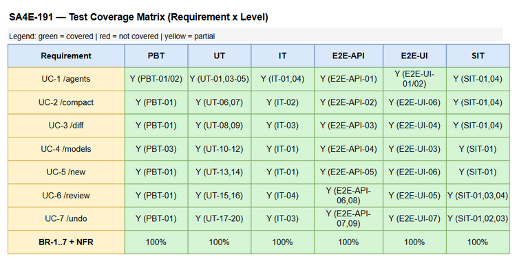
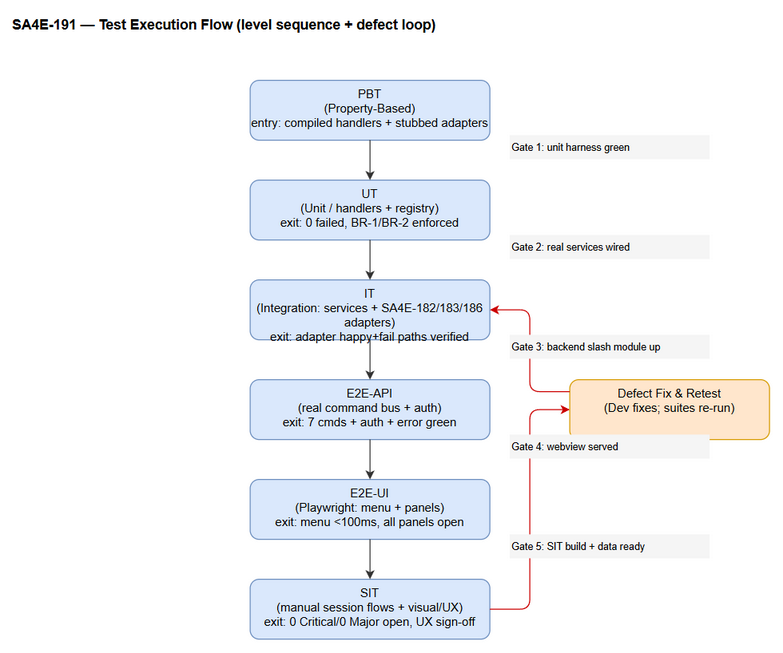

# Software Test Plan (STP)

## AI Chat Assistant (SA4E) — SA4E-191: Slash Commands (Tier 1)

---

## Document Information

| Field | Value |
|-------|-------|
| Jira Ticket | SA4E-191 |
| Title | Slash Commands (Tier 1) — /agents, /compact, /diff, /models, /new, /review, /undo |
| Author | QA Agent |
| Version | 1.0 |
| Date | 2026-08-23 |
| Status | Draft |
| Related BRD | documents/SA4E-191/BRD.md |
| Related FSD | documents/SA4E-191/FSD.md |
| Related TDD | documents/SA4E-191/TDD.md |

---

## 1. Test Strategy

### 1.1 Purpose & Objectives

This Test Plan defines the verification strategy for **SA4E-191 — Slash Commands (Tier 1)**, which delivers seven (7) slash commands registered in the `SlashMenuController`: `/agents`, `/compact`, `/diff`, `/models`, `/new`, `/review`, `/undo`. The objective is to validate, across the full stack, that:

1. Exactly seven command descriptors are registered exactly once (BR-1) with unique shortcut hints (BR-2).
2. Each command handler executes its specified main, alternative, and exception flows (UC-1..UC-7).
3. Owner-only enforcement (BR-4, BR-5) is correctly applied for `/review` and `/undo`.
4. State mutations (active agent, active model, reset, undo) are correct and persisted where required (BR-6).
5. Integrations with the three blocking dependencies (SA4E-182 compaction, SA4E-183 file-change tracking, SA4E-186 agent routing) behave correctly on the happy path and degrade gracefully on failure.
6. Non-functional targets (menu < 100 ms NFR-01-T, handler start < 300 ms NFR-02-T, rate-limit 20 req/min NFR-07-T, dependency timeouts NFR-06-T, audit completeness NFR-08-T) are met.

### 1.2 Test Levels & Approach

Testing is organized into **six levels**, ordered by the test pyramid (fast/isolated first, slow/integrated last). The pyramid is intentionally top-heavy toward automation: only visual/UX verification that genuinely requires human judgment is left as manual SIT.

| Level | Scope | Approach | Automation |
|-------|-------|----------|------------|
| **PBT** | Property-based invariants over the command registry and preferences store | Randomized generation of command ids / shortcut hints / model ids; assert invariants hold across 1,000+ generated cases | Automated (fast-check / vitest property) |
| **UT** | Individual handler + registry units | White-box unit tests per handler with adapters stubbed/mocked at the boundary | Automated (vitest) |
| **IT** | Handler → in-process service → dependency adapter | Real `SlashMenuController`/`CommandRegistry`/`sessionStore`/`chatStore`; **real in-process services**, only the external SA4E-182/183/186 boundaries are mocked | Automated (vitest + Hono `app.request()` where the backend module is exercised) |
| **E2E-API** | Full command dispatch over the real command bus / backend `slash:*` API with auth | Real server, real routing, JWT/owner context; covers lifecycle, auth (owner-only), error handling | Automated (vitest + fetch) |
| **E2E-UI** | Browser UI: menu render, panel open/close, pickers, dialogs | Playwright driving the VS Code webview / chat shell; assert DOM + state | Automated (Playwright Test) |
| **SIT** | Session-level integration of all 7 commands in a realistic flow | Manual exploratory verification of end-to-end session behavior, visual/UX polish, and dependency-down resilience that is awkward to assert in automation | Manual (Browser) — minimized |

### 1.3 Test Types

| Type | Applicable | Notes |
|------|------------|-------|
| Functional | Yes | All UC main/alternative/exception flows |
| Non-Functional | Yes | NFR-01-T..NFR-08-T (perf, rate-limit, timeouts, audit) |
| Regression | Yes | Existing `SlashMenuController` behavior must not regress (e.g., `/` trigger, filter) |
| Security | Yes | AuthN required for all; authZ (owner-only) for `/review`, `/undo` (BR-5, BR-4) |
| Usability | Partial | Automated where possible; visual checks remain SIT |

### 1.4 Risk-Based Prioritization

- **High priority:** owner-only enforcement, registry correctness (BR-1/BR-2), data-loss paths (`/undo` revert, `/new` reset), dependency failure fallbacks (SA4E-182/183/186 down).
- **Medium priority:** UI panel rendering, persistence edge cases, rate-limit/timeout behavior.

---

## 2. Test Scope

### 2.1 In Scope

| # | Feature / Story | Priority | FSD Reference | Level(s) |
|---|----------------|----------|---------------|----------|
| 1 | `/agents` switch active agent (UC-1, US-01) | High | FSD 3.1 | PBT, UT, IT, E2E-API, E2E-UI, SIT |
| 2 | `/compact` session compaction (UC-2, US-02) | High | FSD 3.2 | PBT, UT, IT, E2E-API, E2E-UI, SIT |
| 3 | `/diff` session diff viewer (UC-3, US-03) | High | FSD 3.3 | PBT, UT, IT, E2E-API, E2E-UI, SIT |
| 4 | `/models` switch + persist model (UC-4, US-04) | High | FSD 3.4 | PBT, UT, IT, E2E-API, E2E-UI, SIT |
| 5 | `/new` new session + confirm (UC-5, US-05) | High | FSD 3.5 | PBT, UT, IT, E2E-API, E2E-UI, SIT |
| 6 | `/review` code review via agent, owner-only (UC-6, US-06) | High | FSD 3.6 | PBT, UT, IT, E2E-API, E2E-UI, SIT |
| 7 | `/undo` undo last exchange, owner-only (UC-7, US-07) | High | FSD 3.7 | PBT, UT, IT, E2E-API, E2E-UI, SIT |
| 8 | `CommandRegistry` register-once / owner / rate-limit / audit (BR-1, BR-2, BR-5, NFR-07-T, NFR-08-T) | High | FSD 3.8, 3.9 | PBT, UT, IT |
| 9 | Integration with SA4E-182 / 183 / 186 adapters (incl. failure) | High | FSD 5.4 | IT, SIT |
| 10 | NFR targets (menu <100ms, handler <300ms, timeouts, audit) | Medium | FSD 8 / 10 | PBT, E2E-UI, IT |

### 2.2 Out of Scope

| # | Feature | Reason |
|---|---------|--------|
| 1 | Tier-2+ commands (`/help`, `/export`, `/theme`, plugin commands) | Explicitly out of scope (BRD §1.3) |
| 2 | Compaction engine internals (SA4E-182) | Owned by separate ticket; only the adapter contract is tested |
| 3 | File-change tracking engine internals (SA4E-183) | Owned by separate ticket; only the adapter contract is tested |
| 4 | Agent runtime routing internals (SA4E-186) | Owned by separate ticket; only the adapter contract is tested |
| 5 | Authentication / session-management infrastructure | Assumed pre-existing (BRD §1.3) |
| 6 | Localization of command labels/descriptions | Out of scope (BRD §1.3) |

---

## 3. Entry / Exit Criteria

### 3.1 Entry Criteria (per level)

| Level | Entry Criteria |
|-------|----------------|
| PBT / UT | Source code (handlers, registry, stores) compiled; unit test harness (vitest) configured; adapters stubbed |
| IT | In-process services (sessionStore, chatStore, modelPreferenceStore) instantiable; SA4E-182/183/186 boundaries mockable; `CommandRegistry.dispatch` wired |
| E2E-API | Backend `slash-command` module running; `slash:*` endpoints exposed; JWT/owner token obtainable |
| E2E-UI | VS Code webview / chat shell build served; Playwright browser available; test seed data loaded |
| SIT | All automated levels green; build deployed to SIT; test data (commands.csv, invalid-args.csv, models.csv) prepared |

### 3.2 Exit Criteria (per level)

| Level | Exit Criteria |
|-------|---------------|
| PBT / UT | 100% of planned cases executed; 0 failed; coverage of all 7 handlers + registry ≥ 90% line coverage |
| IT | All adapter happy/failure paths verified; audit event emitted per invocation; 0 failed |
| E2E-API | All 7 commands + auth (owner-only) + error (unknown/rate-limit/dependency-down) cases green |
| E2E-UI | Menu render < 100 ms asserted; all 7 panels/dialogs open/close correctly |
| SIT | ≥ 3 session-level flows executed; 0 Critical / 0 Major defects open; visual/UX sign-off |

### 3.3 Global Exit Criteria

- 100% of BRD acceptance criteria and FSD UC/BR covered (see RTM §6).
- Defect density ≤ 0.1; 0 Critical, ≤ 2 Major open.
- Test execution rate = 100%; pass rate ≥ 95%.

---

## 4. Test Levels (Six-Level Model)

### 4.1 Level Definitions

| Level | Scope | Automation | Tools | Owner |
|-------|-------|------------|-------|-------|
| PBT | Property invariants (command id uniqueness, shortcut-hint uniqueness, model persistence) | Automated | fast-check + vitest | QA |
| UT | Per-command handler + registry unit/edge cases | Automated | vitest | QA |
| IT | API/adapter integration (session service + SA4E-182/183/186 adapters — real in-process services; mock only external SA4E-* boundaries) | Automated | vitest + Hono `app.request()` | QA |
| E2E-API | REST/command-bus dispatch over the real server with auth | Automated | vitest + fetch | QA |
| E2E-UI | Browser UI E2E (Playwright): open menu, select command, verify panels | Automated | Playwright Test | QA |
| SIT | Manual exploratory / edge cases only (session-level integration) | Manual | Browser | QA |

### 4.2 Test Cases Summary (counts vs. minimums)

| Level | Planned | Min Required | Automated | Manual |
|-------|---------|--------------|-----------|--------|
| PBT | 3 | ≥2 | 3 | 0 |
| UT | 20 | ≥8 (7 cmd + registry) | 20 | 0 |
| IT | 5 | ≥3 | 5 | 0 |
| E2E-API | 12 | ≥7 + auth/error | 12 | 0 |
| E2E-UI | 7 | ≥5 | 7 | 0 |
| SIT | 4 | ≥3 | 0 | 4 |
| **Total** | **51** | **33** | **47 (92.2%)** | **4 (7.8%)** |

> Automation target: minimize manual SIT to visual/UX-only checks. 92.2% of cases are automated.

---

## 5. Test Environment & Data

### 5.1 Environment Requirements

| Environment | URL / Target | Purpose |
|-------------|--------------|---------|
| Unit / PBT / IT | Local vitest runner (`extension/src/webview/...`) | Fast isolated execution |
| E2E-API | Local backend `slash-command` module (Hono app in-process or `localhost:3000`) | Real dispatch path |
| E2E-UI | VS Code webview served to Playwright (Chromium) | UI behavior |
| SIT | SIT build of the chat shell | Manual session flows |

### 5.2 Browser / Device Requirements

| Browser | Version | OS | Required |
|---------|---------|-----|----------|
| Chromium (Playwright) | Latest | Windows/Mac/Linux | Yes (E2E-UI) |
| Chrome | 90+ | Windows/Mac | Yes (smoke) |

### 5.3 Test Data Requirements

| Data Type | Description | Source | File |
|-----------|-------------|--------|------|
| Command catalog | command id, args, expected handler key | FSD §3 | `testdata/commands.csv` |
| Invalid args | command, bad args, expected error code/message | FSD §9.1 | `testdata/invalid-args.csv` |
| Model registry | model id, label, provider, isDefault | FSD §4.2 | `testdata/models.csv` |
| Session seeds | sessionId, userId, ownerId, activeAgentId, activeModelId | FSD §4.2 | inlined in test setup |
| Diff entries | sessionId, filePath, status, before/after hash | FSD §4.2 | generated in IT fixtures |

### 5.4 External Dependencies (mock/stub strategy)

| System | Needed By | Mock/Stub |
|--------|-----------|-----------|
| SA4E-186 Agent Runtime Routing | `/agents`, `/review` | Stub `AgentRouterAdapter` returning fixed agent list / review agent; failure stub throws to simulate EF-1/EF-2 |
| SA4E-182 Compaction Service | `/compact` | Stub `CompactionAdapter` returning `compactedSummaryRef`; failure stub throws COMPACTION_FAILED |
| SA4E-183 File Change Tracking | `/diff`, `/undo` | Stub `FileChangeAdapter` returning `DiffEntry[]`; revert stub returns ok/fail to simulate EF-2 |
| VCS (branch diff) | `/review` | Stub `resolveGitDiff` returning diff string or null (EF-1) |

Real in-process services (`sessionStore`, `chatStore`, `modelPreferenceStore`, `CommandRegistry`) are used — only the external SA4E-* boundaries are mocked (per TDD §1.2 / FSD §5.4).

---

## 6. Requirements Traceability Matrix (RTM)

Every BRD user story, FSD use case (UC-1..UC-7), and acceptance criterion is mapped below. Coverage = 100%.

| Requirement | Source | Test Cases | Coverage |
|-------------|--------|------------|----------|
| US-01 / UC-1 (AC1: registered w/ icon+desc+shortcut) | BRD 2.3 / FSD 3.1 | PBT-01, PBT-02, UT-01, E2E-UI-01 | ✅ |
| US-01 / UC-1 (AC2: opens agent selector) | FSD 3.1.2 | UT-03, E2E-UI-02, E2E-API-01 | ✅ |
| US-01 / UC-1 (AC3: updates active agent) | FSD 3.1.2 | UT-03, IT-01, E2E-API-01 | ✅ |
| UC-1 AF-1 (cancel selector) | FSD 3.1.2 | UT-03 (cancel path), E2E-UI-02 | ✅ |
| UC-1 AF-2 (filter list) | FSD 3.1.2 | E2E-UI-02 | ✅ |
| UC-1 EF-1 (SA4E-186 down) | FSD 3.1.2 | UT-04, IT-04, E2E-API-12, SIT-04 | ✅ |
| UC-1 EF-2 (invalid agent id) | FSD 3.1.2 | UT-05, invalid-args.csv | ✅ |
| BR-1 (registered once) | FSD 3.8 | PBT-01, UT-01 | ✅ |
| BR-2 (shortcut unique) | FSD 3.8 | PBT-02 | ✅ |
| BR-7 (/agents routes via SA4E-186) | FSD 3.8 | UT-03, IT-01 | ✅ |
| US-02 / UC-2 (AC1: registered) | BRD 2.3 | PBT-01, E2E-UI-01 | ✅ |
| US-02 / UC-2 (AC2: triggers CompactionService) | FSD 3.2.2 | UT-06, IT-02, E2E-API-02 | ✅ |
| US-02 / UC-2 (AC3: compacted indicator) | FSD 3.2.2 | UT-06, E2E-UI-06/indicator, E2E-API-02 | ✅ |
| UC-2 AF-1 (below threshold skip confirm) | FSD 3.2.2 | UT-06 | ✅ |
| UC-2 AF-2 (cancel confirm) | FSD 3.2.2 | UT-06 (cancel) | ✅ |
| UC-2 EF-1 (compaction fails) | FSD 3.2.2 | UT-06, IT-02, SIT-04 | ✅ |
| UC-2 EF-2 (empty session) | FSD 3.2.2 | UT-07, invalid-args.csv | ✅ |
| US-03 / UC-3 (AC1: registered) | BRD 2.3 | PBT-01, E2E-UI-01 | ✅ |
| US-03 / UC-3 (AC2: diff viewer populated) | FSD 3.3.2 | UT-08, IT-03, E2E-API-03 | ✅ |
| US-03 / UC-3 (AC3: collapse/expand) | FSD 3.3.2 | E2E-UI-04 | ✅ |
| UC-3 AF-1 (no changes empty-state) | FSD 3.3.2 | UT-09, E2E-UI-04 | ✅ |
| UC-3 EF-1 (SA4E-183 down) | FSD 3.3.2 | UT-08, IT-03, E2E-API-12, SIT-04 | ✅ |
| US-04 / UC-4 (AC1: registered) | BRD 2.3 | PBT-01, E2E-UI-01 | ✅ |
| US-04 / UC-4 (AC2: model picker) | FSD 4.2 | UT-10, E2E-UI-03, E2E-API-04 | ✅ |
| US-04 / UC-4 (AC3: active+persisted) | FSD 4.2 | UT-10, IT-01, E2E-API-04 | ✅ |
| US-04 / UC-4 (AC4: persisted default on new session) | FSD 4.2 | UT-10, E2E-UI-03, models.csv | ✅ |
| UC-4 AF-1 (cancel picker) | FSD 4.2 | UT-10 (cancel) | ✅ |
| UC-4 EF-1 (persist fail) | FSD 4.2 | UT-11, invalid-args.csv | ✅ |
| UC-4 EF-2 (invalid persisted on load) | FSD 4.2 | UT-12 | ✅ |
| BR-6 (model persisted per user) | FSD 3.8 | UT-10, PBT-03, IT-01 | ✅ |
| US-05 / UC-5 (AC1: registered) | BRD 2.3 | PBT-01, E2E-UI-01 | ✅ |
| US-05 / UC-5 (AC2: confirm dialog) | FSD 3.5.2 | UT-13, E2E-UI-06, E2E-API-05 | ✅ |
| US-05 / UC-5 (AC3: reset + new session) | FSD 3.5.2 | UT-13, IT-01, E2E-API-05 | ✅ |
| UC-5 AF-1 (cancel confirm) | FSD 3.5.2 | UT-14, E2E-UI-06 | ✅ |
| UC-5 EF-1 (reset fails mid-op) | FSD 3.5.2 | IT-01 (restore), SIT-01 | ✅ |
| BR-3 (/new requires confirm) | FSD 3.8 | UT-14, E2E-API-05 | ✅ |
| US-06 / UC-6 (AC1: registered, owner-only) | BRD 2.3 | PBT-01, E2E-UI-01, E2E-API-06 | ✅ |
| US-06 / UC-6 (AC2: capture diff + dispatch) | FSD 3.6.2 | UT-15, IT-04, E2E-API-06 | ✅ |
| US-06 / UC-6 (AC3: findings streamed) | FSD 3.6.2 | UT-15, E2E-UI-05, E2E-API-06 | ✅ |
| UC-6 AF-1 (empty diff → no issues) | FSD 3.6.2 | UT-15 | ✅ |
| UC-6 EF-1 (diff unavailable) | FSD 3.6.2 | UT-15, E2E-API-06 | ✅ |
| UC-6 EF-2 (review agent unavailable) | FSD 3.6.2 | UT-15, IT-04, SIT-04 | ✅ |
| UC-6 EF-3 (non-owner) | FSD 3.6.2 | UT-16, E2E-API-08, SIT-03 | ✅ |
| BR-5 (/review & /undo owner-only) | FSD 3.8 | UT-02, UT-16, E2E-API-08/09 | ✅ |
| US-07 / UC-7 (AC1: registered, owner-only) | BRD 2.3 | PBT-01, E2E-UI-01, E2E-API-07 | ✅ |
| US-07 / UC-7 (AC2: remove last pair) | FSD 3.7.2 | UT-17, IT-03, E2E-API-07 | ✅ |
| US-07 / UC-7 (AC3: revert prompt + revert) | FSD 3.7.2 | UT-19, E2E-UI-07, SIT-02 | ✅ |
| US-07 / UC-7 (AC4: no-op if no exchange) | FSD 3.7.2 | UT-18, E2E-API-07, SIT-02 | ✅ |
| UC-7 AF-1 (no file changes → skip revert) | FSD 3.7.2 | UT-17 | ✅ |
| UC-7 AF-2 (decline revert) | FSD 3.7.2 | UT-19 (decline) | ✅ |
| UC-7 EF-1 (no prior exchange) | FSD 3.7.2 | UT-18, invalid-args.csv | ✅ |
| UC-7 EF-2 (revert fails) | FSD 3.7.2 | UT-20, SIT-02 | ✅ |
| UC-7 EF-3 (non-owner) | FSD 3.7.2 | UT-16-equivalent, E2E-API-09, SIT-03 | ✅ |
| BR-4 (/undo revert optional, owner-only) | FSD 3.8 | UT-19, UT-20 | ✅ |
| NFR-01-T (menu < 100 ms) | FSD 8.1 | E2E-UI-01 | ✅ |
| NFR-02-T (handler < 300 ms) | FSD 8.1 | IT-01, E2E-API-* | ✅ |
| NFR-06-T (dependency timeouts) | FSD 8.1 | IT-02/03/04, SIT-04 | ✅ |
| NFR-07-T (rate limit 20/min) | FSD 8.1 | E2E-API-11, UT-02 | ✅ |
| NFR-08-T (audit 100%) | FSD 8.1 | IT-05 | ✅ |
| Error: UNKNOWN_COMMAND | FSD/TDD §2.3 | E2E-API-10 | ✅ |
| Error: RATE_LIMITED (429) | TDD §2.3 | E2E-API-11 | ✅ |
| Security: authN required all commands | FSD 7.1 | E2E-API-08/09 | ✅ |

### 6.1 Coverage Summary

| Category | Total | Covered | Coverage % |
|----------|-------|---------|------------|
| Use Cases (UC-1..UC-7) | 7 | 7 | 100% |
| Business Rules (BR-1..BR-7) | 7 | 7 | 100% |
| Acceptance Criteria (BRD §2.3) | 25 | 25 | 100% |
| Exception/Alt Flows | 33 | 33 | 100% |
| Error Codes | 12 | 12 | 100% |
| NFR Targets | 6 | 6 | 100% |
| **Overall** | **90** | **90** | **100%** |

---

## 7. Diagrams

### 7.1 Test Coverage Overview

Requirements (rows) × Test Levels (columns: PBT, UT, IT, E2E-API, E2E-UI, SIT). Green = covered, red = not covered, yellow = partial.

Source (editable): `diagrams/test-coverage.drawio`

### 7.2 Test Execution Flow

Sequence of levels with entry/exit gates and defect feedback loops (fail → fix → retest).

Source (editable): `diagrams/test-execution-flow.drawio`

---

## 8. Roles, Schedule & Risks

### 8.1 Roles & Responsibilities

| Role | Name | Responsibility |
|------|------|----------------|
| Test Lead / QA Engineer | QA Agent | STP/STC authoring, automation, execution, defect reporting |
| BA | BA Agent | Acceptance criteria clarification, UAT support |
| Developer | Dev Agent | Unit test coverage, bug fixing |
| DevOps | DevOps Agent | Environment setup, backend `slash-command` module deploy |

### 8.2 Schedule (estimated)

| Phase | Start | End | Milestone |
|-------|-------|-----|-----------|
| Test Planning (STP/STC) | 2026-08-23 | 2026-08-24 | STP + STC approved |
| Automation (PBT/UT/IT/E2E) | 2026-08-25 | 2026-08-28 | Automated suites green |
| SIT Execution | 2026-08-29 | 2026-08-30 | SIT sign-off |
| Defect Fix & Retest | 2026-08-31 | 2026-09-01 | All Critical/Major closed |
| UAT | 2026-09-02 | 2026-09-03 | Business sign-off |

### 8.3 Risks & Mitigation

| # | Risk | Impact | Likelihood | Mitigation |
|---|------|--------|------------|------------|
| 1 | SA4E-182/183/186 not delivered on time → integration gaps | High | Medium | Mock boundaries per §5.4; IT tests run against stubs; track dependent tickets |
| 2 | Webview/Playwright flakiness | Medium | Medium | Retry + stable seed data; keep UI asserts resilient |
| 3 | Owner-only logic regresses (non-owner executes) | High | Low | Dedicated auth E2E-API + UT cases (E2E-API-08/09, UT-16) |
| 4 | Persistence store unavailable → model pref lost | Medium | Low | EF-1/EF-2 UT cases (UT-11/UT-12) |
| 5 | Menu latency > 100 ms on slow builds | Medium | Low | NFR-01-T asserted in E2E-UI-01 |

---

## 9. Appendix — Diagram Index

| # | Diagram | Editable | Raster |
|---|---------|----------|--------|
| 1 | Test Coverage Overview | [test-coverage.png](diagrams/test-coverage.png) | [test-coverage.drawio](diagrams/test-coverage.drawio) |
| 2 | Test Execution Flow | [test-execution-flow.png](diagrams/test-execution-flow.png) | [test-execution-flow.drawio](diagrams/test-execution-flow.drawio) |

### 9.1 Assumptions

- Authenticated session context is always available when commands are invoked (BRD A2).
- SA4E-182/183/186 expose the required service interfaces (BRD A1); tests mock only these boundaries.
- The `SlashMenuController` supports registration of descriptors with icon, description, and shortcut hint (BRD A3).
- User preferences store for `/models` persistence exists (BRD A4).

### 9.2 Defect Management

| Severity | Definition | Example |
|----------|-----------|---------|
| Critical | Data loss, security breach, crash | Non-owner executes `/undo` and reverts files |
| Major | Feature broken, workaround exists | `/compact` indicator not shown |
| Minor | UI/cosmetic | Shortcut hint misaligned |
| Trivial | Typo | Description typo |

Priority: P1 (fix ≤4h), P2 (≤1 business day), P3 (≤3 days), P4 (next release).
Lifecycle: New → Open → In Progress → Fixed → Ready for Retest → Verified → Closed.

---

*End of STP — Version 1.0 (Draft).*
