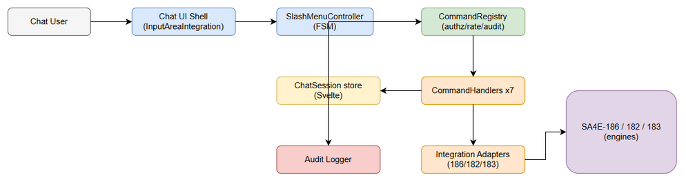
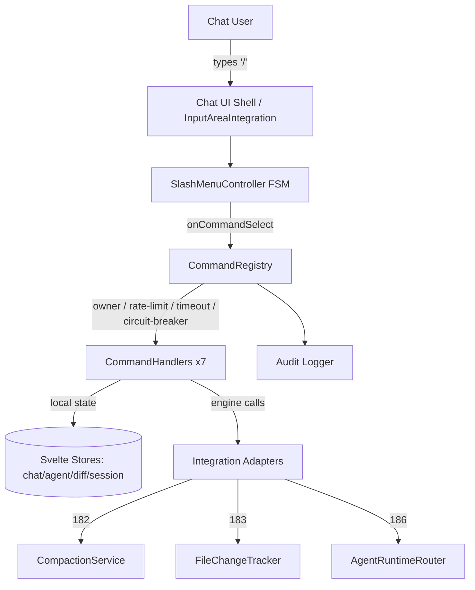
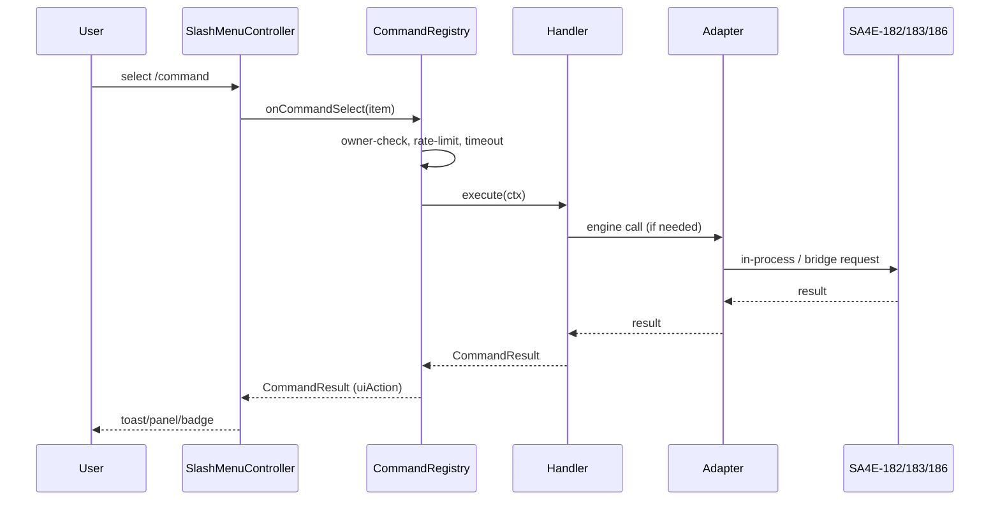
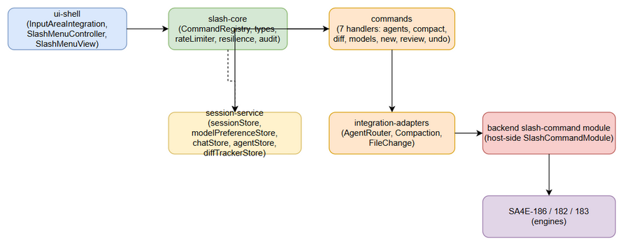
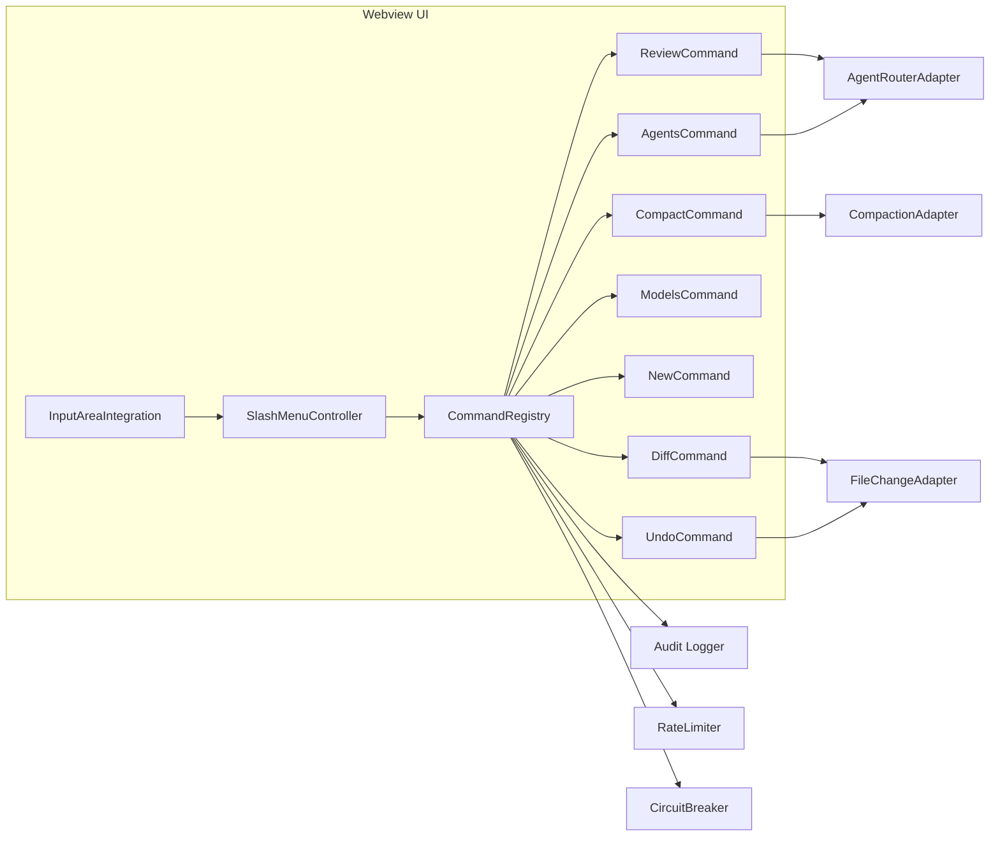
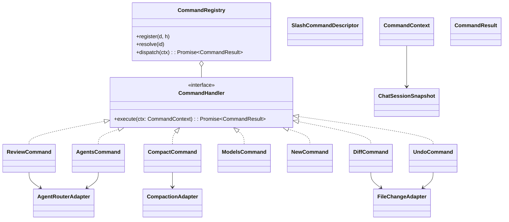
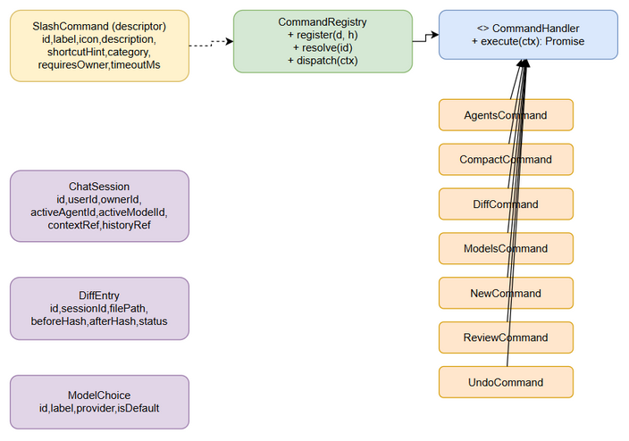

# Technical Design Document (TDD)

## AI Chat Assistant (SA4E) — SA4E-191: Slash Commands (Tier 1)

---

## Document Information

| Field | Value |
|-------|-------|
| Jira Ticket | SA4E-191 |
| Title | Slash Commands (Tier 1) — /agents, /compact, /diff, /models, /new, /review, /undo |
| Author | SA Agent |
| Version | 1.0 |
| Date | 2026-08-23 |
| Status | Draft |
| Document Type | Technical Design Document (TDD) |
| Source BRD | documents/SA4E-191/BRD.md |
| Source FSD | documents/SA4E-191/FSD.md |
| Language / Stack | TypeScript (Svelte webview in `extension/`, Node/TS server in `backend/`) |

---

## 1. Architecture Overview

### 1.1 Component Topology

SA4E-191 extends the **existing** `SlashMenuController` infrastructure in the VS Code extension webview (`extension/src/webview/slash-menu/`). The slash command surface is a thin orchestration layer composed of:

1. **Chat UI Shell** — `InputAreaIntegration` (input box) + `SlashMenuView` (popup). Detects `/` (existing `isValidTrigger`) and renders the menu.
2. **SlashMenuController** — existing finite state machine (`CLOSED ↔ OPEN ↔ FILTERING`). Resolves menu entries and, for `command` items, invokes the `onCommandSelect` callback. **Gap being filled:** this callback is currently NOT wired in `InputAreaIntegration`, so no command executes today.
3. **CommandRegistry** — NEW. Maps `commandId → { descriptor, handler }`. Enforces owner-only, rate-limit, timeout, circuit-breaker, and audit before delegating to the handler.
4. **Per-Command Handlers (7)** — NEW. Each implements `CommandHandler.execute(ctx)`. Local-state handlers mutate Svelte stores directly; engine-dependent handlers call adapters.
5. **ChatSession service** — NEW client-side `sessionStore` holding `sessionId`, `userId`, `ownerId`, `activeAgentId`, `activeModelId`, `contextRef`, `historyRef`.
6. **Integration Adapters** — NEW. Thin wrappers over the existing `MessageBridge` (webview↔Extension Host) that forward to the engines owned by SA4E-182 (compaction), SA4E-183 (file-change), and SA4E-186 (agent routing).
7. **Audit Logger** — NEW. Emits one structured audit event per invocation (success + failure).

### 1.2 Key Design Patterns

- **Registry Pattern** — `CommandRegistry` centralizes registration/dispatch; new commands are added by registering a descriptor + handler, satisfying BR-1 (registered exactly once).
- **Command Pattern** — each command is an object implementing `CommandHandler` with a uniform `execute(ctx)` contract, enabling uniform cross-cutting concerns (authz, rate-limit, timeout, audit).
- **Adapter Pattern** — `AgentRouterAdapter` / `CompactionAdapter` / `FileChangeAdapter` isolate the transport to SA4E-186/182/183 so handlers remain testable and decoupled from the (future) engine internals.
- **Circuit Breaker (via `cockatiel`, already in `node_modules`)** — wraps engine calls to degrade gracefully per FSD §5.4.
- **Finite State Machine** — `SlashMenuController` remains the single owner of menu open/filter/close transitions.

### 1.3 Architecture Diagram


*Edit in draw.io: [architecture.drawio](diagrams/architecture.drawio)*



---

## 2. API Design

### 2.1 CommandHandler Contract (TypeScript)

The uniform handler interface (aligned with FSD §3.9). All 7 handlers implement it.

```ts
// extension/src/webview/slash-commands/types.ts

export type UiActionType = 'toast' | 'badge' | 'dialog' | 'panel' | 'chatBlock';

export interface SlashCommandDescriptor {
  id: string;              // 'agents' | 'compact' | 'diff' | 'models' | 'new' | 'review' | 'undo'
  label: string;           // '/agents'
  icon: string;
  description: string;
  shortcutHint: string;    // e.g. 'Ctrl/Cmd+Shift+A'
  category: string;        // 'session' | 'agent' | 'model' | 'review'
  requiresOwner: boolean;  // BR-4 / BR-5
  timeoutMs: number;       // NFR-06-T per command
}

export interface ChatSessionSnapshot {
  id: string;
  userId: string;
  ownerId: string;
  activeAgentId: string;
  activeModelId: string;
  contextRef: string;
  historyRef: string;
}

export interface CommandContext {
  commandId: string;
  session: ChatSessionSnapshot;
  args: Record<string, unknown>;
  source: 'menu' | 'shortcut' | 'typed';
}

export interface CommandError {
  code: string;
  userMessage: string;
  retryable?: boolean;
}

export interface UiAction {
  type: UiActionType;
  [k: string]: unknown;
}

export interface CommandResult {
  status: 'ok' | 'error';
  commandId: string;
  result?: unknown;
  error?: CommandError;
  uiAction?: UiAction;
}

export interface CommandHandler {
  execute(ctx: CommandContext): CommandResult | Promise<CommandResult>;
}
```

### 2.2 Registration API

```ts
// extension/src/webview/slash-commands/CommandRegistry.ts
export class CommandRegistry {
  private handlers = new Map<string, CommandHandler>();
  private descriptors = new Map<string, SlashCommandDescriptor>();

  /** Register exactly once (BR-1). Throws on duplicate id. */
  register(descriptor: SlashCommandDescriptor, handler: CommandHandler): void {
    if (this.descriptors.has(descriptor.id)) {
      throw new Error(`Command already registered: ${descriptor.id}`);
    }
    this.descriptors.set(descriptor.id, descriptor);
    this.handlers.set(descriptor.id, handler);
  }

  resolve(commandId: string): { descriptor: SlashCommandDescriptor; handler: CommandHandler } | null {
    const descriptor = this.descriptors.get(commandId);
    const handler = this.handlers.get(commandId);
    return descriptor && handler ? { descriptor, handler } : null;
  }
}
```

### 2.3 Dispatch Flow

`SlashMenuController` calls `onCommandSelect(item)` → `InputAreaIntegration` → `CommandRegistry.dispatch(ctx)`. `dispatch` enforces all cross-cutting policies centrally (single source of truth), matching FSD §3.x.7 `onCommand` logic.

```ts
async dispatch(ctx: CommandContext): Promise<CommandResult> {
  const entry = this.resolve(ctx.commandId);
  if (!entry) return this.fail(ctx, 'UNKNOWN_COMMAND', 'Unknown command.', false);

  // BR-4 / BR-5 — owner-only enforcement (defense in depth; UI also disables)
  if (entry.descriptor.requiresOwner && ctx.session.userId !== ctx.session.ownerId) {
    return this.fail(ctx, 'PERMISSION_DENIED', 'Permission denied.', false);
  }
  // NFR-07-T — token-bucket 20 req/min per session per command
  if (!this.rateLimiter.allow(ctx.session.id, ctx.commandId)) {
    return this.fail(ctx, 'RATE_LIMITED', 'Too many requests, please wait.', true, 429);
  }
  try {
    const result = await withTimeout(
      withCircuitBreaker(entry.handler.execute(ctx)),
      entry.descriptor.timeoutMs
    );
    this.audit(ctx, result.status);
    return result;
  } catch (err) {
    this.audit(ctx, 'error');
    return this.fail(ctx, 'HANDLER_ERROR', (err as Error).message, false);
  }
}
```

### 2.4 In-Process Event Contracts (per command)

Each handler returns a `CommandResult`. The request/response JSON shapes mirror FSD §3.x.7. Summary:

| Command | Input (`ctx.args`) | Output (`result`) | UI Action |
|---------|--------------------|-------------------|-----------|
| `/agents` | `{}` (selection via picker) | `{ activeAgentId, availableAgents }` | `toast` |
| `/compact` | `{ compactionStrategy? }` | `{ compactedSummaryRef, status }` | `badge` |
| `/diff` | `{}` | `{ changedFiles: DiffEntry[] }` | `panel:diffViewer` |
| `/models` | `{ selectedModelId }` | `{ activeModelId, persistedModelId }` | `toast` |
| `/new` | `{ confirmReset: true }` | `{ newSessionId }` | `panel:emptyChat` |
| `/review` | `{ branchName, branchDiff }` | `{ reviewFindings: string[] }` | `chatBlock` (stream) |
| `/undo` | `{ lastExchangeId?, revertFileChanges }` | `{ removedExchangeId, revertedFiles }` | `toast` |

Full JSON samples are reproduced from FSD §3.1.7 / §3.2.7 / §3.3.7 / §3.4.7 / §3.5.7 / §3.6.7 / §3.7.7 and are authoritative for the wire format between handler and UI layer.

### 2.5 Mermaid Sequence (dispatch)



---

## 3. Component Diagram

### 3.1 Module / File Map (extension webview)

| Module | Path | Responsibility |
|--------|------|----------------|
| `slash-menu` (EXISTING, modified) | `extension/src/webview/slash-menu/` | `SlashMenuController` FSM, `SlashMenuView`, `SlashMenuItems`, `types`. Modified to carry `shortcutHint`/`requiresOwner`/`category` and to invoke `onCommandSelect(item)`. |
| `slash-commands` (NEW) | `extension/src/webview/slash-commands/` | `CommandRegistry`, `types`, `rateLimiter`, `resilience` (circuit breaker wrapper), `audit`. |
| `slash-commands/handlers` (NEW) | `extension/src/webview/slash-commands/handlers/` | 7 handler classes. |
| `slash-commands/adapters` (NEW) | `extension/src/webview/slash-commands/adapters/` | `AgentRouterAdapter` (186), `CompactionAdapter` (182), `FileChangeAdapter` (183). |
| `stores/sessionStore` (NEW) | `extension/src/webview/stores/sessionStore.ts` | Holds `ChatSessionSnapshot` + owner info. |
| `stores/chatStore` (EXISTING, modified) | `extension/src/webview/stores/chatStore.ts` | Add `removeLastExchange()` for `/undo`. |
| `input/InputAreaIntegration` (EXISTING, modified) | `extension/src/webview/input/InputAreaIntegration.ts` | Wire `onCommandSelect` → `CommandRegistry.dispatch`. |
| `bridge/MessageBridge` (EXISTING, extended) | `extension/src/webview/bridge/MessageBridge.ts` | Add request types for `slash:*` messages. |
| `protocol` (EXISTING, modified) | `extension/src/webview/protocol.ts` | Add `SlashCommandRequest`/`SlashCommandResponse` unions. |
| `backend slash-command module` (NEW) | `backend/src/modules/slash-command/` | Host-side consumer of SA4E-182/183/186; exposes `slash:*` endpoints; persists audit. |

### 3.2 Diagram


*Edit in draw.io: [component.drawio](diagrams/component.drawio)*



---

## 4. Class / Module Design

### 4.1 Interfaces & Classes (signatures)

```ts
// extension/src/webview/slash-commands/types.ts  (excerpts, see §2.1 for full)

// ----- ChatSession (client snapshot) -----
export interface ChatSessionSnapshot { /* see §2.1 */ }

// ----- CommandDescriptor / Handler / Context / Result -----
export interface SlashCommandDescriptor { /* see §2.1 */ }
export interface CommandContext { /* see §2.1 */ }
export interface CommandResult { /* see §2.1 */ }
export interface CommandHandler { execute(ctx: CommandContext): CommandResult | Promise<CommandResult>; }
```

```ts
// extension/src/webview/slash-commands/CommandRegistry.ts
export class CommandRegistry {
  register(descriptor: SlashCommandDescriptor, handler: CommandHandler): void;
  resolve(commandId: string): { descriptor: SlashCommandDescriptor; handler: CommandHandler } | null;
  dispatch(ctx: CommandContext): Promise<CommandResult>;
  private fail(ctx: CommandContext, code: string, msg: string, retryable: boolean, http?: number): CommandResult;
  private audit(ctx: CommandContext, status: 'ok' | 'error'): void;
}
```

```ts
// extension/src/webview/slash-commands/rateLimiter.ts
export class TokenBucket {
  constructor(capacity: number, refillPerMs: number);
  allow(key: string): boolean; // 20 / min => capacity 20, refill 20/60000ms
}
```

```ts
// extension/src/webview/slash-commands/resilience.ts
import { CircuitBreaker, ConsecutiveBreaker, handleAll } from 'cockatiel';
export function withTimeout<T>(p: Promise<T>, ms: number): Promise<T>;
export function buildBreaker(threshold: number, probeMs: number): CircuitBreaker;
```

```ts
// extension/src/webview/slash-commands/adapters/types.ts
export interface DiffEntry {
  id: string; sessionId: string; filePath: string;
  beforeHash: string | null; afterHash: string | null;
  status: 'added' | 'modified' | 'deleted';
}
export interface ModelChoice { id: string; label: string; provider: string; isDefault: boolean; }
```

### 4.2 The Seven Concrete Handlers

```ts
// extension/src/webview/slash-commands/handlers/AgentsCommand.ts
export class AgentsCommand implements CommandHandler {
  constructor(private adapter: AgentRouterAdapter, private session: SessionStore) {}
  async execute(ctx: CommandContext): Promise<CommandResult>;
  // shows picker of adapter.listAgents(); on pick -> agentStore.selectAgent(id)
}

// extension/src/webview/slash-commands/handlers/CompactCommand.ts
export class CompactCommand implements CommandHandler {
  constructor(private adapter: CompactionAdapter, private session: SessionStore) {}
  async execute(ctx: CommandContext): Promise<CommandResult>;
  // pseudocode in §6
}

// extension/src/webview/slash-commands/handlers/DiffCommand.ts
export class DiffCommand implements CommandHandler {
  constructor(private adapter: FileChangeAdapter) {}
  async execute(ctx: CommandContext): Promise<CommandResult>;
}

// extension/src/webview/slash-commands/handlers/ModelsCommand.ts
export class ModelsCommand implements CommandHandler {
  constructor(private session: SessionStore, private prefs: ModelPreferenceStore) {}
  async execute(ctx: CommandContext): Promise<CommandResult>;
}

// extension/src/webview/slash-commands/handlers/NewCommand.ts
export class NewCommand implements CommandHandler {
  constructor(private session: SessionStore) {}
  async execute(ctx: CommandContext): Promise<CommandResult>;
}

// extension/src/webview/slash-commands/handlers/ReviewCommand.ts
export class ReviewCommand implements CommandHandler {
  constructor(private adapter: AgentRouterAdapter, private bridge: MessageBridge) {}
  async execute(ctx: CommandContext): Promise<CommandResult>;
}

// extension/src/webview/slash-commands/handlers/UndoCommand.ts
export class UndoCommand implements CommandHandler {
  constructor(private adapter: FileChangeAdapter, private chat: ChatStore) {}
  async execute(ctx: CommandContext): Promise<CommandResult>;
}
```

### 4.3 Mermaid Class Diagram




*Edit in draw.io: [class.drawio](diagrams/class.drawio)*

---

## 5. Data Model (Physical)

### 5.1 Persistence Strategy

| Entity | Store | Persistence | Rationale |
|--------|-------|-------------|-----------|
| `ChatSessionSnapshot` | `sessionStore` (Svelte `writable`) | In-memory in webview + mirrored to Extension Host session; no new DB table. `sessionId` issued by host. | Session state is short-lived, host-owned. |
| `DiffEntry` | `diffTrackerStore` (existing) + backend (`SA4E-183`) | Backend-owned; webview holds a cached summary. | File-change tracking is an engine responsibility (SA4E-183). |
| `ModelChoice` | `ModelPreferenceStore` (new) | **Persisted** per `userId` via VS Code `vscodeApi.setState` / host preferences (BR-6). Validated on load (EF-2). | Preference must survive restart (BRD US-04). |
| `SlashCommandDescriptor` | Registry (in-memory) | Code-registered at startup. | Static command metadata. |

### 5.2 TypeScript Interfaces (physical)

```ts
// ChatSessionSnapshot — see §2.1. Created by sessionStore:
export interface ChatSessionSnapshot {
  id: string; userId: string; ownerId: string;
  activeAgentId: string; activeModelId: string;
  contextRef: string; historyRef: string;
}

// DiffEntry (mirrors FSD §4.2; received from SA4E-183 adapter)
export interface DiffEntry {
  id: string; sessionId: string; filePath: string;
  beforeHash: string | null; afterHash: string | null;
  status: 'added' | 'modified' | 'deleted';
}

// ModelChoice (mirrors FSD §4.2)
export interface ModelChoice {
  id: string; label: string; provider: string; isDefault: boolean;
}

// Persisted model preference
export interface ModelPreference { userId: string; modelId: string; updatedAt: string; }
```

### 5.3 JSON Schema (wire format for `/diff` result)

```json
{
  "$schema": "http://json-schema.org/draft-07/schema#",
  "title": "DiffResult",
  "type": "object",
  "properties": {
    "changedFiles": {
      "type": "array",
      "items": {
        "type": "object",
        "properties": {
          "id": { "type": "string" },
          "sessionId": { "type": "string" },
          "filePath": { "type": "string" },
          "beforeHash": { "type": ["string", "null"] },
          "afterHash": { "type": ["string", "null"] },
          "status": { "type": "string", "enum": ["added", "modified", "deleted"] }
        },
        "required": ["id", "sessionId", "filePath", "status"]
      }
    }
  },
  "required": ["changedFiles"]
}
```

### 5.4 `ModelPreferenceStore` sketch

```ts
// extension/src/webview/slash-commands/stores/modelPreferenceStore.ts
export class ModelPreferenceStore {
  constructor(private bridge: MessageBridge) {}
  async load(userId: string): Promise<string | null> {
    const r = await this.bridge.request<{ data: string | null }>(
      { type: 'slash:models:load', userId });
    return r.data;
  }
  async save(userId: string, modelId: string): Promise<void> {
    await this.bridge.request({ type: 'slash:models:persist', userId, modelId });
  }
}
```

---

## 6. Integration Design

### 6.1 Adapter Contracts (webview ↔ Extension Host ↔ Engine)

All engine calls flow: **Handler → Adapter → `MessageBridge.request(slash:*)` → Extension Host → backend `slash-command` module → SA4E-182/183/186 service**. Transport is in-process on the host; the webview uses the existing postMessage bridge with timeouts (per FSD §5.4).

| Adapter | Engine | Message type(s) | Timeout | Retry | Circuit Breaker |
|---------|--------|----------------|---------|-------|-----------------|
| `AgentRouterAdapter` | SA4E-186 | `slash:agents:list`, `slash:review:dispatch` | 5 s | 1 × 500 ms | OPEN after 3 fails; probe 30 s |
| `CompactionAdapter` | SA4E-182 | `slash:compact` | 10 s | none | optional degrade |
| `FileChangeAdapter` | SA4E-183 | `slash:diff:query`, `slash:undo:revert` | 3 s (query & per revert) | 1 (query only) | OPEN after 3 fails; probe 30 s |

### 6.2 Resilience Wrapper (reuses `cockatiel`)

```ts
// extension/src/webview/slash-commands/resilience.ts
import { CircuitBreaker, ConsecutiveBreaker, handleAll, wrap } from 'cockatiel';

export function withTimeout<T>(p: Promise<T>, ms: number): Promise<T> {
  return new Promise<T>((resolve, reject) => {
    const t = setTimeout(() => reject(new Error(`Timeout ${ms}ms`)), ms);
    p.then((v) => { clearTimeout(t); resolve(v); }, (e) => { clearTimeout(t); reject(e); });
  });
}

export function buildBreaker(): CircuitBreaker {
  // OPEN after 3 consecutive failures, half-open probe every 30s
  return new CircuitBreaker(new ConsecutiveBreaker(3), { halfOpenAfter: 30_000 });
}

export async function withResilience<T>(
  fn: () => Promise<T>, breaker: CircuitBreaker, timeoutMs: number
): Promise<T> {
  return withTimeout(wrap(breaker, handleAll, fn)(), timeoutMs);
}
```

### 6.3 Pseudocode — `/compact` (CompactCommand)

```ts
async execute(ctx: CommandContext): Promise<CommandResult> {
  if (isEmptySession(ctx.session.historyRef))
    return err('NOTHING_TO_COMPACT', 'Nothing to compact.', false);   // EF-2
  const tokenCount = estimateTokens(ctx.session.contextRef);
  if (tokenCount > COMPACTION_THRESHOLD) {
    const confirmed = await promptConfirm('Compact session? Large context detected.');
    if (!confirmed) return ok({ status: 'cancelled' });              // AF-2
  }
  try {
    const summary = await this.adapter.compact(ctx.session.id,
                  ctx.session.contextRef, ctx.session.historyRef);   // 10s, no retry
    ctx.session.contextRef = summary.compactedSummaryRef;
    updateContextFromSummary(summary);                               // contextStore
    return ok({ compactedSummaryRef: summary.compactedSummaryRef, status: 'success' },
              { type: 'badge', label: 'Compacted' });
  } catch (e) {
    return err('COMPACTION_FAILED', 'Session compaction failed. Please try again.', true); // EF-1
  }
}
```

### 6.4 Pseudocode — `/review` (ReviewCommand)

```ts
async execute(ctx: CommandContext): Promise<CommandResult> {
  if (ctx.session.userId !== ctx.session.ownerId)
    return err('PERMISSION_DENIED', 'Permission denied.', false);    // EF-3 / BR-5
  const branchName = ctx.args.branchName as string
    ?? (await this.bridge.request<{data:string}>({ type: 'resolveGitBranch' })).data;
  const branchDiff = ctx.args.branchDiff as string
    ?? (await this.bridge.request<{data:string}>({ type: 'resolveGitDiff' }, 5000)).data; // exists
  if (!branchDiff) return err('BRANCH_DIFF_UNAVAILABLE', 'Unable to obtain branch diff for review.', false); // EF-1
  const agent = await this.adapter.resolve('review_agent');          // SA4E-186, 5s, breaker
  if (!agent) return err('REVIEW_AGENT_UNAVAILABLE', 'Review agent is currently unavailable.', true); // EF-2
  const report = await this.adapter.runReview(branchDiff);           // streamed
  return stream({ reviewFindings: report.findings }, { type: 'chatBlock', streaming: true });
}
```

### 6.5 Pseudocode — `/undo` (UndoCommand)

```ts
async execute(ctx: CommandContext): Promise<CommandResult> {
  if (ctx.session.userId !== ctx.session.ownerId)
    return err('PERMISSION_DENIED', 'Permission denied.', false);    // EF-3 / BR-5
  const pair = this.chat.findLastExchange();                        // (userMsg, agentMsg)
  if (!pair) return err('NOTHING_TO_UNDO', 'Nothing to undo.', false); // EF-1
  const diffs: DiffEntry[] = await this.adapter.queryDiffs(ctx.session.id, pair.exchangeId);
  const revert = Boolean(ctx.args.revertFileChanges);
  const reverted: string[] = [];
  if (diffs.length && revert) {
    for (const entry of diffs) {                                    // owner-only guard
      const ok = await this.adapter.revert(entry);                  // 3s per entry
      if (ok) reverted.push(entry.filePath);
      else warn('some file changes not reverted');                  // EF-2
    }
  }
  this.chat.removeLastExchange();                                   // removes both messages
  return ok({ removedExchangeId: pair.exchangeId, revertedFiles: reverted });
}
```

---

## 9. Implementation Checklist

### 9.1 FILES TO CREATE (build order)

| # | Path | Purpose |
|---|------|---------|
| 1 | `extension/src/webview/slash-commands/types.ts` | `SlashCommandDescriptor`, `CommandContext`, `CommandResult`, `CommandHandler`, `DiffEntry`, `ModelChoice`. |
| 2 | `extension/src/webview/slash-commands/CommandRegistry.ts` | Register/resolve/dispatch + owner/rate-limit/audit. |
| 3 | `extension/src/webview/slash-commands/rateLimiter.ts` | `TokenBucket` (20/min). |
| 4 | `extension/src/webview/slash-commands/resilience.ts` | `withTimeout`, `buildBreaker`, `withResilience` (cockatiel). |
| 5 | `extension/src/webview/slash-commands/audit.ts` | `emitAudit(event)` to `slash:audit` bridge. |
| 6 | `extension/src/webview/protocol.ts` (extend) | `SlashCommandRequest` / `SlashCommandResponse` types. |
| 7 | `extension/src/webview/stores/sessionStore.ts` | `ChatSessionSnapshot` + owner info + `newSession()`. |
| 8 | `extension/src/webview/slash-commands/stores/modelPreferenceStore.ts` | Persist/load `ModelPreference`. |
| 9 | `extension/src/webview/slash-commands/adapters/AgentRouterAdapter.ts` | listAgents / resolve / runReview (SA4E-186). |
| 10 | `extension/src/webview/slash-commands/adapters/CompactionAdapter.ts` | compact (SA4E-182). |
| 11 | `extension/src/webview/slash-commands/adapters/FileChangeAdapter.ts` | queryDiffs / revert (SA4E-183). |
| 12 | `extension/src/webview/slash-commands/handlers/AgentsCommand.ts` | picker + `agentStore.selectAgent`. |
| 13 | `extension/src/webview/slash-commands/handlers/CompactCommand.ts` | per 6.3. |
| 14 | `extension/src/webview/slash-commands/handlers/DiffCommand.ts` | open `DiffSummaryPanel`. |
| 15 | `extension/src/webview/slash-commands/handlers/ModelsCommand.ts` | picker + persist (BR-6). |
| 16 | `extension/src/webview/slash-commands/handlers/NewCommand.ts` | confirm + clear + new session. |
| 17 | `extension/src/webview/slash-commands/handlers/ReviewCommand.ts` | per 6.4. |
| 18 | `extension/src/webview/slash-commands/handlers/UndoCommand.ts` | per 6.5. |
| 19 | `extension/src/webview/slash-commands/index.ts` | `createRegistry()` factory wiring all 7 + adapters. |
| 20 | `backend/src/modules/slash-command/SlashCommandModule.ts` | Host-side consumer of SA4E-182/183/186; `slash:*` handlers; audit persist. |

### 9.2 FILES TO MODIFY

| # | Path | Change |
|---|------|--------|
| 1 | `extension/src/webview/slash-menu/types.ts` | Add `shortcutHint?`, `requiresOwner?`, `category?` to `SlashMenuItem`; add `onCommandSelect?: (item: SlashMenuItem) => void` to `SlashMenuOptions`. |
| 2 | `extension/src/webview/slash-menu/SlashMenuItems.ts` | Extend `SLASH_COMMANDS` from 2 to 7 (add `agents`, `models`, `new`, `review`, `undo`) with `shortcutHint`, `requiresOwner`, `category`. |
| 3 | `extension/src/webview/slash-menu/SlashMenuController.ts` | Pass full `SlashMenuItem` to `onCommandSelect(item)`; disable owner-only entries when non-owner. |
| 4 | `extension/src/webview/slash-menu/SlashMenuView.ts` | Render `shortcutHint`; grey out `requiresOwner` entries for non-owner. |
| 5 | `extension/src/webview/input/InputAreaIntegration.ts` | Provide `onCommandSelect` to `CommandRegistry.dispatch(buildContext(item))`. |
| 6 | `extension/src/webview/stores/chatStore.ts` | Add `findLastExchange()` and `removeLastExchange()` (BR-4/UC-7). |
| 7 | `extension/src/webview/bridge/MessageBridge.ts` | Add `request` overloads for `slash:*` types. |
| 8 | `extension/src/webview/protocol.ts` | Add `SlashCommandRequest` / `SlashCommandResponse` unions. |

### 9.3 Test Files

| Layer | File | Covers |
|-------|------|--------|
| Unit | `extension/src/webview/slash-commands/CommandRegistry.test.ts` | register-once (BR-1), owner-check, rate-limit, unknown command. |
| Unit | `.../handlers/AgentsCommand.test.ts` | TC-1, TC-2 (EF-1). |
| Unit | `.../handlers/CompactCommand.test.ts` | TC-3, TC-4 (EF-2). |
| Unit | `.../handlers/DiffCommand.test.ts` | TC-5, TC-6 (AF-1). |
| Unit | `.../handlers/ModelsCommand.test.ts` | TC-7, TC-8 (EF-1). |
| Unit | `.../handlers/NewCommand.test.ts` | TC-9, TC-10 (BR-3). |
| Unit | `.../handlers/ReviewCommand.test.ts` | TC-11, TC-12 (EF-3). |
| Unit | `.../handlers/UndoCommand.test.ts` | TC-13/14/15, partial revert. |
| Integration | `extension/src/webview/__tests__/slash-commands.integration.test.ts` | Registry to handler to store mutation. |
| E2E | `extension/src/webview/__tests__/slash-commands.e2e.test.ts` | Menu open < 100ms, shortcut dispatch. |
| Backend | `backend/src/modules/slash-command/SlashCommandModule.it.test.ts` | Host forwards `slash:*` to stubbed engines. |

---

## 10. Non-Functional & Observability

### 10.1 Performance
- **NFR-01-T** Menu opens < 100 ms: `open` is synchronous; descriptors pre-built at startup. Virtualized list already in `SlashMenuView`.
- **NFR-02-T** Handler start < 300 ms: `dispatch` synchronous until first `await`; registry resolve O(1).
- **NFR-03-T** 50 ms debounce on filter input.
- **NFR-04-T** Model registry cached 60 s (TTL in AgentsCommand/ModelsCommand).
- **NFR-06-T** Timeouts: 186=5s, 182=10s, 183=3s via `withTimeout`.
- **NFR-07-T** 20 req/min/session via `TokenBucket`.

### 10.2 Logging & Metrics
- Structured logs via `pino` (backend) / `console` (webview dev). Each dispatch logs `command`, `session`, `durationMs`, `status`.
- Metrics: `slash_command_count{command,status}`, `slash_command_duration_ms{command}`, `slash_command_rate_limited_total`, `slash_circuit_breaker_state{engine}`.
- Health: backend module exposes `ready` from the three dependency breakers (OPEN -> `degraded`).

### 10.3 Availability & Scalability
- Handlers stateless in-process; no shared mutable state beyond per-webview Svelte stores. Concurrent sessions supported (NFR-04/05).
- Circuit breakers prevent cascade failure when SA4E-182/183/186 degrade; commands fail fast with friendly messages.

---

## 11. Appendix — Diagram Index

| # | Diagram | Editable | Raster |
|---|---------|----------|--------|
| 1 | Architecture (topology + flow) | [architecture.drawio](diagrams/architecture.drawio) |  |
| 2 | Component (modules + deps) | [component.drawio](diagrams/component.drawio) |  |
| 3 | Class (interfaces + 7 handlers) | [class.drawio](diagrams/class.drawio) |  |

> PNG exports are produced by the SM pipeline (draw.io CLI). The `.drawio` files contain valid `mxGraphModel` XML per the SA4E drawio standard: no `<mxfile>` wrapper, and every edge has a child `<mxGeometry>` element (never self-closing).

---

*End of TDD — Version 1.0 (Draft). Generated by SA Agent for SA4E-191.*
