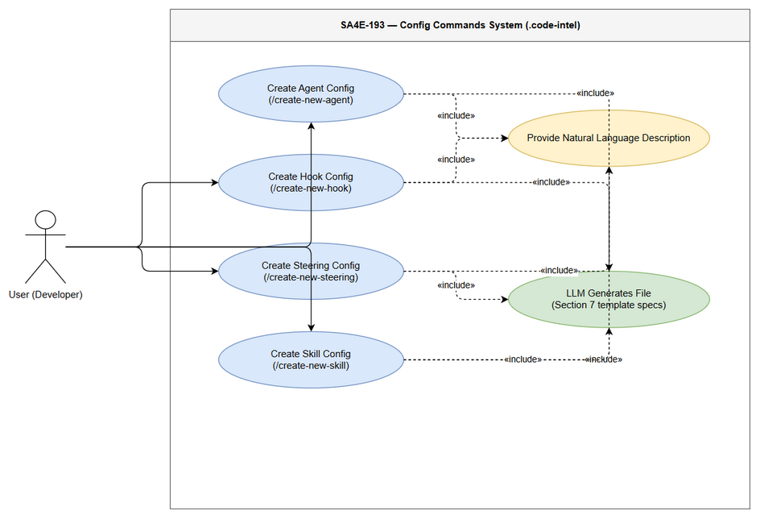
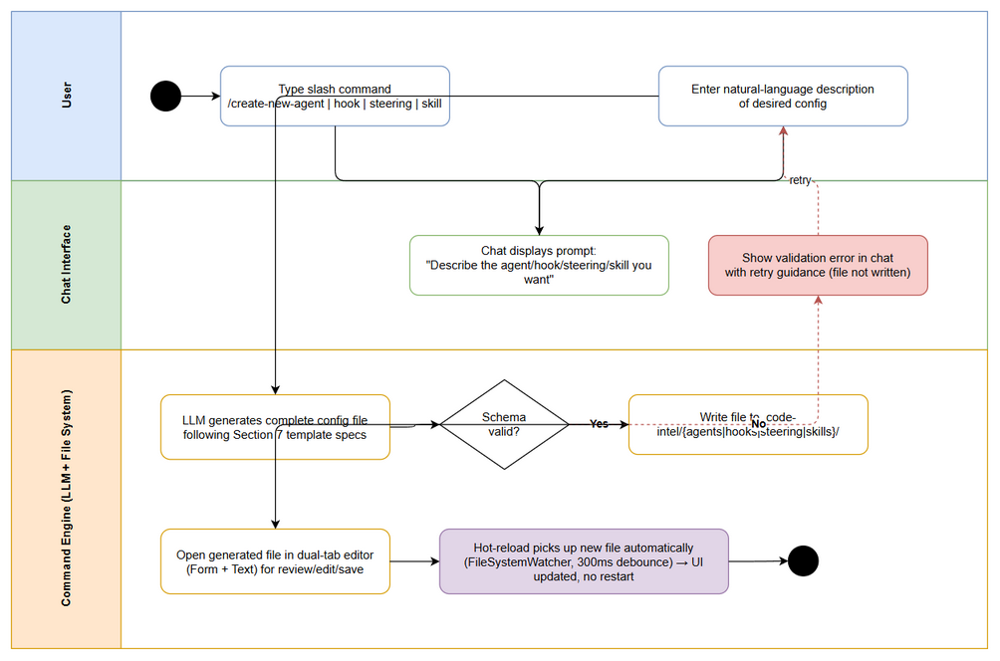

# Business Requirements Document (BRD)

## SDLC Agents 4 Enterprise — SA4E-193: Create Config Commands — /create-new-agent, hook, steering, skill

---

## Document Information

| Field | Value |
|-------|-------|
| Jira Ticket | SA4E-193 |
| Title | Create Config Commands — /create-new-agent, hook, steering, skill |
| Parent Epic | SA4E-181 — Chat Module — OpenCode Parity + Agentic Config System |
| Author | BA Agent |
| Version | 2.0 |
| Date | 2026-08-23 |
| Status | In Review |
| Source System | Jira (jiraassist.atlassian.net) |

## Revision History

| Version | Date | Author | Changes |
|---------|------|--------|---------|
| 1.0 | 2026-08-19 | BA Agent | Initial draft auto-generated from Jira ticket SA4E-193 |
| 2.0 | 2026-08-23 | BA Agent | Complete rewrite — full requirements captured from updated ticket description (CMD1–CMD4 commands table, 8-step flow, acceptance criteria), dependency details refreshed from SA4E-189 and SA4E-190; supersedes v1.0 entirely |

## Sign-Off

| Name | Signature and date |
|------|--------------------|
| Duc Nguyen Minh – Product Owner / Reporter | ☐ I agree and confirm all criteria on this BRD as expected requirements |
| | ☐ I agree and confirm all criteria on this BRD as expected requirements |

---

## Executive Summary

SA4E-193 delivers **4 slash commands** (`/create-new-agent`, `/create-new-hook`, `/create-new-steering`, `/create-new-skill`) in the Chat module of the SDLC Agents 4 Enterprise VS Code extension ("Kiro"). Each command lets a user type a natural-language description of the configuration they want (an agent role, a hook trigger/action, a steering rule, or a skill purpose) and have an **LLM generate a complete, schema-valid config file** directly into the correct `.code-intel/{agents,hooks,steering,skills}/` location.

After generation, the system writes the file to disk, opens it in the dual-tab custom editor (Form + Text) provided by SA4E-190 for review/editing, and the Hot-Reload system from SA4E-189 picks up the new file so the UI reflects it without restarting the extension.

This closes Gap Reference **CMD1 + CMD2 + CMD3 + CMD4 (Section 11)** of the agentic config system, removing the need for users to hand-write YAML frontmatter, JSON schemas, or markdown boilerplate.

## Business Objectives

| # | Objective | Measure of Success |
|---|-----------|--------------------|
| BO-1 | Reduce time to create valid agentic config files from minutes/hours of manual authoring to under one minute via natural language | Time-to-created-config per command < 60s excluding user typing time |
| BO-2 | Eliminate syntax/schema errors in hand-written agent, hook, steering, and skill files by generating them from Section 7 field-spec templates | 100% of generated files pass schema validation |
| BO-3 | Provide a consistent create → review → save workflow across all four config types using chat slash commands as single entry point | All 4 commands follow identical flow pattern |
| BO-4 | Integrate seamlessly with existing editor (dual-tab Form+Text) and hot-reload infrastructure so new configs are immediately visible and editable | Generated files open in editor; UI list updates without extension restart |

---

## 1. Introduction

### 1.1 Scope

In scope (from ticket SA4E-193 description):

1. **Four chat slash commands** that use LLM to generate config files from natural language description:

| Command | Input | Output | Location |
|---------|-------|--------|----------|
| `/create-new-agent` | Agent role description | `.md` with YAML frontmatter + system prompt | `.code-intel/agents/{name}.md` |
| `/create-new-hook` | Hook trigger/action description | `.json` following hook schema | `.code-intel/hooks/{name}.json` |
| `/create-new-steering` | Rule description | `.md` with optional frontmatter + body | `.code-intel/steering/{name}.md` |
| `/create-new-skill` | Skill purpose description | Folder + SKILL.md | `.code-intel/skills/{name}/SKILL.md` |

2. **Chat-driven prompt/response loop**: command triggers a chat prompt asking the user to describe what they want; user's reply is used as LLM input.
3. **LLM generation guided by templates**: LLM prompt includes Section 7 field specs as template guide.
4. **File writing** to the correct `.code-intel/` sub-directory with schema validation before write.
5. **Post-write integration**: generated file opens in dual-tab custom editor (Form + Text); hot-reload detects the new file automatically.

### 1.2 Out of Scope

The following are explicitly excluded (based on ticket scope statements of SA4E-193 and dependency tickets):

1. **Editing/deleting existing config files** — covered separately by the Custom Dual-Tab Editors story (SA4E-190) and Sidebar TreeView CRUD (UI5).
2. **LLM reactive system prompt rebuild on config change** — explicitly out of scope of SA4E-189 hot-reload; no backend LLM prompt rebuild when configs change.
3. **hookEngine.reload() auto-trigger for runtime behavior** — not part of hot-reload scope (SA4E-189).
4. **Graph recompile on config change** — out of scope (SA4E-189).
5. **Bulk import/export or migration of existing configs** — not mentioned in any ticket; To be confirmed with stakeholders.
6. **Non-English description input handling guarantees** — LLM output language behavior is not specified in tickets; To be confirmed with stakeholders.

### 1.3 Preliminary Requirement

Prerequisites before implementation/use:

1. **Hot-Reload System (SA4E-189)** — must be available so newly written config files are detected automatically (FileSystemWatcher with 300ms debounce watching `.code-intel/agents/*.md`, `.code-intel/steering/*.md`, `.code-intel/hooks/*.md`, `.code-intel/skills/*.md`). Status: Done (resolved 2026-08-23).
2. **Custom Dual-Tab Editors (SA4E-190)** — required for "opens file in Form + Text editor after generation" acceptance criterion. Status: To Do at time of BRD v2 creation; until delivered, files open in standard text editor (per implementation comment on SA4E-193).
3. **Working LLM connection** in the Chat module (existing infrastructure of the Kiro extension).
4. **`.code-intel/` directory convention** present in workspace (directories created on demand if missing).

---

## 2. Business Requirements

### 2.1 High Level Process Map

The end-to-end business process is identical in shape for all four commands:

1. User types a slash command (`/create-new-*`) in the chat input.
2. Chat prompts the user for a natural-language description of the desired config.
3. User submits the description.
4. LLM generates the complete config content following the relevant template specs (Section 7 field specs).
5. System validates the generated content against the target schema.
6. System writes the validated file to the correct location under `.code-intel/`.
7. System opens the generated file in the dual-tab editor (Form + Text) for review.
8. User reviews/edits and saves; hot-reload picks up the new file and updates the UI automatically — no restart needed.

A visual business flow diagram is provided in the [Diagrams](#diagrams) section below (business-flow.png).

### 2.2 List of User Stories / Use Cases

| # | Story / Use Case | Priority | Source Ticket |
|---|------------------|----------|---------------|
| 1 | As a developer using the Kiro chat, I want `/create-new-agent` to generate a complete agent `.md` config from my role description so that I can onboard new specialized agents without memorizing frontmatter fields. (CMD1) | MUST HAVE | SA4E-193 |
| 2 | As a developer, I want `/create-new-hook` to generate a hook `.json` matching the hook schema from my trigger/action description so that automation hooks are consistent and error-free. (CMD2) | MUST HAVE | SA4E-193 |
| 3 | As a developer, I want `/create-new-steering` to generate a steering rule `.md` from my rule description so that I can steer agent behavior declaratively without hand-writing markdown structure. (CMD3) | MUST HAVE | SA4E-193 |
| 4 | As a developer, I want `/create-new-skill` to create a skill folder with `SKILL.md` from my purpose description so that reusable skills follow the standard folder layout automatically. (CMD4) | MUST HAVE | SA4E-193 |

---
### 2.3 Details of User Stories

---

#### Business Flow (End-to-End, applies to all four commands)

**Step 1:** User types `/create-new-agent` (or `/create-new-hook`, `/create-new-steering`, `/create-new-skill`) in the chat input.

**Step 2:** Chat shows an input prompt, e.g. "Describe the agent you want" (adapted per command).

**Step 3:** User enters a natural-language description of the desired configuration.

**Step 4:** LLM generates the complete file content following Section 7 template specs (YAML frontmatter fields, hook JSON schema, markdown structure) as template guide in the prompt.

**Step 5:** System validates the generated output against the target schema and writes the file to the correct location (`.code-intel/agents/{name}.md`, `.code-intel/hooks/{name}.json`, `.code-intel/steering/{name}.md`, or `.code-intel/skills/{name}/SKILL.md` with folder creation).

**Step 6:** System opens the newly created file in the dual-tab custom editor (Form + Text tabs) — depends on SA4E-190; falls back to standard text editor while SA4E-190 is pending.

**Step 7:** User reviews/edits the file and saves.

**Step 8:** Hot-reload FileSystemWatcher detects the new/changed file (300ms debounce) and updates agents/hooks/steering/skills UI automatically — no extension restart required — depends on SA4E-189.

> **Note:** Steps are identical across all four commands except for the prompt text, LLM template guide, output format (.md vs .json vs folder+SKILL.md), and target directory. Source: SA4E-193 description "Flow" section.

---

#### STORY 1 (CMD1): Create Agent Config via /create-new-agent

> As a developer using the Kiro chat, I want `/create-new-agent` to generate a complete agent `.md` config from my role description so that I can onboard new specialized agents without memorizing frontmatter fields.

**Requirement Details:**

1. Slash command `/create-new-agent` is registered in the command registrar and appears in the slash menu.
2. Chat prompts: "Describe the agent you want"; user's reply is sent as generation instruction.
3. LLM prompt includes Section 7 field specs so the agent `.md` contains **all required YAML frontmatter fields + system prompt body**.
4. Generated agent name is sanitized to `{name}.md` filename; file written to `.code-intel/agents/`.

**Data Fields (generated agent .md frontmatter):**

| Field | Type | Required | Description | Example |
|-------|------|----------|-------------|---------|
| name | string | Yes | Unique agent identifier (kebab-case) used as filename | code-reviewer |
| label | string | No | Human-readable display label | Code Reviewer |
| phase | string | Yes | Lifecycle phase the agent operates in | development |
| tools | list[string] | No | Tool allow-list for the agent | [read, grep] |
| model | string | No | LLM model override | claude-sonnet-4 |
| outputDoc | string | No | Output document type produced by agent | review-report |
| *(body)* | markdown | Yes | Agent system prompt | "You are a senior reviewer..." |

**Acceptance Criteria:**

1. CMD1: `/create-new-agent` generates a valid agent `.md` with **all required frontmatter fields** present.
2. LLM prompt includes Section 7 field specs as template guide.
3. Generated file passes schema validation before write.
4. File is written to `.code-intel/agents/{name}.md`.
5. After write, file opens in the editor (custom dual-tab when SA4E-190 available).
6. Hot-reload detects the new agent file without restart (SA4E-189).

**Validation Rules:**

- Required frontmatter fields must exist after generation; missing required fields → regeneration/error path.
- `name` must be filesystem-safe; invalid characters stripped/replaced before writing.

**Error Handling:**

- LLM returns malformed/incomplete frontmatter: system reports failure in chat; file is not written; user may retry.
- Target file already exists: overwrite requires confirmation or auto-rename — To be confirmed with stakeholders (not specified in ticket).

---

#### STORY 2 (CMD2): Create Hook Config via /create-new-hook

> As a developer, I want `/create-new-hook` to generate a hook `.json` matching the hook schema from my trigger/action description so that automation hooks are consistent and error-free.

**Requirement Details:**

1. Slash command `/create-new-hook` triggers chat prompt describing trigger/action of the desired hook.
2. LLM generates a complete hook definition as **JSON strictly following the hook schema** (event types, patterns/toolTypes conditionals, action type radio between prompt/command).
3. File written to `.code-intel/hooks/{name}.json`.

**Data Fields (generated hook .json):**

| Field | Type | Required | Description | Example |
|-------|------|----------|-------------|---------|
| name | string | Yes | Unique hook identifier / filename base | pre-commit-guard |
| version | string | Yes | Schema version | 1.0.0 |
| enabled | boolean | Yes | Whether hook is active | true |
| eventType | enum | Yes | Trigger event type | before-prompt-submit |
| patterns / toolTypes | conditional | Conditional | Present depending on event type | ["*.ts"] |
| action.type | enum (prompt/command) | Yes | Action kind selected via radio semantics | prompt |
| action.prompt | textarea content | Conditional | Required when type = prompt | "Check for TODOs..." |
| action.command | shell command | Conditional | Required when type = command | npm run lint |

**Acceptance Criteria:**

1. CMD2: `/create-new-hook` generates valid hook `.json` **matching the hook schema**.
2. Generated file passes schema validation (JSON parse + field checks) before write.
3. Conditional fields (patterns/toolTypes, prompt/command) consistent with event/action selection.
4. File written to `.code-intel/hooks/{name}.json`; opens in editor after write; hot-reload picks it up.

**Validation Rules:**

- JSON must parse cleanly; unknown top-level keys rejected.
- Exactly one of action.prompt / action.command present according to action.type.

**Error Handling:**

- Invalid JSON from LLM: not written; error surfaced in chat with retry guidance.

---

#### STORY 3 (CMD3): Create Steering Config via /create-new-steering

> As a developer, I want `/create-new-steering` to generate a steering rule `.md` from my rule description so that I can steer agent behavior declaratively without hand-writing markdown structure.

**Requirement Details:**

1. Slash command `/create-new-steering` prompts for a rule description.
2. LLM generates steering markdown with **optional YAML frontmatter + body** per Section 7 specs.
3. File written to `.code-intel/steering/{name}.md`.

**Data Fields (generated steering .md):**

| Field | Type | Required | Description | Example |
|-------|------|----------|-------------|---------|
| inclusion | enum (always / fileMatch / manual) | No | When rule is included in context | always |
| description | string | No | Short purpose summary | Enforce REST API conventions |
| fileMatchPattern | glob | Conditional | Required when inclusion = fileMatch | src/api/**.ts |
| *(body)* | markdown | Yes | Rule instructions given to agents | "Always use DTO mapping..." |

**Acceptance Criteria:**

1. CMD3: `/create-new-steering` generates a valid steering `.md`.
2. Frontmatter optional but, when present, fields follow spec; body always present.
3. File passes schema validation; written to `.code-intel/steering/{name}.md`.
4. Opens in dual-tab editor after write; hot-reload reflects new steering rule immediately.

**Validation Rules:**

- If `inclusion: fileMatch`, `fileMatchPattern` must be non-empty.
- Body must contain at least one non-empty line of instructions.

**Error Handling:**

- Missing body or contradictory conditional fields: validation fails; nothing written; error shown in chat.

---

#### STORY 4 (CMD4): Create Skill Config via /create-new-skill

> As a developer, I want `/create-new-skill` to create a skill folder with `SKILL.md` from my purpose description so that reusable skills follow the standard folder layout automatically.

**Requirement Details:**

1. Slash command `/create-new-skill` prompts for the purpose of the skill.
2. LLM generates `SKILL.md` with required frontmatter (name, description, metadata); system creates the containing folder if absent.
3. Resulting layout: `.code-intel/skills/{name}/SKILL.md`.

**Data Fields (generated SKILL.md frontmatter):**

| Field | Type | Required | Description | Example |
|-------|------|----------|-------------|---------|
| name | string | Yes | Skill identifier, also folder name | release-versioning |
| description | string | Yes | What the skill does and when to use it | Git release process steps |
| metadata | object | No | Extra key/value metadata | {author: "..."} |
| *(body)* | markdown | Yes | Instructions/resources of the skill | Step-by-step procedure |

**Acceptance Criteria:**

1. CMD4: `/create-new-skill` creates **folder + SKILL.md with frontmatter**.
2. Folder `.code-intel/skills/{name}/` is created on demand; no collision errors on fresh workspace.
3. SKILL.md passes schema validation; opens in editor after write; hot-reload registers the new skill.

**Validation Rules:**

- Folder name equals sanitized `name` from frontmatter.
- Required frontmatter (name, description) must be present.

**Error Handling:**

- Existing skill folder with same name: write blocked or confirmed — To be confirmed with stakeholders (not specified in ticket).
- Folder creation permission failure: error surfaced in chat; partial artifacts cleaned up.

---
## 3. Dependencies

| Dependency | Type | Related Ticket | Description | Status |
|------------|------|----------------|-------------|--------|
| Hot-Reload System — FileSystemWatcher | System | SA4E-189 | Watches `.code-intel/agents/*.md`, `.code-intel/steering/*.md`, `.code-intel/hooks/*.md`, `.code-intel/skills/*.md` with 300ms debounce; reloads UI lists via postMessage without extension restart. Required for AC "Hot-reload detects new file". | Done (resolved 2026-08-23) |
| Custom Dual-Tab Editors — Form + Text | System | SA4E-190 | VS Code CustomEditorProvider editors for `.code-intel/agents/*.md`, hooks `.json`, steering `.md`, `SKILL.md`; Form and Text tabs sync bidirectionally. Required for AC "file opens in custom editor". | To Do |
| LLM Chat Infrastructure | Infrastructure | Epic SA4E-181 | Existing chat/LLM pipeline used to run generation prompts. | Available |

---

## 4. Stakeholders

| Role | Name / Team | Responsibility | Source |
|------|-------------|----------------|--------|
| Reporter / Product Owner | Duc Nguyen Minh | Owns requirements, reviews BRD, signs off | SA4E-193 reporter/creator/watcher |
| Developer | Extension team (implementation by Duc Nguyen Minh per commit comment) | Implements ConfigCommands, templates, slash menu integration | SA4E-193 comment 2026-08-23 |
| BA | BA Agent | Requirements documentation (this BRD) | Pipeline role |
| End Users | Developers using Kiro extension in enterprise workspaces | Use slash commands to create configs | Derived from product context |

---

## 5. Non-Functional Requirements

| Category | Requirement | Details |
|----------|-------------|---------|
| Performance | Generation round-trip should feel instant within chat UX | Target < 60s end-to-end per command excluding user typing time; hot-reload debounce fixed at 300ms (from SA4E-189) |
| Usability | Single entry point via slash menu; guided prompt flow | Commands discoverable in slash menu (`SlashMenuItems.ts`); prompt text adapts per config type |
| Reliability | No invalid file ever written to disk | Schema validation gate before write; failures reported in chat without partial artifacts |
| Consistency | Identical flow pattern across all 4 commands | Shared command handler architecture (`ConfigCommands.ts`, shared template registry) |
| Compatibility | Works with existing editor fallback | If SA4E-190 dual-tab editor unavailable, file opens in standard text editor without breaking the flow (per implementation comment on SA4E-193) |
| Maintainability | Templates centralized | Section 7 field specs maintained as templates in `extension/src/commands/config-templates/` so spec changes don't require code rewrites of handlers |

> Additional quantified targets (e.g., exact latency budgets, concurrency limits) were not specified in the tickets. To be confirmed with technical team.

---

## 6. Success Metrics

| # | Metric | Target | Measurement Method |
|---|--------|--------|--------------------|
| SM-1 | Command success rate | ≥ 95% of invocations produce a valid written file | Telemetry/logs of command runs vs validation failures |
| SM-2 | Schema validation pass rate | 100% of written files valid at write time | Validation gate results |
| SM-3 | Time-to-config | Median < 60s from description submit to file written | Timestamped logs (submit → write) |
| SM-4 | Hot-reload pickup | New file reflected in UI ≤ 1s after write (300ms debounce + refresh) | Manual/E2E verification per SA4E-189 behavior |
| SM-5 | Adoption | All four commands used at least once per active workspace within first week of release | Usage counters |
| SM-6 | Rework reduction | Reduction in manually-authored config files with schema errors vs baseline | Git history audit pre/post release |

---

## 7. Risks and Assumptions

### 7.1 Risks

| Risk | Impact | Likelihood | Mitigation |
|------|--------|------------|------------|
| LLM generates frontmatter/JSON that fails schema validation intermittently | Medium | Medium | Validation gate before write; retry loop; error surfaced in chat with actionable message; Section 7 specs embedded in prompt reduce drift |
| SA4E-190 dual-tab editor not yet delivered → "opens in custom editor" AC unmet | Medium | High (SA4E-190 status: To Do) | Graceful fallback to standard text editor (already implemented per ticket comment); track SA4E-190 to completion |
| Name collisions with existing config files cause silent overwrite or confusing duplicates | Medium | Low/Medium | Collision policy to be confirmed (confirm-or-rename); until then, surface clear chat warning when target exists |
| Hot-reload only updates UI lists, not runtime hook engine or LLM system prompt (scope limit of SA4E-189) | Low | Certain by design | Document expectation clearly: new configs appear in UI immediately; runtime behavior rebuilds are separate scope |
| User provides vague description → low-quality generated config | Medium | Medium | Prompt guidance in chat ("Describe the agent you want"); users review in editor before relying on the config |

### 7.2 Assumptions

- The workspace follows the `.code-intel/` directory convention; directories are created on demand.
- LLM connectivity is available whenever slash commands are invoked.
- Section 7 field-spec templates remain the single source of truth for generation prompts.
- Generated filenames derive from sanitized user/intent-provided names ({name} placeholder).
- SA4E-189 hot-reload behavior (300ms debounce, UI-only refresh) is stable and released (extension v1.33.0+).

---

## 8. Related Tickets

| Ticket Key | Summary | Status | Type | Relationship |
|------------|---------|--------|------|--------------|
| SA4E-193 | Create Config Commands — /create-new-agent, hook, steering, skill | In Review | Story | Main ticket |
| SA4E-181 | Chat Module — OpenCode Parity + Agentic Config System | Done | Epic | Parent epic |
| SA4E-189 | Hot-Reload System — FileSystemWatcher reactive prompt rebuild | Done | Story | Dependency (hot-reload picks up new files) |
| SA4E-190 | Custom Dual-Tab Editors — Form+Text editors for agent/hook/steering/skill | To Do | Story | Dependency (post-write editor experience) |

---

## 9. Appendix

### Glossary

| Term | Definition |
|------|------------|
| Kiro | VS Code–based AI coding assistant extension developed in this project (SDLC Agents 4 Enterprise) |
| Agent | An LLM persona defined by a markdown file with YAML frontmatter + system prompt, stored under `.code-intel/agents/` |
| Hook | Automation triggered on events, defined as JSON under `.code-intel/hooks/` following the hook schema |
| Steering | A rule guiding agent behavior, defined as markdown (optional frontmatter) under `.code-intel/steering/` |
| Skill | A reusable capability packaged as folder + SKILL.md under `.code-intel/skills/` |
| CMD1–CMD4 | Gap-reference IDs for the four create-config commands (Section 11 of gap analysis) |
| Section 7 field specs | Template specification source used to instruct the LLM during generation |
| Dual-Tab Editor | Custom VS Code editor offering Form tab and Text tab for the same config file (SA4E-190) |
| Hot-Reload | Automatic UI refresh on config file changes via FileSystemWatcher with 300ms debounce (SA4E-189) |
| Slash command | Chat input command beginning with "/" registered in the slash menu |

### Reference Documents

| Document | Link / Location |
|----------|-----------------|
| Jira ticket SA4E-193 | https://jiraassist.atlassian.net/browse/SA4E-193 |
| Jira epic SA4E-181 | https://jiraassist.atlassian.net/browse/SA4E-181 |
| Jira dependency SA4E-189 | https://jiraassist.atlassian.net/browse/SA4E-189 |
| Jira dependency SA4E-190 | https://jiraassist.atlassian.net/browse/SA4E-190 |
| UG.md (User Guide attachment on SA4E-193) | Jira attachment id 11191 |
| Repository | https://github.com/dnguyenminh/SDLC-Agents-4-Enteprise.git |

### Implementation Traceability (from ticket comments)

Per DEV comment on SA4E-193 (2026-08-23): implementation complete with files `extension/src/commands/ConfigCommands.ts`, `extension/src/commands/config-templates/` (4 templates), `extension/src/commands/CommandRegistrar.ts`, `extension/src/webview/slash-menu/SlashMenuItems.ts`, `extension/src/webview/input/InputAreaIntegration.ts`; all tests pass; branch SA4E-193 pushed.

---

## Diagrams

### Diagram Index

| # | Diagram | PNG (embedded below) | Editable Source |
|---|---------|----------------------|-----------------|
| 1 | Use Case Diagram — Actor & 4 create-config use cases | `diagrams/use-case.png` | `diagrams/use-case.drawio` |
| 2 | Business Flow — Slash command → LLM generation → validate → write → editor → hot-reload | `diagrams/business-flow.png` | `diagrams/business-flow.drawio` |

### Use Case Diagram

*[Edit in draw.io](diagrams/use-case.drawio)*

### Business Flow Diagram

*[Edit in draw.io](diagrams/business-flow.drawio)*
