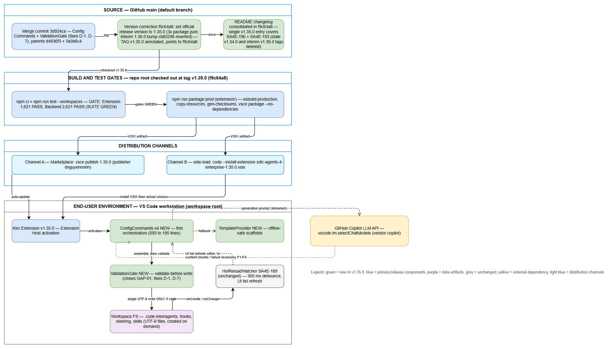
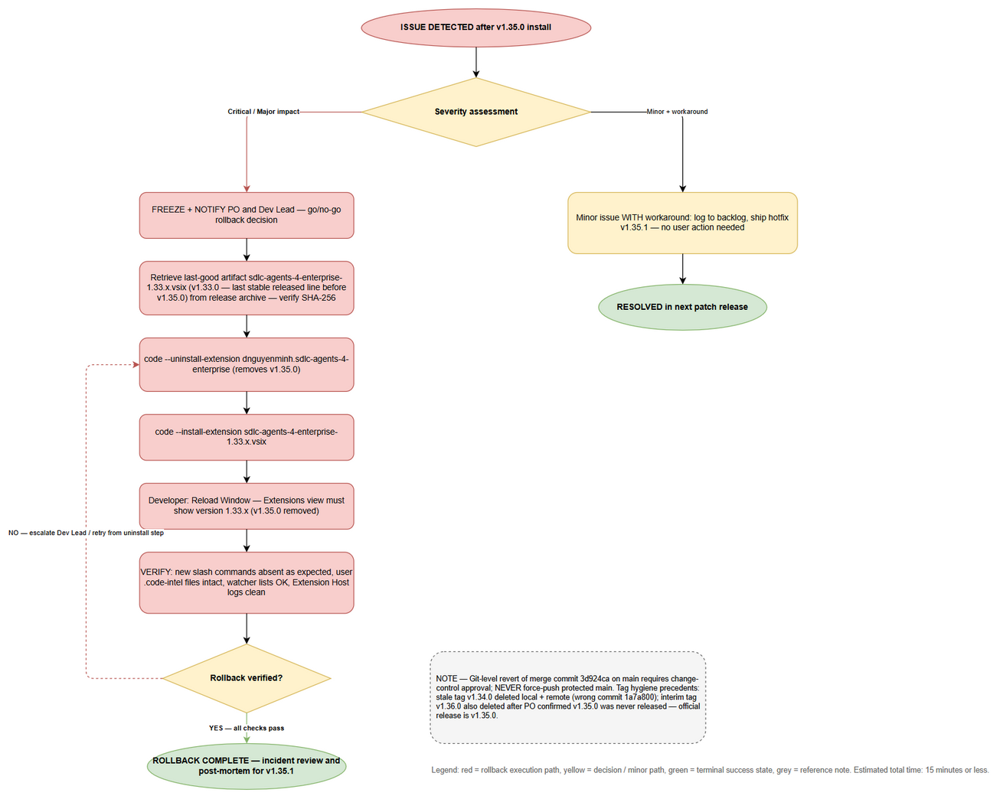

# Deployment Guide (DPG)

## SDLC Agents 4 Enterprise (Kiro Extension) — SA4E-193: Config Commands with ValidationGate

---

## Document Information

| Field | Value |
|-------|-------|
| Jira Ticket | SA4E-193 |
| Title | Config Commands with ValidationGate — /create-new-agent, /create-new-hook, /create-new-steering, /create-new-skill |
| Parent Epic | SA4E-181 — Chat Module — OpenCode Parity + Agentic Config System |
| Release Version | **v1.35.0** (covers SA4E-190 + SA4E-193) |
| Author | DevOps Agent |
| Version | 1.1 |
| Date | 2026-08-24 |
| Status | Released (post-merge documentation of record) |
| Related TDD | TDD.md v2.0 (`documents/SA4E-193/TDD.md`) |
| Related Reports | TEST-REPORT.md v3.0 (SUITE GREEN), UG.md v2 |

---

## Revision History

| Version | Date | Author | Changes |
|---------|------|--------|---------|
| 1.0 | 2026-08-24 | DevOps Agent | Initiate document — auto-generated from TDD v2.0, BRD v2.0, TEST-REPORT v3.0; release merged to `main` (default branch) |
| 1.1 | 2026-08-24 | DevOps Agent | Release version correction v1.36.0 → v1.35.0 per PO decision (v1.35.0 was never released; SA4E-193 ships as official v1.35.0) |

---

## Sign-Off

| Name | Role | Signature and date |
|------|------|--------------------|
| Duc Nguyen Minh | Dev Lead / Product Owner | ☐ Approved for deployment |
| QA Lead | QA Lead | ☐ Testing completed (TEST-REPORT v3.0 — SUITE GREEN) |
| Ops Lead | Ops Lead | ☐ Infrastructure ready |

---

## 1. Overview

### 1.1 Feature Summary

SA4E-193 delivers **4 chat slash commands** in the Kiro VS Code extension that generate complete, schema-valid agentic config files from a natural-language description:

| Command | Output Artifact | Target Path |
|---------|----------------|-------------|
| `/create-new-agent` | Markdown + YAML frontmatter + system prompt body | `.code-intel/agents/{name}.md` |
| `/create-new-hook` | Strict-schema JSON (canonical serialization) | `.code-intel/hooks/{name}.json` |
| `/create-new-steering` | Markdown ± optional frontmatter | `.code-intel/steering/{name}.md` |
| `/create-new-skill` | Skill folder + SKILL.md | `.code-intel/skills/{name}/SKILL.md` |

Key engineering guarantees introduced by this release:

- **ValidationGate** — a mandatory validate-before-write gate closes **GAP-01** and fixes production defects **D-1..D-7** (frontmatter dedup, strict hook schema, empty-stream handling, skill name forcing, canonical serialization).
- **Template fallback** — deterministic scaffolds when the LLM is unavailable; creation is never blocked by LLM outage (offline-safe).
- **Hot-reload integration** — written files are picked up by the SA4E-189 watcher (300 ms debounce) with no extension restart.

### 1.2 Release & Git Facts

| Item | Value |
|------|-------|
| Default branch | `main` |
| Merge commit into main | `3d924ca` — "Merge branch 'SA4E-193' — Config Commands with ValidationGate (fixes D-1..D-7)" (parents `d4836f3` + `3a3b6c4`) |
| Version commit (**tag target**) | `f9c64a8` — "set official release version to 1.35.0": all 3 package.json corrected **1.36.0 → 1.35.0** (correction commit) + README changelog consolidated into a single `### v1.35.0 (2026-08-24)` entry covering SA4E-190 + SA4E-193 |
| Annotated tag | `v1.35.0` → points to `f9c64a8` (pushed to origin; verified `git ls-remote`: `v1.35.0^{commit}` = `f9c64a8`) |
| Superseded history (record only) | Intermediate bump `cb83296` (all 3 package.json 1.35.0 → 1.36.0) and its annotated tag `v1.36.0` (→ `cb83296`) were **reverted/deleted local + remote** after PO confirmed the 1.35 line had never been released; README changelog commits `c492837` superseded by `f9c64a8` |
| Tag hygiene precedent | Stale tag `v1.34.0` deleted local+remote earlier (had pointed at wrong commit `1a7a800` of SA4E-206); interim tag `v1.36.0` deleted on this correction — official tag is now `v1.35.0` |
| Release coverage | **v1.35.0 covers SA4E-190 + SA4E-193** — first tagged release of the 1.35 line; last valid released baseline remains **v1.33.0** |
| Final refactor included | `a618e0b` — ConfigCommands.ts 593 → 195 lines (thin orchestrators) + 8 new modules + 64 ValidationGate regression tests |

### 1.3 Deployment Scope

| Item | Type | Description |
|------|------|-------------|
| Extension module (`extension/`) | Modified + New | Refactored `ConfigCommands.ts` (593 → 195 lines, thin orchestrators); NEW modules: `validation-gate.ts`, `hook-gate.ts`, `llm-prompts.ts`, `template-provider.ts`, `frontmatter-utils.ts`, `file-writer.ts`, `config-command-specs.ts`, `name-extractor.ts`; NEW templates under `extension/src/commands/config-templates/` |
| Backend (`backend/`) | None (functional) | No functional change from SA4E-193; version corrected to 1.35.0 in lockstep (`f9c64a8`); full suite re-run green (2,621 tests) as regression proof |
| Admin UI (`admin-ui/`) | None (functional) | Version bump only |
| Database | N/A | Feature persists plain files under `<workspace>/.code-intel/`; no database, no migration |
| Configuration | None | No new environment variables, properties, or feature flags required |
| Infrastructure | None | No servers/containers changed; distribution is via extension package (VSIX / marketplace publish) |

### 1.4 Target Environments

The product is a VS Code extension monorepo; "environments" map to build/distribution channels:

| Environment | Channel | Deploy Order | Approval Required |
|-------------|---------|--------------|-------------------|
| DEV | Local dev build (`esbuild-watch` + F5 launch) | 1st | No |
| SIT | Side-loaded debug VSIX (`package:debug`) on QA machines | 2nd | No |
| UAT | Side-loaded prod VSIX (`package:prod`) on business validators | 3rd | QA Sign-off |
| PROD | Marketplace publish (`vsce publish 1.35.0`) or enterprise VSIX distribution | 4th | PO + Dev Lead Sign-off |

---

## 2. Prerequisites

### 2.1 Infrastructure

| Requirement | Status | Notes |
|-------------|--------|-------|
| Build machine with npm workspaces support | Ready | Monorepo root scripts: `npm run build --workspaces`, `npm run test --workspaces` |
| Node.js ≥ 18.14.1 | Ready | Required by backend test setup (vitest v4.x) and vsce packaging |
| VS Code engine ≥ 1.85.0 on target workstations | Ready | `extension/package.json` engines constraint |
| GitHub Copilot LLM availability (end users) | Ready | Generation uses `vscode.lm.selectChatModels({ vendor: "copilot" })`; outage degrades gracefully to template fallback |
| Release archive of previous VSIX (v1.33.x) | Required | MUST exist before PROD rollout — rollback artifact per Section 8 (v1.33.0 is the last valid released baseline) |

### 2.2 Software Dependencies

| Dependency | Version | Status |
|-----------|---------|--------|
| Node.js runtime | ≥ 18.14.1 | Installed on build machine |
| TypeScript | ^5.4.0 | Locked via `extension/package.json` |
| esbuild bundler | ^0.21.0 | `npm run esbuild-production` |
| @vscode/vsce packager | current | `vsce package --no-dependencies` |
| Vitest | ^4.1.x | Test gate runner (extension + backend suites) |
| Git | ≥ 2.x | Tag verification (`v1.35.0` → `f9c64a8`) |

### 2.3 Access Requirements

| Access | Type | Who Needs It |
|--------|------|-------------|
| Repository read at tag `v1.35.0` | Git clone/pull | Build engineer |
| Marketplace publisher account (`dnguyenminh`) | Credentials/PAT | Release manager (PROD only) |
| VS Code CLI on target machines | Local admin/user | QA + end users (VSIX side-load) |
| Jira project access | Service account | SM attaches DPG/RLN artifacts |

### 2.4 Backup Requirements

- [ ] Previous release artifact archived: `sdlc-agents-4-enterprise-1.33.x.vsix` (v1.33.0) stored in release archive (rollback prerequisite — last stable released line before v1.35.0)
- [ ] Database backup: **N/A** — no database involved in this feature
- [ ] Configuration backup: **N/A** — no deploy-time configuration changes; user workspace files under `.code-intel/` are user-owned and untouched by install/uninstall
- [x] Git state backup: tag `v1.35.0` → `f9c64a8` + merge commit `3d924ca` pushed to origin (verified)

---
## 3. Pre-Deployment Checklist

All items below were verified for release v1.35.0 on 2026-08-24:

| # | Item | Responsible | Status |
|---|------|-------------|--------|
| 1 | Code merged to `main` (merge commit `3d924ca`) | Developer | ✅ |
| 2 | Extension unit tests passed — 1,621/1,621 (+64 ValidationGate regression tests D-1..D-7, 0 regression vs 1,557 baseline) | Developer | ✅ |
| 3 | Backend unit/integration/E2E-API tests passed — 2,621/2,621 full green (13 prior E2E-API failures resolved by refactor `a618e0b`) | QA | ✅ |
| 4 | QA sign-off obtained — TEST-REPORT v3.0 verdict **SUITE GREEN** | QA | ✅ |
| 5 | Database backup completed | DBA | ✅ N/A — no database in scope |
| 6 | Configuration files prepared | DevOps | ✅ N/A — no deploy-time config changes |
| 7 | Feature flags configured | Developer | ✅ N/A — no feature flags in this release |
| 8 | Monitoring/alerting configured | DevOps | ✅ N/A server-side; success-metrics audit plan defined (§7.4) |
| 9 | Rollback plan reviewed (Section 8 + rollback-flow diagram) | Team | ✅ |
| 10 | Release window confirmed — 2026-08-24 | PM | ✅ |

---

## 4. Database Migration

**Not applicable.** SA4E-193 introduces **no database schema changes and no data migration**:

- Persistence is plain UTF-8 files under the end-user workspace: `.code-intel/{agents,hooks,steering,skills}/`.
- Directories are created on demand at first write (`writeFileWithMkdir()`); fresh workspaces are safe.
- Artifacts written by v1.35.0 remain valid when the extension is downgraded (older versions simply ignore the new files; formats follow the pre-existing `.code-intel` convention).

### 4.1 Verification Instead of Migration Queries

Post-install file-integrity spot checks (run inside any test workspace):

```powershell
# After creating an agent via /create-new-agent
Get-Content .code-intel/agents/<name>.md -TotalCount 2   # must start with '---' frontmatter block

# After creating a hook via /create-new-hook
node -e "JSON.parse(require('fs').readFileSync('.code-intel/hooks/<name>.json','utf8')); console.log('valid JSON')"
```

### 4.2 Rollback of Data

No database rollback exists or is needed. Generated workspace files may optionally be removed by the user (`git clean` inside their repo if tracked); the uninstaller never touches user workspaces.

---

## 5. Application Deployment

### 5.1 Deployment Architecture



*[Edit in draw.io](diagrams/deployment-architecture.drawio)*

The pipeline is: **Source (main @ merge `3d924ca` + version commit `f9c64a8`, tag `v1.35.0`) → Build & Test gates → VSIX package → Distribution (marketplace / side-load) → End-user VS Code workstation** where the extension host runs the new command modules, writes validated configs to `.code-intel/`, and hands off to the pre-existing hot-reload watcher.

### 5.2 Build & Package Steps

Execute from repository root at tag `v1.35.0`:

| Step | Action | Command | Verification |
|------|--------|---------|-------------|
| 1 | Checkout release state | `git fetch --tags && git checkout v1.35.0` | `git describe --tags` → `v1.35.0`; `git rev-parse v1.35.0^{commit}` → `f9c64a8…` |
| 2 | Verify merge lineage | `git log --oneline -3 main` | Contains `3d924ca` merge commit |
| 3 | Install dependencies (all workspaces) | `npm ci` | Clean install, no errors |
| 4 | Extension test gate | `npm run test --workspace=extension` | **Expected: 1,621 passed / 0 failed** (~80s) |
| 5 | Backend regression gate | `npm run test --workspace=backend && npm run test:e2e-api --workspace=backend` | **Expected: 2,621 passed / 0 failed** (~180s) |
| 6 | Package production VSIX | `cd extension && npm run package:prod` | Artifact `extension/sdlc-agents-4-enterprise-1.35.0.vsix` created (esbuild-production + copy-resources + gen-checksums + `vsce package --no-dependencies`) |
| 7 | Record checksums | `Get-FileHash extension\sdlc-agents-4-enterprise-1.35.0.vsix -Algorithm SHA256` | Hash recorded in release notes/receipt |

### 5.3 Distribution & Install Steps

**PROD channel A — Marketplace publish (release manager):**

```powershell
cd extension
npx @vscode/vsce publish 1.35.0        # publishes dnguyenminh.sdlc-agents-4-enterprise v1.35.0
```

**PROD channel B — Enterprise VSIX side-load (per workstation):**

```powershell
code --install-extension .\sdlc-agents-4-enterprise-1.35.0.vsix
```

**SIT/UAT channels:** same side-load command using the debug/prod VSIX built per §5.2 step 6 (`package:debug` for SIT).

| Step | Action | Command | Verification |
|------|--------|---------|-------------|
| 1 | Install/side-load VSIX | `code --install-extension sdlc-agents-4-enterprise-1.35.0.vsix` | CLI exits 0: "Extension 'sdlc-agents-4-enterprise' v1.35.0 was successfully installed." |
| 2 | Reload window | Command Palette → "Developer: Reload Window" | Extension Host restarts without errors |
| 3 | Version check | Extensions view → search "SDLC Agents" | Shows **1.35.0**, no reload prompt pending |

> Docker deployment is not applicable — this release ships as a VSIX, not a container image. No docker-compose changes are included.

---
## 6. Configuration Changes

**None required.** This release requires zero deploy-time configuration:

### 6.1 New Environment Variables

| Variable | Description | DEV | SIT | UAT | PROD |
|----------|-------------|-----|-----|-----|------|
| *(none)* | No new environment variables introduced | — | — | — | — |

### 6.2 Application Properties Changes

| Property | Old Value | New Value | File |
|----------|-----------|-----------|------|
| `version` (extension/package.json) | 1.36.0 (interim bump `cb83296`, never released) | **1.35.0** (correction commit `f9c64a8`) | `extension/package.json` (baked into VSIX at build) |
| `version` (backend/package.json) | 1.36.0 (interim bump `cb83296`, never released) | **1.35.0** (correction commit `f9c64a8`) | `backend/package.json` |
| `version` (root/admin-ui package.json) | 1.36.0 (interim bump `cb83296`, never released) | **1.35.0** (correction commit `f9c64a8`) | lockstep correction commit `f9c64a8` |

Runtime behavior notes:

- LLM access uses the built-in Copilot model selection (`vscode.lm.selectChatModels({ vendor: "copilot" })`) — no keys or endpoints to configure.
- Hot-reload watcher globs and 300 ms debounce are unchanged from SA4E-189 (already active since v1.33.0+).
- Templates are bundled inside the VSIX (`config-templates/` via `copy-resources`) — no external template hosting.

### 6.3 Feature Flags

| Flag | DEV | SIT | UAT | PROD |
|------|-----|-----|-----|------|
| *(none — feature is always-on once v1.35.0 installed)* | — | — | — | — |

---

## 7. Post-Deployment Verification

### 7.1 Health Checks

This is a client-side extension; "health" = clean activation and command registration on a representative workstation.

| Check | Endpoint/Command | Expected Result | Timeout |
|-------|-----------------|-----------------|---------|
| Extension activation | Open workspace → Output panel → "Extension Host" | No activation errors; extension activates silently | 30s |
| Installed version | Extensions view → "SDLC Agents 4 Enterprise" | Version reads **1.35.0** | 10s |
| Command registration | Chat slash menu / Command Palette → type `/create-new-` | All 4 commands listed: agent, hook, steering, skill | 10s |
| Backend unaffected (if backend deployed alongside) | `npm run test:e2e-api --workspace=backend` in CI | 2,621 passed | 300s |

### 7.2 Smoke Tests

Run each scenario in a scratch workspace after install:

| # | Scenario | Steps | Expected Result |
|---|----------|-------|-----------------|
| 1 | Create agent | `/create-new-agent` → describe role → confirm kebab-case name | `.code-intel/agents/{name}.md` written with frontmatter (`name`, `label`, `phase`, `tools`) + body; file auto-opens in editor; success toast |
| 2 | Create hook | `/create-new-hook` → describe trigger/action | Valid `{name}.json` written; parses cleanly; only allowed top-level keys present |
| 3 | Create steering | `/create-new-steering` → describe rule | `.code-intel/steering/{name}.md` written; body non-empty |
| 4 | Create skill | `/create-new-skill` → describe purpose | `.code-intel/skills/{name}/SKILL.md` created; frontmatter `name` equals folder name exactly |
| 5 | Gate rejection (GAP-01 proof) | Force invalid generation (e.g., malformed JSON hook via prompt manipulation) | Error toast "Failed to create …: {reason}"; **no file written** to target dir |
| 6 | Offline fallback | Disconnect Copilot LLM (or simulate failure) → run any command | Deterministic template scaffold written instead of failing; flow completes |
| 7 | Hot-reload pickup | After any successful write | New config appears in UI list within ≤ 1s without window reload |

### 7.3 Log Verification

| Log Entry | Level | Expected | Location |
|-----------|-------|----------|----------|
| `[ConfigCommands] …` fallback diagnostics | DEBUG (console.debug) | Only when LLM unavailable/failure taxonomy F1–F4 triggers | Developer Tools console |
| Validation rejections | Toast + session log | Reason text surfaced; nothing persisted | Developer Tools console |
| Unhandled exceptions | ERROR | **Must be absent** during smoke scenarios | Developer Tools console / Extension Host output |

### 7.4 Monitoring Dashboard

No server dashboards exist for this release. Post-release audit per BRD success metrics:

- [ ] SM-1 command success rate ≥ 95% of invocations produce a valid file (session-log audit, first week)
- [ ] SM-2 schema validation pass rate = 100% at write time (by construction — gate blocks otherwise)
- [ ] SM-3 median time-to-config < 60s excluding typing
- [ ] SM-4 hot-reload pickup ≤ 1s after write
- [ ] No unexpected user reports of blocked writes (gate false-positives) — would trigger §8.2 criteria

---

## 8. Rollback Plan

### 8.1 Rollback Flow



*[Edit in draw.io](diagrams/rollback-flow.drawio)*

### 8.2 Rollback Decision Criteria

| Condition | Action |
|-----------|--------|
| Commands fail to register / extension fails to activate on PROD workstations | Immediate rollback to v1.33.x VSIX (last stable released line) |
| ValidationGate false-negatives block valid writes at scale (> 5% of invocations report "Failed to create…") | Immediate rollback |
| Data integrity concern — invalid file ever observed on disk post-write (should be impossible by design) | Immediate rollback + engineering investigation |
| Generated-file corruption reported | Immediate rollback + investigate affected workspaces |
| Minor UI/cosmetic issue with available workaround | No rollback — schedule hotfix v1.35.1 |
| Single-user local issue (workspace-specific) | Troubleshoot locally — no global rollback |

### 8.3 Rollback Steps

Rollback is an artifact downgrade — no database, no configuration, no server state.

| Step | Action | Command | Verification |
|------|--------|---------|-------------|
| 1 | Freeze & notify | Notify PO + Dev Lead (decision gate per diagram) | Acknowledgment recorded |
| 2 | Acquire last-good artifact | Retrieve `sdlc-agents-4-enterprise-1.33.x.vsix` (v1.33.0) from release archive | File hash matches archive record |
| 3 | Uninstall current version | `code --uninstall-extension dnguyenminh.sdlc-agents-4-enterprise` | CLI confirms removal of v1.35.0 |
| 4 | Install previous version | `code --install-extension sdlc-agents-4-enterprise-1.33.x.vsix` | CLI: "was successfully installed." |
| 5 | Reload window | Command Palette → "Developer: Reload Window" | Extension Host restarts clean |
| 6 | Verify rollback | Extensions view shows **1.33.x**; `/create-new-*` commands absent (expected); existing `.code-intel/` files intact and still listed by watcher | Smoke §7.2 #7 passes |
| 7 | Post-mortem input | Capture incident details for fix release v1.35.1 | Ticket created |

Notes:

- **User data safety:** uninstalling never deletes workspace files under `.code-intel/`; artifacts produced by v1.35.0 stay valid under older versions.
- **Git-level rollback (exceptional):** reverting merge commit `3d924ca` on `main` is NOT automatic and requires change-control approval; if executed, delete the release tag local+remote following the same procedure used for the stale `v1.34.0` cleanup and the interim `v1.36.0` removal. Never force-push protected `main`.
- **Marketplace rollback:** if channel A was used, unpublish/mark v1.35.0 deprecated in publisher portal while side-loading v1.33.x internally.

### 8.4 Rollback Time Estimate

| Action | Estimated Time |
|--------|---------------|
| Decision & notification | 5 min |
| Artifact retrieval + uninstall/install per workstation | 5 min |
| Verification (§8.3 steps 5–6) | 5 min |
| **Total** | **≤ 15 min** |

---
## 9. Environment-Specific Notes

### 9.1 DEV

- Build locally: `npm run esbuild-watch --workspace=extension` + F5 launch (Extension Development Host).
- No tagging/publishing; test against working tree.
- ValidationGate unit tests: `npm run test --workspace=extension` — 1,621 expected green.

### 9.2 SIT

- Side-load debug VSIX: `cd extension && npm run package:debug` then `code --install-extension sdlc-agents-4-enterprise-1.35.0.vsix`.
- QA validates all 7 smoke scenarios (§7.2) including gate-rejection and offline-fallback paths.
- Backend E2E-API suite must be green in CI before UAT promotion.

### 9.3 UAT

- Side-load **prod** VSIX (`package:prod`) on validator machines.
- Business validation focuses on BO-1..BO-4 (BRD): time-to-config < 60s, zero schema errors, consistent flow across 4 commands, hot-reload visibility.
- QA sign-off required before PROD promotion.

### 9.4 PROD

- **Deployment Window:** 2026-08-24 (release executed post-merge of `3d924ca`; official release tag `v1.35.0` cut at version commit `f9c64a8`)
- **Approval Required From:** Product Owner (Duc Nguyen Minh) + Dev Lead
- **Communication Plan:** announce in team channel with RLN link; SM attaches DPG/RLN to Jira SA4E-193
- **On-Call Contact:** DevOps rotation (per team roster)
- **Special note — release version correction:** interim tag `v1.36.0` (→ `cb83296`) was deleted local+remote after the PO confirmed v1.35.0 had never been released. SA4E-193 therefore ships as the official release **v1.35.0**, which covers both **SA4E-190** (Pipeline Autonomy L3 Reset & Rebuild) and **SA4E-193** (Config Commands with ValidationGate). Precedent retained: legacy tag `v1.34.0` (wrong commit `1a7a800`, SA4E-206 work) was also deleted local+remote during this release — do not re-create it. Next tags: hotfix ≥ `v1.35.1`, next minor ≥ `v1.36.0`.

---

## 10. Appendix

### Contacts

| Role | Name | Contact |
|------|------|---------|
| Release Manager / DevOps Lead | *(team roster)* | on-call channel |
| Product Owner / Reporter | Duc Nguyen Minh | via Jira SA4E-193 |
| On-Call Dev | Extension team rotation | on-call channel |

### Related Tickets

| Ticket | Summary | Relationship |
|--------|---------|-------------|
| SA4E-193 | Config Commands with ValidationGate | Main ticket (this release) |
| SA4E-181 | Chat Module — OpenCode Parity + Agentic Config System | Parent epic |
| SA4E-189 | Hot-Reload System — FileSystemWatcher (300 ms debounce) | Dependency — Done, ships since v1.33.0+ |
| SA4E-190 | Custom Dual-Tab Editors — Form+Text | Dependency — To Do; graceful text-editor fallback active |

### Diagram Index

| # | Diagram | Image | Source (editable) |
|---|---------|-------|-------------------|
| 1 | Deployment Architecture — release pipeline from source to end-user workstation |  | [deployment-architecture.drawio](diagrams/deployment-architecture.drawio) |
| 2 | Rollback Flow — issue detection, severity decision, downgrade steps, verification loop |  | [rollback-flow.drawio](diagrams/rollback-flow.drawio) |

Related diagrams maintained in TDD.md: [architecture.png](diagrams/architecture.png), [component.png](diagrams/component.png), [class-diagram.png](diagrams/class-diagram.png).

---

*DPG v1.1 — DevOps Agent, 2026-08-24. Sources: TDD.md v2.0, BRD.md v2.0, TEST-REPORT.md v3.0, verified git state of `main` @ merge `3d924ca` / version commit & tag `f9c64a8` (`v1.35.0`). v1.1: release version corrected v1.36.0 → v1.35.0 per PO decision.*
