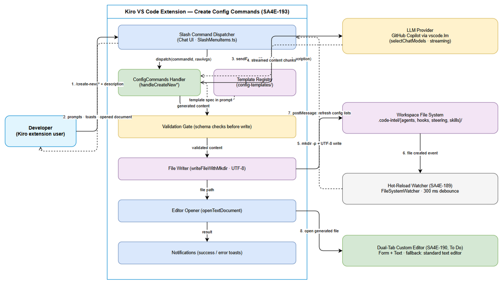
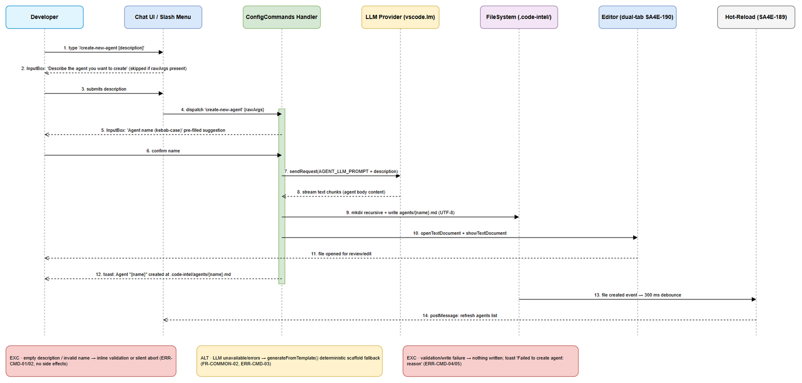
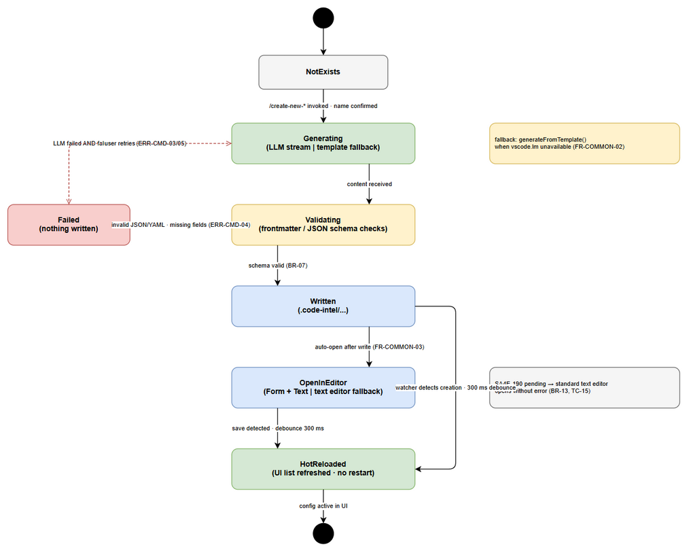

# Functional Specification Document (FSD)

## SDLC Agents 4 Enterprise — SA4E-193: Create Config Commands — /create-new-agent, hook, steering, skill

---

## Document Information

| Field | Value |
|-------|-------|
| Jira Ticket | SA4E-193 |
| Title | Create Config Commands — /create-new-agent, hook, steering, skill |
| Parent Epic | SA4E-181 — Chat Module — OpenCode Parity + Agentic Config System |
| Author | BA Agent |
| Version | 2.1 |
| Date | 2026-08-23 |
| Status | In Review |
| Related BRD | documents/SA4E-193/BRD.md (v2.0) |
| TA Review | TA Agent — v2.1 enrichment verified line-by-line against extension/src/commands/ConfigCommands.ts (593 lines) + config-templates/* |
| Source Code Baseline | extension/src/commands/ConfigCommands.ts (593 lines), extension/src/commands/config-templates/* |

## Revision History

| Version | Date | Author | Changes |
|---------|------|--------|---------|
| 1.0 | 2026-08-22 | BA Agent | Initial draft generated alongside first implementation pass ("SM Agent SA4E-193 L3") |
| 2.0 | 2026-08-23 | BA Agent | Complete rewrite — supersedes v1.0 ENTIRELY. Realigned to BRD v2.0; verified against actual source code ConfigCommands.ts and config-templates/; FR-CMD1..CMD4 + UC-01..UC-04 with Main/Alternative/Exception flows; Business Rules BR-01..BR-20; authoritative data schemas (agent YAML frontmatter, hook JSON schema, steering md, SKILL.md); UI specifications with exact dialog strings from code; error catalogue ERR-CMD-01..09; test scenarios TC-01..TC-16; implementation gap register GAP-01..GAP-06 |
| 2.1 | 2026-08-23 | TA Agent | Technical enrichment pass (no BA content removed/altered): per-command LLM Integration Contracts — prompt anatomy, transport params, failure taxonomy, fallback matrices (§5.1.1); algorithm pseudocode for extractNameFromDescription, validation gate, writeFileWithMkdir, hot-reload integration point (§6.6); supplementary Alternative/Exception flows AF-04/05, EF-06, AF-13, EF-15, AF-23/24, AF-33/34, EF-35; quantified NFR engineering targets (§8.1); TA test scenarios TC-17..TC-21 (§10.2); data-model verification notes (§4); code-baseline Discrepancy Register D-1..D-7 (§11.4); Open Issues OI-01..OI-09 (§11.5) |

## Sign-Off

| Name | Signature and date |
|------|--------------------|
| Duc Nguyen Minh – Product Owner | ☐ I agree and confirm all criteria on this FSD as expected specification |
| Tech Lead / SA | ☐ I agree and confirm all criteria on this FSD as expected specification |

---

## 1. Introduction

### 1.1 Purpose

This Functional Specification Document defines **HOW** the four configuration-creation slash commands of the Kiro VS Code extension behave functionally:

- `/create-new-agent` — generates an agent definition (`.md` with YAML frontmatter + system prompt body)
- `/create-new-hook` — generates a hook configuration (`.json` following the hook schema)
- `/create-new-steering` — generates a steering rule (`.md` with optional YAML frontmatter)
- `/create-new-skill` — generates a skill package (folder + `SKILL.md`)

It specifies the chat-driven prompt/response loop, LLM generation with template-guided prompts, validation, file writing to `.code-intel/`, editor integration (dual-tab Form+Text per SA4E-190, with fallback), and interaction with the Hot-Reload watcher (SA4E-189).

Traceability: every functional requirement cites its source BRD story (BRD v2.0 §2.3, Stories CMD1–CMD4) and/or ticket acceptance criteria (SA4E-193).

### 1.2 Scope

**In scope** (mirrors BRD §1.1):

1. Registration and slash-menu discoverability of the 4 commands.
2. Guided input flow: description prompt → name confirmation (kebab-case, pre-filled suggestion).
3. LLM generation using per-type system prompts embedding the Section 7 field-spec templates (`extension/src/commands/config-templates/`).
4. Deterministic template-based fallback generation when the LLM is unavailable.
5. Schema validation gate before write (specified as MUST; see GAP-01 for current implementation status).
6. File persistence to `.code-intel/{agents,hooks,steering,skills}/` with automatic parent-directory creation.
7. Post-write behaviour: open generated file in editor; success/error notifications.
8. Integration contracts with Hot-Reload (SA4E-189) and Dual-Tab Editor (SA4E-190).

**Out of scope** (inherits BRD §1.2):

1. Editing/deleting existing configs (SA4E-190 editors, Sidebar TreeView CRUD UI5).
2. LLM reactive system-prompt rebuild on config change.
3. `hookEngine.reload()` runtime auto-trigger.
4. Graph recompile on config change.
5. Bulk import/export/migration of existing configs.
6. Guaranteed non-English description handling (To be confirmed with stakeholders).

### 1.3 Definitions & Acronyms

| Term | Definition |
|------|------------|
| Kiro | VS Code–based AI coding assistant extension developed in this project (SDLC Agents 4 Enterprise) |
| Slash command | Chat input command beginning with `/`, dispatched to a registered VS Code command ID |
| rawArgs | Free-text remainder typed after the slash command in the chat input, passed to the handler to skip the description dialog |
| YAML frontmatter | Metadata block delimited by `---` lines at the top of a Markdown file |
| Kebab-case | Lowercase identifier pattern `^[a-z][a-z0-9-]*$` (e.g., `my-agent`) |
| vscode.lm | VS Code Language Model API (`selectChatModels`) used to reach the GitHub Copilot LLM provider |
| Template spec | Field-specification file under `extension/src/commands/config-templates/` injected into the LLM prompt as generation guide |
| Validation gate | Mandatory check that generated content conforms to the target schema BEFORE the file is written to disk |
| Hot-Reload | FileSystemWatcher-based automatic UI refresh on config changes, 300 ms debounce (SA4E-189) |
| Dual-Tab Editor | Custom VS Code editor with Form and Text tabs for the same config file (SA4E-190, To Do) |
| CMD1–CMD4 | Gap-reference identifiers for the four create-config commands |
| GAP-n | Implementation gap register item — specified behaviour not yet fully present in code baseline (see §11.2) |

### 1.4 References

| Document | Location |
|----------|----------|
| BRD v2.0 (primary input) | documents/SA4E-193/BRD.md |
| Jira ticket SA4E-193 | https://jiraassist.atlassian.net/browse/SA4E-193 |
| Jira epic SA4E-181 | https://jiraassist.atlassian.net/browse/SA4E-181 |
| Dependency SA4E-189 (Hot-Reload, Done) | https://jiraassist.atlassian.net/browse/SA4E-189 |
| Dependency SA4E-190 (Dual-Tab Editors, To Do) | https://jiraassist.atlassian.net/browse/SA4E-190 |
| Handler implementation | extension/src/commands/ConfigCommands.ts |
| Template specs | extension/src/commands/config-templates/agent.md.template, hook.json.template, steering.md.template, skill.md.template |
| Command registration | extension/src/commands/CommandRegistrar.ts |
| Slash menu items | extension/src/webview/slash-menu/SlashMenuItems.ts |
| Chat input integration | extension/src/webview/input/InputAreaIntegration.ts |

---

## 2. System Overview

### 2.1 System Context

The Create Config Commands feature sits inside the Kiro extension and cooperates with four external parties: the developer (actor), the LLM provider reached through `vscode.lm`, the workspace file system hosting `.code-intel/`, and two internal subsystems delivered by sibling tickets — the Hot-Reload watcher (SA4E-189) and the Dual-Tab Custom Editor (SA4E-190).


*[Edit in draw.io](diagrams/system-context.drawio)*

**Context relationships:**

| # | From → To | Exchange | Nature |
|---|-----------|----------|--------|
| 1 | Developer → Slash Command Dispatcher | `/create-new-*` command + optional inline description (rawArgs) | Synchronous user input |
| 2 | Dispatcher/Notifications → Developer | Input dialogs, success toasts, error messages, opened document | UI feedback |
| 3 | ConfigCommands Handler → LLM Provider | Generation request: template spec system prompt + user description | Async streaming request (`vscode.lm`) |
| 4 | LLM Provider → Handler | Generated config content streamed in text chunks | Streaming response |
| 5 | File Writer → Workspace File System | `mkdir -p` + UTF-8 write of `{name}.md` / `{name}.json` / `SKILL.md` under `.code-intel/` | Local disk I/O |
| 6 | File System → Hot-Reload Watcher | File created/changed event on watched glob patterns | Event (300 ms debounce) |
| 7 | Hot-Reload Watcher → Chat/UI lists | `postMessage` refresh of agents/hooks/steering/skills lists — no extension restart | Internal event |
| 8 | File Opener → Dual-Tab Editor (SA4E-190) | Open generated file for review/edit; falls back to standard VS Code text editor while SA4E-190 is To Do | Editor resolution |

### 2.2 System Architecture

All logic lives in the extension host process. Components involved:

| Component | Source Location | Responsibility |
|-----------|-----------------|----------------|
| Slash Command Dispatcher | webview chat UI + `SlashMenuItems.ts` + `InputAreaIntegration.ts` | Renders slash menu entries; maps `/create-new-agent` → command ID `create-new-agent`; forwards trailing free text as `rawArgs` |
| Command Registrar | `CommandRegistrar.ts` | Registers the 4 commands into `vscode.commands`; wires `registerConfigCommands(context, workspaceRoot)` |
| Config Commands Handler | `ConfigCommands.ts` | Implements the shared pipeline: description prompt → name prompt → LLM generation → content assembly → file write → editor open → notification. One handler per config type (`handleCreateNewAgent/Hook/Steering/Skill`) |
| Template Registry | `config-templates/*.template` + per-type LLM system prompts (`AGENT_LLM_PROMPT`, `HOOK_LLM_PROMPT`, `STEERING_LLM_PROMPT`, `SKILL_LLM_PROMPT`) | Single source of truth for field specs injected into generation prompts |
| LLM Client | `generateWithLLM()` via `vscode.lm.selectChatModels({ vendor: "copilot" })` | Streams completion; on any failure returns deterministic `generateFromTemplate()` output instead of failing |
| Name Extractor | `extractNameFromDescription(description, prefix)` | Derives kebab-case filename suggestion from the description |
| Agent Frontmatter Builder | `buildAgentFrontmatter(name, description)` | Deterministically renders canonical agent YAML frontmatter |
| File Writer | `writeFileWithMkdir(filePath, content)` | `fs.promises.mkdir(dir, { recursive: true })` then `fs.promises.writeFile(..., "utf-8")` |
| Editor Opener | `vscode.workspace.openTextDocument` + `vscode.window.showTextDocument` | Opens written file; resolves to dual-tab editor when SA4E-190 is available |
| Hot-Reload Watcher (SA4E-189, Done) | FileSystemWatcher over `.code-intel/{agents,steering,hooks}/*.md`, `.code-intel/skills/*/SKILL.md` | Detects new files with 300 ms debounce; refreshes UI lists via postMessage |

**Shared-pipeline principle:** all four commands execute the identical 8-step flow (BRD §2.3); they differ only in prompt strings, template spec, output format, and target directory. This is a hard architectural rule (see BR-15).

---

## 3. Functional Requirements

### 3.0 Requirement Overview & Traceability

| FR ID | Command | Output Artifact | Target Location | BRD Source | Use Case | Priority |
|-------|---------|-----------------|-----------------|------------|----------|----------|
| FR-CMD-01 | `/create-new-agent` | `{name}.md` (YAML frontmatter + system prompt) | `.code-intel/agents/{name}.md` | BRD Story 1 (CMD1) | UC-01 | MUST HAVE |
| FR-CMD-02 | `/create-new-hook` | `{name}.json` (hook schema) | `.code-intel/hooks/{name}.json` | BRD Story 2 (CMD2) | UC-02 | MUST HAVE |
| FR-CMD-03 | `/create-new-steering` | `{name}.md` (optional frontmatter + rule body) | `.code-intel/steering/{name}.md` | BRD Story 3 (CMD3) | UC-03 | MUST HAVE |
| FR-CMD-04 | `/create-new-skill` | `{name}/SKILL.md` (frontmatter + body) | `.code-intel/skills/{name}/SKILL.md` | BRD Story 4 (CMD4) | UC-04 | MUST HAVE |

Cross-cutting requirements: FR-COMMON-01..05 defined in §3.5.

---

### 3.1 Feature CMD1 — Create Agent Config (`/create-new-agent`) — FR-CMD-01

**Source:** BRD §2.3 Story 1; SA4E-193 acceptance criteria CMD1.

#### 3.1.1 Description

The command collects a natural-language agent-role description, confirms a kebab-case agent name, asks the LLM to produce the agent system-prompt body guided by the agent template spec, deterministically assembles canonical YAML frontmatter via `buildAgentFrontmatter()`, validates the assembled document, writes it to `.code-intel/agents/{name}.md`, opens it in the editor, and notifies the user.

**Required frontmatter fields after assembly:** `name`, `label`, `description`, `phase`, `tools`; body = agent system prompt. Defaults when unspecified: `phase: implementation`, `tools: ["read", "write", "shell", "@mcp"]`, `label` derived Title Case from `name`.

#### 3.1.2 Use Case UC-01

**Use Case ID:** UC-01
**Actor:** Developer (Kiro extension user)
**Preconditions:** Workspace folder open; extension activated; `registerConfigCommands` executed; LLM provider reachable OR fallback acceptable.
**Postconditions:** `.code-intel/agents/{name}.md` exists and is schema-valid; file opened in editor; success toast shown; hot-reload refreshes the agents UI list without restart.

**Main Flow:**

| Step | Actor | System | Description |
|------|-------|--------|-------------|
| 1 | Developer | | Types `/create-new-agent` (optionally followed by inline description text) in chat input |
| 2 | | Slash Dispatcher | Matches slash entry; dispatches command ID `create-new-agent` with `rawArgs` = trailing text (may be empty) |
| 3 | | Handler | If `rawArgs` empty → shows InputBox "Describe the agent you want to create" (placeholder: "e.g., A documentation agent that generates API docs from code comments"); input must be non-empty after trim |
| 4 | Developer | | Submits the description (or it was provided inline in step 1) |
| 5 | | Handler | Derives suggested name via `extractNameFromDescription(description, "agent")`; shows InputBox "Agent name (kebab-case)" pre-filled with suggestion; validates against `^[a-z][a-z0-9-]*$` |
| 6 | Developer | | Confirms or edits the name |
| 7 | | Handler → LLM | Calls `generateWithLLM(AGENT_LLM_PROMPT, description, "agent")`: sends [system prompt with template spec] + ["Create a agent configuration based on this description: …"]; concatenates streamed chunks |
| 8 | | Handler | Builds canonical frontmatter (`buildAgentFrontmatter`) and assembles `frontmatter + "\n\n" + content`; validation gate verifies required fields present and name filesystem-safe |
| 9 | | File Writer | `writeFileWithMkdir` → creates `.code-intel/agents/` if missing, writes UTF-8 `{name}.md` |
| 10 | | Editor Opener | Opens the new document (`openTextDocument` + `showTextDocument`); dual-tab Form+Text when SA4E-190 available, else standard text editor |
| 11 | | Notifications | Info toast: `✅ Agent "{name}" created at .code-intel/agents/{name}.md` |
| 12 | | Hot-Reload (SA4E-189) | Watcher fires on create (300 ms debounce); posts message to refresh agents list — no restart |

**Alternative Flows:**

| ID | Condition | Steps |
|----|-----------|-------|
| AF-01 | Description supplied inline as rawArgs | Skip steps 3–4; use `rawArgs` directly as description |
| AF-02 | User edits suggested name | Handler re-validates kebab-case at submission; flow continues with edited name |
| AF-03 | LLM unavailable or errors | `generateWithLLM` catches error → returns `generateFromTemplate("agent", description)` scaffold with deterministic frontmatter body and `[Define …]` placeholder markers; pipeline continues unchanged (FR-COMMON-02) |
| AF-04 | LLM reachable but streams an empty / whitespace-only completion | Handler receives `""`; assembly yields a frontmatter-only document. Target behaviour: validation gate treats empty body as generation failure → promote to template fallback (FR-COMMON-02, §6.6.2 NORMALIZE). Baseline writes the body-less file as-is (see D-4) |
| AF-05 | Description yields no qualifying words for name suggestion (non-Latin script, or every word ≤ 2 chars) | `extractNameFromDescription` returns `{prefix}-new` fallback (BR-04); user confirms/edits at the name dialog; kebab-case gate still applies |

<!-- TA-ADDED v2.1 — AF-04/AF-05 supplement UC-01 alternative flows (empty-stream handling, fallback name derivation) -->

**Exception Flows:**

| ID | Error condition | Steps |
|----|-----------------|-------|
| EF-01 | Description empty/cancelled at InputBox | Abort silently (no file, no toast); return to chat |
| EF-02 | Name fails kebab-case regex | Inline validation message "Name must be kebab-case (e.g., my-agent)"; user re-enters; cancel aborts silently |
| EF-03 | Validation gate rejects assembled content (missing required fields / unsafe name residue / duplicated frontmatter — see GAP-02) | Nothing written; ErrorMessage `Failed to create agent: {reason}`; user may retry (see GAP-01) |
| EF-04 | File write failure (permissions/disk) | ErrorMessage `Failed to create agent: {message}`; no partial file retained beyond created directory |
| EF-05 | Target `{name}.md` already exists | Collision policy: warn + confirm-or-rename (To be confirmed — see BR-12, GAP-05) |
| EF-06 | Editor open fails after successful write | Baseline catch-all reports `Failed to create agent: …` although the file WAS persisted — contradicts ERR-CMD-08 intent (warn-only). Spec behaviour: non-blocking warning + success toast; tracked as D-3 / OI-04 |

<!-- TA-ADDED v2.1 — EF-06 supplements UC-01 exception flows (post-write editor failure misclassification) -->


*[Edit in draw.io](diagrams/sequence-create-agent.drawio)*

---

### 3.2 Feature CMD2 — Create Hook Config (`/create-new-hook`) — FR-CMD-02

**Source:** BRD §2.3 Story 2; SA4E-193 acceptance criteria CMD2.

#### 3.2.1 Description

The command collects a trigger/action description, confirms a kebab-case hook name, asks the LLM to generate a complete hook definition as JSON strictly following the hook schema, validates it (JSON parse + field/conditional checks), writes it to `.code-intel/hooks/{name}.json`, opens it in the editor, and notifies the user.

#### 3.2.2 Use Case UC-02

**Use Case ID:** UC-02
**Actor:** Developer
**Preconditions:** Same as UC-01.
**Postconditions:** Valid `{name}.json` exists under `.code-intel/hooks/`; opened in editor; success toast; hot-reload refreshes hooks list.

**Main Flow:**

| Step | Actor | System | Description |
|------|-------|--------|-------------|
| 1–2 | Developer / Dispatcher | | Type `/create-new-hook` (+ optional inline text); dispatch `create-new-hook` with `rawArgs` |
| 3 | | Handler | If no rawArgs → InputBox "Describe the hook you want to create" (placeholder: "e.g., Auto-validate XML when draw.io files are edited") |
| 4–6 | Developer / Handler | | Suggested name via `extractNameFromDescription(description, "hook")`; InputBox "Hook name (kebab-case)" with kebab validation; user confirms |
| 7 | | Handler → LLM | `generateWithLLM(HOOK_LLM_PROMPT, description, "hook")`; system prompt embeds the full hook schema + example output |
| 8 | | Handler / Validation gate | Parse JSON strictly; reject unknown top-level keys; verify conditional consistency per BR-08/BR-09 (patterns only for file events; prompt iff askAgent; command iff runCommand) |
| 9 | | File Writer | Write UTF-8 JSON to `.code-intel/hooks/{name}.json` |
| 10–12 | | Editor / Notifications / Hot-Reload | Open document; toast `✅ Hook "{name}" created at .code-intel/hooks/{name}.json`; watcher refreshes hooks list |

**Alternative Flows:**

| ID | Condition | Steps |
|----|-----------|-------|
| AF-11 | Inline rawArgs description | Skip description dialog (same as AF-01) |
| AF-12 | LLM unavailable/errors | Fallback template builds deterministic valid hook object: `enabled:true`, `when:{type:"promptSubmit"}`, `then:{type:"askAgent", prompt:"[Instructions for {name} based on: {description}]"}`; serialized with 2-space indent |
| AF-13 | LLM wraps JSON in Markdown code fences (triple-backtick json block) | Validation gate MUST strip surrounding fences before strict JSON parse (normalization step, §6.6.2); baseline code writes raw output as-is → invalid JSON file on disk (see D-2 / GAP-01) |

<!-- TA-ADDED v2.1 — AF-13 supplements UC-02 alternative flows (fenced-output normalization) -->

**Exception Flows:**

| ID | Error condition | Steps |
|----|-----------------|-------|
| EF-11 | Description empty/cancelled | Abort silently |
| EF-12 | Name invalid | Inline message "Name must be kebab-case (e.g., my-hook)"; retry or cancel |
| EF-13 | LLM output not parseable as JSON / fails conditional checks | Nothing written; ErrorMessage `Failed to create hook: {reason}` with retry guidance |
| EF-14 | Write failure / existing file | As EF-04 / EF-05 (type "hook") |
| EF-15 | LLM JSON parses but violates hook schema (unknown top-level key, wrong type, conditional violation per BR-08/BR-09) | Nothing written; ErrorMessage `Failed to create hook: {reason}` naming the violated rule; retry guidance shown (GAP-01 gate target design §6.6.2) |

<!-- TA-ADDED v2.1 — EF-15 supplements UC-02 exception flows (schema-valid-parse violations) -->

---

### 3.3 Feature CMD3 — Create Steering Rule (`/create-new-steering`) — FR-CMD-03

**Source:** BRD §2.3 Story 3; SA4E-193 acceptance criteria CMD3.

#### 3.3.1 Description

The command collects a rule description, confirms a kebab-case rule name, asks the LLM to generate steering markdown (optional YAML frontmatter: `inclusion`, `description`; body = actionable rule content with examples and Do's/Don'ts), validates it, writes it to `.code-intel/steering/{name}.md`, opens it in the editor, and notifies the user.

#### 3.3.2 Use Case UC-03

**Use Case ID:** UC-03
**Actor:** Developer
**Preconditions:** Same as UC-01.
**Postconditions:** Valid steering `.md` under `.code-intel/steering/`; opened in editor; success toast; hot-reload refreshes steering list.

**Main Flow:**

| Step | Actor | System | Description |
|------|-------|--------|-------------|
| 1–2 | Developer / Dispatcher | | Type `/create-new-steering` (+ optional inline text); dispatch `create-new-steering` |
| 3 | | Handler | If no rawArgs → InputBox "Describe the steering rule you want to create" (placeholder: "e.g., Always use semantic versioning for git tags") |
| 4–6 | Developer / Handler | | Suggested name via `extractNameFromDescription(description, "rule")`; InputBox "Rule name (kebab-case)"; confirm |
| 7 | | Handler → LLM | `generateWithLLM(STEERING_LLM_PROMPT, description, "steering")`; prompt specifies frontmatter fields (`inclusion`: auto/manual/always; `description`) and body structure (clear actionable instructions, examples, Do's & Don'ts) |
| 8 | | Handler / Validation gate | Frontmatter (if present) conforms to allowed enum values; body contains ≥1 non-empty instruction line (BR-10, BR-11) |
| 9 | | File Writer | Write UTF-8 to `.code-intel/steering/{name}.md` |
| 10–12 | | Editor / Notifications / Hot-Reload | Open document; toast `✅ Steering rule "{name}" created at .code-intel/steering/{name}.md`; watcher refreshes steering list |

**Alternative Flows:**

| ID | Condition | Steps |
|----|-----------|-------|
| AF-21 | Inline rawArgs description | Skip description dialog |
| AF-22 | LLM unavailable/errors | Fallback scaffold: frontmatter `inclusion: auto` + description; heading `# {name}`; body with `## Rules` and numbered `[Define rule n]` placeholders |
| AF-23 | LLM omits frontmatter entirely (body only) | Acceptable per spec — frontmatter is OPTIONAL (§3.7.3); gate validates enum only if frontmatter present; body must still contain ≥1 non-empty line (BR-11); flow continues |
| AF-24 | LLM output wrapped in Markdown code fences (triple-backtick markdown block) | Normalization strips outer fences before validation/write (same rule as AF-13, §6.6.2 NORMALIZE step) |

<!-- TA-ADDED v2.1 — AF-23/AF-24 supplement UC-03 alternative flows (frontmatter-optional confirmation, fence stripping) -->

**Exception Flows:**

| ID | Error condition | Steps |
|----|-----------------|-------|
| EF-21 | Description empty/cancelled | Abort silently |
| EF-22 | Name invalid | Inline kebab-case message ("my-rule" example); retry or cancel |
| EF-23 | Invalid frontmatter enum or empty body | Nothing written; ErrorMessage `Failed to create steering rule: {reason}` |
| EF-24 | Write failure / existing file | As EF-04 / EF-05 (type "steering rule") |

---

### 3.4 Feature CMD4 — Create Skill Package (`/create-new-skill`) — FR-CMD-04

**Source:** BRD §2.3 Story 4; SA4E-193 acceptance criteria CMD4.

#### 3.4.1 Description

The command collects a skill-purpose description, confirms a kebab-case skill name, asks the LLM to generate `SKILL.md` content (frontmatter: `name`, `description`; body: When to Use, Step-by-step Workflow, Tools & Resources, Examples), creates the folder `.code-intel/skills/{name}/` on demand, writes the file, opens it in the editor, and notifies the user.

#### 3.4.2 Use Case UC-04

**Use Case ID:** UC-04
**Actor:** Developer
**Preconditions:** Same as UC-01.
**Postconditions:** `.code-intel/skills/{name}/SKILL.md` exists with valid frontmatter; opened in editor; success toast; hot-reload registers the new skill.

**Main Flow:**

| Step | Actor | System | Description |
|------|-------|--------|-------------|
| 1–2 | Developer / Dispatcher | | Type `/create-new-skill` (+ optional inline text); dispatch `create-new-skill` |
| 3 | | Handler | If no rawArgs → InputBox "Describe the skill you want to create" (placeholder: "e.g., A skill for reviewing code security vulnerabilities") |
| 4–6 | Developer / Handler | | Suggested name via `extractNameFromDescription(description, "skill")`; InputBox "Skill name (kebab-case)"; confirm |
| 7 | | Handler → LLM | `generateWithLLM(SKILL_LLM_PROMPT, description, "skill")`; prompt requires frontmatter (`name` kebab-case, `description`) plus body sections: When to Use, Workflow, Tools and resources, Examples |
| 8 | | Handler / Validation gate | Required frontmatter present (`name`, `description`); folder name equals sanitized frontmatter name; body non-empty |
| 9 | | File Writer | `fs.promises.mkdir(dirPath, { recursive: true })` for `.code-intel/skills/{name}/`, then write `SKILL.md` UTF-8 |
| 10–12 | | Editor / Notifications / Hot-Reload | Open document; toast `✅ Skill "{name}" created at .code-intel/skills/{name}/SKILL.md`; watcher registers the skill in UI |

**Alternative Flows:**

| ID | Condition | Steps |
|----|-----------|-------|
| AF-31 | Inline rawArgs description | Skip description dialog |
| AF-32 | LLM unavailable/errors | Fallback scaffold: frontmatter `name`/`description` + `## When to Use` + `## Workflow` numbered `[Step n]` placeholders |
| AF-33 | LLM-generated frontmatter `name:` differs from user-confirmed name | Gate normalizes frontmatter name to the confirmed name (folder-name = frontmatter-name invariant, §3.7.4); baseline code does not enforce this — divergence possible (see D-5) |
| AF-34 | Target skill folder already exists containing other files (e.g., resources added manually) | `mkdir recursive:true` is idempotent (no error); SKILL.md write then follows collision policy BR-12 / GAP-05 |

<!-- TA-ADDED v2.1 — AF-33/AF-34 supplement UC-04 alternative flows (name invariant, pre-existing folder) -->

**Exception Flows:**

| ID | Error condition | Steps |
|----|-----------------|-------|
| EF-31 | Description empty/cancelled | Abort silently |
| EF-32 | Name invalid | Inline kebab-case message ("my-skill" example); retry or cancel |
| EF-33 | Folder creation permission failure | ErrorMessage `Failed to create skill: {message}`; partial artifacts cleaned up where possible (BRD Story 4 error handling) |
| EF-34 | Existing skill folder with same name | Write blocked or confirmed per collision policy — To be confirmed (BR-12, GAP-05) |
| EF-35 | Folder `.code-intel/skills/{name}/` created but SKILL.md write fails | Empty folder may remain; hot-reload does NOT register it (watcher glob requires `skills/*/SKILL.md`, so a bare folder is invisible); cleanup best-effort per BRD Story 4 — tracked as OI-05 |

<!-- TA-ADDED v2.1 — EF-35 supplements UC-04 exception flows (orphan-folder state after failed write) -->

---

### 3.5 Cross-Cutting Functional Requirements (FR-COMMON)

| FR ID | Requirement | Acceptance Criteria |
|-------|-------------|---------------------|
| FR-COMMON-01 | All four commands execute the identical shared pipeline (dispatch → description → name → generate → validate → write → open → notify), implemented once in `ConfigCommands.ts` and parameterized per type | Any flow change applies to all 4 commands via a single code path (BRD BO-3) |
| FR-COMMON-02 | If the LLM is unavailable (no copilot model, API error, failed request) generation MUST fall back to deterministic template scaffolds so the command still produces a structurally valid file | File written even offline; scaffold clearly marked with `[placeholder]` items for user refinement |
| FR-COMMON-03 | After successful write the generated file MUST open in an editor: dual-tab Form+Text custom editor when SA4E-190 is delivered; otherwise standard VS Code text editor without breaking the flow | Document visible within 1 s of write; no error thrown due to missing custom editor |
| FR-COMMON-04 | Every terminal outcome MUST notify via toast: success (per-command message string, §3.8.4) or failure (`Failed to create {type}: {reason}`) | No silent failures except deliberate user cancellation |
| FR-COMMON-05 | Newly written files MUST be picked up by the SA4E-189 hot-reload watcher (300 ms debounce) and reflected in UI lists ≤ 1 s after write, without extension restart | UI list contains the new config after save |

### 3.6 Business Rules

| Rule ID | Rule | Source |
|---------|------|--------|
| BR-01 | Exactly four commands registered with IDs equal to their slash names minus `/`: `create-new-agent`, `create-new-hook`, `create-new-steering`, `create-new-skill` | ConfigCommands.ts header contract |
| BR-02 | Description is mandatory: trimmed length > 0. Empty input or Esc aborts silently with no side effects | InputBox validateInput in all 4 handlers |
| BR-03 | `{name}` MUST match kebab-case regex `^[a-z][a-z0-9-]*$` (starts with a letter; lowercase letters, digits, hyphens only) | Name InputBox validateInput |
| BR-04 | Suggested name = first ≤3 words of length >2 from lowercased description after stripping non-alphanumerics, joined by `-`; fallback `{type}-new` (types: agent/hook/rule/skill) | extractNameFromDescription() |
| BR-05 | Target paths fixed: agents→`.code-intel/agents/{name}.md`; hooks→`.code-intel/hooks/{name}.json`; steering→`.code-intel/steering/{name}.md`; skills→`.code-intel/skills/{name}/SKILL.md`. No other locations writable by this feature | SA4E-193 output table |
| BR-06 | Parent directories created on demand with `recursive: true`; a fresh workspace must not fail | writeFileWithMkdir(); UC-04 AC-2 |
| BR-07 | Generated content MUST pass schema validation BEFORE write: agent — required frontmatter present; hook — strict JSON parse, no unknown top-level keys, conditional consistency; steering — valid inclusion enum + non-empty body; skill — required frontmatter + non-empty body. Nothing invalid is ever persisted. Implementation status: GAP-01 | BRD BO-2, SM-2; AC CMD1-3/CMD2-2/CMD3-3/CMD4-3 |
| BR-08 | Hook conditionals: `when.type ∈ {promptSubmit, agentStop, fileEdited, fileCreated, fileDeleted}`; `patterns` allowed only for file events (fileEdited/fileCreated/fileDeleted); `then.type ∈ {askAgent, runCommand}`; `prompt` required iff `askAgent`; `command` required iff `runCommand` | HOOK_LLM_PROMPT schema |
| BR-09 | Hook JSON rejects unknown top-level keys; allowed set: enabled, name, description, version, when, then | BRD Story 2 validation rules |
| BR-10 | Steering `inclusion ∈ {auto, manual, always}` (implementation enum). BRD additionally references a fileMatch variant requiring non-empty `fileMatchPattern` — not yet in template spec; To be confirmed (GAP-03) | STEERING_LLM_PROMPT vs BRD Story 3 |
| BR-11 | Markdown bodies (agent system prompt, steering rule, skill instructions) contain ≥1 non-empty instruction line | BRD Stories 1/3/4 validation |
| BR-12 | Filename equals sanitized `{name}`. Collision with existing target must be surfaced (warn + confirm-or-auto-rename); exact policy To be confirmed with stakeholders. Silent overwrite forbidden | BRD risk §7.1-R3; GAP-05 |
| BR-13 | Post-write auto-open mandatory (FR-COMMON-03); editor choice degrades gracefully while SA4E-190 pending | Ticket comment on SA4E-193 |
| BR-14 | Success/failure notifications use fixed message templates per §3.8.4 | showInformationMessage / showErrorMessage calls |
| BR-15 | Shared-pipeline rule: per-type differences limited to prompt strings, template spec, extension/format, target dir — never duplicated pipelines | BRD NFR Consistency |
| BR-16 | All files written as UTF-8 | fs.writeFile(..., "utf-8") |
| BR-17 | Hot-reload interplay is one-way: this feature writes files only; refresh timing/debounce belongs to SA4E-189 (300 ms) | SA4E-189 scope |
| BR-18 | Agent defaults when unspecified: `phase: implementation`; `tools: ["read", "write", "shell", "@mcp"]` | buildAgentFrontmatter() |
| BR-19 | Agent `label` derived deterministically from name: split on `-`, capitalize each word, join with space | buildAgentFrontmatter() |
| BR-20 | Hook defaults: `version: "1"`, `enabled: true` | HOOK_LLM_PROMPT / fallback template |

### 3.7 Data Specifications

#### 3.7.1 Agent — `{name}.md` YAML Frontmatter Schema

Canonical frontmatter is assembled deterministically by `buildAgentFrontmatter()`; the LLM supplies the system-prompt body.

```yaml
---
name: code-reviewer            # string, REQUIRED, kebab-case (BR-03) — filename base
label: Code Reviewer           # string, auto-derived Title Case from name (BR-19)
description: >                 # string, REQUIRED, folded scalar; user's description
  Reviews code changes for quality and security issues.
phase: implementation          # default "implementation" (BR-18); LLM may map to
                               # requirements|specification|design|test_planning|
                               # implementation|testing|deployment
tools: ["read", "write", "shell", "@mcp"]   # list[string], default per BR-18
---

You are a senior code reviewer...   # markdown body, REQUIRED (agent system prompt, BR-11)
```

**Validation rules:** `name` present & kebab-case & filesystem-safe; `label` non-empty; `description` non-empty; `phase` non-empty; `tools` parseable as list; body ≥1 non-empty line.

#### 3.7.2 Hook — `{name}.json` JSON Schema (business view)

```json
{
  "enabled": true,
  "name": "Pre-commit Guard",
  "description": "What this hook does",
  "version": "1",
  "when": {
    "type": "promptSubmit",
    "patterns": ["*.ts"]
  },
  "then": {
    "type": "askAgent",
    "prompt": "Check for TODOs",
    "command": ""
  }
}
```

Field constraints: `enabled` boolean REQUIRED default true; `name` string REQUIRED human-readable; `description` string REQUIRED; `version` string REQUIRED default "1"; `when.type` enum promptSubmit|agentStop|fileEdited|fileCreated|fileDeleted; `when.patterns` string[] OPTIONAL only for file* events; `then.type` enum askAgent|runCommand (radio semantics); `then.prompt` REQUIRED iff askAgent; `then.command` REQUIRED iff runCommand.

**Cross-reference:** ticket prose uses `eventType` / `action.type` naming; the implemented schema is authoritative with `when.*` / `then.*`.

Conditional matrix:

| when.type | patterns allowed | then.type allowed | required action field |
|-----------|------------------|-------------------|----------------------|
| promptSubmit / agentStop | no | askAgent \| runCommand | prompt XOR command |
| fileEdited / fileCreated / fileDeleted | yes (recommended) | askAgent \| runCommand | prompt XOR command |

#### 3.7.3 Steering — `{name}.md` Structure

```markdown
---
inclusion: auto          # OPTIONAL enum: auto | manual | always (fallback default: auto)
description: Enforce REST API conventions   # OPTIONAL short summary
---

# Rule title                       # heading recommended
Body instructions — actionable rules, examples, Do's & Don'ts   # REQUIRED non-empty (BR-11)
```

**Validation rules:** if frontmatter present, `inclusion` must be an allowed enum value; body ≥1 non-empty instruction line; `fileMatch` variant (BRD) pending confirmation — GAP-03.

#### 3.7.4 Skill — `{name}/SKILL.md` Structure

```markdown
---
name: release-versioning    # string, REQUIRED kebab-case; MUST equal folder name
description: Git release process steps        # string, REQUIRED
metadata:                   # object, OPTIONAL extra key/values (BRD field; not yet in template — GAP-04)
  author: team-platform
---

## When to Use ...              # REQUIRED sections per SKILL_LLM_PROMPT:
## Workflow ...                 # When to Use, Step-by-step Workflow,
## Tools and resources ...      # Tools and Resources, Examples
```

**Folder contract:** `.code-intel/skills/{name}/SKILL.md`; folder created on demand (BR-06); folder name = sanitized frontmatter `name`.

#### 3.7.5 Name Extraction Algorithm (BR-04)

```text
input : description (string), prefix ("agent"|"hook"|"rule"|"skill")
output: suggestedName (kebab-case)

1. lower = description.toLowerCase()
2. clean = lower.replace(/[^a-z0-9\s]/g, "")
3. words = clean.split(whitespace).filter(w => w.length > 2)
4. picked = first 3 words of words joined by "-"
5. return picked OR "{prefix}-new" if picked is empty
```

Examples:
- "A documentation agent that generates API docs from code comments" → qualifying words `[documentation, agent, that, ...]` → first 3 → `documentation-agent-that`
- "Fix bugs" → `[fix, bugs]` → `fix-bugs`
- "Do it" → no qualifying word → fallback `agent-new` / `hook-new` / `rule-new` / `skill-new`

#### 3.7.6 Input/Output Data Summary

**Input Data (per command):**

| Field | Type | Required | Validation | Description |
|-------|------|----------|------------|-------------|
| rawArgs | string | N | may be empty/undefined | Inline text after slash command |
| description | string | Y | trim length > 0 (BR-02) | Natural-language config intent |
| name | string | Y | `^[a-z][a-z0-9-]*$` (BR-03) | Config identifier / filename base |

**Output Data (per command):**

| Artifact | Format | Location | Encoding |
|----------|--------|----------|----------|
| Agent file | Markdown + YAML frontmatter | `.code-intel/agents/{name}.md` | UTF-8 |
| Hook file | JSON | `.code-intel/hooks/{name}.json` | UTF-8 |
| Steering file | Markdown ± YAML frontmatter | `.code-intel/steering/{name}.md` | UTF-8 |
| Skill package | Folder + SKILL.md | `.code-intel/skills/{name}/SKILL.md` | UTF-8 |

### 3.8 UI Specifications

#### 3.8.1 Screen: Chat Input — Slash Menu

| No. | Element | Type | Required | Behavior | Validation |
|-----|---------|------|----------|----------|------------|
| 1 | Slash menu entries (×4) | Menu item | Y | Typing `/create-new-` filters the list; Enter/click dispatches the mapped command; trailing free text forwarded as rawArgs | Command ID must exist in registrar (BR-01) |
| 2 | Chat input box | Text input | Y | Accepts `/command [description]`; description portion becomes rawArgs | — |

#### 3.8.2 Dialog: Description InputBox (shown when rawArgs empty)

| No. | Element | Type | Required | Behavior | Validation |
|-----|---------|------|----------|----------|------------|
| 1 | Prompt text | Label | Y | Per command: "Describe the agent you want to create" / "Describe the hook you want to create" / "Describe the steering rule you want to create" / "Describe the skill you want to create" | Fixed strings (BRD Step 2) |
| 2 | Placeholder | Hint text | Y | "e.g., A documentation agent that generates API docs from code comments" (agent); "e.g., Auto-validate XML when draw.io files are edited" (hook); "e.g., Always use semantic versioning for git tags" (steering); "e.g., A skill for reviewing code security vulnerabilities" (skill) | Fixed strings from handlers |
| 3 | Value | Multiline-capable input | Y | User's natural-language description | Non-empty after trim, else "Description is required"; Esc/empty → silent abort (EF-01 family) |

#### 3.8.3 Dialog: Name InputBox (second step, all commands)

| No. | Element | Type | Required | Behavior | Validation |
|-----|---------|------|----------|----------|------------|
| 1 | Prompt text | Label | Y | "Agent name (kebab-case)" / "Hook name (kebab-case)" / "Rule name (kebab-case)" / "Skill name (kebab-case)" | Fixed per command |
| 2 | Pre-filled value | Text | Y | Suggestion from extractNameFromDescription (BR-04) | Editable |
| 3 | Inline validation | Message | Y | On submit: regex `^[a-z][a-z0-9-]*$` | Error text: "Name must be kebab-case (e.g., my-agent)" / "(e.g., my-hook)" / "(e.g., my-rule)" / "(e.g., my-skill)"; Esc → silent abort |

#### 3.8.4 Notifications (toasts)

| Event | Type | Message template |
|-------|------|------------------|
| Success (CMD1) | Information | `✅ Agent "{name}" created at .code-intel/agents/{name}.md` |
| Success (CMD2) | Information | `✅ Hook "{name}" created at .code-intel/hooks/{name}.json` |
| Success (CMD3) | Information | `✅ Steering rule "{name}" created at .code-intel/steering/{name}.md` |
| Success (CMD4) | Information | `✅ Skill "{name}" created at .code-intel/skills/{name}/SKILL.md` |
| Failure (any) | Error | `Failed to create {agent\|hook\|steering rule\|skill}: {reason}` |

#### 3.8.5 Editor Integration (dual-tab SA4E-190)

| Aspect | Specification |
|--------|---------------|
| Target UX (SA4E-190 delivered) | Generated file opens in custom editor with **Form** tab (structured fields per §3.7 schema) and **Text** tab (raw markdown/JSON); tabs sync bidirectionally; dirty-state tracking per SA4E-190 spec |
| Current fallback (SA4E-190 To Do) | `openTextDocument` + `showTextDocument` on the written file — standard VS Code text editor; flow MUST NOT break or error due to missing custom editor (BR-13) |
| Activation | Automatic immediately after successful write (FR-COMMON-03) |
| Post-open user actions | Review content; refine `[placeholder]` scaffold items (fallback mode); save — each save re-triggers hot-reload refresh |

#### 3.8.6 Hot-Reload Feedback (SA4E-189)

| Aspect | Specification |
|--------|---------------|
| Trigger | File creation/change under watched globs (agents/hooks/steering `.md`, skills `SKILL.md`) |
| Debounce | 300 ms |
| Effect | Sidebar/webview lists for the corresponding config type refresh via postMessage; no extension restart; no runtime hook-engine reload (out of scope) |

---

## 4. Data Model

> Storage is file-based under the workspace (no database). Physical layout is contractual for this feature and consumed by SA4E-189 watcher patterns.

### 4.1 Directory Layout (Entity Containers)

```text
.code-intel/
├── agents/
│   └── {name}.md              # AgentConfig — frontmatter + system prompt
├── hooks/
│   └── {name}.json            # HookConfig — hook schema JSON
├── steering/
│   └── {name}.md              # SteeringConfig — optional frontmatter + rule body
└── skills/
    └── {name}/
        └── SKILL.md           # SkillConfig — frontmatter + instructions body
```

### 4.2 Logical Entities

**Entity: AgentConfig** — attributes: name (ID, BR-03), label (BR-19), description, phase (default implementation, BR-18), tools list (default per BR-18), systemPrompt body (BR-11). Identity = filename `{name}.md`.

**Entity: HookConfig** — attributes: enabled (default true), name, description, version (default "1"), when{type, patterns?}, then{type, prompt?, command?} with conditional rules BR-08/BR-09. Identity = filename `{name}.json`.

**Entity: SteeringConfig** — attributes: inclusion enum (auto|manual|always; default auto in scaffolds), description, ruleBody (required). Identity = filename `{name}.md`.

**Entity: SkillConfig** — attributes: name (= folder name), description, metadata? (GAP-04), instructionBody with When-to-Use / Workflow / Tools / Examples sections. Identity = folder `{name}/` containing `SKILL.md`.

**Relationships:** one workspace → N containers (`agents`, `hooks`, `steering`, `skills`); each container → N config files; skill container is 1 folder : 1 SKILL.md in this feature's scope (extra resource files may be added manually by users later but are not created by these commands).

<!-- TA-ADDED v2.1 -->
**TA Verification (v2.1):** schemas in §3.7 / §4 were checked line-by-line against the code baseline. Agent builder emits exactly `name` / `label` / `description` (folded scalar) / `phase` (hard-coded `implementation`) / `tools` (fixed array) — ConfigCommands.ts L568–584; matches §3.7.1. Hook fallback object satisfies §3.7.2 constraints EXCEPT the illustrative empty `"command": ""` shown in the FSD example — runtime omits empty action fields rather than emitting empty strings (D-7). Steering/skill fallback scaffolds match §3.7.3/§3.7.4 shapes (AF-22/AF-32). SKILL.md `metadata` field confirmed absent from template and prompts (GAP-04 stands). Additionally: the four `*_TEMPLATE` constants and the four `config-templates/*.template` files are NOT referenced at runtime — generation uses only the inline `*_LLM_PROMPT` constants and hand-built fallback strings (single-source-of-truth drift risk, D-6 / OI-08).

---

## 5. Integration Specifications

### 5.1 INT-1 — LLM Provider via VS Code Language Model API

| Attribute | Value |
|-----------|-------|
| Purpose | Generate config content from natural language (business reason: zero manual authoring) |
| Direction | Outbound request / inbound streamed completion |
| API surface | `vscode.lm.selectChatModels({ vendor: "copilot" })` → first model → `model.sendRequest(messages, {}, token)` |
| Messages | [User(system prompt embedding template spec)], [User("Create a {fileType} configuration based on this description: {description}")] |
| Response handling | Async-iterate `response.text` chunks; concatenate into final content string |
| Failure policy | Any error/no model → silent console.debug log → deterministic `generateFromTemplate()` fallback (FR-COMMON-02). LLM outage never blocks file creation |
| Cancellation | New CancellationTokenSource per request |

#### 5.1.1 LLM Integration Contract — Per-Command Detail

<!-- TA-ADDED v2.1 -->

**Transport recap (verified against `generateWithLLM()`, ConfigCommands.ts L485–514):**

| Attribute | Value / Behaviour |
|-----------|-------------------|
| Model selection | `vscode.lm.selectChatModels({ vendor: "copilot" })` → `models[0]`; no capability/id filtering, no model choice exposed to user |
| Message roles | BOTH messages are sent as `LanguageModelChatMessage.User` — this call carries **no system-role message**; persona + format rules live in message #1, instruction in message #2 |
| Generation parameters | `model.sendRequest(messages, {}, token)` — options object is EMPTY ⇒ provider-default temperature/top-p/max-tokens apply; NO client-side token ceiling, no stop sequences (parameter-envelope recommendation at end of this subsection) |
| Streaming | `for await (const chunk of response.text) result += chunk` — verbatim concatenation; no trimming, no code-fence stripping, no incremental UI rendering, no progress indicator |
| Cancellation | A fresh `CancellationTokenSource` is created per request but nothing ever cancels it — no Esc/progress wiring (backlog OI-07) |
| Retry policy | SINGLE attempt; any throw (selection, request, stream) → `console.debug("[ConfigCommands] LLM generation failed, falling back to template:", msg)` → synchronous `generateFromTemplate()` fallback. An LLM outage never fails the command (FR-COMMON-02) |

**User-message wrapper — fixed template for all four commands:**

```text
Create a {fileType} configuration based on this description: {description}
```

where `fileType` ∈ `agent | hook | steering | skill` (handler argument). Note asymmetry: the steering NAME dialog suggests with prefix `rule`, while the LLM wrapper says "steering" — cosmetic only (BR-04).

**Per-command prompt contracts (system-prompt anatomy embedded as message #1):**

| Contract aspect | CMD1 Agent (`AGENT_LLM_PROMPT`) | CMD2 Hook (`HOOK_LLM_PROMPT`) | CMD3 Steering (`STEERING_LLM_PROMPT`) | CMD4 Skill (`SKILL_LLM_PROMPT`) |
|------------------|--------------------------------|-------------------------------|----------------------------------------|----------------------------------|
| Persona line | "expert at creating AI agent definitions for an SDLC pipeline system" | "expert at creating hook configurations…" | "expert at creating steering rules for an AI agent system" | "expert at creating skill definitions…" |
| Output format demanded | Full `.md`: YAML frontmatter — `name` kebab-case, `label`, `description`, `phase` ∈ {requirements, specification, design, test_planning, implementation, testing, deployment}, `tools` array default `["read","write","shell","@mcp"]` — then system-prompt body covering Role/Responsibilities, Can/Cannot, quality rules, actionable language | Complete hook **JSON**: `enabled`(bool, dflt true), `name`, `description`, `version`(str dflt "1"), `when{type ∈ 5 enums, patterns[] file-events only}`, `then{type askAgent\|runCommand; prompt/command accordingly}` | Optional frontmatter (`inclusion` ∈ auto/manual/always + `description`) + body with actionable instructions, examples, Do's & Don'ts | Frontmatter (`name` kebab-case, `description`) + body sections: When to Use, Step-by-step Workflow, Tools & Resources, Examples |
| Embedded example output | Yes — full sample file `my-agent` incl. frontmatter + Role/Constraints skeleton | Yes — sample JSON `My Hook` (promptSubmit → askAgent) | Yes — TypeScript standards sample with ✅ Good / ❌ Bad blocks | Yes — `code-review` sample with checklist |
| Known prompt-level gaps | Example INCLUDES a frontmatter block although the handler prepends canonical frontmatter ⇒ echo-duplication hazard (GAP-02, D-1) | No "output raw JSON only, no Markdown fences" instruction ⇒ fence-wrap hazard (AF-13, D-2) | — | No instruction forcing frontmatter `name` == confirmed folder name (D-5) |
| Expected output envelope | ≤ 16 KB (~4k tokens) | ≤ 8 KB | ≤ 16 KB | ≤ 16 KB |

**Failure taxonomy & fallback routing:**

| # | Condition | Detection point | Runtime behaviour |
|---|-----------|-----------------|-------------------|
| F1 | `vscode.lm` API absent (older host) | Pre-check `if (vscode.lm && vscode.lm.selectChatModels)` | Straight to `generateFromTemplate()` |
| F2 | Copilot signed-out / no models | `models.length === 0` | Falls through to fallback |
| F3 | Request/stream throws (throttle, network, content filter) | `catch` around selection+request+iteration | `console.debug` log → fallback |
| F4 | Stream completes but yields empty text | NOT detected today | Empty string propagates into assembly (AF-04, D-4) |

**Fallback scaffolds (deterministic outputs of `generateFromTemplate()`):**

| Type | Scaffold shape | Caveat |
|------|----------------|--------|
| agent | `buildAgentFrontmatter(derivedName, description)` + scaffold body (`You are the {name} agent.` + `[Define…]` slots) | Name is RE-DERIVED from description, ignoring the user-confirmed name ⇒ combined with the handler's prepend this produces DOUBLE frontmatter whenever the LLM is offline (D-1, TC-17) |
| hook | Object literal → `JSON.stringify(hook, null, 2)`: `enabled:true`, `when:{type:"promptSubmit"}`, `then:{type:"askAgent", prompt:"[Instructions for {derivedName} based on: {description}]"}` | Same derived-name caveat (D-5); no `patterns` key, no `command` key emitted |
| steering | Frontmatter `inclusion:auto` + description; heading `# {name}`; body = description + `## Rules` numbered `[Define rule n]` | Derived name used in title |
| skill | Frontmatter `name`/`description` + `## When to Use` (description) + `## Workflow` `[Step n]` | Derived name in frontmatter while FOLDER uses confirmed name → possible divergence on disk (D-5) |

**Parameter envelope (TA recommendation — NOT yet implemented; adoption tracked as OI-06):** set `temperature` ≈ 0.2–0.4 for schema adherence; cap output ≈ 1024 tokens (hook) / 2048 tokens (agent, steering, skill); treat >60 s round-trip as timeout → promote fallback, preserving the BRD SM-3 budget.

---

### 5.2 INT-2 — Workspace File System

| Attribute | Value |
|-----------|-------|
| Purpose | Persist generated configs under `.code-intel/` |
| Operations | `fs.promises.mkdir(dir, { recursive: true })`; `fs.promises.writeFile(path, content, "utf-8")`; skill flow creates `{name}/` explicitly before writing SKILL.md |
| Constraints | Writes confined to BR-05 paths; UTF-8 (BR-16); no read-modify of pre-existing files in v2 scope |

### 5.3 INT-3 — Hot-Reload Watcher (SA4E-189, Done)

| Attribute | Value |
|-----------|-------|
| Purpose | Make newly created configs visible immediately without restart |
| Watched patterns | `.code-intel/agents/*.md`, `.code-intel/steering/*.md`, `.code-intel/hooks/*.md`, `.code-intel/skills/*/SKILL.md` |
| Behaviour | onCreate/onChange → 300 ms debounce → postMessage refresh of matching UI list |
| Contract from this feature | None required — pure file-drop integration; this feature only guarantees valid files at expected paths (BR-05, BR-17) |

### 5.4 INT-4 — Custom Dual-Tab Editors (SA4E-190, To Do)

| Attribute | Value |
|-----------|-------|
| Purpose | Review/edit generated configs in Form+Text tabs |
| Editors (planned) | CustomEditorProvider for agents `.md`, hooks `.json`, steering `.md`, `SKILL.md` |
| Fallback contract | If custom editor not registered, `openTextDocument` resolves to default text editor; command flow continues normally (BR-13, FR-COMMON-03) |

### 5.5 INT-5 — Chat Slash Menu & Command Registrar

| Attribute | Value |
|-----------|-------|
| Purpose | Single entry point for all four commands |
| Mapping | `/create-new-agent`→`create-new-agent`; `/create-new-hook`→`create-new-hook`; `/create-new-steering`→`create-new-steering`; `/create-new-skill`→`create-new-skill` |
| Data passed | Optional `{ rawArgs?: string }` payload containing inline description text |

---

## 6. Processing Logic

### 6.1 PL-1 — Shared Generation Pipeline (all commands)

**Trigger:** Slash command dispatch from chat (`create-new-*` command IDs).
**Input:** optional `rawArgs` string; workspace root.
**Output:** validated config file at BR-05 path + editor opened + notification.

| Step | Description | Error Handling |
|------|-------------|----------------|
| 1 | Resolve description = rawArgs OR InputBox (per-command prompt/placeholder, non-empty validation) | Empty/cancel → silent abort |
| 2 | Suggest name via extractNameFromDescription; confirm via InputBox with kebab-case validation | Invalid name → inline message; cancel → silent abort |
| 3 | Call generateWithLLM(typePrompt, description, type) | Any LLM failure → template fallback (PL-2); never throws to caller |
| 4 | Assemble final content (agent: buildAgentFrontmatter + body; others: LLM/fallback output as-is) | Assembly failure → error toast, abort |
| 5 | **Validation gate**: schema checks per §3.6 BR-07 before any disk write | Invalid content → nothing written; error toast `{reason}` (GAP-01 status) |
| 6 | Collision check on target path | Exists → warn + confirm/rename per BR-12 policy (GAP-05 status) |
| 7 | Persist: mkdir recursive + write UTF-8 (skill: create folder then SKILL.md) | IO error → error toast `Failed to create {type}: {message}` |
| 8 | Post-write: open editor (dual-tab when available) + success toast; SA4E-189 watcher picks up independently | Editor open failure must not fail the overall flow |

### 6.2 PL-2 — Deterministic Fallback Generation

When `vscode.lm` is unavailable or errors: produce scaffold from description + name using fixed per-type templates (see AF-03/AF-12/AF-22/AF-32). Scaffolds contain explicit `[placeholder]` markers so users can complete content in the editor. Rationale: command usefulness must not depend on Copilot availability.

### 6.3 PL-3 — Name Extraction & Sanitization

Algorithm in §3.7.5. Name doubles as filename and (for skills) folder name; regex validation guarantees filesystem safety (BR-03).

### 6.4 PL-4 — Hot-Reload Interplay

This feature performs no watcher registration; it relies on SA4E-189's existing watchers. Contract: files are always written complete (single write call), so debounce never observes partial content.

### 6.5 Config File Lifecycle (State Model)

Each generated config file traverses the following lifecycle states from the moment a command is invoked until it becomes active in the UI:


*[Edit in draw.io](diagrams/state-file-lifecycle.drawio)*

| Transition | Trigger | Guard / Notes |
|------------|---------|---------------|
| NotExists → Generating | Command invoked, description + name confirmed | LLM stream or fallback scaffold |
| Generating → Validating | Content fully received | — |
| Validating → Written | Schema valid (BR-07) | Single atomic write |
| Validating → Failed | Invalid JSON/YAML, missing required fields, enum violation | Nothing written; user retries |
| Generating → Failed | LLM failed AND fallback failed (rare) | Error toast with reason |
| Failed → Generating | User retries command | Back to step 1 of pipeline |
| Written → OpenInEditor | Auto-open after write (FR-COMMON-03) | Dual-tab when SA4E-190 ready |
| Written → HotReloaded | Watcher detects creation (300 ms debounce) without user edit | UI list refresh |
| OpenInEditor → HotReloaded | User saves changes; watcher fires | Repeatable on every save |
| HotReloaded → (end) | Config visible/active in UI lists | No runtime rebuild in scope |

### 6.6 TA Enrichment — Core Algorithm Specifications (v2.1)

<!-- TA-ADDED v2.1 -->

#### 6.6.1 extractNameFromDescription (BR-04)

Implementation-exact TypeScript (ConfigCommands.ts L553–563):

```typescript
function extractNameFromDescription(description: string, prefix: string): string {
  const words = description
    .toLowerCase()
    .replace(/[^a-z0-9\s]/g, "")   // strip EVERYTHING except a-z, 0-9, whitespace
    .split(/\s+/)
    .filter((w) => w.length > 2)   // drop short tokens: a, an, to, of, AI, is...
    .slice(0, 3);                  // first three qualifying words only
  return words.join("-") || `${prefix}-new`;
}
```

Edge cases implementers/QA must know:

| Case | Behaviour |
|------|-----------|
| Hyphenated input ("pre-commit check") | `-` is STRIPPED by the regex → token `precommit` → suggestion `precommit-check` (still kebab-valid) |
| Tokens starting with a digit ("3d renderer helper" → `3d-renderer-helper`) | Joined suggestion may violate `^[a-z][a-z0-9-]*$` → caught by the name InputBox validator (ERR-CMD-02); user edits |
| Non-Latin description (e.g., Vietnamese) | All tokens stripped → empty array → fallback `{prefix}-new` (AF-05, TC-20) |
| Stop-word leakage | No stop-word list exists: suggestions like `documentation-agent-that` are expected output (TC-01); accepted behaviour since user confirms |
| Performance | Single O(n) pass; ≤ 5 ms for any realistic description (NFR-P2) |

#### 6.6.2 Validation Gate per Command Type (BR-07 target design — closes GAP-01)

Placement: between pipeline steps 4 and 5 of PL-1. Any failure ⇒ NOTHING is written; error toast carries `reason` (FR-COMMON-04, ERR-CMD-04).

```text
validate(type, rawContent, confirmedName, description) → { ok, reason?, normalized }

NORMALIZE(rawContent):
  strip one surrounding markdown code-fence block (```json / ```markdown / ```) if present   // AF-13, AF-24
  trim leading/trailing whitespace
  IF result is empty/whitespace-only → FAIL("empty generation")                              // AF-04, D-4

CMD1 agent:
  body ← remove ONE leading frontmatter block ("---" ... "---") if the LLM echoed its own    // ERR-CMD-09, GAP-02
  REQUIRE body contains ≥1 non-empty line                                                    // BR-11
  finalDoc := buildAgentFrontmatter(confirmedName, description) + blank line + body          // canonical FM always wins
  CHECK name kebab-case ∧ label non-empty ∧ description non-empty ∧ phase non-empty
        ∧ tools parseable as list                                                            // §3.7.1

CMD2 hook:
  obj ← JSON.parse(normalized)            // SyntaxError ⇒ FAIL(ERR-CMD-04)
  top-level keys ⊆ {enabled, name, description, version, when, then}                         // BR-09
  enabled : boolean (default true) · version : string (default "1")
  when.type ∈ {promptSubmit, agentStop, fileEdited, fileCreated, fileDeleted}                // BR-08
  when.patterns : string[] ALLOWED only for file* events                                     // BR-08
  then.type ∈ {askAgent, runCommand}
  then.prompt required IFF askAgent · then.command required IFF runCommand                   // XOR rule
  serialize obj with 2-space indent; OMIT empty action fields                                // D-7 canonical form

CMD3 steering:
  IF frontmatter present:
     inclusion ∈ {auto, manual, always}                                                      // BR-10; fileMatch pending GAP-03
     description : string (optional)
  REQUIRE body ≥1 non-empty instruction line                                                 // BR-11
  emit frontmatter (validated as-is) + body — title/body NOT rewritten by gate

CMD4 skill:
  REQUIRE frontmatter: name kebab-case ∧ description non-empty                               // §3.7.4
  FORCE frontmatter.name := confirmedName                                                    // folder invariant, AF-33, D-5
  REQUIRE body ≥1 non-empty line                                                             // BR-11
```

#### 6.6.3 writeFileWithMkdir Flow (BR-06, BR-16)

```typescript
async function writeFileWithMkdir(filePath: string, content: string): Promise<void> {
  await fs.promises.mkdir(path.dirname(filePath), { recursive: true }); // idempotent, fresh-workspace safe
  await fs.promises.writeFile(filePath, content, "utf-8");              // single COMPLETE write (BR-16)
}
```

Properties and guarantees:

1. `recursive:true` makes first-run creation safe and repeat invocations no-ops (UC-04 AC-2).
2. ONE `writeFile` call ⇒ SA4E-189's 300 ms debounce never observes partial content (PL-4 contract).
3. NOT atomic across process crash: a kill between mkdir and writeFile leaves an empty directory — harmless (watcher ignores directories). Hardening option (OI-04): write to `{filename}.tmp` then `fs.rename` for atomicity.
4. CMD4 performs the equivalent inline — explicit `mkdir(skills/{name}, {recursive:true})` then `writeFile(SKILL.md)` (ConfigCommands.ts L467–470); same guarantees.

#### 6.6.4 Hot-Reload Integration Point (SA4E-189)

```text
t0        writeFile promise resolves            ← this feature's LAST action; NO watcher API touched (BR-17)
t0+ε      OS file-create event → SA4E-189 watcher queues (agents|hooks|steering/*.md | skills/*/SKILL.md)
t0+300ms  debounce elapses with no further event → config-type registry reloads
t0+~1s    postMessage refresh; UI list shows the new entry                    (FR-COMMON-05, NFR-E2)
```

Integration obligations of THIS feature:

1. Write ONLY at BR-05 paths — pattern match is the watcher's trigger prerequisite.
2. Single complete write per file (§6.6.3 property 2).
3. Skill nuance: bare `mkdir(.code-intel/skills/{name})` triggers NOTHING (glob requires SKILL.md); UI visibility arrives only after SKILL.md lands (relevant to EF-35 orphan folders).
4. Subsequent user saves in the editor re-trigger the cycle (state model §6.5, transition OpenInEditor → HotReloaded).

---

## 7. Security Requirements

### 7.1 Authentication & Authorization

| Role | Permissions | Features |
|------|-------------|----------|
| Developer (workspace user) | Create config files under `.code-intel/` of the open workspace | All four slash commands |
| Extension runtime | File write limited to BR-05 paths; inherits VS Code Workspace Trust restrictions | Handlers refuse/no-op when no workspace folder is open (getWorkspaceRoot returns undefined → commands not registered) |

### 7.2 Data Sensitivity

| Data | Classification | Requirement |
|------|----------------|-------------|
| Natural-language descriptions | Internal | Sent to the configured GitHub Copilot model via vscode.lm — standard enterprise Copilot data handling applies; no additional local persistence of prompts |
| Generated config files | Internal (workspace artifacts) | Written only inside the workspace; become part of repo history if committed |
| Secrets/credentials | Restricted | Templates and scaffolds contain NO secrets; skill/agent bodies include guidance against hardcoded secrets (e.g., review checklist items) |

### 7.3 Audit Trail

| Event | Logged Fields | Retention | Reason |
|-------|--------------|-----------|--------|
| LLM fallback used | fileType, error message (console.debug `[ConfigCommands]`) | Console/session logs | Diagnose provider availability |
| Creation success | type, name, target path (toast + potential git history) | Workspace/git | Traceability of config provenance |
| Failure | type, reason (error toast; console) | Session logs | Support diagnostics |

---

## 8. Non-Functional Requirements

| Category | Business Requirement | Acceptance Criteria |
|----------|---------------------|---------------------|
| Performance | End-to-end generation feels conversational | ≤ 60 s from description submit to file written (BRD SM-3); streaming chunks rendered as received |
| Performance | Editor opens promptly after write | Document visible ≤ 1 s after write completes |
| Reliability | No invalid file ever persisted | Validation gate pass rate 100% at write time (BRD SM-2); failures leave zero partial files |
| Resilience | Works without LLM connectivity | Template fallback produces structurally valid file in every LLM-outage test (FR-COMMON-02) |
| Compatibility | Graceful degradation while SA4E-190 pending | Standard text-editor path executes with zero errors (BR-13) |
| Consistency | One shared pipeline for 4 commands | Code-path duplication prohibited (BR-15) |
| Maintainability | Specs centralized in templates | Field-spec changes confined to `config-templates/` + LLM prompt constants |
| Usability | Discoverable single entry point; guided dialogs with sensible defaults | Commands listed in slash menu; name pre-filled (BR-04); exact dialog strings per §3.8 |

> Exact latency budgets beyond the above were not specified in tickets (BRD §5 note). To be confirmed with technical team.

### 8.1 TA Quantified Engineering Targets (v2.1)

<!-- TA-ADDED v2.1 — proposed measurable budgets; BRD explicitly left these unspecified ("To be confirmed with technical team"). TL confirmation tracked as part of OI-06 -->

| # | Metric | Target | Rationale / Measurement |
|---|--------|--------|--------------------------|
| NFR-P1 | Slash dispatch → description InputBox visible | ≤ 100 ms p95 | Pure UI path; regression indicates registrar bloat |
| NFR-P2 | Name-suggestion computation (§6.6.1) | ≤ 5 ms per invocation | Single O(n) string pass |
| NFR-P3 | End-to-end with FALLBACK generation (LLM off): submit → file written | ≤ 100 ms p95 | Synchronous string ops + one JSON.stringify + one disk write |
| NFR-P4 | LLM time-to-first-chunk | ≤ 3 s p50 / ≤ 8 s p95 | Provider-dependent; instrument chunk timestamps |
| NFR-P5 | LLM total generation round-trip | ≤ 30 s p95; hard ceiling 60 s → promote fallback | Keeps BRD SM-3 ("<60 s") honest under provider degradation (OI-06 timeout wiring) |
| NFR-P6 | mkdir + write persistence step | ≤ 200 ms p95 local disk; alert > 500 ms | Cold-cache SSD baseline |
| NFR-P7 | Generated artifact size envelope | hooks ≤ 8 KB; agent/steering/SKILL.md ≤ 16 KB (~4k tokens) | Gate warns/refuses beyond envelope (pairs with §5.1.1 contract table) |
| NFR-P8 | Description input cap | ≤ 2 000 chars (validator warning above cap) | Bounds prompt size and P4/P5 latency; unbounded today (OI-06) |
| NFR-R1 | Concurrent invocations of the same command | Serialize: second run queued or refused with info toast | Prevents interleaved writes to an identical target path (hardening, OI-04) |
| NFR-E1 | Editor visible after write | ≤ 1 s p95 | Reaffirms FR-COMMON-03 with a number |
| NFR-E2 | Hot-reload UI reflection after write | ≤ 1 s (300 ms debounce + render) | Reaffirms FR-COMMON-05 / BRD SM-4 |
| NFR-S1 | Streaming memory footprint per run | Bounded by P7 envelope (< 1 MB) | Accumulated result string; no unbounded growth |

---

## 9. Error Handling (User-Facing)

### 9.1 Error Scenarios

| Code | Scenario | Severity | User Message | Expected Behavior |
|------|----------|----------|--------------|-------------------|
| ERR-CMD-01 | Description empty or dialog cancelled | Info | (none — silent abort) | No file, no toast; chat ready for next input |
| ERR-CMD-02 | Name violates kebab-case regex | Warning | "Name must be kebab-case (e.g., my-agent)" (variants per command) | Inline InputBox validation; user re-enters; cancel → silent abort |
| ERR-CMD-03 | LLM unavailable / no copilot model / request error | Info | (none — transparent fallback) | console.debug log; template scaffold used; flow completes |
| ERR-CMD-04 | LLM output fails validation gate (invalid JSON for hook, missing frontmatter fields, bad enum, empty body) | Error | `Failed to create {type}: {validation reason}` | Nothing written to disk; user may retry with refined description |
| ERR-CMD-05 | File write failure (EACCES/ENOSPC/path issues) | Error | `Failed to create {type}: {os message}` | No partial file retained beyond possibly-created directories |
| ERR-CMD-06 | Target name collision (file/folder exists) | Warning | Collision prompt per BR-12 policy (confirm overwrite / auto-rename — To be confirmed) | Silent overwrite forbidden until policy confirmed (GAP-05) |
| ERR-CMD-07 | Skill folder creation failure mid-flow | Error | `Failed to create skill: {message}` | Partial artifacts cleaned up where possible (BRD Story 4) |
| ERR-CMD-08 | Editor open failure after successful write | Warning | (non-blocking notice if any) | Command still reports success; file exists on disk; hot-reload still fires |
| ERR-CMD-09 | Duplicated frontmatter risk when LLM echoes its own `---` block before body (agent path) | Warning | Detected by validation gate: content normalized (leading LLM frontmatter stripped) before assembly | Prevents double-frontmatter files (GAP-02) |

### 9.2 Notification Requirements

| Event | Who | Channel | Timing |
|-------|-----|---------|--------|
| Success creation | Invoking developer | VS Code toast (information) + opened editor tab | Immediately after write |
| Validation/write failure | Invoking developer | VS Code toast (error) | Immediately at failing step |
| Hot-reload refresh | All webview instances of that config list | postMessage from watcher | ≤ 1 s after write (300 ms debounce + render) |

---

## 10. Testing Considerations

### 10.1 Test Scenarios

| ID | Scenario | Input | Expected Output | Priority |
|----|----------|-------|-----------------|----------|
| TC-01 | CMD1 happy path via rawArgs | `/create-new-agent A documentation agent that generates API docs` | `.code-intel/agents/documentation-agent-that.md` valid; doc opens; info toast | High |
| TC-02 | CMD1 happy path via dialogs | `/create-new-agent` + description typed in InputBox + confirm name | Same as TC-01 with chosen name | High |
| TC-03 | CMD2 happy path | `/create-new-hook Auto-validate XML when draw.io files are edited` | Valid hook JSON matching schema; opens; toast; hooks list refreshes | High |
| TC-04 | CMD3 happy path | `/create-new-steering Always use semantic versioning for git tags` | Valid steering md; opens; toast; steering list refreshes | High |
| TC-05 | CMD4 happy path fresh workspace | `/create-new-skill A skill for reviewing code security vulnerabilities` | Folder + SKILL.md created recursively; no collision error; skill registered | High |
| TC-06 | Empty description guard | `/create-new-agent` + submit empty InputBox | "Description is required" shown; nothing created | High |
| TC-07 | Cancel description | Press Esc at description InputBox | Silent abort; no side effects | Medium |
| TC-08 | Invalid name rejected | Name = "My Agent!" | Inline kebab-case error; retry accepted after correction | High |
| TC-09 | Fallback generation (LLM off) | Disable/unavailable copilot models; run all 4 commands | Scaffolds written with `[placeholder]` markers; flows complete successfully | High |
| TC-10 | Hook invalid JSON from LLM | Mock LLM returning malformed JSON | ERR-CMD-04: nothing written; error toast with reason; retry possible | High |
| TC-11 | Hook conditional consistency | Mock LLM output with then.type=runCommand but only prompt field | Validation gate rejects; not written | High |
| TC-12 | Name collision behaviour | Run same command twice with same name | Per GAP-05 policy: warning surfaced; silent overwrite never occurs | Medium |
| TC-13 | Write permission failure | Read-only workspace folder | Error toast with OS reason; no crash | Medium |
| TC-14 | Hot-reload pickup timing | Any successful command | UI list contains new entry ≤ 1 s after write; no restart | High |
| TC-15 | Dual-tab vs fallback editor | SA4E-190 absent (current) | Standard text editor opens; zero errors (BR-13); repeat test after SA4E-190 delivery expecting Form+Text | High |
| TC-16 | Agent duplicated-frontmatter normalization | Mock LLM output starting with its own `---` frontmatter block | Assembled file has exactly one frontmatter block (ERR-CMD-09 handling) | Medium |

### 10.2 TA Supplement — Additional Test Scenarios (v2.1)

<!-- TA-ADDED v2.1 -->

| ID | Scenario | Input | Expected Output | Priority |
|----|----------|-------|-----------------|----------|
| TC-17 | Fallback-mode agent file has SINGLE frontmatter | LLM unavailable; `/create-new-agent Fix bugs` | Exactly ONE `---…---` block whose `name` = user-confirmed name. FAILS on current baseline (D-1 double frontmatter) — regression target for OI-04 | High |
| TC-18 | Hook JSON wrapped in code fences | Mock LLM returning JSON inside a triple-backtick json fence | Gate strips fences; valid hook file written. Baseline currently writes raw fenced text (D-2, AF-13) | High |
| TC-19 | Empty LLM completion | Mock stream yielding empty string | Gate treats as generation failure → fallback scaffold written; no body-less file (AF-04, D-4) | High |
| TC-20 | Non-Latin description naming | `/create-new-agent Một agent dịch tài liệu` | Suggestion falls back to `agent-new`; flow completes normally (AF-05, §6.6.1) | Medium |
| TC-21 | Skill frontmatter name ≠ confirmed name | Mock LLM emitting frontmatter `name: other-name` while user confirmed `my-skill` | Gate rewrites frontmatter name to `my-skill` preserving folder invariant (AF-33, D-5). Baseline currently diverges | Medium |

---

## 11. Appendix

### 11.1 Diagram Index

| # | Diagram | Image | Source (editable) |
|---|---------|-------|-------------------|
| 1 | System Context | [system-context.png](diagrams/system-context.png) | [system-context.drawio](diagrams/system-context.drawio) |
| 2 | Sequence — Create Agent flow | [sequence-create-agent.png](diagrams/sequence-create-agent.png) | [sequence-create-agent.drawio](diagrams/sequence-create-agent.drawio) |
| 3 | State — Config file lifecycle | [state-file-lifecycle.png](diagrams/state-file-lifecycle.png) | [state-file-lifecycle.drawio](diagrams/state-file-lifecycle.drawio) |

### 11.2 Implementation Gap Register (code baseline vs this specification)

| GAP ID | Description | Severity | Disposition |
|--------|-------------|----------|-------------|
| GAP-01 | Explicit schema validation gate before write is specified (BR-07) but the current handler writes LLM/fallback output without a dedicated validator step | High | Implement validator per §3.6; tracked as enhancement of ConfigCommands.ts |
| GAP-02 | Agent assembly prepends canonical frontmatter without stripping a potential LLM-generated frontmatter block → duplication risk (ERR-CMD-09) | Medium | Strip leading `---…---` from LLM output before concatenation |
| GAP-03 | BRD steering `inclusion: fileMatch` + `fileMatchPattern` variant absent from implementation enum/template (auto/manual/always only) | Low | Confirm with PO; extend enum + conditional validation if approved |
| GAP-04 | SKILL.md optional `metadata` frontmatter field (BRD) not present in template spec | Low | Add optional field to SKILL_LLM_PROMPT/template if confirmed |
| GAP-05 | Name-collision policy (BR-12) unimplemented — current write overwrites silently | High | Surface warning; implement confirm-or-rename once PO confirms policy |
| GAP-06 | Dual-tab editor open currently falls back to standard text editor pending SA4E-190 (expected by design) | Info | Re-test TC-15 after SA4E-190 lands |

### 11.3 Change Log from BRD

| # | BRD Element | FSD Representation | Notes / Clarification |
|---|-------------|--------------------|-----------------------|
| 1 | Story CMD1–CMD4 (§2.3) | FR-CMD-01..04 + UC-01..UC-04 | 1:1 mapping; acceptance criteria preserved verbatim in flows |
| 2 | Flow steps 1–8 (§2.3) | PL-1 pipeline steps 1–8 | Step ordering identical; validation & collision made explicit as steps 5–6 per AC wording |
| 3 | Ticket-prose hook fields (`eventType`, `action.type`) | Implemented schema `when.*`/`then.*` authoritative | Cross-reference documented in §3.7.2 |
| 4 | BRD agent fields incl. `outputDoc` | Not in implemented frontmatter builder | `outputDoc` dropped from generated schema (not in code/templates); flag for PO confirmation if needed later |
| 5 | BRD steering fileMatch variant | GAP-03 | Pending stakeholder confirmation |
| 6 | BRD skill metadata field | GAP-04 | Pending; optional |
| 7 | Overwrite confirmation TBC (Stories 1/4) | BR-12 + ERR-CMD-06 + GAP-05 | Policy question carried to PO sign-off |
| 8 | NFR <60s / hot-reload ≤1s | §8 quantified targets | Inherited from BRD SM-3 / SM-4 |

### 11.4 TA Code-Baseline Discrepancy Register (v2.1)

<!-- TA-ADDED v2.1 — findings from line-by-line review of ConfigCommands.ts (593 lines) vs this FSD. These EXTEND (not replace) the GAP register in §11.2 -->

| ID | Discrepancy | Evidence (ConfigCommands.ts) | Impact | Recommended Resolution |
|----|-------------|-------------------------------|--------|-------------------------|
| D-1 | Fallback agent path emits DOUBLE frontmatter: `generateFromTemplate("agent")` returns a full frontmatter block (with RE-DERIVED name) and the handler prepends the canonical block again | L313–315 × L519–525 | Malformed agent file whenever LLM is offline — deterministic defect, not merely an "LLM echo risk"; extends GAP-02 | Strip one leading frontmatter block from `content` before assembly, or make the agent fallback return BODY ONLY (TC-17) |
| D-2 | No JSON enforcement for hook output: fenced/prose-wrapped LLM output passes straight to disk | L366–368 | Invalid hook files on realistic LLM output (AF-13) | Implement gate §6.6.2 CMD2 branch (GAP-01) |
| D-3 | Editor-open exceptions fall into the generic catch → "Failed to create {type}" error toast although the file WAS written successfully | L320–326; same shape in all 4 handlers (L370–376, L420–426, L472–478) | Misleading error surface; contradicts ERR-CMD-08 intent ("command still reports success") | Move open/toast out of the write try-block, or nest a separate try around open only (OI-04) |
| D-4 | Empty LLM completion is undetected → frontmatter-only / near-empty file can be persisted | L501–505 (concat loop returns "" verbatim) | Silent low-quality artifacts (AF-04) | Treat trimmed-empty result as generation failure → fallback (gate NORMALIZE step) |
| D-5 | User-confirmed `name` ignored by fallback content generation AND not forced into LLM frontmatter (agent/hook/skill) → content `name` field may diverge from filename/folder name | L520 re-derives name from description inside `generateFromTemplate`; skill path L466–470 writes folder=confirmed but file content as-is | Identity confusion downstream — config loaders typically key on frontmatter `name` | Pass confirmedName into fallback builders; gate forces `frontmatter.name = confirmedName` (AF-33) |
| D-6 | Single-source-of-truth drift: the four `*_TEMPLATE` constants (L14–59) and the four `config-templates/*.template` files are DEAD artifacts — runtime uses only `*_LLM_PROMPT` constants + hand-built fallback strings; no import links templates to code | L14–59 unused; template files never read | Spec/template edits silently stop affecting behaviour — undermines Maintainability NFR and BRD assumption "Section 7 specs = single source of truth" | Either import/parse `.template` files at runtime or delete dead constants/files (OI-08) |
| D-7 | FSD §3.7.2 example shows residual `"command": ""` inside an `askAgent` hook, whereas runtime canonical form OMITS empty action fields | L527–537 vs FSD §3.7.2 | Doc/code nuance only | Adjust example at next doc pass; encode omission rule in gate serialization (§6.6.2 CMD2) |

### 11.5 Open Issues (v2.1)

<!-- TA-ADDED v2.1 -->

| ID | Issue / Pending Decision | Type | Owner | Target Date | Blocks / Relates To |
|----|---------------------------|------|-------|-------------|---------------------|
| OI-01 | Filename-collision policy decision: confirm-overwrite vs auto-rename (suffix `-2`, timestamp, …) | Product decision | PO — Duc Nguyen Minh | Before FSD sign-off | GAP-05, BR-12, ERR-CMD-06, TC-12 |
| OI-02 | Approve/reject steering `inclusion: fileMatch` + `fileMatchPattern` variant | Product decision | PO | Next refinement | GAP-03, BR-10 |
| OI-03 | Approve optional SKILL.md `metadata` frontmatter field | Product decision | PO | Next refinement | GAP-04 |
| OI-04 | Engineering hardening story: validation gate (GAP-01), fix D-1/D-3/D-4, atomic write (§6.6.3), serialize concurrent runs (NFR-R1) | Engineering | DEV (extension team) | Next sprint | TC-17..TC-19, AF-04/13/33 |
| OI-05 | Cleanup of orphan `skills/{name}/` folder when SKILL.md write fails (EF-35) | Engineering (low) | DEV | Backlog | UC-04 EF-35 |
| OI-06 | Adopt LLM parameter envelope + 60 s timeout-promotion to fallback + description cap 2 000 chars (§5.1.1, NFR-P5/P8); confirm all §8.1 budgets | Engineering / TL | TL + DEV | Next sprint | NFR-P4/P5/P8 |
| OI-07 | Progress indicator + cancellation wiring for in-flight generation (Esc cancels the CancellationTokenSource) | UX / Engineering | DEV | Backlog | §5.1.1 Cancellation row |
| OI-08 | Template single-source-of-truth: runtime-import `.template` files OR remove dead `*_TEMPLATE` constants (D-6) | Engineering | TL | Backlog | Maintainability NFR, BRD §7.2-A3 |
| OI-09 | Non-English description handling guarantee (output language, name derivation for diacritics) | Product decision | PO | Backlog | BRD §1.2 item 6, AF-05, TC-20 |
