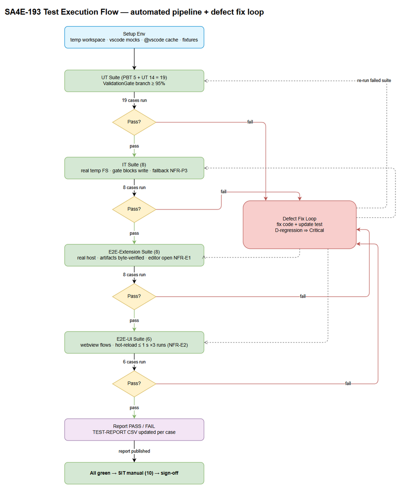
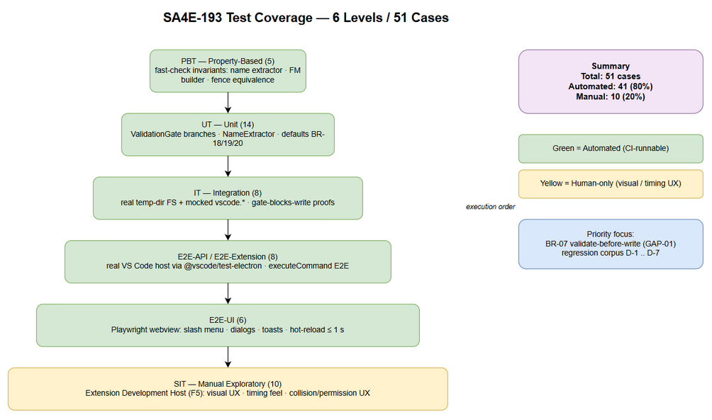

# Software Test Plan (STP)

## SDLC Agents 4 Enterprise — SA4E-193: Create Config Commands — /create-new-agent, hook, steering, skill

---

## Document Information

| Field | Value |
|-------|-------|
| Jira Ticket | SA4E-193 |
| Title | Create Config Commands — /create-new-agent, hook, steering, skill |
| Parent Epic | SA4E-181 — Chat Module — OpenCode Parity + Agentic Config System |
| Author | QA Agent |
| Version | 2.0 |
| Date | 2026-08-23 |
| Status | Draft |
| Related BRD | documents/SA4E-193/BRD.md (v2.0) |
| Related FSD | documents/SA4E-193/FSD.md (v2.1) |
| Related TDD | documents/SA4E-193/TDD.md (v2.0 — ValidationGate component design) |

---

## Revision History

| Version | Date | Author | Changes |
|---------|------|--------|---------|
| 1.0 | 2026-08-22 | QA Agent | Initial draft generated alongside FSD v1.0 baseline |
| 2.0 | 2026-08-23 | QA Agent | Complete rewrite — supersedes v1.0 entirely. Aligned to BRD v2.0 / FSD v2.1 / TDD v2.0: 6 test levels (PBT, UT, IT, E2E-API/E2E-Extension, E2E-UI, SIT); scope extended to ValidationGate component (GAP-01 closure) and discrepancy regression targets D-1..D-7; LLM mocked for determinism; hot-reload (SA4E-189) and editor-open (SA4E-190 fallback) integration tests added; quantified NFR acceptance thresholds from FSD §8.1 |

## Sign-Off

| Name | Signature and date |
|------|--------------------|
| Duc Nguyen Minh – Product Owner | ☐ I agree and confirm the test plan in this STP |
| Tech Lead / SA | ☐ I agree and confirm the test plan in this STP |

---

## 1. Introduction

### 1.1 Purpose

This System Test Plan defines the strategy, scope, environment, schedule, and quality gates for verifying **SA4E-193 — Create Config Commands**: four chat slash commands (`/create-new-agent`, `/create-new-hook`, `/create-new-steering`, `/create-new-skill`) of the Kiro VS Code extension that generate schema-valid configuration files into `.code-intel/{agents,hooks,steering,skills}/` via LLM generation (with deterministic template fallback), enforce a **validation gate before any disk write** (TDD v2.0, closes GAP-01), auto-open the generated file in an editor, and rely on the SA4E-189 Hot-Reload watcher (300 ms debounce) to surface new configs in the UI without restart.

The plan verifies behaviour against FSD v2.1 use cases UC-01..UC-04, business rules BR-01..BR-20, error catalogue ERR-CMD-01..09, quantified NFR targets (§8.1), and the 21 FSD test scenarios (TC-01..TC-21) including TA-added regression targets for code-baseline discrepancies D-1..D-7.

### 1.2 Test Objectives

1. Verify all four commands execute the identical shared 8-step pipeline (dispatch → description → name → generate → **validate** → write → open → notify) and produce structurally valid artifacts at the exact BR-05 paths (`.code-intel/agents/{name}.md`, `.code-intel/hooks/{name}.json`, `.code-intel/steering/{name}.md`, `.code-intel/skills/{name}/SKILL.md`).
2. Prove the ValidationGate (TDD §3.1) never persists invalid content: duplicated frontmatter (D-1/GAP-02), markdown-fence-wrapped JSON (D-2/AF-13), empty completions (D-4/AF-04), conditional-rule violations (BR-08/BR-09), enum violations (BR-10), and empty bodies (BR-11) are all rejected with NOTHING written to disk.
3. Verify deterministic template fallback produces usable scaffolds whenever the LLM is unavailable, errored, or empty (FR-COMMON-02) — LLM outage never blocks file creation.
4. Verify post-write integrations: editor auto-open degrades gracefully while SA4E-190 is pending (BR-13/FR-COMMON-03, fixes D-3 misclassification), and SA4E-189 hot-reload refreshes UI lists ≤ 1 s after write without extension restart (FR-COMMON-05/NFR-E2).
5. Verify input guards: mandatory non-empty description (BR-02), kebab-case name enforcement `^[a-z][a-z0-9-]*$` as the primary path-traversal control (BR-03/TDD §6.1), and deterministic name suggestion algorithm (BR-04).
6. Verify quantified non-functional targets from FSD §8.1: NFR-P2 (name suggestion ≤ 5 ms), NFR-P3 (fallback path submit→write ≤ 100 ms p95), NFR-E1 (editor visible ≤ 1 s), NFR-E2 (hot-reload reflection ≤ 1 s), artifact size envelopes NFR-P7.
7. Achieve 100% requirements traceability: every UC, BR, AC, ERR-CMD code, and D-register item maps to at least one executable test case (see STC RTM).

### 1.3 References

| Document | Location |
|----------|----------|
| BRD v2.0 | documents/SA4E-193/BRD.md |
| FSD v2.1 | documents/SA4E-193/FSD.md |
| TDD v2.0 | documents/SA4E-193/TDD.md |
| Jira ticket SA4E-193 | https://jiraassist.atlassian.net/browse/SA4E-193 |
| Dependency SA4E-189 (Hot-Reload, Done) | https://jiraassist.atlassian.net/browse/SA4E-189 |
| Dependency SA4E-190 (Dual-Tab Editors, To Do) | https://jiraassist.atlassian.net/browse/SA4E-190 |
| Handler implementation baseline | extension/src/commands/ConfigCommands.ts (593 lines) |
| New components under test | extension/src/commands/validation-gate.ts, name-extractor.ts, template-provider.ts, file-writer.ts (TDD §7.1 C1–C4) |

---

## 2. Test Strategy



*[Edit in draw.io](diagrams/test-execution-flow.drawio)*

### 2.1 Test Levels (6 Levels)

| Level | Scope | Automation | Tools |
|-------|-------|------------|-------|
| PBT | Property-based correctness of pure functions: name-extraction invariants (output always kebab-safe or `{prefix}-new`; ≤ 3 segments; lowercase), frontmatter-builder determinism (same inputs ⇒ byte-identical output; label derivation BR-19), fence-normalization equivalence (fenced vs unfenced input ⇒ identical normalized bytes), kebab-regex rejection property for arbitrary/path-traversal strings | Automated | fast-check + vitest |
| UT | Unit tests of pure modules with zero `vscode.*` imports: NameExtractor (BR-04 edge cases), buildAgentFrontmatter (BR-18/BR-19), ValidationGate NORMALIZE + per-type validators (agent D-1, hook D-2/D-7 + BR-08/BR-09, steering BR-10/BR-11, skill D-5), empty-generation rejection D-4 | Automated | vitest ^4.1.8 |
| IT | Integration of extracted modules: full handler pipeline per command with mocked `vscode.window`/`vscode.lm` (vi.mock) but REAL filesystem on a temp workspace dir — gate-blocks-write semantics, mkdir-recursive fresh-workspace safety (BR-06), UTF-8 single-complete write (BR-16), collision pre-check (BR-12/GAP-05), LLM-outage fallback wiring (FR-COMMON-02), editor-failure isolation (D-3 fix) | Automated | vitest + Node `fs/promises` on temp dirs + `vi.mock("vscode")` |
| E2E-API/E2E-Extension | Command-level E2E inside a REAL VS Code extension host (headless): `registerConfigCommands()` registration contract (BR-01), `vscode.commands.executeCommand("create-new-*")` end-to-end with stubbed InputBox, artifact existence/content/schema on real disk, editor auto-open assertion (active editor URI), exact toast message templates, no-workspace refusal | Automated | @vscode/test-electron + vitest runner |
| E2E-UI | Chat webview/UI-layer flows: slash menu listing + `/create-new-` filtering, per-command dialog prompt/placeholders exactness (FSD §3.8.2), empty-description guard ("Description is required"), invalid-name inline validation (ERR-CMD-02), success/failure toast rendering, hot-reload UI list refresh ≤ 1 s timing assertion (NFR-E2) | Automated | Playwright driving the webview + VS Code UI automation helpers |
| SIT | Manual exploratory in Extension Development Host (F5): full 4-command happy-path walkthrough with real Copilot LLM, visual editor-open experience, perceived hot-reload timing, collision UX, permission-failure UX, non-Latin (Vietnamese) description flow, streaming progress perception, cross-feature regression with SA4E-189 sidebar | Manual | Human tester + Extension Development Host |

### 2.2 Test Types

| Type | Description | Applicable |
|------|-------------|------------|
| Functional Testing | UC-01..UC-04 main/alternative/exception flows; BR-01..BR-20 enforcement | Yes |
| Negative Testing | ValidationGate rejections (D-1, D-2, D-4, D-5, ERR-CMD-04); invalid names; empty descriptions | Yes |
| Regression Testing | D-1..D-7 discrepancy fixes remain fixed after refactor; SA4E-189 pickup unaffected | Yes |
| Performance Testing | NFR-P2/P3/E1/E2 quantified thresholds (measured, not estimated) | Yes |
| Security Testing | Kebab-case as path-traversal control (BR-03/TDD §6.1); path confinement to BR-05 allowlist; no secrets in templates | Yes |
| Usability Testing | Dialog strings, toast wording, guided flow consistency across 4 commands (manual, SIT) | Yes |
| Compatibility Testing | Standard-text-editor fallback while SA4E-190 pending (BR-13); re-test Form+Text after SA4E-190 delivery | Yes (fallback mode) |

### 2.3 Test Approach

1. **Determinism first — LLM is mocked everywhere except SIT.** LLM output is inherently non-deterministic; UT/IT/E2E-Extension inject a fake `LanguageModelChat` returning scripted streams (valid JSON, fenced JSON, malformed JSON, empty string, echoed frontmatter). Only SIT exercises the real GitHub Copilot provider to sanity-check prompt contracts; all pass/fail gates are decided on mocked, reproducible inputs.
2. **Fallback path is a first-class citizen.** Because FR-COMMON-02 guarantees offline usability, every level includes LLM-unavailable variants (failure taxonomy F1–F4 of FSD §5.1.1), including the deterministic-latency budget NFR-P3 measured on the fallback path.
3. **Pure-module pyramid.** Per TDD §3.2, ValidationGate/NameExtractor are pure functions — the bulk of branch coverage lives in UT/PBT (fast, no host mocking); IT proves module wiring against a real temp filesystem; E2E proves the assembled extension inside a real host.
4. **Risk-based prioritization.** Highest priority on: validate-before-write (BR-07/GAP-01), filename identity invariants (D-1/D-5), hot-reload pickup (SM-4), and exact user-facing message templates (BR-14).
5. **Discrepancy-driven regression set.** FSD D-1..D-7 items each own at least one named regression test that FAILS on the pre-fix baseline and must PASS post-refactor (explicitly flagged in STC).

### 2.4 Entry Criteria (per level)

| Level | Entry Criteria |
|-------|----------------|
| PBT | TDD C1/C3 modules exist (`validation-gate.ts`, `name-extractor.ts`) and compile; fast-check dependency added |
| UT | Same as PBT; per-type validators exported with stable signatures `validate(type, raw, name, desc) → {ok, reason?, normalized}` |
| IT | UT green (≥ 95% branch on gate/extractor); handler thin-orchestrator refactor (TDD M1) merged; temp-workspace harness available |
| E2E-API/E2E-Extension | Extension compiles (`npm run esbuild`); IT green; @vscode/test-electron harness downloads stable VS Code build once (cached) |
| E2E-UI | Webview chat UI loads in test host; slash menu items registered; E2E-Extension green for command registration |
| SIT | All automated levels green; Extension Development Host launchable (F5) on tester machine; Copilot signed-in state documented (on/off) |

### 2.5 Exit Criteria (per level)

| Level | Exit Criteria |
|-------|--------------|
| PBT | 100% properties pass across ≥ 200 randomized iterations each; no counterexamples unresolved |
| UT | 100% cases executed; 100% pass; ValidationGate branch coverage ≥ 95% |
| IT | 100% executed; 0 Critical/Major defects open; every "gate blocks write" case proves zero bytes persisted |
| E2E-API/E2E-Extension | 8/8 pass; artifacts byte-verified at BR-05 paths; no unhandled extension-host errors in logs |
| E2E-UI | 6/6 pass; timing assertions (NFR-E2 ≤ 1 s) pass on 3 consecutive runs to filter debounce flakiness |
| SIT | All 10 manual scenarios executed; 0 Critical; ≤ 2 Major open with documented workarounds; PO walkthrough of one full happy path completed |

---

## 3. Test Scope



*[Edit in draw.io](diagrams/test-coverage.drawio)*

### 3.1 Features In Scope

| # | Feature / Story | Priority | FSD Reference | Test Type |
|---|----------------|----------|---------------|-----------|
| 1 | CMD1 `/create-new-agent` → `.code-intel/agents/{name}.md` (YAML frontmatter + system prompt body) | High | UC-01, FR-CMD-01, AF-01..05, EF-01..06 | Functional + Negative + Integration |
| 2 | CMD2 `/create-new-hook` → `.code-intel/hooks/{name}.json` (hook schema, conditionals BR-08/09) | High | UC-02, FR-CMD-02, AF-11..13, EF-11..15 | Functional + Negative + Integration |
| 3 | CMD3 `/create-new-steering` → `.code-intel/steering/{name}.md` (optional frontmatter + rule body) | High | UC-03, FR-CMD-03, AF-21..24, EF-21..24 | Functional + Negative + Integration |
| 4 | CMD4 `/create-new-skill` → `.code-intel/skills/{name}/SKILL.md` (folder created on demand) | High | UC-04, FR-CMD-04, AF-31..34, EF-31..35 | Functional + Negative + Integration |
| 5 | ValidationGate component — NORMALIZE (strip fences / strip echoed frontmatter / reject empty) + per-type schema validation BEFORE write | High | BR-07, GAP-01, GAP-02, D-1/D-2/D-4/D-5/D-7, ERR-CMD-04/09 | Unit + Property + Integration |
| 6 | Name extraction & sanitization (`extractNameFromDescription`, kebab-case enforcement as path-traversal control) | High | BR-03, BR-04, §3.7.5, TDD §6.1 | Unit + Property + Security |
| 7 | Deterministic LLM fallback scaffolds (all 4 types, failure taxonomy F1–F4) | High | FR-COMMON-02, ERR-CMD-03, AF-03/12/22/32 | Integration + Performance (NFR-P3) |
| 8 | Hot-reload integration — new files picked up by SA4E-189 watcher, UI lists refresh ≤ 1 s, no restart | Medium | FR-COMMON-05, BR-17, NFR-E2, TC-14 | E2E-UI + SIT |
| 9 | Editor auto-open + graceful degradation while SA4E-190 pending; editor-failure must NOT flip success to failure (D-3 fix) | Medium | FR-COMMON-03, BR-13, ERR-CMD-08, EF-06, TC-15 | E2E-Extension + IT + SIT |
| 10 | Command registration & slash-menu discoverability (exact IDs, rawArgs forwarding, dialog strings §3.8.2/§3.8.3, toast templates §3.8.4) | Medium | BR-01, BR-14, FR-COMMON-04, INT-5 | E2E-Extension + E2E-UI |
| 11 | Collision pre-write check (warn, silent overwrite forbidden until OI-01 policy confirmed) | Medium | BR-12, ERR-CMD-06, GAP-05, TC-12 | IT + SIT |
| 12 | Quantified NFR thresholds: NFR-P2 ≤ 5 ms suggestion; NFR-P3 ≤ 100 ms fallback write; NFR-E1 editor ≤ 1 s; NFR-E2 reload ≤ 1 s; size envelopes NFR-P7 | Medium | FSD §8.1 | Performance (measured inside automated cases) |

### 3.2 Features Out of Scope

| # | Feature | Reason |
|---|---------|--------|
| 1 | Editing/deleting existing config files via dual-tab editors | Separate story SA4E-190 (To Do); only the create-flow fallback behaviour is tested here |
| 2 | Dual-tab Form+Text tab synchronization itself | SA4E-190 scope; re-test TC-15 after its delivery (documented follow-up) |
| 3 | LLM reactive system-prompt rebuild on config change | Explicitly out of scope of SA4E-189/193 (BRD §1.2) |
| 4 | `hookEngine.reload()` runtime auto-trigger and graph recompile | Out of scope (BRD §1.2 items 3–4) |
| 5 | Real GitHub Copilot output-quality assessment | Non-deterministic; SIT only verifies flow completion + structural validity, never content quality |
| 6 | Guaranteed non-English description OUTPUT language | Open issue OI-09 — To be confirmed with stakeholders; only name-extraction degradation is tested (AF-05/TC-20) |
| 7 | Collision confirm-vs-rename policy final UX | Policy decision OI-01 pending; tests assert "no silent overwrite" invariant only |
| 8 | Bulk import/export/migration of configs | Not part of ticket scope |

---

## 4. Test Environment

### 4.1 Environment Requirements

| Environment | Configuration | Purpose |
|-------------|--------------|---------|
| DEV-CI (automated) | Windows 10/11 or Linux CI runner; Node.js ≥ 18; VS Code stable ≥ 1.85 (auto-downloaded by @vscode/test-electron, cached); workspace = disposable temp dir seeded per test | PBT, UT, IT, E2E-Extension runs in vitest |
| DEV-WEBVIEW (automated) | Chromium via Playwright driving the chat webview host page (or VS Code webview automation endpoint) | E2E-UI runs |
| SIT (manual) | Tester laptop: VS Code ≥ 1.85 + Kiro extension launched via Extension Development Host (F5); GitHub Copilot signed-in (state recorded per run); sample workspace `qa-sa4e193-sandbox/` pre-created empty | Manual exploratory SIT |

### 4.2 Browser / Device Requirements

| Browser | Version | OS | Required |
|---------|---------|----|----------|
| Chromium (Playwright bundled) | latest stable | Windows/Linux CI | Yes — E2E-UI webview automation |
| VS Code Electron (test-electron download) | engine ^1.85.0 | Windows/Linux CI | Yes — E2E-Extension |

### 4.3 Test Data Requirements

Full concrete datasets are maintained in `documents/SA4E-193/testdata/*.csv` and mirrored inline in STC Appendix A. Key fixtures:

| Fixture | Value | Used By |
|---------|-------|---------|
| Agent description (EN, rich) | "A documentation agent that generates API docs from code comments" → suggested name `documentation-agent-that`; confirmed name override `my-code-reviewer` | CMD1 happy paths |
| Hook description + valid JSON | "Auto-validate XML when draw.io files are edited"; valid hook `{enabled:true, name:"Xml Validate Drawio", ...}` | CMD2 happy path |
| Fenced hook JSON (D-2) | Same object wrapped in triple-backtick ```json fence | UT-09, IT-02 |
| Malformed hook JSON (ERR-CMD-04) | `{ "enabled": true, "when": { "type": "fileEdited"` (truncated) | UT-08, IT-03 |
| Unknown-top-level-key hook | `{ "eventType": "fileEdited", ... }` (violates BR-09 allowed set) | UT-08 variant |
| XOR-violation hooks | `then:{type:"runCommand"}` without command; askAgent without prompt; patterns on promptSubmit | UT-10 |
| Steering description | "Always use semantic versioning for git tags" → name `semver-git-tags` | CMD3 happy path |
| Bad steering frontmatter | `inclusion: sometimes` (invalid enum); body-less document | UT-11 |
| Skill description | "Review code security vulnerabilities" → name `sec-review-skill`; mismatched FM name `other-skill` vs confirmed `my-skill` (D-5) | CMD4 + UT-12 |
| Invalid names | `"My Agent!"`, `"../etc/passwd"`, `"-bad-name"`, `"9lives"`, `"UPPER_CASE"`, `""` | Name guard tests |
| Empty descriptions | `""`, `"   "` (whitespace-only) | BR-02 guard |
| Non-Latin description | "Một agent dịch tài liệu tiếng Việt" → expected suggestion fallback `agent-new` | AF-05, TC-20 |
| Empty LLM stream (D-4) | Mocked stream yielding `""` / whitespace-only chunks | UT-13 |
| Double-frontmatter payload (D-1) | Content starting with its own `---\nname: wrong-name\n---` block before body | UT-06, IT-07 regression |
| Read-only directory | Temp workspace with ACL-denied `.code-intel/agents/` | ERR-CMD-05, SIT-06 |

### 4.4 External Dependencies

| System | Dependency | Mock/Stub Available |
|--------|-----------|---------------------|
| GitHub Copilot LLM (`vscode.lm.selectChatModels`) | Generation source for happy paths | YES — mandatory for UT/IT/E2E: fake model object returning scripted chunk streams (valid/fenced/malformed/empty). Real provider used ONLY in SIT |
| SA4E-189 Hot-Reload watcher | Post-write UI refresh | NO stub — real watcher exercised; timing asserted with generous poll window (≤ 1 s target, 3 s fail threshold) |
| SA4E-190 Dual-Tab Editor | Custom editor open | NOT AVAILABLE (To Do) — tests assert standard-text-editor fallback contract instead; re-test queued post-delivery |

---

## 5. Test Schedule

| Phase | Start Date | End Date | Duration | Milestone |
|-------|-----------|----------|----------|-----------|
| Test Planning (STP + STC v2.0) | 2026-08-23 | 2026-08-24 | 1 d | STP + STC approved by TL |
| Test Harness Setup | 2026-08-25 | 2026-08-26 | 2 d | Automated harness runnable locally |
| PBT + UT Execution | 2026-08-26 | 2026-08-27 | 1–2 d | Pure-module suite green (ValidationGate coverage ≥ 95%) |
| IT Execution | 2026-08-27 | 2026-08-28 | 1 d | Gate-blocks-write proofs complete |
| E2E-Extension + E2E-UI Execution | 2026-08-28 | 2026-08-29 | 1–2 d | Host + UI suites green incl. timing assertions |
| Defect Fix & Retest loop | 2026-08-29 | 2026-09-02 | 3 d (overlaps) | D-register regressions verified fixed |
| SIT Manual Execution | 2026-09-01 | 2026-09-02 | 2 d | SIT sign-off + TEST-REPORT drafted |
| UAT / PO Walkthrough | 2026-09-03 | 2026-09-03 | 1 d | PO confirms one full happy path live |

> Dates are working-day estimates aligned to the TDD §7.3 task order; they shift with DEV refactor (M1) merge date.

---

## 6. Resources & Responsibilities

| Role | Name | Responsibility |
|------|------|---------------|
| Test Lead | QA Agent | STP/STC authorship, execution orchestration, metrics reporting, quality-gate decisions |
| QA Engineer | QA Agent | Automate PBT/UT/IT/E2E suites, execute SIT checklist, defect filing with repro steps + evidence |
| Developer | Extension team (per SA4E-193 commit comment) | Fix defects, deliver TDD C1–C6 refactor, keep unit coverage green |
| BA / PO | Duc Nguyen Minh | Clarify ACs, decide OI-01 collision policy input, UAT walkthrough |
| Tech Lead | TL | Confirm §8.1 quantified budgets (OI-06), review exit criteria waivers |
| DevOps | DevOps Agent | CI wiring for vitest suites, VS Code/electron cache, Playwright browsers |

**Tools:** vitest ^4.1.8 (runner), fast-check (PBT), vi.mock for `vscode` module, @vscode/test-electron (extension-host E2E), Playwright (webview UI), temp-dir fixture helpers (`fs/promises.mkdtemp`), Jira (defect tracking), draw.io (this plan's diagrams).

---

## 7. Risk & Mitigation

| # | Risk | Impact | Likelihood | Mitigation |
|-----|------|--------|------------|------------|
| 1 | **LLM non-determinism makes results unreproducible** | High | Certain if unmitigated | Mock `vscode.lm` with scripted streams for ALL UT/IT/E2E levels (decided strategy); real-provider checks confined to non-gating SIT smoke; deterministic fallback path tested as primary offline guarantee |
| 2 | **Empty/malformed LLM outputs slip through** (D-2/D-4 baseline defects) | High | High on baseline code | Dedicated negative corpus (fenced JSON, truncated JSON, empty stream, echoed frontmatter) executed at gate level; each D-item owns a named regression test that must flip red→green post-fix |
| 3 | Timing flakiness on hot-reload assertions (300 ms debounce + render) | Medium | Medium | Assert ≤ 1 s target but fail only past 3 s hard ceiling; require 3 consecutive passes (exit criteria E2E-UI) |
| 4 | SA4E-190 still To Do → "dual-tab editor" AC unverifiable | Medium | Certain today | Test the CONTRACTED fallback (standard text editor, zero errors, BR-13); record follow-up re-test item for post-SA4E-190 delivery (TC-15 disposition) |
| 5 | Collision policy OI-01 undecided → ambiguous expected result | Medium | High | Tests assert only the frozen invariant "silent overwrite forbidden + warning surfaced"; exact confirm/rename UX deferred to policy confirmation |
| 6 | @vscode/test-electron download flakiness in CI | Low | Medium | Cache VS Code build artifact between runs; pin version to engine ^1.85.0 compatible build |
| 7 | Webview automation brittleness (selector drift in SlashMenuItems/InputAreaIntegration) | Medium | Medium | Stabilize with data-testid attributes requested from DEV; fall back to vscode.commands-level assertions for logic, keeping UI selectors thin |
| 8 | Permission-failure tests behave differently Win vs POSIX ACLs | Low | Medium | Gate these behind OS-conditional skip tags; execute the applicable variant per runner; SIT covers the human-visible path |

---

## 8. Defect Management

### 8.1 Severity Levels

| Severity | Definition | Example (this feature) |
|----------|-----------|------------------------|
| Critical | Data loss/corruption, security breach, extension crash | Invalid file persisted despite gate (BR-07 violated); path traversal escapes `.code-intel/`; extension host crash on command invoke |
| Major | Feature not working, workaround exists | Command produces no file with no error toast; hot-reload never refreshes list; fallback path fails offline; double frontmatter still written (D-1 regression) |
| Minor | UI issue, cosmetic defect | Toast wording deviates from §3.8.4 template; placeholder text mismatch; suggestion name off-by-one-word |
| Trivial | Typo, minor alignment | Slash menu label capitalization; log message typo |

### 8.2 Priority Levels

| Priority | Definition | SLA (Fix Time) |
|----------|-----------|----------------|
| P1 | Must fix immediately — blocks all downstream levels | 4 hours |
| P2 | Must fix before release | 1 business day |
| P3 | Should fix if time permits | 3 business days |
| P4 | Nice to fix, can defer | Next release |

Severity→Priority default mapping: Critical=P1/P2, Major=P2, Minor=P3, Trivial=P4.

### 8.3 Defect Lifecycle

```
New → Open → In Progress → Fixed → Ready for Retest → Verified → Closed
                                                   ↘ Reopened → In Progress
Deferred → Deferred-Approved (TL sign-off) → Closed-Wontfix
```

Rules: every defect links the failing test case ID + evidence (log/screenshot under `evidence/`); D-register regressions that reappear post-fix are auto-Reopened and flagged Critical regardless of surface severity; a fix without an updated/added automated test is not accepted as Fixed.

---

## 9. Test Metrics & Reporting

### 9.1 Test Cases Summary by Level

| Level | Count | Automated | Manual |
|-------|-------|-----------|--------|
| PBT | 5 | 5 | 0 |
| UT | 14 | 14 | 0 |
| IT | 8 | 8 | 0 |
| E2E-API/E2E-Extension | 8 | 8 | 0 |
| E2E-UI | 6 | 6 | 0 |
| SIT | 10 | 0 | 10 |
| **Total** | **51** | **41 (80%)** | **10 (20%)** |

### 9.2 Metrics

| Metric | Formula | Target |
|--------|---------|--------|
| Test Execution Rate | Executed / Total × 100% | 100% |
| Pass Rate | Passed / Executed × 100% | ≥ 95% (automated: 100% to exit) |
| Requirements Coverage | Requirements with ≥1 test / total requirements × 100% | 100% (RTM in STC §7) |
| ValidationGate Branch Coverage | Covered branches / total branches × 100% | ≥ 95% |
| D-register Regression Pass Rate | Fixed-D tests passing / 7 × 100% | 100% (D-1..D-7 each owned) |
| Defect Density | Defects / executed test cases | ≤ 0.15 |
| Critical Open Defects | Count at exit | 0 |
| Timing-budget Compliance | NFR-P2/P3/E1/E2 measured within target on 3 consecutive runs | 100% of asserted budgets |

### 9.3 Reporting Schedule

| Report | Frequency | Audience |
|--------|-----------|----------|
| Automated suite result (vitest report + coverage) | Per CI run | QA + DEV |
| Daily test status during execution window | Daily | SM + project team |
| Defect summary | Daily | DEV + TL + PO |
| TEST-REPORT-{TICKET}.md (+ CSV execution log updated per case) | End of testing | All stakeholders; attached to Jira SA4E-193 |

---

## 10. Diagram Index

| # | Diagram | Image (PNG) | Source (editable draw.io) |
|---|---------|-------------|----------------------------|
| 1 | Test Coverage — 6-level pyramid with per-level case counts (PBT 5 · UT 14 · IT 8 · E2E-EXT 8 · E2E-UI 6 · SIT 10; 41 automated / 10 manual) |  | [test-coverage.drawio](diagrams/test-coverage.drawio) |
| 2 | Test Execution Flow — Setup Env → UT → IT → E2E-Extension → E2E-UI → Report PASS/FAIL with defect fix loop and suite re-run |  | [test-execution-flow.drawio](diagrams/test-execution-flow.drawio) |

---

## 11. Appendix

### Glossary

| Term | Definition |
|------|------------|
| PBT | Property-Based Testing — randomized input generation asserting invariants (fast-check) |
| UT / IT | Unit Testing / Integration Testing (module wiring with real FS, mocked vscode API) |
| E2E-API/E2E-Extension | End-to-end inside a real VS Code extension host via @vscode/test-electron (`vscode.commands.executeCommand`) |
| E2E-UI | End-to-end through the chat webview UI (slash menu, dialogs, toasts) via Playwright |
| SIT | System Integration Testing — manual exploratory in Extension Development Host |
| ValidationGate | TDD v2.0 pure component enforcing validate-before-write (BR-07); closes GAP-01 |
| D-1..D-7 | FSD §11.4 code-baseline discrepancy register; each owns a named regression test |
| BR-n / ERR-CMD-nn | FSD business rules 01–20 / error catalogue 01–09 |
| NFR-P*/E*/S* | Quantified engineering targets from FSD §8.1 |

### Assumptions

- TDD §7 refactor (C1 validation-gate.ts, C3 name-extractor.ts, C4 file-writer.ts, C2 template-provider.ts, M1 handler wiring) lands before IT entry.
- `extension/package.json` gains a vitest-wired `"test"` script (TDD M4).
- Hot-reload watcher (SA4E-189, released v1.33.0+) behaves as specified: 300 ms debounce, UI-list refresh only.
- GitHub Copilot availability affects only SIT smoke quality, never pass/fail of automated suites (mocked everywhere else).
- Collision confirm-vs-rename final UX remains open (OI-01); tests assert the "no silent overwrite" invariant only.
