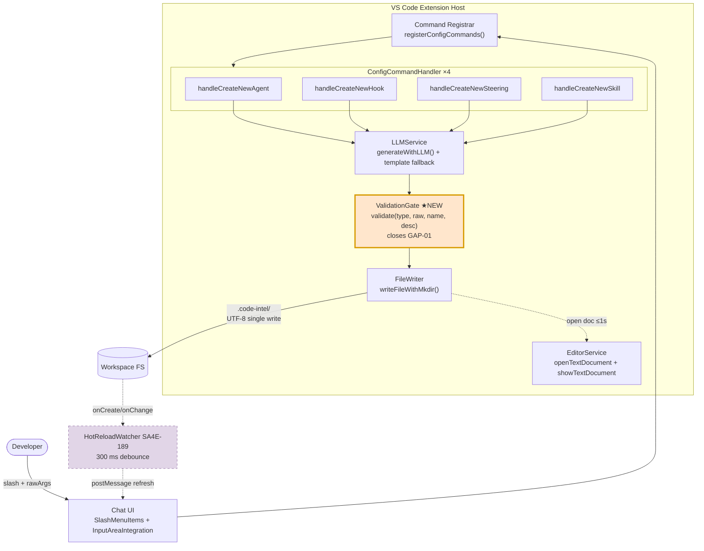
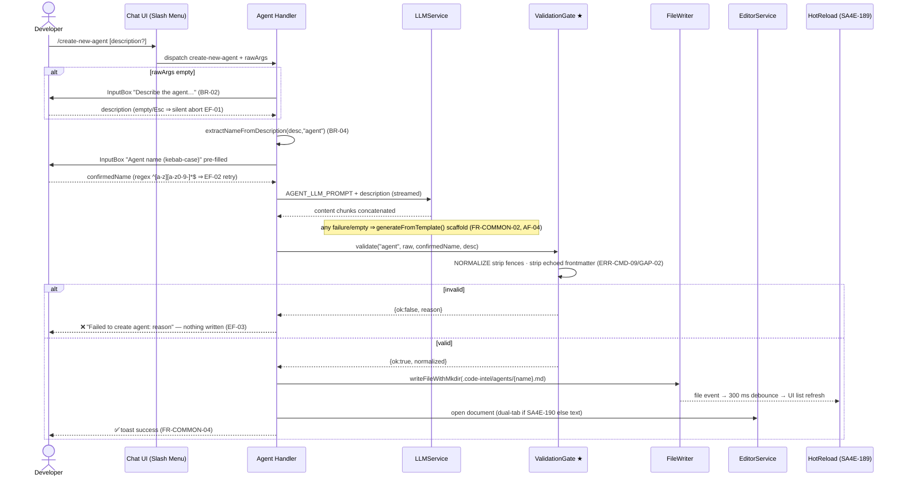
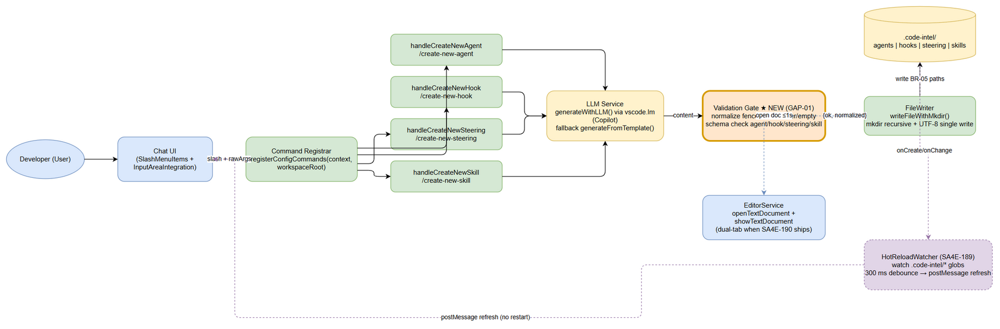
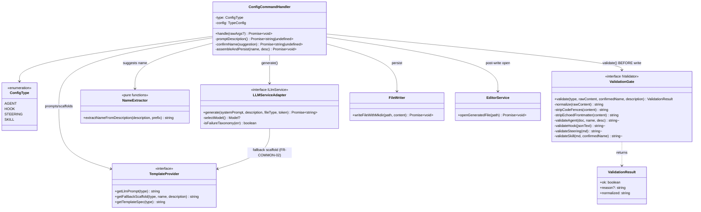
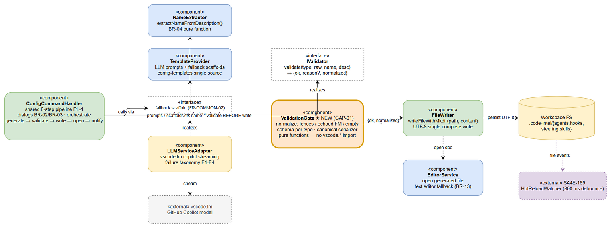
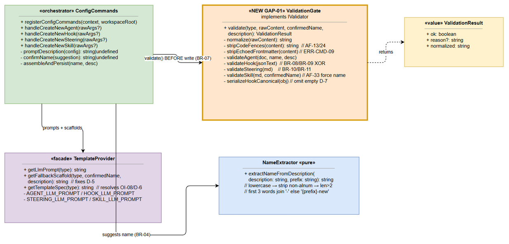
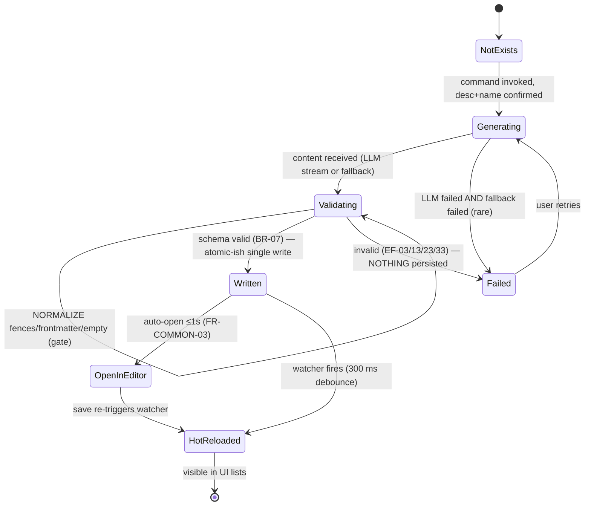

# Technical Design Document (TDD)

## SDLC Agents 4 Enterprise — SA4E-193: Create Config Commands — /create-new-agent, /create-new-hook, /create-new-steering, /create-new-skill

---

## Document Information

| Field | Value |
|-------|-------|
| Jira Ticket | SA4E-193 |
| Title | Create Config Commands — /create-new-agent, hook, steering, skill |
| Parent Epic | SA4E-181 — Chat Module — OpenCode Parity + Agentic Config System |
| Author | SA Agent |
| Version | **2.0** |
| Date | 2026-08-23 |
| Status | Draft for Review |
| Input Documents | FSD v2.1 (`documents/SA4E-193/FSD.md`), BRD v2.0 (`documents/SA4E-193/BRD.md`) |
| Code Baseline | `extension/src/commands/ConfigCommands.ts` (593 lines), `extension/src/commands/config-templates/*`, verified via grep against actual source |
| Dependencies | SA4E-189 Hot-Reload Watcher (**Done**), SA4E-190 Dual-Tab Editors (**To Do**) |
| Related | FSD Discrepancy Register D-1..D-7, Gap Register GAP-01..GAP-06 |

## Revision History

| Version | Date | Author | Changes |
|---------|------|--------|---------|
| 1.0 | 2026-08-22 | SA Agent | Initial draft alongside first implementation pass of ConfigCommands.ts |
| **2.0** | 2026-08-23 | SA Agent | Complete rewrite aligned to FSD v2.1: introduces **ValidationGate** as a new dedicated component to close GAP-01; formalizes the shared 8-step pipeline; component/data/error/security designs mapped to ERR-CMD-01..09 and BR-01..BR-20; implementation checklist for refactoring ConfigCommands.ts into testable modules; traceability matrix UC-01..UC-04 → components |

---

## 1. Introduction

### 1.1 Purpose

This Technical Design Document defines **HOW** the four configuration-creation slash commands are engineered inside the Kiro VS Code extension. It translates FSD v2.1 functional requirements (FR-CMD-01..04, FR-COMMON-01..05, UC-01..UC-04) into a concrete component design, data contracts, error-handling strategy, security controls, and an implementation checklist that closes the documented gaps — most critically **GAP-01** (missing schema validation gate before file write) and its companion defects D-1..D-5.

### 1.2 Scope

In scope: command registration, guided input flow, LLM generation with template-guided prompts, deterministic fallback, **new ValidationGate component**, file persistence under `.code-intel/`, editor integration with graceful degradation, hot-reload interplay contract.

Out of scope (inherits FSD §1.2): editing/deleting existing configs (SA4E-190/UI5), reactive system-prompt rebuild, `hookEngine.reload()` auto-trigger, graph recompile, bulk import/export, guaranteed non-English description handling (OI-09).

### 1.3 Technology Stack (verified against repository)

| Layer | Technology | Evidence |
|-------|-----------|----------|
| Language | TypeScript ^5.4.0 | `extension/package.json` devDependencies |
| Runtime | VS Code Extension Host (engine ^1.85.0), Node.js `node:fs/promises` | `extension/package.json` engines |
| LLM access | `vscode.lm.selectChatModels({ vendor: "copilot" })` → `LanguageModelChatMessage.User` streaming | ConfigCommands.ts `generateWithLLM()` L485–514 |
| Bundler | esbuild ^0.21.0 (`npm run esbuild`) | `extension/package.json` scripts |
| Testing | Vitest ^4.1.8 (+ mocha ^10.7.3 legacy harness present) | `extension/package.json` devDependencies |
| Persistence | Plain files under `<workspace>/.code-intel/` — no database | FSD §4 |

### 1.4 Design Principles & Constraints

| # | Principle | Source |
|---|-----------|--------|
| P1 | **Shared-pipeline rule** — one code path parameterized by type; per-type differences limited to prompt string, template spec, output format, target dir. Duplication prohibited | BR-15, FR-COMMON-01 |
| P2 | **Fallback-first resilience** — LLM outage never blocks creation; deterministic scaffolds always available | FR-COMMON-02 |
| P3 | **Validate-before-write** — nothing invalid is ever persisted; gate runs after assembly, before disk I/O | BR-07, GAP-01 closure |
| P4 | **Path confinement** — writes restricted to exactly four BR-05 path families; kebab-case name doubles as filesystem-safety guarantee | BR-03, BR-05, §6 Security |
| P5 | **Graceful editor degradation** — dual-tab editor when SA4E-190 ships; standard text editor meanwhile; flow must not break | FR-COMMON-03, BR-13, GAP-06 |
| P6 | **One-way hot-reload contract** — this feature only writes complete files at watched paths; refresh timing belongs to SA4E-189 (300 ms debounce) | BR-17, PL-4 |
| P7 | **UTF-8 everywhere; single complete write call** so the watcher debounce never observes partial content | BR-16, §6.6.3 |

---

## 2. Architecture Overview

### 2.1 Pipeline Architecture

All logic executes in the extension host process. The runtime pipeline is:

```
Command Registry → ConfigCommandHandler ×4 → LLMService → ValidationGate (NEW — closes GAP-01)
              → FileWriter → EditorService
```

The **HotReloadWatcher (SA4E-189)** independently observes `.code-intel/{agents,hooks,steering}/*.md` and `.code-intel/skills/*/SKILL.md`; this feature has no watcher API dependency (one-way file-drop integration).



★ = new component introduced by TDD v2.0.

### 2.2 Request Flow — Sequence (representative: UC-01 `/create-new-agent`)



### 2.3 Component Responsibilities (runtime view)

| Component | Location (target) | Responsibility |
|-----------|-------------------|----------------|
| Slash Command Dispatcher | `webview/slash-menu/SlashMenuItems.ts`, `webview/input/InputAreaIntegration.ts` | Menu entries `/create-new-*`; maps to command IDs; forwards trailing text as rawArgs |
| Command Registrar | `commands/CommandRegistrar.ts` → `registerConfigCommands(context, workspaceRoot)` | Registers 4 commands into `vscode.commands`; refuses registration when no workspace root (FSD §7.1) |
| ConfigCommandHandler ×4 | `commands/ConfigCommands.ts` (to be refactored, §7) | Shared 8-step pipeline PL-1: description → name → generate → assemble → **validate** → write → open → notify |
| LLM Service | `generateWithLLM()` | Copilot model selection, streamed completion, failure taxonomy F1–F4, silent template fallback |
| **ValidationGate ★NEW** | `commands/validation-gate.ts` (new module) | Normalize (strip fences/echoed frontmatter/empty), schema validation per type (§3.7 FSD), canonical serialization; closes GAP-01, fixes D-1/D-2/D-4/D-5 |
| File Writer | `writeFileWithMkdir()` | mkdir recursive + single UTF-8 write; fresh-workspace safe (BR-06/BR-16) |
| Editor Opener | `vscode.workspace.openTextDocument/showTextDocument` | Post-write open; standard editor while SA4E-190 pending (BR-13) |
| HotReloadWatcher (SA4E-189) | existing watcher module | Observes BR-05 globs; 300 ms debounce; postMessage list refresh (FR-COMMON-05) |


*[Edit in draw.io](diagrams/architecture.drawio)*

---

## 3. Component Design

### 3.1 Component Catalogue

| Component | Responsibility | Inputs | Outputs | Dependencies |
|-----------|----------------|--------|---------|--------------|
| **ConfigCommandHandler** | Execute shared pipeline PL-1 per config type; own dialogs (description BR-02, kebab-case name BR-03); orchestrate generate→validate→write→open→notify; map outcomes to ERR-CMD codes | rawArgs?: string; TypeConfig (prompt, placeholder, prefix, targetDir, extension/format); user input via InputBox | Written artifact at BR-05 path; toast notifications; opened document | TemplateProvider, NameExtractor, LLMServiceAdapter, ValidationGate, FileWriter, EditorService, vscode.window/workspace |
| **TemplateProvider** | Single source of truth for per-type assets: LLM system prompts (AGENT/HOOK/STEERING/SKILL_LLM_PROMPT), fallback scaffolds, field-spec templates from `config-templates/*.template` | ConfigType discriminator | System prompt string; fallback scaffold string (with `[placeholder]` markers); template spec text | fs read of `config-templates/` (resolves OI-08 dead-artifact drift D-6) or inlined constants behind one facade |
| **ValidationGate ★NEW** | Mandatory pre-write gate (BR-07): NORMALIZE (strip markdown fences AF-13/AF-24, strip one echoed frontmatter block ERR-CMD-09/GAP-02, reject empty AF-04/D-4) then type-specific schema validation per FSD §3.7; force skill frontmatter `name := confirmedName` (D-5); canonical JSON serialization omitting empty action fields (D-7) | type, rawContent, confirmedName, description | `{ ok: boolean, reason?, normalized }` — normalized content is the ONLY bytes eligible for disk | none (pure functions; unit-testable without vscode mock) |
| **NameExtractor** | Derive kebab-case suggestion per BR-04 algorithm (lowercase → strip non-alphanumerics → filter len>2 → first 3 → join `-`; fallback `{prefix}-new`) | description, prefix ∈ agent/hook/rule/skill | suggestedName (may still fail final regex — e.g., digit-leading token; handler validator catches) | none (pure function, ≤5 ms NFR-P2) |
| **LLMServiceAdapter** | Wrap `vscode.lm.selectChatModels({vendor:"copilot"})`; send two User-role messages; concatenate stream; enforce failure taxonomy F1–F4 (empty stream = failure, fixing D-4); optional parameter envelope temperature/token-cap/60 s timeout-promotion (OI-06) | systemPrompt, description, fileType, CancellationTokenSource | generated content string (never throws — returns "" only on hard failure which gate then promotes to fallback) | vscode.lm API; TemplateProvider (for fallback scaffold) |

### 3.2 Class Design (key interfaces & relationships)



Design notes:

1. **ValidationGate is pure** — no `vscode.*` imports — enabling fast unit tests (TC-10/11/16/17/18/19/21) without host mocking.
2. Handler depends on abstractions (`IValidator`, `ILlmService`) so DEV can inject mocks; concrete adapters stay thin.
3. TemplateProvider resolves the D-6 single-source-of-truth drift by becoming the ONLY accessor for prompts/templates.
4. `Result` object pattern (not exceptions) for gate outcome — mirrors FSD §6.6.2 signature `→ { ok, reason?, normalized }`.


*[Edit in draw.io](diagrams/component.drawio)*


*[Edit in draw.io](diagrams/class-diagram.drawio)*

---

## 4. Data Design

Storage is file-based under the workspace — no database. Physical layout is contractual (consumed by SA4E-189 watcher patterns).

### 4.1 Output Path Matrix (BR-05 — exhaustive; nothing else writable)

| Command | Artifact | Absolute Path Pattern | Format | Encoding | Created On Demand |
|---------|----------|----------------------|--------|----------|-------------------|
| `/create-new-agent` | Agent config | `.code-intel/agents/{name}.md` | Markdown + YAML frontmatter (name, label, description, phase, tools) | UTF-8 | parent dir `agents/` |
| `/create-new-hook` | Hook config | `.code-intel/hooks/{name}.json` | JSON object (hook schema, 2-space indent, empty action fields omitted) | UTF-8 | parent dir `hooks/` |
| `/create-new-steering` | Steering rule | `.code-intel/steering/{name}.md` | Markdown ± optional YAML frontmatter (inclusion enum, description) | UTF-8 | parent dir `steering/` |
| `/create-new-skill` | Skill package | `.code-intel/skills/{name}/SKILL.md` | Folder + SKILL.md (frontmatter name/description + sections When to Use, Workflow, Tools & Resources, Examples) | UTF-8 | skill folder `{name}/` recursive |

Directory layout:

```text
.code-intel/
├── agents/   {name}.md          # AgentConfig — frontmatter + system prompt body
├── hooks/    {name}.json        # HookConfig — strict-schema JSON
├── steering/ {name}.md          # SteeringConfig — optional frontmatter + rule body
└── skills/   {name}/SKILL.md    # SkillConfig — folder identity = frontmatter name
```

### 4.2 Format Specifications (authoritative per FSD §3.7)

**Agent `{name}.md`** — canonical frontmatter assembled deterministically by `buildAgentFrontmatter(confirmedName, description)`; LLM supplies body only:

```yaml
---
name: code-reviewer            # REQUIRED, kebab-case, = filename base
label: Code Reviewer           # derived Title Case from name (BR-19)
description: >                 # folded scalar, user's description
  Reviews code changes…
phase: implementation          # default (BR-18)
tools: ["read", "write", "shell", "@mcp"]   # default (BR-18)
---
<system prompt body — ≥1 non-empty line (BR-11)>
```

**Hook `{name}.json`** — allowed top-level keys ⊆ {enabled, name, description, version, when, then}; conditionals per BR-08/BR-09 (patterns only for file* events; prompt iff askAgent XOR command iff runCommand); defaults enabled=true, version="1" (BR-20):

```json
{
  "enabled": true,
  "name": "Pre-commit Guard",
  "description": "What this hook does",
  "version": "1",
  "when": { "type": "fileEdited", "patterns": ["*.ts"] },
  "then": { "type": "askAgent", "prompt": "Check for TODOs" }
}
```

**Steering `{name}.md`** — frontmatter OPTIONAL; if present `inclusion ∈ {auto, manual, always}` (BR-10; fileMatch variant pending OI-02/GAP-03); body ≥1 non-empty line (BR-11):

```markdown
---
inclusion: auto
description: Enforce REST API conventions
---
# Rule title
Actionable rules, examples, Do's & Don'ts
```

**Skill `{name}/SKILL.md`** — frontmatter REQUIRED (name kebab-case FORCED = folder name by gate — AF-33/D-5; description non-empty); `metadata` optional pending OI-03/GAP-04:

```markdown
---
name: release-versioning
description: Git release process steps
---
## When to Use …
## Workflow …
## Tools and resources …
## Examples …
```

### 4.3 State Model — Config File Lifecycle



### 4.4 Data Volume & Size Envelopes (NFR-P7)

| Artifact | Size envelope | Rationale |
|----------|---------------|-----------|
| Hook JSON | ≤ 8 KB | Compact schema, bounded fields |
| Agent / Steering / SKILL.md | ≤ 16 KB (~4k tokens) | Prompt-contract output ceiling; gate warns/refuses beyond |

No growth-management concern: artifacts are human-scale, one file per config, workspace-scoped.

---

## 5. Error Handling Design

Strategy layers: **L-Input** (InputBox validators, silent abort on cancel), **L-Gen** (LLM adapter — never throws, promotes fallback), **L-Gate** (ValidationGate — Result object, blocks persistence), **L-IO** (FileWriter try/catch → OS message), **L-Post** (editor/toast — warn-only, must not flip success to failure; fixes D-3).

| Code | Scenario | Severity | Layer | Strategy |
|------|----------|----------|-------|----------|
| ERR-CMD-01 | Description empty/cancelled | Info | L-Input | Silent abort — no file, no toast, return to chat (EF-01 family) |
| ERR-CMD-02 | Name violates `^[a-z][a-z0-9-]*$` | Warning | L-Input | Inline InputBox validation message ("Name must be kebab-case (e.g., my-{type})"); retry loop; Esc ⇒ silent abort |
| ERR-CMD-03 | LLM unavailable / no copilot model / request error (taxonomy F1–F3) | Info | L-Gen | `console.debug("[ConfigCommands] …")` + transparent `generateFromTemplate()` scaffold; flow completes (FR-COMMON-02) |
| ERR-CMD-04 | Gate rejects content (invalid JSON, missing fields, bad enum, empty body, empty stream F4) | Error | L-Gate | Return `{ok:false, reason}`; **nothing written**; error toast `Failed to create {type}: {reason}`; retry guidance (closes GAP-01, fixes D-2/D-4) |
| ERR-CMD-05 | File write failure (EACCES/ENOSPC/path) | Error | L-IO | Toast `Failed to create {type}: {os message}`; no partial file beyond possibly-created directories |
| ERR-CMD-06 | Target collision (file/folder exists) | Warning | L-Gate/L-IO boundary | Pre-write existence check; surface warning per BR-12; silent overwrite forbidden until policy confirmed (GAP-05/OI-01) |
| ERR-CMD-07 | Skill folder creation mid-flow failure | Error | L-IO | Toast with message; best-effort cleanup of partial artifacts (OI-05 orphan-folder note EF-35) |
| ERR-CMD-08 | Editor open failure AFTER successful write | Warning | L-Post | Isolated try around open only; non-blocking notice; success toast preserved; hot-reload still fires (fixes D-3 misclassification) |
| ERR-CMD-09 | Duplicated frontmatter risk (agent path echoes its own `---` block) | Warning | L-Gate | NORMALIZE strips ONE leading frontmatter block before canonical prepend (fixes GAP-02/D-1; TC-16/TC-17) |

Cross-cutting rule (FR-COMMON-04): every terminal outcome notifies except deliberate cancellation; fixed message templates per FSD §3.8.4.

---

## 6. Security Design

### 6.1 Kebab-case Enforcement as Path-Traversal Control

The single strongest injection control is **BR-03**: `{name}` MUST match `^[a-z][a-z0-9-]*$`. This regex admits ONLY lowercase letters, digits, hyphens — therefore it structurally forbids:

| Attack vector | Blocked because |
|---------------|-----------------|
| Path traversal `../`, `..\\` | `.` and `\` `/` not in charset |
| Absolute paths `C:\…`, `/etc/…` | `:` `/` `\` not in charset |
| Null-byte / control chars | not in charset |
| Hidden files, dotfiles (`.git` overwrite) | leading char MUST be `[a-z]` letter |
| Unicode homoglyphs / diacritics smuggling | ASCII-only charset |

Defense-in-depth rules enforced in addition to the dialog regex:

1. **Re-validate server-side-of-the-handler**: the gate re-checks `confirmedName` against the same regex immediately before path construction (never trust earlier-passed state).
2. **Path allowlist composition (BR-05)**: target path built ONLY as `path.join(workspaceRoot, ".code-intel", typeDir, fileName)` from constants — never from raw user strings; after join, assert resolved path startsWith resolved `.code-intel` root (belt-and-braces containment check).
3. **Skill folder invariant**: folder name = sanitized frontmatter `name` forced by gate (AF-33) — no second user-controlled path segment.
4. **NameExtractor output is advisory-only**: suggestion like digit-leading tokens may fail final regex; the InputBox validator is the enforcement point, the gate re-verifies (TC-20 non-Latin case degrades safely to `{prefix}-new`).
5. **Description handling**: descriptions are embedded into LLM prompt strings and file CONTENTS, never into paths; JSON serialization uses safe stringify; markdown written verbatim as user-owned workspace artifact.

### 6.2 Workspace Trust & Authorization

| Control | Design |
|---------|--------|
| Workspace Trust | Commands operate within VS Code's trust model; handlers resolve `workspaceRoot` via registrar; **no workspace folder ⇒ commands not registered / no-op** (FSD §7.1) |
| Role model | Developer (workspace user) may create configs only under `.code-intel/` of the open workspace; extension runtime confined to BR-05 paths |
| LLM data exposure | Natural-language descriptions transit to configured GitHub Copilot model — standard enterprise Copilot handling applies; no additional local prompt persistence |
| Secrets | Templates/scaffolds contain NO secrets; generated review-style bodies actively discourage hardcoded secrets |
| Audit trail | console.debug on LLM fallback (type, error); success provenance via toast + git history; failures logged with type + reason (session logs) |

---

## 7. Implementation Checklist

### 7.1 Files to Create

| # | File | Content | Traces to |
|---|------|---------|-----------|
| C1 | `extension/src/commands/validation-gate.ts` ★ | `IValidator` interface + pure `ValidationGate`: normalize(), per-type validators (agent/hook/steering/skill), canonical hook serializer (omit empty action fields), result type `{ok, reason?, normalized}` | GAP-01, GAP-02, D-1/D-2/D-4/D-5/D-7, BR-07..BR-11 |
| C2 | `extension/src/commands/template-provider.ts` | Facade over `*_LLM_PROMPT` constants + fallback scaffold builders (accepting `confirmedName` — fixes D-5) + optional runtime import of `config-templates/*.template` (resolves OI-08/D-6) | FR-COMMON-02, BR-15, D-5/D-6 |
| C3 | `extension/src/commands/name-extractor.ts` | Extracted `extractNameFromDescription()` verbatim algorithm (FSD §6.6.1) | BR-04, NFR-P2 |
| C4 | `extension/src/commands/file-writer.ts` | Extracted `writeFileWithMkdir()`; optional tmp+rename atomicity hardening (OI-04) | BR-06/BR-16, PL-4 property 2 |
| C5 | `extension/src/test/validation-gate.test.ts` | Unit tests: TC-10, TC-11, TC-16, TC-17, TC-18, TC-19, TC-21 + fence/empty/enum/XOR edge cases | §10 FSD |
| C6 | `extension/src/test/name-extractor.test.ts` | BR-04 cases incl. hyphenated input, digit-leading, non-Latin fallback (AF-05/TC-20) | §6.6.1 FSD |

### 7.2 Files to Modify

| # | File | Change | Notes |
|---|------|--------|-------|
| M1 | `extension/src/commands/ConfigCommands.ts` | Refactor 593-line monolith: keep 4 exported handlers as thin orchestrators delegating to C1–C4 modules; insert gate call between assembly and write; move editor-open+success-toast OUT of write try-block (D-3); add pre-write collision check stub (ERR-CMD-06, policy per OI-01); pass `confirmedName` into fallback builders (D-5) | Preserve exact dialog strings & toast templates (FSD §3.8) |
| M2 | `extension/src/commands/CommandRegistrar.ts` | No behavioural change expected — verify `registerConfigCommands(context, workspaceRoot)` wiring still holds after refactor; guard remains: undefined root ⇒ skip registration | FSD §7.1 |
| M3 | `extension/src/commands/config-templates/*` | Keep as spec source; either consumed by TemplateProvider or marked deprecated pending OI-08 decision | D-6 |
| M4 | `extension/package.json` | Add `"test"` script wiring for vitest suite if not already covering `src/test/**` | Vitest ^4.1.8 present |

### 7.3 Task Order (DEV-ready)

1. C1 validation-gate.ts + C5 tests (pure, zero-risk first) → green.
2. C3 name-extractor.ts + C6 tests → green.
3. C4 file-writer.ts extraction.
4. C2 template-provider.ts (with confirmedName-aware scaffolds).
5. M1 ConfigCommands.ts refactor wiring all modules + gate insertion + D-3 fix + collision check.
6. Manual regression: TC-01..TC-15 happy/degradation matrix; verify hot-reload pickup (TC-14) unchanged.
7. Optional hardening (separate commit): atomic write tmp+rename, concurrent-invocation serialization (NFR-R1), 60 s timeout promotion (OI-06).

Definition of Done: all TC-01..TC-21 pass or have documented disposition; GAP-01/GAP-02 closed; D-1..D-5 addressed; no regression in SA4E-189 pickup timing (≤1 s, TC-14).

---

## 8. Traceability Matrix — FSD Use Cases → Components

| FSD Requirement / UC | ConfigCommandHandler | TemplateProvider | ValidationGate ★ | NameExtractor | LLMServiceAdapter | FileWriter | EditorService | HotReload (SA4E-189) |
|----------------------|:---:|:---:|:---:|:---:|:---:|:---:|:---:|:---:|
| UC-01 Create Agent (FR-CMD-01) | ● orchestrate | ● AGENT_LLM_PROMPT + scaffold | ● agent branch (FM dedupe, BR-11) | ● prefix "agent" | ● stream/fallback | ● agents/{name}.md | ● open | ● pickup |
| UC-02 Create Hook (FR-CMD-02) | ● | ● HOOK_LLM_PROMPT | ● JSON strict parse, keys ⊆ set, BR-08/09 conditionals, canonical serialize | ● prefix "hook" | ● | ● hooks/{name}.json | ● | ● |
| UC-03 Create Steering (FR-CMD-03) | ● | ● STEERING_LLM_PROMPT | ● inclusion enum (if FM), body ≥1 line, fence strip | ● prefix "rule" | ● | ● steering/{name}.md | ● | ● |
| UC-04 Create Skill (FR-CMD-04) | ● | ● SKILL_LLM_PROMPT | ● required FM, force name=folder (AF-33), body check | ● prefix "skill" | ● | ● skills/{name}/SKILL.md | ● | ● |
| FR-COMMON-01 shared pipeline | ● single code path | – | – | – | – | – | – | – |
| FR-COMMON-02 offline fallback | ● continue flow | ● scaffolds | – | – | ● taxonomy F1–F4 | ● | – | – |
| FR-COMMON-03 editor open | ● invoke | – | – | – | – | – | ● degrade gracefully | – |
| FR-COMMON-04 notify all outcomes | ● toasts | – | ● reason text | – | – | ● IO errors | ● warn-only | – |
| FR-COMMON-05 hot-reload ≤1 s | – | – | – | – | – | ● complete writes at BR-05 paths | – | ● debounce 300 ms |
| BR-07 validate-before-write (GAP-01) | ● placement step 5 | – | ● THE control | – | – | ● only-after-ok | – | – |
| BR-12 collision (GAP-05/OI-01) | ● check + warn | – | – | – | – | ● exists-check | – | – |
| ERR-CMD-01..09 | ● mapping | – | ● 04/06/09 | ● 02 input | ● 03 | ● 05/07 | ● 08 | – |

Legend: ● = primary responsibility; – = not involved.

---

## 9. Diagram Index

| # | Diagram | Image (PNG) | Source (editable draw.io) |
|---|---------|-------------|----------------------------|
| 1 | Architecture Overview — runtime pipeline + hot-reload interplay |  | [architecture.drawio](diagrams/architecture.drawio) |
| 2 | Component Diagram — components & interfaces |  | [component.drawio](diagrams/component.drawio) |
| 3 | Class Diagram — key classes & methods |  | [class-diagram.drawio](diagrams/class-diagram.drawio) |
| *(placeholder)* | Sequence — full 4-command flows (future rev) | TBD | TBD |
| *(placeholder)* | State — detailed lifecycle w/ collision branch (future rev) | TBD | TBD |

Inline Mermaid diagrams (§2.1 graph TB, §2.2 sequence, §3.2 class, §4.3 state) are authoritative companions of the PNG exports above.

---

*TDD v2.0 — SA Agent, 2026-08-23. Ground truth: FSD v2.1 (TA-verified against ConfigCommands.ts L14–593) + live grep of `extension/src/commands/*` + `extension/package.json`.*
