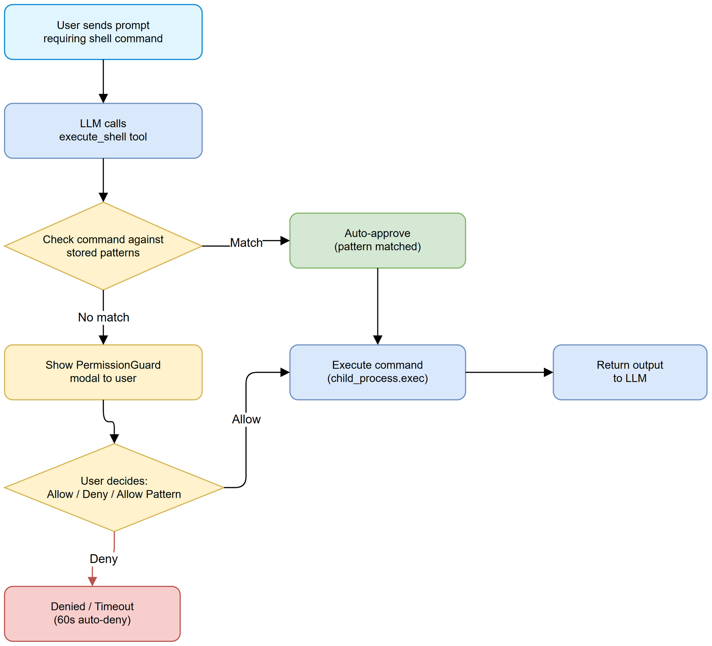

# Business Requirements Document (BRD)

## SDLC-Agents-4-Enterprise — SA4E-197: Add execute_shell tool with pattern-based auto-approve to chat agent

---

## Document Information

| Field | Value |
|-------|-------|
| Jira Ticket | SA4E-197 |
| Title | Add execute_shell tool with pattern-based auto-approve to chat agent |
| Author | BA Agent |
| Version | 1.0 |
| Date | 2025-07-27 |
| Status | Draft |

---

## Revision History

| Version | Date | Author | Changes |
|---------|------|--------|---------|
| 1.0 | 2025-07-27 | BA Agent | Initial document — post-implementation documentation |

---

## 1. Introduction

### 1.1 Scope

Add terminal command execution capability (`execute_shell`) to the VS Code extension's chat agent, with a pattern-based auto-approve mechanism that allows users to whitelist command patterns so they don't have to approve each shell command individually. Also includes bug fixes for Resume button hanging, tool section overflow, and model name overflow.

### 1.2 Out of Scope

- Remote/SSH command execution
- Command history persistence across sessions
- Shell selection (always uses default system shell)
- Sudo/elevated privilege commands
- Command output streaming (returns full output after completion)

### 1.3 Preliminary Requirement

- SA4E-85: PermissionGuard UI with approval gate infrastructure (already implemented)
- SA4E-185: Tool execution pipeline with approval gate wiring
- VS Code extension host with `child_process` access

---

## 2. Business Requirements

### 2.1 High Level Process Map

The chat agent needs to execute shell commands (build, test, git, package manager) to assist developers. Every shell command must go through an approval gate before execution. Users who trust a category of commands (e.g., all `npm *` commands) can auto-approve future matching commands via glob patterns stored in session memory.

### 2.2 List of User Stories / Use Cases

| # | Story / Use Case | Priority | Source Ticket |
|---|------------------|----------|---------------|
| 1 | Execute shell commands from chatbox | MUST HAVE | SA4E-197 |
| 2 | Pattern-based auto-approve for shell commands | MUST HAVE | SA4E-197 |
| 3 | Fix Resume button hanging indefinitely | MUST HAVE | SA4E-197 |
| 4 | Fix tool section overflow/collapse | SHOULD HAVE | SA4E-197 |
| 5 | Fix model name overflow in UI | SHOULD HAVE | SA4E-197 |

---

### 2.3 Details of User Stories

---

#### Business Flow

**Step 1:** User sends a prompt in chatbox that requires terminal command execution

**Step 2:** LLM decides to use `execute_shell` tool with command arguments

**Step 3:** System checks if command matches any stored auto-approve pattern

**Step 4a:** If pattern match found → auto-approve, execute immediately

**Step 4b:** If no pattern match → show PermissionGuard modal to user

**Step 5:** User chooses: Allow (once), Deny, or "Allow all {pattern} commands"

**Step 6a:** Allow → execute command, return output to LLM

**Step 6b:** Deny → return denial message to LLM

**Step 6c:** Allow all pattern → store pattern in session, execute command, future matching commands auto-approved

**Step 7:** Command executes via `child_process.exec` with timeout and buffer limits

**Step 8:** Output (stdout/stderr) returned to LLM for next reasoning step

---

#### STORY 1: Execute Shell Commands from Chatbox

> As a developer, I want the chat agent to execute terminal commands so that I can run builds, tests, and git operations without leaving the chat.

**Requirement Details:**

1. New VS Code native tool `execute_shell` available in chat agent tool definitions
2. Accepts: command (required), cwd (optional, defaults to workspace root), timeout (optional, default 120s)
3. Uses `child_process.exec` for command execution
4. Returns stdout on success, stderr + exit code on failure
5. Output truncated at 50KB to prevent context overflow
6. Classified as "shell" tool type (high risk) in ToolApprovalClassifier
7. Requires user approval before execution (via PermissionGuard)

**Acceptance Criteria:**

1. Chatbox can execute terminal commands via `execute_shell` tool
2. User is asked for approval before shell command runs
3. Command runs in workspace root by default
4. Custom working directory supported via `cwd` parameter
5. Timeout kills long-running commands (default 120s)
6. Output correctly returned to LLM (stdout on success, stderr on error)
7. Output truncated at 50KB with indicator message

---

#### STORY 2: Pattern-Based Auto-Approve

> As a developer, I want to whitelist command patterns (e.g., "npm *") so that I don't have to approve every single npm command individually.

**Requirement Details:**

1. CommandPatternMatcher service stores glob patterns (e.g., "npm *", "git status")
2. Patterns use simple glob: `*` matches any sequence of characters
3. Pattern matching is case-insensitive
4. Patterns are session-scoped (cleared on extension reload/session reset)
5. When shell command matches stored pattern, approval gate is bypassed
6. PermissionGuard UI shows "Allow all {toolType} tools this session" button
7. Pattern suggestion: extracts base command + wildcards rest (e.g., "npm run test" → "npm *")

**Acceptance Criteria:**

1. User can click "Allow all {pattern} commands" to auto-approve future matching commands
2. Matched commands skip the approval modal entirely
3. Auto-approved commands logged with debug message showing matched pattern
4. Patterns reset on session clear (no persistence across sessions)
5. suggestPattern() correctly extracts "base *" from complex commands

---

#### STORY 3: Fix Resume Button Hanging

> As a user, I want the Resume button to work reliably so that I can continue interrupted conversations.

**Requirement Details:**

1. Root cause: `workingStatus` was not emitted as `false` in all code paths (missing finally blocks)
2. Fix: ensure `chat:workingStatus { working: false }` is emitted in finally blocks of all graph execution paths
3. Affected paths: LangGraphEngine.run(), engine-chat-handler, message-routing direct commands

**Acceptance Criteria:**

1. Resume button does not hang indefinitely after any operation
2. Working status correctly resets to false after errors, cancellations, and completions

---

#### STORY 4: Fix Tool Section Overflow

> As a user, I want the tool execution section in chat to display properly without collapsing.

**Requirement Details:**

1. Root cause: CSS `contain: layout` on `.ksa247-tool-container` was causing layout containment issues
2. Fix: Changed to `contain: layout style` which prevents style leaking without breaking layout calculation

**Acceptance Criteria:**

1. Tool section displays at full width without collapsing
2. Tool results are fully visible within their container

---

#### STORY 5: Fix Model Name Overflow

> As a user, I want long model names to be truncated with tooltip instead of breaking the UI layout.

**Requirement Details:**

1. Model name display uses `text-overflow: ellipsis` + `overflow: hidden` + `white-space: nowrap`
2. Max width constrained to prevent pushing other elements
3. Full model name visible on hover via native browser tooltip

**Acceptance Criteria:**

1. Long model names (e.g., "anthropic/claude-sonnet-4-20250514") truncated with ellipsis
2. Hover shows full model name
3. UI layout not broken by long model names

---

## 3. Dependencies

| Dependency | Type | Related Ticket | Description |
|------------|------|----------------|-------------|
| PermissionGuard UI | System | SA4E-85 | Modal overlay for tool approval |
| ToolApprovalGate | System | SA4E-185 | Promise-based approval gate infrastructure |
| LangGraph Pipeline | System | KSA-235 | Tool execution pipeline with hook engine |
| VS Code Extension Host | Infrastructure | N/A | child_process.exec access for shell execution |

---

## 4. Stakeholders

| Role | Name / Team | Responsibility |
|------|-------------|----------------|
| Developer | Extension Team | Implementation |
| QA | QA Team | Test approval flow and command execution |
| End User | Developers using extension | Interact with shell commands via chatbox |

---

## 5. Risks and Assumptions

### 5.1 Risks

| Risk | Impact | Likelihood | Mitigation |
|------|--------|------------|------------|
| Malicious command execution | High | Low | Approval gate + pattern review by user |
| Command timeout not killing child process | Medium | Low | exec timeout parameter + process cleanup |
| Pattern too broad (e.g., "*") approves everything | High | Medium | Pattern suggestion limits to "base *" format |
| Session-scoped patterns lost on reload | Low | High | By design — security feature (no persistence) |

### 5.2 Assumptions

- Users understand the risk of auto-approving shell command patterns
- Default system shell is sufficient (no shell selection needed)
- 50KB output truncation is acceptable for most commands
- 120s timeout is sufficient for typical build/test commands

---

## 6. Non-Functional Requirements

| Category | Requirement | Details |
|----------|-------------|---------|
| Performance | Command execution timeout | Default 120s, configurable per call |
| Performance | Output buffer limit | 10MB max buffer, 50KB max return to LLM |
| Security | Approval gate | Every shell command requires approval (unless pattern-matched) |
| Security | Session isolation | Patterns cleared on session reset, no cross-session persistence |
| Usability | Auto-deny countdown | 60s countdown before auto-denying unapproved commands |
| Accessibility | WCAG focus trap | PermissionGuard has keyboard navigation and focus trap |

---

## 7. Related Tickets

| Ticket Key | Summary | Status | Type | Relationship |
|------------|---------|--------|------|--------------|
| SA4E-197 | Add execute_shell tool with pattern-based auto-approve | In Progress | Story | Main ticket |
| SA4E-85 | PermissionGuard UI component | Done | Story | Prerequisite |
| SA4E-185 | Tool execution pipeline approval gate | Done | Story | Prerequisite |
| KSA-235 | VS Code native tool definitions | Done | Story | Foundation |

---

## 8. Appendix

### Glossary

| Term | Definition |
|------|------------|
| execute_shell | VS Code native tool that runs terminal commands via child_process.exec |
| CommandPatternMatcher | Service that stores glob patterns for auto-approving shell commands |
| PermissionGuard | Svelte modal overlay that asks user permission before tool execution |
| ToolApprovalGate | Promise-based mechanism that blocks tool execution until user responds |
| Glob pattern | Simple wildcard pattern where * matches any characters (e.g., "npm *") |
| Session-scoped | Data that exists only for current session, cleared on reload |

### Diagram Index

| # | Diagram | Image | Source (editable) |
|---|---------|-------|-------------------|
| 1 | Business Flow | [business-flow.png](diagrams/business-flow.png) | [business-flow.drawio](diagrams/business-flow.drawio) |
| 2 | Use Case | [use-case.png](diagrams/use-case.png) | [use-case.drawio](diagrams/use-case.drawio) |
