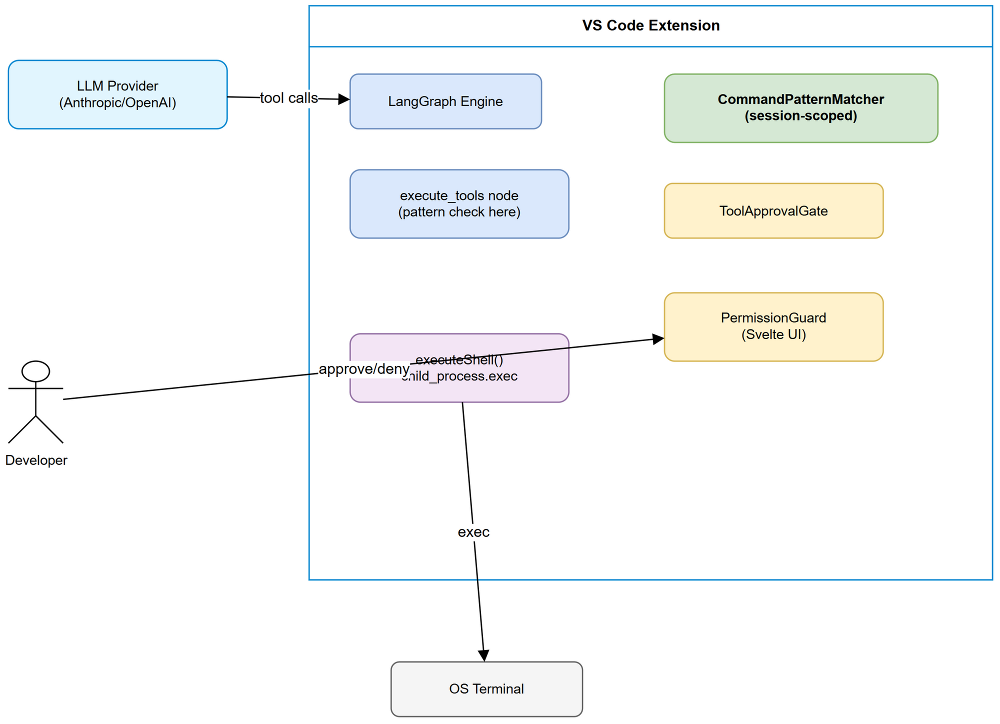
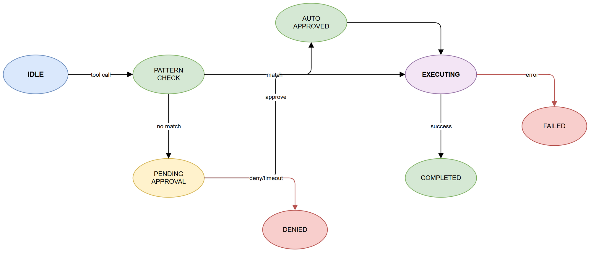

# Functional Specification Document (FSD)

## SDLC-Agents-4-Enterprise — SA4E-197: Add execute_shell tool with pattern-based auto-approve to chat agent

---

## Document Information

| Field | Value |
|-------|-------|
| Jira Ticket | SA4E-197 |
| Title | Add execute_shell tool with pattern-based auto-approve to chat agent |
| Author | BA Agent + TA Agent |
| Version | 1.0 |
| Date | 2025-07-27 |
| Status | Draft |
| Related BRD | BRD-v1-SA4E-197.docx |

---

## 1. Introduction

### 1.1 Purpose

Specifies the functional behavior of the `execute_shell` tool, CommandPatternMatcher service, and PermissionGuard UI integration that enables the chat agent to run terminal commands with user-controlled approval patterns.

### 1.2 Scope

- Tool definition and execution for shell commands
- Pattern-based auto-approve mechanism (session-scoped)
- PermissionGuard UI interaction for shell commands
- Bug fixes: Resume button, tool section overflow, model name overflow

### 1.3 Definitions & Acronyms

| Term | Definition |
|------|------------|
| execute_shell | VS Code native tool that runs shell commands via child_process.exec |
| CommandPatternMatcher | Class that stores glob patterns and matches commands against them |
| PermissionGuard | Svelte component showing approval modal overlay |
| ToolApprovalGate | Promise-based async gate that pauses tool execution until user responds |
| Glob pattern | Wildcard pattern where `*` matches any character sequence |

---

## 2. System Context



The execute_shell tool operates within the VS Code extension chat agent pipeline. The LLM agent decides to invoke the tool, the extension pipeline checks patterns, shows approval UI if needed, then executes via Node.js child_process.

---

## 3. Use Cases

### UC-1: Execute Shell Command

**Actor:** LLM Agent (primary), Developer (approver)

**Preconditions:**
- Chat session active
- LLM has access to execute_shell tool definition
- Workspace folder exists

**Main Flow:**

| Step | Actor | Action | System Response |
|------|-------|--------|-----------------|
| 1 | LLM | Calls execute_shell with command args | Pipeline receives tool call |
| 2 | System | Checks CommandPatternMatcher for match | Returns match or null |
| 3a | System | If matched → skip approval | Emit toolCall event with status "running" |
| 3b | System | If not matched → request approval | Show PermissionGuard modal |
| 4 | Developer | Clicks Allow / Deny / Allow pattern | ToolApprovalGate resolves |
| 5 | System | Execute command via child_process.exec | Wait for completion or timeout |
| 6 | System | Return stdout (success) or stderr+code (error) | Emit toolCallUpdate with result |

**Alternative Flows:**

- **AF-1:** User clicks "Allow all {toolType} tools this session" → store pattern → execute current + future matching
- **AF-2:** Command times out → return error with timeout indication
- **AF-3:** Command produces >50KB output → truncate with indicator

**Exception Flows:**

- **EF-1:** 60s countdown expires → auto-deny → return denial message to LLM
- **EF-2:** child_process.exec fails → return stderr + exit code

---

### UC-2: Pattern-Based Auto-Approve

**Actor:** Developer

**Main Flow:**

| Step | Actor | Action | System Response |
|------|-------|--------|-----------------|
| 1 | Developer | Clicks "Allow all {toolType} tools this session" | Dispatch approveSession event |
| 2 | System | Resolve approval for current tool call | Command executes |
| 3 | System | Store tool type pattern in CommandPatternMatcher | Pattern added to session set |
| 4 | System | Future matching commands auto-approved | No modal shown |

**Business Rules:**

| ID | Rule | Description |
|----|------|-------------|
| BR-01 | Session scope | Patterns cleared on session reset/extension reload |
| BR-02 | Case insensitive | Pattern matching ignores case |
| BR-03 | Glob syntax | Only `*` wildcard supported (matches any characters) |
| BR-04 | First match wins | First matching pattern stops further checks |
| BR-05 | No persistence | Patterns never written to disk or settings |

---

### UC-3: Suggest Pattern from Command

**Logic:**

```
suggestPattern("npm run test") → "npm *"
suggestPattern("git status")   → "git status"  (no args to wildcard)
suggestPattern("vitest --run src/test.ts") → "vitest *"
```

Rule: Keep first token (binary name), wildcard everything after if >1 token.

---

## 4. Data Specifications

### 4.1 Tool Definition Schema

```typescript
{
  name: "execute_shell",
  description: "Execute a shell command in the workspace...",
  inputSchema: {
    type: "object",
    properties: {
      command: { type: "string" },
      cwd: { type: "string" },
      timeout: { type: "number" }
    },
    required: ["command"]
  }
}
```

### 4.2 ApprovedPattern Interface

```typescript
interface ApprovedPattern {
  pattern: string;    // Original glob pattern
  regex: RegExp;      // Compiled regex
  addedAt: number;    // Timestamp
  matchCount: number; // Usage counter
}
```

---

## 5. API Contracts

### 5.1 execute_shell Tool Call

**Request (from LLM):**

```json
{ "name": "execute_shell", "arguments": { "command": "npm test", "cwd": "./backend", "timeout": 60000 } }
```

**Response (success):** stdout text

**Response (error):** `Exit code: 1\nSTDOUT:\n...\nSTDERR:\n...`

### 5.2 PermissionGuard Events

| Event | Direction | Payload |
|-------|-----------|---------|
| chat:toolCall | Ext → Web | `{ toolCall: { id, name, args, status }, requiresApproval: boolean }` |
| chat:toolCallUpdate | Ext → Web | `{ id, status, result, duration, retryable? }` |
| TOOL_CALL_RESPONSE | Web → Ext | `{ toolId, decision: 'APPROVE'\|'REJECT' }` |

---

## 6. UI Specifications

### 6.1 PermissionGuard Modal

- Overlay with semi-transparent background
- Risk level badge: High (red) for shell tools
- Tool name + arguments preview (max 4 args, truncated at 60 chars)
- 60-second countdown with auto-deny
- Three actions: Allow (green), Deny (red), "Allow all {toolType} tools this session" (link)
- WCAG: focus trap, keyboard navigation, aria-modal, Escape to deny

### 6.2 CSS Fixes

- Model name: `text-overflow: ellipsis; overflow: hidden; white-space: nowrap`
- Tool container: `contain: layout style` (was `contain: layout`)

---

## 7. State Diagram



States: IDLE → PATTERN_CHECK → PENDING_APPROVAL/AUTO_APPROVED → EXECUTING → COMPLETED/FAILED/DENIED/TIMEOUT

---

## 8. Error Handling

| Error Code | Condition | System Behavior |
|-----------|-----------|-----------------|
| TIMEOUT | Command exceeds timeout | Kill process, return stderr |
| DENIED | User clicks Deny | Return denial message |
| AUTO_DENIED | 60s countdown expires | Return "Auto-rejected. Retry available." |
| EXEC_ERROR | child_process.exec error | Return stderr + exit code |
| TRUNCATED | Output > 50KB | Truncate + append indicator |

---

## 9. Integration Requirements

### 9.1 Pipeline Wiring

CommandPatternMatcher flows through: `LangGraphEngine → buildPipelineGraph → buildRouterGraph → buildChatSubgraph → createExecuteToolsNode → executeSingleTool`

### 9.2 Hook Engine

- preToolUse fires BEFORE pattern check (hook can deny before pattern logic)
- postToolUse fires AFTER successful execution
- Hook errors are non-fatal

---

## Appendix

### Diagram Index

| # | Diagram | Image | Source (editable) |
|---|---------|-------|-------------------|
| 1 | System Context | [system-context.png](diagrams/system-context.png) | [system-context.drawio](diagrams/system-context.drawio) |
| 2 | Sequence — Execute Shell | [sequence-execute-shell.png](diagrams/sequence-execute-shell.png) | [sequence-execute-shell.drawio](diagrams/sequence-execute-shell.drawio) |
| 3 | State — Tool Approval | [state-tool-approval.png](diagrams/state-tool-approval.png) | [state-tool-approval.drawio](diagrams/state-tool-approval.drawio) |
