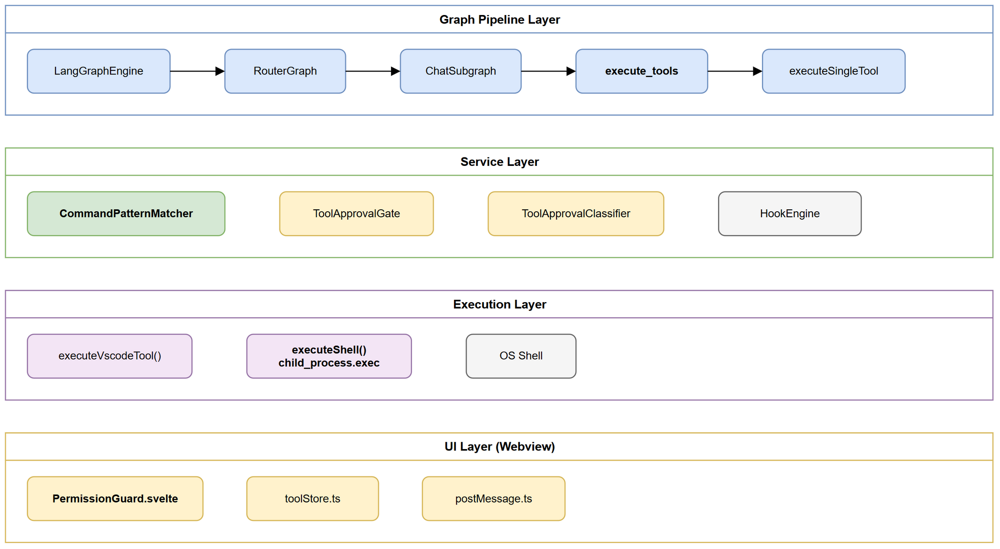
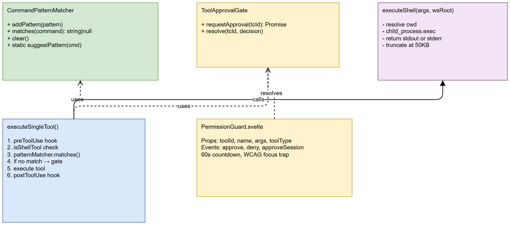

# Technical Design Document (TDD)

## SDLC-Agents-4-Enterprise — SA4E-197: Add execute_shell tool with pattern-based auto-approve to chat agent

---

## Document Information

| Field | Value |
|-------|-------|
| Jira Ticket | SA4E-197 |
| Title | Add execute_shell tool with pattern-based auto-approve |
| Author | SA Agent |
| Version | 1.0 |
| Date | 2025-07-27 |
| Status | Draft |
| Related FSD | FSD-v1-SA4E-197.docx |
| Related BRD | BRD-v1-SA4E-197.docx |

---

## 1. Architecture Overview



### 1.1 Design Principles

- **Layered pipeline**: CommandPatternMatcher is injected through the entire graph pipeline (Engine → Router → Subgraph → Node)
- **Session-scoped state**: No persistence — patterns reset on reload for security
- **Non-blocking approval**: Promise-based gate that pauses only the tool execution, not the entire graph
- **Fail-safe**: Hook errors non-fatal, approval timeout auto-denies

### 1.2 Technology Stack

| Layer | Technology | Purpose |
|-------|-----------|---------|
| Tool execution | child_process.exec (Node.js) | Shell command execution |
| Pattern matching | RegExp (compiled from glob) | Command auto-approve |
| Approval UI | Svelte 4 component | User interaction |
| Pipeline | LangGraph (TypeScript) | Graph-based agent orchestration |
| Communication | VS Code webview postMessage | Extension ↔ Webview |

---

## 2. Component Design



### 2.1 New Module: CommandPatternMatcher

**File:** `extension/src/chat/engine/CommandPatternMatcher.ts`

```typescript
export class CommandPatternMatcher {
  private readonly patterns: Map<string, ApprovedPattern>;
  
  addPattern(pattern: string): void;
  removePattern(pattern: string): void;
  matches(command: string): string | null;
  getPatterns(): ApprovedPattern[];
  clear(): void;
  static suggestPattern(command: string): string;
  private globToRegex(pattern: string): RegExp;
}
```

**Design decisions:**
- Map keyed by pattern string for O(1) add/remove, O(n) match
- Case-insensitive regex matching
- Match count tracked for usage analytics
- Static `suggestPattern` for decoupled suggestion logic

### 2.2 Modified: vscode-tool-definitions.ts

Added `execute_shell` to VSCODE_TOOL_DEFINITIONS array with command (required), cwd (optional), timeout (optional) params.

### 2.3 Modified: vscode-tools.ts

Added `executeShell()` async function:
- Resolves cwd (absolute or relative to workspace root)
- Calls `child_process.exec` with { cwd, maxBuffer: 10MB, timeout }
- Returns stdout on success, stderr + exit code on error
- Truncates output at 50KB

### 2.4 Modified: chat-graph-nodes.ts (executeSingleTool)

Pattern check logic inserted BEFORE approval gate:

```
1. Determine if tool is shell (execute_shell, shell_execute, execute_pwsh)
2. Extract command string from arguments
3. Call commandPatternMatcher.matches(command)
4. If match → set needsApproval = false
5. If no match → proceed with normal approval flow
```

### 2.5 Pipeline Wiring (Dependency Injection)

CommandPatternMatcher instance created in `LangGraphEngine` constructor, passed through:

```
LangGraphEngine (creates instance)
  → buildPipelineGraph(... commandPatternMatcher)
    → buildRouterGraph(... commandPatternMatcher)
      → buildChatSubgraph(... commandPatternMatcher)
        → createExecuteToolsNode(... commandPatternMatcher)
          → executeSingleTool(... commandPatternMatcher)
```

### 2.6 Tool Classification Updates

- `hook-tool-matcher.ts`: Added `execute_shell: "shell"` to TOOL_TYPE_MAP
- `ToolApprovalClassifier.ts`: Added `execute_shell` to DANGEROUS_TOOLS array

---

## 3. API Design

### 3.1 Tool Schema (LLM-facing)

```json
{
  "name": "execute_shell",
  "description": "Execute a shell command in the workspace. Returns stdout on success.",
  "inputSchema": {
    "type": "object",
    "properties": {
      "command": { "type": "string", "description": "Shell command to execute" },
      "cwd": { "type": "string", "description": "Working directory (optional)" },
      "timeout": { "type": "number", "description": "Timeout in ms (default 120000)" }
    },
    "required": ["command"]
  }
}
```

### 3.2 Internal Events

| Event | Direction | Payload |
|-------|-----------|---------|
| chat:toolCall | Ext → Web | `{ toolCall, requiresApproval }` |
| chat:toolCallUpdate | Ext → Web | `{ id, status, result, duration }` |
| TOOL_CALL_RESPONSE | Web → Ext | `{ toolId, decision }` |

---

## 4. Security Design

| Threat | Mitigation |
|--------|-----------|
| Malicious command injection | Approval gate before every execution |
| Overly broad patterns | suggestPattern limits to "base *" format |
| Pattern persistence | Session-scoped only, cleared on reload |
| Buffer overflow | maxBuffer: 10MB hard limit |
| DoS via long commands | Configurable timeout (default 120s) |

---

## 5. Error Handling

| Scenario | Handler | Response |
|----------|---------|----------|
| User denies | ToolApprovalGate rejects | "Tool execution denied by user." |
| 60s countdown | PermissionGuard auto-deny | "Auto-rejected. Retry available." |
| Command timeout | child_process timeout | stderr + exit code |
| exec error | exec callback | stderr + exit code |
| Pattern match | Skip gate | Execute immediately, log debug |

---

## 6. Implementation Checklist

### New Files

| # | File | Purpose |
|---|------|---------|
| 1 | `extension/src/chat/engine/CommandPatternMatcher.ts` | Pattern storage + matching |

### Modified Files

| # | File | Change |
|---|------|--------|
| 1 | `vscode-tool-definitions.ts` | Add execute_shell definition |
| 2 | `vscode-tools.ts` | Add executeShell function |
| 3 | `chat-graph-nodes.ts` | Pattern check + auto-approve |
| 4 | `chat-graph.ts` | Pass commandPatternMatcher |
| 5 | `graph-builder.ts` | Pass commandPatternMatcher |
| 6 | `router-graph.ts` | Pass commandPatternMatcher |
| 7 | `langgraph-engine.ts` | Create + inject instance |
| 8 | `hook-tool-matcher.ts` | Add to TOOL_TYPE_MAP |
| 9 | `ToolApprovalClassifier.ts` | Add to DANGEROUS_TOOLS |
| 10 | `PermissionGuard.svelte` | "Allow all" session button |
| 11 | `postMessage.ts` | respondToolCall function |
| 12 | `chat.css` (both) | contain:style + overflow fixes |

### Bug Fixes

| # | Bug | Root Cause | Fix |
|---|-----|-----------|-----|
| 1 | Resume hanging | workingStatus not false in all paths | finally blocks emit working:false |
| 2 | Tool section overflow | `contain: layout` too restrictive | `contain: layout style` |
| 3 | Model name overflow | No text truncation | ellipsis + max-width |

---

## 7. Testing Strategy

| Level | Focus | Tool |
|-------|-------|------|
| Unit | CommandPatternMatcher (glob→regex, match, suggest) | Vitest |
| Unit | ToolApprovalClassifier classification | Vitest |
| Integration | executeSingleTool with pattern match flow | Vitest + mocks |
| E2E-API | TOOL_CALL_RESPONSE contract validation | Vitest |
| Manual | PermissionGuard modal interaction | VS Code extension host |

---

## Appendix

### Diagram Index

| # | Diagram | Image | Source (editable) |
|---|---------|-------|-------------------|
| 1 | Architecture | [architecture.png](diagrams/architecture.png) | [architecture.drawio](diagrams/architecture.drawio) |
| 2 | Component | [component.png](diagrams/component.png) | [component.drawio](diagrams/component.drawio) |
