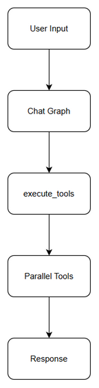
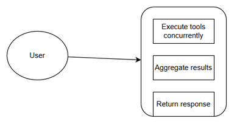

# Business Requirements Document (BRD)

## Chat Module — SA4E-204: Parallel Tool Execution in Chat Graph

---

## Document Information

| Field | Value |
|-------|-------|
| Jira Ticket | SA4E-204 |
| Title | Parallel Tool Execution in Chat Graph |
| Author | BA Agent |
| Version | 1.0 |
| Date | 2026-08-21 |
| Status | Draft |

---

## Author Tracking

| Role | Name - Position | Responsibility |
|------|-----------------|----------------|
| Author | BA Agent – Business Analyst | Create document |
| Peer Reviewer | TBD – TBD | Review document |

---

## Revision History

| Version | Date | Author | Changes |
|---------|------|--------|---------|
| 1.0 | 2026-08-21 | BA Agent | Initiate document — auto-generated from Jira ticket SA4E-204 and linked tickets |

---

## Sign-Off

| Name | Signature and date |
|------|--------------------|
| | ☐ I agree and confirm all criteria on this BRD as expected requirements |
| | ☐ I agree and confirm all criteria on this BRD as expected requirements |

## Diagram Index

| Diagram | File | Description |
|---------|------|-------------|
| Business Flow | diagrams/business-flow.drawio | High-level process from user input to response |
| Use Case | diagrams/use-case.drawio | User interactions with Chat Module |

---

## 1. Introduction

### 1.1 Scope

Upgrade chat-graph execute_tools node to run concurrent tool calls.

The scope of this change request is to enable parallel execution of multiple tools within the chat graph execution pipeline. The feature is part of Epic SA4E-181 Chat Module — OpenCode Parity + Agentic Config System. The objective is to improve response latency and throughput by allowing independent tool calls to execute concurrently rather than sequentially.

Current behavior: execute_tools node processes tools one at a time.
Desired behavior: execute_tools node identifies independent tools and runs them in parallel, aggregates results, and continues graph execution.

### 1.2 Out of Scope

- Changes to tool definition schemas or MCP protocol.
- UI changes to chat interface.
- Changes to tool execution ordering logic beyond parallelism for independent calls.
- To be confirmed with stakeholders.

### 1.3 Preliminary Requirement

- Chat graph runtime must be operational.
- execute_tools node implementation must exist and be testable.
- No additional preliminary requirements identified from ticket data.

---

## 2. Business Requirements

### 2.1 High Level Process Map

The business process involves a user interacting with the Chat Module. A user message triggers the LangGraph workflow. The workflow reaches the execute_tools node, which receives a list of tool calls required for the current step. Currently tools are executed sequentially. After upgrade, independent tools will be dispatched concurrently, results collected, and passed to the next node.

High-level flow: User Input → Chat Graph Start → Reasoning Node → execute_tools Node → Tool Execution [Sequential → Parallel] → Result Aggregation → Next Node → Response.

*[Edit in draw.io](diagrams/business-flow.drawio)*

### 2.2 List of User Stories / Use Cases

| # | Story / Use Case / Epic | Priority | Source Ticket |
|---|-------------------------|----------|---------------|
| 1 | As a developer/user, I want the chat graph to execute multiple independent tools concurrently so that response time is reduced | MUST HAVE | SA4E-204 |
| 2 | As a system, I want tool results to be aggregated correctly after parallel execution so that downstream nodes receive complete context | SHOULD HAVE | SA4E-204 |
| 3 | As an operator, I want to control parallel execution via feature toggle and max parallelism limit to manage resource usage | SHOULD HAVE | SA4E-204 |

*[Edit in draw.io](diagrams/use-case.drawio)*

---

### 2.3 Details of User Stories

---

#### Business Flow

**Step 1:** User sends message to Chat Module.

**Step 2:** Chat graph is invoked and processes message through reasoning nodes.

**Step 3:** Graph reaches execute_tools node with a set of tool calls identified.

**Step 4:** execute_tools node analyzes dependencies between tool calls.

**Step 5:** Independent tool calls are dispatched concurrently.

**Step 6:** Results are collected and validated.

**Step 7:** Aggregated results are passed to next graph node.

**Step 8:** Final response is generated and returned to user.

> **Note:** Tool execution order must be preserved for dependent tools. Parallel execution applies only to independent calls.

---

#### STORY 1: Parallel Tool Execution

> As a developer/user, I want the chat graph to execute multiple independent tools concurrently so that response time is reduced

**Requirement Details:**

1. Upgrade chat-graph execute_tools node to run concurrent tool calls as per ticket description.
2. Identify independent tools within a single execute_tools invocation.
3. Execute independent tools in parallel using appropriate concurrency primitives.
4. Maintain backward compatibility with sequential execution for dependent tools.

**Data Fields (if applicable):**

| Field | Type | Required | Description | Example |
|-------|------|----------|-------------|---------|
| tool_call_id | string | Yes | Unique identifier for tool call | call_123 |
| tool_name | string | Yes | Name of tool to execute | web_search |
| arguments | object | Yes | Parameters for tool | {...} |

**Acceptance Criteria:**

1. execute_tools node executes independent tool calls concurrently.
2. Total execution time for independent tools is reduced compared to sequential execution.
3. Tool results are correctly mapped to corresponding tool_call_id after parallel execution.
4. No information available from provided tickets for additional acceptance criteria.

**UI Specifications (if applicable):**

No UI specifications identified from tickets.

**Validation Rules (if applicable):**

- Tool call list must not be empty before execution.
- Results must contain matching tool_call_id.

**Error Handling (if applicable):**

- If a parallel tool call fails, error is captured and propagated without blocking other independent tools.
- System behavior for partial failures to be confirmed with stakeholders.

---

#### STORY 2: Result Aggregation

> As a system, I want tool results to be aggregated correctly after parallel execution so that downstream nodes receive complete context

**Requirement Details:**

Aggregate results from parallel tool executions in a deterministic order for downstream consumption.

**Acceptance Criteria:**

1. Aggregated results preserve order relative to original tool call list.
2. Downstream nodes receive complete set of results or explicit error markers.

---

## 3. Dependencies

| Dependency | Type | Related Ticket | Description |
|------------|------|----------------|-------------|
| Chat Graph Runtime | System | SA4E-181 | Parent epic for Chat Module parity |
| execute_tools Node | System | SA4E-204 | Existing node to be upgraded |
| | | | No additional dependencies identified from tickets |

---

## 4. Stakeholders

| Role | Name / Team | Responsibility | Source |
|------|-------------|----------------|--------|
| Reporter | Duc Nguyen Minh | Requirement owner | SA4E-204 |
| Creator | Duc Nguyen Minh | Ticket creator | SA4E-204 |
| Epic Owner | TBD | Chat Module epic SA4E-181 | SA4E-181 |

---

## 5. Risks and Assumptions

### 5.1 Risks

| Risk | Impact | Likelihood | Mitigation |
|------|--------|------------|------------|
| Race conditions in result aggregation | High | Medium | Implement deterministic merging with tool_call_id mapping |
| Increased resource usage during parallel execution | Medium | Medium | Limit concurrent tool calls with configurable max parallelism |
| Breaking changes to existing sequential logic | High | Low | Maintain backward compatibility and add feature toggle |

### 5.2 Assumptions

- Tools are stateless and can be executed in parallel safely.
- Tool execution time dominates graph latency.
- No specific non-functional requirements identified from tickets.

---

## 6. Non-Functional Requirements

| Category | Requirement | Details |
|----------|-------------|---------|
| Performance | Reduced latency for multi-tool steps | Target reduction to be confirmed with technical team |
| Security | | No specific requirements identified from tickets |
| Scalability | | No specific requirements identified from tickets |
| Availability | | No specific requirements identified from tickets |

> No specific non-functional requirements identified. To be confirmed with technical team.

---

## 7. Related Tickets

| Ticket Key | Summary | Status | Type | Relationship |
|------------|---------|--------|------|--------------|
| SA4E-204 | Parallel Tool Execution in Chat Graph | To Do | Story | Main ticket |
| SA4E-181 | Chat Module — OpenCode Parity + Agentic Config System | Done | Epic | Parent epic |

---

## 8. Appendix

### Glossary

| Term | Definition |
|------|------------|
| execute_tools node | Node in chat graph responsible for dispatching tool calls |
| Chat Graph | LangGraph workflow powering Chat Module |

### Reference Documents

| Document | Link / Location |
|----------|-----------------|
| BRD Template | documents/templates/BRD-TEMPLATE.md |
| Epic Description | SA4E-181 |
