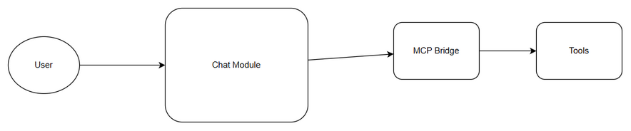
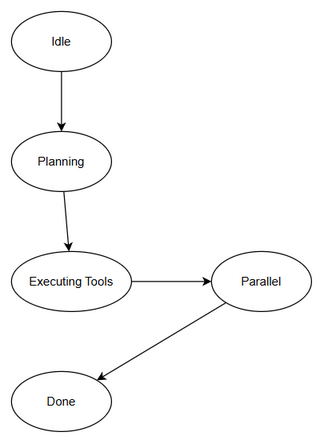
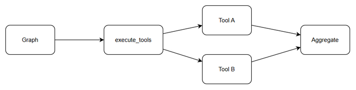
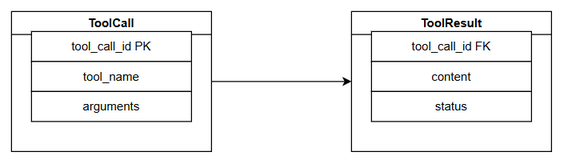
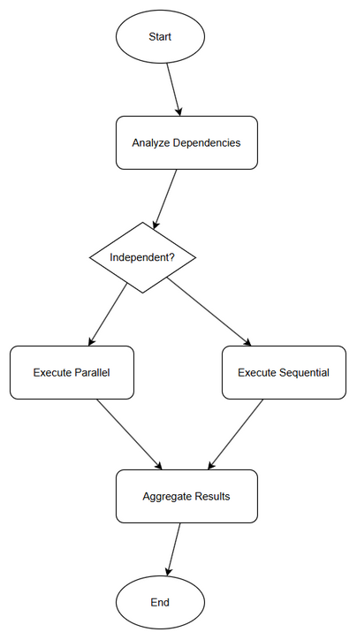

# Functional Specification Document (FSD)

## SA4E-204 — Parallel Tool Execution in Chat Graph

---

## Document Information

| Field | Value |
|-------|-------|
| Jira Ticket | SA4E-204 |
| Title | Parallel Tool Execution in Chat Graph |
| Author | SA Agent |
| Version | 1.0 |
| Date | 2026-08-21 |
| Status | Draft |
| Related BRD | documents/SA4E-204/BRD.md |

---

## Revision History

| Version | Date | Author | Changes |
|---------|------|--------|---------|
| 1.0 | 2026-08-21 | SA Agent | Initiate document — auto-generated from BRD and Jira ticket |

## Diagram Index

| Diagram | File | Description |
|---------|------|-------------|
| System Context | diagrams/system-context.drawio | Context of Chat Module with external systems |
| Sequence | diagrams/sequence.drawio | Parallel tool execution sequence |
| State | diagrams/state.drawio | State transitions of execute_tools node |
| ER Diagram | diagrams/er-diagram.drawio | ToolCall - ToolResult entities |
| Process Flow | diagrams/process-parallel-tool.drawio | Dependency analysis and execution flow |

---

## 1. Introduction

### 1.1 Purpose

This Functional Specification Document defines the functional behavior for upgrading the `execute_tools` node in the Chat Graph to support parallel execution of independent tool calls. The purpose is to reduce response latency and improve throughput while maintaining result correctness and backward compatibility with existing sequential execution paths.

### 1.2 Scope

In scope:
- Upgrade `execute_tools` node to identify independent tool calls and dispatch them concurrently.
- Implement result aggregation with deterministic ordering and error propagation.
- Maintain backward compatibility for dependent tool chains.
- Configurable max parallelism and feature toggle.

Out of scope:
- Changes to tool definition schemas or MCP protocol.
- UI changes to chat interface.
- Changes to tool execution ordering logic beyond parallelism for independent calls.

### 1.3 Definitions & Acronyms

| Term | Definition |
|------|------------|
| execute_tools node | Node in chat graph responsible for dispatching tool calls |
| Chat Graph | LangGraph workflow powering Chat Module |
| Tool Call | A single request to an external tool/MCP server with tool_name and arguments |
| Independent Tool | Tool call with no data dependency on other tool calls in the same invocation |
| Parallelism | Concurrent execution of multiple tool calls using concurrency primitives |

### 1.4 References

| Document | Location |
|----------|----------|
| BRD | documents/SA4E-204/BRD.md |
| Epic Description | SA4E-181 Chat Module — OpenCode Parity + Agentic Config System |
| FSD Template | documents/templates/FSD-TEMPLATE.md |

---

## 2. System Overview

### 2.1 System Context Diagram

The Chat Module receives user messages via the Chat API. The Chat Graph orchestrates reasoning and tool execution. The `execute_tools` node interacts with MCP / external tool providers. Results flow back into the graph for next node processing and final response generation.

### 2.2 System Architecture

High-level components:
- **Chat API Gateway**: Receives user messages, authenticates, routes to Chat Graph runtime.
- **Chat Graph Runtime**: LangGraph workflow engine managing state, nodes, and transitions.
- **Reasoning Node**: LLM-based node that determines required tool calls.
- **execute_tools Node**: Upgraded node that analyzes dependencies, dispatches parallel tool calls, aggregates results.
- **Tool Executor / MCP Client**: Executes individual tool calls against MCP servers or HTTP services.
- **State Store**: Holds graph execution state including pending tool calls and results.

Communication pattern: Synchronous request-response within graph step, concurrent outbound tool calls, aggregated synchronous return to graph.

*[Edit in draw.io](diagrams/state.drawio)*

---

## 3. Functional Requirements

### 3.1 Feature: Parallel Tool Execution

**Source:** BRD Story 1 - SA4E-204

#### 3.1.1 Description

The `execute_tools` node must analyze the set of tool calls generated by the reasoning node, determine independence, and execute independent calls concurrently using appropriate concurrency primitives. Dependent tools must continue to execute sequentially respecting data dependencies.

#### 3.1.2 Use Case

**Use Case ID:** UC-1
**Actor:** Chat Graph Runtime / Developer/User
**Preconditions:** Chat graph is running; `execute_tools` node is reached with a non-empty list of tool calls; tool executor is available.
**Postconditions:** Tool results collected, aggregated, and passed to next graph node; execution latency reduced for independent calls.

**Main Flow:**

| Step | Actor | System | Description |
|------|-------|--------|-------------|
| 1 | Chat Graph | | Reasoning node produces tool call list |
| 2 | | execute_tools node | Receives tool call list from graph state |
| 3 | execute_tools node | | Validate tool call list not empty |
| 4 | execute_tools node | | Analyze dependencies between tool calls |
| 5 | execute_tools node | Tool Executor | Dispatch independent tool calls concurrently |
| 6 | Tool Executor | execute_tools node | Return results or errors per tool_call_id |
| 7 | execute_tools node | | Aggregate results preserving original order |
| 8 | execute_tools node | Chat Graph | Pass aggregated results to next node |
| 9 | Chat Graph | User | Continue graph execution and return response |

*[Edit in draw.io](diagrams/sequence.drawio)*

**Alternative Flows:**

| ID | Condition | Steps |
|----|-----------|-------|
| AF-1 | All tool calls are dependent | Execute tools sequentially as before |
| AF-2 | Partial failure | Capture error per tool_call_id, continue other independent calls, propagate error markers |

**Exception Flows:**

| ID | Condition | Steps |
|----|-----------|-------|
| EF-1 | Empty tool call list | Raise validation error, halt graph with user-friendly message |
| EF-2 | Tool executor unavailable | Fail fast with circuit breaker, return error for all calls |
| EF-3 | Timeout on individual tool | Cancel/terminate tool call, return timeout error for that tool_call_id |

#### 3.1.3 Business Rules

| Rule ID | Rule | Source |
|---------|------|--------|
| BR-1 | Tool call list must not be empty before execution | BRD 2.3 Validation Rules |
| BR-2 | Results must contain matching tool_call_id | BRD 2.3 Validation Rules |
| BR-3 | Parallel execution applies only to independent tools | BRD 1.1 Scope |
| BR-4 | Dependent tools must preserve execution order | BRD 2.3 Note |
| BR-5 | Max concurrent tool calls configurable via feature flag | BRD 5.1 Risks Mitigation |

#### 3.1.4 Data Specifications

**Input Data:**

| Field | Type | Required | Validation | Description |
|-------|------|----------|------------|-------------|
| tool_call_id | string | Y | Non-empty, unique within invocation | Unique identifier for tool call |
| tool_name | string | Y | Non-empty, matches registered tool | Name of tool to execute |
| arguments | object | Y | JSON serializable | Parameters for tool |

**Output Data:**

| Field | Type | Description |
|-------|------|-------------|
| tool_call_id | string | Correlated identifier |
| result | object | Tool output payload |
| error | object | Error details if failed |
| status | string | success / error / timeout |

#### 3.1.5 UI Specifications

No UI specifications. Feature is backend graph execution.

#### 3.1.6 API Contract (Functional View)

> Note: Technical details in TDD.

**Endpoint:** Internal graph node invocation — `execute_tools`
**Purpose:** Dispatch and aggregate tool calls for chat graph step

**Input Parameters:**

| Parameter | Type | Required | Business Rule | Description |
|-----------|------|----------|---------------|-------------|
| tool_calls | array | Y | BR-1 | List of tool call objects |
| max_parallelism | integer | N | BR-5 | Configurable concurrency limit |

**Output Data:**

| Field | Type | Description |
|-------|------|-------------|
| tool_results | array | Ordered list of results mapped to tool_call_id |

**Business Error Scenarios:**

| Scenario | User Message | Trigger Condition |
|----------|-------------|-------------------|
| Empty tool list | No tools to execute | tool_calls empty |
| Tool execution error | Tool execution failed | External tool returns error |
| Timeout | Tool execution timed out | Tool exceeds timeout threshold |

---

### 3.2 Feature: Result Aggregation

**Source:** BRD Story 2 - SA4E-204

#### 3.2.1 Description

After parallel execution, results from all tool calls must be aggregated into a deterministic structure that preserves original order and includes explicit error markers for failed calls.

#### 3.2.2 Use Case

**Use Case ID:** UC-2
**Actor:** System
**Preconditions:** Parallel or sequential tool execution completed with results/errors.
**Postconditions:** Downstream nodes receive complete context with ordered results.

**Main Flow:**

| Step | Actor | System | Description |
|------|-------|--------|-------------|
| 1 | | execute_tools node | Collect results as they complete |
| 2 | execute_tools node | | Map each result to original tool_call_id |
| 3 | execute_tools node | | Sort results to match original tool call order |
| 4 | execute_tools node | Chat Graph | Return aggregated array to graph state |

**Alternative Flows:**

| ID | Condition | Steps |
|----|-----------|-------|
| AF-1 | Partial failure | Insert error marker for failed tool, keep order |

**Exception Flows:**

| ID | Condition | Steps |
|----|-----------|-------|
| EF-1 | Missing tool_call_id in result | Log warning, treat as error marker |

#### 3.2.3 Business Rules

| Rule ID | Rule | Source |
|---------|------|--------|
| BR-6 | Aggregated results preserve order relative to original tool call list | BRD Story 2 AC |
| BR-7 | Downstream nodes receive complete set of results or explicit error markers | BRD Story 2 AC |

#### 3.2.4 Data Specifications

**Input Data:** Same as 3.1.4 plus tool execution results.

**Output Data:** Ordered array of tool results with status.

---

## 4. Data Model

> Note: Logical model. Physical implementation in TDD §4.

### 4.1 Entity Relationship Diagram

### 4.2 Logical Entities

#### Entity: ToolCall

| Attribute | Type | Required | Business Rule | Description |
|-----------|------|----------|---------------|-------------|
| tool_call_id | string | Y | Unique per invocation | Identifier for correlation |
| tool_name | string | Y | Registered tool | Tool to invoke |
| arguments | object | Y | Valid JSON | Input parameters |
| depends_on | array | N | BR-4 | List of tool_call_id dependencies |

**Relationships:**
None persistent; transient per graph execution.

#### Entity: ToolResult

| Attribute | Type | Required | Business Rule | Description |
|-----------|------|----------|---------------|-------------|
| tool_call_id | string | Y | Must match ToolCall | Correlation |
| status | string | Y | success/error/timeout | Execution status |
| result | object | N | Present if success | Tool output |
| error | object | N | Present if error | Error details |
| duration_ms | integer | N | Metrics | Execution time |

**Relationships:**
ToolResult maps 1:1 to ToolCall per invocation.

---

## 5. Integration Specifications

> Note: Business view. Technical details in TDD §6.

### 5.1 External System: Tool Executor / MCP Server

| Attribute | Value |
|-----------|-------|
| Purpose | Execute individual tool calls on behalf of chat graph |
| Direction | Outbound |
| Data Format | JSON |
| Frequency | Real-time on-demand |

**Data Exchange:**

| Our Data | External Data | Direction | Business Rule |
|----------|--------------|-----------|---------------|
| tool_name, arguments | tool_response/error | Send/Receive | Tool call correlation via tool_call_id |

### 5.2 External System: Chat Graph Runtime

| Attribute | Value |
|-----------|-------|
| Purpose | Orchestrate nodes and state management |
| Direction | Bidirectional |
| Data Format | JSON |
| Frequency | Real-time |

---

## 6. Processing Logic

### 6.1 Parallel Tool Execution Process

**Trigger:** `execute_tools` node invoked by Chat Graph
**Schedule:** On-demand per user message
**Input:** List of tool calls
**Output:** Aggregated tool results

**Processing Steps:**

| Step | Description | Error Handling |
|------|-------------|----------------|
| 1 | Validate tool call list non-empty | Return validation error |
| 2 | Build dependency graph from tool calls | Assume independent if no depends_on |
| 3 | Determine independent batches | Topological sort |
| 4 | Execute independent batch concurrently with max_parallelism limit | Capture errors per call |
| 5 | Wait for batch completion, collect results | Timeout handling |
| 6 | Proceed to next batch if dependencies satisfied | Continue loop |
| 7 | Aggregate results preserving order | Insert error markers |

**Activity Diagram:**

---

## 7. Security Requirements

> Business-level. Technical implementation in TDD §7.

### 7.1 Authentication & Authorization

| Role | Permissions | Screens/Features |
|------|-------------|-------------------|
| Chat User | Invoke chat graph | Chat API |
| System | Execute tools | Internal |

No new roles introduced.

### 7.2 Data Sensitivity Classification

| Data Type | Classification | Business Requirement |
|-----------|----------------|----------------------|
| Tool arguments | Internal | May contain PII, keep within trust boundary |
| Tool results | Internal | May contain sensitive data from external tools |

### 7.3 Audit Trail

| Event | Logged Fields | Retention | Business Reason |
|-------|---------------|-----------|-----------------|
| Tool execution start | tool_call_id, tool_name, timestamp | 30 days | Debugging and compliance |
| Tool execution complete | tool_call_id, status, duration_ms | 30 days | Performance monitoring |
| Parallel execution metrics | parallelism level, total duration | 90 days | Optimization |

---

## 8. Non-Functional Requirements

> Business targets. Technical implementation in TDD §8-§9.

| Category | Business Requirement | Acceptance Criteria |
|----------|---------------------|---------------------|
| Performance | Reduced latency for multi-tool steps | Total execution time for independent tools < sum of sequential times; target reduction to be confirmed |
| Availability | Chat graph remains available | No degradation due to parallel execution; graceful fallback to sequential |
| Scalability | Support increased concurrent tool calls | Configurable max parallelism prevents resource exhaustion |
| Data Retention | Audit logs retained | 30 days for execution logs, 90 days for metrics |

---

## 9. Error Handling (User-Facing)

### 9.1 Error Scenarios

| Scenario | Severity | User Message | Expected Behavior |
|----------|----------|-------------|-------------------|
| Tool execution error | Warning | Part of tools failed, response may be incomplete | Continue graph with error markers |
| Tool timeout | Warning | Tool took too long to respond | Return timeout error for that tool |
| Empty tool list | Info | No tools to execute | Skip execute_tools node |

### 9.2 Notification Requirements

| Event | Who is Notified | Channel | Timing |
|-------|----------------|---------|--------|
| Repeated tool failures | DevOps | In-app alert | Immediate |
| Parallel execution threshold exceeded | System | Log | Real-time |

---

## 10. Testing Considerations

### 10.1 Test Scenarios

| ID | Scenario | Input | Expected Output | Priority |
|----|----------|-------|-----------------|----------|
| TC-1 | Two independent tools | tool_calls: [A,B] independent | Both execute concurrently, results ordered | High |
| TC-2 | Dependent tools | tool_calls: [A,B] where B depends_on A | A executes first, B after A | High |
| TC-3 | Partial failure | tool_calls: [A,B] where A fails | B succeeds, A returns error marker | High |
| TC-4 | Max parallelism limit | 10 independent tools, max_parallelism=3 | No more than 3 concurrent executions | Medium |
| TC-5 | Empty tool list | tool_calls: [] | Validation error returned | High |

---

## 11. Appendix

### Diagrams

| Diagram | File |
|---------|------|
| System Context | diagrams/system-context.png |
| Process Flow | diagrams/process-parallel-tool.png |
| ER Diagram | diagrams/er-diagram.png |

### Change Log from BRD

- Clarified dependency analysis via `depends_on` field.
- Added configurable max parallelism as business rule.
- Defined audit trail requirements.
- Specified error handling and user-facing messages.

---

## Traceability Matrix

| BRD Requirement | FSD Section | Use Case | Business Rule |
|-----------------|-------------|----------|---------------|
| Parallel tool execution | 3.1 | UC-1 | BR-1 to BR-5 |
| Result aggregation | 3.2 | UC-2 | BR-6, BR-7 |
| Validation: tool list not empty | 3.1.4, 6.1 | UC-1 | BR-1 |
| Validation: results contain tool_call_id | 3.1.4, 4.2 | UC-1 | BR-2 |
| Preserve order for dependent tools | 3.1.3, 6.1 | UC-1 | BR-4 |
| Risk mitigation: race conditions | 4.2, 3.2 | UC-2 | BR-6 |
| Risk mitigation: resource usage | 3.1.3 | UC-1 | BR-5 |

