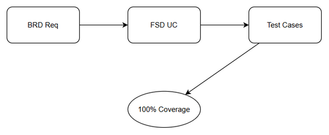
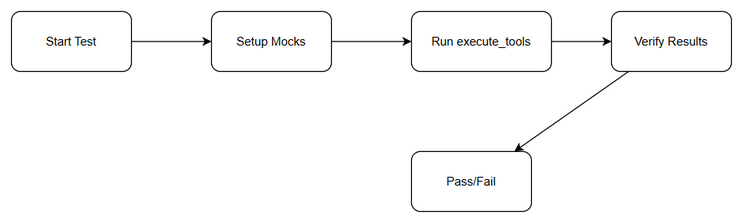

# Software Test Plan (STP)

## Chat Module — SA4E-204: Parallel Tool Execution in Chat Graph

---

## Document Information

| Field | Value |
|-------|-------|
| Jira Ticket | SA4E-204 |
| Title | Parallel Tool Execution in Chat Graph |
| Author | QA Agent |
| Version | 1.0 |
| Date | 2026-08-22 |
| Status | Draft |
| Related BRD | BRD-v1-SA4E-204.md |
| Related FSD | FSD-v1-SA4E-204.md |
| Related TDD | TDD-v1-SA4E-204.md |

---

## Author Tracking

| Role | Name - Position | Responsibility |
|------|-----------------|----------------|
| Author | QA Agent – QA Engineer | Create document |
| Peer Reviewer | TBD – TBD | Review document |

---

## Revision History

| Version | Date | Author | Changes |
|---------|------|--------|---------|
| 1.0 | 2026-08-22 | QA Agent | Initiate document — auto-generated from BRD, FSD, and TDD |

---

## Sign-Off

| Name | Signature and date |
|------|--------------------|
| | ☐ I agree and confirm the test plan in this STP |
| | ☐ I agree and confirm the test plan in this STP |

---

## 1. Introduction

### 1.1 Purpose
This Test Plan defines the testing strategy, scope, and approach for verifying SA4E-204: Parallel Tool Execution in Chat Graph. The feature upgrades the `execute_tools` node in the Chat Graph to execute independent tool calls concurrently, reducing latency while preserving result correctness, ordering, and backward compatibility.

### 1.2 Test Objectives
- Verify independent tool calls execute concurrently when parallel mode is enabled
- Validate results are correctly mapped to tool_call_id and aggregated in original order
- Ensure errors in one tool do not block independent parallel tools
- Verify sequential fallback when parallel toggle is disabled
- Confirm max parallelism limit is respected
- Validate backward compatibility with dependent tool chains
- Verify tool filtering remains enforced in parallel mode
- Ensure no regression to existing execute_tools behavior

### 1.3 References

| Document | Location |
|----------|----------|
| BRD | documents/SA4E-204/BRD.md |
| FSD | documents/SA4E-204/FSD.md |
| TDD | documents/SA4E-204/TDD.md |


*[Edit in draw.io](diagrams/test-coverage.drawio)*

---

## 2. Test Strategy

### 2.1 Test Levels

| Level | Scope | Responsibility | Tools |
|-------|-------|---------------|-------|
| Unit Testing | Individual functions/methods in chat-graph-nodes.ts | Developer + QA | Vitest |
| Integration Testing | execute_tools node with McpBridge, StreamHandler, approval gate | QA | Vitest |
| Property-Based Testing (PBT) | Generate random tool call sets to verify invariants | QA | fast-check + Vitest |
| E2E-API Testing | Full API call through Chat API Gateway to execute_tools | QA | Playwright + MCP client |
| System Testing (SIT) | End-to-end chat graph with parallel execution | QA Team | Manual + Vitest |
| User Acceptance Testing (UAT) | Business validation of latency reduction | BA + Business Users | Manual |

### 2.2 Test Types

| Type | Description | Applicable |
|------|-------------|------------|
| Functional Testing | Verify features work per FSD use cases UC-1, UC-2 | Yes |
| Regression Testing | Ensure existing sequential execution still works | Yes |
| Performance Testing | Verify response time reduction for independent tools | Yes |
| Security Testing | Verify tool filtering and approval gate still enforced | Yes |
| Non-Functional Testing | Configurable max parallelism, resource limits | Yes |

### 2.3 Test Approach
Test approach is risk-based and automation-first. Unit and integration tests are automated using Vitest. Critical parallel execution scenarios are covered by automated integration tests. Manual SIT covers latency observation and complex dependency scenarios. Feature toggle allows safe rollback to sequential execution.


*[Edit in draw.io](diagrams/test-execution-flow.drawio)*

### 2.4 Entry Criteria

| Level | Entry Criteria |
|-------|---------------|
| Integration | Code merged to feature branch, unit tests passing, BRD/FSD approved |
| SIT | Integration tests passed, test environment with CHAT_PARALLEL_ENABLED configurable, test data prepared |

### 2.5 Exit Criteria

| Level | Exit Criteria |
|-------|--------------|
| Integration | 100% of test cases in STC executed, 0 Critical defects, ≤2 Major open |
| SIT | All functional test cases passed, latency reduction observed for independent tools, no regression in sequential mode |

---

## 3. Test Scope

### 3.1 Features In Scope

| # | Feature / Story | Priority | FSD Reference | Test Type |
|---|----------------|----------|---------------|-----------|
| 1 | Parallel execution of independent tools | High | UC-1, BR-1 to BR-5 | Functional / Performance |
| 2 | Result aggregation with order preservation | High | UC-2, BR-6, BR-7 | Functional |
| 3 | Configurable max parallelism | Medium | BR-5 | Non-Functional |
| 4 | Sequential fallback when toggle disabled | High | AF-1 | Regression |
| 5 | Partial failure handling | High | AF-2, EF-3 | Functional |
| 6 | Tool filtering enforcement in parallel mode | Medium | SA4E-186 | Security |
| 7 | Backward compatibility with dependent tools | High | BR-4 | Regression |

### 3.2 Features Out of Scope

| # | Feature | Reason |
|---|---------|--------|
| 1 | Changes to tool definition schemas or MCP protocol | Out of scope per BRD |
| 2 | UI changes to chat interface | No UI specs |
| 3 | New tool execution ordering logic beyond parallelism | Out of scope per BRD |

---

## 4. Test Environment

### 4.1 Environment Requirements

| Environment | URL | Database | Purpose |
|-------------|-----|----------|---------|
| Dev | localhost:48721 | SQLite | Integration testing |
| SIT | extension dev workspace | In-memory | System integration testing |

### 4.2 Browser / Device Requirements
N/A — backend feature.

### 4.3 Test Data Requirements

| Data Type | Description | Source | Preparation |
|-----------|-------------|--------|-------------|
| Tool calls | Multiple independent tool calls with distinct tool_call_id | Synthetic test data | Create in test fixtures |
| Dependent tool calls | Chain with depends_on field | Synthetic | Create test fixtures |
| Agent config | toolPatterns for filtering | Mock config | Unit test mocks |

### 4.4 External Dependencies

| System | Dependency | Mock/Stub Available |
|--------|-----------|---------------------|
| MCP Bridge | Tool execution | Mock McpBridge in tests |
| Approval Gate | User approval for dangerous tools | Mock ToolApprovalGate |

---

## 5. Test Schedule

| Phase | Start Date | End Date | Duration | Milestone |
|-------|------------|----------|----------|-----------|
| Test Planning | 2026-08-22 | 2026-08-22 | 1 day | STP + STC approved |
| Test Execution | 2026-08-22 | 2026-08-22 | 1 day | Tests run |
| Defect Fix & Retest | 2026-08-22 | 2026-08-22 | 1 day | All defects fixed |
| Sign-off | 2026-08-22 | 2026-08-22 | 0 day | Testing phase done |

---

## 6. Resources & Responsibilities

| Role | Name | Responsibility |
|------|------|---------------|
| Test Lead | QA Agent | Test planning, coordination, reporting |
| QA Engineer | QA Agent | Test case design, execution, defect reporting |
| BA | BA Agent | Acceptance criteria clarification |
| Developer | DEV Agent | Bug fixing, unit test coverage |
| DevOps | N/A | Environment setup |

---

## 7. Risk & Mitigation

| # | Risk | Impact | Likelihood | Mitigation |
|---|------|--------|------------|------------|
| 1 | Race conditions in result aggregation | High | Medium | Deterministic mapping via tool_call_id, preserve order |
| 2 | Increased resource usage during parallel execution | Medium | Medium | Configurable max parallelism via env var |
| 3 | Breaking changes to existing sequential logic | High | Low | Feature toggle, backward compatible sequential path |
| 4 | Test data not representative of real tool latency | Medium | Medium | Use mocked delays in integration tests |

---

## 8. Defect Management

### 8.1 Severity Levels

| Severity | Definition | Example |
|----------|-----------|---------|
| Critical | System crash, data loss, security breach | tool results mixed up, wrong tool_call_id mapping |
| Major | Feature not working, workaround exists | Parallel mode never activates |
| Minor | UI issue, cosmetic defect | Log message formatting |
| Trivial | Typo, minor alignment issue | |

### 8.2 Priority Levels

| Priority | Definition | SLA (Fix Time) |
|----------|-----------|----------------|
| P1 | Must fix immediately | 4 hours |
| P2 | Must fix before release | 1 business day |
| P3 | Should fix if time permits | 3 business days |
| P4 | Nice to fix, can defer | Next release |

### 8.3 Defect Lifecycle

```
New → Open → In Progress → Fixed → Ready for Retest → Verified → Closed
                                                      → Reopened → In Progress
```

---

## 9. Test Metrics & Reporting

### 9.1 Metrics

| Metric | Formula | Target |
|--------|---------|--------|
| Test Execution Rate | Executed / Total × 100% | 100% |
| Pass Rate | Passed / Executed × 100% | ≥ 95% |
| Defect Density | Defects / Test Cases | ≤ 0.1 |
| Critical Defect Count | Count of Critical severity | 0 |
| Defect Fix Rate | Fixed / Total Defects × 100% | ≥ 90% |

### 9.2 Reporting Schedule

| Report | Frequency | Audience |
|--------|-----------|----------|
| Daily Test Status | Daily during SIT | Project team |
| Defect Summary | Daily | Dev team + PM |
| Test Completion Report | End of SIT | All stakeholders |

---

## 10. Appendix

### Glossary

| Term | Definition |
|------|------------|
| SIT | System Integration Testing |
| UAT | User Acceptance Testing |
| STP | Software Test Plan |
| STC | Software Test Cases |
| execute_tools | LangGraph node for tool dispatch |

### Assumptions
- Tools are stateless and safe to run in parallel
- Tool execution time dominates graph latency
- Feature flag CHAT_PARALLEL_ENABLED controls activation
