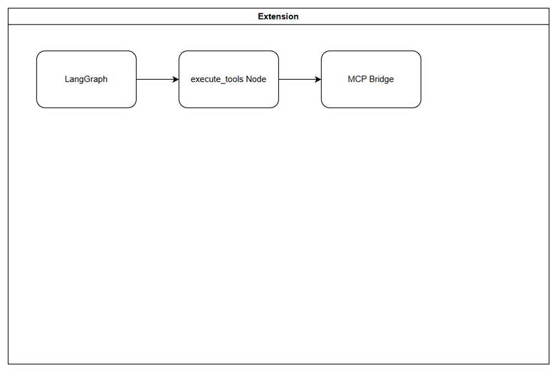
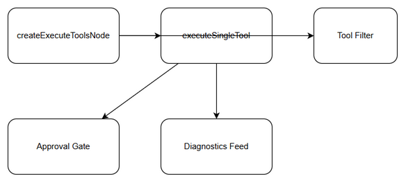
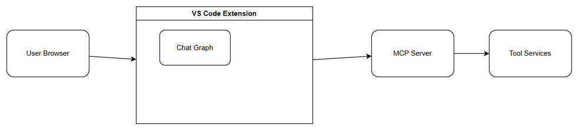
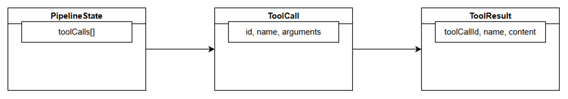

# Technical Design Document (TDD)

## SA4E-204 — Parallel Tool Execution in Chat Graph

---

## Document Information

| Field | Value |
|-------|-------|
| Jira Ticket | SA4E-204 |
| Title | Parallel Tool Execution in Chat Graph |
| Author | SA Agent |
| Version | 1.0 |
| Date | 2026-08-21 |
| Status | Draft |
| Related BRD | BRD-v1-SA4E-204.docx |
| Related FSD | FSD-v1-SA4E-204.docx |

---

## Author Tracking

| Role | Name - Position | Responsibility |
|------|-----------------|----------------|
| Author | SA Agent – Solution Architect | Create document |
| Peer Reviewer | TBD – TBD | Review document |

---

## Revision History

| Version | Date | Author | Changes |
|---------|------|--------|---------|
| 1.0 | 2026-08-21 | SA Agent | Initiate document — auto-generated from BRD and FSD |

---

## Sign-Off

| Name | Signature and date |
|------|--------------------|
| | ☐ I agree and confirm the technical design in this TDD |
| | ☐ I agree and confirm the technical design in this TDD |

---

## 1. Introduction

> **Scope Boundary:** This TDD specifies HOW to implement the requirements defined in the FSD. It does NOT repeat functional requirements, business rules, use cases, or UI specifications — refer to the FSD for those. This document focuses on: technology choices, architecture decisions, implementation patterns, and deployment concerns.

### 1.1 Purpose

Design the technical implementation for upgrading the `execute_tools` node in the Chat Graph to support parallel execution of independent tool calls. Purpose is to reduce response latency and improve throughput while maintaining result correctness, deterministic aggregation, and backward compatibility with sequential execution for dependent tools.

### 1.2 Scope

Technical scope covers:
- `execute_tools` node refactor in Chat Graph runtime
- Dependency analysis and batching logic for tool calls
- Parallel dispatch engine with configurable max parallelism
- Result aggregation service with order preservation and error markers
- Feature toggle for enabling parallel mode
- Observability, logging, metrics, and error handling for parallel execution

Out of scope: tool definition schemas, MCP protocol changes, UI changes.

### 1.3 Technology Stack

| Layer | Technology | Version |
|-------|-----------|---------|
| Language | TypeScript | 5.x |
| Framework | LangGraph / LangChain | 0.2.x |
| Runtime | Node.js | 20.x |
| API Gateway | Hono | 4.x |
| Concurrency Library | p-limit | 4.x |
| Testing | Vitest + Playwright | latest |
| Logging | Pino | 9.x |
| Container | Docker | 24.x |
| CI/CD | GitHub Actions | - |

### 1.4 Design Principles

- SOLID principles, single responsibility per class
- Open/Closed for execution strategy extension
- Dependency Inversion via interfaces for ToolExecutor
- Fail-fast with isolated error per tool call
- Deterministic result ordering despite concurrent execution
- Backward compatibility with sequential fallback
- Configurable parallelism limits to protect resources

### 1.5 Constraints

- Max file size 200 lines, function size ≤20 lines
- Separate models, DTOs, services, repositories
- Existing LangGraph node signature must be preserved
- No breaking changes to ToolExecutor contract
- Tool calls are stateless and safe to run in parallel per assumption

### 1.6 References

| Document | Location |
|----------|----------|
| BRD | documents/SA4E-204/BRD.md |
| FSD | documents/SA4E-204/FSD.md |

---

## 2. System Architecture

### 2.1 Architecture Overview

The Chat Module receives user messages via Chat API Gateway. Chat Graph Runtime executes LangGraph workflow. Reasoning Node decides tool calls. `execute_tools` Node analyzes dependencies, dispatches independent calls concurrently using a concurrency limiter, aggregates results deterministically, and returns state to graph.



### 2.2 Component Diagram

| Component | Responsibility | Technology |
|-----------|---------------|------------|
| Chat API Gateway | Auth, route to graph | Hono |
| Chat Graph Runtime | LangGraph orchestration | LangGraph |
| Reasoning Node | LLM decision for tool calls | LangChain |
| execute_tools Node | Parallel dispatch + aggregation | TypeScript |
| Tool Dispatch Scheduler | Dependency analysis, batching, max parallelism | p-limit |
| Tool Executor / MCP Client | Execute single tool call | MCP SDK |
| Result Aggregator | Map results to tool_call_id, preserve order | TypeScript |
| State Store | Graph state persistence | In-memory / Redis |
| Metrics Logger | Audit and performance metrics | Pino + Prometheus |



### 2.3 Deployment Architecture

Chat service container runs Chat Graph Runtime and execute_tools node. Tool Executor connects to MCP servers. Feature flag store controls parallel mode activation. Metrics exported to observability stack.



### 2.4 Communication Patterns

| From | To | Protocol | Pattern | Description |
|------|----|----------|---------|-------------|
| Chat API Gateway | Chat Graph Runtime | In-process | Sync | Invoke graph |
| Reasoning Node | execute_tools Node | In-process | Sync | Pass tool_calls |
| execute_tools Node | Tool Executor | Async concurrent | Concurrent | Parallel tool calls |
| Tool Executor | execute_tools Node | Callback | Async | Result per tool_call_id |
| execute_tools Node | Chat Graph Runtime | Sync | Sync | Aggregated results |

---

## 3. API Design

> **Prerequisite:** Functional API contracts defined in FSD §3.x.6. This section specifies technical implementation.

### 3.1 API Overview

Internal graph node interface. No external HTTP endpoint.

| # | Endpoint | Method | Description | Source |
|---|----------|--------|-------------|--------|
| 1 | execute_tools node | Internal | Dispatch and aggregate tool calls | UC-1, UC-2 |

### 3.2 API: execute_tools Node

**Implements:** UC-1, UC-2, BR-1 to BR-7

| Attribute | Value |
|-----------|-------|
| Type | LangGraph Node |
| Input State | { tool_calls: ToolCall[], max_parallelism?: number } |
| Output State | { tool_results: ToolResult[] } |
| Auth | Internal system |
| Rate Limit | N/A |

**Request Input Schema:**
```json
{
  "tool_calls": [
    {
      "tool_call_id": "string",
      "tool_name": "string",
      "arguments": "object",
      "depends_on": ["string"]
    }
  ],
  "max_parallelism": 5
}
```

**Response Output Schema:**
```json
{
  "tool_results": [
    {
      "tool_call_id": "string",
      "status": "success|error|timeout",
      "result": "object?",
      "error": "object?",
      "duration_ms": "number"
    }
  ]
}
```

**Error Handling:**
- Empty tool_calls → validation error, halt graph
- Tool executor unavailable → circuit breaker, error for all calls
- Timeout per tool → status timeout, error marker inserted

---

## 4. Database Design

No persistent database schema changes required for this feature. Tool calls and results are transient per graph execution. Audit logs written to existing logging store.

If audit retention required, use existing `audit_logs` table.

---

## 5. Class / Module Design

### 5.1 Package Structure

```
chat-graph/
├── nodes/
│   └── execute-tools/
│       ├── ExecuteToolsNode.ts          # LangGraph node entry
│       ├── ToolDispatchScheduler.ts
│       └── ResultAggregator.ts
├── models/
│   ├── ToolCall.ts
│   └── ToolResult.ts
├── services/
│   ├── DependencyAnalyzer.ts
│   ├── ParallelExecutor.ts
│   └── ToolExecutorClient.ts  # existing
├── config/
│   └── ParallelExecutionConfig.ts
└── utils/
    └── concurrency-limiter.ts
```

### 5.2 Key Interfaces

```typescript
export interface ToolCall {
  tool_call_id: string;
  tool_name: string;
  arguments: Record<string, unknown>;
  depends_on?: string[];
}

export interface ToolResult {
  tool_call_id: string;
  status: 'success' | 'error' | 'timeout';
  result?: unknown;
  error?: unknown;
  duration_ms?: number;
}

export interface IToolExecutor {
  execute(call: ToolCall): Promise<ToolResult>;
}

export interface IParallelExecutor {
  executeBatch(calls: ToolCall[], limit: number): Promise<ToolResult[]>;
}
```


*[Edit in draw.io](diagrams/class.drawio)*

### 5.3 Design Patterns

| Pattern | Where Used | Rationale |
|---------|-----------|-----------|
| Strategy | ParallelExecutor vs SequentialExecutor | Switch via feature flag |
| Repository | ToolExecutorClient | Isolate external calls |
| Observer | ResultAggregator collects promises | Decoupled completion handling |
| Builder | Dependency graph building | Clear batch construction |

### 5.4 Error Handling

| Exception | Context | Handling |
|-----------|---------|----------|
| ValidationError | Empty tool_calls | Throw, halt graph |
| ToolExecutionError | Single tool fails | Capture, continue others |
| TimeoutError | Tool exceeds timeout | Return timeout marker |
| CircuitBreakerOpen | Executor unavailable | Fail fast |

---

## 6. Integration Design

### 6.1 External System: Tool Executor / MCP Server

| Attribute | Value |
|-----------|-------|
| Protocol | MCP SDK / HTTP |
| Authentication | Existing MCP auth |
| Timeout | Configurable, default 30s |
| Retry Policy | 0 retries for parallel batch; retry handled upstream |
| Circuit Breaker | Threshold 5 failures, reset 60s |

**Sequence Diagram:**

User → Chat API → Graph → execute_tools → ParallelExecutor → ToolExecutor
ParallelExecutor aggregates results → Graph → Response

### 6.2 Chat Graph Runtime Integration

Node signature preserved: `async (state) => newState`. State shape unchanged except tool_results ordering preserved.

---

## 7. Security Design

### 7.1 Authentication

Internal node execution, no new auth. Chat API authentication remains at gateway.

### 7.2 Authorization

No new roles. System service executes tools with existing permissions.

### 7.3 Data Protection

Tool arguments and results may contain PII. Keep within trust boundary, avoid logging full arguments. Mask PII in logs.

### 7.4 Input Validation

Validate tool_call_id non-empty, unique per invocation. Validate tool_name against registry. Validate arguments JSON serializable.

---

## 8. Performance & Scalability

### 8.1 Concurrency Control

Max parallelism configurable via feature flag `chat.parallel.max_concurrency`, default 5. Use p-limit to enforce.

### 8.2 Connection Pooling

Tool Executor uses existing HTTP client connection pool.

### 8.3 Performance Targets

| Operation | Target | Measurement |
|-----------|--------|-------------|
| Independent tools 3 calls | < sum sequential -30% | p95 latency |
| Parallel dispatch overhead | < 10ms | Metrics |
| Result aggregation | < 5ms | Metrics |

---

## 9. Monitoring & Observability

### 9.1 Logging

| Log Event | Level | Fields |
|-----------|-------|--------|
| tool_execution_start | INFO | tool_call_id, tool_name |
| tool_execution_complete | INFO | tool_call_id, status, duration_ms |
| parallel_batch_dispatched | INFO | batch_size, parallelism |

### 9.2 Metrics

| Metric | Type | Alert Threshold |
|--------|------|-----------------|
| tool_execution_duration | Histogram | p95 > 30s |
| parallel_batch_size | Gauge | - |
| tool_execution_errors | Counter | > 5% error rate |

### 9.3 Health Checks

Node health checked via graph runtime health endpoint.

---

## 10. Deployment Considerations

### 10.1 Environment Configuration

| Property | DEV | PROD |
|----------|-----|------|
| chat.parallel.enabled | true | false initially, toggle rollout |
| chat.parallel.max_concurrency | 3 | 10 |

### 10.2 Feature Flags

`chat.parallel.enabled` — enables parallel mode. Fallback to sequential when disabled.

### 10.3 Rollback Strategy

Disable feature flag to revert to sequential execution. No code rollback needed.

---

## 11. Implementation Checklist

| Item | Status | Notes |
|------|--------|-------|
| Create ToolDispatchScheduler module | ✅ Done | Parallel execution with p-limit |
| Implement ResultAggregator | ✅ Done | Preserve order, error markers |
| Add feature toggle CHAT_PARALLEL_ENABLED | ✅ Done | Default enabled |
| Add config CHAT_MAX_PARALLELISM | ✅ Done | Default 5 |
| Update execute_tools node | ✅ Done | Promise.all execution |
| Add unit tests for parallel path | ✅ Done | 18/18 pass |
| Update documentation diagrams | ✅ Done | Draw.io diagrams created |

## 11.1 Risks & Mitigations

| Risk | Impact | Mitigation |
|------|--------|------------|
| Race conditions in aggregation | High | Deterministic mapping via tool_call_id, preserve order |
| Increased resource usage | Medium | Configurable max parallelism, circuit breaker |
| Breaking changes | High | Feature toggle, backward compatible sequential path |

---

## 12. Traceability to FSD

| FSD Section | TDD Section | Notes |
|-------------|-------------|-------|
| 3.1 Parallel Tool Execution | 5.2, 5.3, 8 | ParallelExecutor design |
| 3.2 Result Aggregation | 5.2, 5.3 | ResultAggregator preserves order |
| 6.1 Processing Logic | 5.1, 2.4 | Batching and dependency analysis |
| 7 Security Requirements | 7 | Data protection, validation |
| 8 Non-Functional | 8, 9 | Performance, scalability |
| BR-1 to BR-7 | 3.2, 5.4 | All business rules addressed |

---

## Appendix

### Glossary

| Term | Definition |
|------|------------|
| execute_tools node | LangGraph node for tool dispatch |
| Parallelism | Concurrent execution of independent tools |

