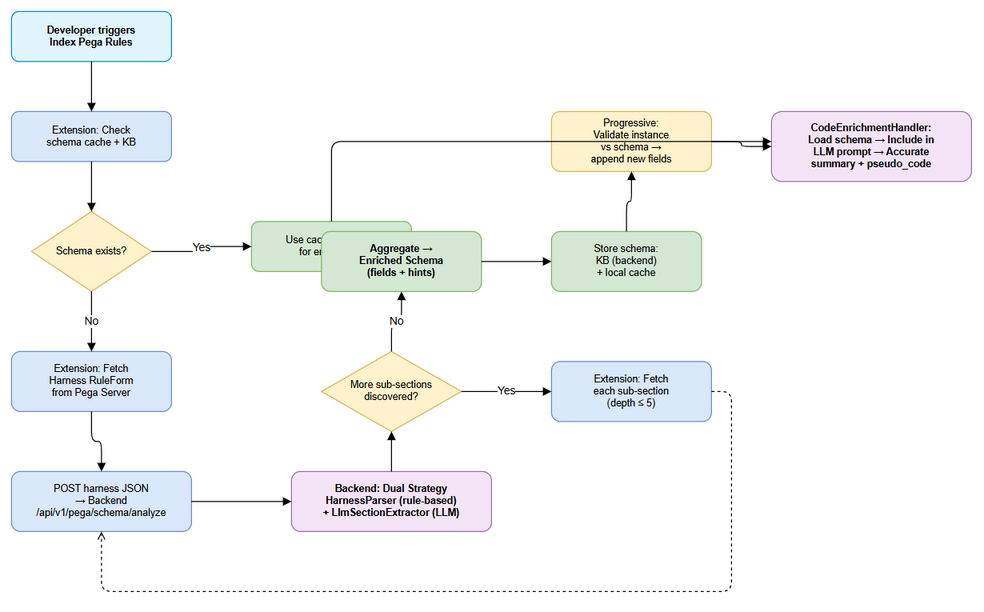

# Business Requirements Document (BRD)

## SDLC Agents 4 Enterprise — SA4E-214: Extension-driven Schema Creation for Pega Rule Types — On-the-fly LLM-enriched schemas

---

## Document Information

| Field | Value |
|-------|-------|
| Jira Ticket | SA4E-214 |
| Title | Extension-driven Schema Creation for Pega Rule Types — On-the-fly LLM-enriched schemas |
| Author | BA Agent |
| Version | 1.0 |
| Date | 2025-01-27 |
| Status | Draft |
| Related Ticket | SA4E-93 (Pega Rule Schema Generator — prior implementation) |

---

## Revision History

| Version | Date | Author | Changes |
|---------|------|--------|---------|
| 1.0 | 2025-01-27 | BA Agent | Initial BRD — auto-generated from Jira ticket SA4E-214 |

---

## 1. Introduction

### 1.1 Scope

Implement an **on-the-fly schema creation mechanism** triggered automatically when the VS Code Extension encounters a Pega rule type for the first time during indexing. The schema provides semantic context (identity fields, logic paths, extraction hints) to improve LLM enrichment accuracy for summary and pseudo_code generation.

This ticket covers three phases:
- **Phase A**: Extension-driven schema creation (recursive harness analysis)
- **Phase B**: Progressive schema enrichment (field discovery from rule instances)
- **Phase C**: Schema-guided LLM enrichment (backend prompt enhancement)

### 1.2 Out of Scope

- Manual "Index Pega Rule Schema" command (removed — all on-the-fly)
- Browser-based harness inspection (PegaBrowserInspector — superseded by API-only approach)
- Schema creation for non-Pega rule types
- Changes to the Pega server-side harness rendering

### 1.3 Preliminary Requirements

| # | Prerequisite | Status |
|---|-------------|--------|
| 1 | Backend API endpoint `/api/v1/pega/schema/analyze` exists | Partially done (route exists in `pega-schema-routes.ts`) |
| 2 | `HarnessParser` class with section discovery | Done (SA4E-95) |
| 3 | `LlmSectionExtractor` for LLM-based section discovery | Done (SA4E-95) |
| 4 | `CodeEnrichmentHandler` with strategy routing | Done (SA4E-107, SA4E-209) |
| 5 | Extension has Pega HTTP client for server communication | Done (`PegaHttpClient`) |
| 6 | Backend KB (mem_ingest/mem_search) operational | Done |

---

## 2. Business Requirements

### 2.1 High Level Process Map

The system implements a **two-tier enrichment pipeline**:

1. **Schema Tier (Extension → Backend)**: When a new rule type is encountered, the extension fetches the harness RuleForm from Pega server, sends it to the backend for dual-strategy analysis (rule-based + LLM), recursively discovers sub-sections, and aggregates the result into a complete enriched schema stored in KB.

2. **Enrichment Tier (Backend only)**: When any Pega rule is enriched via LLM, the backend loads the corresponding enriched schema from KB and includes it as context in the prompt, producing accurate summary and pseudo_code.

### 2.2 List of User Stories / Use Cases

| # | Story / Use Case | Priority | Source |
|---|------------------|----------|--------|
| 1 | As a developer, I want schemas created automatically when I first index a Pega rule type, so I don't need a separate manual command | MUST HAVE | SA4E-214 |
| 2 | As the LLM enrichment system, I want schema context in my prompt so I produce accurate pseudo_code for Pega flows | MUST HAVE | SA4E-214 |
| 3 | As a developer, I want the schema to grow progressively when new fields are discovered in rule instances | SHOULD HAVE | SA4E-214 |
| 4 | As a developer, I want the HarnessParser to correctly handle stream-rendered harnesses (pySourceStream) | MUST HAVE | SA4E-214 |
| 5 | As the system, I want recursive section discovery with loop protection (visited set + max depth 5) | MUST HAVE | SA4E-214 |
| 6 | As a developer, I want schema operations to be transparent (no user interaction required beyond initial indexing) | MUST HAVE | SA4E-214 |

---

### 2.3 Details of User Stories

---

#### Business Flow



**Step 1:** Developer triggers "Index Pega Rules" (existing BFS indexer) OR system encounters a new rule type during normal indexing.

**Step 2:** Extension checks local cache + KB for an existing schema for that rule type.

**Step 3:** If no schema exists:
- Extension downloads the Harness RuleForm JSON for that rule type from Pega server
- Extension POSTs harness JSON to Backend `/api/v1/pega/schema/analyze`

**Step 4:** Backend applies dual-strategy analysis:
- **Strategy 1**: HarnessParser (rule-based recursive descent) — fast, deterministic
- **Strategy 2**: LlmSectionExtractor (LLM-based) — catches what rule-based misses (stream-rendered harnesses)

**Step 5:** Backend returns discovered sections + fields. Extension recursively downloads each discovered sub-section and repeats Steps 3-4 (max depth 5, visited set prevents loops).

**Step 6:** Extension aggregates all discovered fields into an enriched schema object containing: identity fields, logic fields, connectivity metadata, extraction hints.

**Step 7:** Schema is stored in KB (backend) + local disk cache (extension).

**Step 8:** When subsequent rules of the same type are indexed, the schema is loaded and used as LLM prompt context for enrichment.

**Step 9 (Progressive):** Each rule instance is validated against the schema. Newly discovered fields are appended to the schema and the update is persisted.

> **Constraint**: Backend has NO internet access. All Pega server communication happens from the Extension side only.

---

#### STORY 1: On-the-fly Schema Creation

> As a developer, I want schemas created automatically when I first index a Pega rule type, so I don't need a separate manual command.

**Requirement Details:**

1. The Extension MUST detect when a rule type is being indexed for the first time (no cached schema)
2. Schema creation MUST be triggered transparently during the normal indexing flow (BFS indexer)
3. The process MUST complete without user intervention (no prompts, no confirmations)
4. If schema creation fails (network error, LLM timeout), indexing MUST continue without schema — log warning and enqueue retry

**Acceptance Criteria:**

1. Given a Pega workspace with no existing schemas, when the BFS indexer encounters `Rule-Obj-Flow` for the first time, then a schema for `Rule-Obj-Flow` is automatically generated and stored in KB
2. Given schema creation in progress, the user sees progress messages in the output channel but NO modal dialogs
3. Given a network failure fetching a sub-section, the system skips that section, logs a warning, and continues with partial schema
4. Given an LLM timeout (>30s), the system falls back to rule-based-only analysis for that section

---

#### STORY 2: Schema-guided LLM Enrichment

> As the LLM enrichment system, I want schema context in my prompt so I produce accurate pseudo_code for Pega flows.

**Requirement Details:**

1. `CodeEnrichmentHandler` MUST load the enriched schema from KB before building the LLM prompt
2. `CodeEnrichmentPromptBuilder` MUST include schema fields (logic fields, extraction hints) in the PEGA_SUMMARY prompt template
3. The enrichment MUST produce pseudo_code that reflects the actual flow diagram structure (steps, connectors, decision points) rather than hallucinated logic

**Data Fields:**

| Field | Type | Required | Description | Example |
|-------|------|----------|-------------|---------|
| identity_fields | object | Yes | Fields that identify the rule (class, name, version) | `{ "pyClassName": "Work-Claim", "pyRuleName": "ProcessClaim" }` |
| logic_fields | string[] | Yes | Fields containing business logic | `["pyFlowSteps", "pyConnectors", "pyDecisionTable"]` |
| connectivity | object | No | References to other rules | `{ "calls": ["CheckEligibility"], "uses": ["D_ClaimData"] }` |
| extraction_hints | object | Yes | Guidance for LLM on how to interpret logic | `{ "step_field": "pyFlowSteps[].pyName", "condition_field": "pyConnectors[].pyCondition" }` |

**Acceptance Criteria:**

1. Given a `pega_flow` rule with schema context, the LLM produces pseudo_code listing each flow step in correct execution order
2. Given a `pega_flow` rule WITHOUT schema context (schema creation failed), the LLM still produces output but with a warning comment `// Schema unavailable — accuracy may be reduced`
3. Given schema includes `logic_fields: ["pyFlowSteps"]`, the prompt builder includes a section: "LOGIC FIELDS: Extract logic from pyFlowSteps..."

---

#### STORY 3: Progressive Schema Enrichment

> As a developer, I want the schema to grow progressively when new fields are discovered in rule instances.

**Requirement Details:**

1. After schema creation, each subsequent rule instance of the same type is validated against the schema
2. Fields present in the rule instance but absent from the schema are detected and appended
3. The schema is versioned: `schema_version` increments on each field addition
4. Updates are persisted: local cache + KB (backend POST)
5. Progressive updates MUST NOT remove existing fields — append only

**Acceptance Criteria:**

1. Given schema for `Rule-Obj-Activity` has 15 fields, and a new instance has a field `pyCustomField` not in schema, then schema is updated to 16 fields
2. Given schema update, the `schema_version` increments from N to N+1
3. Given 10 instances processed, if no new fields are discovered, no update is triggered (no unnecessary writes)

---

#### STORY 4: HarnessParser Stream-Rendered Harness Fix

> As a developer, I want the HarnessParser to correctly handle stream-rendered harnesses (pySourceStream).

**Requirement Details:**

1. Current bug: HarnessParser cannot extract sections from harnesses rendered via `pySourceStream` — produces empty output (coverage=0, properties={})
2. Fix: When `pySourceStream` is detected and standard section discovery fails, fallback to `LlmSectionExtractor` which can parse arbitrary JSON structures
3. The dual-strategy approach: try rule-based first → if empty → try LLM-based → merge results

**Acceptance Criteria:**

1. Given a stream-rendered harness JSON (contains `pySourceStream`, no `pySections`), the parser produces non-empty output with ≥1 discovered section
2. Given a standard harness JSON (has `pySections`), the rule-based parser handles it directly without LLM fallback
3. Given both strategies fail (malformed JSON), the system returns a minimal schema with `coverage: 0` and logs an error

---

#### STORY 5: Recursive Section Discovery with Loop Protection

> As the system, I want recursive section discovery with loop protection (visited set + max depth 5).

**Requirement Details:**

1. The Extension orchestrates recursive section discovery:
   - Start with root harness → discover sections
   - For each discovered section → fetch from Pega → analyze → discover sub-sections
   - Repeat until no new sections OR max depth reached
2. Loop protection: visited set (prevent re-analyzing same section)
3. Max depth: 5 levels (configurable)
4. Circuit breaker: if >20 sections discovered at a single depth level, stop expanding (likely template explosion)

**Acceptance Criteria:**

1. Given a harness with 3-level section hierarchy, all 3 levels are discovered
2. Given a circular reference (Section A → Section B → Section A), the system does not loop — detected via visited set
3. Given a harness with depth > 5, levels beyond 5 are not explored
4. Given a template explosion (>20 sections at one level), expansion stops with a warning log

---

#### STORY 6: Transparent Operation

> As a developer, I want schema operations to be transparent (no user interaction required beyond initial indexing).

**Requirement Details:**

1. No separate "Index Pega Rule Schema" command — removed from command palette
2. Schema creation is embedded within the existing BFS indexing flow
3. Progress is reported via OutputChannel (non-blocking)
4. Errors are logged but do not interrupt the indexing flow
5. Schema status visible in the existing indexing summary report

**Acceptance Criteria:**

1. Given the command palette, there is NO "Index Pega Rule Schema" command
2. Given indexing completes, the summary includes: `📐 Schemas: {N} generated, {M} from cache, {K} failed`
3. Given a schema generation failure, the overall indexing still reports success (schema failure is non-fatal)

---

## 3. Dependencies

| Dependency | Type | Related Ticket | Description |
|------------|------|----------------|-------------|
| Pega Server API | External | - | Extension requires access to Pega REST API (`/rules/query`, `/rules/listRules`) to fetch harness RuleForms |
| Backend LLM Service | System | SA4E-107 | LlmSectionExtractor requires local LLM (LM Studio/Ollama) for section discovery |
| Knowledge Base (SQLite/Postgres) | System | - | Schema storage and retrieval |
| HarnessParser (SA4E-95) | System | SA4E-95 | Existing rule-based parser — needs stream-rendered harness fix |
| CodeEnrichmentHandler (SA4E-107) | System | SA4E-107, SA4E-209 | Existing enrichment handler — needs schema context injection |
| PegaBfsIndexer (SA4E-156) | System | SA4E-156 | BFS indexing loop — trigger point for on-the-fly schema creation |

---

## 4. Stakeholders

| Role | Name / Team | Responsibility |
|------|-------------|----------------|
| Developer | Extension team | Implement PegaSchemaOrchestrator in extension |
| Developer | Backend team | Fix HarnessParser, enhance CodeEnrichmentPromptBuilder |
| Product Owner | - | Accept/reject enrichment quality improvements |

---

## 5. Risks and Assumptions

### 5.1 Risks

| Risk | Impact | Likelihood | Mitigation |
|------|--------|------------|------------|
| LLM timeout (>30s) blocks indexing | High | Medium | Async schema creation; fallback to rule-based only; 30s hard timeout |
| Recursive section discovery creates too many API calls | Medium | Medium | Max depth 5, circuit breaker at 20 sections/level, rate limiting |
| Stream-rendered harnesses have unpredictable structure | High | High | Dual-strategy (rule-based + LLM); graceful degradation to empty schema |
| Schema drift (progressive updates create inconsistencies) | Medium | Low | Append-only policy; schema versioning; periodic full regeneration option |
| Pega server unreachable during indexing | Medium | Low | Schema creation is non-fatal; continue indexing without schema |

### 5.2 Assumptions

- Backend LLM (LM Studio/Ollama) is available and responding within 30s
- Pega server harness RuleForm JSON structure is consistent across versions (8.x)
- Extension has valid Pega credentials configured
- KB backend is available for schema storage/retrieval
- Existing BFS indexer flow provides hook points for schema creation

---

## 6. Non-Functional Requirements

| Category | Requirement | Details |
|----------|-------------|---------|
| Performance | Schema creation ≤ 60s per rule type | Including all recursive section fetches + LLM calls |
| Performance | LLM call timeout | 30s hard timeout per LLM call; fallback to rule-based |
| Performance | Progressive validation ≤ 50ms per rule instance | Simple field comparison, no LLM involved |
| Reliability | Indexing continues on schema failure | Schema creation is non-fatal; log and continue |
| Reliability | Infinite loop protection | Visited set + max depth 5 + circuit breaker (20 sections/level) |
| Scalability | Support ≥50 rule types | Schema cache prevents re-generation |
| Storage | Schema size ≤ 50KB per rule type | Enriched schema with fields + hints |
| Security | No credentials in schema content | Schemas contain structure only, never auth data |

---

## 7. Related Tickets

| Ticket Key | Summary | Status | Type | Relationship |
|------------|---------|--------|------|--------------|
| SA4E-214 | Extension-driven Schema Creation for Pega Rule Types | In Progress | Story | Main ticket |
| SA4E-93 | Pega Rule Schema Generator | To Do | Story | Prior art — batch schema generation |
| SA4E-95 | HarnessParser implementation | Done | Story | Prerequisite — parser exists |
| SA4E-107 | CodeEnrichmentHandler + LLM wiring | Done | Story | Prerequisite — enrichment pipeline |
| SA4E-156 | PegaBfsIndexer | Done | Story | Integration point — BFS loop |
| SA4E-209 | TaskWorker delegation fix | Done | Bug | Prerequisite — delegation works |

---

## 8. Appendix

### Architecture Constraint: Backend Cannot Fetch from Pega

```
┌─────────────┐        ┌──────────────┐        ┌─────────────┐
│ Pega Server │◄───────│  Extension   │───────►│   Backend   │
│  (harness)  │  HTTP  │ (orchestrate)│  HTTP  │ (analyze +  │
│             │        │              │        │  store KB)  │
└─────────────┘        └──────────────┘        └─────────────┘
      ▲                       │                       │
      │  Only Extension       │  Sends harness JSON   │
      │  has network access   │  to backend for       │
      │  to Pega server       │  analysis             │
      └───────────────────────┘                       │
                                                      ▼
                                              ┌─────────────┐
                                              │ KB (SQLite)  │
                                              │ Schema store │
                                              └─────────────┘
```

### Glossary

| Term | Definition |
|------|------------|
| Harness | A Pega UI rule that defines the layout and sections of a work object form |
| RuleForm | A specific harness that renders the editing interface for a rule type |
| Section | A reusable UI component within a harness, containing fields and sub-sections |
| Schema | A structured description of a rule type's fields, their semantics, and extraction hints |
| Progressive Enrichment | Incrementally adding newly discovered fields to an existing schema |
| Stream-rendered | Harnesses using `pySourceStream` instead of `pySections` for section hierarchy |
| Dual-strategy | Using both rule-based (HarnessParser) and LLM-based (LlmSectionExtractor) analysis |

### Diagram Index

| # | Diagram | Image | Source (editable) |
|---|---------|-------|-------------------|
| 1 | Business Flow | [business-flow.png](diagrams/business-flow.png) | [business-flow.drawio](diagrams/business-flow.drawio) |
| 2 | Use Case Diagram | [use-case.png](diagrams/use-case.png) | [use-case.drawio](diagrams/use-case.drawio) |
