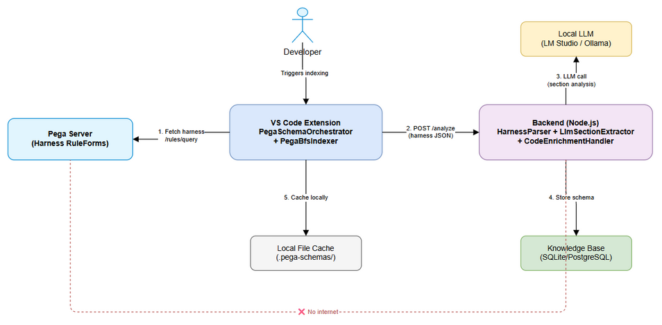
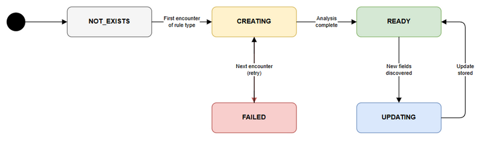
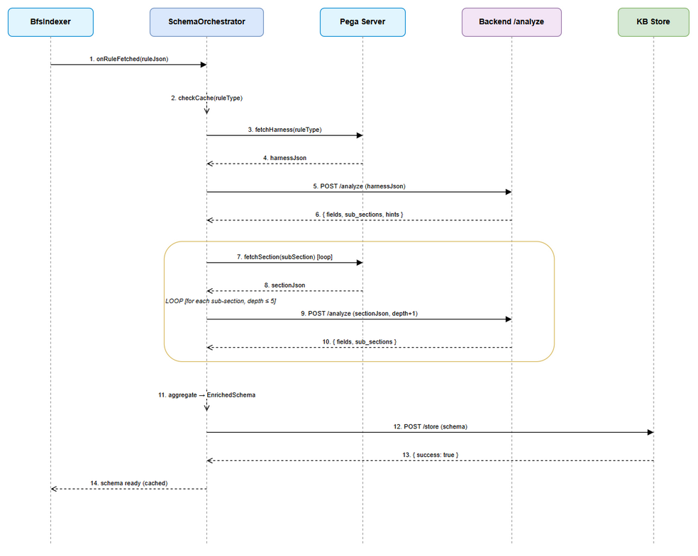
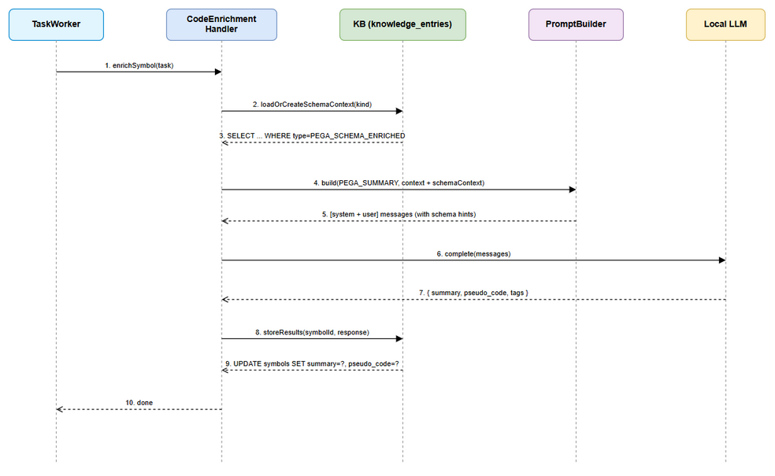

# Functional Specification Document (FSD)

## SDLC Agents 4 Enterprise — SA4E-214: Extension-driven Schema Creation for Pega Rule Types

---

## Document Information

| Field | Value |
|-------|-------|
| Jira Ticket | SA4E-214 |
| Title | Extension-driven Schema Creation for Pega Rule Types — On-the-fly LLM-enriched schemas |
| Related BRD | BRD-v1-SA4E-214.docx |
| Author | BA Agent + TA Agent |
| Version | 1.0 |
| Date | 2025-01-27 |
| Status | Draft |

---

## Revision History

| Version | Date | Author | Changes |
|---------|------|--------|---------|
| 1.0 | 2025-01-27 | BA + TA | Initial FSD — BA draft + TA enrichment |

---

## 1. System Context



The system spans two runtime environments:
- **Extension (VS Code/Kiro)**: Has internet access to Pega server. Orchestrates schema creation by fetching harness JSON and driving recursive section discovery.
- **Backend (Node.js)**: No internet access. Performs analysis (HarnessParser + LLM), stores schemas in KB, includes schema context in enrichment prompts.

---

## 2. Use Cases

### UC-01: On-the-fly Schema Creation

| Field | Value |
|-------|-------|
| ID | UC-01 |
| Actor | PegaBfsIndexer (Extension) |
| Trigger | First encounter of a rule type during BFS indexing |
| Precondition | No enriched schema exists in KB or local cache for this rule type |
| Postcondition | Enriched schema stored in KB + local file cache |

**Main Flow:**

| Step | Action |
|------|--------|
| 1 | BFS indexer fetches a rule → extracts `pxObjClass` |
| 2 | PegaSchemaOrchestrator checks local cache for schema of this rule type |
| 3 | If cache miss → query backend KB (`GET /api/v1/pega/schema/find?ruleType={type}`) |
| 4 | If KB miss → orchestrator downloads Harness RuleForm from Pega server |
| 5 | POST harness JSON to Backend `POST /api/v1/pega/schema/analyze` |
| 6 | Backend returns: discovered sections + fields + extraction hints |
| 7 | For each discovered sub-section: fetch from Pega → POST to analyze (recursive, max depth 5) |
| 8 | Aggregate all discovered fields → build enriched schema object |
| 9 | POST enriched schema to Backend `POST /api/v1/pega/schema/store` |
| 10 | Save enriched schema to local file cache |

**Alternative Flow:**

| Alt | Condition | Action |
|-----|-----------|--------|
| 4a | Pega server unreachable | Log warning, continue indexing without schema |
| 5a | Backend returns empty (stream-rendered harness) | Backend auto-triggers LLM fallback (dual-strategy) |
| 6a | LLM timeout (>30s) | Backend returns rule-based results only |
| 7a | Circular reference detected | Skip section (visited set), continue |
| 7b | Max depth 5 reached | Stop recursion at this branch |
| 7c | >20 sections at one level | Circuit breaker — stop expanding, log warning |

**Exception Flow:**

| Exc | Condition | Action |
|-----|-----------|--------|
| E1 | Backend API unreachable | Log error, continue indexing (schema creation deferred) |
| E2 | Invalid harness JSON (malformed) | Return minimal schema (coverage=0), log error |

---

### UC-02: Progressive Schema Enrichment

| Field | Value |
|-------|-------|
| ID | UC-02 |
| Actor | PegaBfsIndexer (Extension) |
| Trigger | Rule instance indexed for a type that already has a schema |
| Precondition | Enriched schema exists in cache/KB for this rule type |
| Postcondition | Schema updated if new fields discovered |

**Main Flow:**

| Step | Action |
|------|--------|
| 1 | BFS indexer fetches rule instance → load schema from cache |
| 2 | SchemaValidator compares rule JSON keys against schema `known_fields` |
| 3 | If new fields found → create field descriptors |
| 4 | Append new fields to schema, increment `schema_version` |
| 5 | Update local cache file |
| 6 | POST update to Backend `PATCH /api/v1/pega/schema/update` |

**Alternative Flow:**

| Alt | Condition | Action |
|-----|-----------|--------|
| 2a | No new fields found | No action — skip update (avoid unnecessary writes) |
| 6a | Backend unavailable | Queue update for retry, local cache is authoritative |

---

### UC-03: Schema-guided LLM Enrichment

| Field | Value |
|-------|-------|
| ID | UC-03 |
| Actor | CodeEnrichmentHandler (Backend) |
| Trigger | CODE_ENRICHMENT task queued for a Pega rule |
| Precondition | Task payload contains symbolKind with `pega_*` prefix |
| Postcondition | Symbol enriched with schema-guided summary + pseudo_code |

**Main Flow:**

| Step | Action |
|------|--------|
| 1 | TaskWorker pops task → delegates to CodeEnrichmentHandler |
| 2 | Handler detects PEGA_SUMMARY strategy |
| 3 | `loadOrCreateSchemaContext()` → query KB for enriched schema |
| 4 | Schema found → inject into `SymbolContext.schemaContext` |
| 5 | PromptBuilder includes schema context section in user prompt |
| 6 | LLM returns structured JSON with accurate pseudo_code |
| 7 | Store results in `symbols` table |

**Alternative Flow:**

| Alt | Condition | Action |
|-----|-----------|--------|
| 3a | Schema not in KB | Attempt on-the-fly creation from rule body (existing flow) |
| 3b | On-the-fly also fails | Continue without schema — add comment in pseudo_code |

---

### UC-04: Stream-rendered Harness Handling

| Field | Value |
|-------|-------|
| ID | UC-04 |
| Actor | HarnessParser (Backend) |
| Trigger | Backend receives harness JSON with `pySourceStream` instead of `pySections` |
| Precondition | Standard section discovery produces empty results |
| Postcondition | Sections discovered via LLM fallback |

**Main Flow:**

| Step | Action |
|------|--------|
| 1 | HarnessParser attempts standard recursive descent on `pySections` |
| 2 | Result: 0 fields, 0 sections (stream-rendered) |
| 3 | Parser detects empty result + presence of `pySourceStream` |
| 4 | Delegates to LlmSectionExtractor with raw JSON |
| 5 | LLM returns: section names, field candidates, structure hints |
| 6 | Parser merges LLM results into ParsedHarness IR |
| 7 | Returns enriched result to caller |

---

## 3. Business Rules

| ID | Rule | Enforcement |
|----|------|-------------|
| BR-01 | Schema creation triggers once per rule type (not per instance) | PegaSchemaOrchestrator checks cache before starting |
| BR-02 | Recursive section discovery max depth = 5 | Depth counter in orchestrator loop |
| BR-03 | Visited set prevents circular references | Set<string> tracking analyzed section names |
| BR-04 | Circuit breaker: >20 sections at one level → stop expanding | Counter per depth level |
| BR-05 | LLM timeout = 30 seconds per call | AbortController timeout in LlmSectionExtractor |
| BR-06 | Schema creation is non-fatal (must not block indexing) | try/catch in orchestrator, log + continue |
| BR-07 | Progressive enrichment is append-only (never remove fields) | SchemaValidator only adds, never deletes |
| BR-08 | Schema versioning: version increments on each field addition | `schema_version` field in schema object |
| BR-09 | Backend cannot reach Pega server | All Pega HTTP calls in extension only |
| BR-10 | Dual-strategy: rule-based first, LLM fallback if empty | HarnessParser checks result before invoking LLM |
| BR-11 | No separate command — schema creation embedded in BFS flow | Remove command from palette, trigger from indexer |
| BR-12 | Performance: total schema creation ≤ 60s per rule type | Timeout on orchestrator-level, partial results OK |

---

## 4. Data Specifications

### 4.1 Enriched Schema Object

```typescript
interface EnrichedSchema {
  /** Pega rule class (e.g., "Rule-Obj-Flow") */
  rule_type: string;
  /** Schema version — increments on progressive updates */
  schema_version: number;
  /** Timestamp of creation */
  created_at: string;
  /** Timestamp of last update */
  updated_at: string;
  /** Fields that identify the rule (class, name, version) */
  identity_fields: Record<string, FieldDescriptor>;
  /** Fields containing business logic (steps, conditions) */
  logic_fields: Record<string, FieldDescriptor>;
  /** Fields describing connections to other rules */
  connectivity_fields: Record<string, FieldDescriptor>;
  /** Hints for LLM on how to extract logic from the rule */
  extraction_hints: ExtractionHints;
  /** All known field paths discovered so far */
  known_fields: string[];
  /** Analysis coverage (0-100) */
  coverage: number;
  /** Sections discovered in harness hierarchy */
  discovered_sections: string[];
}

interface FieldDescriptor {
  /** JSON path in rule instance */
  path: string;
  /** Semantic category */
  category: 'identity' | 'logic' | 'connectivity' | 'metadata' | 'presentation';
  /** Data type */
  type: 'string' | 'number' | 'boolean' | 'array' | 'object';
  /** Human-readable description */
  description: string;
  /** Whether this field is typically populated */
  frequency: 'always' | 'common' | 'rare';
}

interface ExtractionHints {
  /** Primary field containing main logic (e.g., "pyFlowSteps" for flows) */
  primary_logic_field: string;
  /** How to interpret the logic structure */
  logic_structure: 'sequential_steps' | 'decision_tree' | 'expression_list' | 'key_value_map';
  /** Fields to include in pseudo_code generation */
  pseudo_code_sources: string[];
  /** Fields to include in summary generation */
  summary_sources: string[];
}
```

### 4.2 Schema Analysis Request/Response

**Request: `POST /api/v1/pega/schema/analyze`**

```typescript
interface SchemaAnalyzeRequest {
  /** Raw harness/section JSON from Pega server */
  harnessJson: Record<string, unknown>;
  /** Rule type being analyzed */
  ruleType: string;
  /** Analysis depth (for recursive tracking) */
  depth?: number;
}
```

**Response:**

```typescript
interface SchemaAnalyzeResponse {
  /** Discovered fields in this section */
  fields: FieldDescriptor[];
  /** Sub-section names discovered (caller fetches these next) */
  sub_sections: string[];
  /** Coverage of rule-based analysis (0-100) */
  rule_based_coverage: number;
  /** Whether LLM fallback was triggered */
  llm_fallback_used: boolean;
  /** Extraction hints derived from analysis */
  hints: Partial<ExtractionHints>;
}
```

### 4.3 Schema Store/Find/Update API

**Store: `POST /api/v1/pega/schema/store`**

```typescript
interface SchemaStoreRequest {
  schema: EnrichedSchema;
}
// Response: { success: true, id: number }
```

**Find: `GET /api/v1/pega/schema/find?ruleType={type}`**

```typescript
// Response: EnrichedSchema | null (404 if not found)
```

**Update: `PATCH /api/v1/pega/schema/update`**

```typescript
interface SchemaUpdateRequest {
  ruleType: string;
  new_fields: FieldDescriptor[];
}
// Response: { success: true, new_version: number }
```

### 4.4 Local File Cache Structure

```
.pega-schemas/
├── Rule-Obj-Flow.schema.json
├── Rule-Obj-Activity.schema.json
├── Rule-Obj-Model.schema.json
└── ...
```

Each file contains the full `EnrichedSchema` JSON. Cache is read-first, KB is authoritative.

---

## 5. API Specifications

### 5.1 Backend API Endpoints

| Method | Path | Description | Auth |
|--------|------|-------------|------|
| POST | `/api/v1/pega/schema/analyze` | Analyze harness/section JSON → return fields + sub-sections | None (local only) |
| POST | `/api/v1/pega/schema/store` | Store completed enriched schema in KB | None (local only) |
| GET | `/api/v1/pega/schema/find` | Retrieve enriched schema by rule type | None (local only) |
| PATCH | `/api/v1/pega/schema/update` | Progressive update — append new fields | None (local only) |

### 5.2 Existing API Changes

| Method | Path | Change |
|--------|------|--------|
| POST | `/api/v1/pega/schema/generate` | Keep for backward compat — internally calls analyze + aggregate |

---

## 6. Integration Requirements

### 6.1 Extension → Pega Server

| Operation | API | Method |
|-----------|-----|--------|
| Fetch Harness RuleForm | `/rules/query` | POST (pxObjClass=Rule-HTML-Harness) |
| Fetch Section | `/rules/query` | POST (pxObjClass=Rule-HTML-Section) |
| List RuleForms | `/rules/listRules` | POST |

**Contract:** Extension uses existing `PegaHttpClient` which handles auth (Basic), URL construction, and error handling.

### 6.2 Extension → Backend

| Operation | API | Content-Type |
|-----------|-----|--------------|
| Analyze harness/section | POST `/api/v1/pega/schema/analyze` | application/json |
| Store schema | POST `/api/v1/pega/schema/store` | application/json |
| Find schema | GET `/api/v1/pega/schema/find?ruleType=X` | - |
| Update schema | PATCH `/api/v1/pega/schema/update` | application/json |

**Contract:** Extension uses existing `IndexerHttpClient` (`httpClient.getBaseUrl()` → `http://localhost:48721`).

### 6.3 Backend Internal (CodeEnrichmentHandler → KB)

| Operation | SQL | Table |
|-----------|-----|-------|
| Find schema | `SELECT content FROM knowledge_entries WHERE type='PEGA_SCHEMA_ENRICHED' AND source=?` | knowledge_entries |
| Store schema | `INSERT INTO knowledge_entries (content, type, source, tags, scope) VALUES (?, 'PEGA_SCHEMA_ENRICHED', ?, ?, 'PROJECT')` | knowledge_entries |

---

## 7. UI Specifications

### 7.1 Output Channel Messages

Schema creation progress reported via existing `outputChannel`:

```
[SchemaOrchestrator] Creating schema for Rule-Obj-Flow...
[SchemaOrchestrator]   Fetching harness RuleForm...
[SchemaOrchestrator]   Analyzing root harness (rule-based + LLM)...
[SchemaOrchestrator]   Discovered 3 sub-sections: [pyFlowSteps, pyConnectors, pyDecisions]
[SchemaOrchestrator]   Analyzing sub-section pyFlowSteps (depth 2/5)...
[SchemaOrchestrator]   Analyzing sub-section pyConnectors (depth 2/5)...
[SchemaOrchestrator]   ✅ Schema created: 24 fields, coverage 85%
```

### 7.2 Indexing Summary Report

Add to existing summary line:

```
📐 Schemas: 5 generated, 12 from cache, 1 failed (Rule-HTML-Property: timeout)
```

### 7.3 No UI Dialogs

Zero modal dialogs, zero command palette entries for schema creation.

---

## 8. Error Handling

| Error Code | Condition | Recovery |
|------------|-----------|----------|
| SCHEMA_PEGA_UNREACHABLE | Cannot connect to Pega server | Log warning, skip schema creation, continue indexing |
| SCHEMA_BACKEND_ERROR | Backend `/analyze` returns 500 | Log error, skip schema for this type |
| SCHEMA_LLM_TIMEOUT | LLM call exceeds 30s | Use rule-based results only (partial schema) |
| SCHEMA_DEPTH_EXCEEDED | Recursive depth > 5 | Stop recursion, use partial results |
| SCHEMA_CIRCUIT_BREAKER | >20 sections at one level | Stop expansion, log warning |
| SCHEMA_INVALID_JSON | Harness JSON is malformed | Return empty schema (coverage=0) |
| SCHEMA_STORE_FAILED | KB store fails | Local cache still works, queue retry |

---

## 9. Non-Functional Requirements

| Category | Requirement | Metric |
|----------|-------------|--------|
| Performance | Schema creation per rule type | ≤ 60s total |
| Performance | LLM call timeout | 30s hard limit |
| Performance | Progressive validation per instance | ≤ 50ms |
| Performance | Schema lookup from cache | ≤ 5ms |
| Reliability | Schema failure impact on indexing | None (non-fatal) |
| Storage | Schema file size | ≤ 50KB per type |
| Scalability | Rule types supported | ≥ 50 |
| Concurrency | Parallel schema creation | 1 at a time (mutex) |

---

## 10. State Diagram



Schema lifecycle states:
- **NOT_EXISTS**: No schema for this rule type
- **CREATING**: Schema creation in progress (extension orchestrating)
- **READY**: Schema complete and cached
- **UPDATING**: Progressive field addition in progress
- **FAILED**: Creation failed — will retry on next encounter

---

## 11. Sequence Diagrams

### 11.1 On-the-fly Schema Creation



### 11.2 Schema-guided Enrichment



---

## 12. Open Issues

| # | Issue | Decision Needed | Owner |
|---|-------|-----------------|-------|
| 1 | Should schema creation block the current rule's enrichment or run async? | Recommend: async (don't block indexing). Schema available for next instance. | SA |
| 2 | How to handle conflicting fields from different instances (same name, different types)? | Recommend: first-wins, log conflict | SA |
| 3 | Should progressive updates trigger re-enrichment of already-enriched rules? | Recommend: No (too expensive). New schema used for future enrichments only | SA |

---

## Diagram Index

| # | Diagram | Image | Source (editable) |
|---|---------|-------|-------------------|
| 1 | System Context | [system-context.png](diagrams/system-context.png) | [system-context.drawio](diagrams/system-context.drawio) |
| 2 | Schema Lifecycle State | [state-schema-lifecycle.png](diagrams/state-schema-lifecycle.png) | [state-schema-lifecycle.drawio](diagrams/state-schema-lifecycle.drawio) |
| 3 | Sequence: Schema Creation | [sequence-schema-creation.png](diagrams/sequence-schema-creation.png) | [sequence-schema-creation.drawio](diagrams/sequence-schema-creation.drawio) |
| 4 | Sequence: Enrichment | [sequence-schema-enrichment.png](diagrams/sequence-schema-enrichment.png) | [sequence-schema-enrichment.drawio](diagrams/sequence-schema-enrichment.drawio) |
