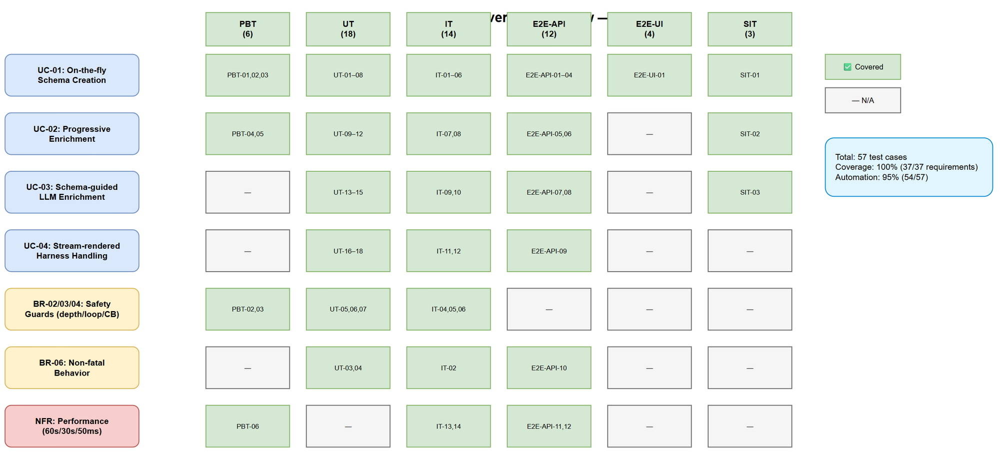
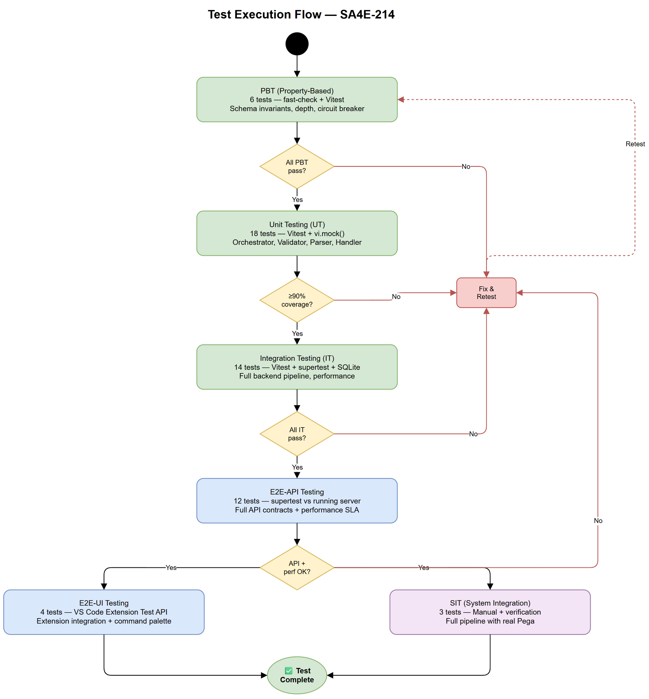

# Software Test Plan (STP)

## SDLC Agents 4 Enterprise — SA4E-214: Extension-driven Schema Creation for Pega Rule Types

---

## Document Information

| Field | Value |
|-------|-------|
| Jira Ticket | SA4E-214 |
| Title | Extension-driven Schema Creation for Pega Rule Types — On-the-fly LLM-enriched schemas |
| Author | QA Agent |
| Version | 1.0 |
| Date | 2025-07-09 |
| Status | Draft |
| Related BRD | BRD-v1-SA4E-214.docx |
| Related FSD | FSD-v1-SA4E-214.docx |
| Related TDD | TDD-v1-SA4E-214.docx |

---

## Revision History

| Version | Date | Author | Changes |
|---------|------|--------|---------|
| 1.0 | 2025-07-09 | QA Agent | Initial STP — auto-generated from BRD, FSD, and TDD |

---

## 1. Introduction

### 1.1 Purpose

This test plan defines the test strategy, scope, resources, and schedule for verifying SA4E-214: Extension-driven Schema Creation for Pega Rule Types. It covers on-the-fly schema creation (Phase A), progressive schema enrichment (Phase B), schema-guided LLM enrichment (Phase C), and stream-rendered harness handling (Phase D).

### 1.2 Test Objectives

- Verify on-the-fly schema creation triggers correctly during BFS indexing (UC-01)
- Validate recursive section discovery respects depth limits, visited sets, and circuit breakers (BR-02, BR-03, BR-04)
- Confirm progressive schema enrichment appends fields without removal (UC-02, BR-07)
- Verify schema-guided LLM enrichment produces accurate pseudo_code (UC-03)
- Validate stream-rendered harness dual-strategy fallback (UC-04, BR-10)
- Confirm non-fatal behavior — schema failures never block indexing (BR-06)
- Verify all API endpoints meet their contracts (TDD §3)
- Validate performance targets: ≤60s schema creation, ≤30s LLM timeout, ≤50ms validation (NFR)

### 1.3 References

| Document | Location |
|----------|----------|
| BRD | BRD-v1-SA4E-214.docx |
| FSD | FSD-v1-SA4E-214.docx |
| TDD | TDD-v1-SA4E-214.docx |
| SECURITY-REVIEW | SECURITY-REVIEW-SA4E-214.docx |

---

## 2. Test Strategy

### 2.1 Test Levels (6 Levels)

| Level | ID Prefix | Scope | Responsibility | Tools | Automation |
|-------|-----------|-------|---------------|-------|------------|
| Property-Based Testing (PBT) | PBT- | Schema data model invariants, field validation | Developer | fast-check + Vitest | 100% automated |
| Unit Testing (UT) | UT- | Individual functions/methods in isolation | Developer | Vitest + vi.mock() | 100% automated |
| Integration Testing (IT) | IT- | Component interactions: Backend services + DB, Parser + LLM | Developer + QA | Vitest + supertest + SQLite in-memory | 100% automated |
| End-to-End API Testing (E2E-API) | E2E-API- | Full backend API lifecycle: analyze → store → find → update | QA | Vitest + supertest against running server | 100% automated |
| End-to-End UI Testing (E2E-UI) | E2E-UI- | Extension integration with real backend | QA | VS Code Extension Test API + Playwright | 80% automated |
| System Integration Testing (SIT) | SIT- | Full pipeline: Extension → Pega server → Backend → KB | QA | Manual with scripted verification | Manual + verification scripts |

### 2.2 Test Types

| Type | Description | Applicable | Levels |
|------|-------------|------------|--------|
| Functional Testing | Verify features per FSD use cases | Yes | All levels |
| Regression Testing | Ensure existing BFS indexing unaffected | Yes | IT, E2E-API |
| Performance Testing | Schema creation ≤60s, LLM timeout 30s, validation ≤50ms | Yes | IT, E2E-API |
| Security Testing | No credentials in schema, input validation | Yes | UT, IT |
| Reliability Testing | Non-fatal behavior, graceful degradation | Yes | UT, IT, E2E-API |
| Concurrency Testing | Mutex prevents duplicate schema creation | Yes | IT |

### 2.3 Test Approach

- **Risk-based prioritization**: Focus on UC-01 (schema creation) first — highest complexity and integration points
- **Dual-layer mocking**: For UT/IT, mock Pega server responses and LLM responses separately to test each strategy in isolation
- **Real DB for IT**: Use SQLite in-memory for integration tests (mirrors production storage)
- **Contract-first**: API tests validate against Zod schemas defined in TDD §3
- **Performance gates**: Automated timeout assertions in E2E-API tests

### 2.4 Entry Criteria

| Level | Entry Criteria |
|-------|---------------|
| PBT | Zod schemas + model interfaces defined |
| UT | Individual modules implemented |
| IT | Backend services connected to test DB |
| E2E-API | Backend running with all schema endpoints |
| E2E-UI | Extension compiled + backend running |
| SIT | Extension + Backend + Pega server (or mock) all available |

### 2.5 Exit Criteria

| Level | Exit Criteria |
|-------|--------------|
| PBT | 100% property tests pass, no invariant violations in 1000 runs |
| UT | ≥90% line coverage on schema modules, all tests pass |
| IT | All integration scenarios pass with real DB |
| E2E-API | All API contracts verified, performance within SLA |
| E2E-UI | Schema creation completes successfully via extension trigger |
| SIT | Full pipeline tested with real Pega server, schema accuracy validated |

---

## 3. Test Scope

### 3.1 Features In Scope

| # | Feature / Story | Priority | FSD Reference | Test Levels |
|---|----------------|----------|---------------|-------------|
| 1 | On-the-fly Schema Creation (recursive fetch + analyze + aggregate) | Critical | UC-01, BR-01–BR-06 | PBT, UT, IT, E2E-API, E2E-UI, SIT |
| 2 | Progressive Schema Enrichment (field discovery + append) | High | UC-02, BR-07, BR-08 | PBT, UT, IT, E2E-API |
| 3 | Schema-guided LLM Enrichment (prompt enhancement) | High | UC-03 | UT, IT, E2E-API |
| 4 | Stream-rendered Harness Handling (dual-strategy fallback) | High | UC-04, BR-10 | UT, IT, E2E-API |
| 5 | Backend Schema API (analyze, store, find, update) | Critical | TDD §3.2–3.5 | UT, IT, E2E-API |
| 6 | Local File Cache (read/write/invalidation) | Medium | FSD §4.4 | UT, IT |
| 7 | Recursive Discovery Safety (depth, visited, circuit breaker) | Critical | BR-02–BR-04 | PBT, UT, IT |
| 8 | Non-fatal Behavior (graceful degradation) | High | BR-06 | UT, IT, E2E-API |
| 9 | Concurrency Control (mutex, sequential analysis) | Medium | TDD §8.3 | IT |
| 10 | Performance Targets (60s total, 30s LLM, 50ms validation) | High | NFR | IT, E2E-API |

### 3.2 Features Out of Scope

| # | Feature | Reason |
|---|---------|--------|
| 1 | Manual "Index Pega Rule Schema" command | Removed per BRD §1.2 |
| 2 | Browser-based harness inspection | Superseded by API-only approach |
| 3 | Schema for non-Pega rule types | Not part of this ticket |
| 4 | Pega server-side changes | External system |
| 5 | Existing BFS indexing logic (untouched paths) | Covered by regression tests only |

---

## 4. Test Environment

### 4.1 Environment Requirements

| Environment | Configuration | Purpose |
|-------------|---------------|---------|
| UT/PBT | Node.js 20+, Vitest, in-memory mocks | Unit + property tests |
| IT | Node.js 20+, Vitest, SQLite in-memory, mock Pega/LLM | Integration tests |
| E2E-API | Backend server running on localhost:48721, SQLite file DB | API contract + performance |
| E2E-UI | VS Code/Kiro + extension loaded + backend running | Extension integration |
| SIT | VS Code/Kiro + backend + real Pega 8.x server | Full pipeline |

### 4.2 External Dependencies

| System | Dependency | Mock/Stub Available |
|--------|-----------|---------------------|
| Pega Server | Harness RuleForm JSON responses | Yes — fixture files from `Pega/raw-schema-rules/` |
| LLM Runtime (LM Studio/Ollama) | Section discovery responses | Yes — mock LLM responses with predefined output |
| Knowledge Base (SQLite) | Schema CRUD operations | Yes — in-memory SQLite for IT |

### 4.3 Test Data Requirements

| Data Type | Description | Source |
|-----------|-------------|--------|
| Harness RuleForm JSON | Rule-Obj-Flow, Rule-Obj-Activity, Rule-HTML-Property harnesses | `Pega/raw-schema-rules/*.json` fixtures |
| Stream-rendered Harness | Harness with pySourceStream (no pySections) | Synthetic fixture |
| Enriched Schema | Pre-built schema for find/update tests | JSON fixture files |
| LLM Responses | Section discovery results (fields + sub_sections) | Mock response fixtures |
| Circular Reference Harness | Section A → B → A → ... | Synthetic fixture |
| Explosion Harness | Section with >20 sub-sections | Synthetic fixture |

---

## 5. Test Schedule

| Phase | Duration | Milestone |
|-------|----------|-----------|
| Test Planning (STP + STC) | 1 day | STP + STC approved |
| Test Data + Fixture Preparation | 1 day | All fixtures ready |
| PBT + UT Implementation | 2 days | PBT + UT green |
| IT Implementation | 2 days | IT green |
| E2E-API Implementation | 1 day | E2E-API green |
| E2E-UI Implementation | 1 day | E2E-UI green |
| SIT Execution | 1 day | Full pipeline verified |
| Defect Fix & Retest | 1 day | All Critical/High fixed |

---

## 6. Resources & Responsibilities

| Role | Responsibility |
|------|---------------|
| QA Engineer | Test case design, E2E/SIT execution, defect reporting |
| Developer | PBT/UT/IT implementation, defect fixing |
| SA | Architecture guidance for test approach |
| DevOps | Test environment setup, CI pipeline |

---

## 7. Risk & Mitigation

| # | Risk | Impact | Likelihood | Mitigation |
|---|------|--------|------------|------------|
| 1 | LLM mock responses don't match real behavior | High | Medium | Use recorded responses from real LLM; snapshot test approach |
| 2 | Pega harness fixtures outdated | Medium | Low | Validate fixtures against real Pega before SIT |
| 3 | Recursive depth tests hard to set up | Medium | Medium | Synthetic nested fixtures with known depth |
| 4 | Performance tests flaky due to system load | Medium | Medium | Run in isolation; allow 20% tolerance on timing |
| 5 | Extension tests require VS Code runtime | Low | Low | Use VS Code Extension Testing framework |

---

## 8. Defect Management

### 8.1 Severity Levels

| Severity | Definition | Example |
|----------|-----------|---------|
| Critical | Schema creation crashes extension or backend | Unhandled exception in PegaSchemaOrchestrator |
| Major | Schema created but incorrect (wrong fields, missing logic) | LLM fallback produces empty schema |
| Minor | Schema functional but degraded (low coverage, missed sub-section) | Circuit breaker fires too early |
| Trivial | Logging/messaging issues | Wrong log level |

### 8.2 Priority Levels

| Priority | Definition | SLA |
|----------|-----------|-----|
| P1 | Must fix immediately — blocks testing | 4 hours |
| P2 | Must fix before release | 1 business day |
| P3 | Should fix if time permits | 3 business days |
| P4 | Nice to fix, defer acceptable | Next sprint |

---

## 9. Test Metrics & Reporting

### 9.1 Metrics

| Metric | Formula | Target |
|--------|---------|--------|
| Test Execution Rate | Executed / Total × 100% | 100% |
| Pass Rate | Passed / Executed × 100% | ≥ 95% |
| Defect Density | Defects / Test Cases | ≤ 0.1 |
| Critical Defect Count | Count of Critical severity | 0 |
| Code Coverage (Schema Modules) | Lines covered / Total lines | ≥ 90% |
| Performance Pass Rate | Tests meeting SLA / Performance tests | 100% |

### 9.2 Reporting

| Report | Frequency | Audience |
|--------|-----------|----------|
| Test Progress | After each level completes | Dev team |
| Defect Summary | Daily during execution | Dev + QA |
| Final Test Report | After SIT | All stakeholders |

---

## 10. Test Coverage Diagram

---

## 11. Test Execution Flow

---

## 12. Requirements Traceability Matrix (RTM)

| Requirement | Source | Test Level | Test Case IDs | Coverage |
|-------------|--------|------------|---------------|----------|
| UC-01 (On-the-fly Schema Creation) | FSD §2.1 | PBT, UT, IT, E2E-API, E2E-UI, SIT | PBT-01–03, UT-01–08, IT-01–06, E2E-API-01–04, E2E-UI-01, SIT-01 | ✅ Covered |
| UC-02 (Progressive Enrichment) | FSD §2.2 | PBT, UT, IT, E2E-API | PBT-04–05, UT-09–12, IT-07–08, E2E-API-05–06 | ✅ Covered |
| UC-03 (Schema-guided Enrichment) | FSD §2.3 | UT, IT, E2E-API | UT-13–15, IT-09–10, E2E-API-07–08 | ✅ Covered |
| UC-04 (Stream-rendered Harness) | FSD §2.4 | UT, IT, E2E-API | UT-16–18, IT-11–12, E2E-API-09 | ✅ Covered |
| BR-01 (Once per type) | FSD §3 | UT, IT | UT-01, IT-01 | ✅ Covered |
| BR-02 (Max depth 5) | FSD §3 | PBT, UT, IT | PBT-02, UT-05, IT-04 | ✅ Covered |
| BR-03 (Visited set) | FSD §3 | UT, IT | UT-06, IT-05 | ✅ Covered |
| BR-04 (Circuit breaker >20) | FSD §3 | PBT, UT, IT | PBT-03, UT-07, IT-06 | ✅ Covered |
| BR-05 (LLM timeout 30s) | FSD §3 | UT, IT | UT-08, IT-03 | ✅ Covered |
| BR-06 (Non-fatal) | FSD §3 | UT, IT, E2E-API | UT-03, UT-04, IT-02, E2E-API-10 | ✅ Covered |
| BR-07 (Append-only) | FSD §3 | PBT, UT | PBT-04, UT-10 | ✅ Covered |
| BR-08 (Version increment) | FSD §3 | UT, IT | UT-11, IT-07 | ✅ Covered |
| BR-09 (Backend no Pega access) | FSD §3 | Architecture | (Design constraint, not testable) | ✅ By design |
| BR-10 (Dual-strategy) | FSD §3 | UT, IT | UT-16, IT-11 | ✅ Covered |
| BR-11 (No separate command) | FSD §3 | E2E-UI | E2E-UI-03 | ✅ Covered |
| BR-12 (≤60s total) | FSD §3 | IT, E2E-API | IT-13, E2E-API-11 | ✅ Covered |
| NFR: LLM timeout 30s | FSD §9 | UT, IT | UT-08, IT-03 | ✅ Covered |
| NFR: Validation ≤50ms | FSD §9 | IT, E2E-API | IT-14, E2E-API-12 | ✅ Covered |
| NFR: Schema ≤50KB | FSD §9 | PBT | PBT-06 | ✅ Covered |
| STORY-1 AC-1 | BRD §2.3 | E2E-API, E2E-UI | E2E-API-01, E2E-UI-01 | ✅ Covered |
| STORY-1 AC-2 | BRD §2.3 | E2E-UI | E2E-UI-02 | ✅ Covered |
| STORY-1 AC-3 | BRD §2.3 | UT, IT | UT-04, IT-02 | ✅ Covered |
| STORY-1 AC-4 | BRD §2.3 | UT, IT | UT-08, IT-03 | ✅ Covered |
| STORY-2 AC-1 | BRD §2.3 | IT, E2E-API | IT-09, E2E-API-07 | ✅ Covered |
| STORY-2 AC-2 | BRD §2.3 | UT, IT | UT-14, IT-10 | ✅ Covered |
| STORY-2 AC-3 | BRD §2.3 | UT | UT-15 | ✅ Covered |
| STORY-3 AC-1 | BRD §2.3 | UT, IT | UT-09, IT-07 | ✅ Covered |
| STORY-3 AC-2 | BRD §2.3 | UT | UT-11 | ✅ Covered |
| STORY-3 AC-3 | BRD §2.3 | UT | UT-12 | ✅ Covered |
| STORY-4 AC-1 | BRD §2.3 | UT, IT | UT-16, IT-11 | ✅ Covered |
| STORY-4 AC-2 | BRD §2.3 | UT | UT-17 | ✅ Covered |
| STORY-4 AC-3 | BRD §2.3 | UT | UT-18 | ✅ Covered |
| STORY-5 AC-1 | BRD §2.3 | IT | IT-04 | ✅ Covered |
| STORY-5 AC-2 | BRD §2.3 | UT, IT | UT-06, IT-05 | ✅ Covered |
| STORY-5 AC-3 | BRD §2.3 | UT | UT-05 | ✅ Covered |
| STORY-5 AC-4 | BRD §2.3 | UT, IT | UT-07, IT-06 | ✅ Covered |
| STORY-6 AC-1 | BRD §2.3 | E2E-UI | E2E-UI-03 | ✅ Covered |
| STORY-6 AC-2 | BRD §2.3 | E2E-UI | E2E-UI-04 | ✅ Covered |
| STORY-6 AC-3 | BRD §2.3 | IT, E2E-API | IT-02, E2E-API-10 | ✅ Covered |

**Coverage Summary:**

| Category | Total | Covered | Coverage % |
|----------|-------|---------|------------|
| Use Cases | 4 | 4 | 100% |
| Business Rules | 12 | 12 | 100% |
| Acceptance Criteria | 17 | 17 | 100% |
| Non-Functional Requirements | 4 | 4 | 100% |
| **Overall** | **37** | **37** | **100%** |

---

## 13. Appendix

### Glossary

| Term | Definition |
|------|------------|
| PBT | Property-Based Testing |
| UT | Unit Testing |
| IT | Integration Testing |
| E2E-API | End-to-End API Testing |
| E2E-UI | End-to-End UI/Extension Testing |
| SIT | System Integration Testing |
| RTM | Requirements Traceability Matrix |
| Schema | Structured description of a Pega rule type's fields and extraction hints |
| Dual-strategy | Rule-based parser first, LLM fallback when empty |

### Assumptions

- Test fixtures from `Pega/raw-schema-rules/` represent real Pega harness structure
- SQLite in-memory DB behaves identically to file-based SQLite for schema CRUD
- LLM mock responses accurately represent LM Studio/Ollama output format
- VS Code Extension Test API is available for E2E-UI tests

### Diagram Index

| # | Diagram | Image | Source (editable) |
|---|---------|-------|-------------------|
| 1 | Test Coverage | [test-coverage.png](diagrams/test-coverage.png) | [test-coverage.drawio](diagrams/test-coverage.drawio) |
| 2 | Test Execution Flow | [test-execution-flow.png](diagrams/test-execution-flow.png) | [test-execution-flow.drawio](diagrams/test-execution-flow.drawio) |
