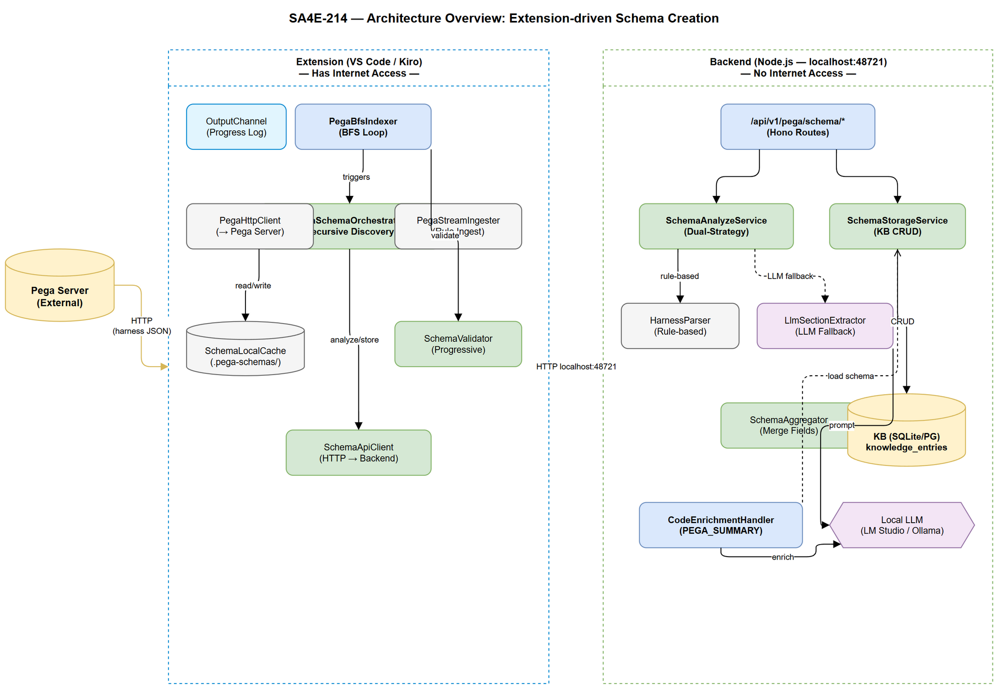
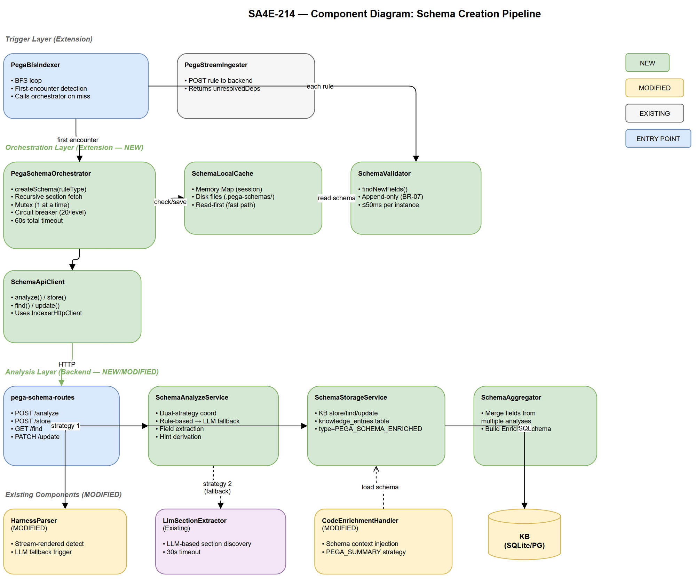

# Technical Design Document (TDD)

## SDLC Agents 4 Enterprise — SA4E-214: Extension-driven Schema Creation for Pega Rule Types

---

## Document Information

| Field | Value |
|-------|-------|
| Jira Ticket | SA4E-214 |
| Title | Extension-driven Schema Creation for Pega Rule Types — On-the-fly LLM-enriched schemas |
| Author | SA Agent |
| Version | 1.0 |
| Date | 2025-07-09 |
| Status | Draft |
| Related BRD | BRD-v1-SA4E-214.docx |
| Related FSD | FSD-v1-SA4E-214.docx |

---

## Revision History

| Version | Date | Author | Changes |
|---------|------|--------|---------|
| 1.0 | 2025-07-09 | SA Agent | Initial TDD — auto-generated from BRD and FSD |

---

## 1. Introduction

### 1.1 Purpose

This TDD specifies the technical design for implementing on-the-fly schema creation for Pega rule types. The system creates enriched schemas automatically when the extension encounters a new rule type during BFS indexing, then uses those schemas as LLM prompt context for accurate code enrichment.

### 1.2 Scope

- **Extension side**: `PegaSchemaOrchestrator` — orchestrates recursive harness fetching, section discovery, and schema aggregation
- **Backend side**: Enhanced `/api/v1/pega/schema/*` routes — analyze, store, find, update endpoints
- **Backend side**: `CodeEnrichmentHandler` enhancement — schema context injection into LLM prompts
- **Backend side**: `HarnessParser` fix — stream-rendered harness handling via LLM fallback

### 1.3 Technology Stack

| Layer | Technology | Version |
|-------|-----------|---------|
| Language | TypeScript | 5.x |
| Backend Framework | Hono | 4.x |
| Extension Platform | VS Code Extension API | ^1.85.0 |
| Database | SQLite (better-sqlite3) / PostgreSQL | - |
| LLM Runtime | LM Studio / Ollama (local) | - |
| Validation | Zod | 3.x |
| Logging | Pino (backend), OutputChannel (extension) | - |
| Test Framework | Vitest | 1.x |

### 1.4 Design Principles

- **Non-blocking**: Schema creation MUST NOT block the BFS indexing pipeline (BR-06)
- **Fail-safe**: All schema operations gracefully degrade — indexing continues regardless (BR-06)
- **Append-only**: Progressive enrichment never removes fields, only adds (BR-07)
- **Separation of concerns**: Extension fetches from Pega, Backend analyzes — clear boundary (BR-09)
- **Dual-strategy**: Rule-based first (fast, deterministic), LLM fallback when empty (BR-10)
- **SOLID**: Single Responsibility for each class; Strategy pattern for analysis approaches

### 1.5 Constraints

- Backend has NO internet access — cannot reach Pega server directly (BR-09)
- LLM calls have 30s hard timeout (BR-05)
- Recursive section discovery max depth = 5 (BR-02)
- Circuit breaker at >20 sections per level (BR-04)
- Schema creation must complete within 60s total per rule type (NFR)
- Concurrency: 1 schema creation at a time (mutex in extension)

### 1.6 References

| Document | Location |
|----------|----------|
| BRD | BRD-v1-SA4E-214.docx |
| FSD | FSD-v1-SA4E-214.docx |

---

## 2. System Architecture

### 2.1 Architecture Overview

The system follows a split-responsibility architecture where the Extension (with internet access) orchestrates Pega API calls and the Backend (without internet) performs analysis and storage.



**Key architectural decisions:**

1. **Extension as Orchestrator**: The extension drives the recursive discovery loop because only it can reach the Pega server. This inverts the typical backend-driven pattern but is required by the network constraint.
2. **Backend as Analyzer**: All LLM and parsing logic stays in the backend, keeping the extension lightweight and the analysis reusable.
3. **Dual Storage**: Schema is stored in both local file cache (extension disk) and KB (backend database). Local cache is read-first for performance; KB is authoritative for cross-session persistence.
4. **Async Schema Creation**: Schema creation runs asynchronously during indexing — the current rule proceeds without waiting. The schema is available for the *next* instance of the same type.

### 2.2 Component Diagram



| Component | Layer | Responsibility | Technology |
|-----------|-------|---------------|------------|
| PegaSchemaOrchestrator | Extension | Orchestrate recursive harness fetch + section discovery | TypeScript, vscode API |
| SchemaLocalCache | Extension | Read/write enriched schemas to local `.pega-schemas/` files | Node.js fs |
| PegaBfsIndexer (modified) | Extension | Trigger schema creation on first-encounter rule types | TypeScript |
| HarnessParser (enhanced) | Backend | Parse harness JSON → discover sections/fields (dual-strategy) | TypeScript |
| LlmSectionExtractor | Backend | LLM-based section discovery for stream-rendered harnesses | TypeScript, LLM API |
| SchemaAnalyzeService | Backend | Coordinate analysis: rule-based + LLM, return fields + sub-sections | TypeScript |
| SchemaStorageService | Backend | CRUD operations on enriched schemas in KB (knowledge_entries table) | TypeScript, SQLite/PG |
| CodeEnrichmentHandler (enhanced) | Backend | Inject schema context into LLM prompts for PEGA_SUMMARY strategy | TypeScript |
| SchemaValidator | Extension | Compare rule instance fields against schema, detect new fields | TypeScript |

### 2.3 Communication Patterns

| From | To | Protocol | Pattern | Description |
|------|----|----------|---------|-------------|
| PegaSchemaOrchestrator | Pega Server | REST (HTTP Basic) | Sync request/response | Fetch harness/section RuleForm JSON |
| PegaSchemaOrchestrator | Backend Schema API | REST (HTTP) | Sync request/response | Send harness for analysis, store/find schemas |
| PegaBfsIndexer | PegaSchemaOrchestrator | In-process (async) | Fire-and-forget | Trigger schema creation on cache miss |
| CodeEnrichmentHandler | SchemaStorageService | In-process (function call) | Sync | Load schema context before LLM prompt |
| SchemaAnalyzeService | LlmSectionExtractor | In-process (async) | Await with timeout | LLM fallback when rule-based produces empty |

---

## 3. API Design

### 3.1 API Overview

| # | Endpoint | Method | Description | Source |
|---|----------|--------|-------------|--------|
| 1 | `/api/v1/pega/schema/analyze` | POST | Analyze harness/section JSON → return fields + sub-sections | UC-01 Step 5 |
| 2 | `/api/v1/pega/schema/store` | POST | Store completed enriched schema in KB | UC-01 Step 9 |
| 3 | `/api/v1/pega/schema/find` | GET | Retrieve enriched schema by rule type | UC-01 Step 3 |
| 4 | `/api/v1/pega/schema/update` | PATCH | Progressive update — append new fields | UC-02 Step 6 |
| 5 | `/api/v1/pega/schema/generate` | POST | Legacy — internally calls analyze + aggregate (backward compat) | SA4E-95 |

---

### 3.2 API: Schema Analyze

**Implements:** UC-01 Step 5, UC-04

| Attribute | Value |
|-----------|-------|
| Method | POST |
| Path | `/api/v1/pega/schema/analyze` |
| Auth | None (localhost only) |
| Rate Limit | None (internal) |

**Request Body:**

```json
{
  "harnessJson": { "pxObjClass": "Rule-HTML-Harness", "...": "..." },
  "ruleType": "Rule-Obj-Flow",
  "depth": 0
}
```

**Zod Schema:**

```typescript
const SchemaAnalyzeRequestSchema = z.object({
  harnessJson: z.record(z.unknown()),
  ruleType: z.string().min(1),
  depth: z.number().int().min(0).max(5).optional().default(0),
});
```

**Response — 200 OK:**

```json
{
  "fields": [
    { "path": "pyFlowSteps", "category": "logic", "type": "array", "description": "Flow step definitions", "frequency": "always" }
  ],
  "sub_sections": ["pyFlowSteps", "pyConnectors", "pyDecisions"],
  "rule_based_coverage": 75,
  "llm_fallback_used": false,
  "hints": {
    "primary_logic_field": "pyFlowSteps",
    "logic_structure": "sequential_steps"
  }
}
```

**Error Responses:**

| Status | Code | Message | When |
|--------|------|---------|------|
| 400 | SCHEMA_INVALID_REQUEST | Missing harnessJson | Body validation fails |
| 500 | SCHEMA_ANALYSIS_FAILED | Analysis error | Parser/LLM throws |
| 504 | SCHEMA_LLM_TIMEOUT | LLM timeout | LLM exceeds 30s |

---

### 3.3 API: Schema Store

**Implements:** UC-01 Step 9

| Attribute | Value |
|-----------|-------|
| Method | POST |
| Path | `/api/v1/pega/schema/store` |
| Auth | None (localhost only) |

**Request Body:**

```json
{
  "schema": {
    "rule_type": "Rule-Obj-Flow",
    "schema_version": 1,
    "identity_fields": {},
    "logic_fields": {},
    "connectivity_fields": {},
    "extraction_hints": {},
    "known_fields": ["pyFlowSteps", "pyConnectors"],
    "coverage": 85,
    "discovered_sections": ["pyFlowSteps", "pyConnectors"]
  }
}
```

**Response — 201 Created:**

```json
{ "success": true, "id": 42 }
```

**Error Responses:**

| Status | Code | Message | When |
|--------|------|---------|------|
| 400 | SCHEMA_INVALID_SCHEMA | Schema validation failed | Zod validation fails |
| 409 | SCHEMA_ALREADY_EXISTS | Schema for this rule type already exists | Duplicate ruleType |
| 500 | SCHEMA_STORE_FAILED | Storage error | DB write fails |

---

### 3.4 API: Schema Find

**Implements:** UC-01 Step 3, UC-03 Step 3

| Attribute | Value |
|-----------|-------|
| Method | GET |
| Path | `/api/v1/pega/schema/find` |
| Auth | None (localhost only) |

**Query Parameters:**

| Parameter | Type | Required | Description |
|-----------|------|----------|-------------|
| ruleType | string | Yes | Pega rule class (e.g., "Rule-Obj-Flow") |

**Response — 200 OK:**

```json
{
  "rule_type": "Rule-Obj-Flow",
  "schema_version": 3,
  "created_at": "2025-07-01T10:00:00Z",
  "updated_at": "2025-07-05T14:30:00Z",
  "identity_fields": { "...": "..." },
  "logic_fields": { "...": "..." },
  "connectivity_fields": { "...": "..." },
  "extraction_hints": { "...": "..." },
  "known_fields": ["..."],
  "coverage": 85,
  "discovered_sections": ["..."]
}
```

**Response — 404 Not Found:**

```json
{ "error": "Schema not found for rule type", "ruleType": "Rule-Obj-Flow" }
```

---

### 3.5 API: Schema Update (Progressive)

**Implements:** UC-02 Step 6

| Attribute | Value |
|-----------|-------|
| Method | PATCH |
| Path | `/api/v1/pega/schema/update` |
| Auth | None (localhost only) |

**Request Body:**

```json
{
  "ruleType": "Rule-Obj-Flow",
  "new_fields": [
    { "path": "pyCustomField", "category": "metadata", "type": "string", "description": "Custom field", "frequency": "rare" }
  ]
}
```

**Response — 200 OK:**

```json
{ "success": true, "new_version": 4 }
```

**Error Responses:**

| Status | Code | Message | When |
|--------|------|---------|------|
| 404 | SCHEMA_NOT_FOUND | No schema exists for this rule type | ruleType not in KB |
| 400 | SCHEMA_EMPTY_UPDATE | new_fields array is empty | No fields to add |

---

## 4. Database Design

### 4.1 Schema Storage in KB

Enriched schemas are stored in the existing `knowledge_entries` table (no new tables needed).

**Storage pattern:**

| Field | Value |
|-------|-------|
| type | `'PEGA_SCHEMA_ENRICHED'` |
| source | `'pega-schema:{ruleType}'` (e.g., `'pega-schema:Rule-Obj-Flow'`) |
| content | Full JSON of `EnrichedSchema` object |
| tags | `'pega,schema,enriched,{ruleType}'` |
| scope | `'PROJECT'` |

**Query patterns:**

| Operation | SQL | Performance |
|-----------|-----|-------------|
| Find by ruleType | `SELECT content FROM knowledge_entries WHERE type='PEGA_SCHEMA_ENRICHED' AND source=?` | < 5ms (indexed) |
| Store schema | `INSERT INTO knowledge_entries (content, type, source, tags, scope) VALUES (?, ?, ?, ?, ?)` | < 10ms |
| Update schema | `UPDATE knowledge_entries SET content=?, updated_at=? WHERE type='PEGA_SCHEMA_ENRICHED' AND source=?` | < 10ms |

**Index requirement:**

```sql
CREATE INDEX IF NOT EXISTS idx_knowledge_entries_type_source 
  ON knowledge_entries(type, source);
```

This index likely already exists. Verify during implementation.

---

## 5. Class / Module Design

### 5.1 Package Structure

**Extension (new files):**

```
extension/src/
├── services/
│   ├── PegaSchemaOrchestrator.ts     # NEW — orchestrates recursive schema creation
│   ├── SchemaLocalCache.ts           # NEW — local file cache for schemas
│   ├── SchemaValidator.ts            # NEW — progressive field discovery
│   └── PegaBfsIndexer.ts            # MODIFIED — hook for schema creation
├── models/
│   ├── EnrichedSchema.ts             # NEW — interfaces + Zod schemas for schema objects
│   └── SchemaTypes.ts                # NEW — FieldDescriptor, ExtractionHints types
└── clients/
    └── SchemaApiClient.ts            # NEW — HTTP client for backend schema endpoints
```

**Backend (new/modified files):**

```
backend/src/
├── server/routes/
│   └── pega-schema-routes.ts         # MODIFIED — add analyze/store/find/update endpoints
├── modules/pega/
│   ├── schema/
│   │   ├── SchemaAnalyzeService.ts   # NEW — coordinate dual-strategy analysis
│   │   ├── SchemaStorageService.ts   # NEW — KB CRUD for enriched schemas
│   │   └── SchemaAggregator.ts       # NEW — merge fields from recursive analysis
│   └── harness-schema/parser/
│       └── HarnessParser.ts          # MODIFIED — stream-rendered harness detection + LLM fallback
├── engine/enrichment/
│   └── CodeEnrichmentHandler.ts      # MODIFIED — loadOrCreateSchemaContext enhanced
└── models/
    └── pega-schema.models.ts         # NEW — shared interfaces + Zod schemas
```

### 5.2 Key Interfaces

```typescript
/** Extension — Orchestrator interface */
export interface ISchemaOrchestrator {
  createSchema(ruleType: string): Promise<EnrichedSchema | null>;
  getSchema(ruleType: string): Promise<EnrichedSchema | null>;
  validateAndUpdate(ruleType: string, ruleJson: Record<string, unknown>): Promise<void>;
}

/** Extension — Local cache interface */
export interface ISchemaCache {
  get(ruleType: string): EnrichedSchema | null;
  set(ruleType: string, schema: EnrichedSchema): void;
  has(ruleType: string): boolean;
}

/** Extension — Schema API client interface */
export interface ISchemaApiClient {
  analyze(request: SchemaAnalyzeRequest): Promise<SchemaAnalyzeResponse>;
  store(schema: EnrichedSchema): Promise<{ success: boolean; id: number }>;
  find(ruleType: string): Promise<EnrichedSchema | null>;
  update(ruleType: string, newFields: FieldDescriptor[]): Promise<{ new_version: number }>;
}

/** Backend — Analysis service interface */
export interface ISchemaAnalyzeService {
  analyze(harnessJson: Record<string, unknown>, ruleType: string, depth: number): Promise<SchemaAnalyzeResponse>;
}

/** Backend — Storage service interface */
export interface ISchemaStorageService {
  store(schema: EnrichedSchema): Promise<number>;
  find(ruleType: string): Promise<EnrichedSchema | null>;
  update(ruleType: string, newFields: FieldDescriptor[]): Promise<number>;
}
```

### 5.3 Design Patterns

| Pattern | Where Used | Rationale |
|---------|-----------|-----------|
| **Facade** | PegaSchemaOrchestrator | Single entry point orchestrating cache, API client, validator |
| **Strategy** | SchemaAnalyzeService (rule-based vs LLM) | Dual-strategy analysis with fallback chain |
| **Template Method** | HarnessParser.parse() | Standard parse flow with overridable LLM fallback step |
| **Observer** (callback) | PegaSchemaInferrer.onSchemaInferred | Hook for triggering schema enrichment after inference |
| **Mutex** | PegaSchemaOrchestrator._creationMutex | Prevent concurrent schema creation for same type |
| **Circuit Breaker** | PegaSchemaOrchestrator (>20 sections) | Stop expansion on template explosion |

### 5.4 Class Diagram

```typescript
// PegaSchemaOrchestrator — Extension
class PegaSchemaOrchestrator implements ISchemaOrchestrator {
  private cache: ISchemaCache;
  private apiClient: ISchemaApiClient;
  private pegaClient: PegaHttpClient;
  private validator: SchemaValidator;
  private creatingTypes: Set<string>; // mutex — types currently being created
  private outputChannel: vscode.OutputChannel;

  async createSchema(ruleType: string): Promise<EnrichedSchema | null>;
  async getSchema(ruleType: string): Promise<EnrichedSchema | null>;
  async validateAndUpdate(ruleType: string, ruleJson: Record<string, unknown>): Promise<void>;
  private async recursiveDiscover(ruleType: string, sectionName: string, depth: number, visited: Set<string>): Promise<FieldDescriptor[]>;
  private async fetchHarnessRuleForm(ruleType: string): Promise<Record<string, unknown> | null>;
  private async fetchSection(sectionName: string): Promise<Record<string, unknown> | null>;
}

// SchemaLocalCache — Extension
class SchemaLocalCache implements ISchemaCache {
  private cacheDir: string; // .pega-schemas/
  private memoryCache: Map<string, EnrichedSchema>;

  get(ruleType: string): EnrichedSchema | null;
  set(ruleType: string, schema: EnrichedSchema): void;
  has(ruleType: string): boolean;
  private filePath(ruleType: string): string;
}

// SchemaValidator — Extension
class SchemaValidator {
  findNewFields(schema: EnrichedSchema, ruleJson: Record<string, unknown>): FieldDescriptor[];
}

// SchemaAnalyzeService — Backend
class SchemaAnalyzeService implements ISchemaAnalyzeService {
  private parser: HarnessParser;
  private llmExtractor: LlmSectionExtractor | null;

  async analyze(harnessJson: Record<string, unknown>, ruleType: string, depth: number): Promise<SchemaAnalyzeResponse>;
  private extractFields(parsedHarness: ParsedHarness): FieldDescriptor[];
  private detectSubSections(parsedHarness: ParsedHarness): string[];
  private deriveHints(fields: FieldDescriptor[], ruleType: string): Partial<ExtractionHints>;
}

// SchemaStorageService — Backend
class SchemaStorageService implements ISchemaStorageService {
  private db: DatabaseAdapter;

  async store(schema: EnrichedSchema): Promise<number>;
  async find(ruleType: string): Promise<EnrichedSchema | null>;
  async update(ruleType: string, newFields: FieldDescriptor[]): Promise<number>;
}
```

### 5.5 Error Handling

| Exception/Error | HTTP Status | Error Code | When Thrown |
|-----------------|-------------|------------|------------|
| SchemaAnalysisError | 500 | SCHEMA_ANALYSIS_FAILED | Parser or LLM throws unexpected error |
| SchemaLlmTimeoutError | 504 | SCHEMA_LLM_TIMEOUT | LLM call exceeds 30s AbortController timeout |
| SchemaNotFoundError | 404 | SCHEMA_NOT_FOUND | find() or update() for non-existent ruleType |
| SchemaValidationError | 400 | SCHEMA_INVALID_REQUEST | Zod validation fails on request body |
| SchemaCircuitBreakerError | (logged, not HTTP) | SCHEMA_CIRCUIT_BREAKER | >20 sections at one depth level |
| PegaUnreachableError | (logged, not HTTP) | SCHEMA_PEGA_UNREACHABLE | Extension cannot reach Pega server |

---

## 6. Integration Design

### 6.1 Extension → Pega Server

| Attribute | Value |
|-----------|-------|
| Protocol | REST (HTTPS) |
| Authentication | HTTP Basic (configured in extension settings) |
| Timeout | 10s per request |
| Retry Policy | 1 retry with 2s backoff |
| Circuit Breaker | After 3 consecutive failures → skip schema creation for this session |

**Operations:**

| Operation | Pega API | Method | Body |
|-----------|----------|--------|------|
| Fetch Harness RuleForm | `/rules/query` | POST | `{ "pxObjClass": "Rule-HTML-Harness", "pyClassName": "{appliesToClass}", "pyRuleName": "{ruleType}RuleForm" }` |
| Fetch Section | `/rules/query` | POST | `{ "pxObjClass": "Rule-HTML-Section", "pyRuleName": "{sectionName}" }` |

### 6.2 Extension → Backend (Schema API)

| Attribute | Value |
|-----------|-------|
| Protocol | HTTP (localhost) |
| Base URL | `http://localhost:48721/api/v1/pega/schema` |
| Timeout | 60s (analyze can be slow with LLM) |
| Retry Policy | No retry for analyze (already has internal LLM timeout) |

Uses existing `IndexerHttpClient` from the extension, which wraps `undici` with proxy-agent support.

### 6.3 Backend Internal: CodeEnrichmentHandler → SchemaStorageService

```typescript
// In CodeEnrichmentHandler.loadOrCreateSchemaContext():
private async loadOrCreateSchemaContext(symbolKind: string, bodyText: string | null): Promise<string | undefined> {
  const ruleType = this.kindToRuleType(symbolKind);
  if (!ruleType) return undefined;

  // 1. Try to find enriched schema in KB
  const schema = await this.schemaStorage.find(ruleType);
  if (schema) {
    return this.formatSchemaForPrompt(schema);
  }

  // 2. If not found, attempt on-the-fly from rule body (existing fallback)
  if (bodyText) {
    return this.createSchemaOnTheFly(ruleType, bodyText);
  }

  return undefined;
}
```

---

## 7. Security Design

### 7.1 Authentication

- Backend schema endpoints: No authentication required (localhost-only access, enforced by network binding)
- Extension → Pega Server: HTTP Basic auth (credentials stored in VS Code SecretStorage, never in schema content)

### 7.2 Data Protection

| Data Type | At Rest | In Transit | In Logs |
|-----------|---------|------------|---------|
| Schema content | Plaintext (structure only, no credentials) | HTTP localhost (no TLS needed) | Full JSON logged at DEBUG level |
| Pega credentials | VS Code SecretStorage (encrypted) | HTTPS to Pega server | NEVER logged |
| Harness JSON | Temp in memory | HTTP localhost | Truncated at INFO level |

### 7.3 Input Validation

| Field | Validation | Sanitization |
|-------|-----------|--------------|
| harnessJson | Zod `z.record(z.unknown())` — must be object | None (passed to parser as-is) |
| ruleType | `z.string().min(1).max(200)` | Trim whitespace |
| depth | `z.number().int().min(0).max(5)` | Clamp to [0, 5] |
| new_fields | `z.array(FieldDescriptorSchema).min(1).max(100)` | Validate each field |

---

## 8. Performance & Scalability

### 8.1 Performance Targets

| Operation | Target | Measurement |
|-----------|--------|-------------|
| Schema creation (total per type) | ≤ 60s | Extension-side timer |
| Single analyze call (rule-based) | ≤ 2s | Backend response time |
| Single analyze call (with LLM fallback) | ≤ 30s | LLM timeout |
| Schema find (from KB) | ≤ 5ms | DB query time |
| Schema find (from local cache) | ≤ 1ms | File read (memory-cached) |
| Progressive validation per instance | ≤ 50ms | Extension-side timer |

### 8.2 Caching Strategy

| Cache | What | TTL | Eviction | Technology |
|-------|------|-----|----------|------------|
| SchemaLocalCache (memory) | EnrichedSchema objects | Session lifetime | None (loaded on demand) | Map<string, EnrichedSchema> |
| SchemaLocalCache (disk) | `.pega-schemas/*.schema.json` | Persistent | Manual delete | Node.js fs |

### 8.3 Concurrency Control

- **Mutex on schema creation**: `Set<string>` tracking types currently being created prevents duplicate concurrent creations for the same rule type
- **Sequential analysis**: One schema creation at a time (not parallel) to avoid overloading local LLM
- **BFS indexer not blocked**: Schema creation runs async; indexing continues immediately

---

## 9. Monitoring & Observability

### 9.1 Logging

| Log Event | Level | Fields | Destination |
|-----------|-------|--------|-------------|
| Schema creation started | INFO | ruleType | Extension OutputChannel |
| Sub-section discovered | DEBUG | sectionName, depth | Extension OutputChannel |
| Schema creation complete | INFO | ruleType, fieldCount, coverage, duration | Extension OutputChannel |
| Schema creation failed | WARN | ruleType, error | Extension OutputChannel |
| LLM fallback triggered | INFO | ruleType, reason | Backend Pino logger |
| LLM timeout | WARN | ruleType, elapsed | Backend Pino logger |
| Circuit breaker triggered | WARN | ruleType, depth, sectionCount | Extension OutputChannel |
| Progressive update | DEBUG | ruleType, newFieldCount, newVersion | Extension OutputChannel |

### 9.2 Metrics (Indexing Summary)

After BFS completes, the extension reports:

```
📐 Schemas: {generated} generated, {cached} from cache, {failed} failed ({failedTypes})
```

### 9.3 Health Checks

Schema endpoints are part of the existing backend health check (`/api/v1/health`). No separate health endpoint needed.

---

## 10. Deployment Considerations

### 10.1 Configuration

| Property | Default | Description | Where |
|----------|---------|-------------|-------|
| `pegaSchema.maxDepth` | 5 | Max recursive section depth | Extension settings |
| `pegaSchema.circuitBreakerThreshold` | 20 | Max sections per level before circuit breaks | Extension settings |
| `pegaSchema.llmTimeout` | 30000 | LLM call timeout (ms) | Backend env / extension settings |
| `pegaSchema.totalTimeout` | 60000 | Total schema creation timeout (ms) | Extension settings |
| `pegaSchema.cacheDir` | `.pega-schemas` | Local schema cache directory | Extension settings |

### 10.2 Feature Flags

| Flag | Default | Description |
|------|---------|-------------|
| `pegaSchema.enabled` | true | Enable/disable on-the-fly schema creation |
| `pegaSchema.llmFallback` | true | Enable/disable LLM fallback for stream-rendered harnesses |
| `pegaSchema.progressiveEnrichment` | true | Enable/disable progressive field discovery |

### 10.3 Migration / Backward Compatibility

- Existing `/api/v1/pega/schema/generate` endpoint remains unchanged (backward compat)
- New endpoints are additive — no breaking changes
- Extension changes are backward compatible: if backend doesn't have new endpoints, schema creation silently skips
- Local cache directory is created on first use, not at activation

### 10.4 Rollback Strategy

1. Disable feature flag `pegaSchema.enabled` → schema creation stops immediately
2. Existing enrichment continues to work (schema context is optional)
3. Delete `.pega-schemas/` directory to clear local cache
4. No database migration needed (uses existing `knowledge_entries` table)

---

## 11. Implementation Checklist

### Phase A: Extension-driven Schema Creation (UC-01)

| # | File | Action | Description |
|---|------|--------|-------------|
| 1 | `extension/src/models/EnrichedSchema.ts` | CREATE | Interfaces + Zod schemas for EnrichedSchema, FieldDescriptor, ExtractionHints |
| 2 | `extension/src/services/SchemaLocalCache.ts` | CREATE | File-based + memory cache for enriched schemas |
| 3 | `extension/src/clients/SchemaApiClient.ts` | CREATE | HTTP client wrapping backend schema endpoints |
| 4 | `extension/src/services/PegaSchemaOrchestrator.ts` | CREATE | Main orchestrator: recursive fetch + analyze + aggregate |
| 5 | `extension/src/services/PegaBfsIndexer.ts` | MODIFY | Hook schema creation on first-encounter rule types |
| 6 | `backend/src/models/pega-schema.models.ts` | CREATE | Shared Zod schemas for request/response validation |
| 7 | `backend/src/modules/pega/schema/SchemaAnalyzeService.ts` | CREATE | Dual-strategy analysis coordinator |
| 8 | `backend/src/modules/pega/schema/SchemaStorageService.ts` | CREATE | KB CRUD operations for enriched schemas |
| 9 | `backend/src/modules/pega/schema/SchemaAggregator.ts` | CREATE | Merge fields from multiple analyze responses |
| 10 | `backend/src/server/routes/pega-schema-routes.ts` | MODIFY | Add /analyze, /store, /find, /update endpoints |

### Phase B: Progressive Schema Enrichment (UC-02)

| # | File | Action | Description |
|---|------|--------|-------------|
| 11 | `extension/src/services/SchemaValidator.ts` | CREATE | Compare rule JSON against schema, detect new fields |
| 12 | `extension/src/services/PegaSchemaOrchestrator.ts` | MODIFY | Add validateAndUpdate() method |
| 13 | `extension/src/services/PegaBfsIndexer.ts` | MODIFY | Call validator after ingesting each rule |

### Phase C: Schema-guided LLM Enrichment (UC-03)

| # | File | Action | Description |
|---|------|--------|-------------|
| 14 | `backend/src/engine/enrichment/CodeEnrichmentHandler.ts` | MODIFY | Enhance loadOrCreateSchemaContext() to use SchemaStorageService |
| 15 | `backend/src/engine/enrichment/prompts/` | MODIFY | Add schema context section to PEGA_SUMMARY prompt template |

### Phase D: Stream-Rendered Harness Fix (UC-04)

| # | File | Action | Description |
|---|------|--------|-------------|
| 16 | `backend/src/modules/pega/harness-schema/parser/HarnessParser.ts` | MODIFY | Detect pySourceStream, trigger LLM fallback when standard parse returns empty |

---

## 12. Appendix

### 12.1 Open Questions (Resolved)

| # | Issue | Decision | Rationale |
|---|-------|----------|-----------|
| 1 | Should schema creation block the current rule's enrichment? | **Async (don't block)** | Schema available for next instance; current rule enriches without schema context |
| 2 | How to handle conflicting fields from different instances? | **First-wins, log conflict** | Append-only guarantees consistency; conflicts are rare edge cases |
| 3 | Should progressive updates trigger re-enrichment? | **No** | Too expensive; new schema used for future enrichments only |

### 12.2 Glossary

| Term | Definition |
|------|------------|
| Enriched Schema | Structured description of a Pega rule type's fields with semantic categories and extraction hints |
| Dual-strategy | Analysis approach using rule-based parser first, LLM fallback when empty |
| Progressive Enrichment | Incrementally adding newly discovered fields to an existing schema |
| Circuit Breaker | Safety mechanism stopping expansion when >20 sections found at one level |
| RuleForm | A Pega harness that renders the editing interface for a specific rule type |

### 12.3 Diagram Index

| # | Diagram | Image | Source (editable) |
|---|---------|-------|-------------------|
| 1 | Architecture Overview | [architecture.png](diagrams/architecture.png) | [architecture.drawio](diagrams/architecture.drawio) |
| 2 | Component Diagram | [component.png](diagrams/component.png) | [component.drawio](diagrams/component.drawio) |
