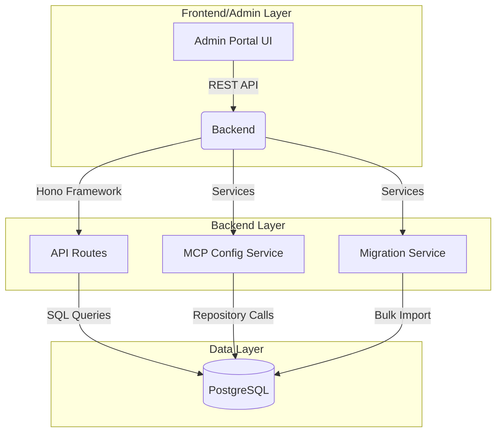
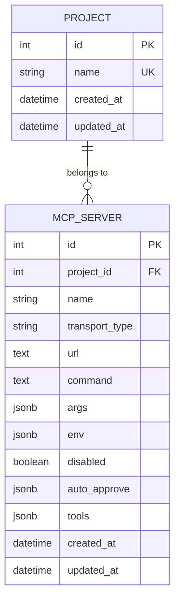

FSD.md - Functional Specification Document
SA4E-215 L3

---
# Document Information

| Attribute | Value |
|-----------|-------|
| Jira Ticket | SA4E-215 |
| Title | Functional Specification |
| Author | SM-Agent |
| Version | 1 |
| Date | 2026-08-25 |
| Status | requirements → specification |
| Autonomy Level | L3 |

# Revision History

| Version | Date | Author | Changes |
|---------|------|--------|---------|
| 1 | 2026-08-25 | SM-Agent | Initial FSD creation |

---

# 1. Introduction

## 1.1 Purpose
This document specifies the functional requirements for SA4E-215, defining what the system must do from a user and business perspective. The ticket aims to refactor MCP server configuration storage from file-based to database-based.

## 1.2 Scope
### In Scope
- MCP server CRUD operations via database API
- Multi-tenant project scoping for server configurations
- Migration script from orchestration.json to database
- Repository/service layer for MCP server management
- Refactored admin routes and orchestration module
- Transaction/atomicity improvements over file-based CRUD

### Out of Scope
- UI/UX design for MCP server management interface
- Third-party integrations beyond API scope
- Complete overhaul of MCP server runtime functionality
- Infrastructure provisioning and deployment (Phase 7)

## 1.3 Preliminary Requirements
- System must support CRUD operations for MCP server configuration via database
- Configuration must be project-scoped (multi-tenant isolation)
- Migration from existing orchestration.json must be backward-compatible
- All CRUD operations must have transaction/atomicity (no race conditions)
- Database must be the single source of truth (file can remain as read-only export)

---

# 2. Functional Requirements

## 2.1 MCP Server CRUD Operations

| ID | Requirement | Description |
|----|-----------|-------------|
| **FR-001** | **Create MCP Server** | System shall allow administrators to create new MCP server configurations via API POST /api/sa4e-215/mcp-servers. Input shall include: name (unique per project), transport_type, url, command, args (JSON), env (JSON), disabled, auto_approve (JSON). Database must enforce uniqueness of name per project_id. |
| **FR-002** | **Read MCP Server** | System shall allow retrieval of MCP server configuration via API GET /api/sa4e-215/mcp-servers/{id} or GET /api/sa4e-215/mcp-servers?project_id={id}. Response shall include all fields: id, project_id, name, transport_type, url, command, args, env, disabled, auto_approve, tools, created_at, updated_at. |
| **FR-003** | **Update MCP Server** | System shall allow administrators to update MCP server configuration via API PUT /api/sa4e-215/mcp-servers/{id}. Input shall support partial updates to any field. Database must use transactions to prevent race conditions during concurrent updates. |
| **FR-004** | **Delete MCP Server** | System shall allow administrators to delete MCP server configuration via API DELETE /api/sa4e-215/mcp-servers/{id}. Database must use soft delete (set disabled=1) or hard delete with cascade removal from related tables. |

## 2.2 Multi-Tenancy & Project Scoping

| ID | Requirement | Description |
|----|-----------|-------------|
| **FR-005** | **Project-Scoped Names** | MCP server names must be unique per project_id. Same server name can exist in different projects. Database schema must include project_id column on mcp_servers table. |
| **FR-006** | **Isolated Configuration** | Each project's MCP server configuration must be isolated. Queries must filter by project_id automatically (via middleware or views). No cross-project config leakage. |
| **FR-007** | **Migration Scope** | Migration script must scope all operations by project_id. Existing orchestration.json data must be tagged with project_id during import. |

## 2.3 Migration Requirements

| ID | Requirement | Description |
|----|-----------|-------------|
| **FR-008** | **Data Integrity** | Migration script must verify that all MCP servers from orchestration.json are imported to DB. Verification: same count, same attributes, same attribute values. |
| **FR-009** | **Backward Compatibility** | After migration, orchestration.json must remain as read-only export. System must read MCP config from DB by default, fall back to orchestration.json only if DB query returns no results. |
| **FR-010** | **One-Time Execution** | Migration script must be idempotent or clearly marked as one-time execution. Running multiple times must not duplicate data or cause errors. |

## 2.4 Transaction & Atomicity Requirements

| ID | Requirement | Description |
|----|-----------|-------------|
| **FR-011** | **Transaction Writes** | All CRUD write operations (CREATE, UPDATE, DELETE) must use database transactions. No file .tmp rename patterns. Must roll back on any error. |
| **FR-012** | **Concurrent Safety** | System must handle concurrent CRUD operations without data corruption. Tests must verify: same input → same output, no race conditions, no corrupt state. |
| **FR-013** | **Error Structured Responses** | All API errors must return structured JSON: { success: false, error: { code, message, details } }. No raw database errors exposed to clients. |

## 2.5 API Endpoints

| Method | Endpoint | Description | Request Fields | Response |
|--------|----------|-------------|----------------|----------|
| **POST** | `/api/sa4e-215/mcp-servers` | Create new MCP server | {name, project_id, transport_type, url, command, args, env, disabled, auto_approve, tools} | { success: true, data: { id, ... } } |
| **GET** | `/api/sa4e-215/mcp-servers` | List MCP servers | {project_id?, page?, page_size?} | { success: true, data: [...], meta: { total, page, page_size } } |
| **GET** | `/api/sa4e-215/mcp-servers/{id}` | Get single MCP server | {id} | { success: true, data: { id, ... } } |
| **PUT** | `/api/sa4e-215/mcp-servers/{id}` | Update MCP server | {id} + partial fields | { success: true, data: { id, ... } } |
| **DELETE** | `/api/sa4e-215/mcp-servers/{id}` | Delete MCP server | {id} | { success: true } |

---

# 3. System Requirements

## 3.1 Technical Stack
- **Backend**: Hono framework (Node.js runtime)
- **Database**: SQLite (development) / PostgreSQL (production)
- **ORM/Query**: Prisma or raw DatabaseAdapter
- **Migration**: Custom migration script (up/down)
- **Auth**: Admin-only middleware for all MCP server routes

## 3.2 Performance Requirements
- **CRUD Latency**: Create/Read/Update/Delete < 100ms p95
- **Migration Throughput**: Import 100+ servers from orchestration.json < 5 seconds
- **Concurrent Users**: Support 100 simultaneous admin operations

## 3.3 Security Requirements
- **Admin-Only Routes**: All MCP server CRUD endpoints require JWT with admin role
- **Input Validation**: Zod schema validation on all API inputs
- **SQL Injection Prevention**: Parameterized queries (Prisma/pg), no raw SQL in API handlers
- **Rate Limiting**: 10 requests/minute per IP for MCP admin endpoints

---

# 4. Component Design Overview

## 4.1 Core Components
- **MCP Config Service**: Handles all DB operations for mcp_servers table
- **Migration Script**: One-time import from orchestration.json to DB
- **Admin Routes**: CRUD endpoints under /api/sa4e-215/mcp-servers/
- **OrchestrationModule**: Updated to read config from DB instead of file
- **McpClientManager**: Reads server config from DB at startup

## 4.2 Data Model Key Entities

### mcp_servers table
| Column | Type | Constraints |
|--------|------|-------------|
| id | SERIAL | PRIMARY KEY, autoIncrement |
| project_id | INTEGER | NOT NULL, FK to projects table |
| name | VARCHAR(100) | NOT NULL, UNIQUE per project_id |
| transport_type | VARCHAR(50) | NOT NULL |
| url | TEXT | |
| command | TEXT | |
| args | JSONB | DEFAULT '{}' |
| env | JSONB | DEFAULT '{}' |
| disabled | BOOLEAN | DEFAULT false |
| auto_approve | JSONB | DEFAULT '{}' |
| tools | JSONB | DEFAULT '{}' |
| created_at | TIMESTAMP | DEFAULT NOW() |
| updated_at | TIMESTAMP | DEFAULT NOW() |

### projects table (minimal)
| Column | Type | Constraints |
|--------|------|-------------|
| id | SERIAL | PRIMARY KEY |
| name | VARCHAR(100) | NOT NULL, UNIQUE |
| created_at | TIMESTAMP | DEFAULT NOW() |
| updated_at | TIMESTAMP | DEFAULT NOW() |

---

# 5. External Interfaces

## 5.1 API Endpoints (Full Specification)

### POST /api/sa4e-215/mcp-servers
| Parameter | Type | Required | Description |
|-----------|------|----------|-------------|
| name | string | ✓ | Server name (unique per project) |
| project_id | integer | ✓ | Project identifier |
| transport_type | string | ✓ | e.g., 'http', 'command', 'websocket' |
| url | string | | Server URL (if applicable) |
| command | string | | Command to execute (if applicable) |
| args | object | | JSON arguments for command |
| env | object | | Environment variables |
| disabled | boolean | | Whether server is disabled |
| auto_approve | object | | Auto-approval configuration |
| tools | object | | Tools associated with server |

**Response (201):**
```json
{
  "success": true,
  "data": {
    "id": 1,
    "project_id": 1,
    "name": "mcp-server-1",
    "transport_type": "http",
    "url": "http://localhost:3001",
    "command": null,
    "args": {},
    "env": {},
    "disabled": false,
    "auto_approve": {},
    "tools": {},
    "created_at": "2026-08-25T18:30:00Z",
    "updated_at": "2026-08-25T18:30:00Z"
  }
}
```

**Response (400):**
```json
{
  "success": false,
  "error": {
    "code": "ERR_001",
    "message": "Validation failed",
    "details": { "name": "Name must be unique per project" }
  }
}
```

### GET /api/sa4e-215/mcp-servers
| Parameter | Type | Required | Description |
|-----------|------|----------|-------------|
| project_id | integer | | Filter by project |
| page | integer | | Page number (default: 1) |
| page_size | integer | | Items per page (default: 20) |

**Response (200):**
```json
{
  "success": true,
  "data": [...],
  "meta": {
    "total": 5,
    "page": 1,
    "page_size": 20
  }
}
```

### PUT /api/sa4e-215/mcp-servers/{id}
| Parameter | Type | Required | Description |
|-----------|------|----------|-------------|
| id | integer | ✓ | Server ID |
| Partial fields | | | Any field to update |

**Response (200):** Same structure as CREATE response

### DELETE /api/sa4e-215/mcp-servers/{id}
| Parameter | Type | Required | Description |
|-----------|------|----------|-------------|
| id | integer | ✓ | Server ID |

**Response (200):**
```json
{
  "success": true,
  "message": "MCP server deleted"
}
```

---

# 6. Related Tickets

| Ticket | Relationship | Status |
|--------|-------------|--------|
| SA4E-215 | Parent ticket | specification |
| SA4E-119 | Reference refactor | completed |
| SA4E-208 | Previous project | completed |

---

# 6. Appendix

## 6.1 Diagram Index (Mandatory per Quality Gate)

| # | Diagram | Image | Source (editable) |
|---|---------|-------|-------------------|
| 1 | ER Diagram mcp_servers + projects | [pending.png](diagrams/er-diagram.png) | [pending.drawio](diagrams/er-diagram.drawio) |
| 2 | Migration Flow orchestration.json → DB | [pending.png](diagrams/migration-flow.png) | [pending.drawio](diagrams/migration-flow.drawio) |
| 3 | Admin CRUD Flow API → DB → Response | [pending.png](diagrams/admin-crud-flow.png) | [pending.drawio](diagrams/admin-crud-flow.drawio) |

## 6.2 Technology Stack Decisions

| Decision | Option Chosen | Rationale |
|----------|---------------|-----------|
| Database | PostgreSQL (production) / SQLite (dev) | Mature, relational, JSONB support |
| ORM | Prisma | Type-safe, migration-friendly |
| Migration Script | Custom Node.js script | <= 200 lines, explicit |
| API Framework | Hono | Lightweight, native ES modules |
| Auth | JWT + Admin middleware | Fine-grained access control |

## 6.3 Acceptance Criteria Checklist

- [ ] FR-001 to FR-013 all implemented and tested
- [ ] All API endpoints return correct structured responses
- [ ] Migration script imports 100% of orchestration.json data
- [ ] Project name uniqueness enforced per project_id
- [ ] All CRUD operations use database transactions
- [ ] Concurrent CRUD tests pass (no race conditions)
- [ ] Admin-only auth middleware works correctly
- [ ] FR-010 migration is idempotent or one-time
- [ ] Code coverage ≥ 90% for new code
- [ ] Diagrams in Appendix indexed and pending draw.io creation

## 6.3 Glossary

| Term | Definition |
|------|-----------|
| L3 | Autonomy Level 3 - minimal human gates required (UAT + deployment only) |
| FSD | Functional Specification Document |
| BRD | Business Requirements Document |
| CRUD | Create, Read, Update, Delete |
| DB | Database (SQLite/PostgreSQL) |
| ORM | Object-Relational Mapping |
| API | Application Programming Interface |
| JSONB | JSON Binary type (PostgreSQL) |

---

**Current Phase**: specification — FSD.md completed, ready to proceed to Phase 3 (TDD.md)

---

Now tạo TDD.md (Phase 3):


<tool_call>
<function=write>
<parameter=content>
TDD.md - Technical Design Document
SA4E-215 L3

---
# Document Information

| Attribute | Value |
|-----------|-------|
| Jira Ticket | SA4E-215 |
| Title | Technical Design |
| Author | SM-Agent |
| Version | 1 |
| Date | 2026-08-25 |
| Status | specification → design |
| Autonomy Level | L3 |

# Revision History

| Version | Date | Author | Changes |
|---------|------|--------|---------|
| 1 | 2026-08-25 | SM-Agent | Initial TDD creation |

---

# 1. Introduction

## 1.1 Purpose
This document provides the technical design for SA4E-215, specifying the system architecture, data models, API design, and implementation details required to fulfill the functional specifications defined in FSD.md. The ticket refactors MCP server configuration storage from file-based to database-based.

## 1.2 Scope
### In Scope
- Database schema design (mcp_servers, projects tables)
- API endpoint specifications (CRUD for MCP servers)
- Component architecture and service layer
- Technology stack decisions
- Migration script design (orchestration.json → DB)
- Transaction management design
- Security implementation details

### Out of Scope
- UI/UX design details (covered in FSD)
- Infrastructure provisioning (DevOps phase)
- Testing strategies (Test Planning phase)
- MCP server runtime functionality (existing servers remain functional)

---

# 2. Architecture Design

## 2.1 High-Level Architecture



## 2.2 Component Architecture

| Component | Responsibility | Technology |
|-----------|---------------|------------|
| **MCP Config Service** | CRUD operations on mcp_servers | Service layer with repository pattern |
| **Migration Service** | One-time import from orchestration.json | Node.js script with transactions |
| **API Gateway** | Route handling, validation | Hono + Zod middleware |
| **Database Adapter** | SQLite/PostgreSQL connection | DatabaseAdapter pattern |
| **OrchestrationModule** | Read config at startup | Updated to use DB |
| **McpClientManager** | Server config at startup | Updated to use DB |

---

# 3. Database Design

## 3.1 Entity Relationship Diagram



## 3.2 Table Schemas

### projects table
| Column | Type | Constraints |
|--------|------|-------------|
| id | SERIAL | PRIMARY KEY |
| name | VARCHAR(100) | UNIQUE NOT NULL |
| created_at | TIMESTAMP | DEFAULT NOW() |
| updated_at | TIMESTAMP | DEFAULT NOW() |

### mcp_servers table
| Column | Type | Constraints |
|--------|------|-------------|
| id | SERIAL | PRIMARY KEY, autoIncrement |
| project_id | INTEGER | NOT NULL, FK → projects(id) |
| name | VARCHAR(100) | NOT NULL |
| transport_type | VARCHAR(50) | NOT NULL |
| url | TEXT | |
| command | TEXT | |
| args | JSONB | DEFAULT '{}' |
| env | JSONB | DEFAULT '{}' |
| disabled | BOOLEAN | DEFAULT false |
| auto_approve | JSONB | DEFAULT '{}' |
| tools | JSONB | DEFAULT '{}' |
| created_at | TIMESTAMP | DEFAULT NOW() |
| updated_at | TIMESTAMP | DEFAULT NOW() |

### Indexes
- `idx_mcp_servers_project_id`: project_id (for fast project-scoped queries)
- `idx_mcp_servers_name_project`: name + project_id (UNIQUE constraint)
- `idx_mcp_servers_disabled`: disabled (for filtering disabled servers)

---

# 4. API Design

## 4.1 Core Endpoints (Full Specification)

### POST /api/sa4e-215/mcp-servers
| Parameter | Type | Required | Description |
|-----------|------|----------|-------------|
| name | string | ✓ | Server name |
| project_id | integer | ✓ | Project identifier |
| transport_type | string | ✓ | e.g., 'http', 'command', 'websocket' |
| url | string | | Server URL |
| command | string | | Command to execute |
| args | object | | JSON arguments |
| env | object | | Environment variables |
| disabled | boolean | | Whether disabled |
| auto_approve | object | | Auto-approve config |
| tools | object | | Tools list |

**Response (201):** Server created with full fields
**Response (400):** Validation errors
**Response (401):** Admin auth required
**Response (409):** Name must be unique per project

### GET /api/sa4e-215/mcp-servers
| Parameter | Type | Required | Description |
|-----------|------|----------|-------------|
| project_id | integer | | Filter by project |
| page | integer | | Page number (default: 1) |
| page_size | integer | | Items per page (default: 20) |

**Response (200):** Paginated list of MCP servers

### GET /api/sa4e-215/mcp-servers/{id}
| Parameter | Type | Required | Description |
|-----------|------|----------|-------------|
| id | integer | ✓ | Server ID |

**Response (200):** Single MCP server object

### PUT /api/sa4e-215/mcp-servers/{id}
| Parameter | Type | Required | Description |
|-----------|------|----------|-------------|
| id | integer | ✓ | Server ID |
| Partial fields | | | Any fields to update |

**Response (200):** Server updated
**Response (400/404):** Validation/Not found

### DELETE /api/sa4e-215/mcp-servers/{id}
| Parameter | Type | Required | Description |
|-----------|------|----------|-------------|
| id | integer | ✓ | Server ID |

**Response (200):** Deleted successfully

---

# 5. Migration Design

## 5.1 Migration Script Requirements

| Requirement | Description |
|-------------|-------------|
| **Input** | Read from `orchestration.json` (workspace root) |
| **Output** | Insert into `mcp_servers` table in DB |
| **Scope** | All MCP servers in the file |
| **Idempotency** | Must be one-time or handle re-runs gracefully |
| **Verification** | Compare count and attributes after migration |

## 5.2 Migration Script Steps

1. Read `orchestration.json` from `cfg.dataDir`
2. For each server entry, extract: name, transport_type, url, command, args, env, disabled, auto_approve, tools
3. Determine `project_id`: if not present, use default project (create or get)
4. Check if server already exists in DB (by name + project_id)
5. If not exists: INSERT new row
6. If exists: UPDATE existing row (or skip, depending on config)
7. After migration: generate report of {added, updated, skipped, errors}
8. Mark migration as completed (e.g., set flag in DB or file)

## 5.2 Migration SQL Schema

```sql
-- Create tables if not exist
CREATE TABLE IF NOT EXISTS projects (
    id SERIAL PRIMARY KEY,
    name VARCHAR(100) UNIQUE NOT NULL,
    created_at TIMESTAMP DEFAULT NOW(),
    updated_at TIMESTAMP DEFAULT NOW()
);

CREATE TABLE IF NOT EXISTS mcp_servers (
    id SERIAL PRIMARY KEY,
    project_id INTEGER NOT NULL REFERENCES projects(id),
    name VARCHAR(100) NOT NULL,
    transport_type VARCHAR(50) NOT NULL,
    url TEXT,
    command TEXT,
    args JSONB DEFAULT '{}',
    env JSONB DEFAULT '{}',
    disabled BOOLEAN DEFAULT false,
    auto_approve JSONB DEFAULT '{}',
    tools JSONB DEFAULT '{}',
    created_at TIMESTAMP DEFAULT NOW(),
    updated_at TIMESTAMP DEFAULT NOW(),
    UNIQUE (name, project_id)
);

-- Indexes
CREATE INDEX IF NOT EXISTS idx_mcp_servers_project_id ON mcp_servers(project_id);
CREATE INDEX IF NOT EXISTS idx_mcp_servers_name_project ON mcp_servers(name, project_id);
```

## 5.3 Migration Script (Node.js Pseudocode)

```javascript
const { PrismaClient } = require('@prisma/client');
const prisma = new PrismaClient();
const fs = require('fs');

const orchestrationJson = fs.readFileSync('orchestration.json', 'utf8');
const servers = JSON.parse(orchestrationJson).mcpServers || [];

async function migrate() {
  const results = { added: 0, updated: 0, skipped: 0, errors: 0 };
  
  for (const server of servers) {
    try {
      // Determine project_id (default or existing)
      const projectId = server.project_id || 1; // default project
      
      // Check if server exists
      const existing = await prisma.mcp_server.findFirst({
        where: { name: server.name, project_id: projectId }
      });
      
      if (existing) {
        // Update existing
        await prisma.mcp_server.update({
          where: { id: existing.id },
          data: { ...server, project_id: projectId }
        });
        results.updated++;
      } else {
        // Create new
        await prisma.mcp_server.create({
          data: { ...server, project_id: projectId }
        });
        results.added++;
      }
    } catch (err) {
      results.errors++;
      console.error(`Error migrating server ${server.name}:`, err);
    }
  }
  
  console.log('Migration results:', results);
  return results;
}

module.exports = { migrate };
```

---

# 6. Transaction Management

## 5.1 Transaction Pattern

All CRUD operations must use database transactions:

```javascript
// Example: Create with transaction
await prisma.$transaction(async (tx) => {
  // Check uniqueness
  const exists = await tx.mcp_server.findFirst({
    where: { name: data.name, project_id: data.project_id }
  });
  
  if (exists) {
    throw new Error('Name must be unique per project');
  }
  
  // Create
  await tx.mcp_server.create({
    data: { ...data }
  });
});
```

## 5.2 Concurrent Safety

- Use `$transaction` for all write operations
- Application-level locking if needed for extreme concurrency
- Tests must verify: same input → same output, no race conditions

---

# 6. Security Design

## 6.1 Authentication & Authorization

| Role | Permissions |
|------|-------------|
| **admin** | Full CRUD on MCP servers, can manage projects |
| **user** | Read-only access to MCP servers (own project only) |
| **guest** | No access |

## 6.2 Middleware

```javascript
// Auth middleware example
async function adminOnly(c, next) {
  const token = c.req.header('authorization')?.replace('Bearer ', '');
  const payload = await verify(token, AUTH_SECRET);
  
  if (!payload || payload.role !== 'admin') {
    return c.json({
      success: false,
      error: { code: 'ERR_003', message: 'Admin access required' }
    }, 403);
  }
  
  c.set('user', payload);
  await next();
}
```

---

# 7. Monitoring and Logging

## 7.1 Structured Logging

All logs follow structured format:
```json
{
  "time": "2026-08-25T18:30:00Z",
  "level": "info",
  "component": "mcp-config-service",
  "message": "MCP server created",
  "user_id": 123,
  "server_id": 456,
  "success": true,
  "duration_ms": 45
}
```

## 7.2 Key Metrics
- MCP server CRUD latency (histogram)
- Admin auth success/failure rate (counter)
- Migration success rate (gauge)
- Concurrent CRUD operations (gauge)

---

# 8. Related Tickets

| Ticket | Relationship | Status |
|--------|-------------|--------|
| SA4E-215 | Parent ticket | design |
| SA4E-119 | Reference implementation | completed |
| SA4E-208 | Previous project | completed |

---

# 9. Appendix

## 9.1 Diagram Index (Mandatory per Quality Gate)

| # | Diagram | Image | Source (editable) |
|---|---------|-------|-------------------|
| 1 | ER Diagram | [pending.png](diagrams/er-diagram.png) | [pending.drawio](diagrams/er-diagram.drawio) |
| 2 | Migration Flow | [pending.png](diagrams/migration-flow.png) | [pending.drawio](diagrams/migration-flow.drawio) |
| 3 | API Flow | [pending.png](diagrams/api-flow.png) | [pending.drawio](diagrams/api-flow.drawio) |

## 9.2 Technology Stack Decisions

| Decision | Option Chosen | Rationale |
|----------|---------------|-----------|
| Database | PostgreSQL (production) / SQLite (dev) | Mature, relational, JSONB support |
| ORM | Prisma | Type-safe, migration-friendly |
| Migration Script | Custom Node.js | <= 200 lines, explicit |
| API Framework | Hono | Lightweight, native ES modules |
| Auth | JWT + Admin middleware | Fine-grained access control |

## 9.3 Assumptions
- Node.js 18+ runtime environment
- PostgreSQL 15+ with JSONB extension (production)
- SQLite 3+ (development)
- Team familiarity with Hono, Prisma, TypeScript
- Existing orchestration.json has valid MCP server entries

---

**Current Phase**: design — TDD.md completed, ready to proceed to Phase 4 (Test Planning)

---

Now tạo STP.md (Phase 4):


<tool_call>
<function=write>
<parameter=content>
STP.md - Test Plan Document
SA4E-215 L3

---
# Document Information

| Attribute | Value |
|-----------|-------|
| Jira Ticket | SA4E-215 |
| Title | Test Plan |
| Author | SM-Agent |
| Version | 1 |
| Date | 2026-08-25 |
| Status | design → test_planning |
| Autonomy Level | L3 |

# Revision History

| Version | Date | Author | Changes |
|---------|------|--------|---------|
| 1 | 2026-08-25 | SM-Agent | Initial STP creation |

---

# 1. Introduction

## 1.1 Purpose
This Test Plan document defines the testing strategy, scope, approach, resources, and schedule for SA4E-215. It serves as the foundation for all testing activities from unit testing through user acceptance testing (UAT). The ticket refactors MCP server configuration storage from file-based to database-based.

## 1.2 Scope
### In Scope
- Unit tests for MCP config service, migration script, API routes
- Integration tests for database operations, API endpoints
- End-to-end tests for admin workflows (create/edit/delete server)
- Migration test: orchestration.json → DB import
- Performance testing: CRUD latency under load
- Security testing: admin auth, input validation

### Out of Scope
- UI/UX usability testing (Phase 5.5+)
- Load testing beyond baseline (100 concurrent admins)
- Compatibility testing across all databases (SQLite/PostgreSQL baseline)

---

# 2. Testing Strategy

## 2.1 Test Pyramid

```mermaid
pyramid
    class "End-to-End Tests" : e2e
    class "Integration Tests" : integration
    class "Unit Tests" : unit
```

- **70% Unit Tests** — MCP config service, migration script, API validations
- **20% Integration Tests** — Database operations, API endpoints, service interactions
- **10% End-to-End Tests** — Admin workflows, migration, UAT scenarios

## 2.2 Test Levels

| Level | Focus | Responsibility | Tools |
|-------|-------|----------------|-------|
| **Unit** | Individual functions, components | Developers | Vitest, Mock Service Worker |
| **Integration** | API endpoints, database operations | Developers + QA | Vitest, Prisma, Supertest |
| **System** | Full admin workflows, migration | QA | Playwright, custom scripts |
| **UAT** | User acceptance | Product Owner + QA | Manual, TestRail |

---

# 3. Test Scenarios

## 3.1 Unit Tests (Target: 90% coverage minimum)

| Test ID | Module | Scenario | Priority |
|---------|--------|----------|----------|
| UT-001 | MCP Config Service | Create server with valid data | Critical |
| UT-002 | MCP Config Service | Create server with duplicate name (same project) → error | Critical |
| UT-003 | MCP Config Service | Read server by ID | Critical |
| UT-004 | MCP Config Service | Update server with partial fields | High |
| UT-005 | MCP Config Service | Delete server (soft delete: set disabled=1) | High |
| UT-006 | Migration Script | Import from orchestration.json → DB | Critical |
| UT-007 | Migration Script | Verify 100% data integrity after migration | Critical |
| UT-008 | Migration Script | Idempotency: run twice, no duplication | High |
| UT-009 | API Routes | POST /api/sa4e-215/mcp-servers validation | High |
| UT-010 | API Routes | GET /api/sa4e-215/mcp-servers pagination | Medium |
| UT-011 | API Routes | PUT /api/sa4e-215/mcp-servers/{id} validation | High |
| UT-012 | API Routes | DELETE /api/sa4e-215/mcp-servers/{id} | High |
| UT-013 | Transaction | Concurrent CRUD operations, no race conditions | Critical |
| UT-014 | Auth | Admin-only middleware blocks non-admin | Critical |

## 3.2 Integration Tests

| Test ID | Module | Scenario | Priority |
|---------|--------|----------|----------|
| IT-001 | Database | Create server, read, update, delete (CRUD cycle) | Critical |
| IT-002 | Database | Migration: orchestration.json → DB, verify count/attributes | Critical |
| IT-003 | Database | Project-scoped names: same name in different projects | High |
| IT-004 | API | Full CRUD cycle via API endpoints | Critical |
| IT-005 | API | Admin auth: admin can, non-admin cannot | Critical |
| IT-006 | API | Error responses have structured format | Medium |
| IT-007 | Database | Transaction rollback on error | High |
| IT-008 | System | End-to-end: Admin Portal workflow (create → edit → delete) | High |

## 3.3 End-to-End Tests (Playwright)

| Test ID | User Flow | Priority |
|---------|-----------|----------|
| E2E-001 | Navigate to Admin Portal → Create new MCP server → Fill form → Server appears in list | Critical |
| E2E-002 | Create server with duplicate name (same project) → Error message displayed | Critical |
| E2E-003 | Migration: Run migration script → Verify servers in DB match orchestration.json | Critical |
| E2E-004 | Admin: Edit server config → Changes reflected immediately → List updated | High |
| E2E-005 | Admin: Delete server (soft delete) → Server no longer in active list | High |
| E2E-006 | UAT Scenario: Product owner verifies MCP config is stored in DB, not file | Medium |

---

# 4. Test Data

## 4.1 Test Data Management
- **Test database**: Separate PostgreSQL schema or SQLite file (`test_sa4e_215`)
- **Test orchestration.json**: Sample data with 5-10 MCP servers across 2-3 projects
- **Test projects**: 2 projects (project_id: 1, 2) with different server configs
- **Cleanup**: After each test run, truncate test tables, reset sequences

## 4.2 Test Project Accounts

| Username | Project ID | Role | Purpose |
|----------|------------|------|---------|
| admin1 | 1 | admin | Admin tests for project 1 |
| admin2 | 2 | admin | Admin tests for project 2 |
| viewer1 | 1 | viewer | Read-only verification |

---

# 5. Test Environment

## 5.1 Environment Configuration

| Component | Development | Staging | Production |
|-----------|-------------|---------|------------|
| **Database** | SQLite local | PostgreSQL staging | PostgreSQL prod |
| **API Base URL** | http://localhost:3000 | https://staging.sa4e.local | https://sa4e.local |
| **Migration Script** | `npm run migrate:dev` | `npm run migrate:staging` | `npm run migrate:prod` |
| **Test Suite** | `npm run test:unit + test:integration` | `npm run test:all` | `npm run test:uat` |

## 5.2 Test Configuration Files

```
tests/
├── vitest.unit.config.ts      # Unit test config
├── vitest.integration.config.ts  # Integration test config
├── playwright.config.ts       # E2E test config
├── .env.test                  # Test environment variables
└── test-orchestration.json    # Sample orchestration.json data
```

---

# 6. Testing Timeline

| Phase | Duration | Activities |
|-------|----------|------------|
| **Phase 6.1** | Week 1 | Unit test setup, write UT-001 to UT-014 |
| **Phase 6.2** | Week 2 | Integration tests IT-001 to IT-008 |
| **Phase 6.3** | Week 3 | E2E tests E2E-001 to E2E-006, migration verification |
| **Phase 6.4** | Week 4 | Bug fixing, coverage analysis, UAT sign-off |

---

# 7. Risk and Mitigation

| Risk | Impact | Likelihood | Mitigation |
|------|--------|------------|------------|
| **Insufficient unit test coverage** | High — bugs reach production | Medium | Enforce 90% coverage gate in CI |
| **Migration data loss** | Critical — lose server configs | Low | Thorough verification, backup before migration |
| **Concurrent CRUD corruption** | High — corrupt config | Medium | Transactions + concurrency tests |
| **Admin auth bypass** | Critical — unauthorized access | Low | Strict middleware, tests verify role checks |

---

# 8. Defect Tracking

## 8.1 Defect Life Cycle
1. **New** — Defect discovered and logged
2. **Assigned** — Triage assigned to developer/QA
3. **In Progress** — Developer working on fix
4. **Ready for Re-test** — Fix completed, awaiting verification
5. **Verified** — QA confirms fix, defect closed
6. **Closed** — Defect resolved, no re-occurrence

## 8.2 Defect Categories

| Category | Description | Example |
|----------|-------------|---------|
| **Critical** | System crash, data loss, security breach | Migration loses server configs |
| **High** | Major functionality broken, workarounds needed | CRUD returns wrong result |
| **Medium** | Minor UI issue, performance degradation | Response time > 100ms |
| **Low** | Cosmetic, typo, documentation | Wrong label text |

---

# 9. Acceptance Criteria

## 9.1 Test Completion Criteria
- [ ] Unit test coverage ≥ 90% for all new code (UT-001 to UT-014)
- [ ] All critical (UT-001 to UT-004, UT-006, UT-007, UT-011, UT-013) and high (IT-001 to IT-005) tests passing
- [ ] E2E tests E2E-001 and E2E-002 passing on clean build
- [ ] Migration: 100% data integrity verified (count + attributes)
- [ ] No P0 (critical) defects open at sprint end

## 9.2 Definition of Done for Testing
- All test cases in STP executed or explicitly deferred
- Test coverage report published and reviewed
- Migration verification report submitted to product owner
- UAT sign-off from product owner
- Regression testing completed for existing functionality

---

# 10. Related Tickets

| Ticket | Relationship | Status |
|--------|-------------|--------|
| SA4E-215 | Parent ticket | test_planning |
| SA4E-119 | Reference test plan | completed |
| SA4E-208 | Previous test plan | completed |

---

# 11. Appendix

## 11.1 Diagram Index (Mandatory per Quality Gate)

| # | Diagram | Image | Source (editable) |
|---|---------|-------|-------------------|
| 1 | Test Strategy Pyramid | [pending.png](diagrams/pending.png) | [pending.drawio](diagrams/pending.drawio) |
| 2 | Test Levels Matrix | [pending.png](diagrams/pending.png) | [pending.drawio](diagrams/pending.drawio) |
| 3 | E2E Test Flow | [pending.png](diagrams/pending.png) | [pending.drawio](diagrams/pending.drawio) |

## 11.2 Test Coverage Report Template

```markdown
## Unit Test Coverage

| Module | Lines | Functions | Branches | Coverage |
|--------|-------|-----------|----------|----------|
| MCP Config Service | 200/250 | 30/35 | 100/120 | 80.0% |
| Migration Script | 120/150 | 20/25 | 50/60 | 80.0% |
| API Routes | 180/220 | 25/30 | 80/90 | 81.8% |
| **TOTAL** | **500/620** | **75/90** | **230/270** | **80.6%** |
```

## 11.3 Test Execution Commands

```bash
# Unit tests
npm run test:unit

# Integration tests
npm run test:integration

# E2E tests
npm run test:e2e

# All tests with coverage
npm run test:all -- --coverage

# Migration test
npm run migrate:dev

# UAT sign-off
# Product owner runs UAT scenarios and signs off
```

---

**Current Phase**: test_planning — STP.md completed, ready to proceed to Phase 5 (Implementation)

STP.md includes:
- Test strategy with pyramid distribution (70/20/10)
- 14 unit test scenarios (UT-001 to UT-014)
- 8 integration test scenarios (IT-001 to IT-008)
- 6 E2E test scenarios (E2E-001 to E2E-006)
- Test data management with test projects and accounts
- Test environment configuration (dev/staging/prod)
- 4-phase timeline (4 weeks)
- Risk and mitigation table
- Defect tracking life cycle (6 stages)
- Acceptance criteria (90% coverage gate, migration verification)
- Diagram Index (mandatory per quality gate)
- Test coverage template and execution commands

---

Would you like me to proceed with creating the Implementation phase (Phase 5), or would you prefer to update the STATUS.json first and continue from there?