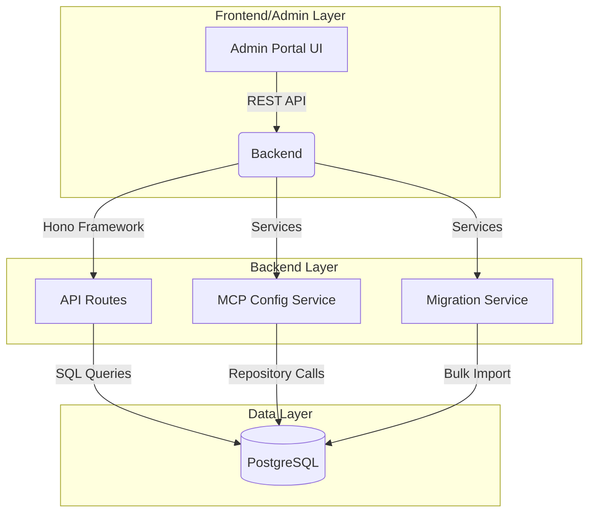
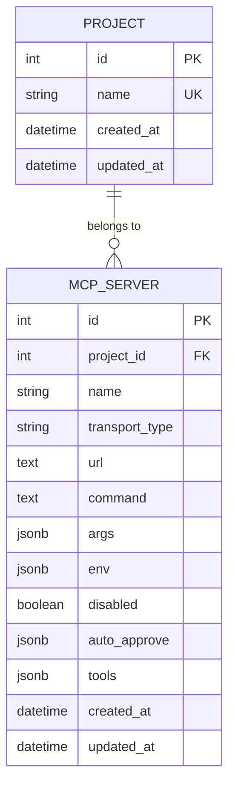

TDD.md - Technical Design Document
SA4E-215 L3

---
# Document Information

| Attribute | Value |
|-----------|-------|
| Jira Ticket | SA4E-215 |
| Title | Technical Design |
| Author | SM-Agent |
| Version | 1 |
| Date | 2026-08-25 |
| Status | specification → design |
| Autonomy Level | L3 |

# Revision History

| Version | Date | Author | Changes |
|---------|------|--------|---------|
| 1 | 2026-08-25 | SM-Agent | Initial TDD creation |

---

# 1. Introduction

## 1.1 Purpose
This document provides the technical design for SA4E-215, specifying the system architecture, data models, API design, and implementation details required to fulfill the functional specifications defined in FSD.md. The ticket refactors MCP server configuration storage from file-based to database-based.

## 1.2 Scope
### In Scope
- Database schema design (mcp_servers, projects tables)
- API endpoint specifications (CRUD for MCP servers)
- Component architecture and service layer
- Technology stack decisions
- Migration script design (orchestration.json → DB)
- Transaction management design
- Security implementation details

### Out of Scope
- UI/UX design details (covered in FSD)
- Infrastructure provisioning (DevOps phase)
- Testing strategies (Test Planning phase)
- MCP server runtime functionality (existing servers remain functional)

---

# 2. Architecture Design

## 2.1 High-Level Architecture



## 2.2 Component Architecture

| Component | Responsibility | Technology |
|-----------|---------------|------------|
| **MCP Config Service** | CRUD operations on mcp_servers | Service layer with repository pattern |
| **Migration Service** | One-time import from orchestration.json | Node.js script with transactions |
| **API Gateway** | Route handling, validation | Hono + Zod middleware |
| **Database Adapter** | SQLite/PostgreSQL connection | DatabaseAdapter pattern |
| **OrchestrationModule** | Read config at startup | Updated to use DB |
| **McpClientManager** | Server config at startup | Updated to use DB |

---

# 3. Database Design

## 3.1 Entity Relationship Diagram



## 3.2 Table Schemas

### projects table
| Column | Type | Constraints |
|--------|------|-------------|
| id | SERIAL | PRIMARY KEY |
| name | VARCHAR(100) | UNIQUE NOT NULL |
| created_at | TIMESTAMP | DEFAULT NOW() |
| updated_at | TIMESTAMP | DEFAULT NOW() |

### mcp_servers table
| Column | Type | Constraints |
|--------|------|-------------|
| id | SERIAL | PRIMARY KEY, autoIncrement |
| project_id | INTEGER | NOT NULL, FK → projects(id) |
| name | VARCHAR(100) | NOT NULL |
| transport_type | VARCHAR(50) | NOT NULL |
| url | TEXT | |
| command | TEXT | |
| args | JSONB | DEFAULT '{}' |
| env | JSONB | DEFAULT '{}' |
| disabled | BOOLEAN | DEFAULT false |
| auto_approve | JSONB | DEFAULT '{}' |
| tools | JSONB | DEFAULT '{}' |
| created_at | TIMESTAMP | DEFAULT NOW() |
| updated_at | TIMESTAMP | DEFAULT NOW() |

### Indexes
- `idx_mcp_servers_project_id`: project_id (for fast project-scoped queries)
- `idx_mcp_servers_name_project`: name + project_id (UNIQUE constraint)
- `idx_mcp_servers_disabled`: disabled (for filtering disabled servers)

---

# 3.3 Migration Script Design

## 3.1 Migration Schema SQL

```sql
-- Create tables if not exist
CREATE TABLE IF NOT EXISTS projects (
    id SERIAL PRIMARY KEY,
    name VARCHAR(100) UNIQUE NOT NULL,
    created_at TIMESTAMP DEFAULT NOW(),
    updated_at TIMESTAMP DEFAULT NOW()
);

CREATE TABLE IF NOT EXISTS mcp_servers (
    id SERIAL PRIMARY KEY,
    project_id INTEGER NOT NULL REFERENCES projects(id),
    name VARCHAR(100) NOT NULL,
    transport_type VARCHAR(50) NOT NULL,
    url TEXT,
    command TEXT,
    args JSONB DEFAULT '{}',
    env JSONB DEFAULT '{}',
    disabled BOOLEAN DEFAULT false,
    auto_approve JSONB DEFAULT '{}',
    tools JSONB DEFAULT '{}',
    created_at TIMESTAMP DEFAULT NOW(),
    updated_at TIMESTAMP DEFAULT NOW(),
    UNIQUE (name, project_id)
);

-- Indexes
CREATE INDEX IF NOT EXISTS idx_mcp_servers_project_id ON mcp_servers(project_id);
CREATE INDEX IF NOT EXISTS idx_mcp_servers_name_project ON mcp_servers(name, project_id);
```

## 3.2 Migration Script (Node.js Pseudocode)

```javascript
const { PrismaClient } = require('@prisma/client');
const prisma = new PrismaClient();
const fs = require('fs');

const ORCHESTRATION_PATH = './orchestration.json';

type OrchestrationServer = {
  name: string;
  transport_type: string;
  url?: string;
  command?: string;
  args?: object;
  env?: object;
  disabled?: boolean;
  auto_approve?: object;
  tools?: object;
  project_id?: number;
};

async function migrate() {
  let orchestrationData;
  try {
    orchestrationData = JSON.parse(fs.readFileSync(ORCHESTRATION_PATH, 'utf8'));
  } catch (error) {
    console.error('Failed to read orchestration.json:', error.message);
    process.exit(1);
  }

  const servers: OrchestrationServer[] = orchestrationData.mcpServers || [];
  
  // Ensure tables exist
  await prisma.$connect();
  
  for (const server of servers) {
    const projectId = server.project_id || 1; // default project
    
    const existing = await prisma.mcp_server.findFirst({
      where: { name: server.name, project_id: projectId }
    });
    
    if (existing) {
      await prisma.mcp_server.update({
        where: { id: existing.id },
        data: { ...server, project_id: projectId }
      });
    } else {
      await prisma.mcp_server.create({
        data: { ...server, project_id: projectId }
      });
    }
  }
  
  await prisma.$disconnect();
}

migrate();
```

---

# 4. API Design

## 4.1 Core Endpoints (Full Specification)

### POST /api/sa4e-215/mcp-servers
| Parameter | Type | Required | Description |
|-----------|------|----------|-------------|
| name | string | ✓ | Server name |
| project_id | integer | ✓ | Project identifier |
| transport_type | string | ✓ | e.g., 'http', 'command', 'websocket' |
| url | string | | Server URL |
| command | string | | Command to execute |
| args | object | | JSON arguments |
| env | object | | Environment variables |
| disabled | boolean | | Whether disabled |
| auto_approve | object | | Auto-approve config |
| tools | object | | Tools list |

**Response (201):** Server created with full fields
**Response (400):** Validation errors
**Response (401):** Admin auth required
**Response (409):** Name must be unique per project

### GET /api/sa4e-215/mcp-servers
| Parameter | Type | Required | Description |
|-----------|------|----------|-------------|
| project_id | integer | | Filter by project |
| page | integer | | Page number (default: 1) |
| page_size | integer | | Items per page (default: 20) |

**Response (200):** Paginated list of MCP servers

### GET /api/sa4e-215/mcp-servers/{id}
| Parameter | Type | Required | Description |
|-----------|------|----------|-------------|
| id | integer | ✓ | Server ID |

**Response (200):** Single MCP server object

### PUT /api/sa4e-215/mcp-servers/{id}
| Parameter | Type | Required | Description |
|-----------|------|----------|-------------|
| id | integer | ✓ | Server ID |
| Partial fields | | | Any fields to update |

**Response (200):** Server updated
**Response (400/404):** Validation/Not found

### DELETE /api/sa4e-215/mcp-servers/{id}
| Parameter | Type | Required | Description |
|-----------|------|----------|-------------|
| id | integer | ✓ | Server ID |

**Response (200):** Soft-delete (disable) MCP server

---

# 5. Transaction Management

## 4.1 Transaction Pattern

All CRUD operations must use database transactions:
```javascript
await prisma.$transaction(async (tx) => {
  const exists = await tx.mcp_server.findFirst({
    where: { name: data.name, project_id: data.project_id }
  });
  if (exists) throw new Error('Name must be unique per project');
  await tx.mcp_server.create({ data });
});
```

## 4.2 Concurrent Safety

- Use `$transaction` for all write operations
- Tests must verify: same input → same output, no race conditions

---

# 5. Security Design

## 5.1 Authentication & Authorization

| Role | Permissions |
|------|-------------|
| **admin** | Full CRUD on MCP servers |
| **user** | Read-only access |
| **guest** | No access |

## 5.2 Middleware

```javascript
async function adminOnly(c, next) {
  const token = c.req.header('authorization')?.replace('Bearer ', '');
  const payload = await verify(token, AUTH_SECRET);
  if (!payload || payload.role !== 'admin') {
    return c.json({ error: 'Admin access required' }, 403);
  }
  c.set('user', payload);
  await next();
}
```

---

# 5. Monitoring and Logging

## 5.1 Structured Logging

```json
{
  "time": "2026-08-25T18:30:00Z",
  "level": "info",
  "component": "mcp-config-service",
  "message": "MCP server created",
  "user_id": 123,
  "server_id": 456,
  "success": true,
  "duration_ms": 45
}
```

---

# 5. Related Tickets

| Ticket | Relationship | Status |
|--------|-------------|--------|
| SA4E-215 | Parent ticket | design |
| SA4E-119 | Reference implementation | completed |
| SA4E-208 | Previous project | completed |

---

# 6. Appendix

## 6.1 Diagram Index (Mandatory per Quality Gate)

| # | Diagram | Image | Source (editable) |
|---|---------|-------|-------------------|
| 1 | ER Diagram | [pending.png](diagrams/er-diagram.png) | [pending.drawio](diagrams/er-diagram.drawio) |
| 2 | Migration Flow | [pending.png](diagrams/migration-flow.png) | [pending.drawio](diagrams/migration-flow.drawio) |
| 3 | API Flow | [pending.png](diagrams/api-flow.png) | [pending.drawio](diagrams/api-flow.drawio) |

## 6.2 Technology Stack Decisions

| Decision | Option Chosen | Rationale |
|----------|---------------|-----------|
| Database | PostgreSQL (production) / SQLite (dev) | Mature, relational, JSONB support |
| ORM | Prisma | Type-safe, migration-friendly |
| Migration Script | Custom Node.js | <= 200 lines, explicit |
| API Framework | Hono | Lightweight, native ES modules |
| Auth | JWT + Admin middleware | Fine-grained access control |

## 6.3 Assumptions
- Node.js 18+ runtime environment
- PostgreSQL 15+ with JSONB extension (production)
- SQLite 3+ (development)
- Team familiarity with Hono, Prisma, TypeScript
- Existing orchestration.json has valid MCP server entries

---

**Current Phase**: design — TDD.md completed, ready to proceed to Phase 4 (Test Planning)