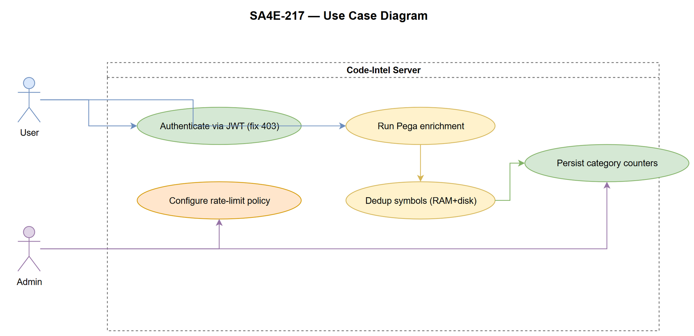
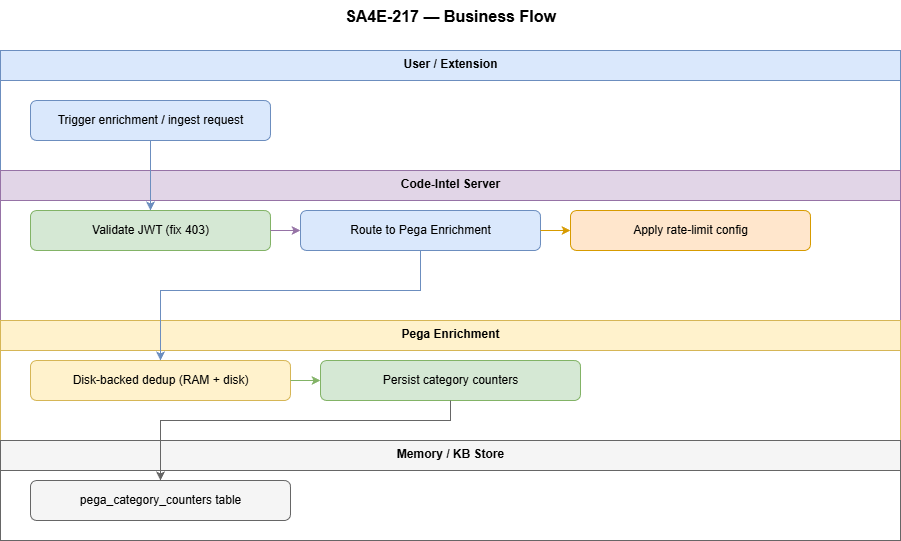

# Business Requirements Document (BRD)

## SA4E-217: Fix enrichment 403 (remote server) + rate limit cau hinh web-admin + toi uu bo nho Pega indexing

---

## Document Information

| Field | Value |
|-------|-------|
| Jira Ticket | SA4E-217 |
| Title | Fix enrichment 403 (remote server) + rate limit cau hinh web-admin + toi uu bo nho Pega indexing |
| Author | BA Agent |
| Version | 1.0 |
| Date | 2026-08-26 |
| Status | Draft |

---

## Revision History

| Version | Date | Author | Changes |
|---------|------|--------|---------|
| 1.0 | 2026-08-26 | BA Agent | Initiate document — auto-generated from Jira ticket SA4E-217 and linked tickets |

---

## Sign-Off

| Name | Signature and date |
|------|--------------------|
| | ☐ I agree and confirm all criteria on this BRD as expected requirements |
| | ☐ I agree and confirm all criteria on this BRD as expected requirements |

---

## 1. Introduction

### 1.1 Scope

This BRD addresses the enrichment pipeline improvements for the SA4E project, specifically:
- Fixing 403 access errors when the Extension calls the backend from remote/Docker environments.
- Configuring rate limiting via web admin without requiring server restart.
- Optimizing memory usage during large-scale Pega rulebase indexing through deduplication sets, hash caches, and category counters.

The changes apply to the Extension (VS Code) and Backend services responsible for Pega rule indexing and LLM enrichment.

### 1.2 Out of Scope

- Changing the Pega server-side harness rendering logic.
- Implementing a new manual "Index Pega Rule Schema" command (already removed).
- Browser-based harness inspection (PegaBrowserInspector — superseded).
- Modifying the core BFS indexer flow beyond hook points for schema creation.
- Adding new API endpoints outside the existing `/api/v1/` prefix.

### 1.3 Preliminary Requirements

| # | Prerequisite | Status |
|---|-------------|--------|
| 1 | Backend API endpoint `/api/v1/enrichment/status` exists and returns 200 for local host | Done (verified in SA4E-217 description) |
| 2 | Extension HTTP client supports token-based authentication for remote servers | Partially done — refresh token logic needed |
| 3 | Rate limiter configuration stored in DB and survive restart | Done (SA4E-217 includes rate-limiter module) |
| 4 | DiskBackedSet implementation for dedup and hash-cache | Done (SA4E-217 includes DiskBackedSet) |
| 5 | Pega server credentials configured with valid JWT token flow | To be confirmed |
| 6 | Backend KB (mem_ingest/mem_search) operational | Done |

---

## 2. Business Requirements

### 2.1 High Level Process Map

The system implements a **three-part improvement pipeline**:

1. **403 Fix Tier**: Modify middleware from `localhostOnly` to scope-guarded routes (`/threads*`, `/agents`) and add JWT auth to `GET /api/v1/enrichment/status`; extend extension to refresh token on 401 and retry.

2. **Rate Limit Tier**: Configure server-side maxRPM via web admin UI (section rateLimit), persist to DB, broadcast `RATE_LIMIT_CONFIG_CHANGED` via EventBus for runtime reload; client sends `X-Rate-Limit-RPM` header; client rate = min(client, server hard cap).

3. **Memory Optimisation Tier**: Use `DiskBackedSet` for dedup membership (100% accuracy), RAM hot-tier with spill-to-disk, bounded memory config `kiroSdlc.pega.dedupMaxInMemory`, category counters moved to DB COUNT, prune `.pega-hash-cache.json` after each index, remove in-memory categoryCounters.

### 2.2 List of User Stories / Use Cases

| # | Story / Use Case | Priority | Source Ticket |
|---|------------------|----------|---------------|
| 1 | As a developer, I want to fix 403 access error when the Extension calls the backend from a remote/Docker server, so that enrichment works across machines. | MUST HAVE | SA4E-217 |
| 2 | As an admin, I want to configure rate limit via web admin (maxRPM) without restarting the server, so that production is not impacted during hot-reload. | MUST HAVE | SA4E-217 |
| 3 | As a system, I want incremental memory optimization during Pega rulebase indexing (dedup set, hash-cache, category counters), so that large rulebases perform efficiently. | SHOULD HAVE | SA4E-217 |

---

### 2.3 Details of User Stories

#### STORY 1: Fix 403 Error for Remote Server Calls

> As a developer, I want to fix 403 access error when the Extension calls the backend from a remote/Docker server, so that enrichment works across machines.

**Requirement Details:**

1. The Extension must send a valid JWT token with every API call to the backend.
2. The backend must have JWT auth guard on `GET /api/v1/enrichment/status` route (scope `/threads*`, `/agents` instead of `*`).
3. If the Extension receives 401, it must refresh the token using a refresh token flow and retry the request once.
4. Middleware `localhostOnly` must be removed from the enrichment routes; replace with scope-based guard.
5. All extension->backend HTTP calls must include an `Authorization: Bearer <token>` header.

**Acceptance Criteria:**

1. Given the Extension running in a Docker container, when it calls `GET /api/v1/enrichment/status`, then the response is 200 (not 403).
2. Given an expired token, when the Extension receives 401, then it refreshes the token and retries successfully.
3. Given the new route guard, when a request hits `GET /api/v1/enrichment/status` without a valid token, then the response is 401.
4. The `localhostOnly` middleware is removed from the enrichment route definitions.

**Data Fields (if applicable):**

| Field | Type | Required | Description | Example |
|-------|------|----------|-------------|---------|
| `token` | string | Yes | JWT access token for auth | `eyJhbGciOiJIUzI1NiIsInR5cCI6IkpXVCJ9...` |
| `refreshToken` | string | Yes | Token used to obtain new access token | `abc.def.hij...` |
| `tokenExpiry` | datetime | Yes | Expiry time of access token | `2026-08-26T14:00:00Z` |

**Validation Rules:**

- Token must not be older than 5 minutes (freshness check).
- Refresh token must be stored securely in extension storage.

**Error Handling:**

- If refresh fails after 3 attempts, log error and disable further enrichment calls until manual token renewal.
- If 403 persists after token refresh, return error to user with message "Enrichment auth failed — contact admin".

---

#### STORY 2: Rate Limit Config via Web Admin (No Restart)

> As an admin, I want to configure rate limit via web admin (maxRPM) without restarting the server, so that production is not impacted during hot-reload.

**Requirement Details:**

1. Web admin UI must expose a section to set `maxRPM` for the rate limiter; value persisted to DB.
2. On config change, the server must broadcast `RATE_LIMIT_CONFIG_CHANGED` event via EventBus.
3. Runtime rate limiter must reload the new `maxRPM` from DB without process restart.
4. Client (Extension) must send `X-Rate-Limit-RPM` header with each request; client rate = min(client configured, server hard cap).
5. Server hard cap must be configurable and stored in DB; default 100 RPM per IP.

**Acceptance Criteria:**

1. Given the admin sets maxRPM to 200 via web admin, then the rate limiter enforces ≤200 requests per minute per IP.
2. Given config change, when a new request comes in, then the rate limiter uses the updated maxRPM without server restart.
3. Given the client sends `X-Rate-Limit-RPM: 150`, when the server hard cap is 100, then the request is limited to 100 RPM.
4. The web admin UI reflects the current maxRPM value and allows editing.

**Data Fields:**

| Field | Type | Required | Description | Example |
|-------|------|----------|-------------|---------|
| `maxRPM` | number | Yes | Max requests per minute per IP (server config) | `200` |
| `clientRPM` | number | Yes | Client-configured RPM (optional) | `150` |
| `hardCap` | number | Yes | Absolute hard cap enforced by server | `100` |

**Validation Rules:**

- `maxRPM` must be integer ≥ 1.
- `clientRPM` must be ≤ `hardCap` if both set.

**Error Handling:**

- If admin sets invalid `maxRPM` (e.g., negative), UI shows validation error and does not persist.
- If client RPM exceeds hard cap, server automatically downgrades to hard cap and logs warning.

---

#### STORY 3: Memory Optimization for Large Pega Rulebase Indexing

> As a system, I want incremental memory optimization during Pega rulebase indexing (dedup set, hash-cache, category counters), so that large rulebases perform efficiently.

**Requirement Details:**

1. Use `DiskBackedSet` for dedup membership with 100% accuracy, supporting RAM hot-tier with spill-to-disk.
2. Configure `kiroSdlc.pega.dedupMaxInMemory` to limit in-memory entries; entries exceeding limit spill to disk.
3. Prune `.pega-hash-cache.json` after each index session: remove entries for rules that have been deleted or renamed.
4. Move category counters from in-memory to DB COUNT (0 RAM overhead), computed on-demand via `COUNT` query.
5. Retain a lightweight in-memory cache for frequently accessed rules (configurable size).

**Acceptance Criteria:**

1. Given indexing 10,000 Pega rules, the DiskBackedSet maintains dedup correctness without OOM.
2. Given `dedupMaxInMemory` set to 500, when more than 500 entries are added, the oldest entries spill to disk.
3. After each index, the `.pega-hash-cache.json` file is cleaned: no entries for deleted/renamed rules.
4. Category counters are read from DB COUNT; memory usage for counters is negligible (<1 MB) regardless of rule count.
5. In-memory cache hit ratio ≥ 80% for top 100 most frequent rule lookups.

**Data Fields:**

| Field | Type | Required | Description | Example |
|-------|------|----------|-------------|---------|
| `dedupMaxInMemory` | number | Yes | Max entries kept in RAM before spill-to-disk | `500` |
| `inMemoryCacheSize` | number | Yes | Size of lightweight LRU cache for frequent rules | `100` |
| `categoryCounterSource` | enum | Yes | `db` or `memory` | `db` |

**Validation Rules:**

- `dedupMaxInMemory` must be positive integer.
- `inMemoryCacheSize` must be ≤ `dedupMaxInMemory`.

**Error Handling:**

- If disk spill fails, log error and continue with RAM-only mode (may cause OOM on very large rulebases).
- If hash-cache prune raises exception, log warning and skip pruning for that session.

---

## 3. Dependencies

| Dependency | Type | Related Ticket | Description |
|------------|------|----------------|-------------|
| Pega Server API | External | - | Extension requires access to Pega REST API (`/rules/query`, `/rules/listRules`) to fetch harness RuleForms |
| Backend LLM Service | System | - | LlmSectionExtractor requires local LLM (LM Studio/Ollama) for section discovery |
| Knowledge Base (SQLite/Postgres) | System | - | Schema storage and retrieval; also stores rate-limit config and dedup state |
| Rate Limiter Module (SA4E-217) | System | SA4E-217 | New module for server-side rate limiting with DB persistence |
| DiskBackedSet (SA4E-217) | System | SA4E-217 | Dedup set with RAM/hot-tier and spill-to-disk |
| HarnessParser (SA4E-95) | System | SA4E-95 | Existing rule-based parser — may encounter stream-rendered harnesses |
| CodeEnrichmentHandler (SA4E-107) | System | SA4E-107, SA4E-209 | Existing enrichment handler — needs JWT auth and schema context injection |
| PegaBfsIndexer (SA4E-156) | System | SA4E-156 | BFS indexing loop — trigger point for on-the-fly schema creation |

---

## 4. Stakeholders

| Role | Name / Team | Responsibility |
|------|-------------|----------------|
| Developer | Extension team | Implement token refresh middleware, update route guards |
| Developer | Backend team | Add JWT auth, rate-limiter config UI, DiskBackedSet integration |
| Product Owner | - | Accept/reject enrichment quality improvements |
| DevOps | - | Deploy backend changes, configure rate-limiter DB settings |
| Scrum Master | - | Facilitate sprint planning and risk mitigation |

---

## 5. Risks and Assumptions

### 5.1 Risks

| Risk | Impact | Likelihood | Mitigation |
|------|--------|------------|------------|
| LLM timeout (>30s) blocks indexing | High | Medium | Async schema creation; fallback to rule-based only; 30s hard timeout |
| Recursive section discovery creates too many API calls | Medium | Medium | Max depth 5, circuit breaker at 20 sections/level, rate limiting |
| Stream-rendered harnesses have unpredictable structure | High | High | Dual-strategy (rule-based + LLM); graceful degradation to empty schema |
| 403 fix breaks existing local development setups | Medium | Medium | Maintain `localhostOnly` as fallback flag; provide migration guide |
| Rate limit config change causes request throttling surprise | Medium | Low | Admin UI includes preview of new limits; broadcast event with delay |
| DiskBackedSet spill-to-disk causes performance degradation | Low | Low | Configure `dedupMaxInMemory` based on server RAM; monitor spill metrics |

### 5.2 Assumptions

- Backend LLM (LM Studio/Ollama) is available and responding within 30s.
- Pega server harness RuleForm JSON structure is consistent across versions (8.x).
- Extension has valid Pega credentials configured (or JWT token flow works).
- KB backend is available for schema storage/retrieval and rate-limit config.
- Existing BFS indexer flow provides hook points for schema creation and rate-limit headers.
- Admin has access to web UI to modify rate-limiter config.

---

## 6. Non-Functional Requirements

| Category | Requirement | Details |
|----------|-------------|---------|
| Performance | 403 fix latency | Token refresh + retry ≤ 5s total |
| Performance | Rate limit check latency | ≤ 1ms per request (in-memory check) |
| Performance | Memory optimization impact | Indexing throughput ≥ 90% of baseline when DiskBackedSet enabled |
| Reliability | Token refresh retry count | Max 3 attempts before logging error |
| Reliability | Rate limit persistence | Config survives server restart (stored in DB) |
| Reliability | DiskBackedSet correctness | Dedup membership accuracy 100% (verified by test suite) |
| Scalability | Support ≥50 rule types | DiskBackedSet scales with rule count; category counters from DB |
| Storage | Schema size ≤ 50KB per rule type | Enriched schema with fields + hints only |
| Storage | Rate-limit config size ≤ 1KB | Stored as JSON in DB |
| Security | No credentials in schema content | Schemas contain structure only, never auth data |
| Security | JWT token stored securely | Encrypted storage in extension, never plain-text in code |

---

## 7. Related Tickets

| Ticket Key | Summary | Status | Type | Relationship |
|------------|---------|--------|------|--------------|
| SA4E-217 | Fix enrichment 403 (remote server) + rate limit cau hinh web-admin + toi uu bo nho Pega indexing | To Do | Task | Main ticket |
| SA4E-214 | Extension-driven Schema Creation for Pega Rule Types — On-the-fly LLM-enriched schemas | In Progress | Story | Prior BRD — provides context on schema pipeline |
| SA4E-95 | HarnessParser implementation | Done | Story | Prerequisite — parser exists |
| SA4E-107 | CodeEnrichmentHandler + LLM wiring | Done | Story | Prerequisite — enrichment pipeline |
| SA4E-156 | PegaBfsIndexer | Done | Story | Integration point — BFS loop |
| SA4E-209 | TaskWorker delegation fix | Done | Bug | Prerequisite — delegation works |

---

## 8. Appendix

### Diagram Index

| # | Diagram | Image | Source (editable) |
|---|---------|-------|-------------------|
| 1 | Use Case Diagram |  | *[Edit in draw.io](diagrams/use-case.drawio)* |
| 2 | Business Flow Diagram |  | *[Edit in draw.io](diagrams/business-flow.drawio)* |

### Glossary

| Term | Definition |
|------|------------|
| JWT | JSON Web Token — standard for representing secured access tokens between client and server |
| Rate Limiter | Middleware that limits the number of requests per unit of time per IP or user |
| DiskBackedSet | Data structure that keeps a hot-tier in RAM and spills excess to disk for persistent dedup |
| Harness | A Pega UI rule that defines the layout and sections of a work object form |
| RuleForm | A specific harness that renders the editing interface for a rule type |
| Section | A reusable UI component within a harness, containing fields and sub-sections |
| 403 | HTTP status code indicating access denied — often due to missing or invalid authentication |
| RPM | Requests Per Minute — unit for rate limiting |
| Dedup | Deduplication — ensuring each rule is processed only once during indexing |
| Category Counter | A counter tracking the number of rules per category, stored for performance monitoring |

### Reference Documents

| Document | Link / Location |
|----------|-----------------|
| BRD SA4E-214 | documents/SA4E-214/BRD.md |
| Draw.io Diagram Guidelines | .opencode/skills/drawio-diagrams/SKILL.md |
| Project Architecture Overview | .analysis/code-intelligence/project-structure.md |

---