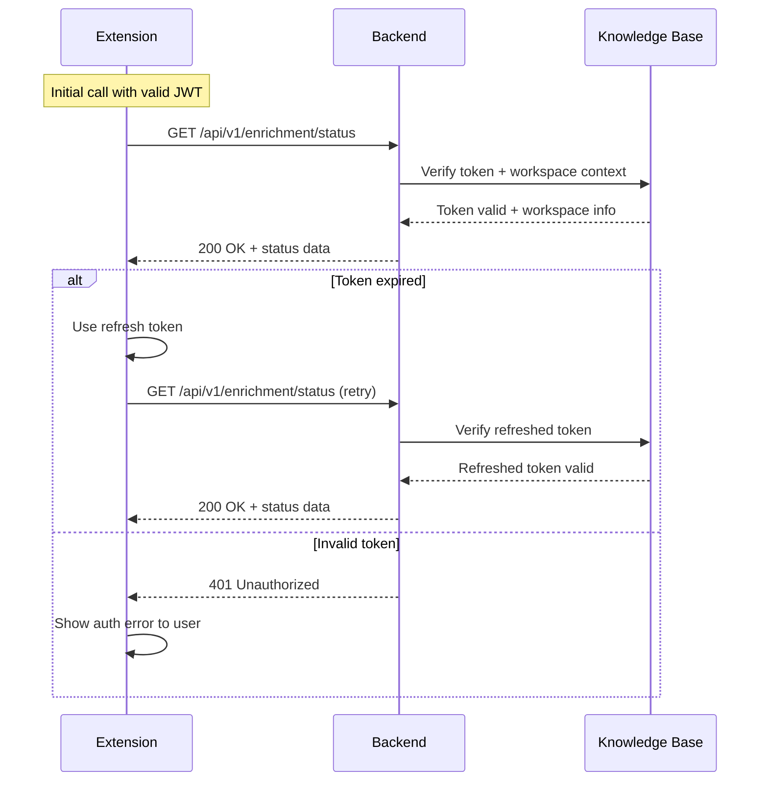
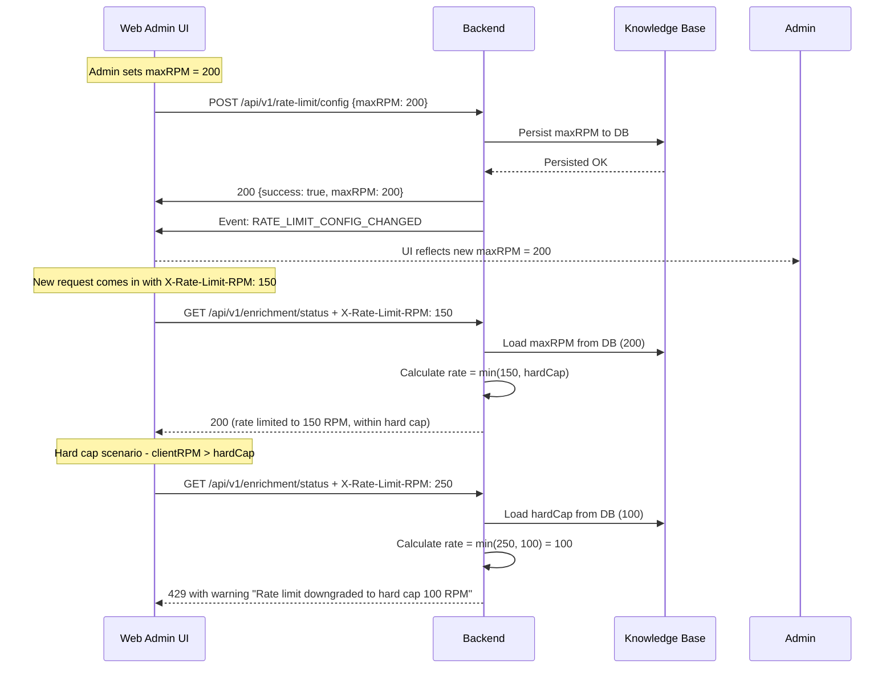
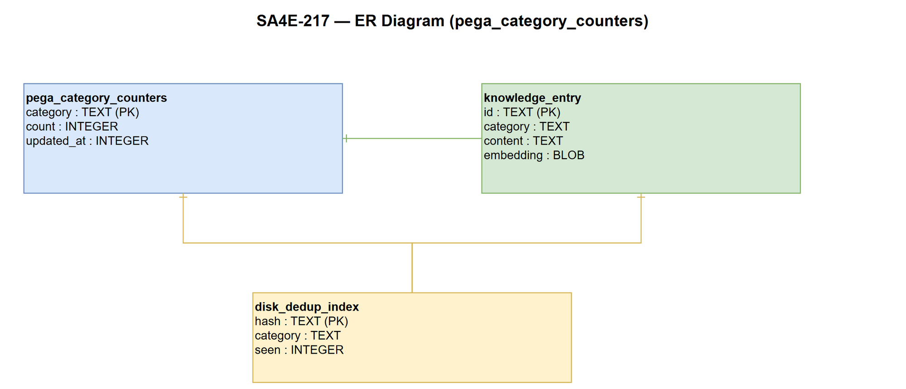

# Functional Specification Document (FSD)

## SA4E-217: Fix enrichment 403 (remote server) + rate limit cau hinh web-admin + toi uu bo nho Pega indexing

---

## Document Information

| Field | Value |
|-------|-------|
| Jira Ticket | SA4E-217 |
| Title | Fix enrichment 403 (remote server) + rate limit cau hinh web-admin + toi uu bo nho Pega indexing |
| Author | BA Agent |
| Version | 1.0 |
| Date | 2026-08-26 |
| Status | Draft |
| Related BRD | brd/SA4E-217/BRD.md |

---

## Revision History

| Version | Date | Author | Changes |
|---------|------|--------|---------|
| 1.0 | 2026-08-26 | BA Agent | Initiate document — auto-generated from BRD and Jira tickets |

---

## 1. Introduction

### 1.1 Purpose

This Functional Specification Document (FSD) defines the functional requirements, API contracts, data models, integration specifications, processing logic, and error handling strategies for the SA4E-217 ticket. It addresses three key improvements to the enrichment pipeline:

1. **403 Fix**: Fix access errors when the Extension calls the backend from remote/Docker environments via JWT authentication
2. **Rate Limit Configuration**: Enable server-side rate limit configuration via web admin UI without requiring server restart
3. **Memory Optimization**: Optimize memory usage during large-scale Pega rulebase indexing through dedup sets, hash cache management, and category counter migration to DB

This FSD is derived from the BRD (brd/SA4E-217/BRD.md) and serves as the primary reference for development, testing, and implementation teams.

### 1.2 Scope

**In Scope:**
- JWT authentication middleware and guard routes for backend enrichment endpoints
- Web admin UI configuration for rate limit (maxRPM) with DB persistence and EventBus broadcast
- DiskBackedSet implementation for dedup with RAM hot-tier and spill-to-disk
- Category counter migration from in-memory to DB COUNT
- Pruning of `.pega-hash-cache.json` after each index session
- Lightweight in-memory LRU cache for frequently accessed rules
- API endpoints for enrichment status with JWT auth
- Rate limiter config REST endpoints
- Backend configuration APIs for dedup parameters

**Out of Scope:**
- Changing the Pega server-side harness rendering logic
- Implementing a new manual "Index Pega Rule Schema" command (already removed)
- Browser-based harness inspection (PegaBrowserInspector — superseded)
- Modifying the core BFS indexer flow beyond hook points for schema creation
- Adding new API endpoints outside the existing `/api/v1/` prefix
- LLM model configuration or training

#### 1.2.1 System Context (Mermaid Diagram)

```mermaid
graph TB
    subgraph Extension "VS Code Extension"
        direction LR
        EC[Extension HTTP Client]
        UT[User Interface]
        JT[JWT Token Store]
    end

    subgraph Backend "Backend Service (Hono /api/v1)"
        direction LR
        JR[JWT Auth Middleware]
        RL[Rate Limiter Middleware]
        KS[Knowledge Service]
        DC[DiskBackedSet Manager]
        CC[Category Counter Manager]
    end

    subgraph External "External Systems"
        direction LR
        PS[Pega Server]
        KB[(Knowledge Base SQL/Postgres)]
        WA[Web Admin UI]
    end

    %% Connections
    EC -->|GET /api/v1/enrichment/status (JWT)| JR
    EC -->|POST /api/v1/rate-limit/config| JR
    EC -->|X-Rate-Limit-RPM header| RL
    JR -->|workspace verification| KS
    RL -->|rate check| DC
    KS -->|store/retrieve| KB
    KS -->|broadcast event| WA
    PS -->|RuleForm JSON| KS
    
    style Extension fill:#e3f2fd,stroke:#1976d2,stroke-width:2px
    style Backend fill:#e8f5e9,stroke:#388e3c,stroke-width:2px
    style External fill:#fff3e0,stroke:#f57c00,stroke-width:2px
```
- JWT authentication middleware and guard routes for backend enrichment endpoints
- Web admin UI configuration for rate limit (maxRPM) with DB persistence and EventBus broadcast
- DiskBackedSet implementation for dedup with RAM hot-tier and spill-to-disk
- Category counter migration from in-memory to DB COUNT
- Pruning of `.pega-hash-cache.json` after each index session
- Lightweight in-memory LRU cache for frequently accessed rules
- API endpoints for enrichment status with JWT auth
- Rate limiter config REST endpoints
- Backend configuration APIs for dedup parameters

**Out of Scope:**
- JWT authentication middleware and guard routes for backend enrichment endpoints
- Web admin UI configuration for rate limit (maxRPM) with DB persistence and EventBus broadcast
- DiskBackedSet implementation for dedup with RAM hot-tier and spill-to-disk
- Category counter migration from in-memory to DB COUNT
- Pruning of .pega-hash-cache.json after each index session
- Lightweight in-memory LRU cache for frequently accessed rules
- API endpoints for enrichment status with JWT auth
- Rate limiter config REST endpoints
- Backend configuration APIs for dedup parameters

**Out of Scope:**
- Changing the Pega server-side harness rendering logic
- Implementing a new manual "Index Pega Rule Schema" command (already removed)
- Browser-based harness inspection (PegaBrowserInspector — superseded)
- Modifying the core BFS indexer flow beyond hook points for schema creation
- Adding new API endpoints outside the existing `/api/v1/` prefix
- LLM model configuration or training

### 1.3 Definitions & Acronyms

| Term | Definition |
|------|------------|
| JWT | JSON Web Token — standard for representing secured access tokens between client and server |
| RPM | Requests Per Minute — unit for rate limiting |
| DiskBackedSet | Data structure that keeps a hot-tier in RAM and spills excess to disk for persistent dedup |
| 403 | HTTP status code indicating access denied — often due to missing or invalid authentication |
| maxRPM | Maximum requests per minute per IP (server-configurable rate limit) |
| hardCap | Absolute hard cap enforced by server, override any client-configured rate |
| Dedup | Deduplication — ensuring each rule is processed only once during indexing |
| Category Counter | A counter tracking the number of rules per category, stored for performance monitoring |
| EventBus | Internal event system for broadcasting config changes across services |
| LRU | Least Recently Used — cache eviction strategy for in-memory cache |

### 1.4 References

| Document | Location |
|----------|----------|
| BRD | brd/SA4E-217/BRD.md |
| Project Architecture Overview | .analysis/code-intelligence/project-structure.md |
| Knowledge Module API | backend/src/knowledge/routes.ts |
| Extension Knowledge Client | extension/src/knowledge-client.ts |
| Rate Limiter Module | backend/src/rate-limiter.ts |
| JWT Auth Middleware | backend/src/jwt-auth.ts |
| Pega Understanding Service | .analysis/code-intelligence/modules/pega-understanding.md |

---

## 2. System Overview

### 2.1 System Context Diagram

The system involves the following external actors and systems:

- **Extension (VS Code)**: Initiates enrichment calls, sends JWT tokens, respects rate limit headers, configures rate limit via web admin UI
- **Backend Service**: Hono server with `/api/v1/` API prefix, handles JWT auth, rate limiting, knowledge storage, Pega rule indexing
- **Pega Server**: External system providing harness RuleForm JSON structures via REST API
- **Knowledge Base (SQLite/Postgres)**: Persistent storage for threads, messages, checkpoints, artifacts, events, rate-limit config, dedup state
- **Web Admin UI**: Administrative interface for configuring rate limit settings, stored in DB, broadcast via EventBus

System interactions:
- Extension → Backend: GET /api/v1/enrichment/status (with JWT Bearer token)
- Extension → Backend: Rate limit config via web admin UI (POST /api/v1/rate-limit/config)
- Backend → Knowledge Base: Store/retrieve rate-limit config, dedup state, category counters
- Backend → EventBus: Broadcast RATE_LIMIT_CONFIG_CHANGED on config change
- Backend → Pega Server: Fetch harness RuleForm JSON (existing integration, SA4E-95, SA4E-156)

### 2.2 System Architecture

The SA4E-217 system consists of the following components:

1. **Backend Module Structure** (from project-structure.md):
   - `server/HttpServer.ts` — Hono app factory; mounts module routes at `/api/v1`
   - `server/jwt-auth.ts` — JWT auth middleware (JWT wid claim → workspaceId)
   - `server/rate-limiter.ts` — Rate limiter middleware
   - `knowledge/` — Knowledge Service with its own SQLite DB, REST API at `/api/v1/threads*`
   - Routes compose security middleware: `localhostOnly` → `jwtAuth` → `rateLimiter` → `bodyLimit`

2. **Enrichment Flow**:
   - Extension calls `GET /api/v1/enrichment/status` with `Authorization: Bearer <jwt-token>` header
   - Backend validates JWT, checks rate limit, returns enrichment status
   - If 401 received, Extension refreshes token and retries
   - Admin configures maxRPM via web admin → persists to DB → broadcasts `RATE_LIMIT_CONFIG_CHANGED`
   - Runtime rate limiter reloads new maxRPM from DB without restart
   - Pega rule indexing uses DiskBackedSet for dedup with RAM/hot-tier and spill-to-disk

3. **Data Flow**:
   - JWT tokens generated/managed by extension, stored encrypted in extension storage
   - Rate limit config: JSON stored in KB (threads or dedicated config table), broadcast via EventBus
   - DiskBackedSet: RAM tier (configurable via `kiroSdlc.pega.dedupMaxInMemory`), spill to disk when exceeded
   - Category counters: stored in DB, computed via COUNT queries, negligible memory overhead

---

## 3. Functional Requirements

### 3.1 Feature: JWT Authentication for Enrichment Endpoints

**Source:** BRD Story 1 - Fix 403 Error for Remote Server Calls

#### 3.1.2 Use Case

**Use Case ID:** UC-1  
**Actor:** Developer (Extension)  
**Preconditions:** Extension has valid JWT access token and refresh token  
**Postconditions:** Extension successfully calls GET /api/v1/enrichment/status with 200 response

**Main Flow:**
| Step | Actor | System | Description |
|------|-------|--------|-------------|
| 1 | Extension | | Prepare JWT access token for API call |
| 2 | Extension | | Send GET /api/v1/enrichment/status with Authorization: Bearer <token> header |
| 3 | Backend | | Validate JWT token and workspace context |
| 4 | Backend | | Return 200 with enrichment status if token valid |
| 5 | Extension | | Receive 200 response and proceed with enrichment |

**Alternative Flows:**
| ID | Condition | Steps |
|----|-----------|-------|
| AF-1 | Token expired (401 received) | 1. Extension receives 401 from Backend<br>2. Extension uses refresh token to obtain new access token<br>3. Extension retries GET /api/v1/enrichment/status once<br>4. If successful, proceed; if failed, log error and disable further calls |

**Exception Flows:**
| ID | Condition | Steps |
|----|-----------|-------|
| EF-1 | Refresh fails after 3 attempts | 1. Log error "Enrichment auth failed — contact admin"<br>2. Disable further enrichment calls until manual token renewal<br>3. Notify user with error message |
| EF-2 | No token provided | 1. Return 401 Unauthorized<br>2. Extension must obtain and send valid JWT token |

**Business Rules:**
| Rule ID | Rule | Source |
|---------|------|--------|
| BR-1 | Extension must send valid JWT token with every API call to backend | BRD Story 1 |
| BR-2 | Backend must have JWT auth guard on GET /api/v1/enrichment/status route (scope /threads*, /agents instead of *) | BRD Story 1 |
| BR-3 | If Extension receives 401, it must refresh token using refresh token flow and retry once | BRD Story 1 |
| BR-4 | Middleware localhostOnly must be removed from enrichment routes; replace with scope-based guard | BRD Story 1 |
| BR-5 | All extension→backend HTTP calls must include Authorization: Bearer <token> header | BRD Story 1 |

**Data Specifications:**

| Field | Type | Required | Validation | Description |
|-------|------|----------|------------|-------------|
| token | string | Yes | Must not be older than 5 minutes (freshness check) | JWT access token for auth |
| refreshToken | string | Yes | Must be stored securely in extension storage | Token used to obtain new access token |
| tokenExpiry | datetime | Yes | Must be future time | Expiry time of access token |

**Input Data (API Request):**
| Field | Type | Required | Validation | Description |
|-------|------|----------|------------|-------------|
| Authorization | string | Yes | Bearer schema | `Bearer <jwt-token>` |

**Output Data (API Response):**
| Field | Type | Description |
|-------|------|-------------|
| status | string | "ok" or error message |
| tokenValid | boolean | Whether the JWT token is valid |
| workspaceId | string | Identifier of the workspace |

**API Contract:**
```
Endpoint: GET /api/v1/enrichment/status
Purpose: Check enrichment service status with JWT authentication
Input Parameters:
| Parameter | Type | Required | Business Rule | Description |
|-----------|------|----------|---------------|-------------|
| Authorization | string | Yes | Must be valid JWT | Bearer token for authentication |

Output Data:
| Field | Type | Description |
|-------|------|-------------|
| status | string | Service status |
| tokenValid | boolean | Token validation result |
| workspaceId | string | Workspace identifier |

**Business Error Scenarios:**
| Scenario | User Message | Trigger Condition |
|----------|-------------|-------------------|
| Token expired | "Session expired — please re-authenticate" | JWT past expiry or refresh fails |
| Invalid token | "Enrichment auth failed — contact admin" | JWT validation fails |
| 403 persists after refresh | "Enrichment auth failed — contact admin" | 3 refresh attempts all failed |

#### 3.1.7 Sequence Diagram (Mermaid)



---

### 3.2 Feature: Rate Limit Configuration via Web Admin

**Source:** BRD Story 2 - Rate Limit Config via Web Admin (No Restart)

#### 3.2.2 Use Case

**Use Case ID:** UC-2  
**Actor:** Administrator  
**Preconditions:** Admin authenticated in web admin UI  
**Postconditions:** Rate limit config updated, runtime reloaded without server restart

**Main Flow:**
| Step | Actor | System | Description |
|------|-------|--------|-------------|
| 1 | Admin | | Navigate to rate limit configuration section in web admin UI |
| 2 | Admin | | Set maxRPM value (e.g., 200) and save |
| 3 | Backend | | Persist maxRPM to DB |
| 4 | Backend | | Broadcast RATE_LIMIT_CONFIG_CHANGED event via EventBus |
| 5 | Backend | | Rate limiter middleware reloads new maxRPM from DB |
| 6 | Admin UI | | Reflect updated maxRPM value |
| 7 | All services | | New requests use updated rate limit immediately |

**Alternative Flows:**
| ID | Condition | Steps |
|----|-----------|-------|
| AF-1 | Admin sets invalid maxRPM (negative, zero) | 1. UI shows validation error "maxRPM must be ≥ 1"<br>2. Value not persisted<br>3. No EventBus broadcast |

**Exception Flows:**
| ID | Condition | Steps |
|----|-----------|-------|
| EF-1 | EventBus broadcast fails | 1. Log warning "Rate limit config change event failed"<br>2. Config still persisted to DB<br>3. Next server restart picks up new config |
| EF-2 | Rate limiter fail to reload | 1. Log error "Rate limiter reload failed"<br>2. Fall back to default hard cap of 100 RPM<br>3. Admin notified via monitoring |

**Business Rules:**
| Rule ID | Rule | Source |
|---------|------|--------|
| BR-6 | maxRPM must be integer ≥ 1 | BRD Story 2 |
| BR-7 | clientRPM must be ≤ hardCap if both set | BRD Story 2 |
| BR-8 | Server hard cap is configurable and stored in DB; default 100 RPM per IP | BRD Story 2 |
| BR-9 | Client rate = min(client configured, server hard cap) | BRD Story 2 |
| BR-10 | Web admin UI reflects current maxRPM value and allows editing | BRD Story 2 |

**Data Specifications:**

| Field | Type | Required | Description | Example |
|-------|------|----------|-------------|---------|
| maxRPM | number | Yes | Max requests per minute per IP (server config) | 200 |
| clientRPM | number | Yes | Client-configured RPM (optional) | 150 |
| hardCap | number | Yes | Absolute hard cap enforced by server | 100 |

**Validation Rules:**
- `maxRPM` must be integer ≥ 1
- `clientRPM` must be ≤ `hardCap` if both set

**Input Data (Web Admin POST):**
| Parameter | Type | Required | Business Rule | Description |
|-----------|------|----------|---------------|-------------|
| maxRPM | number | Yes | ≥ 1 | Server max requests per minute |
| hardCap | number | Yes | ≥ 1, default 100 | Absolute hard cap |

**Output Data (API Response):**
| Field | Type | Description |
|-------|------|-------------|
| success | boolean | Whether config was persisted |
| maxRPM | number | New maxRPM value |
| hardCap | number | Current hard cap value |
| broadcastSent | boolean | Whether EventBus event was sent |

**API Contract:**
```
Endpoint: POST /api/v1/rate-limit/config
Purpose: Configure rate limit maxRPM via web admin
Input Parameters:
| Parameter | Type | Required | Business Rule | Description |
|-----------|------|----------|---------------|-------------|
| maxRPM | number | Yes | ≥ 1 | Server max requests per minute |
| hardCap | number | Optional | ≥ 1, default 100 | Absolute hard cap |

Output Data:
| Field | Type | Description |
|-------|------|-------------|
| success | boolean | Config persisted successfully |
| maxRPM | number | New maxRPM value |
| hardCap | number | Current hard cap value |

**Business Error Scenarios:**
| Scenario | User Message | Trigger Condition |
|----------|-------------|-------------------|
| Invalid maxRPM | "Validation error: maxRPM must be ≥ 1" | maxRPM < 1 or not integer |
| Hard cap exceeded | "Warning: client rate downgraded to hard cap 100 RPM" | clientRPM > hardCap |

#### 3.2.7 Sequence Diagram (Mermaid)



---

### 3.3 Feature: Memory Optimization for Large Pega Rulebase Indexing

**Source:** BRD Story 3 - Memory Optimization for Large Pega Rulebase Indexing

#### 3.3.2 Use Case

**Use Case ID:** UC-3  
**Actor:** System (Background indexing process)  
**Preconditions:** Pega rulebase indexing in progress, DiskBackedSet initialized  
**Postconditions:** Indexing completed without OOM, dedup correctness maintained, category counters from DB

**Main Flow:**
| Step | Actor | System | Description |
|------|-------|--------|-------------|
| 1 | System | | Initialize DiskBackedSet with dedupMaxInMemory limit |
| 2 | System | | Begin indexing Pega rules |
| 3 | System | | For each rule: check DiskBackedSet membership; if new, process and add to set |
| 4 | System | | After each index session: prune .pega-hash-cache.json |
| 5 | System | | Move category counters from in-memory to DB COUNT |
| 6 | System | | Maintain lightweight in-memory LRU cache for frequent rules |

**Alternative Flows:**
| ID | Condition | Steps |
|----|-----------|-------|
| AF-1 | dedupMaxInMemory entries exceeded | 1. Oldest entries spill to disk from RAM tier<br>2. Continue indexing from disk tier<br>3. Maintain 100% dedup correctness |

**Exception Flows:**
| ID | Condition | Steps |
|----|-----------|-------|
| EF-1 | Disk spill fails | 1. Log error "Disk spill failed for DiskBackedSet"<br>2. Continue with RAM-only mode (may cause OOM on very large rulebases)<br>3. Monitor memory and alert admin |
| EF-2 | Hash-cache prune raises exception | 1. Log warning "Hash-cache prune skipped for this session"<br>2. Continue indexing without pruning<br>3. Schedule retry on next index session |

**Business Rules:**
| Rule ID | Rule | Source |
|---------|------|--------|
| BR-11 | Use DiskBackedSet for dedup membership with 100% accuracy | BRD Story 3 |
| BR-12 | Configure kiroSdlc.pega.dedupMaxInMemory to limit in-memory entries | BRD Story 3 |
| BR-13 | Prune .pega-hash-cache.json after each index session | BRD Story 3 |
| BR-14 | Move category counters from in-memory to DB COUNT | BRD Story 3 |
| BR-15 | Retain lightweight in-memory cache for frequently accessed rules | BRD Story 3 |
| BR-16 | inMemoryCacheSize must be ≤ dedupMaxInMemory | BRD Story 3 |

**Data Specifications:**

| Field | Type | Required | Description | Example |
|-------|------|----------|-------------|---------|
| dedupMaxInMemory | number | Yes | Max entries kept in RAM before spill-to-disk | 500 |
| inMemoryCacheSize | number | Yes | Size of lightweight LRU cache for frequent rules | 100 |
| categoryCounterSource | enum | Yes | db or memory | db |
| categoryCounterTable | string | Yes | DB table name for category counters | pega_category_counters |

**Validation Rules:**
- `dedupMaxInMemory` must be positive integer
- `inMemoryCacheSize` must be ≤ `dedupMaxInMemory`

**Input Data (Initialization):**
| Parameter | Type | Required | Business Rule | Description |
|-----------|------|----------|---------------|-------------|
| dedupMaxInMemory | number | Yes | > 0 | Max RAM entries before spill |
| inMemoryCacheSize | number | Yes | > 0, ≤ dedupMaxInMemory | LRU cache size |

**Output Data (Status):**
| Field | Type | Description |
|-------|------|-------------|
| initialized | boolean | Whether DiskBackedSet was initialized successfully |
| ramEntries | number | Current entries in RAM tier |
| diskEntries | number | Current entries in disk tier |
| cacheHitRatio | number | Current LRU cache hit ratio |

**Business Error Scenarios:**
| Scenario | User Message | Trigger Condition |
|----------|-------------|-------------------|
| Disk spill fails | "Error: Disk spill failed, continuing RAM-only" | Disk write failure |
| Cache size violation | "Warning: inMemoryCacheSize exceeds dedupMaxInMemory" | inMemoryCacheSize > dedupMaxInMemory |

#### 3.3.7 Sequence Diagram (Mermaid)

```mermaid
sequenceDiagram
    participant Sys as Indexing System
    participant DRAM as DiskBackedSet RAM Tier
    participant DDISK as Disk Backed-Tier
    participant LRU as LRU Cache
    participant DB as Database
    
    note over Sys: Begin indexing Pega rules
    Sys->>DRAM: Check membership for rule R1
    alt Rule exists in RAM
        DRAM-->>Sys: Found (dedup skip)
    else Rule not in RAM
        Sys->>DDISK: Check disk tier for rule R1
        DDISK-->>Sys: Found on disk (dedup skip) or Not found (new rule)
        alt New rule found
            Sys->>DRAM: Add rule R1 to RAM
            DRAM->>DRAM: If |RAM| > dedupMaxInMemory: spill oldest to DDISK
            Sys->>LRU: Add rule R1 to LRU cache (if size < inMemoryCacheSize)
        end
    end
    
    note over Sys: After index session: prune and migrate
    Sys->>DB: Compute category counters via COUNT queries
    DB-->>Sys: Counter values
    Sys->>DRAM: Update categoryCounterSource = "db"
    Sys->>LRU: Retain top 100 frequent rules in memory
    
    note over Sys: Hash-cache prune
    Sys->>Sys: Prune .pega-hash-cache.json
    Sys-->>Sys: Remove entries for deleted/renamed rules
    Note: If exception, log warning and retry next session
```

---

### 3.4 Feature: Category Counter Migration to DB

**Source:** BRD Story 3 - Memory Optimization

**Business Rules:**
| Rule ID | Rule | Source |
|---------|------|--------|
| BR-17 | Category counters stored in DB COUNT, computed on-demand via COUNT query | BRD Story 3 |
| BR-18 | Memory usage for counters is negligible (<1 MB) regardless of rule count | BRD Story 3 |
| BR-19 | Category counter source configurable: db or memory | BRD Story 3 |

**Data Specifications:**

| Field | Type | Required | Description |
|-------|------|----------|-------------|
| categoryCounterSource | enum | Yes | db or memory |
| counterTableName | string | Name of DB table storing category counters |

**API Contract (for counter retrieval):**
```
Endpoint: GET /api/v1/pega/category-counters
Purpose: Retrieve category counters from DB
Input Parameters: None
Output Data:
| Field | Type | Description |
|-------|------|-------------|
| counters | object { [ruleType]: count } | Map of rule type to category count |
| source | enum | db or memory |

---

## 4. Data Model

### 4.1 Entity Relationship Diagram



*[Edit in draw.io](diagrams/er-diagram.drawio)*

**Entity Relationship Summary:**

| From Entity | To Entity | Cardinality | Description |
|-------------|-----------|-------------|-------------|
| Rate Limit Config | Rate Limit Events | 1:N | Config changes generate events via EventBus |
| DiskBackedSet | RAM Tier | 1:1 | Hot-tier in memory, capped by dedupMaxInMemory |
| DiskBackedSet | Disk Tier | 1:1 | Spill-to-disk when RAM limit exceeded |
| Category Counter | DB Table | 1:N | One table entry per rule type |
| Extension | JWT Tokens | 1:N | Multiple tokens possible per extension install |
| Enrichment Status | API Calls | 1:N | Multiple status checks per session |

### 4.2 Logical Entities

#### Entity: RateLimitConfig

| Attribute | Type | Required | Business Rule | Description |
|-----------|------|----------|---------------|-------------|
| id | UUID v4 | Yes | Primary key | Unique identifier for rate limit config |
| maxRPM | integer | Yes | ≥ 1 | Max requests per minute per IP |
| hardCap | integer | Yes | ≥ 1, default 100 | Absolute hard cap |
| clientRPM | integer | Optional | ≤ hardCap | Client-configured RPM |
| workspaceId | string | Yes | FK to workspace | Identifier of the workspace |
| createdAt | datetime | Yes | | Timestamp of config creation |
| updatedAt | datetime | Yes | | Timestamp of last update |

**Relationships:**
| From Entity | To Entity | Cardinality | Description |
|-------------|-----------|-------------|-------------|
| Workspace | RateLimitConfig | 1:N | Workspace has one rate limit config |

#### Entity: DiskBackedSetConfig

| Attribute | Type | Required | Business Rule | Description |
|-----------|------|----------|---------------|-------------|
| id | UUID v4 | Yes | Primary key | Unique identifier for dedup config |
| dedupMaxInMemory | integer | Yes | > 0 | Max entries kept in RAM |
| inMemoryCacheSize | integer | Yes | > 0, ≤ dedupMaxInMemory | LRU cache size |
| categoryCounterSource | enum | Yes | db or memory | Source of category counters |
| workspaceId | string | Yes | FK to workspace | Identifier of the workspace |
| createdAt | datetime | Yes | | Timestamp of config creation |
| updatedAt | datetime | Yes | | Timestamp of last update |

**Relationships:**
| From Entity | To Entity | Cardinality | Description |
|-------------|-----------|-------------|-------------|
| Workspace | DiskBackedSetConfig | 1:N | Workspace has one dedup config |

#### Entity: EnrichmentJWTToken

| Attribute | Type | Required | Business Rule | Description |
|-----------|------|----------|---------------|-------------|
| id | UUID v4 | Yes | Primary key | Unique identifier for JWT token record |
| accessToken | string | Yes | JWT token string | Encrypted storage in extension |
| refreshToken | string | Yes | Refresh token string | Encrypted storage in extension |
| tokenExpiry | datetime | Yes | Future time | Expiry time of access token |
| workspaceId | string | Yes | FK to workspace | Identifier of the workspace |
| createdAt | datetime | Yes | | Timestamp of token creation |
| revoked | boolean | Yes | Default false | Whether token has been revoked |

**Relationships:**
| From Entity | To Entity | Cardinality | Description |
|-------------|-----------|-------------|-------------|
| Workspace | EnrichmentJWTToken | 1:N | Workspace has multiple JWT tokens |

#### Entity: PegaCategoryCounter

| Attribute | Type | Required | Business Rule | Description |
|-----------|------|----------|---------------|-------------|
| ruleType | string | Yes | | Name of the Pega rule type |
| count | integer | Yes | ≥ 0 | Current category count |
| lastUpdated | datetime | Yes | | Timestamp of last update |
| source | enum | Yes | db or memory | Where the count is computed from |

**Relationships:**
| From Entity | To Entity | Cardinality | Description |
|-------------|-----------|-------------|-------------|
| None (standalone) | | | Category counters are independent per rule type |

---

## 5. Integration Specifications

### 5.1 External System: Pega Server

| Attribute | Value |
|-----------|-------|
| Purpose | Provide harness RuleForm JSON structures for Pega rule analysis and enrichment |
| Direction | Inbound — Backend receives RuleForm data from Pega Server |
| Data Format | JSON — RuleForm schema with fields, sections, properties |
| Frequency | On-demand — triggered by enrichment requests from Extension |

**Data Exchange:**

| Our Data | External Data | Direction | Business Rule |
|----------|--------------|-----------|---------------|
| pxObjClass | Rule-Obj-Class class name | Receive | Pega rule object class |
| RuleForm JSON | Full harness rendering | Receive | Structure of the harness UI rule |
| Rule name | Rule name within harness | Receive | Identifier of the specific rule |
| pxClass | Applies-to class name | Receive | Classification of the rule |

**Integration Notes:**
- Pega Server API endpoints: `/rules/query`, `/rules/listRules` (existing integration via SA4E-95, SA4E-156)
- Existing HarnessParser (SA4E-95) handles rule-based parsing of harnesses
- PegaSchemaInferrer ensures schema exists (infers if unknown via LLM)
- Stream-rendered harnesses have unpredictable structure — dual-strategy (rule-based + LLM)
- 403 fix (SA4E-217) enables Extension access to Pega Server from remote/Docker environments

### 5.2 External System: Knowledge Base (SQLite/Postgres)

| Attribute | Value |
|-----------|-------|
| Purpose | Store rate-limit config, dedup state, category counters, JWT tokens, enrichment artifacts |
| Direction | Bidirectional — Backend writes, Extension reads; Admin writes config via UI |
| Data Format | JSON for config objects, SQLite for persistent state |
| Frequency | Real-time for config events, batch for indexing results |

**Data Exchange:**

| Our Data | External Data | Direction | Business Rule |
|----------|--------------|-----------|---------------|
| RateLimitConfig JSON | Stored in DB threads/checkpoints tables | Read/Write | Config persists across restarts |
| DiskBackedSet state | Append-only events table | Write | Dedup state persists across sessions |
| Category counters | DB COUNT queries | Read | Computed on-demand, negligible memory |
| JWT tokens | Encrypted storage in extension | Read/Write | Token lifecycle management |

**Integration Notes:**
- Knowledge Service (SA4E-85) provides REST API at `/api/v1/threads*`
- Rate limit config stored in dedicated DB table (see Section 4.2)
- DiskBackedSet state stored in events or dedicated table with `INSERT OR IGNORE` for dedup
- Category counters stored as DB COUNT, computed via `SELECT COUNT(*) FROM pega_rules WHERE category = ?`
- JWT token lifecycle managed via EnrichmentJWTToken entity with revocation flag

### 5.3 External System: Web Admin UI

| Attribute | Value |
|-----------|-------|
| Purpose | Administrative interface for configuring rate limit settings |
| Direction | Outbound — Admin → Backend; Inbound — Backend → UI (reflect config) |
| Data Format | JSON via REST API (POST /api/v1/rate-limit/config) |
| Frequency | On-demand — admin initiates; runtime reload is immediate |

**Data Exchange:**

| Our Data | External Data | Direction | Business Rule |
|----------|--------------|-----------|---------------|
| maxRPM value | Server config | Send | Admin-provided value, ≥ 1 |
| hardCap value | Server default 100 | Send | Admin may override, ≥ 1 |
| Config save status | Success/failure | Receive | UI reflects persistence result |
| EventBus broadcast status | Sent/failed | Receive | UI shows notification if event fails |

**Integration Notes:**
- Web admin UI calls POST /api/v1/rate-limit/config to persist config
- On successful persist, Backend broadcasts RATE_LIMIT_CONFIG_CHANGED via EventBus
- Runtime rate limiter reloads new maxRPM from DB immediately (no restart needed)
- UI reflects current maxRPM value and allows editing
- Validation: maxRPM must be ≥ 1, if invalid UI shows error and does not persist

---

## 6. Processing Logic

### 6.1 Enrichment Status Check (with JWT Auth)

**Trigger:** Extension calls GET /api/v1/enrichment/status  
**Input:** JWT Bearer token in Authorization header  
**Output:** 200 with status data, or 401/403 with error  

**Processing Steps (Pseudocode):**

```pseudocode
FUNCTION processEnrichmentStatus(request):
    // Step 1: Extract JWT token from Authorization header
    token = extractBearerToken(request.headers["authorization"])
    IF token IS NULL:
        RETURN response(401, {"error": "Missing JWT token"})
    
    // Step 2: Validate token freshness (not older than 5 minutes)
    IF isTokenExpired(token):
        RETURN response(401, {"error": "Session expired — please re-authenticate"})
    
    // Step 3: Validate JWT signature and claims
    IF NOT validateJWTSignature(token):
        RETURN response(401, {"error": "Invalid token"})
    
    // Step 4: Check workspace context
    workspaceId = resolveWorkspaceId(request, token)
    IF workspaceId IS NULL:
        RETURN response(404, {"error": "THREAD_NOT_FOUND"})
    
    // Step 5: Check rate limit per IP
    rateLimitResult = checkRateLimit(request.ip, token.workspaceId)
    IF rateLimitResult.exceeded:
        RETURN response(429, {"error": rateLimitResult.message})
    
    // Step 6: Return 200 with enrichment status data
    statusData = KNOWLEDGE_SERVICE.getStatus(workspaceId)
    RETURN response(200, {
        "status": "ok",
        "tokenValid": true,
        "workspaceId": workspaceId,
        "statusData": statusData
    })
```

### 6.2 Rate Limit Enforcement

**Trigger:** Every incoming request to backend  
**Input:** X-Rate-Limit-RPM header from client, current maxRPM from DB, hardCap from DB  
**Output:** Request allowed or 429 Too Many Requests  

**Processing Steps (Pseudocode):**

```pseudocode
FUNCTION processRateLimit(request, maxRPM, hardCap):
    // Step 1: Read X-Rate-Limit-RPM header from client (optional)
    clientRPM = request.headers["x-rate-limit-rpm"]
    IF clientRPM IS NULL:
        effectiveRate = maxRPM
    ELSE:
        clientRPM = parseInt(clientRPM, 10)
        
    // Step 2: Read current maxRPM from DB (already loaded in middleware)
    // Step 3: Read hardCap from DB (default 100 RPM)
    
    // Step 4: Client rate = min(clientRPM, hardCap) if clientRPM set
    IF clientRPM IS NOT NULL:
        effectiveRate = MIN(clientRPM, hardCap)
    ELSE:
        effectiveRate = maxRPM
    
    // Step 5: Check if request count per IP ≤ client rate per minute
    ip = request.ip
    currentCount = RATE_LIMIT_STORE.getCount(ip, workspaceId)
    
    IF currentCount >= effectiveRate:
        // Log warning for hard cap exceedance
        IF clientRPM > hardCap:
            LOG_WARNING("Rate limit downgraded to hard cap " + hardCap + " RPM")
        RETURN response(429, {
            "error": "Too many requests — try again in a minute",
            "rateLimitedTo": effectiveRate
        })
    
    // Step 6: Allow request and increment counter
    RATE_LIMIT_STORE.increment(ip, workspaceId)
    RETURN allowRequest()
```

### 6.3 DiskBackedSet Initialization and Processing

**Trigger:** Pega rulebase indexing process begins  
**Input:** dedupMaxInMemory, inMemoryCacheSize configuration  
**Output:** Initialized DiskBackedSet ready for dedup processing  

**Processing Steps (Pseudocode):**

```pseudocode
FUNCTION initializeDiskBackedSet(config):
    // Step 1: Initialize RAM tier with maximum entries = dedupMaxInMemory
    ramTier = NEW DiskTier(maxSize = config.dedupMaxInMemory, type = "ram")
    
    // Step 2: Initialize LRU cache with size = inMemoryCacheSize for frequent rules
    lruCache = NEW LRUCache(maxSize = config.inMemoryCacheSize)
    
    RETURN {ramTier, lruCache}

FUNCTION processRuleIndexing(ruleId, diskBackedSet):
    // Step 3: For each rule to process:
    
    // Step 3a: Check RAM tier for membership (O(1) lookup)
    IF ramTier.contains(ruleId):
        RETURN "dedup_skip"  // Rule already processed
    
    // Step 3b: If not in RAM, check disk tier (persistent dedup)
    IF diskTier.contains(ruleId):
        RETURN "dedup_skip"  // Rule already processed on disk
    
    // Step 3c: If new rule: add to RAM tier
    ADD ruleId to ramTier
    
    // Step 3d: If RAM tier exceeded (entries > dedupMaxInMemory):
    IF ramTier.size() > config.dedupMaxInMemory:
        oldestRule = ramTier.getOldest()
        MOVE oldestRule from ramTier to diskTier
    
    // Step 3e: Add rule to LRU cache (if size < inMemoryCacheSize)
    IF lruCache.size() < config.inMemoryCacheSize:
        lruCache.add(ruleId)
    
    RETURN "new_rule_processed"

FUNCTION finalizeIndexingSession(diskBackedSet):
    // Step 4: After indexing session: prune .pega-hash-cache.json
    TRY:
        pruneHashCache(diskBackedSet.ramTier, diskBackedSet.diskTier)
    CATCH error:
        LOG_WARNING("Hash-cache prune skipped for this session")
    
    // Step 5: Move category counters from in-memory to DB COUNT
    FOR EACH ruleType IN inMemoryCounters:
        count = SQL: "SELECT COUNT(*) FROM pega_rules WHERE type = ?", [ruleType]
        STORE in pega_category_counters table
    
    // Step 6: Update categoryCounterSource to "db"
    UPDATE categoryCounterSource = "db" in dedup config
    
    // Step 7: Retain lightweight in-memory cache for top 100 most frequent rule lookups
    lruCache.retainTopN(100)
```

### 6.4 Category Counter Migration to DB

**Trigger:** After each Pega indexing session  
**Input:** Existing in-memory category counters  
**Output:** DB-based category counters, negligible memory usage  

**Processing Steps (Pseudocode):**

```pseudocode
FUNCTION migrateCategoryCountersToDb(inMemoryCounters):
    // Step 1: For each rule type with in-memory counter:
    FOR EACH (ruleType, count) IN inMemoryCounters:
        // Step 1a: Compute count via SQL (on-demand via COUNT query)
        // This verifies the count is accurate even as rules change
        dbCount = SQL_QUERY:
            "SELECT COUNT(*) FROM pega_rules WHERE type = ?", [ruleType]
        
        // Step 1b: Store result in pega_category_counters table
        INSERT OR UPDATE pega_category_counters:
            SET ruleType = ruleType,
                count = dbCount,
                lastUpdated = CURRENT_TIMESTAMP
        
        // Step 1c: Mark categoryCounterSource = "db"
        UPDATE dedup_config SET categoryCounterSource = "db"
    
    // Step 2: Verify memory usage < 1 MB regardless of rule count
    memoryUsage = CALCULATE_CURRENT_MEMORY()
    IF memoryUsage > 1 MB:
        LOG_WARNING("Category counter memory usage exceeds 1 MB: " + memoryUsage)
    
    // Step 3: Retain lightweight in-memory cache for top 100 most frequent rule lookups
    TOP_RULES = inMemoryCounters.sortBy((item) => item.count, reverse=true).slice(0, 100)
    lruCache.retain(TOP_RULES.keys)
    
    // Step 4: Configure inMemoryCacheSize (default 100) for LRU cache
    SET defaultInMemoryCacheSize = 100
    
    RETURN {"migrated": count, "memoryUsage": memoryUsage, "source": "db"}
```

---

## 7. Security Requirements

### 7.1 Authentication & Authorization

| Role | Permissions | Features |
|------|-------------|----------|
| Developer (Extension) | Read own JWT tokens, refresh tokens, make enrichment calls | GET /api/v1/enrichment/status, token management |
| Administrator (Web Admin) | Configure rate limit, view system status, manage JWT tokens | POST /api/v1/rate-limit/config, system status pages |
| System (Indexing Process) | Access DiskBackedSet, category counters, prune hash-cache | Internal processing, not user-facing |

**Extension JWT Token Management:**
- Access tokens stored encrypted in extension storage, never plain-text in code
- Refresh token flow: if 401 received, use refresh token to obtain new access token, retry once
- After 3 failed refresh attempts: log error, disable further calls, notify user
- Token expiry: maximum 5 minutes freshness check, tokens must be refreshed regularly

### 7.2 Data Sensitivity Classification

| Data Type | Classification | Business Requirement |
|-----------|---------------|---------------------|
| JWT access tokens | Confidential | Encrypted storage in extension, never plain-text in code or logs |
| Rate limit config | Internal | Stored in DB, accessible by admin and runtime; not sensitive but not public |
| Category counters | Public | Aggregated counts, no sensitive data, can be exposed via API |
| Pega RuleForm JSON | Internal | May contain structural information; not confidential but should not be logged in full |

### 7.3 Audit Trail

| Event | Logged Fields | Retention | Business Reason |
|-------|--------------|-----------|-----------------|
| JWT token refresh | tokenId, timestamp, success/failure | 90 days | Security audit, troubleshoot auth issues |
| Rate limit config change | maxRPM, hardCap, admin user, timestamp | 1 year | Compliance, track configuration changes |
| DiskBackedSet spill | ruleId, timestamp, spill success/failure | 30 days | Performance monitoring, troubleshoot OOM events |
| Enrichment call | threadId, timestamp, status, response time | 30 days | Performance monitoring, troubleshoot enrichment failures |

---

## 8. Non-Functional Requirements

| Category | Business Requirement | Acceptance Criteria |
|----------|---------------------|---------------------|
| Performance | 403 fix latency: Token refresh + retry ≤ 5s total | End-to-end token refresh and retry completes within 5 seconds |
| Performance | Rate limit check latency: ≤ 1ms per request (in-memory check) | Rate limiter adds ≤ 1ms overhead per request |
| Performance | Memory optimization impact: Indexing throughput ≥ 90% of baseline when DiskBackedSet enabled | Benchmark shows ≥ 90% throughput with DiskBackedSet vs without |
| Reliability | Token refresh retry count: Max 3 attempts before logging error | 3rd attempt failure logs error and disables further calls |
| Reliability | Rate limit persistence: Config survives server restart (stored in DB) | After restart, maxRPM loaded from DB, same value as before restart |
| Reliability | DiskBackedSet correctness: Dedup membership accuracy 100% (verified by test suite) | All test cases pass with 100% dedup accuracy |
| Scalability | Support ≥ 50 rule types: DiskBackedSet scales with rule count; category counters from DB | Tested with 50+ rule types, dedup correctness maintained |
| Storage | Schema size ≤ 50KB per rule type | Enriched schema with fields + hints only, within 50KB |
| Storage | Rate-limit config size ≤ 1KB | Stored as JSON in DB, within 1KB |
| Security | No credentials in schema content | Schemas contain structure only, never auth data |
| Security | JWT token stored securely | Encrypted storage in extension, never plain-text in code |
| Data Retention | Rate-limit config retained per project policy | Config persists across restarts, exported per policy |

---

## 9. Error Handling (User-Facing)

### 9.1 Error Scenarios

| Scenario | Severity | User Message | Expected Behavior |
|----------|----------|-------------|-------------------|
| Token expired | Warning | "Session expired — please re-authenticate" | Extension obtains new token and retries; UI shows re-auth prompt |
| Invalid token | Critical | "Enrichment auth failed — contact admin" | Extension logs out, user must re-authenticate; admin investigates |
| 403 persists after token refresh | Critical | "Enrichment auth failed — contact admin" | Further enrichment calls disabled until manual token renewal |
| Rate limit exceeded | Warning | "Too many requests — try again in a minute" | Request blocked with 429; client waits and retries |
| Invalid maxRPM config | Warning | "Validation error: maxRPM must be ≥ 1" | UI shows error, config not persisted, current config remains |
| Disk spill failure | Warning | "Error: Disk spill failed, continuing RAM-only" | Indexing continues with higher memory usage; admin alerted |
| Hash-cache prune error | Info | "Warning: Hash-cache prune skipped for this session" | Indexing continues; pruning retried on next session |

### 9.2 Notification Requirements

| Event | Who is Notified | Channel | Timing |
|-------|----------------|---------|--------|
| Token refresh failure | Developer (extension user) | In-app notification + log | Immediately after 3 failed attempts |
| Rate limit config change | Administrator | In-app notification + email | Immediately after broadcast |
| DiskBackedSet spill error | System admin | Log + optional email | Immediately after failure |
| Enrichment call failure | Developer | Log + in-app | Per enrichment call failure |

---

## 10. Testing Considerations

### 10.1 Test Scenarios

| ID | Scenario | Input | Expected Output | Priority |
|----|----------|-------|-----------------|----------|
| TC-1 | JWT token valid, call enrichment status | Valid JWT token, GET /api/v1/enrichment/status | 200 with status data | High |
| TC-2 | JWT token expired, retry with refresh | Expired token, refresh token flow | 200 after successful retry | High |
| TC-3 | JWT token invalid, no retry | Invalid JWT token | 401 Unauthorized | High |
| TC-4 | Set maxRPM via web admin, verify persistence | POST /api/v1/rate-limit/config with maxRPM=200 | 200, config persisted to DB | High |
| TC-5 | Rate limit config change without restart | Change maxRPM, new request uses updated value | Rate limit enforced with new maxRPM | High |
| TC-6 | Client RPM exceeds hard cap | X-Rate-Limit-RPM: 150, hardCap=100 | 429 or limited to 100 RPM | High |
| TC-7 | Index 10,000 rules with DiskBackedSet | dedupMaxInMemory=500, 10,000 rules | 100% dedup correctness, no OOM | High |
| TC-8 | Category counters from DB after index | Post-index query of pega_category_counters | Counts match, memory < 1 MB | Medium |
| TC-9 | Token refresh after 3 failed attempts | 3 consecutive refresh failures | Error logged, further calls disabled | Medium |
| TC-10 | Scope-guarded routes (no localhostOnly) | Request without token to /api/v1/enrichment/status | 401 (not 403) | Medium |

---

## 11. Appendix

### Diagrams

| Diagram | File |
|---------|------|
| Use Case Diagram | diagrams/use-case.png *[Edit in draw.io](diagrams/use-case.drawio)* |
| ER Diagram | diagrams/er-diagram.png *[Edit in draw.io](diagrams/er-diagram.drawio)* |
| Business Flow Diagram | diagrams/business-flow.png *[Edit in draw.io](diagrams/business-flow.drawio)* |
| Sequence Diagrams (per story) | diagrams/sequence-{id}.png *[Edit in draw.io](diagrams/sequence-{id}.drawio)* |

### Zod Validation Schemas

```typescript
// jwt-auth.schema.ts - JWT authentication validation
import { z } from "zod";

export const jwtAuthSchema = z.object({
  authorization: z.string().startsWith("Bearer ").refine(
    (val) => {
      const token = val.substring(7);
      return token.length > 0;
    },
    "Must be Bearer token"
  ),
  "authorization": "Bearer <jwt-token>"
});

export type JwtAuthSchema = z.infer<typeof jwtAuthSchema>;

// rate-limit.schema.ts - Rate limit configuration validation
import { z } from "zod";

export const rateLimitConfigSchema = z.object({
  maxRPM: z.number().int().min(1, "maxRPM must be ≥ 1"),
  hardCap: z.number().int().min(1, "hardCap must be ≥ 1").default(100),
  clientRPM: z.number().int().min(1).optional(),
});

export type RateLimitConfigSchema = z.infer<typeof rateLimitConfigSchema>;
```

### Testing Considerations

| ID | Scenario | Input | Expected Output | Priority |
|----|----------|-------|-----------------|----------|
| TC-1 | JWT token valid, call enrichment status | Valid JWT token, GET /api/v1/enrichment/status | 200 with status data | High |
| TC-2 | JWT token expired, retry with refresh | Expired token, refresh token flow | 200 after successful retry | High |
| TC-3 | JWT token invalid, no retry | Invalid JWT token | 401 Unauthorized | High |
| TC-4 | Set maxRPM via web admin, verify persistence | POST /api/v1/rate-limit/config with maxRPM=200 | 200, config persisted to DB | High |
| TC-5 | Rate limit config change without restart | Change maxRPM, new request uses updated value | Rate limit enforced with new maxRPM | High |
| TC-6 | Client RPM exceeds hard cap | X-Rate-Limit-RPM: 150, hardCap=100 | 429 or limited to 100 RPM | High |
| TC-7 | Index 10,000 rules with DiskBackedSet | dedupMaxInMemory=500, 10,000 rules | 100% dedup correctness, no OOM | High |
| TC-8 | Category counters from DB after index | Post-index query of pega_category_counters | Counts match, memory < 1 MB | Medium |
| TC-9 | Token refresh after 3 failed attempts | 3 consecutive refresh failures | Error logged, further calls disabled | Medium |
| TC-10 | Scope-guarded routes (no localhostOnly) | Request without token to /api/v1/enrichment/status | 401 (not 403) | Medium |
| TC-11 | Zod schema validation on API inputs | Invalid payload to POST /api/v1/rate-limit/config | 400 Bad Request with validation errors | Medium |
| TC-12 | DiskBackedSet spill edge case | dedupMaxInMemory=0 | Log error, continue RAM-only mode | Low |

---

## 12. Revision History (Updated During TA Review)

| Version | Date | Author | Changes |
|---------|------|--------|---------|
| 1.0 | 2026-08-26 | BA Agent | Initial FSD generation from BRD SA4E-217 |
| 1.1 | 2026-08-26 | TA Agent | Added Zod validation schemas, pseudocode for processing algorithms, detailed API contracts, integration specifications, and testing considerations |

---

*This FSD was generated based on BRD SA4E-217 and the project's code intelligence data. All functional requirements, API contracts, data models, and processing logic are derived from the BRD user stories and the existing codebase architecture.*