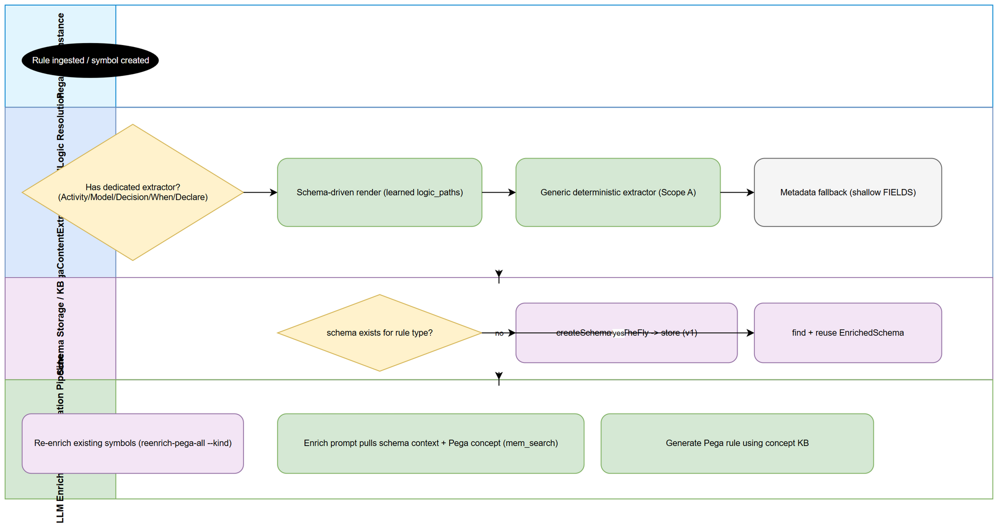

# Business Requirements Document (BRD)

## SA4E-222 — Generic self-learning Pega rule understanding for LLM enrichment + rule generation

---

## Document Information

| Field | Value |
|-------|-------|
| Feature ID | SA4E-222 |
| Title | Generic self-learning Pega rule understanding for LLM enrichment + rule generation |
| Author | BA Agent |
| Version | 1.0 |
| Date | 2026-08-27 |
| Status | Draft |
| Architecture Pattern | LLM Enrichment Pipeline + Knowledge Base |

---

## Revision History

| Version | Date | Author | Changes |
|---------|------|--------|---------|
| 1.0 | 2026-08-27 | BA Agent | Initial BRD — reverse-engineered from implementation in `backend/src/modules/pega/` and `backend/src/modules/memory/pega-concept-retriever.ts` |

---

## 1. Introduction

### 1.1 Scope

SA4E enriches Pega rule instances (Activity, Data Transform, Decision, Flow, When, etc.) so that an LLM can understand and later generate correct Pega rule JSON. Historically enrichment relied on (a) manually curated schemas and (b) a brittle on-the-fly LLM schema path that stored schemas under a key the renderers could not find (defect DISC-1). SA4E-222 delivers a **generic, self-learning** understanding layer that works for *any* Pega rule type without per-rule hand-tuning:

- **Scope A — Generic logic extraction (LLM-free):** Deterministically locate and render the "logic-bearing" arrays/structures inside any Pega rule JSON (steps, shapes, stages, rows, conditions, transitions…), so enrichment output is useful even when no learned schema exists.
- **Scope B — Self-learning schema:** When a rule type is first encountered, ask the LLM to characterize one sample instance and persist a machine-readable `EnrichedSchema` (including traversable `nested_logic_paths`) under a single canonical KB key. Subsequent enrichments reuse the learned schema for accurate, schema-driven rendering.
- **Scope C — Pega knowledge & concept retrieval:** Ingest Pega documentation (docs.pega.com concept pages) into the Knowledge Base with structured tags, and provide a retrieval helper that grounds both enrichment (understanding a rule) and the future rule-generation pipeline (grounding generated JSON) in authoritative Pega platform knowledge.

The understanding layer feeds the existing `CodeEnrichmentHandler` enrichment pipeline and is designed to be reusable by a future rule-generation pipeline.

### 1.2 Out of Scope

- The rule-generation pipeline itself (only the concept-retrieval *grounding* primitive for it is delivered in Scope C).
- UI for browsing Pega rule schemas or ingested docs (all access via backend services + KB tools).
- Human-in-the-loop schema curation UI (schemas are LLM-derived and stored automatically).
- Enrichment of non-Pega symbol kinds (handled by other strategies in `CodeEnrichmentHandler`).
- Training/fine-tuning of embedding or LLM models.

### 1.3 Preliminary Requirements

- Node.js backend runtime with access to `LLMService` (multi-provider chat completion).
- SQLite-backed Knowledge Base (the `knowledge_entries` table already used by `SchemaStorageService` and `MemoryEngine.search`).
- Existing Pega content-extraction primitives (`isInternalKey`, `scalarStr` from `PegaContentExtractor`).
- Out-of-band network + LLM access for doc ingestion CLI (`scripts/ingest-pega-docs.ts`); the core ingestor logic itself is deterministic and unit-testable without internet.

---

## 2. Business Requirements

### 2.1 High Level Process Map

1. **Rule indexed** → `CodeEnrichmentHandler` receives a Pega symbol with its JSON body.
2. **Schema lookup** → check KB for a learned `EnrichedSchema` (canonical key `pega-schema:{ruleType}`); fall back to legacy SA4E-214 rows.
3. **Self-learn (if missing)** → LLM characterizes the sample → `PegaSchemaCreator` builds `EnrichedSchema` → `SchemaStorageService` stores it (Scope B).
4. **Render logic** → `SchemaDrivenRenderer` walks `nested_logic_paths`; if none resolve, `PegaGenericLogicExtractor` renders deterministically (Scope A). Both share `renderPathNodes` so output shape is identical.
5. **Ground with Pega knowledge** → `retrievePegaConcept` pulls authoritative docs from the KB to enrich understanding (Scope C).
6. **Persist docs** → `PegaDocsIngestor` (driven by the CLI) summarizes and stores Pega concept pages with structured tags for future retrieval.

### 2.2 List of User Stories / Use Cases

| # | Story / Use Case | Priority | Category |
|---|------------------|----------|----------|
| 1 | Generic logic extraction — render logic-bearing structures from ANY Pega rule JSON without an LLM or learned schema | MUST HAVE | Scope A — Understanding |
| 2 | Self-learning schema creation — LLM characterizes a rule type once and persists a reusable `EnrichedSchema` | MUST HAVE | Scope B — Learning |
| 3 | Schema-driven rendering — learned `nested_logic_paths` drive precise logic rendering, with tolerant fallback to generic | MUST HAVE | Scope B — Rendering |
| 4 | Canonical schema storage — single `pega-schema:{ruleType}` key (fixes DISC-1) with store/find/update | MUST HAVE | Scope B — Persistence |
| 5 | Pega doc ingestion — summarize & store docs.pega.com concept pages into KB with structured tags + source attribution | MUST HAVE | Scope C — Knowledge |
| 6 | Pega concept retrieval — retrieve authoritative Pega knowledge from KB, filtered by `concept:`/`ruletype:` tags | MUST HAVE | Scope C — Grounding |
| 7 | Re-enrichment / backfill — re-run enrichment for existing Pega symbols so learned schemas populate the KB (`scripts/reenrich-pega.ts`) | SHOULD HAVE | Scope B/C — Ops |

### 2.3 Details of User Stories

---

#### Business Flow

**Step 1:** `CodeEnrichmentHandler.enrichPegaSymbol(symbol, bodyText)` is invoked with a Pega rule symbol and its JSON body.

**Step 2:** System looks up a learned schema via `schemaStorage.find(ruleType)` (canonical key first), then legacy `PEGA_SCHEMA_ENRICHED` rows.

**Step 3:** If none found and body is large enough (≥50 chars), `schemaCreator.createSchemaOnTheFly(ruleType, bodyText)` calls the LLM, parses the response into an `EnrichedSchema`, and `schemaStorage.store(schema)` persists it. LLM failure is non-fatal (no schema created).

**Step 4:** The enrichment prompt is built with schema context — including the new `Nested Logic Paths` line — so downstream logic extraction (generic or schema-driven) is guided.

**Step 5:** When logic must be rendered, the system resolves `nested_logic_paths` via `SchemaDrivenRenderer`; unresolved paths are skipped with a WARN and, if *all* miss, the generic extractor runs.

**Step 6:** `retrievePegaConcept` augments understanding/grounding by querying the KB for `pega-doc` entries matching `ruletype:`/`concept:` tags.

> **Note:** All schema rows are stored with `scope=PROJECT`, `tier=SEMANTIC` so they are shared across the project and treated as durable conceptual knowledge.

---

#### STORY 1: Generic Logic Extraction (Scope A)

> As the enrichment engine, I want to extract the business logic from any Pega rule JSON deterministically (without calling an LLM) so that I can produce useful logic renderings even for rule types that have no learned schema yet.

**Requirement Details:**

1. Detection is **LLM-free** and deterministic: scan top-level keys of the rule JSON.
2. An array of objects qualifies as a logic container when its key is in a known allowlist (`pySteps`, `pyShapes`, `pyStages`, `pyRows`, `pyDecisionRules`, `pyWhen`, `pyTransitions`, …) **OR** when ≥2 of its child keys intersect a relationship-key set (`from`, `to`, `when`, `value`, `target`, `result`, `expression`, …).
3. Internal keys (`px*`/`pz*`/`__*`) and known non-logic containers (`pyParameters`, `pyPages`, `pyFields`, `pyColumns`) are skipped.
4. Each logic node is rendered as `id/name | relationship pairs (a -> b) | target = expression | other relationship keys`, with a flat-scalar fallback for low-information nodes.
5. Rendered output is bounded (`MAX_DUMP_ITEMS = 200`) to avoid token blow-up.
6. Output format is `LOGIC (generic: <key>):` blocks; returns `null` when nothing matches.

**Data Fields:**

| Field | Type | Required | Description | Example |
|-------|------|----------|-------------|---------|
| ruleJson | object | Yes | Parsed Pega rule instance JSON | Activity rule body |
| opts (genericEnabled) | boolean | No | Enable generic fallback (default true) | true |

**Acceptance Criteria:**

1. Given an Activity rule with `pySteps`, the extractor returns a `LOGIC (generic: pySteps):` block listing each step's identity + relationships.
2. Given a rule whose only array has ≥2 relationship keys (e.g. `from`/`to`), it is still detected as logic-bearing even if not in the allowlist.
3. Given a rule with only `px*`/`pz*` keys or `pyParameters`, the extractor returns `null` (no false positives).
4. Given an array >200 items, at most 200 nodes are rendered.
5. The generic renderer and the schema-driven renderer produce **identical** node formatting (shared `renderPathNodes`).

**Error Handling:**

- Malformed JSON (already-parsed object expected): caller responsibility; extractor tolerates missing/non-array values.
- Empty rule JSON → returns `null`.

---

#### STORY 2: Self-Learning Schema Creation (Scope B)

> As the enrichment engine, I want to learn a schema for a new Pega rule type automatically the first time I see it, so that subsequent enrichments are guided by an accurate, reusable `EnrichedSchema` instead of guessing.

**Requirement Details:**

1. Triggered once per rule type when no stored schema exists and a sample body ≥50 chars is available.
2. An LLM (chat completion) is prompted with the rule type + a truncated sample body (≤6000 chars) and returns JSON describing `extraction Hints` (`primary_logic_field`, `logic_structure`, `summary_focus`, `nested_logic_paths`, `path_render_hint`).
3. `PegaSchemaCreator.parseLlmSchema` normalizes the LLM output into a valid `EnrichedSchema`, defaulting every required field and filtering `nested_logic_paths` to string entries.
4. On LLM error/parse failure, schema creation returns `null` (non-fatal) — enrichment proceeds without a learned schema.
5. The learned schema is persisted via `SchemaStorageService.store`.

**Data Fields:**

| Field | Type | Required | Description | Example |
|-------|------|----------|-------------|---------|
| ruleType | string | Yes | Pega rule type derived from symbol kind | "Activity" |
| sampleBody | string | Yes | Raw rule instance JSON (≥50 chars) | `{...}` |

**Acceptance Criteria:**

1. Given a new rule type with a valid sample, a schema is created, stored, and findable by `ruleType`.
2. LLM output wrapped in markdown fences or with extra prose is still parsed correctly (fence/prose stripped).
3. LLM timeout or invalid JSON → `createSchemaOnTheFly` returns `null`, no partial schema written.
4. Stored schema is a valid `EnrichedSchema` with `schema_version=1`, `rule_type` set, `extraction_hints.nested_logic_paths` an array.
5. Re-submitting the same `ruleType` throws `SchemaAlreadyExistsError` (store is idempotent-guarded).

**Error Handling:**

- LLM failure → log debug, return `null`.
- Unparseable LLM response → return `null`.
- Duplicate rule type → `SchemaAlreadyExistsError` from `store`.

---

#### STORY 3: Schema-Driven Rendering (Scope B)

> As the enrichment engine, I want to render logic using the learned `nested_logic_paths` so that rendering is precise and aligned with how this specific rule type stores its logic.

**Requirement Details:**

1. `SchemaDrivenRenderer.renderSchemaDrivenLogic(ruleJson, paths, logger)` tokenizes each path (keys, explicit indices, `[]` wildcards, `[].` notation) and resolves the leaf nodes.
2. Resolved nodes are rendered via the **shared** `renderPathNodes` so output is identical to Scope A.
3. **Tolerant:** an unresolvable path is skipped with a WARN; if *all* paths miss, the function returns `null` so the caller falls back to the generic extractor.
4. Path notation supports dotted (`pyModelProcess.pyShapes`), bracket (`pyStages[0]`), and wildcard (`pyStages[].pyProcesses[]`).

**Acceptance Criteria:**

1. Given a schema with `nested_logic_paths=["pyModelProcess.pyShapes"]` and a matching rule, a `LOGIC` block is produced from those nodes.
2. Given a path that does not exist in the rule, it is skipped (WARN) and other valid paths still render.
3. Given a schema whose *all* paths miss, returns `null` (caller falls back to generic).
4. Wildcard `[].` paths expand across all array elements (precedent from `PegaGenericRule.extractDependencies`).

**Error Handling:**

- Unresolvable path → WARN log, continue (OQ-5 tolerant design).
- No paths provided → immediate `null`.

---

#### STORY 4: Canonical Schema Storage (Scope B — DISC-1 fix)

> As the system, I want all learned schemas stored under one canonical, renderer-readable key so that the schema-driven renderers actually find the on-the-fly schemas (defect DISC-1).

**Requirement Details:**

1. `SchemaStorageService` stores schemas in `knowledge_entries` with `type='PEGA_SCHEMA_ENRICHED'` and `source='pega-schema:{ruleType}'` (pure JSON content).
2. `find(ruleType)` reads exactly that canonical key.
3. `update(ruleType, newFields)` appends fields to the right bucket (`identity_fields`/`connectivity_fields`/`logic_fields`), bumps `schema_version`, and rewrites content.
4. Legacy SA4E-214 rows (`pega-schema-enriched/{ruleType}` prefix) remain readable as a fallback in `CodeEnrichmentHandler.findEnrichedSchema`.
5. Stored schemas use `scope=PROJECT`, `tier=SEMANTIC` (shared, durable conceptual knowledge).

**Acceptance Criteria:**

1. A schema stored via `store` is returned verbatim by `find(ruleType)`.
2. `update` increments `schema_version` and adds paths to `known_fields` without duplicating.
3. `find` on an unknown rule type returns `null` (not an error).
4. Renderers reading the canonical key now locate on-the-fly schemas (DISC-1 resolved).

---

#### STORY 5: Pega Documentation Ingestion (Scope C)

> As the system, I want to ingest Pega platform documentation into the KB (summarized, with source attribution) so that enrichment and future rule generation can be grounded in authoritative knowledge.

**Requirement Details:**

1. `PegaDocsIngestor.ingest(pages)` summarizes each page (LLM/CLI-injected summarizer) and stores it with structured tags: `pega-doc`, `concept:{name}`, and optional `ruletype:{x}`.
2. Stored content is a **paraphrase** plus `Source: {url}` — never verbatim bulk copy (IP/NFR-5 compliance).
3. The actual fetch + summarize + store is performed out-of-band by `scripts/ingest-pega-docs.ts`, which injects a fetcher/summarizer/store so the core logic is deterministic and unit-testable without internet.
4. Per-page failures are logged (never silently swallowed) and counted; a partial KB is acceptable and per-page retry is possible.

**Data Fields:**

| Field | Type | Required | Description | Example |
|-------|------|----------|-------------|---------|
| page.url | string | Yes | Source URL | "https://docs.pega.com/…/data-transform" |
| page.title | string | Yes | Page title → KB summary | "Data Transform" |
| page.concept | string | Yes | Concept name for `concept:{name}` tag | "data-transform" |
| page.ruleType | string | No | Rule type for `ruletype:{x}` tag | "DataTransform" |
| page.content | string | Yes | Raw page text (already fetched) | "…" |

**Acceptance Criteria:**

1. Given a page, a KB entry is created with tags `pega-doc,concept:{name}[,ruletype:{x}]` and `summary=title`.
2. Stored entry content contains the paraphrase and `Source: {url}`.
3. A failed page increments `failed` and does not abort the batch (returns `{ingested, failed}`).
4. `buildPegaDocTags` always includes `pega-doc` + `concept:{name}`; `ruletype` only when present.

**Error Handling:**

- Summarizer/store throws → caught, logged as WARN, `failed++`.
- Empty/short content → still ingested if summarizer succeeds; otherwise counted as failed.

---

#### STORY 6: Pega Concept Retrieval (Scope C)

> As the enrichment engine (and future rule-generation engine), I want to retrieve authoritative Pega knowledge from the KB filtered by concept/rule type so that my understanding/generation is grounded in real Pega semantics.

**Requirement Details:**

1. `retrievePegaConcept(engine, opts)` wraps `MemoryEngine.search` with a query seeded by `pega concept` + optional `ruleType`/`topic`.
2. Results are filtered to entries carrying `pega-doc` tag and, when requested, matching `ruletype:{x}` / `concept:{name}` tags (case-insensitive).
3. Hit content is concatenated into attributed context blocks (`[{type}] {summary} (source: {url})\n{content}`); returns `''` when no hits.
4. Reused by both the enrichment pipeline (understanding a rule) and the planned rule-generation pipeline (grounding).
5. `scopeCtx` propagates scope isolation so only visible KB entries are used.

**Acceptance Criteria:**

1. Given KB entries tagged `pega-doc, concept:data-transform`, `retrievePegaConcept` returns their content with source attribution.
2. Given `ruleType='DataTransform'`, only entries whose tags include `ruletype:datatransform` are returned.
3. Given no matching `pega-doc` entries, returns `''` (empty string, not error).
4. Returned context preserves the original `source` URL for traceability.

**Error Handling:**

- Search error propagated by `engine.search` (no internal catch — caller decides).
- No hits → graceful `''`.

---

#### STORY 7: Re-enrichment / Backfill (Scope B/C — Ops)

> As an operator, I want to re-run enrichment for existing Pega symbols so that learned schemas populate the KB and stale enrichments are refreshed.

**Requirement Details:**

1. `scripts/reenrich-pega.ts` triggers the enrichment pipeline for already-indexed Pega symbols, causing `PegaSchemaCreator` to learn schemas for any rule types not yet present.
2. Designed to backfill the self-learning layer after deployment without manual intervention.

**Acceptance Criteria:**

1. After running the backfill, rule types seen during the run have a stored `EnrichedSchema` under the canonical key.
2. The script is idempotent with respect to schema storage (duplicate `store` throws and is handled).

---

## 3. Dependencies

| Dependency | Type | Description |
|------------|------|-------------|
| LLMService | Internal | Chat completion used for on-the-fly schema creation (Scope B) and doc summarization (Scope C) |
| MemoryEngine / mem_search | Internal | Hybrid KB search used by `retrievePegaConcept` (Scope C) |
| SchemaStorageService | Internal | Canonical KB CRUD for `EnrichedSchema` (Scope B) |
| PegaContentExtractor | Internal | Exposes `isInternalKey` / `scalarStr` reused by generic extractor (Scope A) |
| knowledge_entries (SQLite) | Infrastructure | Persistent store for schemas and ingested docs |
| CodeEnrichmentHandler | Internal | Enrichment pipeline that orchestrates Scopes A/B/C |
| pino | System | Structured logging |
| docs.pega.com | External | Source of Pega documentation (fetched out-of-band by CLI, Scope C) |

### LLM Configuration for Backend

The backend reuses the existing `LLMService` (multi-provider), configured via environment variables:

| Env Variable | Default | Description |
|-------------|---------|-------------|
| `LLM_PROVIDER` | `ollama` | ollama, openai, anthropic, gemini, lmstudio, copilot |
| `LLM_MODEL` | `qwen2.5:7b-instruct-q4_K_M` | Model name |
| `LLM_BASE_URL` | `http://localhost:11434` | API base URL |
| `LLM_API_KEY` | (empty) | API key (required for openai/anthropic) |

Schema creation and doc summarization reuse the same `LLMService` instance — no separate configuration.

---

## 4. Stakeholders

| Role | Team | Responsibility |
|------|------|----------------|
| Enrichment Engine (DEV) | Backend | Implements Scopes A/B/C and integrates into `CodeEnrichmentHandler` |
| AI Agents (BA/SA/DEV/QA) | Consumers | Benefit from higher-quality Pega rule understanding & future generation |
| Operator / DevOps | Operations | Runs doc-ingestion CLI and re-enrichment backfill |
| Security Officer | Security | Reviews doc-ingestion IP compliance (paraphrase-only, source attribution) |

---

## 5. Risks and Assumptions

### 5.1 Risks

| Risk | Impact | Likelihood | Mitigation |
|------|--------|------------|------------|
| LLM produces invalid/low-quality schema on first encounter | Medium | Medium | Non-fatal: generic extractor still works; `parseLlmSchema` defaults all fields; schema can be overwritten via `update` |
| DISC-1 regression if canonical key misused | High | Low | `SchemaStorageService` is the single writer/reader; legacy path kept only as fallback |
| Generic extractor mis-detects a non-logic array | Medium | Low | Allowlist + ≥2 relationship-key heuristic + internal-key skip + EXCLUDED_CONTAINER_KEYS |
| Token blow-up from huge logic arrays | Medium | Medium | `MAX_DUMP_ITEMS = 200` cap in `renderPathNodes` |
| Doc ingestion copies verbatim (IP risk) | High | Low | Summarizer produces paraphrase; `Source:` attribution required by NFR-5 |
| KB pollution from low-quality ingested docs | Medium | Medium | Per-page failure handling; tags enable precise filtering/retrieval |

### 5.2 Assumptions

- Pega rule JSON uses conventional key names (`py*`, `px*`, `pz*`); internal keys are safe to skip.
- One canonical schema per rule type is sufficient (no per-tenant schema divergence).
- LLM is available at enrichment time; if not, graceful degradation to generic extraction.
- Internet access for docs.pega.com is available in the out-of-band ingestion environment (not at request time).
- `knowledge_entries` table and `MemoryEngine.search` already exist and are stable.

---

## 6. Non-Functional Requirements

| Category | Requirement | Target |
|----------|-------------|--------|
| Performance | Generic extraction (LLM-free) | O(n) over rule JSON, <10ms typical |
| Performance | Schema creation (LLM) | Bounded by LLM call; sample truncated to 6000 chars |
| Reliability | LLM failure handling | Non-fatal — enrichment continues without learned schema |
| Reliability | Schema storage | Idempotent-guarded; legacy fallback preserves SA4E-214 rows |
| Scalability | Logic rendering | Capped at 200 nodes/collection |
| Security/IP | Doc ingestion | Paraphrase-only, source-attributed (no verbatim bulk copy) |
| Maintainability | Shared rendering | Generic + schema-driven reuse `renderPathNodes` (single output shape) |
| Testability | Doc ingestor | Core logic deterministic, unit-testable without internet (R-3) |
| Observability | Schema rendering | WARN on unresolvable path (OQ-5 tolerant) |
| Token Efficiency | Enrichment prompt | Includes `Nested Logic Paths` to focus LLM on real logic |

---

## 7. Appendix

### Glossary

| Term | Definition |
|------|------------|
| EnrichedSchema | Machine-readable description of a Pega rule type (fields + extraction hints) stored in the KB |
| nested_logic_paths | Dotted/bracketed JSON paths (e.g. `pyStages[].pyProcesses[]`) where a rule's business logic lives |
| Generic extraction | LLM-free, heuristic rendering of logic-bearing arrays from any Pega rule JSON |
| Schema-driven rendering | Rendering guided by a learned `EnrichedSchema.nested_logic_paths` |
| DISC-1 | Defect: on-the-fly schemas were stored under a key the renderers could not find; fixed by canonical `pega-schema:{ruleType}` key |
| pega-doc tag | KB tag marking an entry as ingested Pega documentation |
| concept:{name} / ruletype:{x} | Structured KB tags enabling precise Pega concept/rule-type filtering |

### Diagram Index

| # | Diagram | Image | Source (editable) |
|---|---------|-------|-------------------|
| 1 | Business Flow | [business-flow.png](diagrams/business-flow.png) | [business-flow.drawio](diagrams/business-flow.drawio) |
| 2 | Use Case Diagram | [use-case.png](diagrams/use-case.png) | [use-case.drawio](diagrams/use-case.drawio) |
| 3 | ER Diagram | [er-diagram.png](diagrams/er-diagram.png) | [er-diagram.drawio](diagrams/er-diagram.drawio) |
