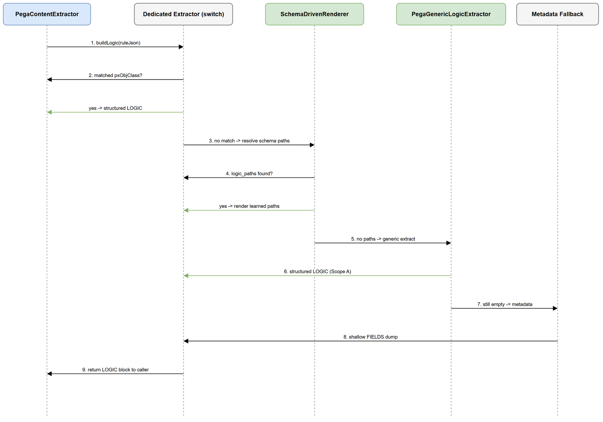

# Deployment Guide (DPG)

## SA4E-222 — Generic self-learning Pega rule understanding for LLM enrichment + rule generation

---

## Document Information

| Field | Value |
|-------|-------|
| Jira Ticket | SA4E-222 |
| Title | Generic self-learning Pega rule understanding for LLM enrichment + rule generation |
| Author | DevOps Agent |
| Version | 1.0 |
| Date | 2026-08-27 |
| Status | Draft |
| Related TDD | TDD-v1-SA4E-222.docx |

---

## Revision History

| Version | Date | Author | Changes |
|---------|------|--------|---------|
| 1.0 | 2026-08-27 | DevOps Agent | Initiate document — auto-generated from TDD and project context |

---

## Sign-Off

| Name | Role | Signature and date |
|------|------|--------------------|
| | Dev Lead | ☐ Approved for deployment |
| | QA Lead | ☐ Testing completed |
| | Ops Lead | ☐ Infrastructure ready |

---

## 1. Overview

### 1.1 Feature Summary

Adds a generic, self-learning Pega rule understanding layer (Scopes A/B/C) to the backend enrichment pipeline: deterministic generic logic extraction, LLM-driven schema learning with canonical storage (fixing DISC-1), and Pega documentation ingestion/retrieval for grounding.

### 1.2 Deployment Scope

| Item | Type | Description |
|------|------|-------------|
| PegaGenericLogicExtractor, SchemaDrivenRenderer | New | extraction/ modules (A/B) |
| PegaSchemaCreator, SchemaStorageService | New/Modified | schema/ modules (B) |
| PegaDocsIngestor, pega-concept-retriever | New | ingestion + retrieval (C) |
| CodeEnrichmentHandler | Modified | canonical-key lookup + schema context + DISC-1 fix |
| ingest-pega-docs.ts, reenrich-pega.ts | New | ops scripts (C/B) |
| Database | Reused | `knowledge_entries` (no migration) |

### 1.3 Target Environments

| Environment | URL | Deploy Order | Approval Required |
|-------------|-----|-------------|-------------------|
| DEV | backend dev instance | 1st | No |
| SIT | backend SIT instance | 2nd | No |
| UAT | backend UAT instance | 3rd | QA Sign-off |
| PROD | backend PROD instance | 4th | PM + Business Sign-off |

---

## 2. Prerequisites

### 2.1 Infrastructure

| Requirement | Status | Notes |
|-------------|--------|-------|
| Backend runtime (Node.js) | Ready | No new infra |
| SQLite KB accessible | Ready | Existing `knowledge_entries` |
| LLM endpoint (optional) | Per env | Degrades gracefully if absent |

### 2.2 Software Dependencies

| Dependency | Version | Status |
|-----------|---------|--------|
| Node.js | project-defined | Installed |
| better-sqlite3 | project-defined | Available |

### 2.3 Access Requirements

| Access | Type | Who Needs It |
|--------|------|-------------|
| Repo write | Git | Developer |
| Backend deploy | CI/CD | Automated |
| KB write (backfill) | Runtime | Backend service account |

### 2.4 Backup Requirements

- [x] No DB schema change → full DB backup still recommended before release
- [x] Application artifact (previous version) saved
- [x] Configuration backup (LLM env) if changed

---

## 3. Pre-Deployment Checklist

| # | Item | Responsible | Status |
|---|------|-------------|--------|
| 1 | Code merged to release branch | Developer | ☐ |
| 2 | All unit tests passed | Developer | ☐ |
| 3 | All integration tests passed | QA | ☐ |
| 4 | SIT/UAT sign-off obtained | QA + BA | ☐ |
| 5 | Database backup completed | DBA | ☐ (no migration, low risk) |
| 6 | Configuration files prepared | DevOps | ☐ |
| 7 | Feature flags configured | Developer | ☐ (none new) |
| 8 | Monitoring/alerting configured | DevOps | ☐ (reuse existing) |
| 9 | Rollback plan reviewed | Team | ☐ |
| 10 | Deployment window confirmed | PM | ☐ |

---

## 4. Database Migration

No database migration required. The feature reuses the existing `knowledge_entries` table. Learned schemas and ingested docs are written as ordinary rows.

### 4.1 Migration Scripts

| Order | Script | Description | Estimated Time |
|-------|--------|-------------|----------------|
| — | (none) | Reuses existing table | 0 |

### 4.2 Verification Queries

```sql
-- Confirm a learned schema row exists after backfill
SELECT id, source, type FROM knowledge_entries
WHERE type = 'PEGA_SCHEMA_ENRICHED' AND source LIKE 'pega-schema:%' LIMIT 10;

-- Confirm ingested Pega docs
SELECT id, tags FROM knowledge_entries WHERE tags LIKE '%pega-doc%' LIMIT 10;
```

### 4.3 Rollback Scripts

None required (no schema change).

---

## 5. Application Deployment

### 5.1 Deployment Flow



### 5.2 Deployment Steps

| Step | Action | Command | Verification |
|------|--------|---------|-------------|
| 1 | Build backend | `npm run build` | Build succeeds |
| 2 | Deploy artifact | CI/CD pipeline | New version running |
| 3 | Run doc ingestion (optional) | `npx tsx backend/scripts/ingest-pega-docs.ts` | `ingested` count > 0 |
| 4 | Run re-enrich backfill | `npx tsx backend/scripts/reenrich-pega.ts` | Schemas created |
| 5 | Health check | backend `/health` | 200 OK |

### 5.3 Docker Deployment (if applicable)

```bash
docker build -t sa4e-backend:{tag} .
docker stop sa4e-backend && docker rm sa4e-backend
docker run -d --name sa4e-backend -e LLM_PROVIDER=ollama -e LLM_BASE_URL=http://localhost:11434 sa4e-backend:{tag}
docker logs sa4e-backend --tail 50
```

---

## 6. Configuration Changes

### 6.1 New Environment Variables

| Variable | Description | DEV | SIT | UAT | PROD |
|----------|-------------|-----|-----|-----|------|
| (none new) | Reuses LLM_* from prior releases | — | — | — | — |

### 6.2 Application Properties Changes

| Property | Old Value | New Value | File |
|----------|-----------|-----------|------|
| (none) | n/a | n/a | n/a |

### 6.3 Feature Flags

| Flag | DEV | SIT | UAT | PROD |
|------|-----|-----|-----|------|
| (none) | — | — | — | — |

---

## 7. Post-Deployment Verification

### 7.1 Health Checks

| Check | Endpoint/Command | Expected Result | Timeout |
|-------|-----------------|-----------------|---------|
| Application health | `GET /health` | 200 OK | 30s |
| KB connectivity | schema `find` query | Returns existing schemas | 10s |

### 7.2 Smoke Tests

| # | Scenario | Steps | Expected Result |
|---|----------|-------|-----------------|
| 1 | Enrich a Pega rule | Trigger enrichment on a Pega symbol | Logic rendered; schema learned |
| 2 | Concept retrieval | Query KB for `pega-doc` | Returns attributed context |

### 7.3 Log Verification

| Log Entry | Level | Expected | Location |
|-----------|-------|----------|----------|
| Schema stored | INFO | After first enrichment of new rule type | pino |
| App started | INFO | Within 60s | pino |

### 7.4 Monitoring Dashboard

- [x] Backend metrics visible
- [x] Error rate normal
- [x] No unexpected alerts

---

## 8. Rollback Plan

### 8.1 Rollback Flow

Code-only change. Rollback = redeploy previous artifact.

### 8.2 Rollback Decision Criteria

| Condition | Action |
|-----------|--------|
| Critical defect in enrichment | Immediate rollback |
| LLM cost/quality regression | Disable via LLM config; rollback if severe |

### 8.3 Rollback Steps

| Step | Action | Command | Verification |
|------|--------|---------|-------------|
| 1 | Redeploy previous version | CI/CD rollback | Previous version running |
| 2 | Verify health | `GET /health` | 200 OK |

Learned schemas remain harmless in KB (idempotent `store` guard prevents duplicates on re-deploy).

### 8.4 Rollback Time Estimate

| Action | Estimated Time |
|--------|---------------|
| Application rollback | 5 min |
| Verification | 5 min |
| **Total** | **10 min** |

---

## 9. Environment-Specific Notes

### 9.1 DEV

Run `ingest-pega-docs.ts` + `reenrich-pega.ts` locally against dev KB.

### 9.2 SIT / UAT / PROD

Same as DEV; ensure LLM_* env matches environment. Backfill should be run once after first deploy to PROD to populate learned schemas.

---

## 10. Appendix

### Contacts

| Role | Name | Contact |
|------|------|---------|
| DevOps Lead | DevOps Agent | — |
| DBA | — | — |
| On-Call Dev | DEV Agent | — |

### Related Tickets

| Ticket | Summary | Relationship |
|--------|---------|-------------|
| SA4E-214 | Extension-driven Pega schema creation | Predecessor (legacy rows preserved) |
| SA4E-222 | Self-learning Pega understanding | Main ticket |
