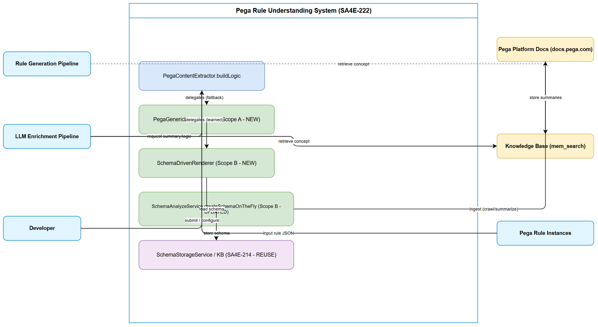
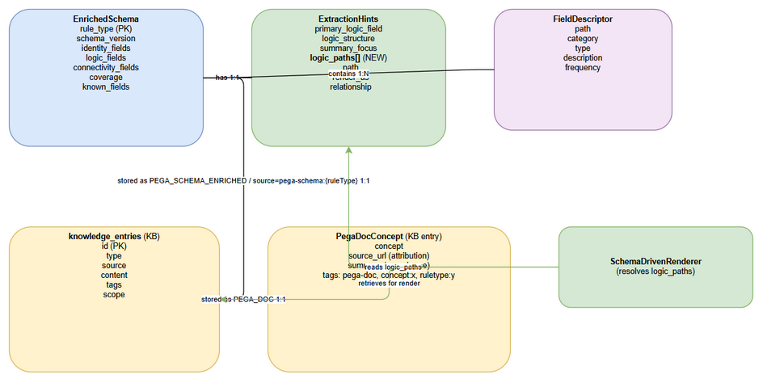

# Functional Specification Document (FSD)

## SA4E-222 — Generic self-learning Pega rule understanding for LLM enrichment + rule generation

---

## Document Information

| Field | Value |
|-------|-------|
| Feature ID | SA4E-222 |
| Title | Generic self-learning Pega rule understanding for LLM enrichment + rule generation |
| Author | BA Agent + SA Agent |
| Version | 1.0 |
| Date | 2026-08-27 |
| Status | Draft |
| Related BRD | BRD-v1-SA4E-222.docx |
| Architecture Pattern | LLM Enrichment Pipeline + Knowledge Base |

---

## Revision History

| Version | Date | Author | Changes |
|---------|------|--------|---------|
| 1.0 | 2026-08-27 | BA Agent | Initial FSD — BA draft |
| 1.0 | 2026-08-27 | SA Agent | Technical enrichment — API contracts, data model, pseudocode |

---

## 1. Introduction

### 1.1 Purpose

This FSD specifies the functional behavior of the generic self-learning Pega rule understanding layer (SA4E-222). It covers three coordinated scopes — generic logic extraction (A), self-learning schema (B), and Pega knowledge/ concept retrieval (C) — and their integration into the `CodeEnrichmentHandler` enrichment pipeline.

### 1.2 Scope

All services under `backend/src/modules/pega/extraction/`, `backend/src/modules/pega/schema/`, `backend/src/modules/memory/pega-concept-retriever.ts`, the modified `CodeEnrichmentHandler`, and the ops scripts `backend/scripts/ingest-pega-docs.ts` and `backend/scripts/reenrich-pega.ts`.

### 1.3 Definitions & Acronyms

| Term | Definition |
|------|------------|
| EnrichedSchema | Stored descriptor of a Pega rule type (fields + extraction hints) |
| nested_logic_paths | Traversable JSON paths where a rule's logic lives |
| DISC-1 | Defect: on-the-fly schemas stored under a key renderers could not find |
| KB | Knowledge Base (SQLite `knowledge_entries`) |
| LLMService | Multi-provider chat-completion service |

### 1.4 References

| Document | Location |
|----------|----------|
| BRD | BRD-v1-SA4E-222.docx |
| Source — Scope A | backend/src/modules/pega/extraction/PegaGenericLogicExtractor.ts |
| Source — Scope B | backend/src/modules/pega/schema/PegaSchemaCreator.ts, SchemaStorageService.ts, backend/src/modules/pega/extraction/SchemaDrivenRenderer.ts |
| Source — Scope C | backend/src/modules/pega/extraction/PegaDocsIngestor.ts, backend/src/modules/memory/pega-concept-retriever.ts |
| Pipeline | backend/src/engine/enrichment/CodeEnrichmentHandler.ts |

---

## 2. System Overview

### 2.1 System Context Diagram



The understanding layer sits inside the backend enrichment pipeline. It reads/writes the Knowledge Base (schemas + ingested docs) and calls `LLMService` for schema creation and doc summarization. The out-of-band CLI fetches docs.pega.com and feeds the deterministic `PegaDocsIngestor`.

### 2.2 System Architecture

- **CodeEnrichmentHandler** — orchestrates schema lookup → learn → enrich; integrates Scopes A/B/C.
- **PegaGenericLogicExtractor** (Scope A) — `extractGenericLogic`, `renderPathNodes` (shared).
- **PegaSchemaCreator** (Scope B) — LLM-driven `createSchemaOnTheFly`, `parseLlmSchema`.
- **SchemaStorageService** (Scope B) — canonical `store`/`find`/`update` in KB.
- **SchemaDrivenRenderer** (Scope B) — `resolvePath`, `renderSchemaDrivenLogic`.
- **PegaDocsIngestor** (Scope C) — deterministic `ingest` + `buildPegaDocTags`.
- **pega-concept-retriever** (Scope C) — `retrievePegaConcept` over `MemoryEngine.search`.
- **SchemaAnalyzeService / SchemaAggregator** — schema analysis/aggregation supporting Scope B.

---

## 3. Functional Requirements

### 3.1 Feature: Generic Logic Extraction (Scope A)

**Source:** BRD Story 1

#### 3.1.1 Description

Deterministic, LLM-free rendering of logic-bearing structures from any Pega rule JSON. Used when no learned schema is available, and as the fallback when schema-driven paths all miss.

#### 3.1.2 Use Case

**Use Case ID:** UC-01
**Actor:** Enrichment Engine
**Preconditions:** Parsed Pega rule JSON available
**Postconditions:** `LOGIC (generic: <key>):` block(s) or `null`

**Main Flow:**

| Step | System | Description |
|------|--------|-------------|
| 1 | Iterate top-level keys of rule JSON | |
| 2 | Skip `px*`/`pz*`/`__*` and EXCLUDED_CONTAINER_KEYS | |
| 3 | For each array, test `isLogicBearingArray` | allowlist OR ≥2 relationship keys |
| 4 | Render matching arrays via shared `renderPathNodes` | identity + relationships + expr |
| 5 | Join blocks; return `null` if none | |

**Alternative Flows:**

| ID | Condition | Steps |
|----|-----------|-------|
| AF-01 | Key in KNOWN_CONTAINER_KEYS | Treat as logic-bearing regardless of child keys |
| AF-02 | Array > 200 items | Render first 200 only (`MAX_DUMP_ITEMS`) |

**Exception Flows:**

| ID | Condition | Steps |
|----|-----------|-------|
| EF-01 | Empty/non-object rule JSON | Return `null` |

#### 3.1.3 Business Rules

| Rule ID | Rule | Source |
|---------|------|--------|
| BR-A-01 | Skip internal keys (`px*`/`pz*`/`__*`) and `pyParameters`/`pyPages`/`pyFields`/`pyColumns` | BRD Story 1 |
| BR-A-02 | Logic array = allowlist key OR ≥2 keys in RELATIONSHIP_KEYS | BRD Story 1 |
| BR-A-03 | Node render order: identity → relationship pairs (both sides present) → `target = expr` → other relationship keys → flat-scalar fallback | BRD Story 1 |
| BR-A-04 | Max 200 nodes rendered per collection | BRD Story 1 |
| BR-A-05 | Generic + schema-driven renderers share `renderPathNodes` (identical output) | BRD Story 1 |

#### 3.1.4 API Contract (Internal Function)

**Function:** `extractGenericLogic(ruleJson, opts?): string | null`
**Function:** `renderPathNodes(nodes, label): string | null`

| Parameter | Type | Required | Description |
|-----------|------|----------|-------------|
| ruleJson | Record<string, unknown> | Yes | Parsed Pega rule JSON |
| opts.genericEnabled | boolean | No | Enable fallback (default true) |
| nodes | unknown[] | Yes | Logic node array |
| label | string | Yes | Collection key used in `LOGIC (generic: <label>):` |

---

### 3.2 Feature: Self-Learning Schema Creation (Scope B)

**Source:** BRD Story 2

#### 3.2.1 Use Case

**Use Case ID:** UC-02
**Actor:** Enrichment Engine (via LLMService)
**Preconditions:** No stored schema for `ruleType`; sample body ≥50 chars
**Postconditions:** `EnrichedSchema` created & stored, or `null` on LLM failure

**Main Flow:**

| Step | System | Description |
|------|--------|-------------|
| 1 | Truncate sample body to ≤6000 chars | |
| 2 | Call LLM with schema-creation system prompt + sample | |
| 3 | `parseLlmSchema` strips fences/prose, parses JSON | |
| 4 | Normalize into `EnrichedSchema` (default all fields) | |
| 5 | `schemaStorage.store(schema)` → canonical key | |

**Alternative Flows:**

| ID | Condition | Steps |
|----|-----------|-------|
| AF-01 | LLM response wrapped in ```json fences | Strip fence before parse |
| AF-02 | `extraction_hints` nested under key | Accept both shapes |

**Exception Flows:**

| ID | Condition | Steps |
|----|-----------|-------|
| EF-01 | LLM error/timeout | log debug, return `null` |
| EF-02 | Unparseable JSON | return `null` |
| EF-03 | Duplicate rule type on store | `SchemaAlreadyExistsError` |

#### 3.2.2 Business Rules

| Rule ID | Rule | Source |
|---------|------|--------|
| BR-B-01 | Sample truncated to 6000 chars before LLM call | PegaSchemaCreator |
| BR-B-02 | LLM failure non-fatal (no schema, enrichment continues) | BRD Story 2 |
| BR-B-03 | `nested_logic_paths` filtered to string entries | BRD Story 2 |
| BR-B-04 | Stored schema `schema_version=1`, `rule_type` set, all hints defaulted | BRD Story 2 |

#### 3.2.3 API Contract (Internal Class)

**Class:** `PegaSchemaCreator`
**Method:** `createSchemaOnTheFly(ruleType: string, sampleBody: string): Promise<EnrichedSchema | null>`
**Method:** `storeSchema(schema: EnrichedSchema): Promise<number>`

---

### 3.3 Feature: Schema-Driven Rendering (Scope B)

**Source:** BRD Story 3

#### 3.3.1 Use Case

**Use Case ID:** UC-03
**Actor:** Enrichment Engine
**Preconditions:** `EnrichedSchema` with `nested_logic_paths`
**Postconditions:** `LOGIC` blocks from resolved paths, or `null` (→ generic fallback)

**Main Flow:**

| Step | System | Description |
|------|--------|-------------|
| 1 | For each path, `tokenizePath` → segments | keys / indices / `[]` wildcard |
| 2 | `resolveNodes` walks rule JSON, collects leaf nodes | |
| 3 | If nodes found, `renderPathNodes(nodes, path)` | shared renderer |
| 4 | If no nodes, WARN and skip path | tolerant (OQ-5) |
| 5 | If all paths miss → return `null` | caller uses generic |

**Alternative Flows:**

| ID | Condition | Steps |
|----|-----------|-------|
| AF-01 | Wildcard `[].` path | Expand across all array elements |

**Exception Flows:**

| ID | Condition | Steps |
|----|-----------|-------|
| EF-01 | Empty paths array | Return `null` immediately |

#### 3.3.2 Business Rules

| Rule ID | Rule | Source |
|---------|------|--------|
| BR-B-05 | Unresolvable path → WARN, continue (tolerant) | BRD Story 3 |
| BR-B-06 | All paths miss → `null` → generic fallback | BRD Story 3 |
| BR-B-07 | Path notation: dotted, `[n]`, `[]`, `[].` | BRD Story 3 |

#### 3.3.3 API Contract (Internal Function)

**Function:** `renderSchemaDrivenLogic(ruleJson, paths: string[], logger?): string | null`
**Function:** `resolvePath(ruleJson, path): unknown[]`

---

### 3.4 Feature: Canonical Schema Storage (Scope B — DISC-1 fix)

**Source:** BRD Story 4

#### 3.4.1 Use Case

**Use Case ID:** UC-04
**Actor:** System (SchemaStorageService)
**Preconditions:** KB `knowledge_entries` available
**Postconditions:** Schema persisted/retrieved under canonical key

**Main Flow:**

| Step | System | Description |
|------|--------|-------------|
| 1 | `store`: build `source='pega-schema:{ruleType}'`, pure-JSON content | |
| 2 | Guard duplicate; INSERT `type='PEGA_SCHEMA_ENRICHED'`, `scope=PROJECT`, `tier=SEMANTIC` | |
| 3 | `find`: SELECT by canonical source, parse JSON | |
| 4 | `update`: append fields, bump `schema_version`, rewrite | |

**Alternative Flows:**

| ID | Condition | Steps |
|----|-----------|-------|
| AF-01 | Legacy SA4E-214 rows | `CodeEnrichmentHandler.findEnrichedSchema` falls back to `pega-schema-enriched/{ruleType}` |

**Exception Flows:**

| ID | Condition | Steps |
|----|-----------|-------|
| EF-01 | Parse failure on read | WARN, return `null` |
| EF-02 | Duplicate on store | `SchemaAlreadyExistsError` |
| EF-03 | Update on unknown rule type | `SchemaNotFoundError` |

#### 3.4.2 Business Rules

| Rule ID | Rule | Source |
|---------|------|--------|
| BR-B-08 | Canonical key = `pega-schema:{ruleType}` (pure JSON) | BRD Story 4 |
| BR-B-09 | Schemas stored `scope=PROJECT`, `tier=SEMANTIC` | SchemaStorageService |
| BR-B-10 | `update` appends to bucket by `field.category` (identity/connectivity/logic) | SchemaStorageService |
| BR-B-11 | Legacy SA4E-214 rows remain readable as fallback | BRD Story 4 |

---

### 3.5 Feature: Pega Documentation Ingestion (Scope C)

**Source:** BRD Story 5

#### 3.5.1 Use Case

**Use Case ID:** UC-05
**Actor:** Operator (CLI) → PegaDocsIngestor
**Preconditions:** Pages fetched (out-of-band), summarizer/store injected
**Postconditions:** KB entries created with `pega-doc` tags + source attribution

**Main Flow:**

| Step | Actor | System | Description |
|------|-------|--------|-------------|
| 1 | Calls `ingest(pages)` | | Batch ingest |
| 2 | | `summarizer.summarize(page)` | Paraphrase (no verbatim) |
| 3 | | `buildPegaDocTags(page)` | `pega-doc,concept:{name}[,ruletype:{x}]` |
| 4 | | `store.store({content: summary+Source, source: url, tags, summary: title})` | Persist |
| 5 | | Return `{ingested, failed}` | Count per-page results |

**Alternative Flows:**

| ID | Condition | Steps |
|----|-----------|-------|
| AF-01 | No `ruleType` | Omit `ruletype:` tag |

**Exception Flows:**

| ID | Condition | Steps |
|----|-----------|-------|
| EF-01 | Summarize/store throws | WARN log, `failed++`, continue batch |

#### 3.5.2 Business Rules

| Rule ID | Rule | Source |
|---------|------|--------|
| BR-C-01 | Content = paraphrase + `Source: {url}` (no verbatim bulk copy) | BRD Story 5 |
| BR-C-02 | Tags always include `pega-doc` + `concept:{name}` | BRD Story 5 |
| BR-C-03 | `ruletype:{x}` tag only when `ruleType` present | BRD Story 5 |
| BR-C-04 | Per-page failure isolated; batch returns counts | BRD Story 5 |

#### 3.5.3 API Contract (Internal Class)

**Class:** `PegaDocsIngestor`
**Method:** `ingest(pages: PegaDocPage[]): Promise<{ ingested: number; failed: number }>`
**Function:** `buildPegaDocTags(page: PegaDocPage): string`

---

### 3.6 Feature: Pega Concept Retrieval (Scope C)

**Source:** BRD Story 6

#### 3.6.1 Use Case

**Use Case ID:** UC-06
**Actor:** Enrichment / Rule-gen Engine
**Preconditions:** KB has `pega-doc` entries
**Postconditions:** Attributed context string or `''`

**Main Flow:**

| Step | System | Description |
|------|--------|-------------|
| 1 | Build query `pega concept` + ruleType + topic | |
| 2 | `engine.search(query, k, ...)` | |
| 3 | Filter `hasPegaDocTags` (pega-doc + optional ruletype/concept) | |
| 4 | Map to hits; concatenate `[type] summary (source) \n content` | |
| 5 | Return `''` if no hits | |

**Alternative Flows:**

| ID | Condition | Steps |
|----|-----------|-------|
| AF-01 | `k` not provided | Default 5 |

**Exception Flows:**

| ID | Condition | Steps |
|----|-----------|-------|
| EF-01 | No `pega-doc` hits | Return `''` (not error) |

#### 3.6.2 Business Rules

| Rule ID | Rule | Source |
|---------|------|--------|
| BR-C-05 | Only entries with `pega-doc` tag are eligible | BRD Story 6 |
| BR-C-06 | `ruletype:`/`concept:` filters case-insensitive substring on tags | BRD Story 6 |
| BR-C-07 | Returned blocks preserve `source` URL | BRD Story 6 |

#### 3.6.3 API Contract (Internal Function)

**Function:** `retrievePegaConcept(engine, opts): Promise<string>`
**Interface:** `PegaConceptSearchEngine.search(query, limit?, tier?, type?, scopeCtx?)`

| Parameter | Type | Required | Description |
|-----------|------|----------|-------------|
| opts.ruleType | string | No | Filter `ruletype:{x}` |
| opts.topic | string | No | Filter `concept:{name}` |
| opts.k | number | No | Max hits (default 5) |
| opts.scopeCtx | ScopeContext | No | Scope isolation |

---

### 3.7 Feature: Re-enrichment / Backfill (Scope B/C — Ops)

**Source:** BRD Story 7

#### 3.7.1 Use Case

**Use Case ID:** UC-07
**Actor:** Operator (script)
**Preconditions:** Pega symbols already indexed
**Postconditions:** Learned schemas populated for observed rule types

**Main Flow:**

| Step | System | Description |
|------|--------|-------------|
| 1 | `scripts/reenrich-pega.ts` enumerates Pega symbols | |
| 2 | Re-invokes enrichment → triggers `createSchemaOnTheFly` for unseen types | |
| 3 | Duplicate `store` handled (idempotent) | |

---

## 4. Data Model

### 4.1 Entity Relationship Overview



The understanding layer persists two logical entity kinds into the existing `knowledge_entries` table: **Enriched Schemas** (Scope B) and **Pega Doc entries** (Scope C). It also reads/writes the in-memory `EnrichedSchema` object model.

### 4.2 Logical Entity: EnrichedSchema (object model)

Defined in `backend/src/models/pega-schema.models.ts` (`ExtractionHintsSchema` extended with `nested_logic_paths`).

| Attribute | Type | Required | Description |
|-----------|------|----------|-------------|
| rule_type | string | Yes | Pega rule type |
| schema_version | integer | Yes | Starts at 1, bumped on `update` |
| created_at / updated_at | string (ISO) | Yes | Timestamps |
| identity_fields | object | Yes | Map of identity field descriptors |
| logic_fields | object | Yes | Map of logic field descriptors |
| connectivity_fields | object | Yes | Map of connectivity field descriptors |
| extraction_hints.primary_logic_field | string \| null | Yes | Primary logic field name |
| extraction_hints.logic_structure | string \| null | Yes | Description of logic structure |
| extraction_hints.summary_focus | string \| null | Yes | What the summary should focus on |
| extraction_hints.nested_logic_paths | string[] | Yes (default []) | Traversable logic paths (SA4E-222) |
| extraction_hints.path_render_hint | string \| null | Yes | Optional render hint |
| known_fields | string[] | Yes | All known field paths |
| coverage | number | Yes | Field coverage % |
| discovered_sections | string[] | Yes | Discovered sections |

### 4.3 Logical Entity: knowledge_entries (storage)

Stored rows for both schemas and docs:

| Column | Schema row | Doc row |
|--------|-----------|---------|
| type | `PEGA_SCHEMA_ENRICHED` | (doc type from store) |
| source | `pega-schema:{ruleType}` | page.url |
| content | Pure JSON `EnrichedSchema` | paraphrase + `Source: {url}` |
| tags | `pega,schema,enriched,{ruleType}` | `pega-doc,concept:{name}[,ruletype:{x}]` |
| scope | `PROJECT` | (injector-defined) |
| tier | `SEMANTIC` | (injector-defined) |
| enrichment_status | `done` | n/a |

### 4.4 Relationships

| From | To | Cardinality | Description |
|------|-----|-------------|-------------|
| ruleType | EnrichedSchema | 1:1 | One canonical schema per rule type |
| PegaDocPage | knowledge_entries | 1:1 | One KB entry per ingested page |
| EnrichedSchema.nested_logic_paths | rule JSON | 1:N | Paths resolve to many logic nodes |

---

## 5. Integration Specifications

### 5.1 LLMService

| Attribute | Value |
|-----------|-------|
| Purpose | On-the-fly schema creation (Scope B), doc summarization (Scope C) |
| Direction | Outbound (system calls LLM) |
| Data Format | Chat messages → JSON/text |
| Frequency | On first encounter per rule type (B); per doc page (C) |

### 5.2 Knowledge Base (MemoryEngine / knowledge_entries)

| Attribute | Value |
|-----------|-------|
| Purpose | Store schemas + docs; retrieve concepts via `mem_search` |
| Direction | Read/Write |
| Data Format | SQLite rows (JSON content) |
| Frequency | Per enrichment (read schema), per ingest (write docs) |

### 5.3 CodeEnrichmentHandler (Pipeline)

| Attribute | Value |
|-----------|-------|
| Purpose | Orchestrate schema lookup → learn → enrich with schema context |
| Direction | Internal call |
| Key change | Canonical-key lookup + `Nested Logic Paths` in prompt; `PegaSchemaCreator`/`SchemaStorageService` injected |

---

## 6. Processing Logic

### 6.1 Generic Logic Extraction Algorithm

**Trigger:** Render logic with no/empty learned schema
**Input:** parsed rule JSON
**Output:** `LOGIC` blocks or `null`

```
function extractGenericLogic(ruleJson):
    blocks = []
    for (key, value) in ruleJson:
        if isInternalKey(key) or key in EXCLUDED_CONTAINER_KEYS: continue
        if not Array.isArray(value) or value.length == 0: continue
        if not isLogicBearingArray(key, value): continue
        block = renderPathNodes(value, key)
        if block: blocks.push(block)
    return blocks.length ? blocks.join("\n\n") : null

function isLogicBearingArray(key, arr):
    if key in KNOWN_CONTAINER_KEYS: return true
    keyUnion = union of non-internal keys across arr items
    relHits = count(keys in keyUnion that are in RELATIONSHIP_KEYS)
    return relHits >= 2
```

### 6.2 Self-Learning Schema Creation Algorithm

**Trigger:** `CodeEnrichmentHandler` finds no schema for `ruleType`
**Input:** ruleType, sample body
**Output:** stored `EnrichedSchema` or `null`

```
function createSchemaOnTheFly(ruleType, sampleBody):
    truncated = sampleBody.length > 6000 ? sampleBody.slice(0,6000)+'...' : sampleBody
    raw = llm.complete(SCHEMA_PROMPT, ruleType, truncated)   // non-fatal on throw
    return parseLlmSchema(raw, ruleType)

function parseLlmSchema(raw, ruleType):
    jsonText = stripFences(stripProse(raw))
    parsed = JSON.parse(jsonText)              // null on failure
    hints = parsed.extraction_hints ?? parsed ?? {}
    return {
      rule_type, schema_version:1, created_at, updated_at,
      identity_fields:{}, logic_fields:{}, connectivity_fields:{},
      extraction_hints: { primary_logic_field, logic_structure, summary_focus,
                          nested_logic_paths: string[] , path_render_hint },
      known_fields:[], coverage:0, discovered_sections:[]
    }
```

### 6.3 Schema-Driven Rendering Algorithm

**Trigger:** Learned schema has `nested_logic_paths`
**Input:** rule JSON, paths, logger
**Output:** `LOGIC` blocks or `null`

```
function renderSchemaDrivenLogic(ruleJson, paths, logger):
    blocks = []
    for path in paths:
        nodes = resolvePath(ruleJson, path)
        if nodes.length == 0:
            logger.warn({path}, 'Path did not resolve; skipped')
            continue
        block = renderPathNodes(nodes, path)
        if block: blocks.push(block)
    return blocks.length ? blocks.join("\n\n") : null

function resolvePath(ruleJson, path):
    segs = tokenizePath(path)   // keys, [n], [], [].
    out = []
    resolveNodes(ruleJson, segs, out)
    return out
```

### 6.4 Concept Retrieval Algorithm

**Trigger:** Enrichment/rule-gen needs Pega grounding
**Input:** engine, {ruleType?, topic?, k?, scopeCtx?}
**Output:** attributed context string or `''`

```
function retrievePegaConcept(engine, opts):
    query = ['pega concept']
    if opts.ruleType: query.push(opts.ruleType)
    if opts.topic: query.push(opts.topic)
    results = engine.search(query.join(' '), opts.k ?? 5, undefined, undefined, opts.scopeCtx)
    hits = results.filter(r => hasPegaDocTags(r, opts))
                  .map(r => {id,type,summary,content,source,tags,score})
    if hits.length == 0: return ''
    return hits.map(h => `[${h.type}] ${h.summary}${h.source?` (source: ${h.source})`:''}\n${h.content}`).join('\n\n')
```

---

## 7. Security Requirements

### 7.1 Data Sensitivity & IP

| Data Type | Classification | Requirement |
|-----------|---------------|-------------|
| Ingested Pega docs | External IP | Paraphrase-only + `Source:` attribution (NFR-5); never verbatim bulk copy |
| Learned schemas | Internal | Stored `scope=PROJECT` (shared within project) |
| Rule JSON bodies | Internal | Used only for learning/rendering; never persisted verbatim as schema content |

### 7.2 Audit & Isolation

| Event | Logged | Note |
|-------|--------|------|
| Schema store / update | INFO via SchemaStorageService | ruleType, id/version |
| Unresolvable schema path | WARN (tolerant) | OQ-5 |
| Doc ingest failure | WARN | url, error |
| Concept retrieval | via MemoryEngine scope isolation | `scopeCtx` enforced |

---

## 8. Non-Functional Requirements

| Category | Business Requirement | Acceptance Criteria |
|----------|---------------------|---------------------|
| Performance | Generic extraction is LLM-free | <10ms typical for a single rule JSON |
| Performance | Schema creation bounded | Sample truncated to 6000 chars |
| Reliability | LLM failure non-fatal | Enrichment continues without learned schema |
| Reliability | Schema storage idempotent | Duplicate `store` throws, handled |
| Scalability | Logic rendering | ≤200 nodes/collection |
| Security/IP | Doc ingestion | Paraphrase + attribution only |
| Maintainability | Shared renderer | Single `renderPathNodes` for A & B |
| Testability | Doc ingestor | Deterministic core, no internet needed |
| Observability | Schema miss | WARN logged, rendering continues |

---

## 9. Error Handling

| Scenario | Severity | Message | Recovery |
|----------|----------|---------|----------|
| LLM schema creation fails | Warning | debug log only | Enrichment continues (no schema) |
| Unparseable LLM JSON | Warning | returns `null` | Generic extractor used |
| Duplicate schema store | Error | `SchemaAlreadyExistsError` | Caller handles / skips |
| Update unknown rule type | Error | `SchemaNotFoundError` | Ensure `find` first |
| Schema path unresolved | Warning | WARN (tolerant) | Skip path; fallback if all miss |
| Doc page ingest fails | Warning | WARN per page | `failed++`, batch continues |
| Concept retrieval no hits | Info | returns `''` | Caller proceeds without grounding |

---

## 10. Testing Considerations

### 10.1 Key Test Scenarios

| ID | Scenario | Input | Expected | Priority |
|----|----------|-------|----------|----------|
| TC-01 | Generic detects known container | Activity w/ `pySteps` | `LOGIC (generic: pySteps):` block | High |
| TC-02 | Generic detects by relationship keys | Array w/ `from`+`to` not in allowlist | Detected as logic | High |
| TC-03 | Generic skips non-logic | Only `px*`/`pyParameters` | `null` | High |
| TC-04 | Generic caps nodes | Array >200 | ≤200 rendered | Medium |
| TC-05 | Generic + schema output identical shape | Same node via both | Identical formatting | High |
| TC-06 | Schema creation parses fenced JSON | ```json ... ``` response | Valid schema | High |
| TC-07 | Schema creation fails safely | LLM throws | `null`, no partial write | High |
| TC-08 | Schema store/find round-trip | store then find | Equal schema | High |
| TC-09 | Schema-driven resolves wildcard | `pyStages[].pyProcesses[]` | All nodes rendered | High |
| TC-10 | Schema-driven tolerant miss | All paths missing | `null` → generic | High |
| TC-11 | Doc ingest tags | page w/ ruleType | `pega-doc,concept:x,ruletype:y` | High |
| TC-12 | Doc ingest failure isolation | one bad page | `failed=1`, others ingested | High |
| TC-13 | Concept retrieval filter | KB has `pega-doc` | Returns attributed content | High |
| TC-14 | Concept retrieval no hits | no `pega-doc` | `''` | Medium |
| TC-15 | DISC-1 fixed | on-the-fly schema stored | renderer finds via canonical key | High |

---

## 11. Appendix

### Diagram Index

| # | Diagram | Image | Source (editable) |
|---|---------|-------|-------------------|
| 1 | System Context | [system-context.png](diagrams/system-context.png) | [system-context.drawio](diagrams/system-context.drawio) |
| 2 | Business Flow | [business-flow.png](diagrams/business-flow.png) | [business-flow.drawio](diagrams/business-flow.png) |
| 3 | Use Case | [use-case.png](diagrams/use-case.png) | [use-case.drawio](diagrams/use-case.png) |
| 4 | ER Diagram | [er-diagram.png](diagrams/er-diagram.png) | [er-diagram.drawio](diagrams/er-diagram.png) |
| 5 | Sequence: Schema Creation | [sequence-schemacreation.png](diagrams/sequence-schemacreation.png) | [sequence-schemacreation.drawio](diagrams/sequence-schemacreation.drawio) |
| 6 | Sequence: Build Logic | [sequence-buildlogic.png](diagrams/sequence-buildlogic.png) | [sequence-buildlogic.drawio](diagrams/sequence-buildlogic.png) |
| 7 | State: Schema Lifecycle | [state-schema-lifecycle.png](diagrams/state-schema-lifecycle.png) | [state-schema-lifecycle.drawio](diagrams/state-schema-lifecycle.drawio) |
