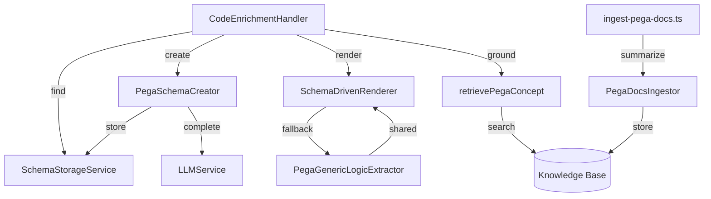
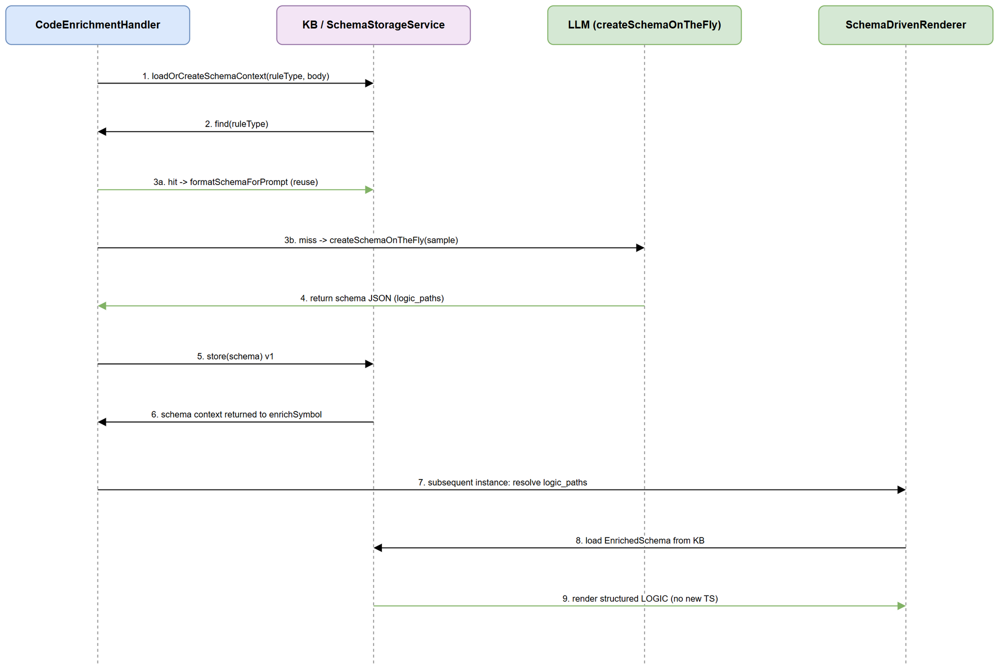

# Technical Design Document (TDD)

## SA4E-222 — Generic self-learning Pega rule understanding for LLM enrichment + rule generation

---

## Document Information

| Field | Value |
|-------|-------|
| Jira Ticket | SA4E-222 |
| Title | Generic self-learning Pega rule understanding for LLM enrichment + rule generation |
| Author | SA Agent |
| Version | 1.0 |
| Date | 2026-08-27 |
| Status | Draft |
| Related BRD | BRD-v1-SA4E-222.docx |
| Related FSD | FSD-v1-SA4E-222.docx |

---

## Author Tracking

| Role | Name - Position | Responsibility |
|------|-----------------|----------------|
| Author | SA Agent – Solution Architect | Create document |
| Peer Reviewer | DEV Agent – Senior Developer | Review document |

---

## Revision History

| Version | Date | Author | Changes |
|---------|------|--------|---------|
| 1.0 | 2026-08-27 | SA Agent | Initiate document — auto-generated from BRD and FSD |

---

## Sign-Off

| Name | Signature and date |
|------|--------------------|
| | ☐ I agree and confirm the technical design in this TDD |
| | ☐ I agree and confirm the technical design in this TDD |

---

## 1. Introduction

> **Scope Boundary:** This TDD specifies HOW to implement the requirements defined in the FSD. It does NOT repeat functional requirements, business rules, use cases, or UI specifications — refer to the FSD for those.

### 1.1 Purpose

Define the technical implementation of the generic self-learning Pega rule understanding layer (Scopes A/B/C) and its integration into `CodeEnrichmentHandler`, so the enrichment pipeline can understand any Pega rule type and ground itself in authoritative Pega knowledge.

### 1.2 Scope

Components under `backend/src/modules/pega/extraction/`, `backend/src/modules/pega/schema/`, `backend/src/modules/memory/pega-concept-retriever.ts`, the modified `backend/src/engine/enrichment/CodeEnrichmentHandler.ts`, and ops scripts `backend/scripts/ingest-pega-docs.ts` + `backend/scripts/reenrich-pega.ts`.

### 1.3 Technology Stack

| Layer | Technology | Version |
|-------|-----------|---------|
| Language | TypeScript | project-defined |
| Runtime | Node.js | project-defined |
| LLM | LLMService (multi-provider) | ollama/openai/anthropic/gemini |
| Storage | SQLite (better-sqlite3) via KB `knowledge_entries` | project-defined |
| Logging | pino | project-defined |
| Testing | Vitest | project-defined |

### 1.4 Design Principles

- **Determinism where possible** — generic extraction is LLM-free (Scope A) for reliability and zero token cost.
- **Graceful degradation** — LLM unavailability never blocks enrichment (Scope B non-fatal).
- **Single source of truth** — one canonical schema key (`pega-schema:{ruleType}`) fixes DISC-1.
- **Shared rendering** — generic + schema-driven renderers reuse `renderPathNodes` (identical output).
- **Testability without I/O** — doc ingestor core is deterministic; network/LLM injected.

### 1.5 Constraints

- Must reuse existing KB `knowledge_entries` table (no new migration required).
- Must remain backward compatible with SA4E-214 legacy schema rows.
- LLM calls must be bounded (sample truncation to 6000 chars).

### 1.6 References

| Document | Location |
|----------|----------|
| BRD | BRD-v1-SA4E-222.docx |
| FSD | FSD-v1-SA4E-222.docx |
| Source (A) | backend/src/modules/pega/extraction/PegaGenericLogicExtractor.ts |
| Source (B) | backend/src/modules/pega/schema/PegaSchemaCreator.ts, SchemaStorageService.ts, backend/src/modules/pega/extraction/SchemaDrivenRenderer.ts |
| Source (C) | backend/src/modules/pega/extraction/PegaDocsIngestor.ts, backend/src/modules/memory/pega-concept-retriever.ts |

---

## 2. System Architecture

### 2.1 Architecture Overview

The understanding layer is embedded in the backend enrichment pipeline. It reads/writes the Knowledge Base and calls `LLMService` for schema creation (B) and doc summarization (C). The out-of-band CLI fetches docs.pega.com and drives the deterministic `PegaDocsIngestor`.


### 2.2 Component Diagram

| Component | Responsibility | Technology |
|-----------|---------------|------------|
| CodeEnrichmentHandler | Orchestrates schema lookup → learn → enrich | TypeScript class |
| PegaGenericLogicExtractor | LLM-free logic extraction (A) | TypeScript module |
| PegaSchemaCreator | LLM-driven schema creation (B) | TypeScript class |
| SchemaStorageService | Canonical store/find/update (B) | TypeScript class |
| SchemaDrivenRenderer | Path-resolved rendering (B) | TypeScript module |
| PegaDocsIngestor | Deterministic doc ingestion (C) | TypeScript class |
| pega-concept-retriever | KB concept retrieval (C) | TypeScript function |
| SchemaAnalyzeService / SchemaAggregator | Schema analysis/aggregation (B) | TypeScript modules |



### 2.3 Deployment Architecture

No new services or containers. All logic runs inside the existing backend process. The doc-ingestion CLI runs out-of-band (developer/operator machine) and writes into the same KB.

### 2.4 Communication Patterns

| From | To | Protocol | Pattern | Description |
|------|----|----------|---------|-------------|
| CodeEnrichmentHandler | LLMService | In-process call | Sync | Schema creation / summarization |
| CodeEnrichmentHandler | SchemaStorageService | In-process | Sync | KB CRUD |
| retrievePegaConcept | MemoryEngine.search | In-process | Sync | Concept grounding |
| ingest-pega-docs CLI | docs.pega.com | HTTPS | Async (out-of-band) | Fetch docs |

---

## 3. API Design

> Functional API contracts are defined in FSD §3.x. This section specifies the technical implementation surface (internal functions/classes).

### 3.1 Internal API Overview

| # | Symbol | Kind | Description | Source |
|---|--------|------|-------------|--------|
| 1 | `extractGenericLogic(ruleJson, opts?)` | function | Generic logic extraction (A) | UC-01 |
| 2 | `renderPathNodes(nodes, label)` | function | Shared node renderer (A/B) | UC-01/03 |
| 3 | `PegaSchemaCreator.createSchemaOnTheFly` | method | LLM schema creation (B) | UC-02 |
| 4 | `SchemaStorageService.store/find/update` | methods | Canonical schema CRUD (B) | UC-04 |
| 5 | `renderSchemaDrivenLogic(ruleJson, paths, logger?)` | function | Schema-driven rendering (B) | UC-03 |
| 6 | `resolvePath(ruleJson, path)` | function | Path resolver (B) | UC-03 |
| 7 | `PegaDocsIngestor.ingest(pages)` | method | Doc ingestion (C) | UC-05 |
| 8 | `buildPegaDocTags(page)` | function | Tag builder (C) | UC-05 |
| 9 | `retrievePegaConcept(engine, opts)` | function | Concept retrieval (C) | UC-06 |

### 3.2 Key interfaces (TypeScript)

```typescript
// Scope A
export function extractGenericLogic(ruleJson: Record<string, unknown>, opts?: ExtractOptions): string | null;
export function renderPathNodes(nodes: unknown[], label: string): string | null;

// Scope B
export class PegaSchemaCreator {
  createSchemaOnTheFly(ruleType: string, sampleBody: string): Promise<EnrichedSchema | null>;
  storeSchema(schema: EnrichedSchema): Promise<number>;
}
export interface ISchemaStorageService {
  store(schema: EnrichedSchema): Promise<number>;
  find(ruleType: string): Promise<EnrichedSchema | null>;
  update(ruleType: string, newFields: FieldDescriptor[]): Promise<number>;
}
export function renderSchemaDrivenLogic(ruleJson: Record<string, unknown>, paths: string[], logger?: Logger): string | null;
export function resolvePath(ruleJson: Record<string, unknown>, path: string): unknown[];

// Scope C
export class PegaDocsIngestor {
  ingest(pages: PegaDocPage[]): Promise<{ ingested: number; failed: number }>;
}
export function retrievePegaConcept(engine: PegaConceptSearchEngine, opts: RetrievePegaConceptOptions): Promise<string>;
```

### 3.3 Error Codes

| Code | Message | Trigger |
|------|---------|---------|
| SCHEMA_EXISTS | `Schema already exists for rule type: {x}` | Duplicate `store` |
| SCHEMA_NOT_FOUND | `Schema not found for rule type: {x}` | `update` on unknown type |

---

## 4. Database Design

> Logical model is in FSD §4. No DDL migration is required — existing `knowledge_entries` table is reused.

### 4.1 Schema Overview


### 4.2 Storage Layout

| Column | Schema row value | Doc row value |
|--------|------------------|---------------|
| type | `PEGA_SCHEMA_ENRICHED` | (doc type) |
| source | `pega-schema:{ruleType}` | page.url |
| content | Pure JSON `EnrichedSchema` | paraphrase + `Source: {url}` |
| tags | `pega,schema,enriched,{ruleType}` | `pega-doc,concept:{name}[,ruletype:{x}]` |
| scope | `PROJECT` | (injector-defined) |
| tier | `SEMANTIC` | (injector-defined) |
| enrichment_status | `done` | n/a |

### 4.3 Query Patterns

| Operation | Query Pattern | Expected Performance |
|-----------|--------------|---------------------|
| Find schema | `SELECT content FROM knowledge_entries WHERE type='PEGA_SCHEMA_ENRICHED' AND source=? LIMIT 1` | <10ms (indexed by type+source) |
| Store schema | `INSERT INTO knowledge_entries (...)` with duplicate guard | <20ms |
| Concept search | `MemoryEngine.search` + tag filter | <200ms (hybrid) |

### 4.4 Migration Plan

| Order | Script | Description | Estimated Time | Rollback |
|-------|--------|-------------|----------------|----------|
| — | (none) | Reuses existing `knowledge_entries`; no schema migration | 0 | n/a |

---

## 5. Class / Module Design

### 5.1 Package Structure

```
backend/src/modules/pega/
├── extraction/
│   ├── PegaGenericLogicExtractor.ts   # Scope A
│   ├── SchemaDrivenRenderer.ts        # Scope B
│   ├── PegaDocsIngestor.ts            # Scope C
│   ├── types.ts                       # shared models
│   └── __tests__/
├── schema/
│   ├── PegaSchemaCreator.ts           # Scope B
│   ├── SchemaStorageService.ts        # Scope B
│   ├── SchemaAnalyzeService.ts
│   └── SchemaAggregator.ts
backend/src/modules/memory/
├── pega-concept-retriever.ts          # Scope C
backend/scripts/
├── ingest-pega-docs.ts                # out-of-band CLI (C)
└── reenrich-pega.ts                   # backfill (B/C)
```

### 5.2 Key Interfaces

```typescript
export interface ExtractOptions {
  nestedLogicPaths?: string[];
  genericEnabled?: boolean;
}
export const RELATIONSHIP_KEYS = [ 'from','to','when','value','target','result','source',
  'expression','pyStepNum','pyAction','pyWhenName','pyResult','pySource','pyTarget','label','name','id','pyLabel' ];
```

### 5.3 Design Patterns

| Pattern | Where Used | Rationale |
|---------|-----------|-----------|
| Repository | SchemaStorageService | Encapsulates all KB ops for schemas; single writer/reader (DISC-1 fix) |
| Strategy | Generic vs schema-driven rendering | Chosen at runtime based on schema availability |
| Dependency Injection | PegaDocsIngestor (summarizer/store injected) | Deterministic, unit-testable without internet |
| Adapter | `PegaConceptSearchEngine` | Structural typing over MemoryEngine.search |

### 5.4 Error Handling

| Exception | HTTP Status | Error Code | When Thrown |
|-----------|-------------|------------|------------|
| SchemaAlreadyExistsError | n/a (internal) | SCHEMA_EXISTS | Duplicate `store` |
| SchemaNotFoundError | n/a (internal) | SCHEMA_NOT_FOUND | `update` unknown type |
| LLM failure | n/a | — | `createSchemaOnTheFly` returns `null` (non-fatal) |

---

## 6. Integration Design

### 6.1 External System: LLMService

| Attribute | Value |
|-----------|-------|
| Protocol | In-process (chat completion) |
| Authentication | Per provider env config |
| Timeout | Inherits `LLM_ENRICH_TIMEOUT_MS` (default 120000) |
| Retry Policy | None for schema creation (non-fatal on failure) |
| Circuit Breaker | n/a (failure degrades to generic extraction) |

**Sequence — Schema Creation:**



### 6.2 External System: Knowledge Base

| Attribute | Value |
|-----------|-------|
| Protocol | SQLite (better-sqlite3) |
| Reads | `find` schema, `search` concepts |
| Writes | `store` schema, `store` doc entries |

**Sequence — Build Logic:**


### 6.3 Out-of-band: docs.pega.com

| Attribute | Value |
|-----------|-------|
| Protocol | HTTPS (fetch in CLI) |
| Authentication | None |
| Data Mapping | page text → summarizer → paraphrase + `Source:` |

---

## 7. Security Design

### 7.1 Authentication

No new auth surface; reuses backend process identity and KB scope isolation.

### 7.2 Authorization

| Role | Capability |
|------|------------|
| System (pipeline) | Read/write `pega-schema:*` and `pega-doc` entries (scope=PROJECT) |
| Agent (via mem_search) | Read `pega-doc` (subject to scopeCtx) |

### 7.3 Data Protection

| Data Type | At Rest | In Transit | In Logs |
|-----------|---------|------------|---------|
| Ingested Pega docs | SQLite | n/a | Paraphrase only; no verbatim bulk copy (NFR-5/IP) |
| Learned schemas | SQLite | n/a | JSON content logged at INFO on store/update |
| Rule JSON bodies | Not persisted as schema | n/a | Never written to KB as schema content |

### 7.4 Input Validation

| Field | Validation | Sanitization |
|-------|-----------|--------------|
| ruleType | Non-empty string | Lowercased in tag compare |
| page.content | Non-empty after fetch | Summarized (not stored verbatim) |
| path segments | Regex tokenized | Invalid segments skipped |

---

## 8. Performance & Scalability

### 8.1 Caching Strategy

| Cache | What | TTL | Eviction | Technology |
|-------|------|-----|----------|------------|
| KB schema row | Learned `EnrichedSchema` | Until `update` | Replaced on update | SQLite row |

### 8.2 Performance Targets

| Operation | Target | Measurement |
|-----------|--------|-------------|
| Generic extraction (LLM-free) | <10ms typical | Unit benchmark |
| Schema creation (LLM) | Bounded by LLM; sample ≤6000 chars | LLM latency |
| Concept retrieval | <200ms | Integration test |
| Logic nodes rendered | ≤200/collection | `MAX_DUMP_ITEMS` cap |

---

## 9. Monitoring & Observability

### 9.1 Logging

| Log Event | Level | Fields | Destination |
|-----------|-------|--------|-------------|
| Schema stored | INFO | ruleType, id | pino |
| Schema updated | INFO | ruleType, version | pino |
| Unresolvable schema path | WARN | path | pino (OQ-5 tolerant) |
| Doc ingest failed | WARN | url, err | pino |
| LLM schema failure | DEBUG | ruleType, err | pino (non-fatal) |

### 9.2 Metrics

| Metric | Type | Description | Alert Threshold |
|--------|------|-------------|-----------------|
| schemas_learned_total | Counter | Count of stored schemas | n/a |
| schema_path_miss_total | Counter | Unresolvable path skips | investigate if spiking |
| doc_ingest_failed_total | Counter | Failed doc pages | >10% of batch |

### 9.3 Health Checks

Reuses backend health endpoint; no new checks required.

---

## 10. Deployment Considerations

### 10.1 Environment Configuration

| Property | DEV | SIT | UAT | PROD |
|----------|-----|-----|-----|------|
| LLM_PROVIDER | ollama | per env | per env | per env |
| LLM_MODEL | qwen2.5:7b-instruct-q4_K_M | per env | per env | per env |
| LLM_BASE_URL | http://localhost:11434 | per env | per env | per env |

### 10.2 Feature Flags

| Flag | Default | Description |
|------|---------|-------------|
| (none new) | — | Behavior is enabled by default; backfill via `reenrich-pega.ts` |

### 10.3 Rollback Strategy

Code-only change (no DB migration). Rollback = revert commit; learned schemas remain harmless in KB (idempotent-guarded `store`). Legacy SA4E-214 rows preserved.

---

## 11. Appendix

### Glossary

| Term | Definition |
|------|------------|
| EnrichedSchema | Stored descriptor of a Pega rule type |
| nested_logic_paths | Traversable JSON paths where logic lives |
| DISC-1 | Defect: on-the-fly schemas stored under unreadable key; fixed by canonical key |
| pega-doc | KB tag for ingested Pega documentation |

### Open Questions

| # | Question | Status | Answer |
|---|----------|--------|--------|
| 1 | Should learned schemas be re-derivable per workspace tenant? | Open | Currently one canonical schema per rule type (shared PROJECT scope) |
| 2 | Should doc ingestion run in CI or only operator-triggered? | Open | Operator-triggered CLI for now |

---

## ⛔ Diagram Requirements

Existing draw.io diagrams are reused for this TDD (the feature is a backend pipeline with no new UI):

| # | Diagram | File | Section |
|---|---------|------|---------|
| 1 | System Context | `diagrams/system-context.drawio` + `.png` | §2.1 |
| 2 | Sequence: Schema Creation | `diagrams/sequence-schemacreation.drawio` + `.png` | §6.1 |
| 3 | Sequence: Build Logic | `diagrams/sequence-buildlogic.drawio` + `.png` | §6.2 |
| 4 | ER Diagram | `diagrams/er-diagram.drawio` + `.png` | §4.1 |
| 5 | State: Schema Lifecycle | `diagrams/state-schema-lifecycle.drawio` + `.png` | §6 / lifecycle |
| 6 | Business Flow | `diagrams/business-flow.drawio` + `.png` | BRD |
| 7 | Use Case | `diagrams/use-case.drawio` + `.png` | BRD |

Component & class structure are shown via Mermaid (§2.2, §5.1) as supplementary.
