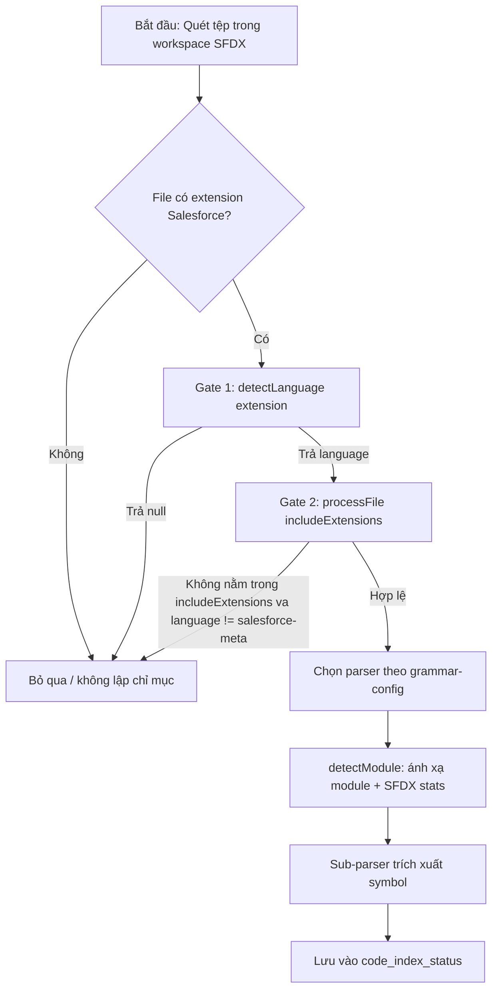

# Business Requirements Document (BRD)

## SA4E-223 — Indexer không nhận diện hầu hết các phần mở rộng tệp Salesforce (metadata + Aura/Visualforce) trong quá trình lập chỉ mục mã nguồn

---

## Thông tin tài liệu (Document Information)

| Trường | Giá trị |
|--------|---------|
| Jira Ticket | SA4E-223 |
| Tiêu đề | Indexer does not recognize most Salesforce file extensions (metadata + Aura/Visualforce) during source indexing |
| Tác giả | BA Agent |
| Phiên bản | 1.0 |
| Ngày | 2026-08-26 |
| Trạng thái | Draft |
| Loại ticket | Bug (Priority: Medium, Status: To Do) |

---

## Theo dõi tác giả (Author Tracking)

| Vai trò | Tên - Chức vụ | Trách nhiệm |
|---------|---------------|-------------|
| Tác giả | BA Agent – Business Analyst | Soạn thảo tài liệu BRD |
| Người duyệt | SA Agent – Solution Architect | Xem xét và chuyển sang FSD (Phase 2) |

---

## Lịch sử phiên bản (Revision History)

| Phiên bản | Ngày | Tác giả | Thay đổi |
|-----------|------|---------|----------|
| 1.0 | 2026-08-26 | BA Agent | Khởi tạo tài liệu — tự động trích xuất từ ticket SA4E-223 |

---

## Xác nhận (Sign-Off)

| Tên | Chữ ký và ngày |
|-----|----------------|
| | ☐ Tôi đồng ý và xác nhận mọi tiêu chí trong BRD này là yêu cầu kỳ vọng |
| | ☐ Tôi đồng ý và xác nhận mọi tiêu chí trong BRD này là yêu cầu kỳ vọng |

---

## 1. Giới thiệu (Introduction)

### 1.1 Phạm vi (Scope)

Hạng mục thay đổi này là một **bug-fix** trong backend **Code Intelligence Indexer** (TypeScript) nhằm khắc phục việc công cụ lập chỉ mục (source indexing) bỏ qua hầu hết các phần mở rộng tệp Salesforce. Cụ thể:

- Mở rộng khả năng nhận diện (detect) tất cả các phần mở rộng Salesforce chưa được hỗ trợ: **Aura/Visualforce**, **Metadata**, và **Apex-adjacent** (`.apex`, `.soql`, `.testSuite`).
- Đảm bảo các tệp này vượt qua được **hai cổng lọc (gate)** trong luồng lập chỉ mục: (1) `detectLanguage()` không trả về `null`; (2) extension nằm trong `config.includeExtensions` (hoặc `language === salesforce-meta`).
- Khôi phục việc lập chỉ mục đầy đủ các dự án **SFDX**, giúp thống kê `code_index_status` SFDX chính xác và cung cấp đủ ngữ cảnh metadata Salesforce cho các agent **SA/DEV** phía sau.

### 1.2 Ngoài phạm vi (Out of Scope)

- **Phân tích ngữ nghĩa sâu (deep semantic parsing)** cho các tệp Salesforce — chuyển sang hạng mục follow-up riêng biệt.
- **Xây dựng tree-sitter grammar** cho Visualforce/Aura — tạm thời dùng parser **regex/generic** (`wasmPath = null`).
- Mọi thay đổi đối với pipeline lập chỉ mục nằm ngoài 5 touchpoint đã nêu tại Mục 2.3.
- Không thay đổi schema lưu trữ chỉ mục hay giao diện người dùng.

### 1.3 Yêu cầu tiên quyết (Preliminary Requirement)

- Truy cập codebase: `backend/src/engine/indexer/`, `backend/src/config/`, `parsers/`.
- Hiểu rõ hai gate hiện tại gây lỗi:
  - Gate 1: `detectLanguage()` trong `file-scanner.ts` chỉ nhận diện `.cls`, `.trigger` (apex) và một vài suffix `*-meta.xml`; mọi extension khác trả `null` → bị skip tại `file-scanner.ts` và `async-file-scanner.ts` (`if (!language) return null`).
  - Gate 2: `processFile` yêu cầu extension nằm trong `config.includeExtensions` (ngoại trừ `language === salesforce-meta`); `DEFAULT_EXTENSIONS` hiện chỉ có `.cls`, `.trigger`, `.pega`.
- Không có yêu cầu tiên quyết bổ sung nào được xác định từ ticket.

---

## 2. Yêu cầu nghiệp vụ (Business Requirements)

### 2.1 Sơ đồ quy trình cấp cao (High Level Process Map)

Luồng lập chỉ mục tệp Salesforce phải vượt qua 2 cổng lọc. Hiện tại phần lớn extension bị loại tại Gate 1 (trả `null`) hoặc Gate 2 (không nằm trong `includeExtensions`).

> **Lưu ý:** Sau khi sửa, tất cả extension trong Mục 2.3 phải đi từ nút B đến nút H mà không bị rơi vào Z.

### 2.2 Danh sách User Stories / Use Cases

| # | Story / Use Case | Độ ưu tiên | Ticket nguồn |
|---|------------------|------------|--------------|
| 1 | Là Indexer backend, tôi muốn ánh xạ mọi extension Salesforce sang ngôn ngữ tương ứng để không bị trả `null` | MUST HAVE | SA4E-223 |
| 2 | Là Indexer backend, tôi muốn extension Salesforce nằm trong `includeExtensions` để vượt qua gate `processFile` ở cả hai scanner | MUST HAVE | SA4E-223 |
| 3 | Là Indexer backend, tôi muốn `grammar-config.json` chọn đúng parser theo từng extension | MUST HAVE | SA4E-223 |
| 4 | Là Indexer backend, tôi muốn tệp Salesforce được ánh xạ đúng module và cập nhật đúng thống kê SFDX | MUST HAVE | SA4E-223 |
| 5 | Là Indexer backend, tôi muốn sub-parser `salesforce-meta` trích xuất symbol cấp cao nhất và xử lý XML lỗi một cách an toàn | MUST HAVE | SA4E-223 |
| 6 | Là SA/DEV agent, tôi muốn không có hồi quy (apex + 5 meta type hiện tại) và có unit test cho từng nhánh parser, mỗi file ≤200 dòng | MUST HAVE | SA4E-223 |

### 2.3 Chi tiết User Stories

#### Business Flow (tổng thể)

**Step 1:** Indexer quét tệp trong workspace SFDX.
**Step 2:** `file-scanner.ts` / `async-file-scanner.ts` gọi `detectLanguage()` để xác định ngôn ngữ từ extension.
**Step 3:** Nếu ngôn ngữ khác `null`, `processFile` kiểm tra extension có trong `includeExtensions` (hoặc `language === salesforce-meta`).
**Step 4:** `grammar-config.json` chọn parser tương ứng (visualforce / aura / apex / salesforce-meta).
**Step 5:** `module-helper.detectModule` ánh xạ tệp vào module đúng và cộng thống kê SFDX.
**Step 6:** Sub-parser `salesforce-meta` (với `*-meta.xml`) trích xuất symbol cấp cao nhất; nếu XML lỗi → degrade gracefully.
**Step 7:** Kết quả lưu vào `code_index_status`, sẵn sàng cho SA/DEV agent.

> **Note:** 5 touchpoint sau phải được thay đổi **cùng nhau** để tránh mâu thuẫn: (1) `file-scanner.ts` `EXTENSION_LANGUAGE_MAP` + compound-suffix; (2) `config/index.ts` `DEFAULT_EXTENSIONS` + `resolver.ts` `FALLBACK_EXTENSIONS`; (3) `parsers/grammar-config.json` mảng `salesforce-meta` + ngôn ngữ `visualforce`/`aura`; (4) `module-helper.ts` `detectModule`; (5) `parsers/languages/salesforce-meta/` `detectMetaType` + `getSupportedExtensions` + sub-parsers.

---

#### STORY 1: Mở rộng ánh xạ extension → ngôn ngữ trong file-scanner.ts

> Là Indexer backend, tôi muốn ánh xạ mọi extension Salesforce sang ngôn ngữ tương ứng để không bị trả `null` (AC1).

**Requirement Details:**

1. Mở rộng `EXTENSION_LANGUAGE_MAP` trong `backend/src/engine/indexer/file-scanner.ts` để nhận diện đầy đủ các extension sau (không còn trả `null`):
   - **Aura/Visualforce:** `.page`, `.component`, `.cmp`, `.app`, `.evt`, `.intf`, `.tokens`
   - **Metadata (dạng `*-meta.xml`):** `.object`, `.field`, `.layout`, `.permissionset`, `.profile`, `.tab`, `.flexipage`, `.labels`, `.site`, `.report`, `.dashboard`, `.flow`, `.email`, `.resource`
   - **Apex-adjacent:** `.apex`, `.soql`, `.testSuite`
2. Bổ sung logic **compound-suffix** để nhận diện các tệp dạng `<type>-meta.xml` (vd: `MyLayout.layout-meta.xml` → `salesforce-meta`).
3. Phân loại ngôn ngữ đề xuất (theo ticket):
   - `visualforce`: `.page`, `.component`
   - `aura`: `.cmp`, `.app`, `.evt`, `.intf`, `.tokens`
   - `salesforce-meta`: các tệp `*-meta.xml` (flexipage, permissionset, profile, labels, tab, layout, report, dashboard, site, resource, email, testSuite)
   - `apex`: `.apex`, `.soql`
   - `metadata`: `.testSuite` (và `-meta.xml` tương ứng)

**Data Fields — Danh sách extension cần hỗ trợ (trích xuất chính xác từ ticket):**

| Nhóm | Phần mở rộng (chính xác từ ticket) | Ngôn ngữ đề xuất | Ghi chú |
|------|------------------------------------|------------------|---------|
| Aura/Visualforce | `.page`, `.component` | visualforce | regex/generic, `wasmPath = null` |
| Aura/Visualforce | `.cmp`, `.app`, `.evt`, `.intf`, `.tokens` | aura | regex/generic, `wasmPath = null` |
| Metadata (`*-meta.xml`) | flexipage, permissionset, profile, labels, tab, layout, report, dashboard, site, resource, email, testSuite | salesforce-meta | dạng `<type>-meta.xml` |
| Apex-adjacent | `.apex`, `.soql` | apex | |
| Apex-adjacent | `.testSuite` (và `-meta.xml`) | metadata | |

> **Mục chưa rõ (open item cho SA/FSD):** Trong danh sách "Unrecognized Extensions" có `.object`, `.field`, `.flow` nhưng chưa xuất hiện trong danh sách ví dụ phân loại `*-meta.xml` của ticket. Cần SA xác nhận chúng cũng ánh xạ vào `salesforce-meta` (dạng `*-meta.xml` hoặc compound tương ứng) trước khi DEV implement — xem Mục 5.1.

**Acceptance Criteria:**

1. `detectLanguage()` trả về non-null cho **toàn bộ** extension nêu trên (chứng minh bằng unit test `file-scanner.test.ts`).
2. Không extension Salesforce nào còn bị trả `null`.

**Validation Rules:**

- Mọi entry mới trong `EXTENSION_LANGUAGE_MAP` phải có giá trị `language` hợp lệ (không `undefined`).
- Compound-suffix phải khớp cả `<name>.<type>-meta.xml`.

**Error Handling:**

- Nếu extension không khớp bất kỳ quy tắc nào → giữ nguyên hành vi trả `null` (bỏ qua tệp), không throw.

---

#### STORY 2: Mở rộng danh sách includeExtensions trong config và resolver

> Là Indexer backend, tôi muốn extension Salesforce nằm trong `includeExtensions` để vượt qua gate `processFile` ở cả hai scanner (AC2).

**Requirement Details:**

1. Thêm các extension Salesforce vào `DEFAULT_EXTENSIONS` trong `backend/src/config/index.ts`.
2. Thêm tương ứng vào `FALLBACK_EXTENSIONS` trong `backend/src/config/resolver.ts`.
3. Đảm bảo cả `file-scanner.ts` và `async-file-scanner.ts` đều vượt qua gate `processFile` với các extension mới (ngoại trừ trường hợp `language === salesforce-meta` đã được miễn trừ).

**Acceptance Criteria:**

1. Tất cả extension Salesforce vượt qua gate `includeExtensions` trong **cả hai** scanner (`file-scanner.ts` và `async-file-scanner.ts`).
2. Unit test xác nhận extension xuất hiện trong danh sách include.

**Validation Rules:**

- Extension thêm vào `DEFAULT_EXTENSIONS` phải khớp với key đã định nghĩa ở STORY 1.
- Không loại bỏ `.cls`, `.trigger`, `.pega` hiện tại.

**Error Handling:**

- Nếu config thiếu extension → tệp bị skip (giữ nguyên hành vi hiện tại), ghi log cảnh báo.

---

#### STORY 3: Cập nhật grammar-config.json chọn đúng parser

> Là Indexer backend, tôi muốn `grammar-config.json` chọn đúng parser theo từng extension (AC3).

**Requirement Details:**

1. Trong `parsers/grammar-config.json`, bổ sung/mở rộng mảng `salesforce-meta` với các loại metadata được hỗ trợ.
2. Khai báo ngôn ngữ `visualforce` và `aura` (dùng parser regex/generic, `wasmPath = null`).
3. Đảm bảo ánh xạ extension → parser nhất quán với STORY 1.

**Acceptance Criteria:**

1. `grammar-config.json` chọn đúng parser cho từng extension (visualforce / aura / apex / salesforce-meta).
2. Không có extension nào bị thiếu ánh xạ parser.

**Validation Rules:**

- Mỗi extension chỉ được gán đúng một parser.
- `wasmPath` cho visualforce/aura phải là `null` (regex/generic).

---

#### STORY 4: Cập nhật detectModule và ánh xạ module / SFDX stats

> Các agent SA/DEV muốn tệp Salesforce được ánh xạ đúng module và cập nhật đúng thống kê SFDX (AC4).

**Requirement Details:**

1. Cập nhật `detectModule` trong `module-helper.ts` để ánh xạ các tệp Salesforce mới vào module tương ứng.
2. Đảm bảo thống kê `code_index_status` phản ánh đúng số lượng tệp SFDX được lập chỉ mục (khắc phục tình trạng undercount hiện tại).

**Acceptance Criteria:**

1. Tệp Salesforce được ánh xạ vào module đúng.
2. Thống kê SFDX trong `code_index_status` chính xác sau lập chỉ mục.

**Validation Rules:**

- Module được ánh xạ phải tồn tại trong cấu hình module.
- Thống kê không đếm trùng (dedupe theo đường dẫn tệp).

---

#### STORY 5: Triển khai sub-parser salesforce-meta (detectMetaType, getSupportedExtensions, trích xuất symbol)

> Là Indexer backend, tôi muốn sub-parser `salesforce-meta` trích xuất symbol cấp cao nhất và xử lý XML lỗi an toàn (AC5).

**Requirement Details:**

1. Trong `parsers/languages/salesforce-meta/`:
   - Implement `detectMetaType` để nhận diện loại metadata từ tên/tệp `*-meta.xml`.
   - Implement `getSupportedExtensions` trả về danh sách extension được hỗ trợ.
   - Implement các sub-parser trích xuất **symbol cấp cao nhất** (top-level symbol) cho mỗi loại metadata.
2. Xử lý **graceful degradation** khi gặp XML malformed: không throw, ghi log và bỏ qua tệp đó.

**Acceptance Criteria:**

1. Sub-parser trích xuất được top-level symbol cho mỗi loại metadata hợp lệ.
2. Khi gặp XML malformed → degrade gracefully (không crash tiến trình lập chỉ mục).

**Validation Rules:**

- `getSupportedExtensions` phải trả về danh sách khớp với STORY 1 & 3.
- Symbol trích xuất phải ở mức top-level (không đệ quy sâu).

**Error Handling:**

- XML không hợp lệ → log warning, trả về kết quả rỗng cho tệp đó, tiếp tục tệp tiếp theo.

---

#### STORY 6: Không hồi quy & unit tests cho từng nhánh parser

> Là SA/DEV agent, tôi muốn không có hồi quy và có unit test cho từng nhánh parser, mỗi file ≤200 dòng (AC6, AC7).

**Requirement Details:**

1. Đảm bảo **không hồi quy** với Apex hiện tại (`.cls`, `.trigger`) và 5 meta type hiện có.
2. Viết unit test riêng cho **từng nhánh parser** (mỗi branch của sub-parser).
3. Giới hạn kích thước: mỗi file source ≤ **200 dòng**, tách riêng models (separation of concerns).

**Acceptance Criteria:**

1. Không hồi quy: Apex + 5 meta type hiện tại vẫn hoạt động đúng.
2. Mỗi file ≤ 200 dòng; models được tách riêng; có unit test cho mỗi nhánh parser.

**Validation Rules:**

- Test coverage bao phủ mọi nhánh (branch) của parser.
- CI fail nếu file vượt quá 200 dòng.

**Error Handling:**

- Test thất bại → block merge, không cho phép regress.

---

## 3. Dependencies (Phụ thuộc)

| Dependency | Loại | Ticket liên quan | Mô tả |
|------------|------|------------------|-------|
| `file-scanner.ts` & `async-file-scanner.ts` | Hệ thống (System) | SA4E-223 | Hai scanner dùng chung `detectLanguage()` và gate `processFile` |
| `config/index.ts` & `resolver.ts` | Hạ tầng (Infrastructure) | SA4E-223 | `DEFAULT_EXTENSIONS` / `FALLBACK_EXTENSIONS` |
| `parsers/grammar-config.json` | Hệ thống | SA4E-223 | Ánh xạ extension → parser |
| `module-helper.ts` | Hệ thống | SA4E-223 | `detectModule` + SFDX stats |
| `parsers/languages/salesforce-meta/` | Hệ thống | SA4E-223 | Sub-parsers metadata |

---

## 4. Stakeholders (Các bên liên quan)

| Vai trò | Tên / Team | Trách nhiệm | Nguồn |
|---------|------------|-------------|-------|
| Người báo cáo (Reporter) | Team Code Intelligence | Phát hiện bug lập chỉ mục SFDX | SA4E-223 |
| DEV Agent | Team Code Intelligence | Implement sửa lỗi theo FSD | SA4E-223 |
| SA Agent | Team Architecture | Thiết kế FSD, xác nhận phân loại extension | SA4E-223 |
| SA/DEV downstream | Consumer agent | Hưởng lợi từ ngữ cảnh metadata đầy đủ | Impact note |

---

## 5. Risks and Assumptions (Rủi ro & Giả định)

### 5.1 Risks

| Rủi ro | Tác động | Khả năng | Biện pháp giảm thiểu |
|--------|----------|----------|---------------------|
| Phân loại `.object`, `.field`, `.flow` chưa rõ (không có trong ví dụ `*-meta.xml`) | Trung bình | Cao | SA xác nhận ánh xạ tại FSD trước khi DEV implement (open item STORY 1) |
| Thay đổi thiếu đồng bộ 1 trong 5 touchpoint | Cao | Trung bình | Sửa cả 5 touchpoint cùng nhau; thêm integration test |
| Regex/generic parser cho VF/Aura cho kết quả symbol thô | Thấp | Cao | Chấp nhận tạm thời (out of scope deep parsing); follow-up sau |
| Hồi quy lên Apex / 5 meta type hiện tại | Cao | Thấp | Giữ nguyên logic cũ + unit test hồi quy (STORY 6) |

### 5.2 Assumptions

- Các tệp `*-meta.xml` tuân thủ cấu trúc XML hợp lệ trong hầu hết trường hợp (trừ các tệp malformed sẽ được degrade gracefully).
- `wasmPath = null` là chấp nhận được cho visualforce/aura ở giai đoạn này.
- Không thay đổi schema lưu trữ chỉ mục.
- Thống kê SFDX dựa trên đếm tệp đã lập chỉ mục thành công.

---

## 6. Non-Functional Requirements (Yêu cầu phi chức năng)

| Hạng mục | Yêu cầu | Chi tiết |
|----------|---------|----------|
| Performance | Không làm chậm đáng kể luồng lập chỉ mục | Parser regex/generic nhẹ; không thêm I/O nặng |
| Maintainability | Mỗi file source ≤ 200 dòng; models tách riêng | STORY 6 / AC7 |
| Reliability | Degrade gracefully trên XML lỗi | Không crash tiến trình (STORY 5) |
| Testability | Unit test cho từng nhánh parser | STORY 6 / AC7 |
| Compatibility | Giữ nguyên hành vi Apex + 5 meta type | Không hồi quy (STORY 6 / AC6) |

> Không có yêu cầu phi chức năng bổ sung nào được xác định từ ticket.

---

## 7. Related Tickets (Ticket liên quan)

| Ticket Key | Tóm tắt | Trạng thái | Loại | Quan hệ |
|------------|---------|------------|------|---------|
| SA4E-223 | Indexer does not recognize most Salesforce file extensions (metadata + Aura/Visualforce) during source indexing | To Do | Bug | Main ticket |

---

## 8. Appendix (Phụ lục)

### 8.1 Mục chưa rõ cần SA xác nhận (Open Items)

- `.object`, `.field`, `.flow` (thuộc danh sách "Unrecognized Extensions" metadata) **chưa** xuất hiện trong ví dụ phân loại `*-meta.xml`. Cần xác nhận chúng ánh xạ vào `salesforce-meta` (dạng `*-meta.xml` hoặc compound) trước khi implement.

### 8.2 Tóm tắt các phần mở rộng cần hỗ trợ (trích xuất từ ticket)

- **Aura/Visualforce:** `.page` `.component` `.cmp` `.app` `.evt` `.intf` `.tokens`
- **Metadata:** `.object` `.field` `.layout` `.permissionset` `.profile` `.tab` `.flexipage` `.labels` `.site` `.report` `.dashboard` `.flow` `.email` `.resource`
- **Apex-adjacent:** `.apex` `.soql` `.testSuite`

### Glossary (Thuật ngữ)

| Thuật ngữ | Định nghĩa |
|-----------|------------|
| SFDX | Salesforce DX — định dạng dự án Salesforce được indexer hỗ trợ |
| salesforce-meta | Ngôn ngữ nội bộ cho các tệp metadata dạng `*-meta.xml` |
| Gate 1 / Gate 2 | Hai cổng lọc: `detectLanguage()` null-check và `includeExtensions` check |
| code_index_status | Bảng/thống kê trạng thái lập chỉ mục mã nguồn |
| Compound-suffix | Logic nhận diện hậu tố kép như `<type>-meta.xml` |

### Reference Documents

| Tài liệu | Vị trí |
|----------|--------|
| BRD Template | `documents/templates/BRD-TEMPLATE.md` |
| Source: file-scanner.ts | `backend/src/engine/indexer/file-scanner.ts` |
| Source: async-file-scanner.ts | `backend/src/engine/indexer/async-file-scanner.ts` |
| Source: config/index.ts | `backend/src/config/index.ts` |
| Source: resolver.ts | `backend/src/config/resolver.ts` |
| Source: grammar-config.json | `parsers/grammar-config.json` |
| Source: module-helper.ts | `parsers/languages/.../module-helper.ts` (hoặc tương đương) |
| Source: salesforce-meta parsers | `parsers/languages/salesforce-meta/` |
