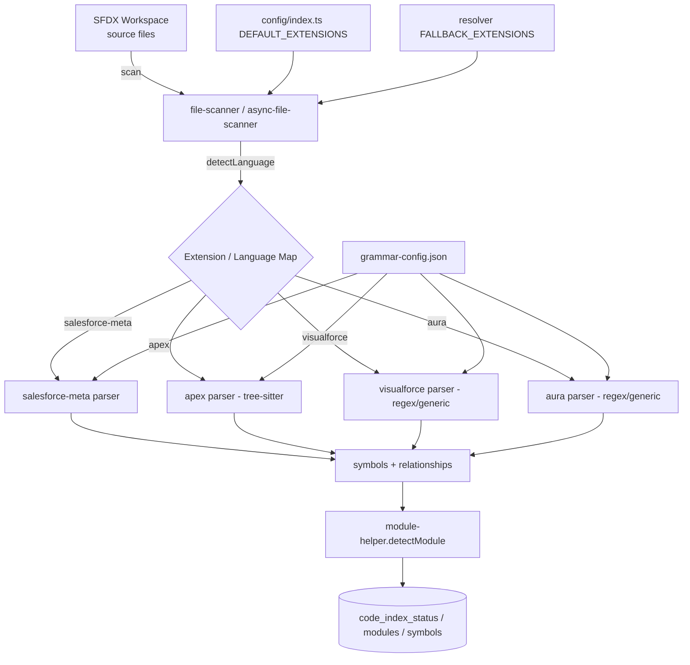
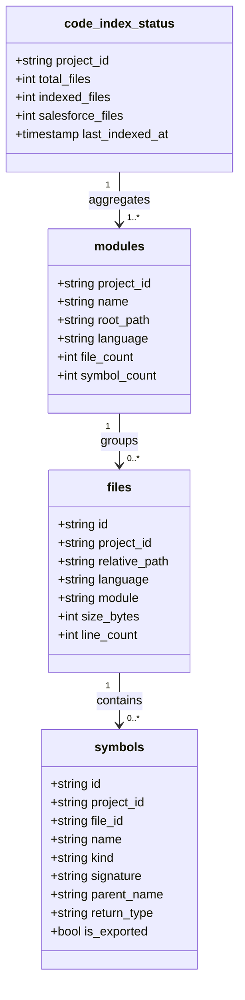
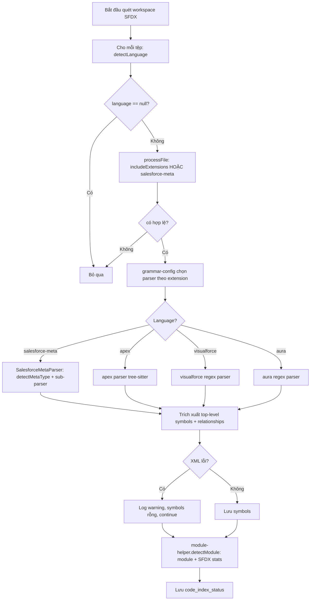
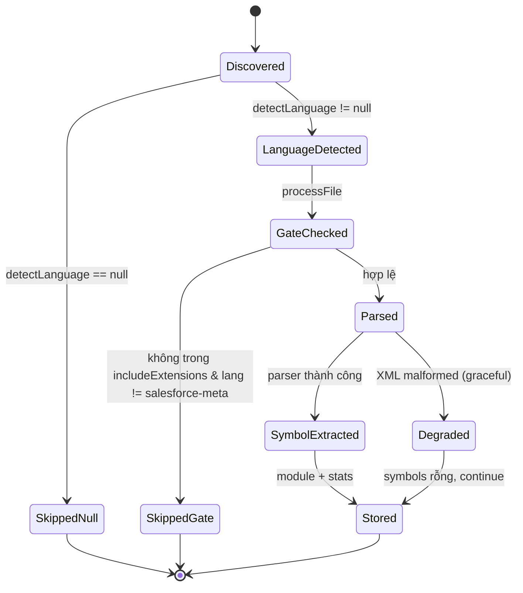

# Functional Specification Document (FSD)

## SA4E-223 — Indexer không nhận diện hầu hết các phần mở rộng tệp Salesforce (metadata + Aura/Visualforce) trong quá trình lập chỉ mục mã nguồn

---

## Thông tin tài liệu (Document Information)

| Trường | Giá trị |
|--------|---------|
| Jira Ticket | SA4E-223 |
| Tiêu đề | Indexer does not recognize most Salesforce file extensions (metadata + Aura/Visualforce) during source indexing |
| Tác giả | BA Agent (draft) · TA Agent (enrichment v1.1) |
| Phiên bản | 1.1 |
| Ngày | 2026-08-26 |
| Trạng thái | Draft + TA Enrichment (5 SA-CONF resolved — sẵn sàng Phase 3 TDD) |
| Tài liệu BRD liên quan | `documents/SA4E-223/BRD.md` |
| Loại ticket | Bug (Priority: Medium, Status: To Do) |

---

## Lịch sử phiên bản (Revision History)

| Phiên bản | Ngày | Tác giả | Thay đổi |
|-----------|------|---------|----------|
| 1.0 | 2026-08-26 | BA Agent | Khởi tạo FSD — tự động trích xuất từ BRD + xác minh trực tiếp trên source code (`backend/src/engine/indexer/`, `backend/src/config/`, `backend/src/engine/parsers/`) |
| 1.1 | 2026-08-26 | TA Agent | Enrichment kỹ thuật: resolve 5 SA-CONF points; chuẩn hóa `ExtractedSymbol` (canonical = `types.ts`); xác nhận chỉ `*.testSuite-meta.xml`; đề xuất module names; mức cô lập graceful degradation 2-level; bổ sung Technical Risks (§12) & Performance (§13) |

---

## 1. Giới thiệu (Introduction)

### 1.1 Mục đích (Purpose)

Tài liệu này quy định **thiết kế chức năng** (functional design) để khắc phục bug SA4E-223: backend **Code Intelligence Indexer** (TypeScript) hiện bỏ qua phần lớn các phần mở rộng tệp Salesforce, dẫn đến thống kê `code_index_status` SFDX bị thiếu hụt và SA/DEV agent phía sau thiếu ngữ cảnh metadata.

FSD xác định chi tiết 5 touchpoint cần sửa đổi đồng bộ, danh sách extension đầy đủ kèm ánh xạ ngôn ngữ, luồng dữ liệu (data flow) từ quét tệp đến lưu symbol, và các điểm cần SA xác nhận tại Phase 3 (TDD). FSD **không chứa code triển khai** — chỉ đặc tả hành vi chức năng.

### 1.2 Phạm vi (Scope)

- **Trong phạm vi:** 5 touchpoint (xem Mục 3): `file-scanner.ts`, `config/index.ts` + `resolver.ts`, `grammar-config.json`, `module-helper.ts`, `parsers/languages/salesforce-meta/`.
- **Ngoài phạm vi (kế thừa từ BRD §1.2):** deep semantic parsing cho Salesforce; xây dựng tree-sitter grammar cho VF/Aura (dùng regex/generic, `wasmPath = null`); thay đổi schema lưu trữ hay UI.

### 1.3 Định nghĩa & từ viết tắt (Definitions & Acronyms)

| Thuật ngữ | Định nghĩa |
|-----------|------------|
| SFDX | Salesforce DX — định dạng dự án Salesforce được indexer hỗ trợ |
| salesforce-meta | Ngôn ngữ nội bộ cho các tệp metadata dạng `*-meta.xml` |
| Compound-suffix | Hậu tố kép `<type>-meta.xml` (vd `MyLayout.layout-meta.xml`) |
| Gate 1 | Cổng `detectLanguage()` — trả `null` thì bỏ qua tệp |
| Gate 2 | Cổng `processFile` — yêu cầu extension nằm trong `includeExtensions` (ngoại trừ `language === 'salesforce-meta'`) |
| wasmPath | Đường dẫn tree-sitter WASM; `null` = dùng parser regex/generic |
| Top-level symbol | Symbol cấp cao nhất trích xuất được (tên metadata/component), không đệ quy sâu |
| Graceful degradation | Khi XML lỗi → không throw, ghi log, trả kết quả rỗng, tiếp tục tệp kế tiếp |
| ExtractedSymbol | Kiểu symbol đầu ra của parser (xem Mục 4.2) |

### 1.4 Tài liệu tham khảo (References)

| Tài liệu | Vị trí |
|----------|--------|
| BRD | `documents/SA4E-223/BRD.md` |
| Source: file-scanner.ts | `backend/src/engine/indexer/file-scanner.ts` |
| Source: async-file-scanner.ts | `backend/src/engine/indexer/async-file-scanner.ts` |
| Source: config/index.ts | `backend/src/config/index.ts` |
| Source: resolver.ts | `backend/src/engine/indexer/project-type/resolver.ts` |
| Source: grammar-config.json | `backend/src/engine/parsers/grammar-config.json` |
| Source: module-helper.ts | `backend/src/engine/indexer/module-helper.ts` |
| Source: salesforce-meta parser | `backend/src/engine/parsers/languages/salesforce-meta/{parser,parsers,helpers,index}.ts` |

---

## 2. Tổng quan hệ thống (System Overview)

### 2.1 Sơ đồ ngữ cảnh hệ thống (System Context)

> Sơ đồ dùng Mermaid (nhúng trực tiếp). Nếu cần file `.drawio`/PNG cho DOCX, sinh tại Phase 3 (xem Phụ lục 11.1).



**Mô tả tương tác:** Indexer quét workspace, xác định ngôn ngữ qua `detectLanguage()`, lọc qua Gate 2 (`processFile`), chọn parser theo `grammar-config.json`, trích xuất symbol, sau đó `module-helper.detectModule` ánh xạ module và cập nhật thống kê `code_index_status`. Không có hệ thống external — tất cả đều nội bộ trong backend indexer.

### 2.2 Kiến trúc hệ thống (System Architecture)

Các thành phần tham gia luồng lập chỉ mục (đã xác minh trên source):

1. **`file-scanner.ts`** — `scanWorkspace` / `scanSingleFile`, `detectLanguage()` (Gate 1), `processFile()` (Gate 2). Dùng `EXTENSION_LANGUAGE_MAP` + compound-suffix.
2. **`async-file-scanner.ts`** — bản async, tái sử dụng `detectLanguage` từ `file-scanner.ts`; Gate 2 dùng `path.extname` + `config.includeExtensions` + `language === 'salesforce-meta'`.
3. **`config/index.ts`** — `DEFAULT_EXTENSIONS` (nguồn `includeExtensions` mặc định).
4. **`project-type/resolver.ts`** — `FALLBACK_EXTENSIONS` (dùng khi không có config file).
5. **`grammar-config.json`** — ánh xạ `extension → parserModule` (wasmPath). Cần bổ sung `visualforce`, `aura` và mở rộng `salesforce-meta`.
6. **`module-helper.ts`** — `detectModule(relativePath)` ánh xạ đường dẫn → module; `updateModules` tính lại bảng `modules`.
7. **`parsers/languages/salesforce-meta/`** — `SalesforceMetaParser` với `detectMetaType`, `getSupportedExtensions`, `parse()`; các sub-parser trong `parsers.ts`; helper regex trong `helpers.ts`.

### 2.3 Giải quyết Open Item từ BRD: Phân loại `.object` / `.field` / `.flow`

> **Yêu cầu bắt buộc từ SM/BA:** Ghi rõ xác nhận open item của BRD (§8.1).

**Kết luận (RESOLVED):** `.object`, `.field`, `.flow` **là metadata trong SFDX source format** và trên thực tế chúng **luôn mang suffix `-meta.xml`**, cụ thể:

| Phần mở rộng | Tên tệp thực tế (SFDX) | Ngôn ngữ | Parser |
|--------------|------------------------|----------|--------|
| `.object` | `<ObjectName>.object-meta.xml` | `salesforce-meta` | salesforce-meta (sub `parseObject`) |
| `.field` | `<FieldName>.field-meta.xml` | `salesforce-meta` | salesforce-meta (sub `parseField`) |
| `.flow` | `<FlowName>.flow-meta.xml` | `salesforce-meta` | salesforce-meta (sub `parseFlow`) |

Do đó chúng **được route vào `salesforce-meta` parser** — parser này **đã có sẵn** hỗ trợ `.object/.field/.flow` (xem `parser.ts` dòng 6-8, 22, 33-35). Không cần tạo ngôn ngữ mới cho 3 loại này; chúng chỉ cần nằm trong **compound-suffix list** (Mục 3.1) và trong `getSupportedExtensions` (Mục 3.5). Điểm open item của BRD chính thức **đóng** (closed) tại FSD này.

---

## 3. Yêu cầu chức năng (Functional Requirements)

> Mỗi touchpoint ánh xạ 1-1 với một BRD Story (Mục 2.3 BRD). Tất cả 5 touchpoint **phải được sửa cùng lúc** để tránh mâu thuẫn (BRD §2.3 Note).

### 3.1 Touchpoint 1 — `file-scanner.ts`: EXTENSION_LANGUAGE_MAP + compound-suffix

**Nguồn BRD:** Story 1 (AC1). **Actor:** Indexer backend.

#### 3.1.1 Mô tả

Mở rộng `EXTENSION_LANGUAGE_MAP` (hiện chỉ có `.cls`, `.trigger`, `.pega`) và logic compound-suffix trong `detectLanguage()` để không trả `null` cho bất kỳ extension Salesforce nào.

**(a) Simple extensions — bổ sung vào `EXTENSION_LANGUAGE_MAP`:**

| Extension | Ngôn ngữ | Ghi chú |
|-----------|----------|---------|
| `.apex` | `apex` | Apex class/trigger thuần túy (không `.cls`) |
| `.soql` | `apex` | Salesforce SOQL query file |
| `.page` | `visualforce` | Visualforce page |
| `.component` | `visualforce` | Visualforce component (khác với `component-meta.xml` của Aura — xem §3.1.3) |
| `.cmp` | `aura` | Aura component |
| `.app` | `aura` | Aura application |
| `.evt` | `aura` | Aura event |
| `.intf` | `aura` | Aura interface |
| `.tokens` | `aura` | Aura tokens (design token bundle) |

**(b) Compound-suffix list (`<type>-meta.xml` → `salesforce-meta`) — mở rộng trong `detectLanguage()`:**

| Meta type (suffix) | Ví dụ tệp | Ghi chú |
|--------------------|-----------|---------|
| `flow` | `X.flow-meta.xml` | đã có |
| `object` | `X.object-meta.xml` | đã có (open item resolved §2.3) |
| `field` | `X.field-meta.xml` | đã có (open item resolved §2.3) |
| `js` | `X.js-meta.xml` | đã có (LWC meta) |
| `component` | `X.component-meta.xml` | đã có (Aura meta) |
| `flexipage` | `X.flexipage-meta.xml` | MỚI |
| `permissionset` | `X.permissionset-meta.xml` | MỚI |
| `profile` | `X.profile-meta.xml` | MỚI |
| `labels` | `X.labels-meta.xml` | MỚI |
| `tab` | `X.tab-meta.xml` | MỚI |
| `layout` | `X.layout-meta.xml` | MỚI |
| `report` | `X.report-meta.xml` | MỚI |
| `dashboard` | `X.dashboard-meta.xml` | MỚI |
| `site` | `X.site-meta.xml` | MỚI |
| `resource` | `X.resource-meta.xml` | MỚI (StaticResource) |
| `email` | `X.email-meta.xml` | MỚI (EmailTemplate) |
| `testSuite` | `X.testSuite-meta.xml` | MỚI |

**(c) Trường hợp đặc biệt `.testSuite` (standalone):** Trong SFDX, test suite cũng có thể là tệp `.testSuite` không có `-meta.xml`. Đề xuất: thêm `.testSuite` → `salesforce-meta` trực tiếp vào `EXTENSION_LANGUAGE_MAP` (hoặc xử lý riêng trong `detectLanguage`). **Cần SA xác nhận (SA-CONF-3).**

<!-- TA enrichment -->
> **TA Note (SA-CONF-3 RESOLVED — v1.1):** Thực tế SFDX Apex Test Suite **chỉ** tồn tại dưới dạng `*.testSuite-meta.xml` (thư mục `testSuites/`). **KHÔNG có** tệp `.testSuite` standalone. → **BỎ** ánh xạ standalone này. Giữ `testSuite-meta.xml` trong compound-suffix (§3.1.1(b)). Xem §3.8.3.

#### 3.1.2 Use Case

**Use Case ID:** UC-01 — Ánh xạ extension Salesforce sang ngôn ngữ.
**Actor:** Indexer backend (invoked bởi `scanWorkspace`/`scanSingleFile`).
**Preconditions:** Tệp nằm trong workspace, không bị exclude.
**Postconditions:** `detectLanguage()` trả non-null cho mọi extension Salesforce.

**Main Flow:**

| Step | Actor | System | Mô tả |
|------|-------|--------|-------|
| 1 | Quét tệp | | Gọi `detectLanguage(filePath)` |
| 2 | | Kiểm tra compound-suffix | Nếu kết thúc bằng `<type>-meta.xml` trong danh sách §3.1.1(b) → trả `salesforce-meta` |
| 3 | | Tra `EXTENSION_LANGUAGE_MAP` | Trả ngôn ngữ tương ứng (apex/visualforce/aura) hoặc `null` |

**Alternative Flows:**

| ID | Điều kiện | Bước |
|----|-----------|------|
| AF-1 | Tệp `.testSuite` không có `-meta.xml` | ~~Trả `salesforce-meta` (theo §3.1.1(c))~~ **REMOVED — SFDX không có `.testSuite` standalone (SA-CONF-3 RESOLVED, xem §3.8.3)** |

<!-- TA enrichment -->
> **TA Note:** UC-01 AF-1 được gạch bỏ vì standalone `.testSuite` không tồn tại. Tệp test suite hợp lệ là `*.testSuite-meta.xml` (đã cover bởi Main Flow bước 2 — compound-suffix).

**Exception Flows:**

| ID | Điều kiện | Bước |
|----|-----------|------|
| EF-1 | Extension không khớp quy tắc nào | Giữ nguyên trả `null` (bỏ qua), không throw |

#### 3.1.3 Business Rules

| Rule ID | Rule | Nguồn |
|---------|------|-------|
| BR-1 | Mọi entry mới trong `EXTENSION_LANGUAGE_MAP` có `language` hợp lệ (không `undefined`) | BRD Story 1 |
| BR-2 | Compound-suffix phải khớp `<name>.<type>-meta.xml` | BRD Story 1 |
| BR-3 | `.component` (Visualforce) ≠ `component-meta.xml` (Aura meta) — phải phân biệt rõ | FSD (phát hiện từ code) |
| BR-4 | Không extension Salesforce nào còn trả `null` sau sửa | BRD AC1 |

#### 3.1.4 Validation & Error Handling

- Mỗi entry map phải có giá trị `language` khác `undefined`.
- Nếu extension không khớp → trả `null`, không ném lỗi (giữ hành vi hiện tại).

---

### 3.2 Touchpoint 2 — `config/index.ts` DEFAULT_EXTENSIONS + `resolver.ts` FALLBACK_EXTENSIONS

**Nguồn BRD:** Story 2 (AC2). **Actor:** Indexer backend (cả 2 scanner).

#### 3.2.1 Mô tả

Thêm các **simple extensions** mới vào `DEFAULT_EXTENSIONS` (`config/index.ts`) và `FALLBACK_EXTENSIONS` (`resolver.ts`) để vượt qua Gate 2.

> **Lưu ý kỹ thuật:** Tệp `*-meta.xml` có `path.extname` = `.xml` (không nằm trong `includeExtensions`), nhưng được **miễn trừ** qua điều kiện `language === 'salesforce-meta'` trong cả `file-scanner.ts` và `async-file-scanner.ts`. Do đó compound-suffix **không bắt buộc** phải thêm vào `includeExtensions`. Chỉ các simple extension (apex/soql/page/component/cmp/app/evt/intf/tokens) mới cần thêm.

**Danh sách extension thêm vào (cả 2 nơi):** `.apex`, `.soql`, `.page`, `.component`, `.cmp`, `.app`, `.evt`, `.intf`, `.tokens`.

**Validation:** Giữ nguyên `.cls`, `.trigger`, `.pega` hiện tại (BR-4/BRD Story 2).

#### 3.2.2 Use Case

**Use Case ID:** UC-02 — Vượt qua Gate 2 cho extension Salesforce.
**Actor:** Indexer backend. **Preconditions:** `detectLanguage()` đã trả non-null.
**Postconditions:** Tệp qua Gate 2 ở cả `file-scanner.ts` và `async-file-scanner.ts`.

**Main Flow:**

| Step | Actor | System | Mô tả |
|------|-------|--------|-------|
| 1 | | `processFile` | `ext = getExtension(filePath)` |
| 2 | | Kiểm tra | `includeExtensions.includes(ext) \|\| ext === '.kts' \|\| language === 'salesforce-meta'` |
| 3 | | Hợp lệ → tiếp tục đọc nội dung | |

**Exception Flows:**

| ID | Điều kiện | Bước |
|----|-----------|------|
| EF-1 | Config thiếu extension (không trong `includeExtensions`, không phải salesforce-meta) | Tệp bị skip; ghi log cảnh báo |

#### 3.2.3 Business Rules

| Rule ID | Rule | Nguồn |
|---------|------|-------|
| BR-5 | Extension thêm vào `DEFAULT_EXTENSIONS` phải khớp key đã định nghĩa ở §3.1 | BRD Story 2 |
| BR-6 | Không loại bỏ `.cls`, `.trigger`, `.pega` | BRD Story 2 |

---

### 3.3 Touchpoint 3 — `grammar-config.json`: parser selection

**Nguồn BRD:** Story 3 (AC3). **Actor:** Indexer backend (parser selector).

#### 3.3.1 Mô tả

Cập nhật `parsers/grammar-config.json` để ánh xạ extension → parser nhất quán với §3.1.

**(a) Mở rộng entry `salesforce-meta`** — `extensions` bổ sung tất cả compound-suffix ở §3.1.1(b):

```json
{
  "id": "salesforce-meta",
  "extensions": [
    ".flow-meta.xml", ".object-meta.xml", ".field-meta.xml", ".js-meta.xml",
    ".component-meta.xml", ".flexipage-meta.xml", ".permissionset-meta.xml",
    ".profile-meta.xml", ".labels-meta.xml", ".tab-meta.xml", ".layout-meta.xml",
    ".report-meta.xml", ".dashboard-meta.xml", ".site-meta.xml",
    ".resource-meta.xml", ".email-meta.xml", ".testSuite-meta.xml"
  ],
  "wasmPath": null,
  "parserModule": "./languages/salesforce-meta-parser.js"
}
```

**(b) Mở rộng entry `apex`** — thêm `.apex`, `.soql` (hiện chỉ `.cls`, `.trigger`):

```json
{ "id": "apex", "extensions": [".cls", ".trigger", ".apex", ".soql"],
  "wasmPath": "grammars/tree-sitter-apex.wasm", "parserModule": "./languages/apex-parser.js" }
```

**(c) Thêm entry `visualforce`** (regex/generic, `wasmPath = null`):

```json
{ "id": "visualforce", "extensions": [".page", ".component"],
  "wasmPath": null, "parserModule": "./languages/visualforce-parser.js" }
```

**(d) Thêm entry `aura`** (regex/generic, `wasmPath = null`):

```json
{ "id": "aura", "extensions": [".cmp", ".app", ".evt", ".intf", ".tokens"],
  "wasmPath": null, "parserModule": "./languages/aura-parser.js" }
```

> **Lưu ý:** `visualforce-parser.js` / `aura-parser.js` là parser regex/generic mới (không phải tree-sitter). Việc có tạo file parser riêng hay tái dùng một generic parser là **điểm SA xác nhận (SA-CONF-1)**.

#### 3.3.2 Business Rules

| Rule ID | Rule | Nguồn |
|---------|------|-------|
| BR-7 | Mỗi extension chỉ gán đúng một parser | BRD Story 3 |
| BR-8 | `wasmPath` cho visualforce/aura phải là `null` | BRD Story 3 |
| BR-9 | Ánh xạ extension→parser nhất quán với §3.1 | BRD Story 3 |

---

### 3.4 Touchpoint 4 — `module-helper.ts`: detectModule mapping

**Nguồn BRD:** Story 4 (AC4). **Actor:** Indexer backend; consumer: SA/DEV agent.

#### 3.4.1 Mô tả

Mở rộng `detectModule(relativePath)` để ánh xạ các tệp Salesforce mới vào module đúng. Hiện `detectModule` chỉ xử lý `force-app/` với `classes/`, `triggers/`, `flows/`, `objects/`, `lwc/`, `aura/`.

**Đề xuất ánh xạ bổ sung (functional — SA xác nhận tên module tại SA-CONF-4):**

| Đường dẫn SFDX (segment) | Module đề xuất | Áp dụng cho |
|--------------------------|----------------|-------------|
| `/pages/` | `visualforce-pages` | `.page` (visualforce) |
| `/components/` | `visualforce-components` | `.component` (visualforce — khác `/aura/`) |
| `/aura/` | `aura-components` | `.cmp/.app/.evt/.intf/.tokens` (đã có) |
| `/layouts/` | `sf-layouts` | `*.layout-meta.xml` |
| `/permissionsets/` | `sf-permissionsets` | `*.permissionset-meta.xml` |
| `/profiles/` | `sf-profiles` | `*.profile-meta.xml` |
| `/tabs/` | `sf-tabs` | `*.tab-meta.xml` |
| `/flexipages/` | `sf-flexipages` | `*.flexipage-meta.xml` |
| `/labels/` | `sf-labels` | `*.labels-meta.xml` |
| `/reports/` | `sf-reports` | `*.report-meta.xml` |
| `/dashboards/` | `sf-dashboards` | `*.dashboard-meta.xml` |
| `/sites/` | `sf-sites` | `*.site-meta.xml` |
| `/staticresources/` | `sf-staticresources` | `*.resource-meta.xml` |
| `/email/` | `sf-email` | `*.email-meta.xml` |
| `/testSuites/` | `sf-testsuites` | `.testSuite` / `*.testSuite-meta.xml` |
| `/flows/` | `sf-flows` | `*.flow-meta.xml` (đã có) |
| `/objects/` | `sf-objects` | `*.object-meta.xml` (đã có) |

Thống kê `code_index_status` / bảng `modules` phải phản ánh đúng số tệp SFDX đã lập chỉ mục (khắc phục undercount). Không đếm trùng (dedupe theo đường dẫn tệp).

#### 3.4.2 Business Rules

| Rule ID | Rule | Nguồn |
|---------|------|-------|
| BR-10 | Module ánh xạ phải tồn tại trong cấu hình module | BRD Story 4 |
| BR-11 | Thống kê không đếm trùng (dedupe theo filePath) | BRD Story 4 |

---

### 3.5 Touchpoint 5 — `parsers/languages/salesforce-meta/`: detectMetaType + sub-parsers

**Nguồn BRD:** Story 5 (AC5). **Actor:** Indexer backend.

#### 3.5.1 Mô tả

Mở rộng `SalesforceMetaParser` để nhận diện và trích xuất ít nhất 1 top-level symbol cho mỗi meta type mới, đồng thời xử lý XML lỗi an toàn.

**(a) `detectMetaType(filePath)`** — bổ sung các nhánh mới (hiện chỉ có flow/object/field/js/component):

```text
flexipage-meta.xml  -> flexipage
permissionset-meta.xml -> permissionset
profile-meta.xml    -> profile
labels-meta.xml     -> labels
tab-meta.xml        -> tab
layout-meta.xml     -> layout
report-meta.xml     -> report
dashboard-meta.xml  -> dashboard
site-meta.xml       -> site
resource-meta.xml   -> resource
email-meta.xml      -> email
testSuite-meta.xml  -> testSuite
```

**(b) `getSupportedExtensions()`** — trả về danh sách khớp §3.1.1(b) + §3.3(a) (tất cả compound-suffix).

**(c) Sub-parsers mới** — mỗi loại trích xuất **ít nhất 1 top-level symbol** (tên từ `nameFromPath`):

| Meta type | Sub-parser | Top-level symbol (kind / signature) |
|-----------|-----------|--------------------------------------|
| flexipage | `parseFlexipage` | `class` — `Flexipage: <name>` |
| permissionset | `parsePermissionset` | `class` — `PermissionSet: <name>` |
| profile | `parseProfile` | `class` — `Profile: <name>` |
| labels | `parseLabels` | `class` — `Labels: <name>` (tùy chọn: mỗi `CustomLabel` → `property`) |
| tab | `parseTab` | `class` — `Tab: <name>` |
| layout | `parseLayout` | `class` — `Layout: <name>` |
| report | `parseReport` | `class` — `Report: <name>` |
| dashboard | `parseDashboard` | `class` — `Dashboard: <name>` |
| site | `parseSite` | `class` — `Site: <name>` |
| resource | `parseResource` | `class` — `StaticResource: <name>` |
| email | `parseEmail` | `class` — `EmailTemplate: <name>` |
| testSuite | `parseTestSuite` | `class` — `TestSuite: <name>` |

**(d) `helpers.ts` — `nameFromPath`** — mở rộng regex strip để hỗ trợ mọi suffix mới (hiện chỉ strip `flow|object|field|js|component`):

```text
.thay thế thành: \.(flow|object|field|js|component|flexipage|permissionset|profile|labels|tab|layout|report|dashboard|site|resource|email|testSuite)-meta\.xml$
```

**(e) Graceful degradation:** Hiện `parser.ts` bọc toàn bộ `switch` trong 1 `try/catch` — nếu 1 loại throw, catch ghi `ParseError` và vẫn trả `symbols` đã thu thập. Đề xuất **cô lập từng sub-parser** bằng try/catch riêng để 1 tệp lỗi không ảnh hưởng phần còn lại của cùng tệp. Khi XML malformed → log warning, trả symbols rỗng, tiếp tục tệp kế tiếp (không crash tiến trình lập chỉ mục).

#### 3.5.2 Use Case

**Use Case ID:** UC-05 — Trích xuất symbol metadata + xử lý XML lỗi.
**Actor:** `SalesforceMetaParser`. **Preconditions:** Tệp đã qua Gate 1 & 2, `language === 'salesforce-meta'`.
**Postconditions:** Top-level symbol được lưu, hoặc tệp bị bỏ qua an toàn nếu lỗi.

**Main Flow:**

| Step | Actor | System | Mô tả |
|------|-------|--------|-------|
| 1 | | `parse(source, filePath)` | Gọi `detectMetaType` |
| 2 | | Switch theo meta type | Gọi sub-parser tương ứng |
| 3 | | Sub-parser | Push ≥1 top-level `ExtractedSymbol` + relationships |
| 4 | | Trả `ParseResult` | `{ symbols, relationships, errors }` |

**Alternative Flows:**

| ID | Điều kiện | Bước |
|----|-----------|------|
| AF-1 | Tệp `.object`/`.field`/`.flow` | Route vào sub `parseObject`/`parseField`/`parseFlow` (đã có sẵn) |

**Exception Flows:**

| ID | Điều kiện | Bước |
|----|-----------|------|
| EF-1 | XML malformed | Log warning, trả `symbols` rỗng cho tệp đó, tiếp tục tệp kế tiếp |

#### 3.5.3 Business Rules

| Rule ID | Rule | Nguồn |
|---------|------|-------|
| BR-12 | `getSupportedExtensions` trả danh sách khớp §3.1 & §3.3 | BRD Story 5 |
| BR-13 | Symbol trích xuất ở mức top-level (không đệ quy sâu) | BRD Story 5 |
| BR-14 | XML lỗi → không throw, log, continue | BRD Story 5 |

---

### 3.6 Yêu cầu phi chức năng cục bộ: Không hồi quy & Unit test

**Nguồn BRD:** Story 6 (AC6, AC7).

| Rule ID | Rule | Nguồn |
|---------|------|-------|
| BR-15 | Giữ nguyên hành vi Apex (`.cls`, `.trigger`) + 5 meta type hiện tại (flow/object/field/js/component) | BRD Story 6 |
| BR-16 | Mỗi file source ≤ 200 dòng; tách riêng models | BRD Story 6 |
| BR-17 | Unit test cho từng nhánh parser (mỗi branch sub-parser) | BRD Story 6 |
| BR-18 | CI fail nếu file > 200 dòng hoặc test thất bại | BRD Story 6 |

---

### 3.7 Điểm cần SA xác nhận tại Phase 3 (TDD) — SA Confirmation Points

> **TA Enrichment (v1.1):** 5 SA-CONF points đã được **TA xác nhận (RESOLVED)** qua code verification — chi tiết quyết định tại **§3.8**. SA đưa thẳng vào TDD.
>
> Các điểm sau **chưa chốt** tại FSD gốc; SA phải xác nhận khi viết TDD (nhưng TA đã đề xuất quyết định cụ thể ở §3.8).

| ID | Điểm cần xác nhận | Mô tả / Đề xuất |
|----|-------------------|-----------------|
| SA-CONF-1 | **Parser strategy cho Visualforce/Aura** | Dùng regex/generic (`wasmPath = null`). Có nên tạo `visualforce-parser.js`/`aura-parser.js` riêng, hay tái dùng một generic XML/regex parser? Phạm vi trích xuất: chỉ top-level (tên component + attribute `controller`/`extends` với VF; `aura:component` + `implements`/`extends` với Aura) — không parse sâu. |
| SA-CONF-2 | **Cấu trúc symbol trả về (ExtractedSymbol)** | Chuẩn hóa fields: `name`, `kind` (`class`/`property`/`method`), `signature`, `parentName`, `returnType?`, `modifiers?`, `isExported?`, `filePath`, `startLine`, `endLine`. Lưu ý: codebase hiện có 2 interface `ExtractedSymbol` ( `signature-extractor.ts` dùng `parentSymbol/visibility/docComment`; `types.ts` của salesforce-meta dùng `parentName/filePath/isExported`). SA phải thống nhất một schema duy nhất. |
| SA-CONF-3 | **`.testSuite` standalone** | Có phải `.testSuite` (không `-meta.xml`) tồn tại trong SFDX? Nếu có → ánh xạ trực tiếp `.testSuite` → `salesforce-meta`; nếu không → chỉ xử lý `testSuite-meta.xml`. |
| SA-CONF-4 | **Tên module cho VF/metadata** | Xác nhận tên module đề xuất ở §3.4.1 (vd `visualforce-pages`, `sf-layouts`...) hoặc dùng scheme khác (vd `salesforce` chung). |
| SA-CONF-5 | **Mức cô lập graceful degradation** | Quyết định bọc try/catch riêng từng sub-parser (đề xuất) hay giữ nguyên 1 try/catch bao trùm. |

---

<!-- TA enrichment -->
### 3.8 TA Technical Decisions on SA-CONF Points (RESOLVED)

> Quyết định kỹ thuật của TA Agent (v1.1). 5 SA-CONF points được xác nhận dựa trên code verification thực tế trên `backend/src`. SA có thể đưa thẳng vào TDD mà không cần tranh luận lại.

#### 3.8.1 SA-CONF-1 — Parser strategy cho Visualforce / Aura → **RESOLVED: regex/generic, chia sẻ 1 helper, wasmPath=null**

- **Quyết định:** Không xây tree-sitter grammar (out of scope). Tạo **một generic markup parser dùng regex** được tái dùng bởi 2 thin wrapper:
  - `backend/src/engine/parsers/languages/visualforce-parser.ts` (ngôn ngữ `visualforce`)
  - `backend/src/engine/parsers/languages/aura-parser.ts` (ngôn ngữ `aura`)
  - Shared helper: `backend/src/engine/parsers/languages/salesforce-markup/shared.ts` — export `extractMarkupTopLevel(source, filePath, opts)` tái dùng `extractXmlValues`/`extractXmlBlocks` từ `salesforce-meta/helpers.ts`.
- **Phạm vi (scope):** CHỈ top-level symbol (tên component) + tối đa 1 relationship từ root attribute. Không parse sâu.
  - VF: root tag `<apex:page>` / `<apex:component>` → lấy `controller`/`extensions` → relationship `uses` (target = Apex class) hoặc `apex-import`.
  - Aura: root tag `<aura:component>`/`<aura:application>`/`<aura:event>`/`<aura:interface>`/`<aura:tokens>` → lấy `implements`/`extends`/`access` → relationship `implements`/`inherits`.
- **Constraint tuân thủ:** Mỗi file ≤200 dòng; logic trích xuất nằm ở `shared.ts`, 2 wrapper chỉ map config → giữ file nhỏ (BR-16).

#### 3.8.2 SA-CONF-2 — Chuẩn hóa `ExtractedSymbol` → **RESOLVED: dùng canonical interface từ `types.ts`**

- **Điều tra codebase:** Thực tế có **2 interface `ExtractedSymbol`**:
  1. `backend/src/engine/parsers/types.ts` (canonical) — được dùng bởi mọi `ILanguageParser` (kể cả `SalesforceMetaParser` hiện tại import từ `'../../types.js'`). Fields: `name, kind(SymbolKind), filePath, startLine, endLine, signature, parameters?, returnType?, modifiers?, decorators?, parentName?, isAsync?, isExported?, docComment?, complexity?`.
  2. `backend/src/engine/parsers/signature-extractor.ts` (legacy, DUPLICATE) — DÙNG `parentSymbol`/`visibility` thay vì `parentName`/`isExported`; KHÔNG có `filePath`. Chỉ dùng nội bộ bởi `extractSymbols()` (regex fallback cho ngôn ngữ generic), **KHÔNG nằm trong pipeline `ILanguageParser`**.
- **Quyết định:** Toàn bộ code MỚI (VF/Aura parser, sub-parser salesforce-meta mới) **PHẢI** import `ExtractedSymbol` từ `../types.js` (từ `languages/*.ts`) — chính là interface canonical. KHÔNG tạo interface thứ 3. Việc unify legacy `signature-extractor.ts` → out of scope (follow-up), nhưng DEV không được dùng interface này cho symbol mới.
- **SymbolKind hợp lệ** (theo `types.ts`): metadata top-level dùng `'class'`; child (field/label/variable) dùng `'property'`; decision/action trong flow dùng `'method'`.
- **visibility:** canonical interface KHÔNG có field `visibility` (dùng `modifiers` + `isExported`). `module-helper.ts` query DB cột `visibility` chỉ phục vụ row cũ; symbol mới ghi `NULL` visibility nhưng vẫn hợp lệ (logic pattern detection không dùng `visibility`).

#### 3.8.3 SA-CONF-3 — `.testSuite` standalone → **RESOLVED: chỉ `*.testSuite-meta.xml`, bỏ standalone**

- **Xác minh:** Trong SFDX source format, Apex Test Suite **chỉ** tồn tại dưới dạng `*.testSuite-meta.xml` (thư mục `testSuites/`). **KHÔNG có** tệp `.testSuite` đứng độc lập.
- **Quyết định:**
  - **BỎ** ánh xạ `.testSuite` (standalone) → `salesforce-meta` tại §3.1.1(c), UC-01 AF-1, và TC-12.
  - **GIỮ** `testSuite-meta.xml` trong compound-suffix list (§3.1.1(b)) và `detectMetaType` → `testSuite` (§3.5.1(a)).
  - `detectLanguage` KHÔNG cần nhánh `.testSuite` standalone.

#### 3.8.4 SA-CONF-4 — Tên module cho VF / metadata → **RESOLVED: adopt đề xuất, thêm segment checks**

- **Quyết định:** Dùng tên module đề xuất tại §3.4.1, tuân thủ convention hiện có (`apex-*`, `sf-*`, `lwc-*`, `aura-*`). Trong `module-helper.detectModule`, thêm các `includes('/<segment>/')` checks **trước** `return 'salesforce'` default.
- Bảng ánh xạ cuối cùng (extension → language → module → parser/sub-parser) xem **§3.8.6**.

#### 3.8.5 SA-CONF-5 — Mức cô lập graceful degradation → **RESOLVED: 2-level isolation**

- **Level 1 — File isolation (đã có):** `file-scanner.ts` (`processFile`, `scanSingleFile`) và `indexing-engine.ts` (`indexSingleFile(...).catch(...)`) đã bọc lỗi per-file → 1 tệp lỗi KHÔNG crash scan, không ảnh hưởng tệp khác.
- **Level 2 — Sub-parser isolation (đề xuất implement):** Refactor `SalesforceMetaParser.parse()` — bọc **từng `case`** trong `switch` bằng `try/catch` riêng (thay vì 1 try/catch bao trùm toàn bộ switch). Mỗi lỗi sub-parser → push `ParseError`, log warning, tiếp tục. Vì 1 tệp map đúng 1 meta type, effect thực tế: tệp malformed log warning, symbols rỗng, continue — không ảnh hưởng tệp khác.
- **Level 3 — Block-level:** helper `extractXmlValues`/`extractXmlBlocks` dùng regex (non-throwing) → block malformed trả mảng rỗng, không throw.
- **Quyết định:** Implement Level 1 (verify) + Level 2 (per-case try/catch). Thỏa mãn "lỗi 1 file không ảnh hưởng phần còn lại".

#### 3.8.6 Comprehensive Mapping: Extension → Language → Module → Parser/Sub-parser

| Extension | Language | Module (detectModule) | Parser / Sub-parser |
|-----------|----------|----------------------|---------------------|
| `.cls`, `.trigger` | apex | `apex-classes` / `apex-triggers` | apex-parser (tree-sitter) |
| `.apex`, `.soql` | apex | `apex-classes` | apex-parser (tree-sitter) |
| `.page` | visualforce | `visualforce-pages` | visualforce-parser (regex) |
| `.component` | visualforce | `visualforce-components` | visualforce-parser (regex) |
| `.cmp` | aura | `aura-components` | aura-parser (regex) |
| `.app` | aura | `aura-components` | aura-parser (regex) |
| `.evt` | aura | `aura-components` | aura-parser (regex) |
| `.intf` | aura | `aura-components` | aura-parser (regex) |
| `.tokens` | aura | `aura-components` | aura-parser (regex) |
| `*.flow-meta.xml` | salesforce-meta | `sf-flows` | SalesforceMetaParser → `parseFlow` |
| `*.object-meta.xml` | salesforce-meta | `sf-objects` | → `parseObject` |
| `*.field-meta.xml` | salesforce-meta | `sf-objects` (parent) | → `parseField` |
| `*.js-meta.xml` | salesforce-meta | `lwc-components` | → `parseLWCMeta` |
| `*.component-meta.xml` | salesforce-meta | `aura-components` | → `parseAuraMeta` |
| `*.flexipage-meta.xml` | salesforce-meta | `sf-flexipages` | → `parseFlexipage` (MỚI) |
| `*.permissionset-meta.xml` | salesforce-meta | `sf-permissionsets` | → `parsePermissionset` (MỚI) |
| `*.profile-meta.xml` | salesforce-meta | `sf-profiles` | → `parseProfile` (MỚI) |
| `*.labels-meta.xml` | salesforce-meta | `sf-labels` | → `parseLabels` (MỚI) |
| `*.tab-meta.xml` | salesforce-meta | `sf-tabs` | → `parseTab` (MỚI) |
| `*.layout-meta.xml` | salesforce-meta | `sf-layouts` | → `parseLayout` (MỚI) |
| `*.report-meta.xml` | salesforce-meta | `sf-reports` | → `parseReport` (MỚI) |
| `*.dashboard-meta.xml` | salesforce-meta | `sf-dashboards` | → `parseDashboard` (MỚI) |
| `*.site-meta.xml` | salesforce-meta | `sf-sites` | → `parseSite` (MỚI) |
| `*.resource-meta.xml` | salesforce-meta | `sf-staticresources` | → `parseResource` (MỚI) |
| `*.email-meta.xml` | salesforce-meta | `sf-email` | → `parseEmail` (MỚI) |
| `*.testSuite-meta.xml` | salesforce-meta | `sf-testsuites` | → `parseTestSuite` (MỚI) |

> Lưu ý: `.field-meta.xml` nằm trong thư mục `objects/<Obj>/fields/`, module vẫn là `sf-objects` (cha). `.component-meta.xml` (Aura meta) map `aura-components`; `.component` (VF) map `visualforce-components` — phân biệt rõ (BR-3).

#### 3.8.7 Concrete Symbol Data Structure per New Metadata Type

Mọi top-level symbol tuân thủ canonical `ExtractedSymbol` (`types.ts`):

| Meta type | `name` (từ `nameFromPath`) | `kind` | `signature` | `isExported` | `modifiers` | Child symbols (nếu có) |
|-----------|----------------------------|--------|-------------|--------------|-------------|--------------------------|
| flexipage | `<name>` | `class` | `Flexipage: <name>` | true | `['flexipage']` | — |
| permissionset | `<name>` | `class` | `PermissionSet: <name>` | true | `['permissionset']` | — |
| profile | `<name>` | `class` | `Profile: <name>` | true | `['profile']` | — |
| labels | `<name>` | `class` | `Labels: <name>` | true | `['labels']` | mỗi `<CustomLabel>` → `property` (`parentName=<name>`) |
| tab | `<name>` | `class` | `Tab: <name>` | true | `['tab']` | — |
| layout | `<name>` | `class` | `Layout: <name>` | true | `['layout']` | — |
| report | `<name>` | `class` | `Report: <name>` | true | `['report']` | — |
| dashboard | `<name>` | `class` | `Dashboard: <name>` | true | `['dashboard']` | — |
| site | `<name>` | `class` | `Site: <name>` | true | `['site']` | — |
| resource | `<name>` | `class` | `StaticResource: <name>` | true | `['staticresource']` | — |
| email | `<name>` | `class` | `EmailTemplate: <name>` | true | `['email']` | — |
| testSuite | `<name>` | `class` | `TestSuite: <name>` | true | `['testSuite']` | — |

**VF/Aura top-level symbols (parser MỚI):**
- `.page` → `name=<base>`, `kind='class'`, `signature='VisualforcePage: <base>'`, `modifiers=['visualforce','page']`. Relationship: `uses` → `controller` attr (Apex class).
- `.component` (VF) → `signature='VisualforceComponent: <base>'`, `modifiers=['visualforce','component']`.
- `.cmp/.app/.evt/.intf` → `signature='Aura<Type>: <base>'` (Type = Component/Application/Event/Interface), `modifiers=['aura',<type>]`. Relationship: `implements`/`inherits` từ attr.
- `.tokens` → `signature='AuraTokens: <base>'`, `modifiers=['aura','tokens']`.

#### 3.8.8 Constraint Compliance (BR-16 / Story 6)

- Mọi file source MỚI ≤ 200 dòng: `visualforce-parser.ts`, `aura-parser.ts`, `salesforce-markup/shared.ts` nhỏ gọn; và mỗi sub-parser (`parseFlexipage`...) nằm trong `salesforce-meta/parsers.ts`.
- **Cảnh báo:** `salesforce-meta/parsers.ts` hiện **105 dòng**; thêm 12 hàm sub-parser mới sẽ vượt 200 dòng → **đề xuất tách** thành `salesforce-meta/parsers/` subfolder: `flow.ts`, `object.ts`, `field.ts`, `lwc.ts`, `aura.ts`, `flexipage.ts`, `permissionset.ts`, `profile.ts`, `labels.ts`, `tab.ts`, `layout.ts`, `report.ts`, `dashboard.ts`, `site.ts`, `resource.ts`, `email.ts`, `testSuite.ts` — mỗi file ≤200 dòng, import vào `parsers/index.ts`. Điều này thỏa "models tách riêng logic".
- DEV phải đảm bảo CI (BR-18) không fail: mỗi file ≤200 dòng + unit test từng branch (BR-17).

---

## 4. Mô hình dữ liệu (Data Model)

> Mô hình logic; DDL/materialized schema thuộc TDD §4.

### 4.1 Sơ đồ thực thể - quan hệ (ER Diagram)



### 4.2 Thực thể logic (Logical Entities)

#### Entity: ExtractedSymbol (đầu ra parser)

| Thuộc tính | Kiểu | Bắt buộc | Quy tắc | Mô tả |
|------------|------|----------|---------|-------|
| name | string | Y | BR-13 | Tên top-level (từ `nameFromPath`) |
| kind | enum | Y | SA-CONF-2 | `class`/`property`/`method` |
| signature | string | Y | — | Mô tả ngắn (vd `Flexipage: X`) |
| parentName | string? | N | — | Tên symbol cha (vd object với field) |
| filePath | string | Y | — | Đường dẫn tệp |
| startLine/endLine | int | Y | — | Vị trí (metadata thường = 1 / tổng dòng) |
| isExported | bool? | N | — | Có exposed hay không |
| returnType | string? | N | — | Kiểu dữ liệu (vd field type) |

<!-- TA enrichment -->
> **TA Note (SA-CONF-2 RESOLVED — v1.1):** Thực tế có **2 interface `ExtractedSymbol`** trong codebase:
> - **Canonical** (`backend/src/engine/parsers/types.ts`): dùng bởi mọi `ILanguageParser` (kể cả `SalesforceMetaParser` import từ `'../../types.js'`). Fields đầy đủ: `name, kind(SymbolKind), filePath, startLine, endLine, signature, parameters?, returnType?, modifiers?, decorators?, parentName?, isAsync?, isExported?, docComment?, complexity?`.
> - **Legacy** (`signature-extractor.ts`): dùng `parentSymbol`/`visibility`, thiếu `filePath` — CHỈ phục vụ `extractSymbols()` regex fallback, **KHÔNG** nằm trong pipeline parser.
>
> Quyết định: toàn bộ symbol MỚI (VF/Aura + sub-parser meta) **PHẢI** dùng canonical interface (import `../types.js` từ `languages/*.ts`). Xem §3.8.2. Bảng trên là tập con của canonical — bổ sung `modifiers`, `isExported`, `parentName` (đã có) và `parameters?`/`decorators?`/`docComment?`/`complexity?` (tùy dùng). `kind` phải thuộc `SymbolKind` (`types.ts`) — metadata top-level = `'class'`.

#### Entity: modules (thống kê)

| Thuộc tính | Kiểu | Bắt buộc | Quy tắc | Mô tả |
|------------|------|----------|---------|-------|
| name | string | Y | BR-10 | Tên module (§3.4.1) |
| language | string | Y | — | Ngôn ngữ chủ đạo |
| file_count | int | Y | BR-11 | Số tệp (dedupe) |
| symbol_count | int | Y | — | Số symbol |

**Quan hệ:** `files` (N) → `modules` (1); `files` (1) → `symbols` (N); `code_index_status` tổng hợp `modules`.

---

## 5. Thông số tích hợp (Integration Specifications)

Không có hệ thống external. Toàn bộ tích hợp là **nội bộ** giữa các module backend (đã liệt kê ở §2.2). `grammar-config.json` đóng vai trò "contract" giữa `file-scanner` (ngôn ngữ) và parser selector. Không đổi format I/O, không thêm network call.

---

## 6. Xử lý logic (Processing Logic)

### 6.1 Luồng lập chỉ mục tệp Salesforce (Data Flow)

**Trigger:** Indexer quét workspace (sự kiện watch hoặc chạy thủ công).
**Input:** Đường dẫn tệp trong workspace SFDX.
**Output:** `symbols` + `relationships` + cập nhật `modules`/`code_index_status`.



**Biểu đồ trạng thái tệp (State Diagram):**



**Error Handling (xử lý lỗi từng bước):** Mỗi bước lỗi → bỏ qua tệp (null) hoặc degrade, không crash. Gate 1 null → skip; Gate 2 fail → skip + log; XML lỗi → degrade + log.

---

## 7. Yêu cầu bảo mật (Security Requirements)

| Vai trò | Quyền | Tính năng |
|---------|-------|-----------|
| Indexer backend (internal) | Đọc workspace, ghi index DB | Toàn bộ luồng |

- **Không thay đổi** cơ chế authn/authz hiện tại.
- Dữ liệu nguồn là **mã nguồn nội bộ** (SFDX) — classification Internal; index DB không lưu secret.
- **Audit:** Mỗi lần index ghi `last_indexed_at` vào `code_index_status` (thời điểm, project). Không yêu cầu audit chi tiết hơn.

---

## 8. Yêu cầu phi chức năng (Non-Functional Requirements)

| Hạng mục | Yêu cầu | Tiêu chí chấp nhận |
|----------|---------|---------------------|
| Performance | Không làm chậm đáng kể luồng lập chỉ mục | Parser regex/generic nhẹ; không I/O nặng thêm |
| Maintainability | Mỗi file source ≤ 200 dòng; models tách riêng | BR-16 / CI check |
| Reliability | Degrade gracefully trên XML lỗi | Không crash tiến trình (BR-14) |
| Testability | Unit test từng nhánh parser | BR-17 / CI |
| Compatibility | Giữ nguyên hành vi Apex + 5 meta type | Không hồi quy (BR-15) |

---

## 9. Xử lý lỗi (User-Facing / Operator-Facing)

| Kịch bản | Mức độ | Thông báo (log/operator) | Hành vi kỳ vọng |
|----------|--------|--------------------------|------------------|
| Extension Salesforce chưa nhận diện | Info | (dev) `detectLanguage` trả null → skip | Tệp bị bỏ qua; sau sửa sẽ được index |
| XML metadata malformed | Warning | `XML parse error: <msg>` | Ghi log, trả symbols rỗng, tiếp tục |
| Config thiếu extension | Warning | `extension <x> not in includeExtensions` | Tệp skip; operator bổ sung config |

---

## 10. Yêu cầu kiểm thử (Testing Considerations)

| ID | Kịch bản | Input | Expected Output | Độ ưu tiên |
|----|----------|-------|-----------------|------------|
| TC-01 | detectLanguage cho 9 simple ext | `.apex/.soql/.page/.component/.cmp/.app/.evt/.intf/.tokens` | Trả `apex/visualforce/aura` (non-null) | High |
| TC-02 | detectLanguage cho mọi compound-suffix | 17 loại `*-meta.xml` | Trả `salesforce-meta` | High |
| TC-03 | Không extension Salesforce nào trả null | Tất cả ext §3.1 | 100% non-null | High |
| TC-04 | Gate 2 cả 2 scanner | Tệp `.page`/`.apex`... | Qua `processFile` (cả sync + async) | High |
| TC-05 | grammar-config chọn đúng parser | Mỗi extension | Đúng parserModule (VF/Aura/apex/meta) | High |
| TC-06 | detectModule ánh xạ đúng | Đường dẫn SFDX | Module đúng (§3.4.1) | High |
| TC-07 | SFDX stats chính xác | Index toàn bộ dự án SFDX mẫu | `code_index_status`/`modules` đúng số tệp | High |
| TC-08 | Sub-parser trích xuất top-level symbol | Mỗi meta type mới | ≥1 symbol `class` tên từ path | High |
| TC-09 | XML malformed | Tệp `*.layout-meta.xml` hỏng | Log warning, không crash, continue | High |
| TC-10 | Không hồi quy Apex + 5 meta type | Tệp `.cls/.trigger` + flow/object/field/js/component | Vẫn parse đúng như trước | High |
| TC-11 | Mỗi file ≤200 dòng + unit test từng branch | Source mới | CI pass; coverage đủ | Medium |
| TC-12 | `.testSuite-meta.xml` (chuẩn SFDX) | `X.testSuite-meta.xml` | Route `salesforce-meta` → `parseTestSuite` (SA-CONF-3 RESOLVED: chỉ `-meta.xml`, bỏ standalone) | Medium |

---

## 11. Phụ lục (Appendix)

### 11.1 Danh sách sơ đồ (Diagrams)

| Sơ đồ | Định dạng | Vị trí trong tài liệu |
|--------|-----------|------------------------|
| System Context | Mermaid `graph TB` | §2.1 |
| Data Flow (Activity) | Mermaid `flowchart TD` | §6.1 |
| File State | Mermaid `stateDiagram-v2` | §6.1 |
| ER Diagram | Mermaid `classDiagram` | §4.1 |

> Nếu SM cần file `.drawio`/PNG (cho DOCX), sinh tại Phase 3 qua `drawio` skill / `code-intel_drawio_export_png`. Mermaid ở trên là source of truth.

### 11.2 Danh sách extension đầy đủ & ánh xạ ngôn ngữ (tổng hợp)

**Simple extensions (EXTENSION_LANGUAGE_MAP + includeExtensions):**

| Extension | Language |
|-----------|----------|
| `.cls`, `.trigger`, `.apex`, `.soql` | apex |
| `.page`, `.component` | visualforce |
| `.cmp`, `.app`, `.evt`, `.intf`, `.tokens` | aura |

**Compound-suffix (`*-meta.xml` → `salesforce-meta`):** flow, object, field, js, component, flexipage, permissionset, profile, labels, tab, layout, report, dashboard, site, resource, email, testSuite.

### 11.3 Change Log từ BRD

- **Open item BRD §8.1 (`.object/.field/.flow`) — RESOLVED** tại §2.3: xác nhận là metadata SFDX mang `-meta.xml`, route vào `salesforce-meta` parser (đã có sẵn).
- Phát hiện thêm (từ code): (1) `grammar-config.json` `apex` thiếu `.apex/.soql` → cần bổ sung (§3.3b); (2) codebase có 2 interface `ExtractedSymbol` khác nhau → cần SA thống nhất (SA-CONF-2); (3) `.testSuite` có thể standalone → SA-CONF-3.
- Không thay đổi schema lưu trữ; không đổi hành vi Apex/5 meta type hiện tại.

### 11.4 Glossary

| Thuật ngữ | Định nghĩa |
|-----------|------------|
| SFDX | Salesforce DX — định dạng dự án Salesforce |
| salesforce-meta | Ngôn ngữ nội bộ cho `*-meta.xml` |
| Gate 1 / Gate 2 | `detectLanguage` null-check / `includeExtensions` check |
| code_index_status | Bảng/thống kê trạng thái lập chỉ mục |
| Compound-suffix | `<type>-meta.xml` |
| wasmPath = null | Parser regex/generic, không tree-sitter |

### 11.5 Tài liệu tham khảo

| Tài liệu | Vị trí |
|----------|--------|
| BRD | `documents/SA4E-223/BRD.md` |
| FSD Template | `documents/templates/FSD-TEMPLATE.md` |
| Source files | Xem §1.4 |

---

<!-- TA enrichment -->
## 12. Technical Risks & Mitigations (TA Enrichment)

| ID | Rủi ro kỹ thuật | Tác động | Khả năng | Biện pháp giảm thiểu (đã verify trên code) |
|----|-----------------|----------|----------|-------------------------------------------|
| TR-1 | Regex VF/Aura có thể bỏ sót symbol nếu cấu trúc không chuẩn (vd `<apex:page>` viết nhiều dòng, attribute nằm dòng 2) | Trung bình | Cao | Dùng regex linh hoạt (`[\s\S]*?`) + lấy `name` từ **path** (luôn có) làm top-level symbol; relationship là best-effort. Không block index. |
| TR-2 | `nameFromPath` regex chưa cover 12 suffix mới → symbol tên sai | Cao | Trung bình | Tập trung danh sách suffix vào 1 constant trong `helpers.ts`; unit test coverage toàn bộ 17 suffix (TC-02). |
| TR-3 | Phân biệt `.component` (VF) vs `component-meta.xml` (Aura) nhầm module | Cao | Trung bình | Ràng buộc BR-3: `.component` → `visualforce-components`; `component-meta.xml` → `aura-components`. Test ánh xạ riêng (TC-06). |
| TR-4 | `detectModule` default `return 'salesforce'` nuốt các type mới nếu thiếu segment check | Cao | Trung bình | Thêm mọi segment check (`/pages/`,`/layouts/`,...) TRƯỚC default; integration test quét toàn bộ SFDX mẫu (TC-07). |
| TR-5 | 2 interface `ExtractedSymbol` gây nhầm lẫn cho DEV → symbol thiếu `filePath` | Trung bình | Cao | Quy định canonical = `types.ts` (§3.8.2); lint/CR review; doc trong TDD. |
| TR-6 | Large SFDX repo (nghìn `*-meta.xml`) làm chậm scan | Trung bình | Trung bình | Xem §13 Performance; giữ parse regex O(n), batch 25, skip >512KB. |
| TR-7 | Sub-parser throw làm mất symbol của cả file | Thấp | Thấp | Per-case try/catch (SA-CONF-5 Level 2); regex helper non-throwing. |
| TR-8 | Thiếu đồng bộ 5 touchpoint → Gate 1 qua nhưng Gate 2 fail | Cao | Trung bình | Sửa cả 5 touchpoint + integration test (BRD §2.3 Note); CI bắt thiếu extension. |

---

<!-- TA enrichment -->
## 13. Performance Considerations (TA Enrichment)

**Bối cảnh:** Indexer quét TOÀN BỘ workspace; thêm ~26 extension mới (9 simple + 17 compound-suffix) làm tăng số tệp qua Gate 1/2, nhưng mọi parser mới đều là **regex/generic** (O(n) theo kích thước tệp), không tree-sitter, không I/O thêm.

### 13.1 Chi phí từng bước
- **Gate 1 (`detectLanguage`):** thêm lookup `EXTENSION_LANGUAGE_MAP` + 17 `endsWith` check — O(1)/tệp, negligible.
- **Gate 2 (`processFile`):** thêm `.includes()` trên mảng nhỏ — negligible.
- **Parse:** `extractXmlValues`/`extractXmlBlocks` quét regex 1 pass qua source — O(n). Tệp meta trung bình <2KB → <1ms/tệp.
- **Module detect:** thêm vài `includes()` — negligible.
- **Lưu trữ:** mỗi tệp meta → 1 top-level symbol (+ vài child cho labels/flow). Tăng nhẹ rows `symbols` nhưng bounded.

### 13.2 Batch & Isolation (đã có)
- `indexing-engine.ts` xử lý theo batch (BATCH=25) trong regex-fallback; tree-sitter path index per-file.
- Tệp > `maxFileSize` (512KB) bị skip sớm → không parse tệp lớn.
- Watch mode re-index chỉ tệp thay đổi (hash-based) → không quét lại toàn bộ.

### 13.3 Targets (định lượng)
| Metric | Target | Note |
|--------|--------|------|
| Parse latency / tệp meta | p95 < 10ms | Regex, file <2KB |
| Total index-time regression | < 10% vs baseline | So với index SFDX chưa sửa |
| Memory peak | không tăng đáng kể | symbols array bounded per-file; không load toàn bộ workspace vào RAM |
| Throughput | ≥ 1,000 meta files / phút | Regex lightweight |

### 13.4 Mitigations
- Tái dùng `extractXmlValues`/`extractXmlBlocks` (đã non-throwing) → không retry/throw.
- `nameFromPath` là string op rẻ; không parse XML chỉ để lấy tên.
- Nếu repo rất lớn (>10k meta files), có thể nâng BATCH hoặc parallel parse — nhưng out of scope cho bug-fix này; đánh giá lại nếu benchmark vượt target.
- Tránh ghi `docComment`/`complexity` cho metadata (không có trong XML) → giữ symbol nhẹ.

---

> **TA Enrichment Summary (v1.1):** FSD đã được enrich với 5 SA-CONF points RESOLVED (§3.8), bảng ánh xạ toàn diện (§3.8.6), cấu trúc symbol cụ thể từng metadata type (§3.8.7), Technical Risks (§12) và Performance Considerations (§13). Sẵn sàng chuyển Phase 3 (SA → TDD).
