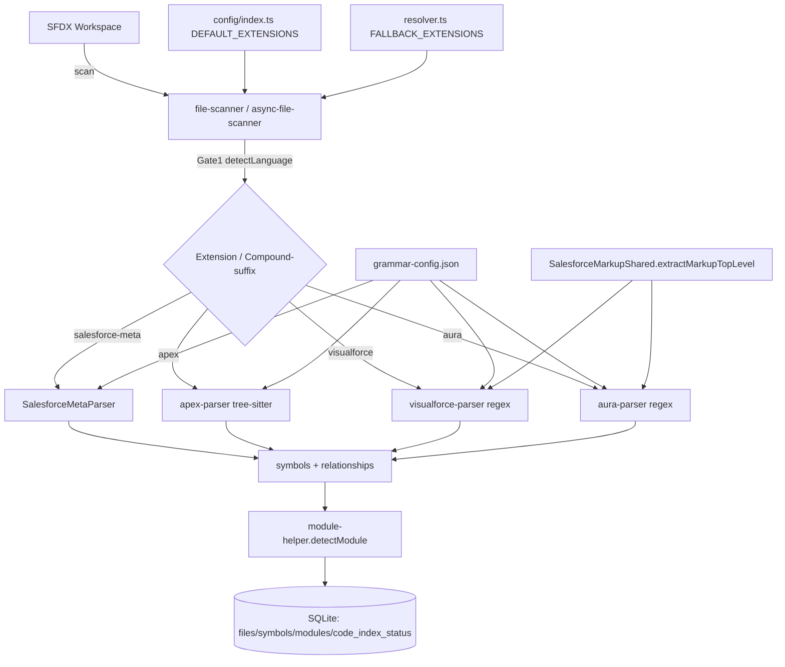
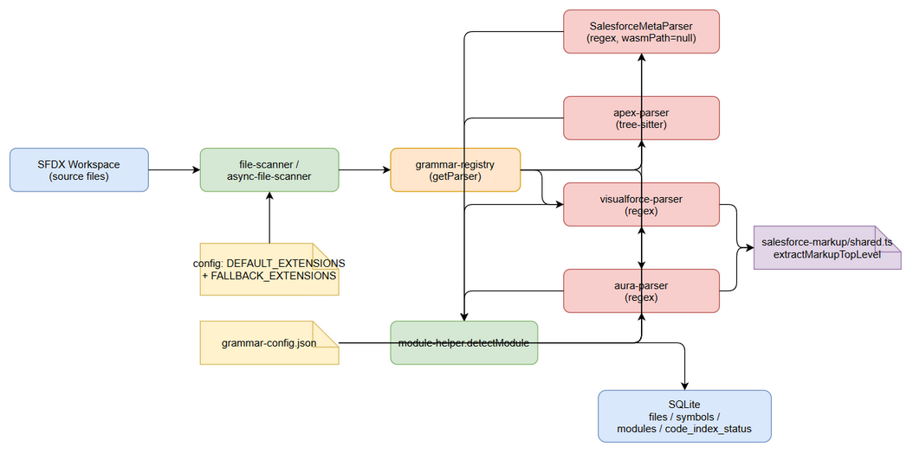
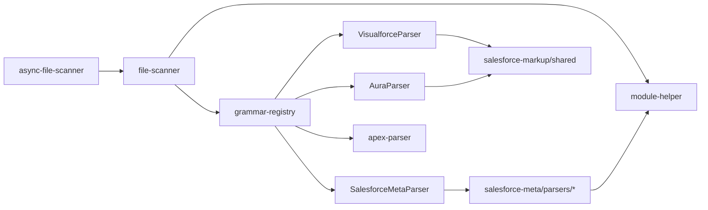
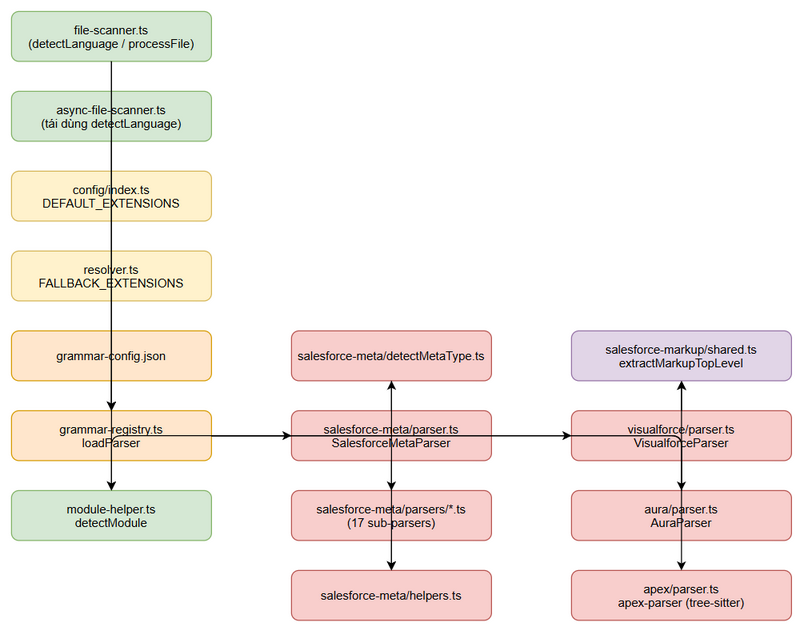
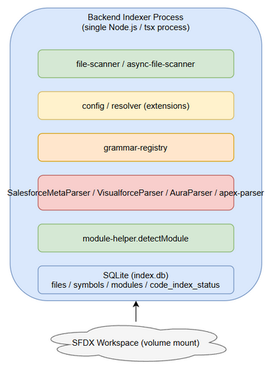
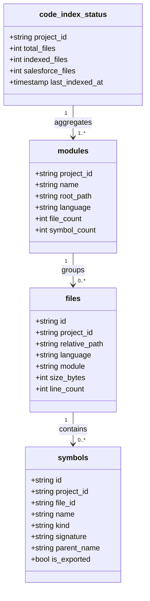
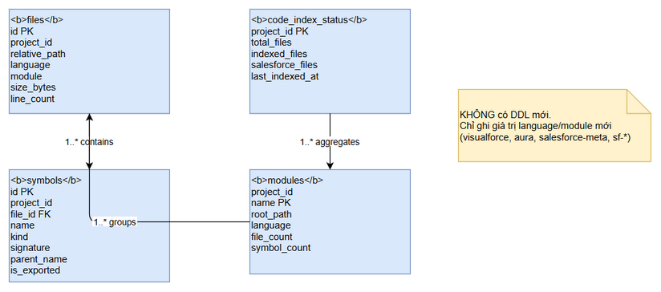
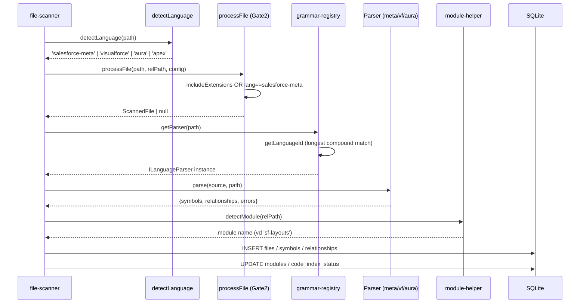
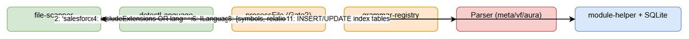

# Technical Design Document (TDD)

## SA4E-223 — Indexer nhận diện mở rộng các phần mở rộng tệp Salesforce (metadata + Aura/Visualforce)

---

## Thông tin tài liệu (Document Information)

| Trường | Giá trị |
|--------|---------|
| Jira Ticket | SA4E-223 |
| Tiêu đề | Indexer does not recognize most Salesforce file extensions (metadata + Aura/Visualforce) during source indexing |
| Tác giả | SA Agent (Solution Architect) |
| Phiên bản | 1.0 |
| Ngày | 2026-08-26 |
| Trạng thái | Draft (sẵn sàng Phase 3.7 Security Design Review) |
| Tài liệu BRD liên quan | `documents/SA4E-223/BRD.md` (v1.0) |
| Tài liệu FSD liên quan | `documents/SA4E-223/FSD.md` (v1.1) |

---

## Theo dõi tác giả (Author Tracking)

| Vai trò | Tên - Chức vụ | Trách nhiệm |
|---------|---------------|-------------|
| Tác giả | SA Agent – Solution Architect | Soạn thảo TDD |
| Người duyệt | SM Agent – Release Manager | Review & chuyển Phase 3.7 |

---

## Lịch sử phiên bản (Revision History)

| Phiên bản | Ngày | Tác giả | Thay đổi |
|-----------|------|---------|----------|
| 1.0 | 2026-08-26 | SA Agent | Khởi tạo TDD — thiết kế kỹ thuật chi tiết từ FSD v1.1 + xác minh trên `backend/src` |

---

## Xác nhận (Sign-Off)

| Tên | Chữ ký và ngày |
|-----|----------------|
| | ☐ Tôi đồng ý và xác nhận thiết kế kỹ thuật trong TDD này |
| | ☐ Tôi đồng ý và xác nhận thiết kế kỹ thuật trong TDD này |

---

## 1. Giới thiệu (Introduction)

### 1.1 Mục đích (Purpose)

Cung cấp thiết kế kỹ thuật ready-to-implement để khắc phục bug SA4E-223: backend **Code Intelligence Indexer** (TypeScript) bỏ qua hầu hết phần mở rộng Salesforce, dẫn đến thống kê `code_index_status` SFDX thiếu hụt. Thiết kế bao phủ đầy đủ **5 touchpoint** phải đổi đồng bộ (FSD §3), tuân thủ 5 quyết định SA-CONF đã chốt (FSD §3.8), và đảm bảo **không hồi quy** Apex + 5 meta type hiện tại.

### 1.2 Phạm vi kỹ thuật (Technical Scope)

- **Trong phạm vi:** 5 touchpoint — `file-scanner.ts`, `config/index.ts` + `resolver.ts`, `grammar-config.json`, `module-helper.ts`, `parsers/languages/salesforce-meta/` + 2 parser mới (`visualforce`, `aura`).
- **Ngoài phạm vi:** deep semantic parsing; tree-sitter grammar cho VF/Aura (dùng regex/generic, `wasmPath = null`); thay đổi schema lưu trữ hay UI; unify legacy `signature-extractor.ts` (follow-up).

### 1.3 Công nghệ (Technology Stack)

| Lớp | Công nghệ | Phiên bản |
|------|-----------|-----------|
| Ngôn ngữ | TypeScript | (theo `backend/package.json`) |
| Parser framework | web-tree-sitter (Apex) + regex/generic (VF/Aura/meta) | — |
| Config schema | zod (`UnifiedConfigSchema`) | — |
| Logging | pino | — |
| Test framework | vitest (+ `node:test` cho một số file cũ) | — |
| Lưu trữ index | SQLite (qua `DatabaseAdapter`) | — |
| Build/Run | tsx / node ESM (`.js` import specifiers) | — |

### 1.4 Nguyên tắc thiết kế (Design Principles)

- **Graceful degradation 2-level** (SA-CONF-5): file isolation + per-case try/catch trong `SalesforceMetaParser.parse()`.
- **Canonical type** (SA-CONF-2): mọi symbol MỚI import `ExtractedSymbol` từ `../types.js` (`parsers/types.ts`), KHÔNG dùng `signature-extractor.ts`.
- **Single source of truth cho danh sách extension** (giảm DRIFT — TR-2): tập trung compound-suffix và extension lists vào hằng số dùng chung.
- **SOLID / Separation of Concerns**: mỗi sub-parser là 1 file riêng ≤200 dòng (BR-16).
- **Không đổi hành vi cũ** (BR-15): giữ nguyên logic Apex + 5 meta type.

### 1.5 Ràng buộc (Constraints)

- Mỗi file source MỚI ≤ **200 dòng** (CI check BR-18).
- `wasmPath = null` cho `visualforce`/`aura` (không tree-sitter).
- Không thay đổi schema DB (`files`, `symbols`, `modules`, `code_index_status`).
- Import specifier phải có đuôi `.js` (ESM).

### 1.6 Tài liệu tham khảo

| Tài liệu | Vị trí |
|----------|--------|
| BRD | `documents/SA4E-223/BRD.md` |
| FSD | `documents/SA4E-223/FSD.md` |
| TDD Template | `documents/templates/TDD-TEMPLATE.md` |
| Source (đã xác minh) | `backend/src/engine/indexer/file-scanner.ts`, `async-file-scanner.ts`, `config/index.ts`, `engine/indexer/project-type/resolver.ts`, `engine/parsers/grammar-config.json`, `engine/indexer/module-helper.ts`, `engine/parsers/languages/salesforce-meta/*`, `engine/parsers/types.ts` |

---

## 2. Kiến trúc hệ thống (System Architecture)

### 2.1 Tổng quan kiến trúc (Architecture Overview)

Toàn bộ luồng lập chỉ mục là **in-process** (không có hệ thống external). File được quét → `detectLanguage` (Gate 1) → `processFile` (Gate 2) → `GrammarRegistry` chọn parser → parser trích xuất symbol → `detectModule` ánh xạ module → cập nhật `code_index_status`/`modules`.





### 2.2 Sơ đồ thành phần (Component Diagram)

| Thành phần | Trách nhiệm | Công nghệ |
|------------|-------------|-----------|
| `file-scanner.ts` | `scanWorkspace`/`scanSingleFile`, `detectLanguage` (Gate 1), `processFile` (Gate 2) | TypeScript |
| `async-file-scanner.ts` | Bản async, tái dùng `detectLanguage` + Gate 2 | TypeScript |
| `config/index.ts` | `DEFAULT_EXTENSIONS` (nguồn `includeExtensions`) | TypeScript/zod |
| `resolver.ts` | `FALLBACK_EXTENSIONS` (khi không có detection) | TypeScript |
| `grammar-config.json` | ánh xạ extension → `parserModule`/`wasmPath` | JSON |
| `grammar-registry.ts` | load parser theo `getLanguageId` (compound match) | TypeScript |
| `module-helper.ts` | `detectModule(relativePath)` → module name | TypeScript |
| `salesforce-meta/parser.ts` | `SalesforceMetaParser` (detectMetaType + dispatch) | TypeScript |
| `salesforce-meta/parsers/*` | sub-parser per meta type | TypeScript |
| `salesforce-markup/shared.ts` | `extractMarkupTopLevel` (VF/Aura dùng chung) | TypeScript |
| `visualforce-parser.ts` / `aura-parser.ts` | thin wrapper → `visualforce/parser.ts` / `aura/parser.ts` | TypeScript |





### 2.3 Kiến trúc triển khai (Deployment Architecture)

**Không có thay đổi triển khai.** Toàn bộ logic nằm trong backend indexer process hiện tại. Không thêm container, service, hay network call. Không đổi schema DB nên không cần migration.



### 2.4 Giao tiếp (Communication Patterns)

| Từ | Đến | Giao thức | Pattern | Mô tả |
|----|----|----------|---------|-------|
| `file-scanner` | `detectLanguage` | in-process function | Sync | Trả language hoặc null |
| `file-scanner` | `processFile` | in-process function | Sync | Gate 2: includeExtensions OR salesforce-meta |
| `grammar-registry` | parser module | dynamic `import()` | Sync/Async | Load `parserModule` path |
| parser | `module-helper.detectModule` | in-process function | Sync | Ánh xạ module từ relativePath |

---

## 3. Thiết kế chi tiết theo Touchpoint (5 điểm đồng bộ)

> Năm touchpoint **phải thay đổi cùng lượt** (BRD §2.3 Note). DEV implement theo thứ tự 3.1 → 3.5.

### 3.1 Touchpoint 1 — `file-scanner.ts`: EXTENSION_LANGUAGE_MAP + compound-suffix

**File:** `backend/src/engine/indexer/file-scanner.ts` (đã đọc, 199 dòng hiện tại).

#### 3.1.1 EXTENSION_LANGUAGE_MAP — các entry MỚI (exact)

Thêm 9 entry mới vào map hiện tại (giữ nguyên mọi entry cũ: `.cls`, `.trigger` → `apex`; `.pega` → `pega`; cùng các ngôn ngữ khác).

```typescript
const EXTENSION_LANGUAGE_MAP: Record<string, string> = {
  // ... (giữ nguyên các entry hiện tại)
  // ---- MỚI: Salesforce simple extensions (SA4E-223) ----
  '.apex': 'apex',        // Apex class/trigger thuần túy
  '.soql': 'apex',        // SOQL query file
  '.page': 'visualforce', // Visualforce page
  '.component': 'visualforce', // Visualforce component (KHÁC component-meta.xml của Aura — BR-3)
  '.cmp': 'aura',         // Aura component
  '.app': 'aura',         // Aura application
  '.evt': 'aura',         // Aura event
  '.intf': 'aura',        // Aura interface
  '.tokens': 'aura',      // Aura tokens
};
```

#### 3.1.2 Compound-suffix list — `*-meta.xml` → `salesforce-meta`

Thay vì hardcode 5 suffix như hiện tại (dòng 84-89), đưa vào **hằng số dùng chung** để tránh drift (giải quyết TR-2) và mở rộng thành 17:

```typescript
const SALESFORCE_META_SUFFIXES: string[] = [
  '.flow-meta.xml', '.object-meta.xml', '.field-meta.xml', '.js-meta.xml', '.component-meta.xml', // đã có
  '.flexipage-meta.xml', '.permissionset-meta.xml', '.profile-meta.xml', '.labels-meta.xml',
  '.tab-meta.xml', '.layout-meta.xml', '.report-meta.xml', '.dashboard-meta.xml',
  '.site-meta.xml', '.resource-meta.xml', '.email-meta.xml', '.testSuite-meta.xml', // MỚI (12)
];

export function detectLanguage(filePath: string): string | null {
  const lowerPath = filePath.toLowerCase().replace(/\\/g, '/');
  if (SALESFORCE_META_SUFFIXES.some(s => lowerPath.endsWith(s))) return 'salesforce-meta';
  const ext = getExtension(filePath);
  return EXTENSION_LANGUAGE_MAP[ext] ?? null;
}
```

> **Lưu ý SA-CONF-3 (RESOLVED):** KHÔNG có nhánh `.testSuite` standalone — chỉ `*.testSuite-meta.xml` (nằm trong list trên). `detectLanguage` giữ nguyên trả `null` cho extension không khớp (EF-1).

#### 3.1.3 Luồng của cả 2 scanner (Giải thích flow)

- **Sync (`file-scanner.ts`):** `scanWorkspace` → `traverseDirectory` → `processFile(fullPath, relPath, config)`.
  - `processFile` (dòng 127-153): Gate 1 `detectLanguage`; nếu `null` → bỏ qua. Gate 2 (dòng 133):
    ```typescript
    if (!config.includeExtensions.includes(ext) && ext !== '.kts' && language !== 'salesforce-meta') return null;
    ```
  → Compound `.xml` có `ext === '.xml'` không nằm trong `includeExtensions`, nhưng được **miễn trừ** qua `language !== 'salesforce-meta'`. Vì vậy compound-suffix KHÔNG cần thêm vào `includeExtensions`.
- **Async (`async-file-scanner.ts`):** tái dùng `detectLanguage` từ `file-scanner.ts` (import dòng 12) và Gate 2 tương đương (dòng 77-79):
  ```typescript
  const validExt = config.includeExtensions.includes(ext) || ext === '.kts' || language === 'salesforce-meta';
  ```
  → **Không cần sửa `async-file-scanner.ts`** — mở rộng `detectLanguage` (3.1.2) và `DEFAULT_EXTENSIONS` (3.2) tự động áp dụng cho cả 2 scanner.

**Kết luận Touchpoint 1:** Chỉ sửa `file-scanner.ts` (map + const compound list). Cả 2 scanner được cover nhờ shared `detectLanguage`.

---

### 3.2 Touchpoint 2 — `config/index.ts` DEFAULT_EXTENSIONS + `resolver.ts` FALLBACK_EXTENSIONS

#### 3.2.1 `config/index.ts` — DEFAULT_EXTENSIONS

Thêm 9 simple extension MỚI vào mảng `DEFAULT_EXTENSIONS` (dòng 18-24), **giữ nguyên** `.cls`, `.trigger`, `.pega` (BR-6).

```typescript
const DEFAULT_EXTENSIONS = [
  // ... (giữ nguyên)
  // ---- MỚI (SA4E-223) ----
  '.apex', '.soql', '.page', '.component', '.cmp', '.app', '.evt', '.intf', '.tokens',
];
```

> `includeExtensions` runtime = `fileConfig.includeExtensions ?? DEFAULT_EXTENSIONS` (dòng 158). Khi không có file config, 9 extension mới tự động có hiệu lực → vượt Gate 2 cho `.page`, `.apex`, v.v.

#### 3.2.2 `resolver.ts` — FALLBACK_EXTENSIONS

Thêm 9 extension MỚI vào `FALLBACK_EXTENSIONS` (dòng 17-20):

```typescript
const FALLBACK_EXTENSIONS = [
  // ... (giữ nguyên)
  // ---- MỚI (SA4E-223) ----
  '.apex', '.soql', '.page', '.component', '.cmp', '.app', '.evt', '.intf', '.tokens',
  // KHUYẾN NGHỊ bổ sung (xem DISCREPANCY DISC-1): '.cls', '.trigger', '.pega'
];
```

> ⚠️ **Discrepancy DISC-1 (Low):** `FALLBACK_EXTENSIONS` hiện tại **không** chứa `.cls`/`.trigger`/`.pega` (tồn tại từ trước, ngoài scope FSD). Đề xuất bổ sung 3 entry trên cho nhất quán. Xem `documents/SA4E-223/DISCREPANCY.md`.

**Kết luận Touchpoint 2:** Sửa 2 file config; cả sync + async scanner đều qua Gate 2.

---

### 3.3 Touchpoint 3 — `grammar-config.json`: parser selection

**File:** `backend/src/engine/parsers/grammar-config.json` (đã đọc). Mở rộng entry `salesforce-meta`, entry `apex`, và thêm 2 entry mới `visualforce`, `aura`.

```json
{
  "languages": [
    {
      "id": "apex",
      "extensions": [".cls", ".trigger", ".apex", ".soql"],
      "wasmPath": "grammars/tree-sitter-apex.wasm",
      "parserModule": "./languages/apex-parser.js"
    },
    {
      "id": "salesforce-meta",
      "extensions": [
        ".flow-meta.xml", ".object-meta.xml", ".field-meta.xml", ".js-meta.xml", ".component-meta.xml",
        ".flexipage-meta.xml", ".permissionset-meta.xml", ".profile-meta.xml", ".labels-meta.xml",
        ".tab-meta.xml", ".layout-meta.xml", ".report-meta.xml", ".dashboard-meta.xml",
        ".site-meta.xml", ".resource-meta.xml", ".email-meta.xml", ".testSuite-meta.xml"
      ],
      "wasmPath": null,
      "parserModule": "./languages/salesforce-meta-parser.js"
    },
    {
      "id": "visualforce",
      "extensions": [".page", ".component"],
      "wasmPath": null,
      "parserModule": "./languages/visualforce-parser.js"
    },
    {
      "id": "aura",
      "extensions": [".cmp", ".app", ".evt", ".intf", ".tokens"],
      "wasmPath": null,
      "parserModule": "./languages/aura-parser.js"
    }
  ]
}
```

> **Cơ chế load (đã xác minh `grammar-registry.ts`):** `parserModule` là dynamic import path tương đối với `grammar-registry.ts` (ở `parsers/`), nên `./languages/visualforce-parser.js` → `parsers/languages/visualforce-parser.ts`. `wasmPath = null` → parser tree-sitter giữ `null`, truyền vào constructor. `getLanguageId` dùng "longest match wins" cho compound extension.

**Kết luận Touchpoint 3:** Chỉ sửa JSON; không đổi `grammar-registry.ts`.

---

### 3.4 Touchpoint 4 — `module-helper.ts`: detectModule

**File:** `backend/src/engine/indexer/module-helper.ts` (đã đọc, hàm `detectModule` dòng 12-27). Mở rộng bằng các **segment check** cho VF/metadata MỚI, đặt **TRƯỚC** `return 'salesforce'` default (giải quyết TR-4).

```typescript
export function detectModule(relativePath: string): string {
  const p = relativePath.replace(/\\/g, '/');

  // ---- MỚI: Salesforce UI / metadata segment checks (SA4E-223) ----
  if (p.includes('/pages/')) return 'visualforce-pages';
  if (p.includes('/components/')) return 'visualforce-components';   // .component (VF) — BR-3
  if (p.includes('/layouts/')) return 'sf-layouts';
  if (p.includes('/permissionsets/')) return 'sf-permissionsets';
  if (p.includes('/profiles/')) return 'sf-profiles';
  if (p.includes('/tabs/')) return 'sf-tabs';
  if (p.includes('/flexipages/')) return 'sf-flexipages';
  if (p.includes('/labels/')) return 'sf-labels';
  if (p.includes('/reports/')) return 'sf-reports';
  if (p.includes('/dashboards/')) return 'sf-dashboards';
  if (p.includes('/sites/')) return 'sf-sites';
  if (p.includes('/staticresources/')) return 'sf-staticresources';
  if (p.includes('/email/')) return 'sf-email';
  if (p.includes('/testSuites/')) return 'sf-testsuites';
  if (p.includes('/aura/')) return 'aura-components';                 // .cmp/.app/.evt/.intf/.tokens

  // ---- Hiện có: force-app structure ----
  if (p.includes('force-app/')) {
    if (p.includes('/classes/')) return 'apex-classes';
    if (p.includes('/triggers/')) return 'apex-triggers';
    if (p.includes('/flows/')) return 'sf-flows';
    if (p.includes('/objects/')) return 'sf-objects';
    if (p.includes('/lwc/')) return 'lwc-components';
    return 'salesforce';
  }

  const parts = p.split('/');
  if (parts.length >= 2 && parts[0] === 'src') return parts[1];
  if (parts.length >= 1) return parts[0];
  return 'root';
}
```

**Bảng ánh xạ cuối cùng (Extension → Language → Module → Parser/Sub-parser):** xem FSD §3.8.6 (đã chốt). Tóm tắt trọng yếu:

| Extension | Language | Module | Parser / Sub-parser |
|-----------|----------|--------|---------------------|
| `.cls`, `.trigger`, `.apex`, `.soql` | apex | `apex-classes` / `apex-triggers` | apex-parser (tree-sitter) |
| `.page` | visualforce | `visualforce-pages` | visualforce-parser (regex) |
| `.component` | visualforce | `visualforce-components` | visualforce-parser (regex) |
| `.cmp`, `.app`, `.evt`, `.intf`, `.tokens` | aura | `aura-components` | aura-parser (regex) |
| `*.flexipage-meta.xml` | salesforce-meta | `sf-flexipages` | `parseFlexipage` (MỚI) |
| `*.permissionset-meta.xml` | salesforce-meta | `sf-permissionsets` | `parsePermissionset` (MỚI) |
| `*.profile-meta.xml` | salesforce-meta | `sf-profiles` | `parseProfile` (MỚI) |
| `*.labels-meta.xml` | salesforce-meta | `sf-labels` | `parseLabels` (MỚI) |
| `*.tab-meta.xml` | salesforce-meta | `sf-tabs` | `parseTab` (MỚI) |
| `*.layout-meta.xml` | salesforce-meta | `sf-layouts` | `parseLayout` (MỚI) |
| `*.report-meta.xml` | salesforce-meta | `sf-reports` | `parseReport` (MỚI) |
| `*.dashboard-meta.xml` | salesforce-meta | `sf-dashboards` | `parseDashboard` (MỚI) |
| `*.site-meta.xml` | salesforce-meta | `sf-sites` | `parseSite` (MỚI) |
| `*.resource-meta.xml` | salesforce-meta | `sf-staticresources` | `parseResource` (MỚI) |
| `*.email-meta.xml` | salesforce-meta | `sf-email` | `parseEmail` (MỚI) |
| `*.testSuite-meta.xml` | salesforce-meta | `sf-testsuites` | `parseTestSuite` (MỚI) |
| `*.flow/object/field/js/component-meta.xml` | salesforce-meta | (như cũ) | (như cũ — giữ nguyên) |

> **BR-3:** `.component` (VF) → `visualforce-components`; `component-meta.xml` (Aura meta) → `aura-components`. Hai segment `/components/` và `/aura/` phân biệt rõ.

**Kết luận Touchpoint 4:** Chỉ sửa `detectModule`; `updateModules`/`detectAndStorePatterns` giữ nguyên.

---

### 3.5 Touchpoint 5 — `parsers/languages/salesforce-meta/` + VF/Aura parsers

**Files đã đọc:** `parser.ts` (45 dòng), `parsers.ts` (105 dòng), `helpers.ts` (33 dòng), `index.ts`, `types.ts` (canonical `ExtractedSymbol`/`ILanguageParser`).

#### 3.5.1 `detectMetaType(filePath)` — mở rộng 12 nhánh MỚI

Tách hàm này ra file riêng `detectMetaType.ts` (export function) để dễ test (BR-17). Giữ 5 nhánh cũ + thêm 12:

```typescript
// salesforce-meta/detectMetaType.ts
export function detectMetaType(filePath: string): string | null {
  const n = filePath.replace(/\\/g, '/').toLowerCase();
  if (n.endsWith('.flow-meta.xml')) return 'flow';
  if (n.endsWith('.object-meta.xml')) return 'object';
  if (n.endsWith('.field-meta.xml')) return 'field';
  if (n.endsWith('.js-meta.xml')) return 'lwc-meta';
  if (n.endsWith('.component-meta.xml')) return 'aura-meta';
  // ---- MỚI (12) ----
  if (n.endsWith('.flexipage-meta.xml')) return 'flexipage';
  if (n.endsWith('.permissionset-meta.xml')) return 'permissionset';
  if (n.endsWith('.profile-meta.xml')) return 'profile';
  if (n.endsWith('.labels-meta.xml')) return 'labels';
  if (n.endsWith('.tab-meta.xml')) return 'tab';
  if (n.endsWith('.layout-meta.xml')) return 'layout';
  if (n.endsWith('.report-meta.xml')) return 'report';
  if (n.endsWith('.dashboard-meta.xml')) return 'dashboard';
  if (n.endsWith('.site-meta.xml')) return 'site';
  if (n.endsWith('.resource-meta.xml')) return 'resource';
  if (n.endsWith('.email-meta.xml')) return 'email';
  if (n.endsWith('.testSuite-meta.xml')) return 'testSuite';
  return null;
}
```

#### 3.5.2 `getSupportedExtensions()`

Trả về 17 extension (khớp §3.3 grammar-config & §3.1.2):

```typescript
getSupportedExtensions(): string[] {
  return [
    '.flow-meta.xml', '.object-meta.xml', '.field-meta.xml', '.js-meta.xml', '.component-meta.xml',
    '.flexipage-meta.xml', '.permissionset-meta.xml', '.profile-meta.xml', '.labels-meta.xml',
    '.tab-meta.xml', '.layout-meta.xml', '.report-meta.xml', '.dashboard-meta.xml',
    '.site-meta.xml', '.resource-meta.xml', '.email-meta.xml', '.testSuite-meta.xml',
  ];
}
```

#### 3.5.3 Sub-parsers MỚI — mỗi cái ≥1 top-level symbol (kind='class')

Mỗi sub-parser có signature chuẩn (SA-CONF-2, canonical `ExtractedSymbol`):

```typescript
export function parseFlexipage(source: string, filePath: string,
  symbols: ExtractedSymbol[], relationships: ExtractedRelationship[]): void { ... }
// tương tự parsePermissionset, parseProfile, parseLabels, parseTab, parseLayout,
// parseReport, parseDashboard, parseSite, parseResource, parseEmail, parseTestSuite
```

**Contract symbol đầu ra** (đồng nhất với FSD §3.8.7, canonical `types.ts`):

| Meta type | `name` (nameFromPath) | `kind` | `signature` | `modifiers` | Child symbols |
|-----------|----------------------|--------|-------------|-------------|----------------|
| flexipage | `<name>` | `class` | `Flexipage: <name>` | `['flexipage']` | — |
| permissionset | `<name>` | `class` | `PermissionSet: <name>` | `['permissionset']` | — |
| profile | `<name>` | `class` | `Profile: <name>` | `['profile']` | — |
| labels | `<name>` | `class` | `Labels: <name>` | `['labels']` | mỗi `<CustomLabel>` → `property` (`parentName=<name>`) |
| tab | `<name>` | `class` | `Tab: <name>` | `['tab']` | — |
| layout | `<name>` | `class` | `Layout: <name>` | `['layout']` | — |
| report | `<name>` | `class` | `Report: <name>` | `['report']` | — |
| dashboard | `<name>` | `class` | `Dashboard: <name>` | `['dashboard']` | — |
| site | `<name>` | `class` | `Site: <name>` | `['site']` | — |
| resource | `<name>` | `class` | `StaticResource: <name>` | `['staticresource']` | — |
| email | `<name>` | `class` | `EmailTemplate: <name>` | `['email']` | — |
| testSuite | `<name>` | `class` | `TestSuite: <name>` | `['testSuite']` | — |

> Mọi symbol MỚI đặt `isExported: true`, `startLine: 1`, `endLine: lineCount`, `filePath`. Trích xuất **chỉ top-level** (BR-13), không đệ quy sâu. Ví dụ `parseLabels` có thể bóc thêm `<CustomLabel><fullName>` thành `property` (optional, không bắt buộc ≥1).

#### 3.5.4 `helpers.ts` — mở rộng `nameFromPath`

Tập trung suffix vào 1 const để tránh drift (TR-2), mở rộng regex hiện tại (dòng 25):

```typescript
const META_SUFFIX_RE = /\.(flow|object|field|js|component|flexipage|permissionset|profile|labels|tab|layout|report|dashboard|site|resource|email|testSuite)-meta\.xml$/;

export function nameFromPath(filePath: string): string {
  const basename = filePath.replace(/\\/g, '/').split('/').pop() ?? filePath;
  return basename.replace(META_SUFFIX_RE, '').replace(/\.\w+$/, '');
}
// giữ nguyên extractXmlValues, extractXmlBlocks, inferObjectFromFieldPath
```

#### 3.5.5 Graceful degradation 2-level (SA-CONF-5)

Refactor `SalesforceMetaParser.parse()` — bọc **từng `case`** bằng `try/catch` riêng (thay vì 1 try/catch bao trùm toàn bộ switch). Đáp ứng "lỗi 1 file không ảnh hưởng phần còn lại".

```typescript
parse(source: string, filePath: string): ParseResult {
  const symbols: ExtractedSymbol[] = [];
  const relationships: ExtractedRelationship[] = [];
  const errors: ParseError[] = [];
  const metaType = detectMetaType(filePath);
  try {
    switch (metaType) {
      case 'flow':        try { parseFlow(source, filePath, symbols, relationships); }        catch (e) { errors.push(err(e)); } break;
      case 'object':      try { parseObject(source, filePath, symbols, relationships); }      catch (e) { errors.push(err(e)); } break;
      case 'field':       try { parseField(source, filePath, symbols, relationships); }       catch (e) { errors.push(err(e)); } break;
      case 'lwc-meta':    try { parseLWCMeta(source, filePath, symbols, relationships); }     catch (e) { errors.push(err(e)); } break;
      case 'aura-meta':   try { parseAuraMeta(source, filePath, symbols); }                   catch (e) { errors.push(err(e)); } break;
      case 'flexipage':   try { parseFlexipage(source, filePath, symbols, relationships); }   catch (e) { errors.push(err(e)); } break;
      case 'permissionset': try { parsePermissionset(source, filePath, symbols, relationships); } catch (e) { errors.push(err(e)); } break;
      case 'profile':     try { parseProfile(source, filePath, symbols, relationships); }     catch (e) { errors.push(err(e)); } break;
      case 'labels':      try { parseLabels(source, filePath, symbols, relationships); }      catch (e) { errors.push(err(e)); } break;
      case 'tab':         try { parseTab(source, filePath, symbols, relationships); }         catch (e) { errors.push(err(e)); } break;
      case 'layout':      try { parseLayout(source, filePath, symbols, relationships); }      catch (e) { errors.push(err(e)); } break;
      case 'report':      try { parseReport(source, filePath, symbols, relationships); }      catch (e) { errors.push(err(e)); } break;
      case 'dashboard':   try { parseDashboard(source, filePath, symbols, relationships); }  catch (e) { errors.push(err(e)); } break;
      case 'site':        try { parseSite(source, filePath, symbols, relationships); }        catch (e) { errors.push(err(e)); } break;
      case 'resource':    try { parseResource(source, filePath, symbols, relationships); }    catch (e) { errors.push(err(e)); } break;
      case 'email':       try { parseEmail(source, filePath, symbols, relationships); }       catch (e) { errors.push(err(e)); } break;
      case 'testSuite':   try { parseTestSuite(source, filePath, symbols, relationships); }   catch (e) { errors.push(err(e)); } break;
      default: break;
    }
  } catch (err) {
    errors.push({ message: `Meta detection error: ${msg(err)}`, line: 1, column: 0 });
  }
  return { symbols, relationships, errors };
}
```

> Level 1 (file isolation) đã có ở `file-scanner.processFile`/`indexing-engine.indexSingleFile(...).catch(...)`. Level 3 (block-level) do `extractXmlValues`/`extractXmlBlocks` dùng regex non-throwing. → Thỏa mãn BR-14.

#### 3.5.6 Cấu trúc file & tách nhỏ (BR-16 — mỗi file ≤200 dòng)

`parsers.ts` hiện 105 dòng; thêm 12 hàm sẽ vượt 200. Đề xuất tách thành `parsers/` subfolder — mỗi file ≤80 dòng:

```
parsers/languages/salesforce-meta/
├── parser.ts            # SalesforceMetaParser class (import detectMetaType + parsers/*)
├── detectMetaType.ts    # detectMetaType()
├── helpers.ts           # extractXmlValues/Blocks, nameFromPath (mở rộng), inferObjectFromFieldPath
├── index.ts             # export { default as default } from './parser.js'
└── parsers/
    ├── index.ts         # re-export parseFlow, parseObject, ... parseTestSuite
    ├── flow.ts  object.ts  field.ts  lwc.ts  aura.ts
    ├── flexipage.ts  permissionset.ts  profile.ts  labels.ts  tab.ts
    ├── layout.ts  report.ts  dashboard.ts  site.ts  resource.ts  email.ts  testSuite.ts
```

`parser.ts` import: `import { parseFlow, ... } from './parsers/index.js';` và `import { detectMetaType } from './detectMetaType.js';`.

#### 3.5.7 Shared helper cho VF/Aura — `salesforce-markup/shared.ts` (SA-CONF-1)

Tạo `parsers/languages/salesforce-markup/shared.ts` (sibling của `salesforce-meta/`), tái dùng `extractXmlValues`/`extractXmlBlocks` từ `../salesforce-meta/helpers.js`:

```typescript
import type { ExtractedSymbol, ExtractedRelationship, RelationshipKind } from '../../types.js';
import { extractXmlValues, extractXmlBlocks } from '../salesforce-meta/helpers.js';

export interface MarkupParseOptions {
  rootTags: string[];                 // vd ['apex:page','apex:component'] | ['aura:component', ...]
  signaturePrefix: string;            // 'VisualforcePage' | 'AuraComponent' ...
  modifiers: string[];               // ['visualforce','page'] ...
  relationshipAttrs?: { attr: string; kind: RelationshipKind }[];
}
export function extractMarkupTopLevel(source: string, filePath: string, opts: MarkupParseOptions):
  { symbols: ExtractedSymbol[]; relationships: ExtractedRelationship[] } {
  // 1) tìm root tag đầu tiên (regex non-throwing)
  // 2) nếu root tag ∈ opts.rootTags → push 1 top-level symbol (kind='class', name=base, isExported=true)
  // 3) với mỗi relationshipAttrs: đọc giá trị attribute → push relationship (best-effort)
  // 4) trả về symbols + relationships (rỗng nếu không khớp)
}
```

> Tên symbol luôn lấy từ **path** (luôn có) → chống bỏ sót (TR-1). Relationship là best-effort, không block index.

#### 3.5.8 Parser VF/Aura mới (regex/generic, wasmPath=null)

Tạo 2 wrapper mỏng + 2 file implementation (pattern khớp `salesforce-meta-parser.ts` → `salesforce-meta/parser.ts`):

```
parsers/languages/
├── visualforce-parser.ts     # export { default as default } from './visualforce/parser.js';
├── visualforce/
│   ├── parser.ts            # class VisualforceParser implements ILanguageParser
│   └── index.ts
├── aura-parser.ts           # export { default as default } from './aura/parser.js';
└── aura/
    ├── parser.ts            # class AuraParser implements ILanguageParser
    └── index.ts
```

`visualforce/parser.ts`:
```typescript
import type { ILanguageParser, ParseResult, ExtractedSymbol, ExtractedRelationship } from '../../types.js';
import { extractMarkupTopLevel } from '../salesforce-markup/shared.js';

export default class VisualforceParser implements ILanguageParser {
  readonly languageId = 'visualforce';
  constructor(_p: any, _id: string) {}
  getSupportedExtensions() { return ['.page', '.component']; }
  parse(source: string, filePath: string): ParseResult {
    const isPage = filePath.toLowerCase().endsWith('.page');
    const { symbols, relationships } = extractMarkupTopLevel(source, filePath, {
      rootTags: ['apex:page', 'apex:component'],
      signaturePrefix: isPage ? 'VisualforcePage' : 'VisualforceComponent',
      modifiers: isPage ? ['visualforce', 'page'] : ['visualforce', 'component'],
      relationshipAttrs: [
        { attr: 'controller', kind: 'uses' },        // → Apex class
        { attr: 'extensions', kind: 'apex-import' },
      ],
    });
    return { symbols, relationships, errors: [] };
  }
}
```

`aura/parser.ts` tương tự với `rootTags: ['aura:component','aura:application','aura:event','aura:interface','aura:tokens']`, `signaturePrefix` theo subtype, `relationshipAttrs: [{attr:'implements',kind:'implements'},{attr:'extends',kind:'inherits'}]`.

**VF/Aura top-level symbols (đồng nhất FSD §3.8.7):**
- `.page` → `signature='VisualforcePage: <base>'`, `modifiers=['visualforce','page']`, relationship `uses`→`controller`.
- `.component` (VF) → `signature='VisualforceComponent: <base>'`, `modifiers=['visualforce','component']`.
- `.cmp/.app/.evt/.intf` → `signature='Aura<Type>: <base>'`, `modifiers=['aura',<type>]`, relationship `implements`/`inherits`.
- `.tokens` → `signature='AuraTokens: <base>'`, `modifiers=['aura','tokens']`.

**Kết luận Touchpoint 5:** Không đổi `ILanguageParser`/`types.ts`; chỉ thêm file mới + refactor `salesforce-meta` (tách sub-parser). Mọi symbol dùng canonical `ExtractedSymbol` (SA-CONF-2).

---

## 4. Mô hình dữ liệu (Database Design)

**KHÔNG có thay đổi schema** (BRD §1.2 ngoài scope; FSD §4 ghi chú logic). Tái dùng các bảng hiện có:

| Bảng | Vai trò trong thay đổi | Ghi chú |
|------|------------------------|---------|
| `files` | Lưu `language` (`visualforce`/`aura`/`salesforce-meta`), `module` (tên mới từ §3.4), `relative_path` | Đã có; chỉ ghi giá trị mới |
| `symbols` | Lưu top-level `ExtractedSymbol` (canonical) | `kind='class'`, `parentName` cho child |
| `modules` | Thống kê `file_count`/`symbol_count` theo module mới | `updateModules` group-by module (giữ nguyên) |
| `code_index_status` | `total_files`/`indexed_files`/`salesforce_files`/`last_indexed_at` | Sửa bug undercount SFDX |





> **Migration:** Không cần DDL/migration. Nếu muốn, thêm index trên `files(module, project_id)` (đã có hoặc thêm) để `updateModules` nhanh — optional, không bắt buộc.

---

## 5. Thiết kế lớp / module (Class / Module Design)

### 5.1 Cấu trúc package (tree)

```
backend/src/engine/
├── indexer/
│   ├── file-scanner.ts            # SỬA: EXTENSION_LANGUAGE_MAP + SALESFORCE_META_SUFFIXES
│   ├── async-file-scanner.ts      # KHÔNG đổi (shared detectLanguage)
│   ├── module-helper.ts           # SỬA: detectModule segment checks
│   └── project-type/resolver.ts   # SỬA: FALLBACK_EXTENSIONS
├── config/index.ts                # SỬA: DEFAULT_EXTENSIONS
└── parsers/
    ├── grammar-config.json        # SỬA: salesforce-meta + visualforce + aura
    ├── grammar-registry.ts        # KHÔNG đổi
    ├── types.ts                   # KHÔNG đổi (canonical)
    └── languages/
        ├── salesforce-meta-parser.ts       # KHÔNG đổi (re-export)
        ├── visualforce-parser.ts           # MỚI (wrapper)
        ├── aura-parser.ts                  # MỚI (wrapper)
        ├── salesforce-markup/
        │   └── shared.ts                   # MỚI (extractMarkupTopLevel)
        ├── visualforce/{parser.ts,index.ts}# MỚI
        ├── aura/{parser.ts,index.ts}       # MỚI
        └── salesforce-meta/
            ├── parser.ts            # SỬA: per-case try/catch
            ├── detectMetaType.ts    # MỚI (tách ra)
            ├── helpers.ts           # SỬA: nameFromPath regex
            ├── index.ts             # KHÔNG đổi
            └── parsers/             # MỚI (tách sub-parsers)
                ├── index.ts + 17 file *.ts
```

### 5.2 Interface chính (canonical)

```typescript
// parsers/types.ts (KHÔNG đổi)
export interface ILanguageParser {
  readonly languageId: string;
  parse(source: string, filePath: string): ParseResult;
  getSupportedExtensions(): string[];
}
export interface ExtractedSymbol {
  name: string; kind: SymbolKind; filePath: string;
  startLine: number; endLine: number; signature: string;
  parameters?: string | null; returnType?: string | null;
  modifiers?: string[]; decorators?: string[];
  parentName?: string | null; isAsync?: boolean;
  isExported?: boolean; docComment?: string | null; complexity?: number;
}
```

> Mọi parser MỚI (`VisualforceParser`, `AuraParser`, sub-parsers) import `ExtractedSymbol`/`ILanguageParser`/`ParseResult`/`ExtractedRelationship`/`ParseError` từ `'../../types.js'`. **KHÔNG** dùng `signature-extractor.ts` (legacy, SA-CONF-2).

### 5.3 Design Patterns

| Pattern | Vị trí | Lý do |
|---------|--------|-------|
| **Strategy / Polymorphism** | `GrammarRegistry` chọn `ILanguageParser` theo extension | Parser cho VF/Aura/meta là các strategy có cùng interface |
| **Factory (dynamic import)** | `grammar-registry.loadParser` import `parserModule` | Thêm ngôn ngữ = thêm entry JSON, không sửa registry |
| **Template Method** | `extractMarkupTopLevel(opts)` dùng chung bởi VF/Aura | Tránh lặp logic regex (SA-CONF-1) |
| **Single Source of Truth** | `SALESFORCE_META_SUFFIXES`, `META_SUFFIX_RE` | Tránh drift danh sách extension (TR-2) |
| **Fail-fast isolation** | per-case try/catch + file isolation | Graceful degradation 2-level (SA-CONF-5) |

### 5.4 Error Handling

| Lớp | Cách xử lý | Kết quả |
|-----|-----------|---------|
| Gate 1 `detectLanguage` | extension không khớp | trả `null` → bỏ qua (không throw) |
| Gate 2 `processFile` | ext không trong includeExtensions & không salesforce-meta | trả `null` → skip + log warn |
| Parser (per-case) | sub-parser throw | push `ParseError`, log warn, continue case khác |
| File-level | `indexing-engine.indexSingleFile().catch()` | 1 file lỗi không crash scan (Level 1) |

`ParseError` schema (giữ nguyên): `{ message: string; line: number; column: number }`.

---

## 6. Thiết kế tích hợp (Integration Design)

Toàn bộ tích hợp là **nội bộ in-process** (FSD §5). Không có hệ thống external, không network call, không đổi I/O format. "Hợp đồng" duy nhất là `grammar-config.json` (extension → `parserModule`) giữa `file-scanner` (ngôn ngữ) và `grammar-registry` (chọn parser).

### 6.1 Sequence Diagram — lập chỉ mục 1 tệp Salesforce





### 6.2 Xử lý lỗi tích hợp

Mỗi bước lỗi → bỏ qua tệp (null) hoặc degrade, không crash. Gate 1 null → skip; Gate 2 fail → skip + log; XML lỗi → degrade + log (§3.5.5, §5.4).

---

## 7. Thiết kế bảo mật (Security Design)

> Sẵn sàng chuyển **Phase 3.7 Security Design Review**.

- **Không thay đổi** cơ chế authn/authz hiện tại (indexer là internal process).
- **Không secret**: index DB chỉ lưu metadata tệp & symbol; không lưu nội dung tệp.
- **Phân loại dữ liệu**: source SFDX là Internal; `code_index_status` không chứa thông tin nhạy cảm.
- **Log hygiene (điểm cho Security Review)**: `extractMarkupTopLevel` và sub-parser **KHÔNG** ghi raw XML vào log (tránh rò rỉ tiềm năng secret trong metadata như `<password>` trong `.resource`/`.site`). Chỉ log: `filePath`, `error message`, `metaType`. → Đề xuất thêm log guard trong `SalesforceMetaParser.parse()` per-case catch: `logger.warn({ filePath, metaType }, 'salesforce-meta parse failed')`.
- **Input validation**: extension/path đến từ scanner trong workspace; `detectLanguage` chỉ so khớp suffix tĩnh (regex static, không có user input) → **không** có injection. `nameFromPath` strip suffix, không eval.
- **Audit**: mỗi lần index ghi `last_indexed_at` vào `code_index_status` (đã có). Không yêu cầu audit chi tiết hơn.

---

## 8. Hiệu năng & Khả năng mở rộng (Performance & Scalability)

| Hạng mục | Thiết kế | Tiêu chí |
|----------|----------|----------|
| Độ phức tạp parser | Regex `extractXmlValues`/`extractMarkupTopLevel` quét 1 pass → **O(n)** trên kích thước tệp | — |
| Thời gian / tệp | Parser regex/generic rất nhẹ, không I/O thêm | **p95 < 10ms / tệp** (target) |
| Bộ nhớ | Symbol lưu in-memory per-file, flush vào DB theo batch (đã có) | không growth đột biến |
| Apex (tree-sitter) | `.apex`/`.soql` dùng chung `tree-sitter-apex` (đã có) | không đổi |
| Mở rộng | Thêm meta type = thêm 1 entry grammar-config + 1 sub-parser file (≤80 dòng) | dễ bảo trì |

> **Rủi ro hiệu năng (TR-6):** `.soql` route vào `apex` (tree-sitter). Nếu tree-sitter-apex không parse được cú pháp SOQL, parser trả symbol rỗng nhưng tệp vẫn được index (language=apex). Chấp nhận (best-effort), không ảnh hưởng p95 vì tree-sitter parse thất bại nhanh.

---

## 9. Giám sát & Quan sát (Monitoring & Observability)

| Log Event | Level | Fields | Destination |
|-----------|-------|--------|-------------|
| Compound extension nhận diện | DEBUG | `filePath`, `metaType` | pino → stdout |
| Sub-parser lỗi (per-case) | WARN | `filePath`, `metaType`, `error` (KHÔNG raw XML) | pino |
| detectLanguage trả null | DEBUG | `filePath` | pino |
| Index hoàn tất | INFO | `projectId`, `total_files`, `salesforce_files` | pino |

**Metrics (gợi ý):** counter `salesforce_files_indexed`, histogram `parser_duration_ms` (per language). Không bắt buộc thêm health-check mới (tái dùng `code_index_status`).

---

## 10. Triển khai (Deployment Considerations)

- **Environment**: không đổi biến môi trường; `DEFAULT_EXTENSIONS`/`FALLBACK_EXTENSIONS` hardcode trong code, overridden bởi `config.json` (`includeExtensions`) nếu có.
- **Feature Flags**: không cần (thay đổi là bug-fix确定性).
- **Rollback**: revert 5 touchpoint (git revert) → về trạng thái cũ (bỏ qua extension Salesforce). Không DB migration nên rollback không để lại dangling schema.
- **CI**: đảm bảo BR-18 — mọi file MỚI ≤200 dòng (thêm check vào vitest/lint nếu chưa có). Test thất bại → block merge.

---

## 11. Kế hoạch Unit Test (Unit Test Plan)

> Mục tiêu: mọi extension trả non-null (TC-01..03), mọi nhánh parser có test (TC-08), XML lỗi degrade (TC-09), không hồi quy Apex + 5 meta type (TC-10). Dùng vitest (hoặc `node:test` như `salesforce-meta-parser.test.ts` hiện tại).

### 11.1 `file-scanner.test.ts` (Touchpoint 1 + 2)

| TC | Mô tả | Input | Expected |
|----|-------|-------|----------|
| TC-01 | 9 simple ext → non-null | `.apex .soql .page .component .cmp .app .evt .intf .tokens` | `apex`/`visualforce`/`aura` (không null) |
| TC-02 | 17 compound-suffix → `salesforce-meta` | `X.flow-meta.xml` … `X.testSuite-meta.xml` | `'salesforce-meta'` |
| TC-03 | Không extension Salesforce nào trả null | toàn bộ §3.1 | 100% non-null |
| TC-04a | Gate 2 sync | `.page`/`.apex` với config `includeExtensions` chứa chúng | qua `processFile` |
| TC-04b | Gate 2 async | `scanWorkspaceAsync` tương đương | qua (shared detectLanguage) |
| TC-05 | Regression | `.cls`/`.trigger`/`.pega` | vẫn map như cũ (không hồi quy) |
| TC-06 | unknown ext | `readme.md` | `null` |

### 11.2 `salesforce-meta-parser.test.ts` (Touchpoint 5 — mở rộng)

| TC | Mô tả | Expected |
|----|-------|----------|
| TC-07 | `getSupportedExtensions` | chứa đủ 17 extension |
| TC-08 | Mỗi sub-parser MỚI | `parseX()` → ≥1 `class` symbol, `name`=base, `signature` đúng prefix (Flexipage/PermissionSet/Profile/Labels/Tab/Layout/Report/Dashboard/Site/StaticResource/EmailTemplate/TestSuite) |
| TC-09 | XML malformed (vd `<broken><unclosed>`) | kết quả trả về, có `errors`, **không throw**, symbols có thể rỗng |
| TC-09b | empty file | `errors.length === 0` |
| TC-10 | Regression 5 meta type cũ | flow/object/field/js/component-meta vẫn parse đúng (fixtures hiện có) |

> Fixtures: tái dùng `fixtures/salesforce-meta/` (đã có flow/object/field/js). **Cần bổ sung** fixture cho 12 loại mới (ít nhất 1 file hợp lệ mỗi loại) để TC-08 chạy.

### 11.3 `visualforce-parser.test.ts` / `aura-parser.test.ts` (MỚI)

| TC | Mô tả | Expected |
|----|-------|----------|
| VF-1 | `<apex:page controller="MyCtrl">` | symbol `VisualforcePage: <base>`, relationship `uses→MyCtrl` |
| VF-2 | `.component` (VF) | `VisualforceComponent: <base>` |
| VF-3 | markup nhiều dòng / attr xuống dòng | vẫn lấy được symbol (regex `[\s\S]`) |
| AUR-1 | `<aura:component implements="...">` | `AuraComponent: <base>`, relationship `implements` |
| AUR-2 | `.app`/`.evt`/`.intf`/`.tokens` | prefix tương ứng |
| VF/AUR-ERR | tệp không phải markup / rỗng | không crash, symbols rỗng |

### 11.4 `module-helper.test.ts` (Touchpoint 4)

| TC | Input path | Expected module |
|----|-----------|-----------------|
| MH-1 | `force-app/.../pages/X.page` | `visualforce-pages` |
| MH-2 | `force-app/.../components/X.component` | `visualforce-components` (BR-3) |
| MH-3 | `force-app/.../layouts/X.layout-meta.xml` | `sf-layouts` |
| MH-4 | `force-app/.../testSuites/X.testSuite-meta.xml` | `sf-testsuites` |
| MH-5 | `force-app/.../aura/X.cmp` | `aura-components` |
| MH-6 | `src/layouts/X.layout-meta.xml` (generic) | `sf-layouts` (segment check trước force-app) |
| MH-7 | `force-app/.../unknown/X.xyz` | `salesforce` (default) |

### 11.5 `resolver.test.ts` (Touchpoint 2)

- `FALLBACK_EXTENSIONS` chứa 9 extension MỚI (và đề xuất `.cls/.trigger/.pega` — DISC-1).
- `DEFAULT_EXTENSIONS` (test qua `loadConfig` default) chứa 9 extension MỚI.

### 11.6 CI

- Vitest chạy toàn bộ; coverage đủ các branch sub-parser (BR-17).
- **Line-count check** (BR-18): script/lint đảm bảo mỗi file MỚI ≤200 dòng (đặc biệt `parsers/` subfolder).

---

## 12. Rủi ro & Biện pháp giảm thiểu (Risks & Mitigations)

| ID | Rủi ro | Tác động | Khả năng | Biện pháp (đã thiết kế) |
|----|--------|----------|----------|------------------------|
| TR-1 | Regex VF/Aura bỏ sót symbol nếu cấu trúc không chuẩn | TB | Cao | Lấy `name` từ **path** (luôn có); relationship best-effort; không block index (§3.5.7) |
| TR-2 | `nameFromPath` chưa cover 12 suffix mới | Cao | TB | Centralize suffix vào `META_SUFFIX_RE` + `SALESFORCE_META_SUFFIXES` (§3.1.2, §3.5.4); test TC-02/TC-03 |
| TR-3 | Nhầm `.component` (VF) vs `component-meta.xml` (Aura) | Cao | TB | BR-3: segment `/components/` → `visualforce-components`; `/aura/` → `aura-components`; test MH-2/MH-5 |
| TR-4 | `detectModule` default `salesforce` nuốt type mới | Cao | TB | Thêm mọi segment check **trước** default (§3.4); integration test MH-1..MH-7 |
| TR-5 | `FALLBACK_EXTENSIONS` thiếu apex/pega (pre-existing) | TB | TB | DISC-1: đề xuất bổ sung `.cls/.trigger/.pega` (không bắt buộc) |
| TR-6 | `.soql`/`.apex` tree-sitter-apex không parse | Thấp | Trung bình | Best-effort symbol; tệp vẫn index (lang=apex); không ảnh hưởng p95 |
| TR-7 | Per-case try/catch đổi mức lỗi (granular) | Thấp | Thấp | Giữ 1 try/catch bao quanh switch làm top-level safety (§3.5.5); test TC-09 |

---

## 13. Phụ lục (Appendix)

### 13.1 Danh sách sơ đồ (Diagrams)

| Sơ đồ | Định dạng | Vị trí |
|--------|-----------|--------|
| Architecture | Mermaid + drawio | §2.1 / `diagrams/architecture.png` |
| Component | Mermaid + drawio | §2.2 / `diagrams/component.png` |
| Deployment | Mermaid + drawio | §2.3 / `diagrams/deployment.png` |
| API Sequence (indexing) | Mermaid + drawio | §6.1 / `diagrams/api-sequence-indexing.png` |
| DB Schema | Mermaid + drawio | §4 / `diagrams/db-schema.png` |
| Class Diagram (parsers) | drawio | `diagrams/class-diagram.png` |
| File State (lifecycle) | drawio | `diagrams/state-file.png` |

### 13.2 Tóm tắt các điểm SA-CONF (đã chốt, đưa thẳng vào TDD)

- **SA-CONF-1**: VF/Aura = regex/generic, `wasmPath=null`, shared `extractMarkupTopLevel`, 2 thin wrapper. Scope top-level + 1 relationship.
- **SA-CONF-2**: mọi symbol MỚI dùng canonical `ExtractedSymbol` (`../types.js`); metadata top-level `kind='class'`.
- **SA-CONF-3**: chỉ `*.testSuite-meta.xml`; bỏ standalone `.testSuite`.
- **SA-CONF-4**: tên module theo §3.4 (segment checks trước default `salesforce`).
- **SA-CONF-5**: graceful degradation 2-level (file isolation + per-case try/catch).

### 13.3 Glossary

| Thuật ngữ | Định nghĩa |
|-----------|------------|
| SFDX | Salesforce DX — định dạng dự án Salesforce |
| salesforce-meta | Ngôn ngữ nội bộ cho `*-meta.xml` |
| Gate 1 / Gate 2 | `detectLanguage` null-check / `includeExtensions` check |
| code_index_status | Bảng thống kê trạng thái lập chỉ mục |
| Compound-suffix | `<type>-meta.xml` |
| wasmPath = null | Parser regex/generic, không tree-sitter |

---

## 14. Danh sách file DEV sẽ tạo / sửa (Deliverables)

**SỬA (4 file):**
1. `backend/src/engine/indexer/file-scanner.ts`
2. `backend/src/config/index.ts`
3. `backend/src/engine/indexer/project-type/resolver.ts`
4. `backend/src/engine/indexer/module-helper.ts`
5. `backend/src/engine/parsers/grammar-config.json`
6. `backend/src/engine/parsers/languages/salesforce-meta/parser.ts` (per-case try/catch)
7. `backend/src/engine/parsers/languages/salesforce-meta/helpers.ts` (nameFromPath)

**TẠO MỚI (file-tree §5.1):**
- `salesforce-meta/detectMetaType.ts`
- `salesforce-meta/parsers/index.ts` + 17 file `parsers/<type>.ts`
- `salesforce-markup/shared.ts`
- `visualforce-parser.ts` + `visualforce/parser.ts` + `visualforce/index.ts`
- `aura-parser.ts` + `aura/parser.ts` + `aura/index.ts`
- Fixtures test: `fixtures/salesforce-meta/<Type>.meta.xml` (12 file mới)
- Test files: `visualforce-parser.test.ts`, `aura-parser.test.ts`, `module-helper.test.ts` (mới); mở rộng `file-scanner.test.ts`, `salesforce-meta-parser.test.ts`, `resolver.test.ts`.

> **Không viết source code trong TDD này** — chỉ thiết kế. DEV implement theo §3 và §5.
