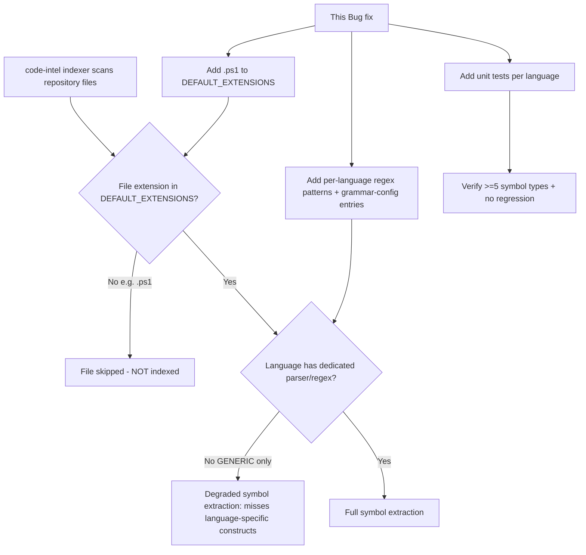

# Business Requirements Document (BRD)

## SDLC-Agents-4-Enterprise code-intel indexer — SA4E-225: Incomplete language support: Scala, C/C++, C#, Ruby, PHP, Swift, Bash, PowerShell lack parser/regex patterns for symbol extraction

---

## Document Information

| Field | Value |
|-------|-------|
| Jira Ticket | SA4E-225 |
| Title | Incomplete language support: Scala, C/C++, C#, Ruby, PHP, Swift, Bash, PowerShell lack parser/regex patterns for symbol extraction |
| Author | BA Agent |
| Version | 1.0 |
| Date | 2026-08-28 |
| Status | Draft |
| Issue Type | Bug |
| Priority | Medium |

---

## Author Tracking

| Role | Name - Position | Responsibility |
|------|-----------------|----------------|
| Author | BA Agent – Business Analyst | Create document |
| Peer Reviewer | To be assigned – Tech Lead / SA | Review document |

---

## Revision History

| Version | Date | Author | Changes |
|---------|------|--------|---------|
| 1.0 | 2026-08-28 | BA Agent | Initiate document — auto-generated from Jira ticket SA4E-225 |

---

## Sign-Off

| Name | Signature and date |
|------|--------------------|
| | ☐ I agree and confirm all criteria on this BRD as expected requirements |
| | ☐ I agree and confirm all criteria on this BRD as expected requirements |

---

## 1. Introduction

This document specifies the business requirements to remediate **SA4E-225**, a Bug in the SDLC-Agents-4-Enterprise `code-intel` indexer (backend TypeScript). The indexer recognizes multiple programming languages for file scanning and text search, but several languages are missing dedicated parser entries (`grammar-config.json`) and/or regex symbol-extraction patterns (`signature-extractor.ts`). As a result, symbol extraction for those languages is severely degraded (falling back to `GENERIC_PATTERNS` only), and PowerShell (`.ps1`) is skipped entirely because it is absent from `DEFAULT_EXTENSIONS`.

### 1.1 Scope

- Add language-specific regex symbol-extraction pattern sets to `signature-extractor.ts` for: **Scala, C, C++, C#, Ruby, PHP, Swift, Bash, PowerShell**.
- Add corresponding parser entries to `grammar-config.json` for each affected language.
- Add `.ps1` to `DEFAULT_EXTENSIONS` so PowerShell files are no longer skipped during indexing.
- Unit-test each new pattern set against a real sample source file, asserting extraction of at least 5 distinct symbol types.
- Maintain all existing fully-supported languages (typescript, javascript, python, kotlin, java, go, rust, apex, pega) and ensure existing test suite passes (no regression).
- Keep implementation files within a 200-line limit; split `signature-extractor.ts` into per-language pattern files if it grows too large.

### 1.2 Out of Scope

- **Tree-sitter WASM grammar integration** (Phase 4 of the ticket's "Proposed Fix") — explicitly optional/lower priority; not required by acceptance criteria. Regex patterns cover ~80% of symbol extraction needs.
- **SQL (`.sql`)** — listed in the audit as a "Gap (low - config/query file)". No parser/regex work is planned; SQL remains indexed for search only.
- Config/data formats (yaml, json, toml) — intentionally indexed for search, no symbol extraction required; acceptable as-is.
- **Pega** and other already-fully-supported tree-sitter languages — no change.
- Any change to the `detectLanguage()` / `EXTENSION_LANGUAGE_MAP` recognition logic (languages are already recognized; only parser/regex + DEFAULT_EXTENSIONS entries are missing).
- UI/UX changes — this is a backend indexing bug with no user-facing interface.

### 1.3 Preliminary Requirement

- Access to the codebase modules: `signature-extractor.ts`, `grammar-config.json`, `DEFAULT_EXTENSIONS`, `detectLanguage()` / `EXTENSION_LANGUAGE_MAP`.
- Existing test harness for symbol-extraction unit tests must be reused; sample source fixtures for each language must be created.
- No additional preliminary requirements identified beyond standard dev environment.

---

## 2. Business Requirements

### 2.1 High Level Process Map

### 2.2 List of User Stories / Use Cases

| # | Story / Use Case | Priority | Source Ticket |
|---|------------------|----------|---------------|
| 1 | As a developer indexing a Scala project, I want Scala-specific symbols (object, trait, case class, sealed, def, val) extracted so that my Scala codebase is fully searchable. | MUST HAVE | SA4E-225 |
| 2 | As a developer, I want C/C++/C# symbols (struct, class, namespace, template, interface, record, property, etc.) extracted so that common systems languages are well supported. | HIGH | SA4E-225 |
| 3 | As a developer, I want Ruby/PHP/Swift/Bash/PowerShell symbols extracted so that scripting and additional languages are indexed. | MEDIUM | SA4E-225 |
| 4 | As a developer working with PowerShell, I want `.ps1` files indexed at all so that they are no longer silently skipped. | MEDIUM | SA4E-225 |
| 5 | As a maintainer, I want the fix to add no regressions and stay maintainable (file size <= 200 lines) so that the indexer remains stable and reviewable. | MUST HAVE | SA4E-225 |

---

### 2.3 Details of User Stories

---

#### Business Flow

**Step 1:** Indexer walks repository files and maps each extension to a language via `EXTENSION_LANGUAGE_MAP` / `detectLanguage()`.

**Step 2:** If the extension is not present in `DEFAULT_EXTENSIONS`, the file is skipped entirely (current behavior for `.ps1`).

**Step 3:** If the language has no dedicated `grammar-config.json` parser entry and no regex set in `signature-extractor.ts`, only `GENERIC_PATTERNS` run, missing language-specific constructs.

**Step 4:** Fix adds `.ps1` to `DEFAULT_EXTENSIONS` and adds per-language regex pattern sets + `grammar-config.json` entries.

**Step 5:** Each new pattern set is unit-tested against a real sample; extraction of >=5 symbol types is asserted.

**Step 6:** Existing tree-sitter language tests are re-run to confirm no regression.

> **Note:** The PowerShell skipped-file path is eliminated solely by the `DEFAULT_EXTENSIONS` addition; all other languages need pattern + grammar-config work.

---

#### STORY 1: Scala symbol extraction (MUST HAVE)

> As a developer indexing a Scala project, I want Scala-specific symbols extracted so that my Scala codebase is fully searchable.

**Requirement Details:**

1. Add `SCALA_PATTERNS` to `signature-extractor.ts` covering at minimum: `object`, `trait`, `case class`, `sealed class`/`sealed trait`, `def`, `val` (and ideally `case object`, `implicit def/val`, `package object`, `var`).
2. Add a `grammar-config.json` entry for `scala` (parser module: generic or new `scala-parser.js`; `wasmPath: null`).
3. Unit test `SCALA_PATTERNS` against a real Scala sample file, asserting detection of: object, trait, case class, sealed class, def, val.

**Acceptance Criteria:**

1. `SCALA_PATTERNS` detects `object`, `trait`, `case class`, `sealed class`, `def`, `val`.
2. Verified by a unit test run against a real Scala sample (not synthetic stubs).
3. Test asserts extraction of at least 5 distinct Scala symbol types.

**Data Fields (if applicable):**

| Field | Type | Required | Description | Example |
|-------|------|----------|-------------|---------|
| Language key | string | Yes | grammar-config key | `scala` |
| Pattern set name | string | Yes | constant in signature-extractor.ts | `SCALA_PATTERNS` |

**Validation Rules:**

- Pattern must not falsely match generic text outside Scala construct declarations.
- Patterns must align with existing `signature-extractor.ts` pattern object shape used by other languages.

**Error Handling:**

- If `scala` entry missing in `grammar-config.json`, indexer should fall back gracefully (no crash) — same degraded behavior as before, surfaced via test failure, not runtime error.

---

#### STORY 2: C / C++ / C# symbol extraction (HIGH)

> As a developer, I want C/C++/C# symbols extracted so that common systems languages are well supported.

**Requirement Details:**

1. Add `C_PATTERNS` (struct, typedef, `#define` function-like macros, enum).
2. Add `CPP_PATTERNS` (extends C: class, namespace, template class).
3. Add `CSHARP_PATTERNS` (class, interface, record, struct, enum, delegate, properties, events, partial classes, async methods, attributes).
4. Add `grammar-config.json` entries for `c`, `cpp`, `csharp`.

**Acceptance Criteria:**

1. Each of `C_PATTERNS`, `CPP_PATTERNS`, `CSHARP_PATTERNS` is unit tested with a sample source file.
2. Each pattern set extracts at least 5 distinct symbol types.
3. No regression to existing tree-sitter languages.

**Validation Rules:**

- C/C++ `#define` macros should only match function-like macro declarations, not object-like constants (to avoid noise) — acceptable to include but document.
- C# attribute/`using` detection scoped to declaration lines.

---

#### STORY 3: Ruby / PHP / Swift / Bash / PowerShell symbol extraction (MEDIUM)

> As a developer, I want Ruby/PHP/Swift/Bash/PowerShell symbols extracted so that scripting and additional languages are indexed.

**Requirement Details:**

1. Add `RUBY_PATTERNS` (class, module, def, attr_accessor, include/extend, blocks/procs/lambdas).
2. Add `PHP_PATTERNS` (class, interface, trait, namespace, function, abstract classes, type-hinted methods).
3. Add `SWIFT_PATTERNS` (class, struct, protocol, extension, enum, actor, func, computed properties, @objc).
4. Add `BASH_PATTERNS` (function declarations in both `function name()` and `name() {}` styles, aliases, exported variables).
5. Add `POWERSHELL_PATTERNS` (function Verb-Noun cmdlets, param blocks, classes PS5+).
6. Add `grammar-config.json` entries for each.

**Acceptance Criteria:**

1. Each pattern set is unit tested with a sample source file.
2. Each extracts at least 5 distinct symbol types.
3. No regression to existing tree-sitter languages.

**Validation Rules:**

- PowerShell `function Verb-Noun` pattern must enforce the approved-verb naming convention to reduce false positives.
- Bash detection must handle both function syntaxes.

---

#### STORY 4: PowerShell (.ps1) file indexing (MEDIUM)

> As a developer working with PowerShell, I want `.ps1` files indexed at all so that they are no longer silently skipped.

**Requirement Details:**

1. Add `.ps1` to `DEFAULT_EXTENSIONS` so PowerShell files are no longer skipped during indexing.
2. Ensure PowerShell then flows through `detectLanguage()` → `POWERSHELL_PATTERNS` (delivered by Story 3).

**Acceptance Criteria:**

1. After adding `.ps1` to `DEFAULT_EXTENSIONS`, PowerShell files are indexed (present in file stats and symbol extraction).
2. Verified by test/integration confirming a `.ps1` sample is no longer skipped.

**Error Handling:**

- If `.ps1` added but `POWERSHELL_PATTERNS` not yet present, file is indexed with degraded (GENERIC) extraction — acceptable interim, but both must ship together per Stories 3 & 4.

---

#### STORY 5: No regression & maintainability (MUST HAVE)

> As a maintainer, I want the fix to add no regressions and stay maintainable so that the indexer remains stable and reviewable.

**Requirement Details:**

1. Existing tree-sitter languages (typescript, javascript, python, kotlin, java, go, rust, apex, pega) must remain unaffected.
2. The existing test suite must continue to pass.
3. Implementation files must stay <= 200 lines; if `signature-extractor.ts` grows too large, split into per-language pattern files.

**Acceptance Criteria:**

1. All pre-existing unit/integration tests pass after the change.
2. No behavioral change for the 9 fully-supported tree-sitter languages.
3. Each new/modified source file complies with the <= 200 line limit, or is split per-language.

---

## 3. Dependencies

| Dependency | Type | Related Ticket | Description |
|------------|------|----------------|-------------|
| `signature-extractor.ts` | System/Code | SA4E-225 | Hosts regex pattern sets; must be extended. |
| `grammar-config.json` | System/Config | SA4E-225 | Needs parser entries per affected language. |
| `DEFAULT_EXTENSIONS` | System/Config | SA4E-225 | Needs `.ps1` added. |
| `detectLanguage()` / `EXTENSION_LANGUAGE_MAP` | System/Code | SA4E-225 | Already recognizes all languages; no change required but must remain compatible. |
| Existing test harness | Infrastructure | SA4E-225 | Reused for unit tests per language. |

---

## 4. Stakeholders

| Role | Name / Team | Responsibility | Source |
|------|-------------|----------------|--------|
| Reporter / Creator | Duc Nguyen Minh | Raised bug, needs Scala project support | Jira reporter (SA4E-225) |
| Assignee | Unassigned | To be assigned (DEV) | Jira assignee field |
| Watchers | 1 watcher | Interested party | Jira watches |
| Maintainer / Reviewer | Tech Lead / SA | Review BRD and implementation | Peer reviewer (this doc) |

---

## 5. Risks and Assumptions

### 5.1 Risks

| Risk | Impact | Likelihood | Mitigation |
|------|--------|------------|------------|
| Regex patterns produce false positives / noisy symbols | Medium | Medium | Unit tests with curated samples; align with existing pattern shape. |
| `signature-extractor.ts` exceeds 200 lines, hurting reviewability | Medium | Medium | Split into per-language pattern files as prescribed. |
| Splitting files introduces import/registration gaps | Medium | Low | Keep grammar-config as single source of truth; test registration. |
| Scope creep into optional tree-sitter WASM grammars | Medium | Low | Explicitly out of scope per Section 1.2. |

### 5.2 Assumptions

- Languages are already correctly recognized by `detectLanguage()`; only parser/regex + `DEFAULT_EXTENSIONS` entries are missing.
- Regex-based extraction is sufficient for the required symbol coverage (tree-sitter deeper parsing is optional).
- Sample source fixtures can be created/obtained for each language for unit testing.
- The 9 fully-supported tree-sitter languages require no modification.

---

## 6. Non-Functional Requirements

| Category | Requirement | Details |
|----------|-------------|---------|
| Performance | No degradation to indexing throughput | Regex additions must not significantly slow scanning; existing languages unaffected. |
| Maintainability | File size <= 200 lines per file | Split per-language if `signature-extractor.ts` too large. |
| Quality | Unit test coverage per language | Each new pattern set unit tested with >=5 symbol types. |
| Compatibility | No regression | Existing tree-sitter languages and tests remain green. |

> No specific non-functional requirements (security/scalability/availability) identified beyond the above. To be confirmed with technical team if needed.

---

## 7. Related Tickets

| Ticket Key | Summary | Status | Type | Relationship |
|------------|---------|--------|------|--------------|
| SA4E-225 | Incomplete language support: Scala, C/C++, C#, Ruby, PHP, Swift, Bash, PowerShell lack parser/regex patterns for symbol extraction | To Do | Bug | Main ticket |

---

## 8. Appendix

### Audit Summary (from ticket)

| Language | Recognized | In DEFAULT_EXTENSIONS | grammar-config (parser) | Regex patterns | Status |
|----------|-----------|----------------------|------------------------|----------------|--------|
| c (.c, .h) | Yes | Yes | No | GENERIC only | Gap |
| cpp (.cpp, .hpp) | Yes | Yes | No | GENERIC only | Gap |
| csharp (.cs) | Yes | Yes | No | GENERIC only | Gap |
| ruby (.rb) | Yes | Yes | No | GENERIC only | Gap |
| php (.php) | Yes | Yes | No | GENERIC only | Gap |
| swift (.swift) | Yes | Yes | No | GENERIC only | Gap |
| scala (.scala) | Yes | Yes | No | GENERIC only | Gap - PRIORITY |
| sql (.sql) | Yes | Yes | No | GENERIC only | Gap (low - out of scope) |
| bash (.sh) | Yes | Yes | No | GENERIC only | Gap |
| powershell (.ps1) | Yes | No (blocked) | No | GENERIC only | Gap (file skipped entirely) |

Fully supported (no action): typescript, javascript, python, kotlin, java, go, rust, apex, pega.

### Phase Mapping (from ticket "Proposed Fix")

- Phase 1 (immediate, Scala + PowerShell): SCALA_PATTERNS, scala grammar-config, `.ps1` to DEFAULT_EXTENSIONS.
- Phase 2 (HIGH): C_PATTERNS, CPP_PATTERNS, CSHARP_PATTERNS, SWIFT_PATTERNS + grammar-config entries.
- Phase 3 (MEDIUM): RUBY_PATTERNS, PHP_PATTERNS, BASH_PATTERNS, POWERSHELL_PATTERNS + grammar-config entries.
- Phase 4 (Optional, out of scope): tree-sitter WASM grammars.

### Glossary

| Term | Definition |
|------|------------|
| `GENERIC_PATTERNS` | Fallback regex set catching basic function/class/struct only. |
| `DEFAULT_EXTENSIONS` | Indexer config listing file extensions that are indexed. |
| `grammar-config.json` | Config mapping languages to parser modules / wasm paths. |
| `signature-extractor.ts` | Backend module holding per-language regex symbol-extraction patterns. |
| tree-sitter | Incremental parsing library used for fully-supported languages. |

### Reference Documents

| Document | Link / Location |
|----------|-----------------|
| SA4E-225 Jira issue | https://jiraassist.atlassian.net/browse/SA4E-225 |
| BRD template | documents/templates/BRD-TEMPLATE.md |
