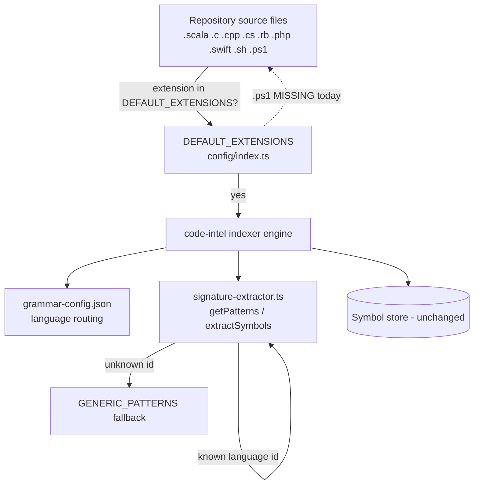
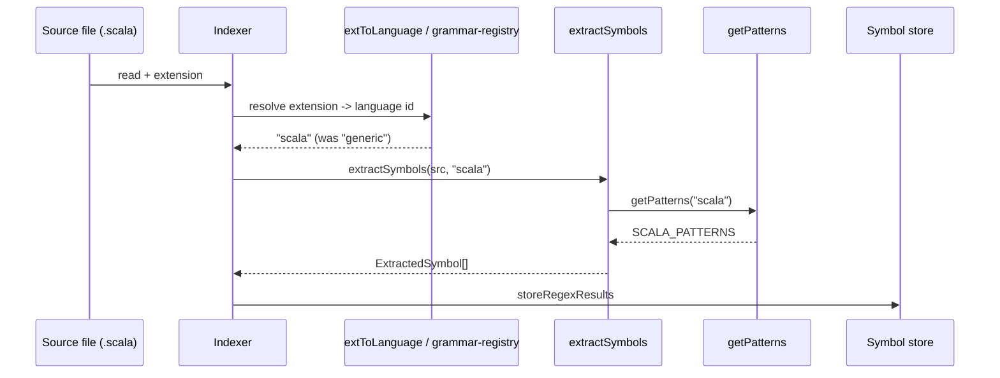
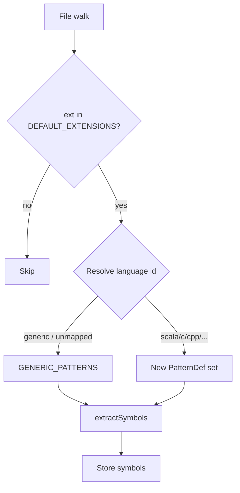

# Functional Specification Document (FSD)

## SDLC-Agents-4-Enterprise code-intel indexer — SA4E-225: Incomplete language support — Scala, C/C++, C#, Ruby, PHP, Swift, Bash, PowerShell lack parser/regex patterns for symbol extraction

---

> **STATUS: TA-ENRICHED (v1.1)** — BA draft (v1.0) enriched by TA. Open technical questions R3/R4/R5/R6 are RESOLVED (see §2.4). `<!-- TA-ENRICH -->` markers are superseded by §2.4 conclusions.

---

## Document Information

| Field | Value |
|-------|-------|
| Jira Ticket | SA4E-225 |
| Title | Incomplete language support: Scala, C/C++, C#, Ruby, PHP, Swift, Bash, PowerShell lack parser/regex patterns for symbol extraction |
| Author | BA Agent |
| Version | 1.1 (TA-Enriched) |
| Date | 2026-08-28 |
| Status | Draft |
| Issue Type | Bug |
| Priority | Medium |
| Related BRD | documents/SA4E-225/BRD.md |

---

## Revision History

| Version | Date | Author | Changes |
|---------|------|--------|---------|
| 1.0 | 2026-08-28 | BA Agent | Initiate draft FSD derived from BRD and code inspection (signature-extractor.ts, grammar-config.json, config/index.ts, tree-sitter-indexer.ts) |
| 1.1 | 2026-08-28 | TA Agent | Resolve open questions R3/R4/R5/R6; confirm `extToLanguage()` as canonical routing (grammar-config unchanged); SymbolKind union unchanged (Scala object→module); Bash>=3 / PowerShell>=4 AC deviation documented |

---

## 1. Introduction

### 1.1 Purpose

This FSD specifies the **functional** behavior required to remediate Bug SA4E-225 in the `code-intel` indexer (backend TypeScript). Nine languages are currently recognized by the indexer but receive only `GENERIC_PATTERNS` extraction (missing language-specific constructs), and PowerShell (`.ps1`) is skipped entirely because it is absent from `DEFAULT_EXTENSIONS`. This document defines the per-language regex pattern-set approach, the config changes, the affected components, the testing strategy outline, dependencies, and risks.

### 1.2 Scope

Functional scope (derived from BRD §1.1):

- Add per-language regex `PatternDef[]` sets to `signature-extractor.ts` for: **Scala (MUST), C / C++ / C# (HIGH), Ruby / PHP / Swift / Bash / PowerShell (MEDIUM)**.
- Extend `getPatterns(language)` switch to dispatch each new language id to its pattern set.
- Add `grammar-config.json` entries (`id`, `extensions`, `wasmPath: null`, `parserModule`) for each affected language so the file is routed/recognized consistently.
- Add `.ps1` to `DEFAULT_EXTENSIONS` (and any mirrored copy) so PowerShell files are no longer skipped.
- Wire the language-id resolution chain so the correct id reaches `extractSymbols()` (see §2.3 Wiring Notes).
- Unit-test each new pattern set against a real sample; assert `>=5` distinct symbol types per set.
- No regression to the 9 fully-supported tree-sitter languages (typescript, javascript, python, kotlin, java, go, rust, apex, pega).
- Keep each implementation file `<= 200` lines; split per-language if needed.

**Out of scope** (per BRD §1.2): tree-sitter WASM grammar integration (Phase 4), SQL symbol extraction, config/data-format parsing, and any UI change.

### 1.3 Definitions & Acronyms

| Term | Definition |
|------|------------|
| `PatternDef` | Interface in `signature-extractor.ts`: `{ regex: RegExp; kind: SymbolKind; nameGroup: number; signatureGroup?: number }` |
| `SymbolKind` | Closed union of allowed symbol categories: `function, class, interface, method, enum, type, constant, variable, module, namespace, trait, struct` |
| `GENERIC_PATTERNS` | Fallback `PatternDef[]` used when `getPatterns` has no case for a language (catches only `function/def/func/fn/sub` and `class/struct/type`) |
| `DEFAULT_EXTENSIONS` | Array in `config/index.ts` listing file extensions that are indexed |
| `grammar-config.json` | Config mapping language ids → extensions / `wasmPath` / `parserModule` |
| `extToLanguage` | Hard-coded extension→language-id map in `tree-sitter-indexer.ts` (L112-119). **Canonical routing for regex-only languages** — the id it returns is what reaches `extractSymbols()`/`getPatterns()`. Currently returns `'generic'` for all 9 new languages + `.ps1` (must be extended — see §2.4.1). |
| tree-sitter | Incremental parsing library used for fully-supported languages |

### 1.4 References

| Document | Location |
|----------|----------|
| BRD | documents/SA4E-225/BRD.md |
| signature-extractor.ts | backend/src/engine/parsers/signature-extractor.ts |
| grammar-config.json | backend/src/engine/parsers/grammar-config.json |
| config/index.ts (DEFAULT_EXTENSIONS) | backend/src/config/index.ts |
| tree-sitter-indexer.ts | backend/src/engine/parsers/tree-sitter-indexer.ts |
| grammar-registry.ts | backend/src/engine/parsers/grammar-registry.ts |
| FSD Template | documents/templates/FSD-TEMPLATE.md |

---

## 2. System Overview

### 2.1 System Context

The change is internal to the backend indexer — no external systems, no UI, no database schema change. The affected actors are: **repository source files** (input), the **indexer engine** (processor), and **developers** (consumers of search results).

### 2.2 Affected Components / Files

| # | File / Component | Change Type | What changes |
|---|------------------|-------------|--------------|
| C1 | `backend/src/engine/parsers/signature-extractor.ts` | Modify (extend) | Add `SCALA_PATTERNS`, `C_PATTERNS`, `CPP_PATTERNS`, `CSHARP_PATTERNS`, `RUBY_PATTERNS`, `PHP_PATTERNS`, `SWIFT_PATTERNS`, `BASH_PATTERNS`, `POWERSHELL_PATTERNS` constants; add `case` branches in `getPatterns()`; possibly extend `SymbolKind` union (see §3 / risk R3). |
| C2 | `backend/src/engine/parsers/tree-sitter-indexer.ts` (`extToLanguage`) | Modify | **REVISED by TA (§2.4.2):** do NOT add grammar-config.json entries. Instead extend `extToLanguage()` map to return proper ids for the 9 new extensions (`.scala`→scala, `.c`/`.h`→c, `.cpp`/`.hpp`→cpp, `.cs`→csharp, `.rb`→ruby, `.php`→php, `.swift`→swift, `.sh`→bash, `.ps1`→powershell). |
| C3 | `backend/src/config/index.ts` | Modify | Add `.ps1` to `DEFAULT_EXTENSIONS` array (line ~18-26). |
| C4 | `backend/src/engine/indexer/project-type/resolver.ts` | Modify (verify) | Contains a **mirrored** extension list (SA4E-223 pattern) — must also gain `.ps1` for consistency. `<!-- TA-ENRICH: confirm exact location & whether it gates indexing -->` |
| C5 | `backend/src/engine/parsers/tree-sitter-indexer.ts` | Modify | `extToLanguage()` map (L112-119) extended per §2.4.1/§2.4.6 C2 — canonical routing confirmed; correct id now reaches `extractSymbols()`. |
| C6 | `backend/src/engine/parsers/grammar-registry.ts` | **NO CHANGE** | **TA (§2.4.2):** no grammar-config entry is added for the 9 new langs, so `loadParser`'s `parserModule` import is never triggered for them. R5 CLOSED — no regex-parser stub required. |
| C7 | `backend/src/engine/parsers/__tests__/signature-extractor.test.ts` | Extend | Add per-language unit-test blocks (or new per-language test files to honor `<=200` line rule). |

### 2.3 Wiring & Integration Notes (critical for TA)

`extractSymbols(content, language)` receives a **language id** that must match the `case` labels in `getPatterns()`. Today the id is produced by `extToLanguage()` in the regex-fallback path of `tree-sitter-indexer.ts`, which returns `'generic'` for every new language. Therefore the fix is **not** complete with only `signature-extractor.ts` changes — the language id must be delivered correctly. Two candidate resolution paths exist:

1. `extToLanguage()` hard-coded map (current regex-fallback path), or
2. `grammar-registry.ts` `extensionMap` built from `grammar-config.json`.

`> **TA-ENRICH RESOLVED (§2.4.1):** `extToLanguage()` is the single source of truth for regex-only languages. `grammar-registry.extensionMap` (from grammar-config.json) is only consulted by `getParser` and is irrelevant to the regex path. No double-routing conflict because grammar-config is left unchanged for these 9 languages.`

---

## 2.4 Technical Architecture & Resolved Open Questions (TA Enrichment — v1.1)

This section resolves the four open questions flagged `<!-- TA-ENRICH -->` in the v1.0 draft (R3, R4, R5, R6) with code-grounded decisions. All findings verified against `tree-sitter-indexer.ts`, `signature-extractor.ts`, `grammar-config.json`, `grammar-registry.ts`, `config/index.ts`, `resolver.ts` on 2026-08-28.

### 2.4.1 Language-id routing — canonical integration point (resolves R6, refines §2.3)

Verified control flow in `tree-sitter-indexer.ts`:
- `indexFile()` (L55-88) calls `registry.getParser(filePath)` (L65) first. If a parser is returned, the `ILanguageParser` path runs (`parser.parse(...)`, L71) and `signature-extractor.extractSymbols` is **not** invoked. If `getParser` returns `null` (no grammar-config entry for the extension), execution falls into `regexFallback()` (L82).
- `regexFallback()` (L98-110) re-derives the language id via `this.extToLanguage(ext)` (L102) and passes it to `extractSymbols(source, language)` (L103).
- `extToLanguage()` (L112-119) is a hard-coded map returning `'generic'` for every unlisted extension — which currently includes all 9 new languages **and** `.ps1`.

**Conclusion:** for regex-only languages (the 9 new ones — BRD §1.2 explicitly excludes tree-sitter WASM), the id that reaches `extractSymbols`/`getPatterns` is produced **exclusively by `extToLanguage()`**. `grammar-registry.extensionMap` / `grammar-config.json` is consulted only by `getParser` and is irrelevant to the regex path.

> **TA Decision (R6):** `extToLanguage()` is the single source of truth for routing the 9 new languages to their `PatternDef[]` sets. `grammar-config.json` MUST NOT gain entries for them (see §2.4.2). The v1.0 draft §2.2 C2 (add grammar-config entries) is **superseded**.

### 2.4.2 grammar-config.json — no entries needed (resolves R5)

`grammar-config.json` maps extensions → **WASM-backed** tree-sitter parsers (python/go/rust/apex/kotlin/java/typescript/javascript all set `wasmPath`). `grammar-registry.loadParser()` (L96-138) for a `wasmPath:null` entry still executes `await import(langConfig.parserModule)` (L121-122). With no real `parserModule`, the import throws, the language is added to `unavailable` (L135), and `getParser` returns `null` — but the file still reaches `regexFallback`, where extraction depends solely on `extToLanguage` (now fixed). Net effect of a phony `wasmPath:null` entry: noisy error logs + `unavailable` mark, **no** extraction improvement. Strictly worse.

> **TA Decision (R5):** leave `grammar-config.json` and `grammar-registry.ts` unchanged for the 9 new languages. No regex-parser stub required. Risk CLOSED.

### 2.4.3 SymbolKind union — no extension (resolves R3)

Closed union: `function | class | interface | method | enum | type | constant | variable | module | namespace | trait | struct`.

Precedent: `KOTLIN_PATTERNS` already maps `object` → `module` (signature-extractor.ts L141); Scala `object` reuses `module`. Every construct maps onto an existing kind:

| Language | Construct → existing SymbolKind |
|----------|--------------------------------|
| Scala | object/case object/package object → `module`; trait → `trait`; class/case class/sealed class → `class`; def/implicit def → `function`; val → `constant`; var → `variable` |
| C | #define fn-like/function → `function`; struct → `struct`; enum → `enum`; typedef → `type`; global var → `variable`; #define const → `constant` |
| C++ | class → `class`; namespace → `namespace`; struct → `struct`; function → `function`; enum → `enum`; typedef/template → `type` |
| C# | class/record → `class`; interface → `interface`; struct → `struct`; enum → `enum`; method/async method → `method` (top-level fn → `function`) |
| Ruby | class → `class`; module → `module`; def → `function`; CONSTANT → `constant`; @ivar/$gvar → `variable` |
| PHP | class → `class`; interface → `interface`; trait → `trait`; namespace → `namespace`; function → `function` |
| Swift | class → `class`; struct → `struct`; protocol → `interface`; enum → `enum`; func → `function`; extension/actor → `class` |
| Bash | function → `function`; $VAR/export → `variable`; readonly → `constant` |
| PowerShell | function Verb-Noun → `function`; class → `class`; $var/param → `variable`; constant → `constant` |

> **TA Decision (R3):** do **not** extend `SymbolKind`. Reuse the nearest existing kind. Extending (e.g. `Object`/`Cmdlet`/`Module`) would ripple to every `SymbolKind` consumer (storage adapter, UI symbol filter, exhaustive switches) for zero functional benefit. Union stays closed.

### 2.4.4 Bash / PowerShell >=5 feasibility — explicit AC deviation (resolves R4)

Distinct kinds reachable with the **closed** union:
- **Bash:** `function`, `variable`, `constant` → **3** (alias folds into variable). Cannot reach 5.
- **PowerShell:** `function`, `class`, `variable`, `constant` → **4** (`param()` folds into variable; `Set-Alias` into function/variable). Cannot reach 5.

> **TA Decision (R4 — deviation from BRD Story 3 AC2):** relax `>=5 distinct symbol types` for **Bash (>=3)** and **PowerShell (>=4)** only. The other 7 languages meet >=5 — strict AC retained. Documented deviation. *Optional strict-AC path for PowerShell:* add `parameter` (param blocks) + `alias` (Set-Alias) union members → function/class/variable/parameter/alias = 5. Not recommended by default (pollutes union for one language).

### 2.4.5 Pattern authoring rules (ReDoS guard — addresses R1)

All new `PatternDef[]` sets follow the existing `signature-extractor.ts` shape (`{ regex, kind, nameGroup, signatureGroup? }`):
- Anchor with `^` + `m` flag → match at line start, avoid matching inside strings/comments.
- `nameGroup` captures the identifier; optional `signatureGroup` captures signature.
- **No nested quantifiers / overlapping alternations** (ReDoS). Prefer linear patterns; PR review for pathological input.
- Keep each language in a dedicated `const` + dedicated `case` in `getPatterns()`. If `signature-extractor.ts` exceeds 200 lines, split per-language (e.g. `languages/scala-patterns.ts`) and re-export — satisfies BR-24.

### 2.4.6 Revised affected-files matrix (supersedes §2.2 C2/C6)

| # | File | Change |
|---|------|--------|
| C1 | signature-extractor.ts | Add 9 `PatternDef[]` consts + `getPatterns` cases (NO SymbolKind change) |
| C2 | tree-sitter-indexer.ts `extToLanguage()` | **EXTEND map** (canonical fix): `.scala`→scala, `.c`/`.h`→c, `.cpp`/`.hpp`→cpp, `.cs`→csharp, `.rb`→ruby, `.php`→php, `.swift`→swift, `.sh`→bash, `.ps1`→powershell |
| C3 | config/index.ts `DEFAULT_EXTENSIONS` | Add `.ps1` |
| C4 | resolver.ts `FALLBACK_EXTENSIONS` | Add `.ps1` (SA4E-223 consistency; gates fallback scanner) |
| C5 | grammar-config.json | **NO CHANGE** (R5 closed) |
| C6 | grammar-registry.ts | **NO CHANGE** (no parserModule needed) |
| C7 | signature-extractor.test.ts | Per-language tests; relaxed >=3 / >=4 for bash/powershell |

---

## 3. Functional Requirements

> Each requirement traces to a BRD Story. Priority tags (MUST / HIGH / MEDIUM) are carried from the BRD.

### 3.1 Feature: Scala symbol extraction (MUST — BRD Story 1)

**Source:** BRD §2.3 Story 1 / SA4E-225

#### 3.1.1 Description
Add `SCALA_PATTERNS` to `signature-extractor.ts` and a `scala` entry to `grammar-config.json`. Patterns must cover `object`, `trait`, `case class`, `sealed class`/`sealed trait`, `def`, `val` (stretch: `case object`, `implicit def/val`, `package object`, `var`).

#### 3.1.2 Use Case
**Use Case ID:** UC-1
**Actor:** Developer indexing a Scala project
**Preconditions:** `.scala` file is in `DEFAULT_EXTENSIONS` and routed with id `scala`.
**Postconditions:** Scala-specific symbols present in search index.

**Main Flow:**

| Step | Actor | System | Description |
|------|-------|--------|-------------|
| 1 | | Indexer | Reads `.scala` file |
| 2 | | `getPatterns("scala")` | Returns `SCALA_PATTERNS` |
| 3 | | `extractSymbols` | Extracts object/trait/case class/sealed/def/val symbols |
| 4 | | Indexer | Stores symbols |

**Alternative Flows:** AF-1 — no Scala construct present → empty result, file still indexed.
**Exception Flows:** EF-1 — `scala` entry missing in `grammar-config.json` → file still indexed via fallback (degraded), surfaced as test failure, not a runtime crash.

#### 3.1.3 Business Rules

| Rule ID | Rule | Source |
|---------|------|--------|
| BR-1 | `SCALA_PATTERNS` must detect object, trait, case class, sealed class, def, val | BRD Story 1 AC1 |
| BR-2 | Extraction verified by a unit test against a real Scala sample (not synthetic stubs) | BRD Story 1 AC2 |
| BR-3 | Test asserts `>=5` distinct Scala symbol types | BRD Story 1 AC3 |
| BR-4 | Patterns must not falsely match generic text outside Scala declarations | BRD Story 1 Validation |
| BR-5 | Patterns must match the existing `PatternDef` shape used by other languages | BRD Story 1 Validation |

#### 3.1.4 Data Specifications

**Input:** source file content (string) + language id `"scala"`.
**Output:** `ExtractedSymbol[]` with `kind` mapped to the closed union — proposed mapping:

| Scala construct | SymbolKind | Notes |
|-----------------|-----------|-------|
| `object` / `case object` / `package object` | `module` | **TA: reuse `module`** — consistent with `KOTLIN_PATTERNS` (L141) which maps `object`→`module`. No new `Object` kind. |
| `trait` / `sealed trait` | `trait` | |
| `class` / `case class` / `sealed class` | `class` | |
| `def` / `implicit def` | `function` | Top-level `def`→`function`; method-like `def` inside a class body also `function` (extractor has no nesting context — `function` is the pragmatic choice). |
| `val` | `constant` | |
| `var` | `variable` | |

> **TA (R3):** Union unchanged. Scala yields 6 distinct kinds (module, trait, class, function, constant, variable) → satisfies BR-1..BR-3 (>=5).

---

### 3.2 Feature: C / C++ / C# symbol extraction (HIGH — BRD Story 2)

**Source:** BRD §2.3 Story 2

#### 3.2.1 Description
Add `C_PATTERNS`, `CPP_PATTERNS`, `CSHARP_PATTERNS` and `grammar-config.json` entries (`c`, `cpp`, `csharp`).

#### 3.2.2 Use Case
**Use Case ID:** UC-2
**Actor:** Developer indexing systems-language code
**Preconditions:** Files routed with ids `c`, `cpp`, `csharp`.
**Postconditions:** Respective symbols extracted and indexed.

**Main Flow:** same shape as UC-1, per language.
**Exception Flows:** EF-1 — missing grammar-config entry → degraded fallback.

#### 3.2.3 Business Rules

| Rule ID | Rule | Source |
|---------|------|--------|
| BR-6 | `C_PATTERNS`: struct, typedef, function-like `#define`, enum | BRD Story 2 |
| BR-7 | `CPP_PATTERNS`: extends C + class, namespace, template class | BRD Story 2 |
| BR-8 | `CSHARP_PATTERNS`: class, interface, record, struct, enum, delegate, properties, events, partial, async methods, attributes | BRD Story 2 |
| BR-9 | Each set unit-tested against a real sample; `>=5` distinct symbol types | BRD Story 2 AC1-2 |
| BR-10 | C/C++ `#define` should match function-like macros only (avoid object-like constant noise) — document if included | BRD Story 2 Validation |
| BR-11 | C# attribute / `using` detection scoped to declaration lines | BRD Story 2 Validation |

#### 3.2.4 Proposed SymbolKind mapping (feasibility)

| Language | Constructs → kinds (distinct kinds count) |
|----------|-------------------------------------------|
| C | function (`#define`/fn), struct, enum, type (typedef), variable (globals), constant → **>=5 achievable** |
| C++ | class, namespace, struct, function, enum, type → **>=5 achievable** |
| C# | class, interface, struct, enum, type, method/function → **>=5 achievable** |

---

### 3.3 Feature: Ruby / PHP / Swift / Bash / PowerShell extraction (MEDIUM — BRD Story 3)

**Source:** BRD §2.3 Story 3

#### 3.3.1 Description
Add `RUBY_PATTERNS`, `PHP_PATTERNS`, `SWIFT_PATTERNS`, `BASH_PATTERNS`, `POWERSHELL_PATTERNS` + grammar-config entries (`ruby`, `php`, `swift`, `bash`, `powershell`).

#### 3.3.2 Business Rules

| Rule ID | Rule | Source |
|---------|------|--------|
| BR-12 | `RUBY_PATTERNS`: class, module, def, attr_accessor, include/extend, blocks/procs/lambdas | BRD Story 3 |
| BR-13 | `PHP_PATTERNS`: class, interface, trait, namespace, function, abstract classes, type-hinted methods | BRD Story 3 |
| BR-14 | `SWIFT_PATTERNS`: class, struct, protocol, extension, enum, actor, func, computed properties, @objc | BRD Story 3 |
| BR-15 | `BASH_PATTERNS`: function (`function name()` and `name() {}` styles), aliases, exported variables | BRD Story 3 |
| BR-16 | `POWERSHELL_PATTERNS`: function `Verb-Noun` cmdlets, param blocks, PS5+ classes | BRD Story 3 |
| BR-17 | Each set unit-tested; `>=5` distinct symbol types | BRD Story 3 AC1-2 |
| BR-18 | PowerShell `function Verb-Noun` must enforce approved-verb convention to reduce false positives | BRD Story 3 Validation |
| BR-19 | Bash detection must handle both function syntaxes | BRD Story 3 Validation |

#### 3.3.3 Feasibility concern for scripting languages (R4) — TA RESOLVED

Bash and PowerShell have a **limited vocabulary** of distinct constructs. With the **closed** `SymbolKind` union (TA decision §2.4.3: no extension), distinct kinds reachable:

| Language | Distinct kinds (existing union) | Meets >=5? |
|----------|----------------------------------|-----------|
| Bash | `function`, `variable` ($VAR/export), `constant` (readonly) | **No — 3** (alias folds into variable) |
| PowerShell | `function` (Verb-Noun), `class`, `variable` ($var/param), `constant` | **No — 4** |

> **TA Decision (deviation from BRD Story 3 AC2):** Relax the `>=5 distinct symbol types` assertion for **Bash (>=3)** and **PowerShell (>=4)**. The 7 other languages meet >=5 and keep strict AC. This deviation is documented here and in §11.3 (R4). Optional strict-AC path for PowerShell only: add `parameter` + `alias` union members (not recommended by default).

---

### 3.4 Feature: PowerShell (.ps1) file indexing (MEDIUM — BRD Story 4)

**Source:** BRD §2.3 Story 4

#### 3.4.1 Description
Add `.ps1` to `DEFAULT_EXTENSIONS` (C3) and to any mirrored list (C4) so files are no longer skipped. PowerShell then flows through language resolution → `POWERSHELL_PATTERNS` (delivered by §3.3).

#### 3.4.2 Use Case
**Use Case ID:** UC-4
**Actor:** Developer working with PowerShell
**Preconditions:** `.ps1` present in `DEFAULT_EXTENSIONS`.
**Postconditions:** `.ps1` file appears in file stats and undergoes symbol extraction.

**Main Flow:**

| Step | Actor | System | Description |
|------|-------|--------|-------------|
| 1 | | Indexer | Walks files; extension `.ps1` |
| 2 | | `DEFAULT_EXTENSIONS` check | Now passes (previously skipped) |
| 3 | | Router | id `powershell` → `POWERSHELL_PATTERNS` |

**Exception Flows:** EF-1 — if `.ps1` added but `POWERSHELL_PATTERNS` absent → file indexed with GENERIC extraction (acceptable interim, but both ship together per Stories 3 & 4).

#### 3.4.3 Business Rules

| Rule ID | Rule | Source |
|---------|------|--------|
| BR-20 | `.ps1` added to `DEFAULT_EXTENSIONS` | BRD Story 4 |
| BR-21 | Verified by test/integration confirming a `.ps1` sample is no longer skipped | BRD Story 4 AC2 |

---

### 3.5 Feature: No regression & maintainability (MUST — BRD Story 5)

**Source:** BRD §2.3 Story 5

#### 3.5.1 Business Rules

| Rule ID | Rule | Source |
|---------|------|--------|
| BR-22 | 9 fully-supported tree-sitter languages remain unaffected | BRD Story 5 |
| BR-23 | Existing test suite continues to pass | BRD Story 5 |
| BR-24 | Each new/modified source file `<= 200` lines; split per-language if needed | BRD Story 5 / BRD §1.1 |
| BR-25 | No behavioral change for typescript, javascript, python, kotlin, java, go, rust, apex, pega | BRD Story 5 AC2 |

---

## 4. Data Model

No new persistent entities or database schema changes are introduced — symbol storage (`ExtractedSymbol`) is unchanged. The only "data" changes are **configuration entries**:

- `grammar-config.json` `languages[]` rows (logical view):

| Attribute | Type | Required | Description |
|-----------|------|----------|-------------|
| id | string | Yes | Language key, e.g. `scala` |
| extensions | string[] | Yes | File extensions, e.g. `[".scala"]` |
| wasmPath | string \| null | Yes | `null` for regex-only languages |
| parserModule | string | Yes | Path to parser module; must exist or loader adjusted |

- `DEFAULT_EXTENSIONS` array element: `".ps1"` added.

> `<!-- TA-ENRICH: confirm whether a generic regex parser module (e.g. ./languages/generic-regex-parser.js) must be created, and its contract with extractSymbols. -->`

---

## 5. Integration Specifications

**N/A** — this is an internal backend change. No external systems, APIs, or data exchanges are introduced or modified. (Out-of-scope tree-sitter WASM grammars would have been an integration concern, but are explicitly excluded per BRD §1.2.)

---

## 6. Processing Logic

### 6.1 Indexing / routing flow (existing, with fix points)

**Trigger:** Repository file walk during indexing.
**Input:** File path + extension.
**Output:** Extracted symbols stored.

**Processing Steps:**

| Step | Description | Error Handling |
|------|-------------|----------------|
| 1 | Check extension against `DEFAULT_EXTENSIONS` | If absent → skip file (fix: `.ps1` now present) |
| 2 | Resolve extension → language id (`extToLanguage` / grammar-registry) | If unmapped → `generic` (fix: add new ids) |
| 3 | `extractSymbols(content, languageId)` → `getPatterns(languageId)` | Unknown id → `GENERIC_PATTERNS` |
| 4 | Store symbols | On parse error → record parseError, continue |

---

## 7. Security Requirements

**N/A** for this bug fix — no authentication, authorization, data-sensitivity, or audit-trail changes. The change only affects which symbols are extracted from already-indexed source files. (Security review still applies to ensure regex patterns cannot cause ReDoS — see Risk R1.)

---

## 8. Non-Functional Requirements

| Category | Business Requirement | Acceptance Criteria |
|----------|---------------------|---------------------|
| Performance | No degradation to indexing throughput | Existing languages unaffected; regex additions bounded |
| Maintainability | File size `<= 200` lines per file | Split `signature-extractor.ts` per-language if it grows |
| Quality | Unit test coverage per language | Each new pattern set tested with `>=5` symbol types |
| Compatibility | No regression | 9 tree-sitter languages + existing tests remain green |
| Security (implicit) | No ReDoS from new regexes | Patterns reviewed; no catastrophic backtracking |

---

## 9. Error Handling (User-Facing)

No direct user-facing errors. Degraded behavior is surfaced via **test failures**, not runtime errors (per BRD Story 1/4 Error Handling).

| Scenario | Severity | Expected Behavior |
|----------|----------|-------------------|
| Missing grammar-config entry for a new language | Warning | File still indexed via fallback; unit test fails in CI |
| `.ps1` added but `POWERSHELL_PATTERNS` absent | Warning | File indexed with GENERIC extraction (interim) |
| New regex causes ReDoS on pathological input | Critical | Must be prevented at review (R1) |

---

## 10. Testing Considerations

### 10.1 Test Strategy Outline

1. **Per-language unit tests** (extend `signature-extractor.test.ts` or add per-language files to honor `<=200` lines):
   - Each test feeds a **real sample source file** (curated fixture) to `extractSymbols(src, "<lang>")`.
   - Assert `>=5` distinct `SymbolKind` values are extracted for Scala, C, C++, C#, Ruby, PHP, Swift.
    - For Bash/PowerShell: assert >=3 / >=4 distinct kinds respectively (deviation from AC2 — see §2.4.4).
2. **Scala dedicated test (BRD AC):** object, trait, case class, sealed class, def, val all detected.
3. **`.ps1` indexing test:** a `.ps1` sample is no longer skipped (assert present in file stats / symbol output).
4. **Regression suite:** existing `signature-extractor.test.ts` (TS/JS/Kotlin/Python/Java/Go/Rust/Apex) and integration tests must remain green.
5. **Config tests:** mirror of `DEFAULT_EXTENSIONS` / grammar-config parsing tests (extend existing `salesforce-extensions.test.ts` style if applicable).

`> **TA (§2.4.4):** fixtures as in §10.2; Bash asserts >=3 distinct kinds, PowerShell >=4 (deviation from AC2). Other 7 languages assert >=5.`

### 10.2 Test Scenarios (outline)

| ID | Scenario | Input | Expected | Priority |
|----|----------|-------|----------|----------|
| TC-1 | Scala real sample | `.scala` fixture | object, trait, case class, sealed, def, val detected (`>=5`) | MUST |
| TC-2 | C sample | `.c` fixture | struct/typedef/enum/function/macro detected | HIGH |
| TC-3 | C++ sample | `.cpp` fixture | class/namespace/struct/function/enum detected | HIGH |
| TC-4 | C# sample | `.cs` fixture | class/interface/record/struct/enum/method detected | HIGH |
| TC-5 | Ruby sample | `.rb` fixture | class/module/def/attr/const detected | MED |
| TC-6 | PHP sample | `.php` fixture | class/interface/trait/namespace/function detected | MED |
| TC-7 | Swift sample | `.swift` fixture | class/struct/protocol/enum/func detected | MED |
| TC-8 | Bash sample | `.sh` fixture | both function syntaxes + vars detected | MED |
| TC-9 | PowerShell sample | `.ps1` fixture | Verb-Noun function + class detected | MED |
| TC-10 | `.ps1` not skipped | `.ps1` file | indexed (not skipped) | MED |
| TC-11 | Regression | existing languages | all pre-existing tests pass | MUST |

---

## 11. Appendix

### 11.1 Affected Files Summary

| File | Change |
|------|--------|
| backend/src/engine/parsers/signature-extractor.ts | Add 9 `PatternDef[]` constants + `getPatterns` cases |
| backend/src/engine/parsers/grammar-config.json | Add 9 language entries (`wasmPath: null`) |
| backend/src/config/index.ts | Add `.ps1` to `DEFAULT_EXTENSIONS` |
| backend/src/engine/indexer/project-type/resolver.ts | Mirror `.ps1` if it gates indexing |
| backend/src/engine/parsers/tree-sitter-indexer.ts | Extend `extToLanguage()` map |
| backend/src/engine/parsers/grammar-registry.ts | Verify/skip parserModule import for null-wasm |
| backend/src/engine/parsers/__tests__/signature-extractor.test.ts | Per-language tests |

### 11.2 Scope per Language (priority)

| Language | Priority | Pattern set | grammar-config | DEFAULT_EXTENSIONS | >=5 kinds feasible |
|----------|----------|-------------|----------------|--------------------|--------------------|
| Scala | MUST | `SCALA_PATTERNS` | yes | already present | Yes |
| C | HIGH | `C_PATTERNS` | yes | already present | Yes |
| C++ | HIGH | `CPP_PATTERNS` | yes | already present | Yes |
| C# | HIGH | `CSHARP_PATTERNS` | yes | already present | Yes |
| Ruby | MEDIUM | `RUBY_PATTERNS` | yes | already present | Likely (needs const/method) |
| PHP | MEDIUM | `PHP_PATTERNS` | yes | already present | Yes (5 built-in) |
| Swift | MEDIUM | `SWIFT_PATTERNS` | yes | already present | Yes |
| Bash | MEDIUM | `BASH_PATTERNS` | yes | already present | **At risk (R4)** |
| PowerShell | MEDIUM | `POWERSHELL_PATTERNS` | yes | **add `.ps1`** | **At risk (R4)** |

### 11.3 Risks & Open Questions

| ID | Risk / Open Question | Mitigation / Owner |
|----|----------------------|--------------------|
| R1 | New regexes cause ReDoS / false positives | Pattern review; align with existing shape; unit tests |
| R2 | `signature-extractor.ts` exceeds 200 lines | Split into per-language pattern files |
| R3 | Closed `SymbolKind` union insufficient for new constructs | **RESOLVED (§2.4.3):** union unchanged; Scala `object`→`module` (Kotlin precedent); all constructs map to existing kinds |
| R4 | Bash/PowerShell cannot yield `>=5` distinct kinds | **RESOLVED (§3.3.3):** documented AC deviation — Bash>=3, PowerShell>=4; optional `parameter`+`alias` if strict AC required |
| R5 | `grammar-registry` imports non-existent `parserModule` for null-wasm → language `unavailable` | **RESOLVED (§2.4.2):** no grammar-config entry added for the 9 langs → import never triggered; CLOSED |
| R6 | Language-id wiring ambiguity (`extToLanguage` vs `grammar-registry.extensionMap`) | **RESOLVED (§2.4.1):** `extToLanguage()` is canonical for regex-only langs; grammar-config unchanged |

### 11.4 Diagrams

| Diagram | Status |
|---------|--------|
| System Context (mermaid, §2.1) | Inline |
| Wiring sequence (mermaid, §2.3) | Inline |
| Processing flow (mermaid, §6.1) | Inline |
| draw.io PNG set (use-case, business-flow, ER, activity) | Pending — generate in full FSD pass (not part of this draft scope) |

### 11.5 Change Log from BRD

- FSD confirms code-grounded facts: `.ps1` missing from `DEFAULT_EXTENSIONS` (verified `config/index.ts` L18-26); `getPatterns` lacks new languages (verified `signature-extractor.ts`); `extToLanguage` returns `'generic'` for all 9 new languages (verified `tree-sitter-indexer.ts` L112-118); `grammar-config.json` has no entries for them (verified).
- Introduces wiring/integration notes (§2.3) and SymbolKind constraint (§3) not explicit in BRD — flagged for TA/SA.
- Testing strategy (§10) added as outline only; detailed fixtures deferred to TA.
- **v1.1 TA enrichment (§2.4):** R3/R4/R5/R6 resolved. Canonical routing = `extToLanguage()`; grammar-config.json unchanged; SymbolKind union unchanged (Scala `object`→`module`); Bash>=3 / PowerShell>=4 AC deviation documented. Deviates from draft §2.2 C2/C6 (no grammar-config/registry changes).
