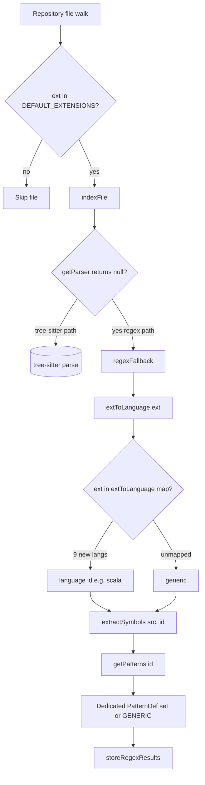
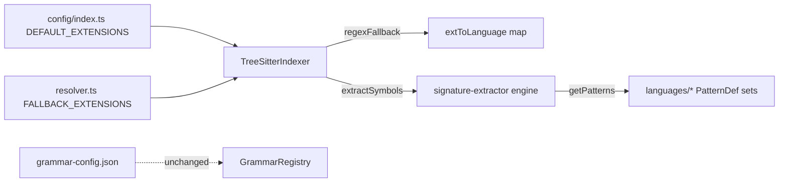
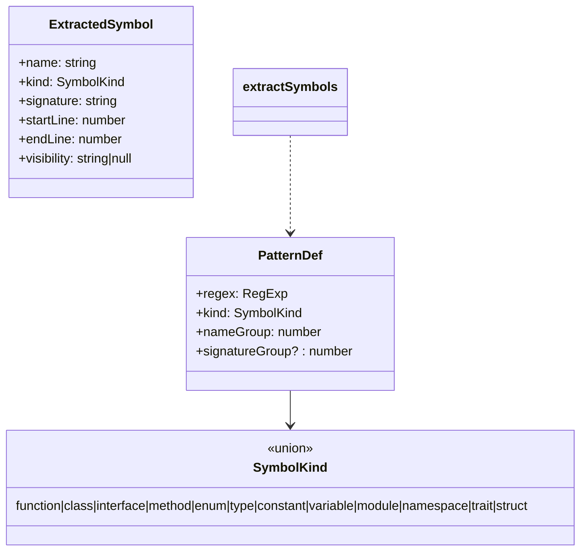

# Technical Design Document (TDD)

## SDLC-Agents-4-Enterprise code-intel indexer — SA4E-225: Incomplete language support — Scala, C/C++, C#, Ruby, PHP, Swift, Bash, PowerShell lack parser/regex patterns for symbol extraction

---

## Document Information

| Field | Value |
|-------|-------|
| Jira Ticket | SA4E-225 |
| Title | Incomplete language support: Scala, C/C++, C#, Ruby, PHP, Swift, Bash, PowerShell lack parser/regex patterns for symbol extraction |
| Author | SA Agent |
| Version | 1.0 |
| Date | 2026-08-28 |
| Status | Draft |
| Related BRD | documents/SA4E-225/BRD.md (v1.0) |
| Related FSD | documents/SA4E-225/FSD.md (v1.1 — TA-Enriched) |

---

## Author Tracking

| Role | Name - Position | Responsibility |
|------|-----------------|----------------|
| Author | SA Agent – Solution Architect | Create document |
| Peer Reviewer | To be assigned – Tech Lead / DEV | Review document |

---

## Revision History

| Version | Date | Author | Changes |
|---------|------|--------|---------|
| 1.0 | 2026-08-28 | SA Agent | Initial TDD derived from BRD v1.0 + FSD v1.1 (TA-enriched) and source inspection |

---

## Sign-Off

| Name | Signature and date |
|------|--------------------|
| | ☐ I agree and confirm the technical design in this TDD |
| | ☐ I agree and confirm the technical design in this TDD |

---

## 1. Introduction

> **Scope Boundary:** This TDD specifies HOW to implement the requirements defined in the FSD. It does NOT repeat functional requirements, business rules, or use cases — refer to the FSD for those. This document focuses on: concrete code-change locations, the exact `getPatterns()` / `extToLanguage()` edits, per-language regex designs, the file-split strategy, the test plan mapping to acceptance criteria, and risks/mitigations.

### 1.1 Purpose

Remediate Bug SA4E-225 by enabling regex-based symbol extraction for 9 languages (Scala, C, C++, C#, Ruby, PHP, Swift, Bash, PowerShell) that are currently recognized by the indexer but routed to `GENERIC_PATTERNS` only, and by un-skipping PowerShell (`.ps1`) which is absent from `DEFAULT_EXTENSIONS`. The change is **internal to the backend indexer** — no API, database, or external-system change.

### 1.2 Scope (Technical)

| In Scope | Out of Scope |
|----------|--------------|
| Extend `extToLanguage()` map (tree-sitter-indexer.ts) with 9 extension→id entries | Tree-sitter WASM grammar integration (FSD §1.2) |
| Add 9 `PatternDef[]` constants + `getPatterns()` cases (signature-extractor.ts) | `grammar-config.json` / `grammar-registry.ts` edits (TA R5: none) |
| Add `.ps1` to `DEFAULT_EXTENSIONS` (config/index.ts) | SymbolKind union extension (TA R3: union stays closed) |
| Add `.ps1` to `FALLBACK_EXTENSIONS` (resolver.ts) | SQL symbol extraction, config/data-format parsing |
| Split `signature-extractor.ts` into per-language files if >200 lines | UI change |
| Per-language unit tests (signature-extractor.test.ts) | — |

### 1.3 Technology Stack

| Layer | Technology | Version |
|-------|-----------|---------|
| Language | TypeScript | (backend, ESM `.js` imports) |
| Test Framework | vitest | (existing `backend/tests`/ `__tests__`) |
| Regex Engine | Built-in `RegExp` (multiline `gm`, re-applied in `extractWithPattern`) | Node.js |
| Build/Run | tsx / npm | — |

### 1.4 Design Principles

- **Reuse over invent** — map every construct onto the existing closed `SymbolKind` union (TA R3); reuse `KOTLIN_PATTERNS` `object→module` precedent.
- **Canonical routing** — `extToLanguage()` is the single source of truth for regex-only languages (TA R6); `grammar-config.json` left unchanged (TA R5).
- **ReDoS-safe** — anchor with `^`, `m` flag (forced), linear patterns, no nested quantifiers / overlapping alternations.
- **Maintainability** — keep each source file `<= 200` lines (BR-24); split per-language.
- **No regression** — 9 tree-sitter languages (typescript, javascript, python, kotlin, java, go, rust, apex, pega) untouched.

### 1.5 Constraints

- `extractSymbols` invokes `new RegExp(pattern.regex, 'gm')` (signature-extractor.ts L47). Therefore pattern literals **must not rely on their own flags** (the `gm` flags are re-applied); write them as `/…/m` for consistency. The `^` anchor matches line starts under the `m` flag.
- `nameGroup` is a 1-based capture-group index; `signatureGroup?` optional.
- File-size rule: any new/modified file `<= 200` lines (BR-24).
- `grammar-config.json` must NOT gain entries for the 9 languages (would trigger `loadParser` import of a non-existent `parserModule` → noisy `unavailable` + no extraction gain).

### 1.6 References

| Document | Location |
|----------|----------|
| BRD | documents/SA4E-225/BRD.md |
| FSD | documents/SA4E-225/FSD.md |
| signature-extractor.ts | backend/src/engine/parsers/signature-extractor.ts |
| tree-sitter-indexer.ts | backend/src/engine/parsers/tree-sitter-indexer.ts |
| config/index.ts | backend/src/config/index.ts |
| resolver.ts | backend/src/engine/indexer/project-type/resolver.ts |
| grammar-config.json | backend/src/engine/parsers/grammar-config.json |

---

## 2. System Architecture

### 2.1 Architecture Overview

The fix is a pure routing + pattern-addition change inside the existing regex-fallback path. The 9 new languages already pass the `DEFAULT_EXTENSIONS` gate (except `.ps1`); they currently collapse to `generic` because `extToLanguage()` has no entry and `getPatterns()` has no case. After the change, the correct language id reaches `getPatterns()`, which returns a dedicated `PatternDef[]`.



### 2.2 Component Diagram



| Component | Responsibility | Technology |
|-----------|---------------|------------|
| `TreeSitterIndexer.extToLanguage()` | Map file extension → language id (canonical for regex path) | TypeScript |
| `signature-extractor.ts` (engine) | `extractSymbols()` / `getPatterns()` / match engine | TypeScript |
| `languages/*.ts` | Per-language `PatternDef[]` constant sets | TypeScript |
| `config/index.ts` `DEFAULT_EXTENSIONS` | Gate which extensions are indexed | TypeScript |
| `resolver.ts` `FALLBACK_EXTENSIONS` | Fallback scanner extension gate | TypeScript |

### 2.3 Deployment Architecture

N/A — no deployment topology change. The indexer runs as a backend process; config arrays are in-code constants.

### 2.4 Communication Patterns

N/A — internal in-process function calls only (`indexFile → regexFallback → extToLanguage → extractSymbols → getPatterns → storeRegexResults`).

---

## 3. API Design

**N/A.** This ticket adds no HTTP/REST endpoints. Symbol extraction is invoked in-process by `TreeSitterIndexer`. (If an API is later added to expose symbols, it is out of scope.)

---

## 4. Database Design

**N/A.** No schema change. `ExtractedSymbol` storage (`storeRegexResults` → `DatabaseAdapter`) is unchanged.

---

## 5. Class / Module Design

### 5.1 Package / File Structure (Target)

```
backend/src/engine/parsers/
├── signature-extractor.ts        # ENGINE ONLY after refactor (~115 lines)
├── tree-sitter-indexer.ts        # extToLanguage() extended
├── __tests__/signature-extractor.test.ts
└── languages/                    # NEW — per-language pattern sets
    ├── types.ts                  # re-export PatternDef, SymbolKind (optional)
    ├── scala.ts        → SCALA_PATTERNS
    ├── c.ts            → C_PATTERNS
    ├── cpp.ts          → CPP_PATTERNS
    ├── csharp.ts       → CSHARP_PATTERNS
    ├── ruby.ts         → RUBY_PATTERNS
    ├── php.ts          → PHP_PATTERNS
    ├── swift.ts        → SWIFT_PATTERNS
    ├── bash.ts         → BASH_PATTERNS
    ├── powershell.ts   → POWERSHELL_PATTERNS
    ├── builtin.ts      # existing 7 consts relocated here (keep proven)
    └── index.ts        # barrel: LANGUAGE_PATTERNS map + re-exports
```

> **Why a `languages/` module:** signature-extractor.ts is currently 183 lines. Adding 9 pattern consts inline (~63 lines) + 9 import lines + 9 `getPatterns` cases pushes it to ~201 lines, violating BR-24 (`<= 200`). Relocating ALL `PatternDef[]` consts (the 9 new + 7 existing) into `languages/` leaves `signature-extractor.ts` as a pure engine (~115 lines), guaranteeing compliance and improving reviewability (R2). Pure relocation is low-risk and covered by the regression suite (TC-11).

### 5.2 Key Interfaces (unchanged shape)

```typescript
// signature-extractor.ts — UNCHANGED interface contract
export type SymbolKind =
  | 'function' | 'class' | 'interface' | 'method'
  | 'enum' | 'type' | 'constant' | 'variable'
  | 'module' | 'namespace' | 'trait' | 'struct';

interface PatternDef {
  regex: RegExp;
  kind: SymbolKind;
  nameGroup: number;
  signatureGroup?: number;
}

export function extractSymbols(content: string, language: string): ExtractedSymbol[];
```



### 5.3 `getPatterns()` — exact switch additions

After refactor, `getPatterns()` becomes a lookup over a `LANGUAGE_PATTERNS` map (imported from `languages/index.ts`); the 9 new cases are:

```typescript
// in languages/index.ts
export const LANGUAGE_PATTERNS: Record<string, PatternDef[]> = {
  // existing (relocated from signature-extractor.ts)
  typescript: TS_PATTERNS, javascript: TS_PATTERNS,
  kotlin: KOTLIN_PATTERNS, python: PYTHON_PATTERNS,
  java: JAVA_PATTERNS, go: GO_PATTERNS, rust: RUST_PATTERNS, apex: APEX_PATTERNS,
  // ── NEW (SA4E-225) ──
  scala: SCALA_PATTERNS,
  c: C_PATTERNS,
  cpp: CPP_PATTERNS,
  csharp: CSHARP_PATTERNS,
  ruby: RUBY_PATTERNS,
  php: PHP_PATTERNS,
  swift: SWIFT_PATTERNS,
  bash: BASH_PATTERNS,
  powershell: POWERSHELL_PATTERNS,
};
```

```typescript
// signature-extractor.ts (engine)
function getPatterns(language: string): PatternDef[] {
  return LANGUAGE_PATTERNS[language] ?? GENERIC_PATTERNS;
}
```

> If the team prefers to keep the existing 7 consts inline (minimal churn), `getPatterns` stays a `switch` and simply gains the 9 `case` branches — functionally identical. The map form is recommended because it pairs naturally with the `languages/` split and avoids one more switch to maintain.

### 5.4 `extToLanguage()` — exact map additions

In `tree-sitter-indexer.ts` (L112-119), extend the `map` object (canonical routing per TA R6):

```typescript
private extToLanguage(ext: string): string {
  const map: Record<string, string> = {
    '.ts': 'typescript', '.tsx': 'typescript', '.js': 'javascript', '.jsx': 'javascript',
    '.py': 'python', '.kt': 'kotlin', '.kts': 'kotlin', '.java': 'java', '.go': 'go', '.rs': 'rust',
    '.cls': 'apex', '.trigger': 'apex',
    // ── NEW (SA4E-225) ──
    '.scala': 'scala',
    '.c': 'c', '.h': 'c',
    '.cpp': 'cpp', '.hpp': 'cpp',
    '.cs': 'csharp',
    '.rb': 'ruby',
    '.php': 'php',
    '.swift': 'swift',
    '.sh': 'bash',
    '.ps1': 'powershell',
  };
  return map[ext] ?? 'generic';
}
```

> **Note on `.h`/`.hpp`:** `.h`→`c` and `.hpp`→`cpp` per FSD/BRD. A C++-content `.h` file will therefore be parsed with `C_PATTERNS` (not `CPP_PATTERNS`). This is an accepted approximation (documented as a known limitation in §10.4); refining header language detection is out of scope.

### 5.5 `DEFAULT_EXTENSIONS` (config/index.ts)

Add `'.ps1'` (the only missing one of the 9). All others (`.scala .c .cpp .h .hpp .cs .rb .php .swift .sh`) are already present (config/index.ts L18-22).

```typescript
const DEFAULT_EXTENSIONS = [
  '.ts', '.tsx', '.js', '.jsx', '.kt', '.java', '.py',
  '.go', '.rs', '.c', '.cpp', '.h', '.hpp', '.cs',
  '.rb', '.php', '.swift', '.scala', '.sql', '.sh',
  '.yaml', '.yml', '.json', '.toml', '.gradle.kts',
  '.cls', '.trigger', '.pega',
  // ---- SA4E-223 ----
  '.apex', '.soql', '.page', '.component', '.cmp', '.app', '.evt', '.intf', '.tokens',
  // ---- SA4E-225: un-skip PowerShell ----
  '.ps1',
];
```

### 5.6 `FALLBACK_EXTENSIONS` (resolver.ts)

Mirror `'.ps1'` into `FALLBACK_EXTENSIONS` so the fallback scanner path (used by `IndexingStrategyResolver.getFallback()`) also indexes PowerShell (TA R6 / FSD C4).

```typescript
const FALLBACK_EXTENSIONS = [
  '.ts', '.tsx', '.js', '.jsx', '.kt', '.java', '.py',
  '.go', '.rs', '.c', '.cpp', '.h', '.hpp', '.cs',
  '.cls', '.trigger', '.apex', '.soql', '.page', '.component', '.cmp', '.app', '.evt', '.intf', '.tokens', '.pega',
  // ---- SA4E-225 ----
  '.ps1',
];
```

> **Design note / recommended follow-up (NOT mandatory):** `FALLBACK_EXTENSIONS` currently also lacks `.rb`, `.php`, `.swift`, `.scala`, `.sh` (and `.sql`). The primary detection path uses `detection.extensions` (not this fallback), so those 8 are indexed in normal operation. However, if a project hits the `getFallback()` path, it would silently skip them — the same class of bug as `.ps1`. SA recommends adding those 8 here too for symmetry/robustness in a follow-up ticket. Out of mandatory scope per user instruction #4 (only `.ps1` mirrored).

### 5.7 Design Patterns

| Pattern | Where Used | Rationale |
|---------|-----------|-----------|
| Strategy / Table-driven | `LANGUAGE_PATTERNS` map keyed by language id | Replaces switch; easy to add languages |
| Module per concern | `languages/*.ts` | File-size rule + reviewability |
| Template Method (unchanged) | `extractSymbols` → `extractWithPattern` | Reused as-is; no logic change |

### 5.8 Error Handling

No new runtime errors introduced. Degraded behavior surfaces as **test failures** (FSD §9):
- If a language id reaches `getPatterns` with no entry → `GENERIC_PATTERNS` (unchanged).
- `extractWithPattern` already guards `name` length and `match.index` (signature-extractor.ts L49-52).

---

## 6. Integration Design

**N/A.** No external system, message bus, or protocol introduced (FSD §5). The only "integration" is the in-process call chain shown in §2.1/§2.4, which is unchanged in shape.

---

## 7. Security Design

**N/A for auth/authz/data.** The one security-relevant concern is **ReDoS** from new regexes (BRD Risk R1 / FSD R1):

- All patterns are **anchored** (`^`) and run under the forced `m` flag.
- **No nested quantifiers** (e.g. `(a+)+`), **no overlapping alternations** that can backtrack catastrophically.
- Character classes like `[^>]*`, `[^\]]*` are single negated classes (linear).
- Control-keyword false positives in C/C++/C#/Bash function matchers are prevented with **negative lookahead** alternations (linear).
- PR review gate: every new regex reviewed for pathological input; a regression test feeds a long degenerate line to confirm linear time.

Input validation: source files are already trusted (developer's own repo); no untrusted input reaches these regexes beyond indexed source text.

---

## 8. Performance & Scalability

| Concern | Design |
|---------|--------|
| Indexing throughput | Each new `PatternDef[]` is evaluated with `matchAll` over file content (same cost model as existing languages). Bounded by number of patterns × file size. No quadratic behavior (linear patterns). |
| Caching | None introduced; symbol store unchanged. |
| Scalability | Per-file, single-threaded within `indexFile`; adding languages does not change concurrency. Existing languages unaffected. |
| Memory | Pattern consts are module-level singletons (no per-file allocation). |

Acceptable per FSD §8 NFR (no throughput degradation; existing languages green).

---

## 9. Monitoring & Observability

Minimal. Existing `pino` logger in `tree-sitter-indexer` already logs parse-timeout degradation. Recommend (optional) a debug log line when a new language id is routed, to confirm wiring in CI:

```typescript
logger.debug({ ext, language }, '[indexer] regex-fallback language resolved');
```

No new metrics/health-checks required.

---

## 10. Deployment Considerations

### 10.1 Environment Configuration

No env-var changes. `DEFAULT_EXTENSIONS` is the in-code default; `includeExtensions` can still be overridden by `config.json` (`includeExtensions`), so `.ps1` indexing also applies when a project supplies its own extension list **only if** `.ps1` is included there — document this for users who override `includeExtensions`.

### 10.2 Feature Flags

None. The change is unconditional.

### 10.3 Rollback Strategy

Source-only change. Rollback = revert the 4 edited files (signature-extractor.ts + languages/, tree-sitter-indexer.ts, config/index.ts, resolver.ts) via git revert. No migration/data rollback.

### 10.4 Known Limitations (documented)

| # | Limitation | Impact |
|---|-----------|--------|
| L1 | `.h` files parsed with `C_PATTERNS` (not C++) | C++ headers miss `class`/template patterns; acceptable |
| L2 | Regex cannot resolve nesting/context (e.g. method vs free function in C++) | Pragmatic kind chosen; documented |
| L3 | `$var` usage (not assignment) in PowerShell not captured (scoped to `$=` / `param`) | Reduces noise; still ≥4 kinds |

---

## 11. Per-Language Regex Design (PatternDef sets)

> **Conventions:** each entry is `{ regex, kind, nameGroup }` (and optional `signatureGroup`). Regexes shown are literals; the engine re-applies `gm`. `^` anchors line start. All ReDoS-safe (linear, no nested quantifiers).

### 11.1 Scala — `SCALA_PATTERNS` (MUST; distinct kinds = 6 ≥ 5)

| Construct | Regex (literal) | kind | nameGroup |
|----------|----------------|------|-----------|
| object / case object / package object | `/^(?:(?:case|package)\s+)?object\s+(\w+)/m` | module | 1 |
| trait / sealed trait | `/^(?:sealed\s+)?trait\s+(\w+)/m` | trait | 1 |
| class / case class / sealed class | `/^(?:(?:case|sealed|abstract|final)\s+)?class\s+(\w+)/m` | class | 1 |
| def / implicit def | `/^\s*(?:implicit\s+)?def\s+(\w+)/m` | function | 1 |
| val / implicit val | `/^\s*(?:implicit\s+)?val\s+(\w+)/m` | constant | 1 |
| var / implicit var | `/^\s*(?:implicit\s+)?var\s+(\w+)/m` | variable | 1 |

> `object→module` reuses `KOTLIN_PATTERNS` precedent (FSD R3). Distinct kinds: module, trait, class, function, constant, variable = **6**.

### 11.2 C — `C_PATTERNS` (HIGH; distinct kinds = 6 ≥ 5)

| Construct | Regex (literal) | kind | nameGroup |
|----------|----------------|------|-----------|
| struct | `/^\s*struct\s+(\w+)/m` | struct | 1 |
| enum | `/^\s*enum\s+(\w+)/m` | enum | 1 |
| typedef (alias) | `/^\s*typedef\s+(?:\w+\s+)+(\w+)\s*;/m` | type | 1 |
| function-like #define | `/^#define\s+(\w+)\s*\(/m` | function | 1 |
| object-like #define | `/^#define\s+(\w+)\s+\S+/m` | constant | 1 |
| global var (assignment) | `/^\s*(?:static\s+)?(?:const\s+)?(?:unsigned\s+|signed\s+)?(?:long\s+|short\s+)*\w+\s+(\w+)\s*(?:\[[^\]]*\])?\s*=/m` | variable | 1 |

> Order: function-like `#define` placed before object-like to win dedup. Distinct kinds: struct, enum, type, function, constant, variable = **6**.

### 11.3 C++ — `CPP_PATTERNS` (HIGH; distinct kinds = 6 ≥ 5)

| Construct | Regex (literal) | kind | nameGroup |
|----------|----------------|------|-----------|
| class / template class | `/^\s*(?:template\s*<[^>]*>\s*)?class\s+(\w+)/m` | class | 1 |
| namespace | `/^\s*namespace\s+(\w+)/m` | namespace | 1 |
| struct | `/^\s*struct\s+(\w+)/m` | struct | 1 |
| free function (excl. control kw) | `/^\s*(?!if|for|while|switch|return|catch|do|else|delete|new|sizeof|throw|using|template|try|lock|assert)\w[\w:<>\*&~]*\s+(\w+)\s*\(/m` | function | 1 |
| enum / enum class | `/^\s*enum\s+(?:\w+\s+)?(\w+)/m` | enum | 1 |
| using alias | `/^\s*using\s+(\w+)\s*=/m` | type | 1 |

> Distinct kinds: class, namespace, struct, function, enum, type = **6**.

### 11.4 C# — `CSHARP_PATTERNS` (HIGH; distinct kinds = 7 ≥ 5)

Attribute prefix `(?:\[[\w\.]+\]\s*)*` and modifier group `(?:(?:public|private|protected|internal|abstract|sealed|static|partial|async)\s+)*` are prepended to declarations below.

| Construct | Regex (literal, prefix omitted for brevity) | kind | nameGroup |
|----------|----------------------------------------------|------|-----------|
| class / record | `…(?:record|class)\s+(\w+)/m` | class | 1 |
| interface | `…interface\s+(\w+)/m` | interface | 1 |
| struct | `…struct\s+(\w+)/m` | struct | 1 |
| enum | `…enum\s+(\w+)/m` | enum | 1 |
| delegate (type) | `…delegate\s+[\w<>\[\],\s\.\?]+\s+(\w+)\s*\(/m` | type | 1 |
| method (excl. control kw) | `…(?!if|for|while|foreach|switch|return|catch|using|lock|do|else|throw|try|await)\w[\w<>\[\],\s\.\?]*\s+(\w+)\s*\(/m` | method | 1 |
| property (get/set) | `…[\w<>\[\],\s\.\?]+\s+(\w+)\s*\{\s*(?:get|set|init)/m` | variable | 1 |
| event | `…event\s+[\w<>\[\],\s\.\?]+\s+(\w+)/m` | variable | 1 |

> `using` directives and `[Attribute]` prefixes are NOT extracted as symbols (scoped to declaration lines per BRD Story 2 Validation). Distinct kinds: class, interface, struct, enum, type, method, variable = **7**.

### 11.5 Ruby — `RUBY_PATTERNS` (MEDIUM; distinct kinds = 5 ≥ 5)

| Construct | Regex (literal) | kind | nameGroup |
|----------|----------------|------|-----------|
| class | `/^\s*class\s+(\w+)/m` | class | 1 |
| module | `/^\s*module\s+(\w+)/m` | module | 1 |
| def | `/^\s*def\s+(?:self\.)?(\w+)/m` | function | 1 |
| CONSTANT | `/^\s*([A-Z][A-Z0-9_]+)\s*=/m` | constant | 1 |
| @ivar / $gvar | `/^\s*(?:@\w+|\$\w+)\s*=/m` | variable | 1 |
| attr_accessor/reader/writer | `/^\s*attr_(?:accessor|reader|writer)\s+:(\w+)/m` | variable | 1 |

> `include`/`extend` are directives, not distinct symbols (documented; still ≥5 kinds: class, module, function, constant, variable = **5**).

### 11.6 PHP — `PHP_PATTERNS` (MEDIUM; distinct kinds = 6 ≥ 5)

| Construct | Regex (literal) | kind | nameGroup |
|----------|----------------|------|-----------|
| class / abstract / final | `/^\s*(?:abstract\s+|final\s+)?class\s+(\w+)/m` | class | 1 |
| interface | `/^\s*interface\s+(\w+)/m` | interface | 1 |
| trait | `/^\s*trait\s+(\w+)/m` | trait | 1 |
| namespace | `/^\s*namespace\s+([\w\\]+)/m` | namespace | 1 |
| method (with visibility) | `/^\s*(?:public|private|protected)(?:\s+(?:static|final|abstract))*\s+function\s+(?:&)?(\w+)/m` | method | 1 |
| function (free/top-level) | `/^\s*(?:final\s+)?function\s+(?:&)?(\w+)/m` | function | 1 |

> Put method pattern before function pattern so visibility-bearing functions resolve to `method`. Distinct kinds: class, interface, trait, namespace, method, function = **6**.

### 11.7 Swift — `SWIFT_PATTERNS` (MEDIUM; distinct kinds = 6 ≥ 5)

Optional attribute prefix `(?:@\w+\s+)*` prepended.

| Construct | Regex (literal, prefix omitted) | kind | nameGroup |
|----------|--------------------------------|------|-----------|
| class | `…(?:final|open|public|internal|private|fileprivate|static)*class\s+(\w+)/m` | class | 1 |
| struct | `…struct\s+(\w+)/m` | struct | 1 |
| protocol | `…protocol\s+(\w+)/m` | interface | 1 |
| enum | `…enum\s+(\w+)/m` | enum | 1 |
| func | `…(?:class|static|public|internal|private|fileprivate|mutating|async)*func\s+(\w+)/m` | function | 1 |
| extension | `…extension\s+(\w+)/m` | class | 1 |
| actor | `…actor\s+(\w+)/m` | class | 1 |
| var / let | `…(?:var|let)\s+(\w+)/m` | variable | 1 |

> `protocol→interface`, `extension`/`actor→class` (FSD R3). Distinct kinds: class, struct, interface, enum, function, variable = **6**.

### 11.8 Bash — `BASH_PATTERNS` (**AC DEVIATION: ≥ 3**)

| Construct | Regex (literal) | kind | nameGroup |
|----------|----------------|------|-----------|
| function name() | `/^\s*function\s+(\w+)/m` | function | 1 |
| name() {} (excl. control kw) | `/^\s*(?!if|for|while|case|elif|then|else|do|until|select|time|function)\w[\w-]*\s*\(\s*\)\s*\{?/m` | function | 1 |
| export / local var | `/^\s*(?:export\s+)?(?:local\s+)?(\w+)=/m` | variable | 1 |
| readonly const | `/^\s*readonly\s+(\w+)=/m` | constant | 1 |

> Distinct kinds: function, variable, constant = **3** → satisfies the **approved deviation** (Bash ≥3, not ≥5). (Alias folds into `variable`.)

### 11.9 PowerShell — `POWERSHELL_PATTERNS` (**AC DEVIATION: ≥ 4**)

| Construct | Regex (literal) | kind | nameGroup |
|----------|----------------|------|-----------|
| function Verb-Noun (PascalCase) | `/^\s*function\s+([A-Z]\w+-[A-Z]\w+)/m` | function | 1 |
| class (PS5+) | `/^\s*class\s+(\w+)/m` | class | 1 |
| $var assignment | `/^\s*\$(\w+)\s*=/m` | variable | 1 |
| param block | `/^\s*param\s*\([^)]*?\$(\w+)/m` | variable | 1 |
| Set-Variable -Option Constant | `/^\s*Set-Variable\s+-Name\s+(\w+)\s+-Option\s+Constant/m` | constant | 1 |

> `Verb-Noun` PascalCase heuristic enforces approved-verb convention (BRD Story 3 Validation) and cuts false positives. Distinct kinds: function, class, variable, constant = **4** → satisfies the **approved deviation** (PowerShell ≥4, not ≥5).

---

## 12. Test Plan (mapping to Acceptance Criteria)

Tests extend `backend/src/engine/parsers/__tests__/signature-extractor.test.ts` (vitest, mirrors existing `extractSymbols(src, lang)` style) — or per-language files in `languages/__tests__/` to honor the 200-line rule.

| ID | Language | Fixture | Assert distinct SymbolKind set | AC |
|----|----------|---------|--------------------------------|----|
| TC-1 | Scala | real `.scala` | object→module, trait, class, def→function, val→constant, var→variable (≥5) | BRD Story 1 AC1-3 |
| TC-2 | C | real `.c` | struct, enum, typedef→type, #define fn→function, #define const→constant, global var→variable (≥5) | BRD Story 2 |
| TC-3 | C++ | real `.cpp` | class, namespace, struct, function, enum, type (≥5) | BRD Story 2 |
| TC-4 | C# | real `.cs` | class, interface, struct, enum, method, type, variable (≥5) | BRD Story 2 |
| TC-5 | Ruby | real `.rb` | class, module, function, constant, variable (≥5) | BRD Story 3 |
| TC-6 | PHP | real `.php` | class, interface, trait, namespace, method, function (≥5) | BRD Story 3 |
| TC-7 | Swift | real `.swift` | class, struct, interface, enum, function, variable (≥5) | BRD Story 3 |
| TC-8 | Bash | real `.sh` | function, variable, constant (**≥3 — deviation**) | BRD Story 3 (deviated) |
| TC-9 | PowerShell | real `.ps1` | function, class, variable, constant (**≥4 — deviation**) | BRD Story 3 (deviated) |
| TC-10 | PowerShell | `.ps1` file | file is indexed (not skipped) after `DEFAULT_EXTENSIONS` + `FALLBACK_EXTENSIONS` change | BRD Story 4 AC1-2 |
| TC-11 | Regression | existing langs | all pre-existing `signature-extractor.test.ts` + integration tests pass; 9 tree-sitter langs unaffected | BRD Story 5 AC1-3 |
| TC-12 | ReDoS | degenerate long line per new lang | extraction completes in bounded time (no catastrophic backtracking) | FSD R1 |

> **Deviation documented (TA R4 / user task #5):** Bash asserts **≥3** and PowerShell **≥4** distinct kinds instead of **≥5**, because the closed `SymbolKind` union cannot yield 5 distinct kinds for those two languages. The other 7 languages retain strict **≥5**. Optional strict-AC path (PowerShell only): add `parameter` + `alias` union members → 5; not recommended (pollutes union for one language).

---

## 13. Risks & Mitigations

| ID | Risk | Severity | Mitigation |
|----|------|----------|------------|
| R1 | ReDoS / false positives from new regex | Medium | Anchored `^`+`m`, linear patterns, negative lookaheads for control keywords; TC-12 + PR review (§7) |
| R2 | `signature-extractor.ts` exceeds 200 lines | Medium | Split into `languages/` per-language files; engine-only file ~115 lines (§5.1) |
| R3 | Closed `SymbolKind` insufficient | **Closed (TA)** | Union unchanged; `object→module` precedent; all constructs map to existing kinds (§5.2, §11) |
| R4 | Bash/PowerShell <5 kinds | **Closed (TA)** | Documented AC deviation ≥3 / ≥4 (§12) |
| R5 | `grammar-config` import of missing `parserModule` | **Closed (TA)** | No grammar-config entry added for 9 langs; `loadParser` never triggered (§1.2, §5) |
| R6 | Language-id wiring ambiguity | **Closed (TA)** | `extToLanguage()` canonical; grammar-config unchanged (§5.4) |
| R7 | `.h` parsed as C not C++ | Low | Documented limitation L1 (§10.4); acceptable |
| R8 | FALLBACK_EXTENSIONS misses 8 other langs | Low | Recommended follow-up to add them (§5.6); primary path unaffected |

---

## 14. Appendix

### 14.1 Summary of Code Changes (precise)

| File | Function / Symbol | Change |
|------|-------------------|--------|
| `backend/src/engine/parsers/tree-sitter-indexer.ts` | `extToLanguage()` map | Add 9 entries: `.scala`→scala, `.c`/`.h`→c, `.cpp`/`.hpp`→cpp, `.cs`→csharp, `.rb`→ruby, `.php`→php, `.swift`→swift, `.sh`→bash, `.ps1`→powershell |
| `backend/src/engine/parsers/signature-extractor.ts` | `getPatterns()` | Route 9 new ids → dedicated `PatternDef[]` (via `LANGUAGE_PATTERNS` map) |
| `backend/src/engine/parsers/languages/*.ts` (NEW) | `SCALA_PATTERNS` … `POWERSHELL_PATTERNS` | 9 new `PatternDef[]` consts (see §11) |
| `backend/src/engine/parsers/languages/index.ts` (NEW) | `LANGUAGE_PATTERNS` | Barrel map importing all consts |
| `backend/src/engine/parsers/signature-extractor.ts` | relocate 7 existing consts | Move into `languages/builtin.ts` (engine-only file) |
| `backend/src/config/index.ts` | `DEFAULT_EXTENSIONS` | Add `'.ps1'` |
| `backend/src/engine/indexer/project-type/resolver.ts` | `FALLBACK_EXTENSIONS` | Add `'.ps1'` |
| `backend/src/engine/parsers/__tests__/signature-extractor.test.ts` | tests | Add TC-1…TC-12 (§12) |

**NOT changed:** `grammar-config.json`, `grammar-registry.ts`, `SymbolKind` union, the 9 tree-sitter languages' logic.

### 14.2 Open Questions

All FSD open questions (R3/R4/R5/R6) are **Resolved** by TA enrichment and adopted verbatim in this TDD. No new open questions.

### 14.3 Glossary

| Term | Definition |
|------|------------|
| `PatternDef` | `{ regex, kind, nameGroup, signatureGroup? }` (signature-extractor.ts) |
| `SymbolKind` | Closed union of 12 symbol categories |
| `extToLanguage` | Hard-coded ext→id map; canonical router for regex-only langs |
| `regexFallback` | Path taken when `getParser` returns null; invokes `extractSymbols` |
| `LANGUAGE_PATTERNS` | New map replacing the `getPatterns` switch (recommended) |
