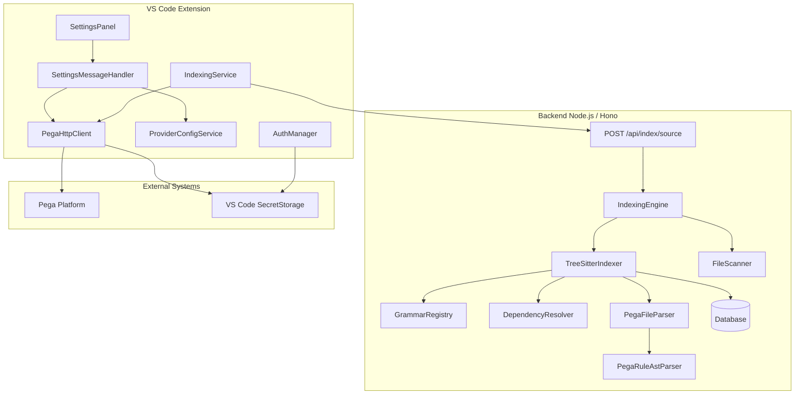
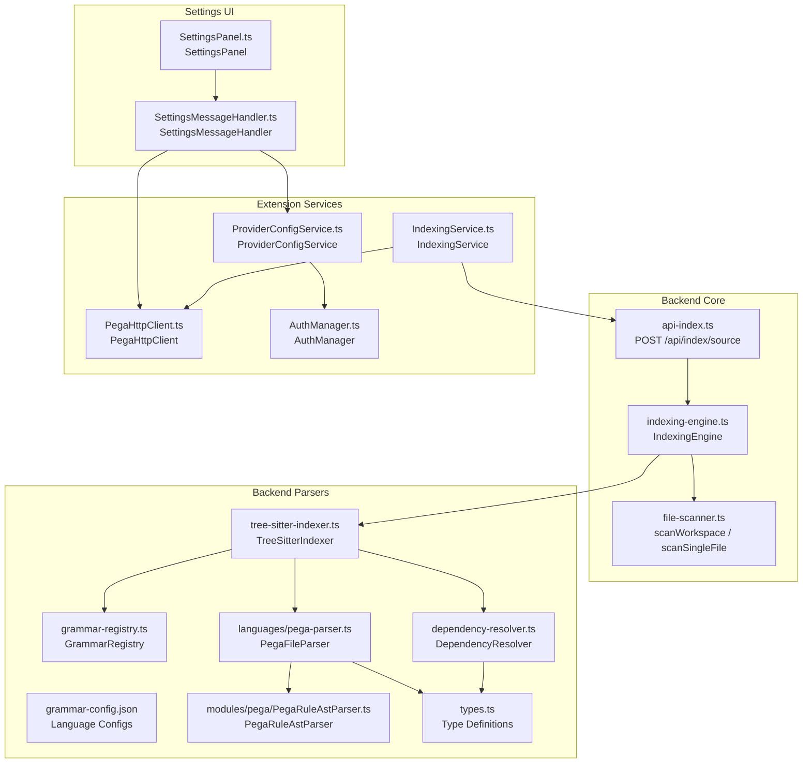
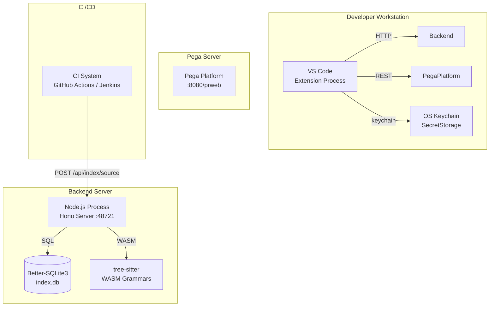
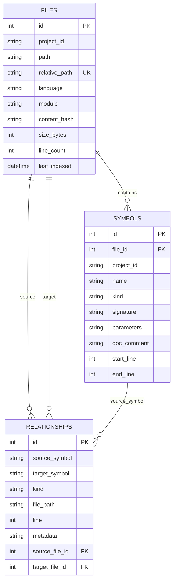
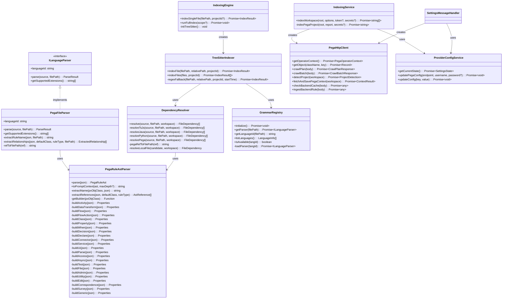
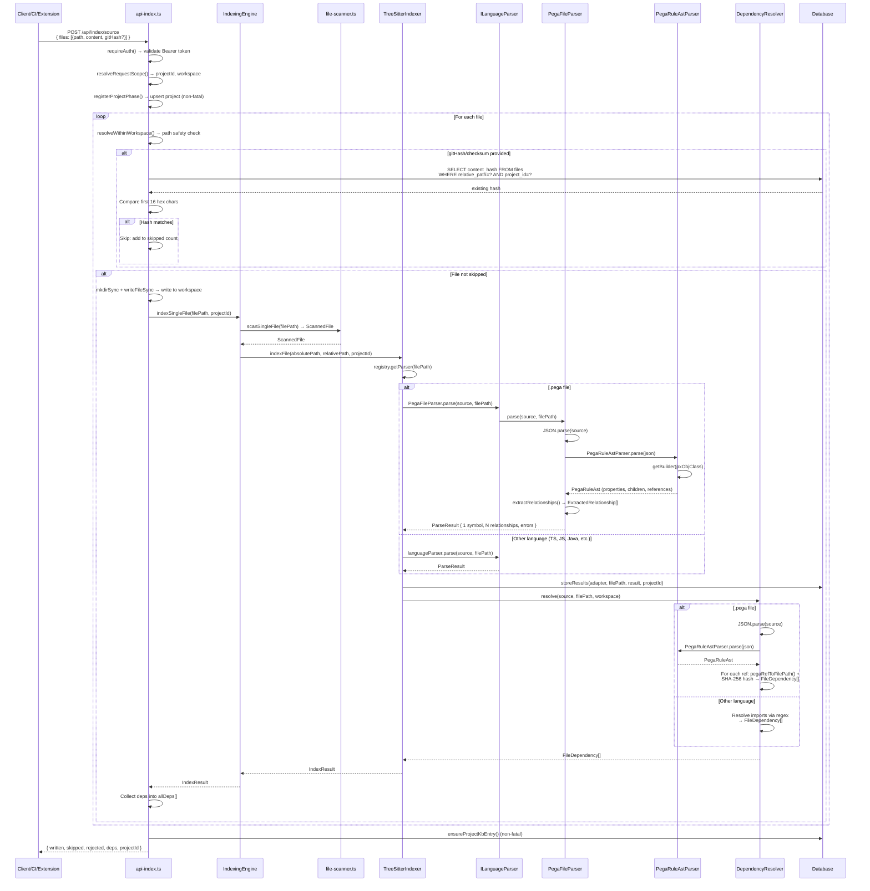
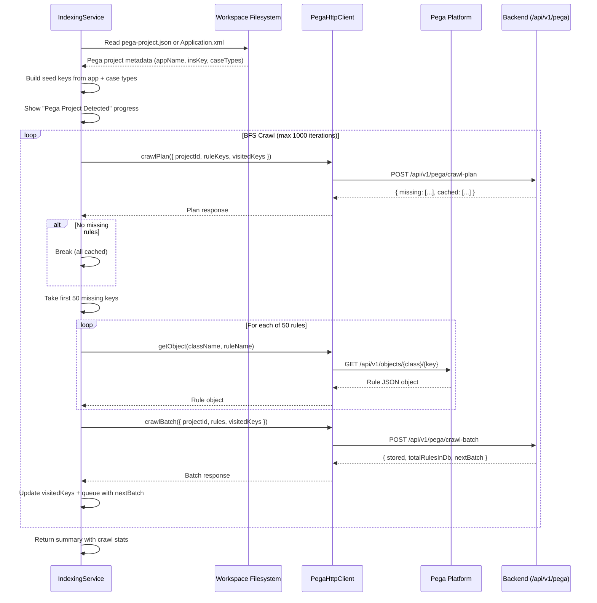
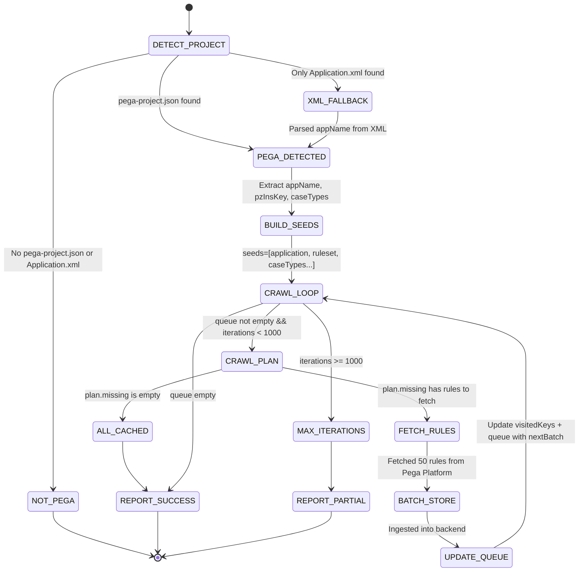
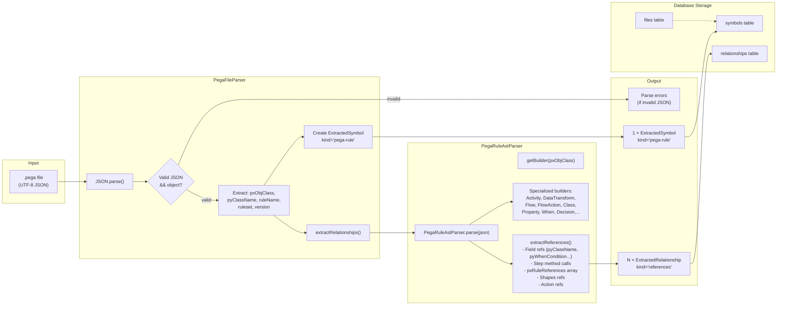

# Technical Design Document (TDD)

## Code Intelligence MCP Server — SA4E-56: Unified Code & Pega Rule Indexing Pipeline

---

## Document Information

| Field | Value |
|-------|-------|
| Jira Ticket | SA4E-56 |
| Title | Unified Code & Pega Rule Indexing Pipeline |
| Author | SA Agent |
| Version | 1.0 |
| Date | 2026-07-26 |
| Status | Draft |
| Related BRD | BRD-v1-SA4E-56.docx |
| Related FSD | FSD-v1-SA4E-56.docx |

---

## Author Tracking

| Role | Name - Position | Responsibility |
|------|-----------------|----------------|
| Author | SA Agent – Solution Architect | Create document |
| Peer Reviewer | TA Agent – Technical Analyst | Review document |

---

## Revision History

| Version | Date | Author | Changes |
|---------|------|--------|---------|
| 1.0 | 2026-07-26 | SA Agent | Initiate document — auto-generated from BRD and FSD |

---

## Sign-Off

| Name | Signature and date |
|------|--------------------|
| | ☐ I agree and confirm the technical design in this TDD |
| | ☐ I agree and confirm the technical design in this TDD |

---

## 1. Introduction

> **Scope Boundary:** This TDD specifies HOW to implement the requirements defined in the FSD for SA4E-56. It does NOT repeat functional requirements, business rules, use cases, or UI specifications — refer to the FSD for those. This document focuses on: technology choices, architecture decisions, implementation patterns, and deployment concerns for extending the Code Intelligence MCP Server with a unified indexing pipeline that handles both source code and Pega rules.

### 1.1 Purpose

This TDD defines the technical architecture, component design, API contracts, database schema, class hierarchies, and integration patterns for the **Unified Code & Pega Rule Indexing Pipeline**. The system extends the existing Code Intelligence MCP Server (Node.js, Hono, Better-SQLite3/PostgreSQL) and its VS Code Extension to support a single-pipeline indexing system (`POST /api/index/source`) that accepts all file types (`.ts`, `.js`, `.py`, `.java`, `.go`, `.rs`, `.pega`, etc.), resolves cross-file dependencies, performs version-aware deduplication via SHA-256 content hashes, and integrates with Pega Platform via BFS-based rule crawling.

### 1.2 Scope

**In Scope:**
- **Backend parsers directory** (`backend/src/engine/parsers/`): `types.ts`, `dependency-resolver.ts`, `tree-sitter-indexer.ts`, `grammar-registry.ts`, `grammar-config.json`, `languages/pega-parser.ts`
- **Backend modules/pega directory**: `PegaRuleAstParser.ts`, `PegaRuleAst.ts`
- **Backend API routes**: `api-index.ts` (`POST /api/index/source`)
- **Backend scanner**: `file-scanner.ts` (`.pega` language mapping)
- **Backend engine**: `indexing-engine.ts` (`indexSingleFile()`)
- **Extension services**: `PegaHttpClient.ts`, `IndexingService.ts`, `ProviderConfigService.ts`
- **Extension auth**: `AuthManager.ts` (last username persistence)
- **Extension settings panel**: `SettingsPanel.ts`, `SettingsMessageHandler.ts`
- **Extension models**: `LlmProviderConfig.ts` (SECRET_KEYS.pega)

**Out of Scope:**
- Pega Platform server-side deployment or management
- Non-textual Pega assets (binary formats)
- Custom Pega rule types not covered by the 20+ built-in AST builders
- Real-time Pega rule sync or webhook-based change detection
- GUI for Pega rule editing within VS Code

### 1.3 Technology Stack

| Layer | Technology | Version |
|-------|-----------|---------|
| Backend Runtime | Node.js | ≥ 18.x |
| Backend Framework | Hono (lightweight HTTP framework) | Latest |
| Backend Language | TypeScript | ≥ 5.x |
| Database | Better-SQLite3 / PostgreSQL | — |
| Parser Engine | tree-sitter (WASM grammars) | Latest |
| Pega Rule Parser | Custom AST parser (`PegaRuleAstParser`) | 1.0 |
| Extension Platform | VS Code Extension API | ≥ 1.16.0 |
| Extension Language | TypeScript | ≥ 5.x |
| Credential Storage | VS Code SecretStorage (OS keychain) | — |
| Build System | npm / esbuild | — |

### 1.4 Design Principles

- **SOLID**: Single Responsibility (each parser/service has one job), Open/Closed (new rule types add builders, not modify existing), Dependency Inversion (ILanguageParser interface)
- **Unified Pipeline**: All file types flow through the same `POST /api/index/source` endpoint — no separate APIs for Pega vs source code
- **Fail Non-Fatal**: A single file parse error does not block the entire batch — errors are logged, other files continue
- **Version-Aware Efficiency**: SHA-256 content hashes enable skip-on-match deduplication for incremental re-indexing
- **Security First**: Path-safety validation (`resolveWithinWorkspace`) prevents traversal attacks; Pega credentials stored in OS keychain, never in plaintext

### 1.5 Constraints

- Tree-sitter WASM grammars must be available at runtime for full parsing capability; regex fallback used when unavailable
- Pega .pega files are UTF-8 JSON — the parser assumes valid JSON format
- Pega Platform REST API must be accessible from the extension (not the backend)
- BFS crawl safety limit: MAX_ITERATIONS = 1000 prevents infinite loops on large Pega projects
- Extension-driven Pega crawl: the extension orchestrates; backend only stores/indexes

### 1.6 References

| Document | Location |
|----------|----------|
| BRD | BRD-v1-SA4E-56.docx (`documents/SA4E-56/BRD.md`) |
| FSD | FSD-v1-SA4E-56.docx (`documents/SA4E-56/FSD.md`) |
| Types Definition | `backend/src/engine/parsers/types.ts` |
| Grammar Config | `backend/src/engine/parsers/grammar-config.json` |
| Grammar Registry | `backend/src/engine/parsers/grammar-registry.ts` |
| Dependency Resolver | `backend/src/engine/parsers/dependency-resolver.ts` |
| Pega Parser | `backend/src/engine/parsers/languages/pega-parser.ts` |
| PegaRuleAstParser | `backend/src/modules/pega/PegaRuleAstParser.ts` |
| TreeSitterIndexer | `backend/src/engine/parsers/tree-sitter-indexer.ts` |
| Indexing Engine | `backend/src/engine/indexer/indexing-engine.ts` |
| API Routes | `backend/src/server/routes/api-index.ts` |
| File Scanner | `backend/src/engine/scanner/file-scanner.ts` |
| PegaHttpClient | `extension/src/services/PegaHttpClient.ts` |
| IndexingService | `extension/src/services/IndexingService.ts` |
| ProviderConfigService | `extension/src/services/ProviderConfigService.ts` |
| SettingsPanel | `extension/src/panels/settings/SettingsPanel.ts` |
| SettingsMessageHandler | `extension/src/panels/settings/SettingsMessageHandler.ts` |
| AuthManager | `extension/src/auth/AuthManager.ts` |

---

## 2. System Architecture

### 2.1 Architecture Overview

The Unified Code & Pega Rule Indexing Pipeline extends the existing Code Intelligence MCP Server architecture with:
1. A **Unified Indexing API** (`POST /api/index/source`) that accepts all file types including `.pega`
2. A **DependencyResolver** module for resolving imports and Pega references to concrete file paths with SHA-256 hashes
3. A **PegaFileParser** implementing `ILanguageParser` for `.pega` files
4. A **PegaRuleAstParser** with 20+ specialized AST builders for Pega rule types
5. **Extension-side PegaHttpClient** for Pega Platform REST API communication
6. **BFS Crawl Orchestration** in IndexingService for automatic Pega rule crawling




### 2.2 Component Diagram




| Component | Responsibility | Technology |
|-----------|---------------|------------|
| `api-index.ts` | Unified indexing endpoint — accepts batch, validates auth/paths, dedup checks, writes files, indexes, returns deps | Hono/TypeScript |
| `IndexingEngine` | Orchestrates full/partial workspace indexing, delegates to TreeSitterIndexer | TypeScript |
| `TreeSitterIndexer` | Per-file indexing via grammar registry + parser, returns IndexResult with dependencies | TypeScript |
| `GrammarRegistry` | Manages tree-sitter WASM grammar loading, maps extensions → language parsers | TypeScript |
| `PegaFileParser` | ILanguageParser implementation for .pega files — extracts symbols + relationships | TypeScript |
| `PegaRuleAstParser` | Internal AST parser with 20+ specialized rule type builders | TypeScript |
| `DependencyResolver` | Resolves imports/references for TS/JS, Java, Python, Pega → FileDependency[] | TypeScript |
| `file-scanner.ts` | Workspace file scanner with `.pega` → 'pega' language mapping | TypeScript |
| `PegaHttpClient` | REST client for Pega Platform (operator context, objects, crawl-plan/batch) | TypeScript |
| `IndexingService` | Extension-side indexing orchestrator — detects Pega projects, BFS crawl | TypeScript |
| `ProviderConfigService` | Reads/writes VS Code settings, manages SecretStorage for Pega credentials | TypeScript |
| `AuthManager` | Auth state machine — manages token lifecycle, persists last username | TypeScript |

### 2.3 Deployment Architecture




### 2.4 Communication Patterns

| From | To | Protocol | Pattern | Description |
|------|----|----------|---------|-------------|
| Extension (IndexingService) | Backend (`POST /api/index/source`) | HTTP REST | Sync (request/response) | Upload source files for indexing |
| Extension (PegaHttpClient) | Pega Platform | HTTP REST | Sync | Fetch Pega operator context, rule objects |
| Extension (PegaHttpClient) | Backend (`/api/v1/pega/*`) | HTTP REST | Sync | Crawl plan/batch operations |
| CI System | Backend (`POST /api/index/source`) | HTTP REST | Sync | Batch file indexing with dedup |
| Backend (GrammarRegistry) | tree-sitter WASM | In-process WASM | Sync | Parse source code into AST |
| Backend (DependencyResolver) | Filesystem | `readFileSync` | Sync | Resolve local file dependencies |

---

## 3. API Design

> **Prerequisite:** Functional API contracts (parameters, business errors, data flows) are defined in FSD §3.1.4–3.1.6. This section specifies the technical implementation: headers, authentication mechanism, request/response JSON schemas, HTTP status codes, and error code mapping.

### 3.1 API Overview

| # | Endpoint | Method | Description | Source |
|---|----------|--------|-------------|--------|
| 1 | `/api/index/source` | POST | Unified indexing — accepts all file types including .pega, dedup, dependency resolution | UC-01, BR-01..06 |
| 2 | `/api/v1/pega/crawl-plan` | POST | Determine which Pega rules need fetching (vs already cached) | UC-07 |
| 3 | `/api/v1/pega/crawl-batch` | POST | Ingest a batch of fetched Pega rules | UC-07 |
| 4 | `/api/v1/pega/check-rule` | POST | Check if a specific Pega rule is cached | UC-07 |
| 5 | `/api/v1/pega/ingest-rule` | POST | Ingest a single Pega rule | UC-07 |
| 6 | `/api/v1/pega/detect-project` | POST | Detect if workspace contains a Pega project | UC-07 |

---

### 3.2 API: POST /api/index/source

**Implements:** UC-01, BR-01..06

| Attribute | Value |
|-----------|-------|
| Method | POST |
| Path | `/api/index/source` |
| Auth | Bearer Token (session validation via `validateSession()`) |
| Rate Limit | Not enforced at this layer |

**Request Headers:**

| Header | Required | Description |
|--------|----------|-------------|
| Authorization | Yes | `Bearer {token}` from login session |
| Content-Type | Yes | `application/json` |
| X-Project-Id | No | Project scope (falls back to boot config) |
| X-Workspace-Root | No | Workspace root (falls back to boot config) |

**Request Body:**

```json
{
  "files": [
    {
      "path": "src/services/my-service.ts",
      "content": "import { process } from './processor';",
      "gitHash": "a1b2c3d4e5f6...",
      "checksum": "e5f67890..."
    },
    {
      "path": "Work-Order.CreateOrder.Rule-Obj-Activity.pega",
      "content": "{ \"pxObjClass\": \"Rule-Obj-Activity\", ... }"
    }
  ]
}
```

**Response — 200 OK:**

```json
{
  "written": 2,
  "skipped": 1,
  "rejected": ["../../etc/passwd"],
  "deps": [
    {
      "path": "src/engine/parsers/types.ts",
      "expectedHash": "a1b2c3d4e5f67890",
      "sourceType": "local"
    },
    {
      "path": "Work-Order.ValidateAddress.Rule-Obj-Activity.pega",
      "expectedHash": "",
      "sourceType": "remote"
    }
  ],
  "projectId": "my-project"
}
```

**Error Responses:**

| Status | Code | Message | Description |
|--------|------|---------|-------------|
| 400 | INVALID_INPUT | `{ "error": "files array required" }` | Missing or invalid `files` field |
| 400 | PROJECT_REQUIRED | `{ "error": "X-Project-Id required for indexing" }` | No project scope available |
| 401 | UNAUTHORIZED | `{ "error": "Unauthorized" }` | Missing, invalid, or expired Bearer token |
| 500 | INTERNAL_ERROR | `{ "error": "Internal error" }` | Unexpected server error |

**Processing Flow:**
1. `requireAuth(c)` → validates Bearer token via `validateSession()` → 401 if invalid
2. `resolveRequestScope(c)` → extracts projectId + workspace from headers or boot config
3. `registerProjectPhase()` → upserts project in admin registry (non-fatal)
4. For each file in `files` array:
   - `resolveWithinWorkspace(workspace, file.path)` → validates path safety → rejects if traversal detected
   - If `gitHash` or `checksum` provided: queries `files` table for matching `content_hash` → if match, adds to `skipped` and continues
   - Writes file to disk (creates directories if needed)
   - Calls `indexer.indexSingleFile(file.path, projectId)` → returns `IndexResult` with dependencies
   - Collects deps into `allDeps` array (deduplicated by path)
5. Returns `{ written, skipped, rejected, deps, projectId }`

---

### 3.3 API: POST /api/v1/pega/crawl-plan

**Implements:** UC-07

| Attribute | Value |
|-----------|-------|
| Method | POST |
| Path | `/api/v1/pega/crawl-plan` |
| Auth | Internal (extension-to-backend, no additional auth beyond session) |
| Description | Given a list of rule keys + visited keys, returns which rules need fetching vs already cached |

**Request Body:**

```json
{
  "projectId": "my-project",
  "ruleKeys": ["RULE-OBJ-ACTIVITY WORKORDER CREATEORDER", "RULE-OBJ-FLOW WORKORDER MAINFLOW"],
  "visitedKeys": ["RULE-OBJ-ACTIVITY WORKORDER VALIDATEADDRESS"]
}
```

**Response — 200 OK:**

```json
{
  "data": {
    "missing": [
      { "insKey": "RULE-OBJ-ACTIVITY WORKORDER CREATEORDER", "pxObjClass": "Rule-Obj-Activity", "pyClassName": "Work-Order", "pyRuleName": "CreateOrder" }
    ],
    "cached": ["RULE-OBJ-FLOW WORKORDER MAINFLOW"]
  }
}
```

---

### 3.4 API: POST /api/v1/pega/crawl-batch

**Implements:** UC-07

| Attribute | Value |
|-----------|-------|
| Method | POST |
| Path | `/api/v1/pega/crawl-batch` |
| Auth | Internal |
| Description | Ingest a batch of fetched Pega rules (max 50) into the database |

**Request Body:**

```json
{
  "projectId": "my-project",
  "rules": [
    { "pxObjClass": "Rule-Obj-Activity", "pyRuleName": "CreateOrder", ... }
  ],
  "visitedKeys": ["RULE-OBJ-ACTIVITY WORKORDER CREATEORDER"]
}
```

**Response — 200 OK:**

```json
{
  "data": {
    "stored": 50,
    "totalRulesInDb": 250,
    "totalKbEntriesInDb": 300,
    "totalGraphNodesInDb": 200,
    "nextBatch": [
      { "insKey": "RULE-OBJ-WHEN WORKORDER ISVALID", "pxObjClass": "Rule-Obj-When", "pyClassName": "Work-Order", "pyRuleName": "IsValid" }
    ]
  }
}
```

---

## 4. Database Design

> **Prerequisite:** Logical data model (entities, relationships, business attributes) is defined in FSD §4. This section specifies the physical implementation. **No schema migration is required** — the existing `files`, `symbols`, and `relationships` tables already support the new Pega data. The `.pega` files use the same indexing pipeline as source code files.

### 4.1 Schema Overview




### 4.2 Existing Tables (No Migration Required)

#### Table: `files`

```sql
CREATE TABLE files (
    id INTEGER PRIMARY KEY AUTOINCREMENT,
    project_id TEXT NOT NULL,
    path TEXT NOT NULL,
    relative_path TEXT NOT NULL,
    language TEXT NOT NULL,
    module TEXT,
    content_hash TEXT,
    size_bytes INTEGER DEFAULT 0,
    line_count INTEGER DEFAULT 0,
    last_indexed TIMESTAMP,
    file_created_at TEXT,
    file_author TEXT,
    file_version TEXT,
    UNIQUE(project_id, path)
);

CREATE INDEX idx_files_content_hash ON files(content_hash);
CREATE INDEX idx_files_relative_path ON files(relative_path);
CREATE INDEX idx_files_project ON files(project_id);
```

**Pega-specific usage:** For `.pega` files, the `language` column stores `'pega'`, and the `content_hash` column stores the SHA-256 first 16 hex chars used for dedup (BR-30).

#### Table: `symbols`

```sql
CREATE TABLE symbols (
    id INTEGER PRIMARY KEY AUTOINCREMENT,
    project_id TEXT NOT NULL,
    file_id INTEGER NOT NULL,
    name TEXT NOT NULL,
    kind TEXT NOT NULL,
    signature TEXT,
    start_line INTEGER DEFAULT 1,
    end_line INTEGER DEFAULT 1,
    parent_symbol TEXT,
    visibility TEXT,
    doc_comment TEXT,
    parameters TEXT,
    return_type TEXT,
    modifiers TEXT,
    decorators TEXT,
    parent_name TEXT,
    is_async INTEGER DEFAULT 0,
    is_exported INTEGER DEFAULT 0,
    complexity INTEGER DEFAULT 0,
    FOREIGN KEY (file_id) REFERENCES files(id)
);

CREATE INDEX idx_symbols_kind ON symbols(kind);
CREATE INDEX idx_symbols_file ON symbols(file_id);
CREATE INDEX idx_symbols_project_kind ON symbols(project_id, kind);
```

**Pega-specific usage:** For `.pega` files, each file produces exactly one symbol with:
- `kind = 'pega-rule'` (BR-20)
- `name` = the Pega rule name (from `pyRuleName`, `pyActivityName`, etc.)
- `signature` = JSON string: `{"ruleType":"Rule-Obj-Activity","className":"Work-Order","ruleset":"MyApp","rulesetVersion":"01.01.01","label":"Creates order"}`
- `parameters` = `pxObjClass` value (e.g., `"Rule-Obj-Activity"`)

#### Table: `relationships`

```sql
CREATE TABLE relationships (
    id INTEGER PRIMARY KEY AUTOINCREMENT,
    source_symbol TEXT NOT NULL,
    target_symbol TEXT NOT NULL,
    kind TEXT NOT NULL,
    file_path TEXT,
    line INTEGER DEFAULT 1,
    metadata TEXT,
    source_file_id INTEGER,
    target_file_id INTEGER,
    FOREIGN KEY (source_file_id) REFERENCES files(id),
    FOREIGN KEY (target_file_id) REFERENCES files(id)
);

CREATE INDEX idx_relationships_kind ON relationships(kind);
CREATE INDEX idx_relationships_source ON relationships(source_symbol);
CREATE INDEX idx_relationships_target ON relationships(target_symbol);
```

**Pega-specific usage:** For `.pega` files, relationships have:
- `kind = 'references'` (BR-23)
- `metadata` = JSON object: `{"ruleType":"Rule-Obj-When","className":"Work-Order","ruleName":"IsValid","role":"guards"}`

### 4.3 Migration Plan

**No database migration is required.** The existing `files`, `symbols`, and `relationships` tables already support the new `.pega` file type through:
- The `content_hash` column for dedup checks
- The `kind` field (`'pega-rule'` as a new SymbolKind value)
- The `language` field (`'pega'` as a new language value)
- The `kind` field in relationships (`'references'` as a new RelationshipKind value)

### 4.4 Query Patterns

| Operation | Query Pattern | Expected Performance |
|-----------|--------------|---------------------|
| Dedup check | `SELECT content_hash FROM files WHERE relative_path = ? AND project_id = ?` | < 10ms (indexed on content_hash + relative_path) |
| Symbol lookup by kind | `SELECT * FROM symbols WHERE kind = 'pega-rule' AND project_id = ?` | < 50ms (indexed on project_id, kind) |
| File lookup by language | `SELECT * FROM files WHERE language = 'pega' AND project_id = ?` | < 50ms (indexed on project_id) |
| Relationship lookup | `SELECT * FROM relationships WHERE kind = 'references' AND (source_symbol = ? OR target_symbol = ?)` | < 50ms (indexed on source_symbol, target_symbol) |
| Dependency resolution via API | In-memory collection (no DB query for deps) | Instant |

---

## 5. Class / Module Design

### 5.1 Package Structure

```
backend/src/
├── engine/
│   ├── parsers/
│   │   ├── types.ts                           # SymbolKind, RelationshipKind, FileDependency, etc.
│   │   ├── grammar-registry.ts                 # GrammarRegistry — WASM loading + parser factory
│   │   ├── grammar-config.json                 # Language → extension → wasmPath → parserModule
│   │   ├── dependency-resolver.ts              # DependencyResolver — import/reference resolution
│   │   ├── tree-sitter-indexer.ts              # TreeSitterIndexer — indexFile + indexFiles
│   │   ├── languages/
│   │   │   ├── pega-parser.ts                  # PegaFileParser — ILanguageParser for .pega
│   │   │   ├── typescript-parser.ts            # Existing TS/JS parser
│   │   │   ├── python-parser.ts               # Existing Python parser
│   │   │   ├── java-parser.ts                 # Existing Java parser
│   │   │   └── ...
│   ├── indexer/
│   │   └── indexing-engine.ts                  # IndexingEngine — indexSingleFile()
│   └── scanner/
│       └── file-scanner.ts                     # scanWorkspace, scanSingleFile, detectLanguage
├── modules/
│   └── pega/
│       ├── PegaRuleAst.ts                      # PegaRuleAst, AstReference, AstNode interfaces
│       ├── PegaRuleAstParser.ts                # PegaRuleAstParser — 20+ specialized builders
│       ├── strategies/                         # Parser strategy pattern (optional extensions)
│       └── domain/                             # Pega domain models
├── server/
│   └── routes/
│       └── api-index.ts                        # POST /api/index/source handler

extension/src/
├── services/
│   ├── PegaHttpClient.ts                       # PegaHttpClient — REST client for Pega Platform
│   ├── IndexingService.ts                      # IndexingService — BFS crawl orchestration
│   ├── ProviderConfigService.ts                # ProviderConfigService — config + SecretStorage
│   ├── IndexerHttpClient.ts                    # HTTP client for backend indexing
│   └── ...
├── auth/
│   └── AuthManager.ts                          # AuthManager — token lifecycle, getLastUsername()
├── panels/
│   └── settings/
│       ├── SettingsPanel.ts                    # SettingsPanel — webview UI for settings
│       └── SettingsMessageHandler.ts            # Message handler — savePegaConfig, testPegaConnection, etc.
├── models/
│   ├── index.ts                                # Re-exports
│   └── LlmProviderConfig.ts                    # SECRET_KEYS, including pega key
```

### 5.2 Key Interfaces

```typescript
// From types.ts
interface ILanguageParser {
  readonly languageId: string;
  parse(source: string, filePath: string): ParseResult;
  getSupportedExtensions(): string[];
}

interface ParseResult {
  symbols: ExtractedSymbol[];
  relationships: ExtractedRelationship[];
  errors: ParseError[];
}

interface IndexResult {
  filePath: string;
  symbolCount: number;
  relationshipCount: number;
  parseErrors: number;
  duration: number;
  method: 'tree-sitter' | 'regex-fallback';
  dependencies: FileDependency[];
}

interface FileDependency {
  path: string;
  expectedHash: string;
  sourceType: 'local' | 'remote';
  sourceUrl?: string;
}

// Pega-specific types
interface PegaRuleAst {
  astVersion: '1.0';
  ruleType: string;
  name: string;
  className: string;
  ruleset?: string;
  rulesetVersion?: string;
  label?: string;
  properties: Record<string, unknown>;
  children: AstNode[];
  references: AstReference[];
}

interface AstReference {
  ruleType: string;
  className: string;
  ruleName: string;
  role: string;
}
```

### 5.3 Design Patterns

| Pattern | Where Used | Rationale |
|---------|-----------|-----------|
| **Strategy** | `PegaRuleAstParser.getBuilder()` | Each Pega rule type (Activity, DataTransform, Flow, etc.) uses a dedicated builder function selected by `pxObjClass`. Adding a new rule type requires adding a new builder, not modifying existing code. |
| **Factory** | `GrammarRegistry.loadParser()` | Dynamically imports the correct language parser module based on `grammar-config.json`. The registry acts as a factory for `ILanguageParser` instances. |
| **Chain of Responsibility** | `DependencyResolver.resolve()` | Dispatches to language-specific resolver methods (`resolveTsJs`, `resolveJava`, `resolvePython`, `resolvePega`) based on file extension. |
| **Singleton** | `PegaRuleAstParser` (const instance) | Both `dependency-resolver.ts` and `pega-parser.ts` use a module-level singleton (`AST_PARSER`) since the parser is stateless. |
| **Repository** | `TreeSitterIndexer` → DatabaseAdapter | All database operations (storing symbols, relationships) go through `storeResults()` / `storeRegexResults()`, abstracting the database engine. |

### 5.4 Class Diagram




### 5.5 Error Handling

| Exception / Error | HTTP Status | Error Message | When Thrown | Handled By |
|-------------------|-------------|---------------|-------------|------------|
| Invalid/missing Bearer token | 401 | `{ "error": "Unauthorized" }` | `requireAuth()` in api-index.ts | `requireAuth` → early return |
| Missing files array | 400 | `{ "error": "files array required" }` | Body missing `files` or non-array | `handleIndexSource()` |
| Missing project scope | 400 | `{ "error": "X-Project-Id required for indexing" }` | No header and no boot config | `requireProjectId()` |
| Path traversal | 200 (rejected array) | File added to `rejected` array | `resolveWithinWorkspace()` returns null | `writeFilesPhase()`, per-file |
| File write failure | 200 (not in written) | Logged as error | `fs.writeFileSync()` throws | `for` loop, continues |
| Index parse failure | 200 (partial) | Logged as warn | `indexSingleFile()` throws | `try/catch` in loop |
| DB query error (dedup) | 200 (file processed) | Logged as warn | `adapter.getAsync()` throws | `try/catch`, treat as no match |
| Invalid .pega JSON | Parser returns error | In `parseErrors` count | `JSON.parse()` in PegaFileParser | Returns `ParseResult` with errors |
| Pega connection failure | Varies | `"Connection failed: {message}"` | `fetch()` to Pega Platform fails | Ext: caught in settings handler, shown in UI |
| BFS crawl network error | Partial results | Logged as warn | `crawlPlan()`/`crawlBatch()` network error | `indexPegaProject()` caught, returns partial summary |
| Unexepcted backend error | 500 | `{ "error": "Internal error" }` | Any unhandled exception | `indexError()` catch-all |

### 5.6 Unified Indexing Processing Flow (Sequence)



---

## 6. Integration Design

> **Prerequisite:** Business integration requirements (what systems, what data is exchanged, business rules) are defined in FSD §5. This section specifies the technical implementation: protocols, timeouts, retry policies, circuit breakers, and sequence diagrams.

### 6.1 External System: Pega Platform (via PegaHttpClient)

| Attribute | Value |
|-----------|-------|
| Protocol | HTTP REST (JSON) |
| Endpoint | Configurable via `kiroSdlc.pegaEndpoint` (default: `http://localhost:8080/prweb`) |
| Authentication | Basic Auth (username from config, password from SecretStorage) |
| Timeout | 5s per request (implicit via AbortController in Test Connection) |
| Retry Policy | None for individual fetches; URL fallback pattern (with/without `/PRRestService`) |
| Circuit Breaker | None — errors are caught and reported non-fatally |

**PegaHttpClient REST Endpoints:**

| Endpoint | Method | Purpose | Fallback URL |
|----------|--------|---------|-------------|
| `${base}/api/v1/data/D_OperatorID` | GET | Fetch operator context | `${base}/PRRestService/api/v1/data/D_OperatorID` |
| `${base}/api/v1/casetypes` | GET | Fetch case type list | `${base}/PRRestService/api/v1/casetypes` |
| `${base}/api/v1/applications` | GET | Fetch applications | `${base}/PRRestService/api/v1/applications` |
| `${base}/api/v1/objects/{class}/{key}` | GET | Fetch specific Pega rule object | None |
| Backend `/api/v1/pega/crawl-plan` | POST | Determine which rules to fetch | None |
| Backend `/api/v1/pega/crawl-batch` | POST | Ingest batch of rules | None |

**PegaHttpClient Fallback Strategy:**
For each Pega Platform REST endpoint, `PegaHttpClient` tries the direct URL first, then falls back to the `/PRRestService`-prefixed URL. This handles Pega Platform version differences in URL structure. If both fail with 401/403, the error is propagated. Connection errors are caught and re-thrown with descriptive messages.

### 6.2 BFS Crawl Orchestration (Extension → Pega Platform → Backend)




---

## 7. Security Design

> **Prerequisite:** Business security requirements (roles, permissions, data classification, audit needs) are defined in FSD §7. This section specifies the technical implementation.

### 7.1 Authentication

| Mechanism | Component | Description |
|-----------|-----------|-------------|
| Bearer Token (JWT) | Backend API (`POST /api/index/source`) | `requireAuth()` validates Bearer token via `validateSession()` — returns 401 if invalid |
| Basic Auth | Extension ↔ Pega Platform | Username from `kiroSdlc.pegaUsername` config, password from `SecretStorage.get(SECRET_KEYS.pega)` — encoded as Base64 |
| No Auth | Extension Settings Panel | Local VS Code UI — no authentication needed for settings configuration |

### 7.2 Authorization

| Role | Endpoints | Permissions |
|------|-----------|-------------|
| API Consumer (CI/Developer) | `POST /api/index/source` | WRITE — requires valid Bearer token |
| Extension User | Settings panel, Pega crawl | READ/WRITE — local VS Code, no backend auth needed |
| Pega Operator | Pega Platform APIs | READ — configured credentials (Basic Auth) |

### 7.3 Data Protection

| Data Type | At Rest | In Transit | In Logs |
|-----------|---------|------------|---------|
| Pega Platform password | SecretStorage (OS keychain) | HTTPS (if configured) / Basic Auth header | **Excluded** — never logged |
| Pega Platform endpoint | VS Code settings (`kiroSdlc.pegaEndpoint`) | Plaintext in settings.json | Logged at INFO level |
| Authentication tokens | SecretStorage (OS keychain) | Bearer header (HTTPS) | **Excluded** — never logged |
| Source code content | Database (files table) | HTTPS (if configured) | Not logged at content level |
| File paths with `../` traversal | Not stored (rejected) | Plaintext in request body | Logged at WARN level for security monitoring |

### 7.4 Input Validation

| Field | Validation | Sanitization |
|-------|-----------|--------------|
| `files[].path` | Must be relative; `resolveWithinWorkspace()` checks path traversal | Normalized path via `path.normalize()` |
| `files[].content` | Must be string (JSON parse for .pega) | Written to disk as-is (source code) |
| `gitHash`/`checksum` | First 16 hex chars used for comparison | Invalid/empty values silently treated as absent |
| `Authorization` header | Must be `Bearer {token}` format | Token extracted via `.replace('Bearer ', '')` |
| `X-Project-Id` | Must be non-empty (falls back to boot config) | Trimmed |
| `X-Workspace-Root` | Must be existing directory | Falls back to boot config |

---

## 8. Performance & Scalability

> **Prerequisite:** Business NFR targets (response time, availability, scalability expectations) are defined in FSD §8. This section specifies how to achieve those targets.

### 8.1 Caching Strategy

| Cache | What | TTL | Eviction | Technology |
|-------|------|-----|----------|------------|
| Content Hash (Dedup) | `content_hash` in `files` table | Permanent (until re-indexed) | N/A (DB index) | SQLite/PostgreSQL indexed column |
| Grammar Registry Parsers | Loaded `ILanguageParser` instances | Session lifetime | N/A (reload on server restart) | In-memory Map |
| tree-sitter WASM Languages | Loaded WASM modules | Session lifetime | N/A (reload on server restart) | In-memory Map |
| Pega Crawl Cache | Pega rules cached in backend DB | Permanent | N/A | Backend database |

### 8.2 Performance Targets

| Operation | Target | Measurement |
|-----------|--------|-------------|
| Single file indexing (100KB .ts file) | < 1000ms | `indexSingleFile()` timing |
| Batch of 50 files | < 30s | `indexFiles()` timing |
| Dedup check (unchanged file) | < 100ms | `SELECT content_hash` query |
| BFS crawl per iteration (50 rules) | < 30s | Queue iteration time |
| BFS crawl max (1000 rules) | < 5 min | Total crawl time |

### 8.3 Optimization Notes

- **Batch size of 50** for both file indexing (`TreeSitterIndexer.indexFiles`) and Pega crawl batch reduces per-request overhead
- **`setImmediate()`** calls between batch operations prevent event loop blocking on large workspaces
- **Content hash dedup** eliminates unnecessary write + parse for unchanged files, critical for CI/CD re-indexing
- **Extension priority resolution** (`.ts` → `.tsx` → `.js` → ... → `.d.ts` → index files) minimizes filesystem operations in `DependencyResolver`
- **MAX_ITERATIONS=1000** safety guard prevents infinite loops in Pega BFS crawl

---

## 9. Monitoring & Observability

### 9.1 Logging

All logging uses the `pino` logger with structured JSON format.

| Log Event | Level | Fields | Destination |
|-----------|-------|--------|-------------|
| Index API call received | INFO | `projectId`, `fileCount`, timestamp | Backend stdout |
| File written to workspace | DEBUG | `filePath`, `projectId` | Backend stdout |
| File skipped (dedup) | DEBUG | `filePath`, `hash` | Backend stdout |
| File path rejected (traversal) | WARN | `rejected[]`, `projectId` | Backend stdout |
| File index parse error | WARN | `filePath`, `error` | Backend stdout |
| Single-file index failure | WARN | `filePath`, `error` | Backend stdout |
| Pega crawl summary | INFO | `appName`, `rulesFetched`, `rulesStored` | Backend stdout |
| Pega crawl error | WARN | `error`, `partial` results | Backend stdout |
| Grammar registered | INFO | `langId`, `extensions` | Backend stdout |
| Grammar load failure | ERROR | `langId`, `error` | Backend stdout |
| Authentication failure | WARN | `HTTP status`, `endpoint` | Backend stdout |
| BFS crawl iteration | DEBUG | `visitedKeys.size`, `queue.length` | Extension console |

### 9.2 Metrics

| Metric | Type | Description | Alert Threshold |
|--------|------|-------------|-----------------|
| `index.files.written` | Counter | Files written and indexed | N/A |
| `index.files.skipped` | Counter | Files skipped by dedup | N/A |
| `index.files.rejected` | Counter | Files rejected for path safety | > 0 per request → investigate |
| `index.parse.errors` | Counter | Total parse errors across files | > 10% of batch → investigate |
| `index.deps.resolved` | Counter | Total dependencies resolved | N/A |
| `pega.rules.crawled` | Counter | Pega rules fetched and ingested | N/A |
| `pega.http.error` | Counter | Pega HTTP request failures | > 5 consecutive → investigate |
| `api.response.time` | Histogram | POST /api/index/source response time | p95 > 30s → scale |

### 9.3 Health Checks

| Endpoint | Checks | Expected Response |
|----------|--------|-------------------|
| `/health` | Server running | `200 OK` |
| `/api/v1/pega/*` (any) | Backend Pega routes registered | Non-404 response |

---

## 10. Deployment Considerations

### 10.1 Environment Configuration

| Property | DEV | SIT | UAT | PROD |
|----------|-----|-----|-----|------|
| `kiroSdlc.pegaEndpoint` | `http://localhost:8080/prweb` | `http://pega-sit:8080/prweb` | `http://pega-uat:8080/prweb` | `https://pega-prod:443/prweb` |
| `kiroSdlc.pegaUsername` | `dev@jira` | `sit@jira` | `uat@jira` | `prod@jira` |
| `config.projectId` | `dev-project` | `sit-project` | `uat-project` | `prod-project` |
| `config.workspace` | `./workspaces/dev` | `./workspaces/sit` | `./workspaces/uat` | `./workspaces/prod` |

### 10.2 Feature Flags

| Flag | Default | Description |
|------|---------|-------------|
| `pega.enabled` | `true` | Enable/disable Pega crawling during workspace indexing. Set to `false` if no Pega Platform is available. |
| `pega.crawl.maxIterations` | `1000` | Maximum BFS crawl iterations. Lower for faster but less complete crawl. |
| `indexer.maxFileSize` | `1048576` (1MB) | Maximum file size for tree-sitter parsing. Larger files fall back to regex. |

### 10.3 Rollback Strategy

1. **Backend rollback**: Revert `backend/src/engine/parsers/` and `backend/src/server/routes/api-index.ts` changes. The `POST /api/index/source` endpoint will continue to work without `.pega` support and without dependency resolution.
2. **Extension rollback**: Revert extension services (`PegaHttpClient.ts`, `IndexingService.ts`, `ProviderConfigService.ts`, `SettingsPanel.ts`, `SettingsMessageHandler.ts`, `AuthManager.ts`). The Settings panel will lose Pega configuration UI but all other functionality remains.
3. **Database**: No schema changes needed — no rollback for DB.
4. **grammar-config.json**: Revert the `.pega` entry. The GrammarRegistry will not load PegaFileParser, and `.pega` files will be unrecognized (not indexed).

---

## 11. Pega BFS Crawl State Machine



---

## 12. PegaFileParser Data Flow



---

## 13. E2E Test Architecture

### 13.1 Framework & Language

- **Framework**: jest / vitest (unit tests for backend), mocha/chai or jest (E2E for extension)
- **Language**: TypeScript (matching the project's main language)
- **API test client**: `fetch` with Bearer token authentication
- **Note**: Backend tests are in `backend/src/` (unit tests per parser); E2E tests run against a local backend instance

### 13.2 Test Structure

```
backend/src/
├── engine/parsers/languages/__tests__/
│   ├── pega-parser.test.ts
│   ├── typescript-parser.test.ts
│   └── ...
├── modules/pega/__tests__/
│   ├── PegaRuleAstParser.test.ts
│   └── pega-indexing.e2e.test.ts
└── server/routes/__tests__/
    └── api-index.test.ts

extension/src/
└── __tests__/
    ├── indexer.test.ts
    └── code-intel.test.ts
```

### 13.3 Key Test Cases

| ID | Scenario | Component | Description |
|----|----------|-----------|-------------|
| TC-01 | Index TypeScript with imports | `api-index.ts` + `DependencyResolver` | Post `.ts` file, verify deps resolved |
| TC-02 | Index .pega file | `PegaFileParser` | Verify 1 pega-rule symbol + refs |
| TC-03 | Dedup same file twice | `api-index.ts` | Second call returns `skipped: 1` |
| TC-04 | Path traversal rejected | `api-index.ts` | `"../../etc/passwd"` in `rejected` |
| TC-05 | Unauthenticated request | `api-index.ts` | HTTP 401 |
| TC-06 | Pega AST parsing all types | `PegaRuleAstParser` | Each of 20+ builders produces valid AST |
| TC-07 | Pega reference extraction | `PegaRuleAstParser` | Activity with Call → ref to target activity |
| TC-08 | Pega dependency resolution | `DependencyResolver` | .pega deps resolved with file hashes |
| TC-09 | Invalid .pega JSON | `PegaFileParser` | Returns parse errors, not crash |
| TC-10 | BFS crawl with circular refs | `IndexingService` (unit) | visitedKeys prevents infinite loop |

---

## Appendix

### Glossary

| Term | Definition |
|------|------------|
| BFS | Breadth-First Search — traversal strategy for crawling Pega rules starting from seed keys |
| Content Hash | First 16 hex chars of SHA-256 hash of file content, used for deduplication |
| FileDependency | Interface representing a resolved dependency: `{ path, expectedHash, sourceType, sourceUrl? }` |
| ILanguageParser | Interface for language-specific parsers — `parse(source, filePath) → ParseResult` |
| Pega Rule AST | Abstract Syntax Tree representation of a parsed Pega rule with properties, children, references |
| PegaHttpClient | Extension-side HTTP client for communicating with Pega Platform REST APIs |
| SecretStorage | VS Code API for secure credential storage backed by OS keychain |
| tree-sitter | Parser generator tool for incremental parsing of source code files |
| WASM | WebAssembly — binary format for tree-sitter grammars |
| DependencyResolver | Module that converts import/reference statements into concrete FileDependency objects |
| pzInsKey | Pega internal key identifier for rule instances |

### Open Questions

| # | Question | Status | Answer |
|---|----------|--------|--------|
| 1 | Should the BFS crawl be throttled to avoid Pega Platform rate limiting? | Open | Currently no throttling — 50 rules per batch is the only limit. Monitor during testing. |
| 2 | Is SHA-256 first 16 hex chars sufficient for collision-free dedup? | Open | Risk is extremely low (2^64 combinations). Accept for V1. |
| 3 | Should we support Pega version-specific fallback URLs beyond the `/PRRestService` pattern? | Open | Add more fallback patterns as discovered during Pega Platform version testing. |
