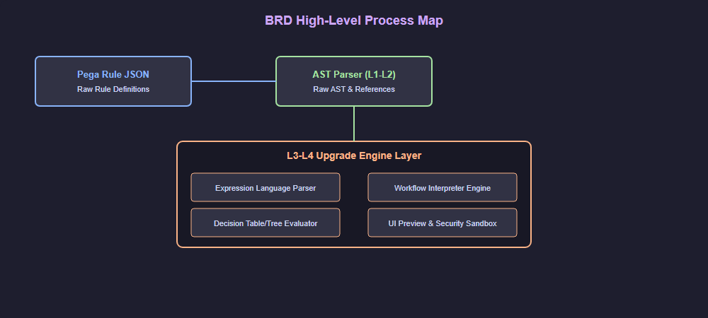
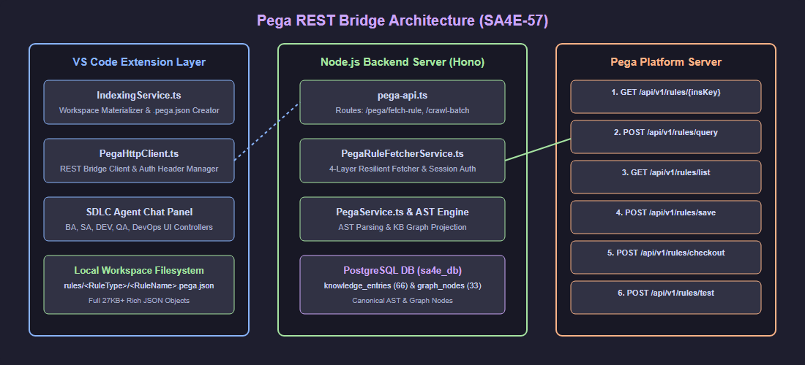
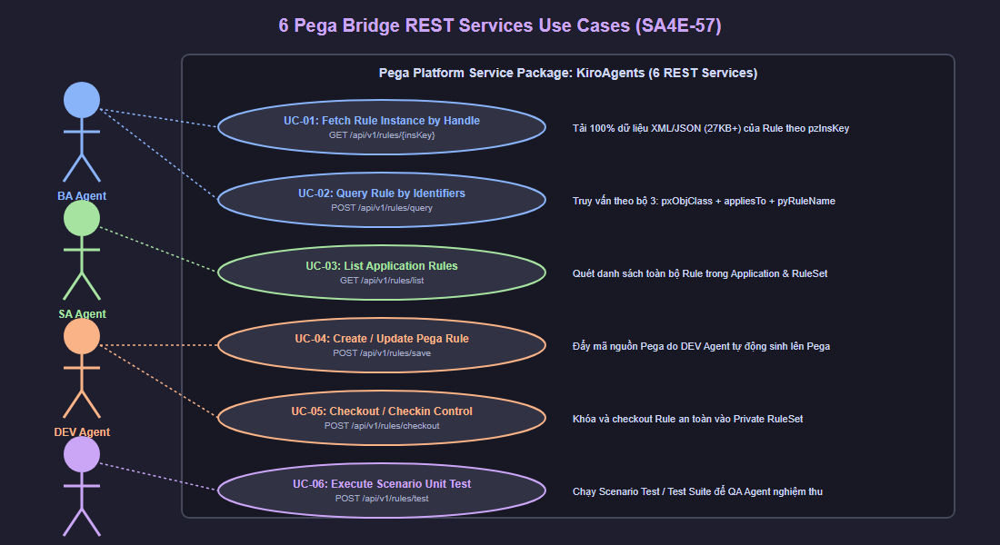
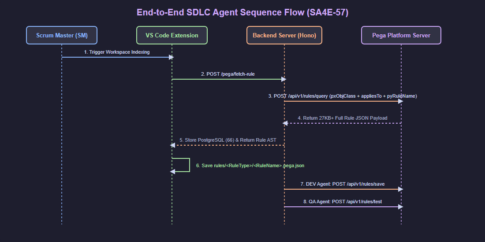

# Business Requirements Document (BRD)

## SDLC Agents 4 Enterprise — SA4E-57: Pega Parser L3-L4 Semantic Understanding & Execution Engine

---

## Document Information

| Field | Value |
|-------|-------|
| Jira Epic | SA4E-57 |
| Title | Pega Parser L3-L4: Semantic Understanding & Execution Engine |
| Author | SM Agent (coordinated: BA, TA, SA, DEV, QA, Security, DevOps) |
| Version | 1.0 |
| Date | 2026-07-27 |
| Status | Draft |

---

## Author Tracking

| Role | Name | Responsibility |
|------|------|----------------|
| Author | Scrum Master Agent | Epic definition, stakeholder coordination, pipeline orchestration |
| Business Analyst | BA Agent | Business requirements, user stories |
| Technical Architect | TA Agent | Technical feasibility, architecture constraints |
| Solution Architect | SA Agent | Technical design, component breakdown |
| Developer | DEV Agent | Implementation planning, effort estimation |
| QA Engineer | QA Agent | Test strategy, quality gates |
| Security Expert | Security Agent | Security assessment, hardening plan |
| DevOps Engineer | DevOps Agent | Deployment considerations, performance targets |

---

## Revision History

| Version | Date | Author | Changes |
|---------|------|--------|---------|
| 1.0 | 2026-07-27 | SM Agent | Initial Epic BRD — synthesized from 7-agent coordination and Pega codebase analysis |

---

## 1. Introduction

### 1.1 Scope

The Pega parser module at `backend/src/modules/pega/` currently operates at **knowledge level (L1-L2)** — it can read Pega rule JSON, build ASTs, extract cross-references, normalize activity logic to pseudocode, and simulate basic rule resolution.

This Epic upgrades the module to **semantic understanding (L3) and execution (L4)** — enabling the system to parse Pega clipboard expressions as typed ASTs, evaluate them against clipboard context, simulate workflow execution, evaluate decision tables/trees, render UI section previews, and enforce security sandboxing.

### 1.2 Out of Scope

- Connecting to a real Pega Platform runtime for live execution
- Running actual work items through a Pega production system
- Pixel-perfect Pega UI rendering (HTML preview only)
- Adaptive Decision Model execution (scorecards, predictive models)
- Real-time SLA timer evaluation (simulated only)
- Full Pega RAL (Rule Accessibility Layer) implementation

### 1.3 Preliminary Requirements

| # | Prerequisite | Owner | Status |
|---|-------------|-------|--------|
| 1 | Pega parser module (L1-L2) deployed and operational (SA4E-56) | DEV | ✅ Done |
| 2 | Corpus of Pega export samples with diverse expression patterns | BA | ⏳ Pending |
| 3 | Security audit of current L1-L2 codebase | Security | ⏳ Phase A |
| 4 | Performance baseline benchmarks (current eval times) | DevOps | ⏳ Phase A |

---

## 2. Business Requirements

### 2.1 High-Level Process Map

  

### 2.2 Epic Structure

| # | Work Package | Type | Priority | Effort | Dependencies |
|---|-------------|------|----------|--------|-------------|
| 1 | Expression Language Parser | Feature | P0 — Critical | 8 wks | Pega expression corpus |
| 2 | Workflow Interpreter Engine | Feature | P0 — Critical | 10 wks | WP1, WP5 |
| 3 | Decision Table/Tree Evaluator | Feature | P1 — High | 6 wks | WP1 |
| 4 | Section/Harness UI Preview | Feature | P2 — Medium | 7 wks | WP1 |
| 5 | Security Hardening | Enabler | P0 — Critical | 3 wks | WP1 evaluator |
| 6 | Test Strategy | Quality | P1 — High | 5 wks | WP1-WP5 APIs |
| 7 | Deployment & Performance | Infrastructure | P1 — High | 3 wks | WP1, WP3 |

### 2.3 User Stories

---

### 2.4 Visual Architecture & Diagram Index

| Diagram ID | Title | Description | File Path |
| :--- | :--- | :--- | :--- |
| `brd-arch` | Pega REST Bridge Architecture | Full System Architecture showing VS Code Extension, Hono Backend, PostgreSQL DB, and Pega Platform Service Package `KiroAgents`. | [brd_architecture.drawio](./diagrams/brd_architecture.drawio) |
| `brd-usecases` | 6 Pega Bridge REST Services Use Cases | Detailed Use Case Diagram for all 6 REST Services mapped to SDLC Agents (BA, SA, DEV, QA, DevOps). | [brd_usecases.drawio](./diagrams/brd_usecases.drawio) |
| `brd-seq` | End-to-End SDLC Agent Sequence Flow | Sequence diagram showing flow from Ticket Indexing ➔ Rule Query ➔ AI Code Gen ➔ Rule Save ➔ Scenario Test. | [brd_sequence.drawio](./diagrams/brd_sequence.drawio) |

#### 2.4.1 System Architecture Diagram
![Pega REST Bridge Architecture]

  

#### 2.4.2 Use Case Diagram — 6 Pega Bridge REST Services
![6 Pega Bridge REST Services Use Cases]

  

#### 2.4.3 End-to-End Sequence Diagram
![End-to-End SDLC Agent Sequence Flow]

  

---

#### STORY 1: Expression Language Parser

> As a **developer**, I want the Pega parser to **understand clipboard expressions** (.Property, @function(args), .AND., etc.) so that **Activity logic can be analyzed, searched, and evaluated instead of stored as opaque strings**.

**Acceptance Criteria:**
1. Lexer tokenizes all expression patterns: property refs, literals, operators, functions
2. Recursive descent parser produces typed ExpressionAST for valid inputs
3. Parser reports meaningful errors (line/column) for invalid inputs
4. Clipboard context model supports nested pages with property type resolution
5. Evaluator walks AST against clipboard context and produces typed values
6. Constraint evaluator and When evaluator use the same expression engine

---

#### STORY 2: Workflow Interpreter Engine

> As a **business analyst**, I want the system to **simulate Pega workflow execution** so that **process flows can be analyzed for bottlenecks, dead paths, and SLA compliance without deploying to Pega**.

**Acceptance Criteria:**
1. Flow shapes + connectors parsed into directed graph with edge conditions
2. Shape handlers for: Assign, Route, Approval, Utility, Subprocess, Wait, Notification, SLA
3. Workflow engine advances work items through the graph, evaluating routing conditions
4. SLA engine calculates goal/deadline/urgency from flow configuration
5. Work item state tracked: current node, history, assignments, SLA data
6. Workflow simulation exposed via API for external tooling

---

#### STORY 3: Decision Table/Tree Evaluator

> As a **rules analyst**, I want to **evaluate Pega decision tables and trees** against input values so that **business logic outcomes can be traced, tested, and documented**.

**Acceptance Criteria:**
1. Decision table rows evaluated in priority order (first match wins)
2. Condition operators: exact match, range, set membership (IN/NOT IN), null check
3. Decision tree nodes evaluated recursively with depth limit
4. Evaluation result includes matched row ID, output value, trace path
5. Strategy component references resolved lazily
6. Fallthrough behavior: default result or meaningful error

---

#### STORY 4: Section/Harness UI Preview

> As a **UI designer**, I want the system to **render Pega UI sections and harnesses as HTML previews** so that **form layouts and field visibility can be reviewed without a Pega Portal session**.

**Acceptance Criteria:**
1. Pega layout types mapped to HTML structures: Dynamic Layout → CSS Grid, Tab Layout → tabs, Repeating Layout → table
2. Field references resolved to property names and types
3. Visibility conditions evaluated (show/hide based on expressions)
4. Harness assembly: header + content + footer sections
5. Static HTML output with inline CSS (no JavaScript dependency)
6. HTML-escaped all user-facing values (XSS prevention)

---

#### STORY 5: Security Hardening

> As a **security officer**, I want the L3-L4 execution capabilities to be **sandboxed and hardened** so that **expression evaluation and workflow simulation cannot be exploited for code execution, DoS, or data exfiltration**.

**Acceptance Criteria:**
1. Expression evaluator runs in sandboxed worker_thread with configurable timeout (default 5s)
2. Function callables restricted to whitelist (no arbitrary code execution)
3. Maximum evaluation depth: 100 nested calls (stack overflow protection)
4. Decision table engine enforces maxRows (10,000) and maxEvalTime (5s)
5. UI renderer HTML-escapes all property values (XSS prevention)
6. No `eval()` or `new Function()` — all evaluation is AST-walk
7. Rate limiter limits concurrent evaluations per request

---

## 3. Dependencies

| Dependency | Type | Description | Source |
|------------|------|-------------|--------|
| Pega parser L1-L2 (SA4E-56) | Internal | Foundation module that L3-L4 extends | SA4E-56 |
| Pega export sample corpus | External | 50+ real Pega expressions, flows, decisions for test fixtures | Pega Platform |
| Node.js worker_threads | Platform | Built-in — available in Node 18+ | Node.js |
| fast-check (property-based testing) | Library | Already in devDependencies | package.json |
| vitest (test runner) | Library | Already configured | vitest.config.ts |

## 4. Stakeholders

| Role | Team | Responsibility |
|------|------|----------------|
| Product Owner | SME / Business | Defines priority, validates expression and workflow understanding |
| Backend Developers | DEV Team | Implement WP1-WP5 expression/flow/decision/UI/security components |
| QA Engineers | QA Team | Create and execute test strategy (WP6) |
| DevOps | DevOps Team | Performance benchmarking, deployment configuration (WP7) |
| Security | Security Team | Security audit, penetration testing (WP5) |

## 5. Risks and Assumptions

### 5.1 Risks

| # | Risk | Impact | Likelihood | Mitigation |
|---|------|--------|------------|------------|
| R1 | Pega expression grammar is undocumented — reverse engineering may be incomplete | High — expressions parse but evaluate incorrectly | High | Build grammar from 50+ real samples; iterate with property-based testing (fast-check finds edge cases); flag unsupported patterns with explicit errors |
| R2 | Pega workflow shapes vary between Pega versions (7.x vs 8.x vs Infinity) | High — flow engine may not handle all shape variants | Medium | Support common shape subset first (Assign, Route, Approval, Utility); add version detection; unknown shapes fall back to generic handler |
| R3 | Decision tables with 100K+ rows cause CPU/memory exhaustion | Medium — DoS vector | Medium | Enforce maxRows (10K), maxEvalTime (5s), worker isolation; reject oversized tables with clear error |
| R4 | Expression evaluator sandbox bypass via prototype pollution | Critical — arbitrary code execution | Low | No `eval()`/`new Function()`; AST-walk only; function whitelist; worker_thread isolation prevents main thread compromise |
| R5 | HTML injection in UI renderer via crafted property values | High — stored XSS | Medium | HTML-escape ALL user-facing values (property labels, descriptions, field values); snapshot tests detect regressions |
| R6 | 42-week total effort is large — team continuity risk | High — scope too large | Medium | Phased delivery: Phase A (11 wks) delivers standalone value; Phase B (16 wks) builds on it; Phase C (12 wks) optional |

### 5.2 Assumptions

- Pega export JSON structure is stable across the versions being targeted
- Node.js 18+ worker_threads provide adequate isolation for expression sandbox
- The existing property type schemas (schemas/auto/ + schemas/rules/) are sufficient for clipboard context type resolution
- Expression evaluation does NOT need to match Pega's evaluation results byte-for-byte — semantic equivalence is sufficient

## 6. Non-Functional Requirements

| Category | Requirement | Target |
|----------|-------------|--------|
| Performance | Simple expression evaluation | < 1ms |
| Performance | Decision table (100 rows, 5 conditions) evaluation | < 200ms |
| Performance | Workflow simulation (50 shapes) | < 500ms |
| Performance | UI section render (100 fields) | < 200ms |
| Security | Expression sandbox timeout | 5s (configurable) |
| Security | Max expression depth | 100 |
| Security | Max decision table rows | 10,000 |
| Concurrency | Worker pool size | `max(1, os.cpus().length - 1)` |
| Availability | Evaluation failures must not crash main process | Worker thread isolation |

## 7. Related Tickets

| Ticket | Summary | Status | Type | Relationship |
|--------|---------|--------|------|--------------|
| SA4E-57 | Pega Parser L3-L4 Semantic Understanding & Execution Engine | To Do | Epic | Main Epic |
| SA4E-56 | Unified Code & Pega Rule Indexing Pipeline | In Progress | Task | Foundation for this Epic |
| -- | WP1: Expression Language Parser | Not Started | Feature | Child of SA4E-57 |
| -- | WP2: Workflow Interpreter Engine | Not Started | Feature | Child of SA4E-57 |
| -- | WP3: Decision Table/Tree Evaluator | Not Started | Feature | Child of SA4E-57 |
| -- | WP4: Section/Harness UI Preview | Not Started | Feature | Child of SA4E-57 |
| -- | WP5: Security Hardening | Not Started | Enabler | Child of SA4E-57 |
| -- | WP6: Test Strategy | Not Started | Quality | Child of SA4E-57 |
| -- | WP7: Deployment & Performance | Not Started | Infrastructure | Child of SA4E-57 |

## 8. Appendix

### 8.1 Reference Documents

| Document | Location |
|----------|----------|
| Pega Parser L3-L4 Upgrade Plan (detailed) | `documents/SA4E-56/pega-parser-upgrade-plan.md` |
| TDD — Unified Code & Pega Rule Indexing Pipeline | `documents/SA4E-56/TDD.md` |
| FSD — Unified Code & Pega Rule Indexing Pipeline | `documents/SA4E-56/FSD.md` |
| Current Pega Module Source | `backend/src/modules/pega/` |

### 8.2 Glossary

| Term | Definition |
|------|------------|
| L1 (Knowledge) | Parse Pega rules into structured AST, but no semantic understanding |
| L2 (Context) | Extract cross-references, normalize to pseudocode, simulate resolution |
| L3 (Semantic) | Understand meaning of expressions, flow shapes, decision conditions |
| L4 (Execution) | Evaluate expressions, simulate workflows, execute decisions |
| Clipboard | Pega's runtime data structure — a tree of pages with typed properties |
| Expression AST | Abstract Syntax Tree representing a parsed Pega clipboard expression |
| Flow Graph | Directed graph of workflow shapes connected by edges with conditions |
| Decision Table | Priority-ordered rows of conditions → results |
| Decision Tree | Conditional branching tree: evaluate node condition → follow matching branch → leaf result |
| Pattern Inheritance | Pega class hierarchy: `MyCo-HR-App-Work` inherits from `MyCo-HR-App-` inherits from `@baseclass` |
| Worker Sandbox | Isolated worker_thread for safe expression evaluation with timeout and resource limits |
